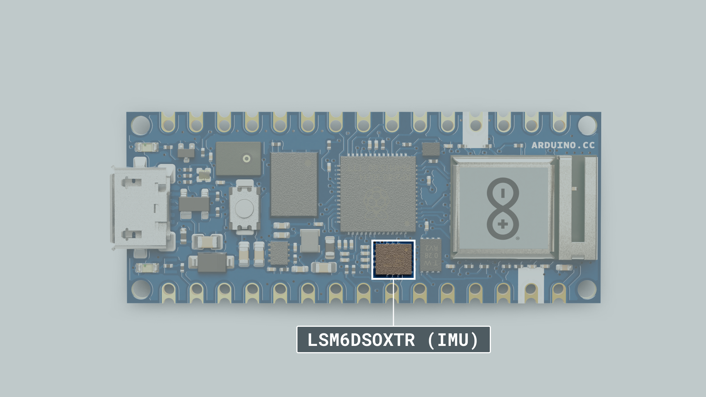
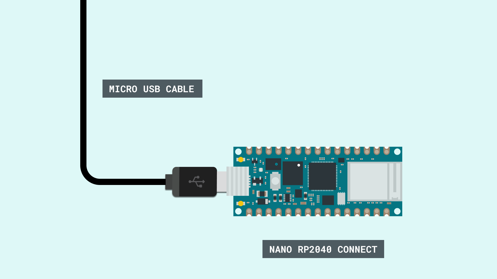
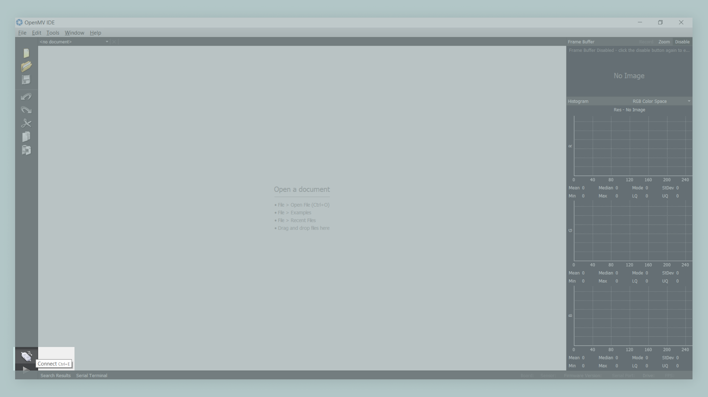
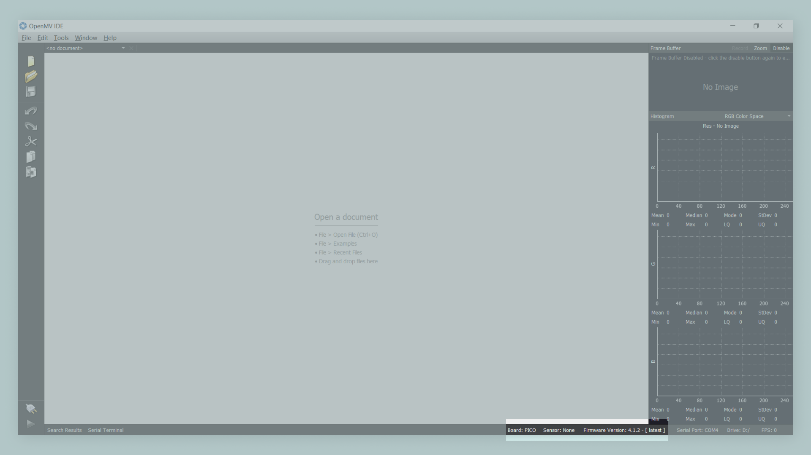
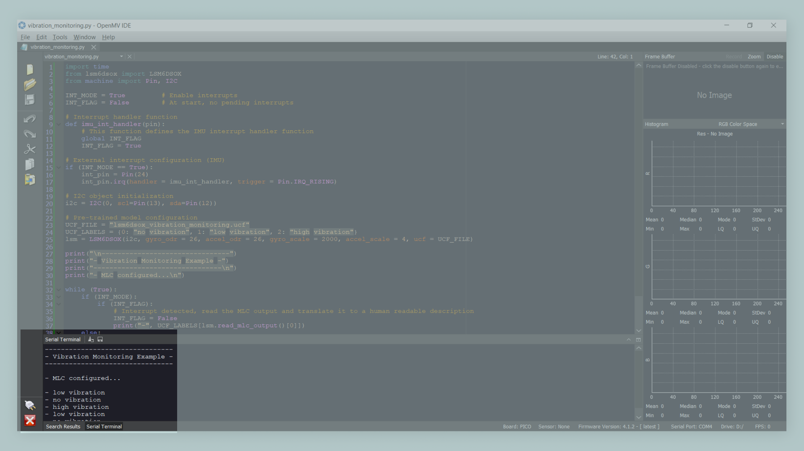

## Introduction

In this tutorial, you will learn how to access the **Machine Learning Core** feature provided by the **LSM6DSOX**, the onboard Inertial Measurement Unit of the Arduino® Nano RP2040 Connect using **MicroPython** and the **OpenMV IDE**. The STMicroelectronics® Machine Learning Core combines several hardware and software tools that help designers implement gesture and activity recognition with Artificial Intelligence at the Edge in sensors through machine learning algorithms based on decision tree classifiers.

***Note: Please refer to [this installation guide](/tutorials/nano-rp2040-connect/rp2040-openmv-setup) if you need help setting up your environment to use your Nano RP2040 Connect board with MicroPython and the OpenMV IDE.***

## Goals

The goals of this tutorial are:

- Detect motion activity such as vibration and head gestures using the Machine Learning Core feature of the Nano RP2040 Connect onboard inertial measurement unit.
- Print motion activity in the Serial Terminal of the OpenMV IDE.

## Hardware and Software Needed

- [Arduino Nano RP2040 Connect board](https://store.arduino.cc/nano-rp2040-connect).    
- [OpenMV IDE](https://openmv.io/pages/download).
- Micro-USB cable (x1).

## Inertial Measurement Unit

An Inertial Measurement Unit (IMU) is a device that can measure an object's specific gravity and angular rate. Typically, an IMU consists of three devices:

* Gyroscope: a device that measures the system's **angular rate**.
* Accelerometer: a device that measures the system's specific **force/acceleration**.
* Magnetometer: an optional device that measures the surrounding **magnetic field** of the system. 

IMU's are typically used to capture **movement** data of a device or a system. The onboard IMU of the Nano RP2040 Connect, the LSM6DSOX from STMicroelectronics®, has an embedded hardware processing engine dedicated to real-time machine learning computing; this means that some machine learning algorithms were moved from the application processor to the LSM6DSOX directly. STMicroelectronics named this embedded processing engine of the LSM6DSOX **Machine Learning Core** (MLC).



In the MLC, machine learning processing is implemented through a **decision-tree** logic. A decision tree is a mathematical tool composed of a series of configurable nodes; each node is characterized by an "if-then-else" condition where an input signal (represented by statistical parameters calculated from the sensor data) is evaluated against a certain threshold. The decision tree results can be read from the application processor at any time and there is also the possibility to generate an interrupt for every change in the result in the decision tree.

## Using the MLC for Vibration Monitoring

We will use the LSM6DSOX accelerometer from our Nano RP2040 Connect board, its MLC, and a pre-trained model to implement a simple **vibration monitoring** script. With this script, and the pre-trained model, **three** types of vibrations can be detected:

1. No vibration.
2. Low vibration.
3. High vibration.

### Circuit



### Acceleromenter Configuration

For the vibration monitoring application, the LSM6DSOX accelerometer is configured with **±4g full scale** and a **26 Hz output data rate**; any sensor orientation is allowed. 

### Machine Learning Core Configuration

For the vibration monitoring application, just **one feature** has been used (peak-to-peak) and applied to the accelerometer norm squared input. The **MLC runs at 26 Hz**, computing features on windows of 16 samples (more or less, every 0.6 seconds). **One decision tree with just two nodes** has been configured to detect the different classes; an **interrupt** (pulsed and active high) is generated every time a new vibration type is detected.

## Vibration Monitoring Code

We will now get to the programming part of this tutorial.

**1. Setting Up**

Plug in your Nano RP2040 Connect board to your computer and open the OpenMV IDE; press the "Connect" button that is located in the lower left corner of the IDE. 



The "Connect" button should change now. When the board is connected, information about it should be displayed in the lower status bar. **Make sure that the latest OpenMV firmware is uploaded to your board**, you can check the latest OpenMV firmware release [here](https://github.com/openmv/openmv).



Now, **download the pre-trained model** for the vibration monitoring application and copy it to your Nano RP2040 Connect board storage. The pre-trained model for the vibration monitoring can be found [here](https://github.com/STMicroelectronics/STMems_Machine_Learning_Core/tree/master/application_examples/lsm6dsox/Vibration%20monitoring) as well other pre-trained models for different examples and applications. 

**2. Creating the Script**

First, let's **import some modules** into the script that will help you control your board:

```python
import time
from lsm6dsox import LSM6DSOX
from machine import Pin, I2C
```

Now, let's **enable interrupts**. At start, the interrupt flag is set to `FALSE` (this means that there are no pending interrupts at start):

```python
INT_MODE = True         # Enable interrupts
INT_FLAG = False        # At start, no pending interrupts
```

Now, let's **define the IMU interrupt handler**; the interrupt handler is a function that is going to be executed when an interrupt from the IMU is generated. This function, when executed, is going to update the value of `INT_FLAG` to `True`:

```python
# Interrupt handler function
def imu_int_handler(pin):
    # This function defines the IMU interrupt handler function
    global INT_FLAG
    INT_FLAG = True
```

Now, let's **configure the IMU interrupt** in our board. For configuring the interrupt, we need to specify the interrupt pin (**GPIO 24** for this example), the interrupt handler function and the type of trigger of the interrupt (**rising edge**, this means a change from low to high): 

```python
# External interrupt configuration (IMU)
if (INT_MODE == True):
    int_pin = Pin(24)
    int_pin.irq(handler = imu_int_handler, trigger = Pin.IRQ_RISING)
```
Now, let's create a **I2C object**, passing pins 13 and 12 for SCL and SDA:

```python
# I2C object initialization
i2c = I2C(0, scl=Pin(13), sda=Pin(12))
```

Now, let's **configure the pre-trained model** for the vibration monitoring application. For configuring the pre-trained model in our sketch, we must define first the name of the file we copied into our Nano RP2040 Connect board storage before, the labels of the model and then initialize an IMU object with this file; notice that the selected data rate and scale matches the MLC data rate and scale described before [here](#machine-learning-core-configuration):

```python
# Pre-trained model definition and IMU object initialization
UCF_FILE = "lsm6dsox_vibration_monitoring.ucf"
UCF_LABELS = {0: "no vibration", 1: "low vibration", 2: "high vibration"}
lsm = LSM6DSOX(i2c, gyro_odr = 26, accel_odr = 26, gyro_scale = 2000, accel_scale = 4, ucf = UCF_FILE)
```

Now that we have the IMU ready, its time to start getting interrupts from it when a certain type of vibration is recognized. For this, we are going to keep looking for the interrupt flag `INT_FLAG` to change from `FALSE` to `TRUE`. If the value of `INT_FLAG` is `TRUE`, the MLC output is read and translated into a human readable description of the detected vibration:  

```python
print("\n--------------------------------")
print("- Vibration Monitoring Example -")
print("--------------------------------\n")
print("- MLC configured...\n")

while (True):
    if (INT_MODE):
        if (INT_FLAG):
            # Interrupt detected, read the MLC output and translate it to a human readable description
            INT_FLAG = False
            print("-", UCF_LABELS[lsm.read_mlc_output()[0]])
    else:
        buf = lsm.read_mlc_output()
        if (buf != None):
            print(UCF_LABELS[buf[0]])
```
### Complete Script

If you choose to skip the code building section, the complete script can be found below:

```python
# LSM6DSOX IMU MLC (Machine Learning Core) Example.
# Application: Vibration monitoring.
# Original example script by OpenMV team, modified by José Bagur.

import time
from lsm6dsox import LSM6DSOX
from machine import Pin, I2C

INT_MODE = True         # Enable interrupts
INT_FLAG = False        # At start, no pending interrupts

# Define the interrupt handler function.
def imu_int_handler(pin):
    global INT_FLAG
    INT_FLAG = True

# Configure the external interrupt (IMU).
if (INT_MODE == True):
    int_pin = Pin(24)
    int_pin.irq(handler = imu_int_handler, trigger = Pin.IRQ_RISING)

# Initialize an I2C object. 
i2c = I2C(0, scl=Pin(13), sda=Pin(12))

# Pre-trained model configuration
# NOTE: Selected data rate and scale must match the MLC data rate and scale configuration.
UCF_FILE = "lsm6dsox_vibration_monitoring.ucf"
UCF_LABELS = {0: "no vibration", 1: "low vibration", 2: "high vibration"}
lsm = LSM6DSOX(i2c, gyro_odr = 26, accel_odr = 26, gyro_scale = 2000, accel_scale = 4, ucf = UCF_FILE)

print("\n--------------------------------")
print("- Vibration Monitoring Example -")
print("--------------------------------\n")
print("- MLC configured...\n")

while (True):
    if (INT_MODE):
        if (INT_FLAG):
            # Interrupt detected, read the MLC output and translate it to a human readable description
            INT_FLAG = False
            print("-", UCF_LABELS[lsm.read_mlc_output()[0]])
    else:
        buf = lsm.read_mlc_output()
        if (buf != None):
            print(UCF_LABELS[buf[0]])
```

Now you are ready to upload and run the script to your board. Press the green "Start" button that is located in the lower left corner of the IDE.

## Testing Vibration Detection

After successfully uploading the code to the board, open OpenMV IDE's Serial Terminal. If the board is not moving at all, e.g. standing still at a table, the Serial Terminal will print `No vibration` after a few seconds. If you now move your Nano RP2040 Connect board continuously, the Serial Terminal will print `Low vibration` or `High vibration`, depending on how your board is moving. 



## Troubleshoot

If the code is not working, there are some common issues you can troubleshoot:

- Your board doesn't have uploaded the latest release of the OpenMV firmware. 
- Your board doesn't have uploaded the pre-trained model into its storage. 
- An incorrect pin number was assigned to the IMU interrupt. Make sure that pin 24 is assigned to it.
- You have a faulty Micro-USB cable; try with a different cable.

## Conclusion

In this tutorial, you have learned how to use the Nano RP2040 Connect IMU's MLC with a pre-trained model to detect various activity types. With these embedded machine learning capabilities, certain types of motion can be easily detected by the  onboard IMU of the Nano RP2040 Connect. If you want more learn more about the MLC from STMicroelectronics, check out this [repository](https://github.com/STMicroelectronics/STMems_Machine_Learning_Core) from STMicroelectronics on GitHub that provides detailed information, examples and configurations of the MLC. 