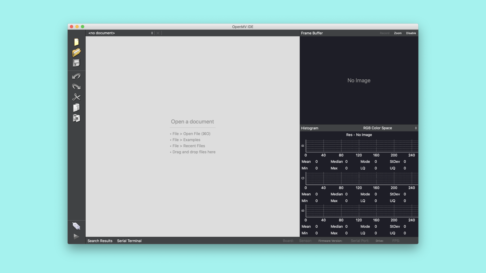
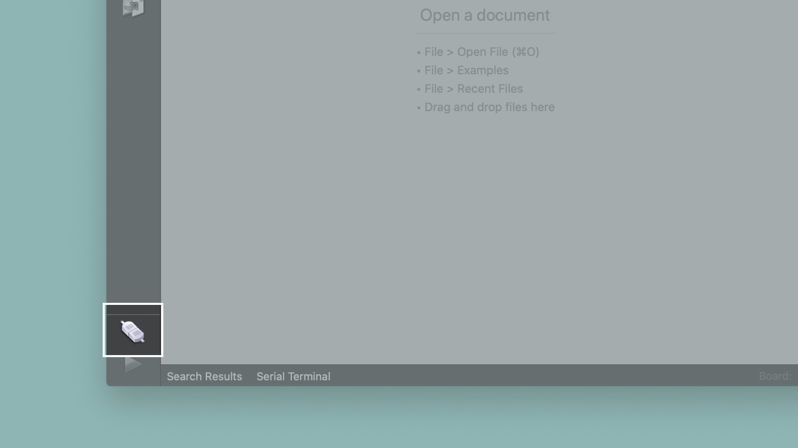
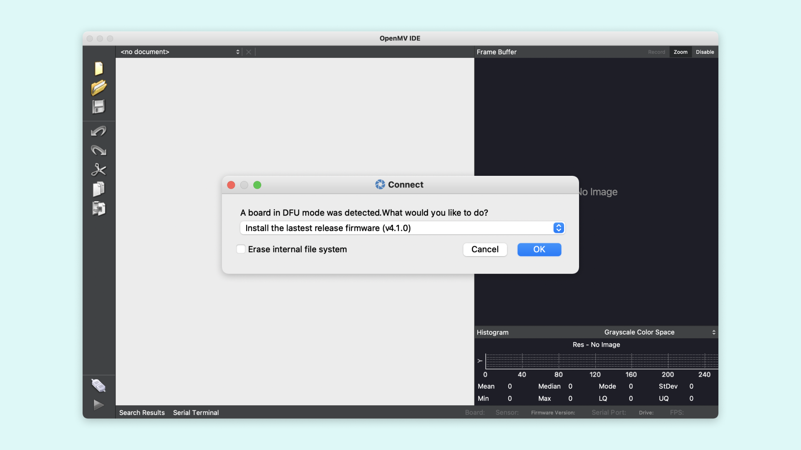
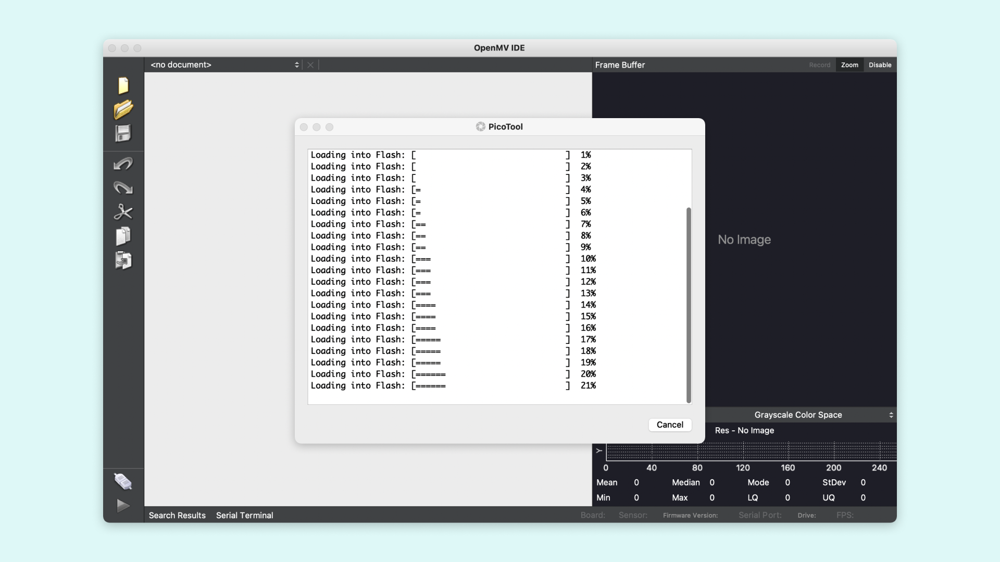
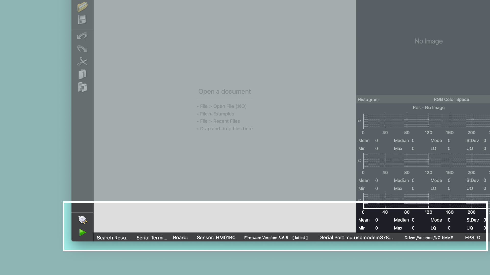

To make the Arduino Nano RP2040 Connect able to connect with the OpenMV IDE and allow us to write scripts in MicroPython we first need to update its firmware. This tutorial will show you how to make the Nano RP2040 Connect work with OpenMV. We will first go through how to update the board's firmware, to make it compatible with OpenMV. Then we will run a simple script on the board using OpenMV.

## Activating the Bootloader Mode

First we need to forcefully trigger the bootloader so that OpenMV can install the required firmware on our board. You can do that by double tapping the reset button on the board. A mass store device named `RPI-RP2` should mount automatically. If this doesn't work, follow the steps below to force the board into bootloader mode.

### Forcing the Bootloader

Begin by disconnecting the board from your computer by removing the USB cable. Now place a jumper wire between the REC and GND pins on the board, then connect the board to your computer.


When the board is connected, it will open a mass storage device. You can now remove the jumper wire.

## Installing the OpenMV Firmware

If you haven't already, download and install the [OpenMV](https://openmv.io/pages/download) IDE. Download the version that you need for your operating system and follow the instructions of the installer.



With the Nano RP2040 Connect connected to your computer and put into bootloader mode, click on the "connect" symbol at the bottom of the left toolbar .



A pop-up will ask you how you would like to proceed "A board in DFU mode was detected. What would you like to do?". Select "Install the latest release firmware". This will install the latest OpenMV firmware. If it asks you whether it should erase the internal file system you can click "No".



A terminal window will open which shows you the upload progress. You will see a message saying "DFU firmware update complete!" when the process is done.



***Installing the OpenMV firmware will overwrite any existing sketches in the internal Flash of your board. Also the board's port won't be accessible in the Arduino IDE anymore. To re-flash the board with an Arduino firmware you need to put the board into bootloader mode. To do so please refer to the section "Activating the Bootloader Mode".***

After confirming the completion dialog the board should already be connected to the OpenMV IDE, otherwise click the "connect" button once again.

If everything went correctly you should see a green "play" button appear instead of the "connect" symbol in the OpenMV IDE. Now you are ready to run MicroPython scripts on your Nano RP2040 Connect with OpenMV. Simply write your script in the IDE and press the play button to run it.



## Creating the Blink Script

Now let's create a version of the classic Arduino blink example with MicroPython in OpenMV. 

### Importing MicroPython Modules

First, we need to import some modules in our script, to help us control the board with MicroPython. We do this by adding these lines of code at the beginning of our script.

```python
import time
from machine import Pin
```

Importing `Pin` from the `machine` module, allows us to control the pin corresponding to the built-in LED on the board. The `time` module will help us with timed functions, such as a delay.

### Making the LED Blink

Now let's take a look at how to create the main loop of the script. The main loop will turn on the LED, wait a short moment, turn it off and repeat. But first, we need to define the variable that control the LED.

```python
led = Pin(6, Pin.OUT)
```

The built-in LED on the board can now be easily controlled with this variable.

```python
while (True):
    led.on()
    time.sleep_ms(250)
    led.off()
    time.sleep_ms(250)
```

We use the function `time.sleep_ms()` to determine the length of the delay between turning the LED on and off. The number inside the parentheses indicates how many milliseconds the delay should last. Putting the code inside a `while (true)` function will make it run in a continuous loop.

## Running the Script in OpenMV

To run the script with OpenMV on your board, enter all the code previously explained into an empty script, then simply press the green play button in the lower left corner.


The complete script is as follows:

```python
import time
from machine import Pin

# This is the only LED pin available on the Nano RP2040,
# other than the RGB LED connected to Nina Wi-Fi module.
led = Pin(6, Pin.OUT)

while (True):
    led.on()
    time.sleep_ms(250)
    led.off()
    time.sleep_ms(250)
```

If everything went correctly the built-in LED should blink.

## Conclusion

In this tutorial we went through how to make the Nano RP2040 Connect compatible with OpenMV. We also looked at how to use the basic connect and upload features in the OpenMV IDE to upload a simple MicroPython script. The tutorial also showed the basics of creating a MicroPython script.