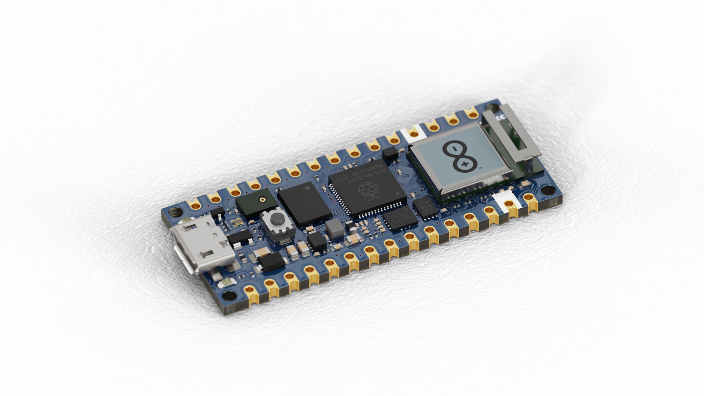
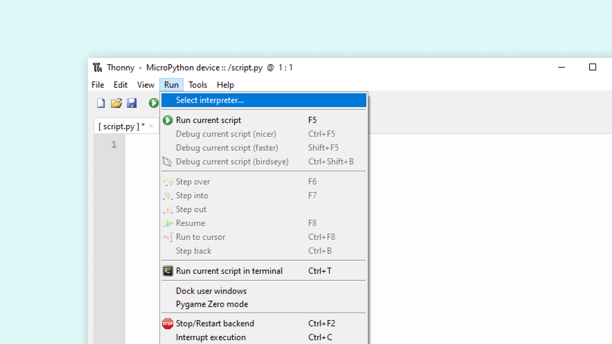
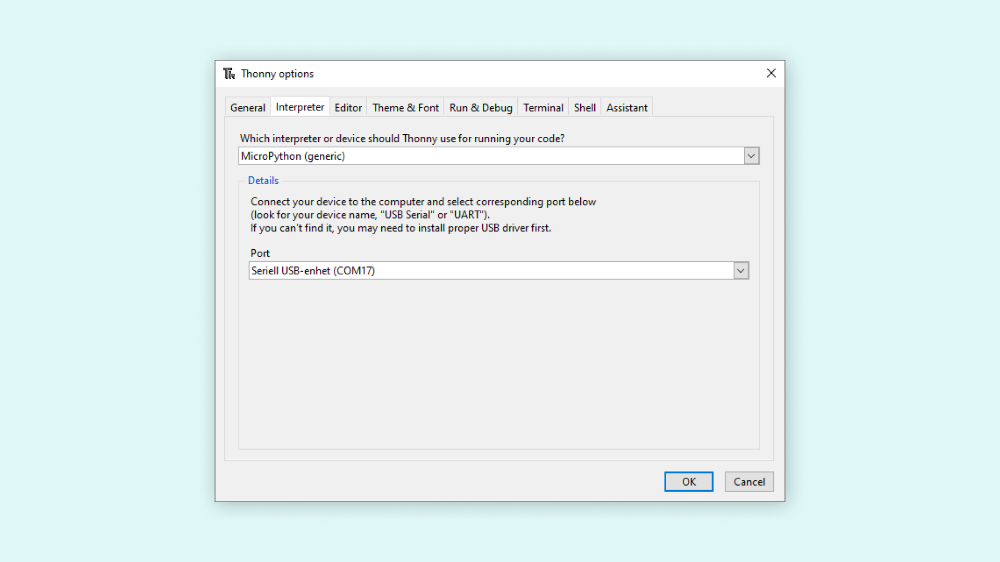

The [Nano RP2040 Connect](https://store.arduino.cc/nano-rp2040-connect) board can be programmed using the popular **Python®** programming language. The board is supported by upstream [MicroPython](https://github.com/micropython/micropython) and [OpenMV's fork of MicroPython](https://github.com/openmv/micropython), where **MicroPython** is an implementation of the Python® language, designed to run on microcontrollers. 

In this article, you will find a lot of sample scripts that will work directly with your Nano RP2040 Connect, such as general GPIO control, reading onboard sensors and Wi-Fi/BLE communication!

- If you want to read more about Arduino & Python®, you can visit the [Python® with Arduino](/learn/programming/arduino-and-python) article. Here you will find a lot of useful examples, such as how to use delays, interrupts, reading pins and more general functions.

## Hardware Requirements

- [Arduino Nano RP2040 Connect](https://store.arduino.cc/nano-rp2040-connect)

## Software Requirements

- [OpenMV IDE](https://openmv.io/pages/download) or
- An editor supporting MicroPython, such as [Thonny](https://thonny.org/).

## OpenMV Installation

To install the OpenMV IDE and load scripts to your board, you can refer to [Getting started with OpenMV and Nano RP2040 Connect](/tutorials/nano-rp2040-connect/rp2040-openmv-setup). 

## MicroPython Installation

To install upstream MicroPython and load scripts to your board, you will need to follow a few simple steps:

**1.** Connect your board to your computer via USB.

**2.** Download and install the [Thonny Editor](https://thonny.org/) (or other preferred editors).

**3.** Download the `.uf2` file from the [Nano RP2040 Connect's nightly build page](https://micropython.org/download/ARDUINO_NANO_RP2040_CONNECT/)

**4.** Place a jumper wire between the REC and GND pins on the board, then press the **RESET** button. This will open mass storage.


**5.** Drag and drop the `.uf2` file into mass storage. This will install MicroPython on your board.

**6.** In the **Thonny Editor**, navigate to **Run > Select Interpreter**. 



**7.** Select **MicroPython(generic)** and from port, select your device (in this case, it is COM17).



**8.** Write a Python® script (or select any example from the list below), and click on the **Green Play Button (F5)** to run it on your board.

Congratulations! You can now run MicroPython scripts on your Nano RP2040 Connect board!

***You can visit the [docs for MicroPython](https://docs.micropython.org/en/v1.15/) to get a better overview of the MicroPython API.***

## API

Below you will find a lot of useful examples that can be loaded to your Nano RP2040 Connect board. Many of these examples were extracted from the [OpenMV repository](https://github.com/openmv/openmv), where you can find many useful examples for other boards as well.

***In this article, you will only find examples for the Nano RP2040 Connect board. For more information on how to use delays, read and write to pins, please refer to the [Python® with Arduino](/learn/programming/arduino-and-python) main article.***

## GPIO Map

The pinout for the **Nano RP2040 Connect** and the **RP2040 microcontroller** varies greatly. For example, if we are to use `D2` according to the Arduino pinout, we would actually need to use **pin 25**.

```python
# Defining "D2" on the Arduino Nano RP2040 Connect
p0 = Pin(25, Pin.OUT)
```

Before you start using the board's pins, it might be a good idea to check out the table below to understand the relationship between Arduino's pinout and the RP2040's pinout.

| Arduino | RP2040 | Usage         |
| ------- | ------ | ------------- |
| TX      | GPIO0  | UART/TX       |
| RX      | GPIO1  | UART/RX       |
| D2      | GPIO25 | GPIO          |
| D3      | GPIO15 | GPIO          |
| D4      | GPIO16 | GPIO          |
| D5      | GPIO17 | GPIO          |
| D6      | GPIO18 | GPIO          |
| D7      | GPIO19 | GPIO          |
| D8      | GPIO20 | GPIO          |
| D9      | GPIO21 | GPIO          |
| D10     | GPIO5  | GPIO          |
| D11     | GPIO7  | SPI/COPI      |
| D12     | GPIO4  | SPI/CIPO      |
| D13     | GPIO6  | SPI/SCK       |
| D14/A0  | GPIO26 | ADC/RP2040    |
| D15/A1  | GPIO27 | ADC/RP2040    |
| D16/A2  | GPIO28 | ADC/RP2040    |
| D17/A3  | GPIO29 | ADC/RP2040    |
| D18/A4  | GPIO12 | I2C           |
| D19/A5  | GPIO13 | I2C           |
| D20/A6  | GPIO36 | ADC/NINA-W102 |
| D21/A7  | GPIO35 | ADC/NINA-W102 |

***Note that pins A4, A5 are used as an I2C bus and are not recommended to be used as analog pins.***


### Analog Pins

To read the analog pins on the Nano RP2040 Connect, we can choose from the following pins:

- A0 - `26`
- A1 - `27`
- A2 - `28`
- A3 - `29`
- A4 - `12` (I2C bus, not recommended to use)
- A5 - `13` (I2C bus, not recommended to use)
- A6 - `36` (Connected to the NINA module)
- A7 - `35` (Connected to the NINA module)

To define them, we need to import the `machine` module, and define the pin as follows: 

```python
import machine

adc_pin = machine.Pin(29)
adc = machine.ADC(adc_pin)
```

To read the analog pin, simply use:

```python
reading = adc.read_u16() #16-bit resolution (0-65535)
```

The below script will read the `A3` pin on the Nano RP2040 Connect and print the value in the terminal.

```python
import machine
import time

adc_pin = machine.Pin(29) # A3
adc = machine.ADC(adc_pin)

while True:
    reading = adc.read_u16()     
    print("ADC: ",reading)
    time.sleep_ms(500)
```

## Sensors

### IMU (LSM6DSOX)

Prints the accelerometer and gyroscope values in the Serial Monitor.

```python
import time
from lsm6dsox import LSM6DSOX

from machine import Pin, I2C
lsm = LSM6DSOX(I2C(0, scl=Pin(13), sda=Pin(12)))

while (True):
    print('Accelerometer: x:{:>8.3f} y:{:>8.3f} z:{:>8.3f}'.format(*lsm.read_accel()))
    print('Gyroscope:     x:{:>8.3f} y:{:>8.3f} z:{:>8.3f}'.format(*lsm.read_gyro()))
    print("")
    time.sleep_ms(100)
```

### Microphone (MP34DT06JTR)

Below example can be used with OpenMV's frame buffer window (top right corner).

```python
import image, audio, time
from ulab import numpy as np
from ulab import scipy as sp

CHANNELS = 1
FREQUENCY = 32000
N_SAMPLES = 32 if FREQUENCY == 16000 else 64
SCALE = 2
SIZE = (N_SAMPLES * SCALE) // CHANNELS

raw_buf = None
fb = image.Image(SIZE+(50*SCALE), SIZE, image.RGB565, copy_to_fb=True)
audio.init(channels=CHANNELS, frequency=FREQUENCY, gain_db=16)

def audio_callback(buf):
    # NOTE: do Not call any function that allocates memory.
    global raw_buf
    if (raw_buf == None):
        raw_buf = buf

# Start audio streaming
audio.start_streaming(audio_callback)

def draw_fft(img, fft_buf):
    fft_buf = (fft_buf / max(fft_buf)) * SIZE
    fft_buf = np.log10(fft_buf + 1) * 20
    color = (0xFF, 0x0F, 0x00)
    for i in range(0, len(fft_buf)):
        img.draw_line(i*SCALE, SIZE, i*SCALE, SIZE-int(fft_buf[i]) * SCALE, color, SCALE)

def draw_audio_bar(img, level, offset):
    blk_size = (SIZE//10)
    color = (0xFF, 0x00, 0xF0)
    blk_space = (blk_size//4)
    for i in range(0, int(round(level/10))):
        fb.draw_rectangle(SIZE+offset, SIZE - ((i+1)*blk_size) + blk_space, 20 * SCALE, blk_size - blk_space, color, 1, True)

while (True):
    if (raw_buf != None):
        pcm_buf = np.frombuffer(raw_buf, dtype=np.int16)
        raw_buf = None

        if CHANNELS == 1:
            fft_buf = sp.signal.spectrogram(pcm_buf)
            l_lvl = int((np.mean(abs(pcm_buf[1::2])) / 32768)*100)
        else:
            fft_buf = sp.signal.spectrogram(pcm_buf[0::2])
            l_lvl = int((np.mean(abs(pcm_buf[1::2])) / 32768)*100)
            r_lvl = int((np.mean(abs(pcm_buf[0::2])) / 32768)*100)

        fb.clear()
        draw_fft(fb, fft_buf)
        draw_audio_bar(fb, l_lvl, 0)
        draw_audio_bar(fb, l_lvl, 25*SCALE)
        if CHANNELS == 2:
            draw_audio_bar(fb, r_lvl, 25 * SCALE)
        fb.flush()

# Stop streaming
audio.stop_streaming()
```

## Communication

### I2C

Scans for devices connected to the I2C buses:

```python
import time
from machine import Pin, I2C

i2c_list    = [None, None]
i2c_list[0] = I2C(0, scl=Pin(13), sda=Pin(12), freq=100_000)
i2c_list[1] = I2C(1, scl=Pin(7), sda=Pin(6), freq=100_000)

for bus in range(0, 2):
    print("\nScanning bus %d..."%(bus))
    for addr in i2c_list[bus].scan():
        print("Found device at address %d:0x%x" %(bus, addr))
```

### UART

To read data and write data through TX and RX pins, you can use `uart.write()` and `uart.read()`.

```python
from machine import UART, Pin
import time

uart = UART(0, baudrate=9600, tx=Pin(0), rx=Pin(1))

while True:
   uart.write('hello') # writes 5 bytes
   val = uart.read(5)  # reads up to 5 bytes
   print(val) # prints data
   time.sleep(1)
```

## Wireless

Below are examples on wireless connectivity, using the NINA-W102 module onboard the Nano RP2040 Connect. 

***In order to use these examples, you may have to upgrade your firmware. You can find instructions on how to in [Upgrading Nano RP2040 Connect NINA firmware](/tutorials/nano-rp2040-connect/rp2040-upgrading-nina-firmware).***

### Wi-Fi AP Mode

Turn your board into an access point:

```python
# Wi-Fi AP Mode Example
#
# This example shows how to use Wi-Fi in Access Point mode.
import network, socket, sys, time, gc

SSID ='My_Nano_RP2040_Connect'   # Network SSID
KEY  ='1234567890'  # Network key (must be 10 chars)
HOST = ''           # Use first available interface
PORT = 8080         # Arbitrary non-privileged port

# Init wlan module and connect to network
wlan = network.WLAN(network.AP_IF)
wlan.active(True)
wlan.config(essid=SSID, key=KEY, security=wlan.WEP, channel=2)
print("AP mode started. SSID: {} IP: {}".format(SSID, wlan.ifconfig()[0]))

def recvall(sock, n):
    # Helper function to recv n bytes or return None if EOF is hit
    data = bytearray()
    while len(data) < n:
        packet = sock.recv(n - len(data))
        if not packet:
            raise OSError("Timeout")
        data.extend(packet)
    return data

def start_streaming(server):
    print ('Waiting for connections..')
    client, addr = server.accept()

    # set client socket timeout to 5s
    client.settimeout(5.0)
    print ('Connected to ' + addr[0] + ':' + str(addr[1]))

    # FPS clock
    clock = time.clock()
    while (True):
        try:
            # Read data from client
            data = recvall(client, 1024)
            # Send it back
            client.send(data)
        except OSError as e:
            print("start_streaming(): socket error: ", e)
            client.close()
            break

while (True):
    try:
        server = socket.socket(socket.AF_INET, socket.SOCK_STREAM)
        # Bind and listen
        server.bind([HOST, PORT])
        server.listen(1)

        # Set server socket to blocking
        server.setblocking(True)
        while (True):
            start_streaming(server)
    except OSError as e:
        server.close()
        print("Server socket error: ", e)
```

### Wi-Fi Scan

To scan available networks:

```python
# Scan Example

# This example shows how to scan for Wi-Fi networks.

import time, network

wlan = network.WLAN(network.STA_IF)
wlan.active(True)

print("Scanning...")
while (True):
    scan_result = wlan.scan()
    for ap in scan_result:
        print("Channel:%d RSSI:%d Auth:%d BSSID:%s SSID:%s"%(ap))
    print()
    time.sleep_ms(1000)
```

### HTTP Request

Making an HTTP request (in this case to google):

***Remember to enter your network name and password inside the SSID and KEY variables.***

```python
import network, socket

# AP info
SSID='' # Network SSID
KEY=''  # Network key

PORT = 80
HOST = "www.google.com"

# Init wlan module and connect to network
print("Trying to connect. Note this may take a while...")

wlan = network.WLAN(network.STA_IF)
wlan.active(True)
wlan.connect(SSID, KEY)

# We should have a valid IP now via DHCP
print("Wi-Fi Connected ", wlan.ifconfig())

# Get addr info via DNS
addr = socket.getaddrinfo(HOST, PORT)[0][4]
print(addr)

# Create a new socket and connect to addr
client = socket.socket(socket.AF_INET, socket.SOCK_STREAM)
client.connect(addr)

# Set timeout
client.settimeout(3.0)

# Send HTTP request and recv response
client.send("GET / HTTP/1.1\r\nHost: %s\r\n\r\n"%(HOST))
print(client.recv(1024))

# Close socket
client.close()
```

### NTP (Network Time Protocol)

***Remember to enter your network name and password inside the SSID and KEY variables.***

Obtain accurate time and date from the Internet:

```python
# NTP Example
#
# This example shows how to get the current time using NTP

import network, usocket, ustruct, utime

# AP info
SSID='' # Network SSID
KEY=''  # Network key

TIMESTAMP = 2208988800

# Init wlan module and connect to network
print("Trying to connect... (may take a while)...")

wlan = network.WLAN()
wlan.active(True)
wlan.connect(SSID, key=KEY, security=wlan.WPA_PSK)

# We should have a valid IP now via DHCP
print(wlan.ifconfig())

# Create new socket
client = usocket.socket(usocket.AF_INET, usocket.SOCK_DGRAM)
client.bind(("", 8080))
#client.settimeout(3.0)

# Get addr info via DNS
addr = usocket.getaddrinfo("pool.ntp.org", 123)[0][4]

# Send query
client.sendto('\x1b' + 47 * '\0', addr)
data, address = client.recvfrom(1024)

# Print time
t = ustruct.unpack(">IIIIIIIIIIII", data)[10] - TIMESTAMP
print ("Year:%d Month:%d Day:%d Time: %d:%d:%d" % (utime.localtime(t)[0:6]))
```

In the terminal, we should see it in this format:

```
Year:2021 Month:8 Day:10 Time: 7:56:30
```

### Bluetooth® Low Energy

This example allows us to connect to our board via our phone, and control the built-in LED.  We recommend using the **nRF Connect** applications.

- [nRF desktop](https://www.nordicsemi.com/Products/Development-tools/nrf-connect-for-desktop)
- [nRF mobile](https://www.nordicsemi.com/Products/Development-tools/nrf-connect-for-mobile)

***After loading the script below, your board should be listed as "Nano RP2040 Connect" in the list of available devices. You need to pair in order to control the built-in LED.*** 

```python
import bluetooth
import random
import struct
import time
from ble_advertising import advertising_payload
from machine import Pin
from micropython import const

LED_PIN = 6

_IRQ_CENTRAL_CONNECT = const(1)
_IRQ_CENTRAL_DISCONNECT = const(2)
_IRQ_GATTS_WRITE = const(3)

_FLAG_READ = const(0x0002)
_FLAG_WRITE = const(0x0008)
_FLAG_NOTIFY = const(0x0010)
_FLAG_INDICATE = const(0x0020)

_SERVICE_UUID = bluetooth.UUID(0x1523)
_LED_CHAR_UUID = (bluetooth.UUID(0x1525), _FLAG_WRITE)
_LED_SERVICE = (_SERVICE_UUID, (_LED_CHAR_UUID,),)

class BLETemperature:
    def __init__(self, ble, name="NANO RP2040"):
        self._ble = ble
        self._ble.active(True)
        self._ble.irq(self._irq)
        ((self._handle,),) = self._ble.gatts_register_services((_LED_SERVICE,))
        self._connections = set()
        self._payload = advertising_payload(name=name, services=[_SERVICE_UUID])
        self._advertise()

    def _irq(self, event, data):
        # Track connections so we can send notifications.
        if event == _IRQ_CENTRAL_CONNECT:
            conn_handle, _, _ = data
            self._connections.add(conn_handle)
        elif event == _IRQ_CENTRAL_DISCONNECT:
            conn_handle, _, _ = data
            self._connections.remove(conn_handle)
            # Start advertising again to allow a new connection.
            self._advertise()
        elif event == _IRQ_GATTS_WRITE:
            Pin(LED_PIN, Pin.OUT).value(int(self._ble.gatts_read(data[-1])[0]))
            
    def _advertise(self, interval_us=500000):
        self._ble.gap_advertise(interval_us, adv_data=self._payload)

if __name__ == "__main__":
    ble = bluetooth.BLE()
    temp = BLETemperature(ble)
    
    while True:
        time.sleep_ms(1000)
```

## Summary

In this article we have gone through a selection of scripts that will help you control your Nano RP2040 Connect board, via the OpenMV IDE. Feel free to check out our [Python® with Arduino boards article](/learn/programming/arduino-and-python), where you can find guides to other boards, useful links to learn Python® and more.
