## Introduction 

In some cases you might need to upgrade your NINA-W102 module's firmware. There is for example a need to upgrade your firmware if you wish to [use the NINA-W102 module via Python®](https://docs.arduino.cc/tutorials/nano-rp2040-connect/rp2040-python-api#wireless). 

***If you are using the [Arduino Cloud IoT](https://create.arduino.cc/iot/things), manual firmware upgrades are not necessary, as it is done automatically while configuring your board.***


## Goals

In this article, we will cover three methods to upgrade your NINA module's firmware:

- Through the [Arduino Cloud](https://create.arduino.cc/iot/things).
- Through the [Arduino IDE 2](https://docs.arduino.cc/software/ide-v2/tutorials/ide-v2-fw-cert-uploader).
- Through the [arduino-fwuploader](https://github.com/arduino/arduino-fwuploader) tool (advanced).

## Hardware & Software Needed

- [Arduino Nano RP2040 Connect](https://store.arduino.cc/nano-rp2040-connect)
- [Arduino IDE 2](https://www.arduino.cc/en/software)
- [arduino-fwuploader tool](https://github.com/arduino/arduino-fwuploader/releases)
- [Arduino Cloud IoT](https://create.arduino.cc/iot/)

## Circuit

There's no additional circuit needed for this tutorial, just plug in your board to your computer.

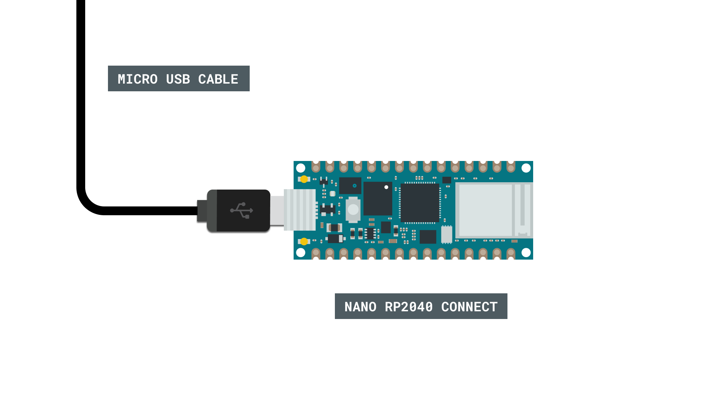

## Option 1: Arduino Cloud IoT

***We recommend upgrading the firmware through the Arduino Cloud IoT, as it the quickest and easiest method.***

Upgrading the NINA firmware through the Arduino Cloud IoT is a fast and reliable method. While there is no official "firmware upgrader" in the Arduino Cloud IoT, the configuration of a device in the cloud includes the process of updating the firmware to the latest version.

So let's take a look at the few steps needed to upgrade the NINA firmware on the Nano RP2040 Connect board.

### Sign in / Register

Let's begin by navigating to [create.arduino.cc/iot/devices](https://create.arduino.cc/iot/devices). Here you will be prompted to sign in. 

***You can sign up for an Arduino account for free. You will not need any extra subscription plan for this tutorial.***

### Device Configuration

Once logged in, you should be in the **"Devices"** tab (located at the top of the screen). Click on the **"Add Device"** button (if you have devices already configured, the button will be located at the top right corner).

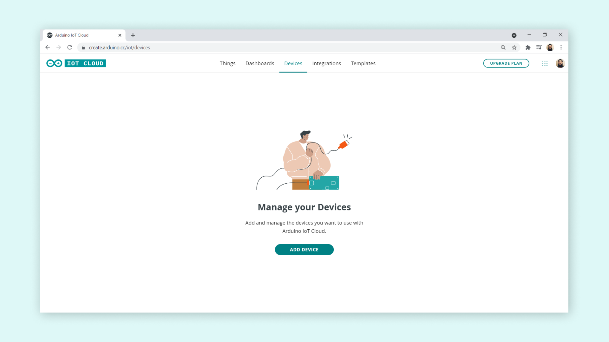

Then, click on the **"Set up an Arduino device"** option. 

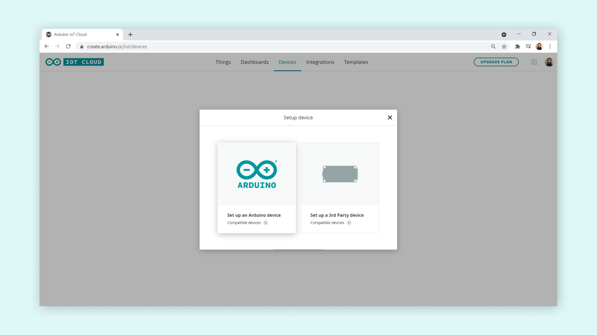

The configuration wizard will now look for a connected board. If you have not yet connected your Nano RP2040 Connect board to your computer, **please connect it now.** When it is found, it will appear in the configuration, where we will need to click on **"Configure"**.

***If your board is not found, you may need to install / re-run the [Create Agent](https://create.arduino.cc/getting-started/plugin/welcome). If the board is still not detected, you can follow the instructions in the guide to [resetting the Nano RP2040 Connect](https://docs.arduino.cc/tutorials/nano-rp2040-connect/rp2040-01-technical-reference#board-not-detected).***

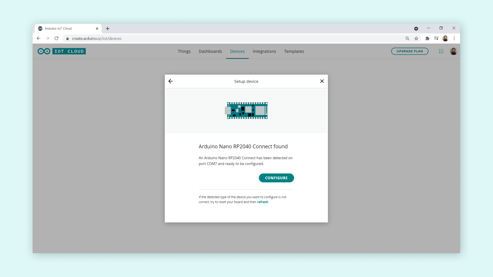

You will now also need to name your board (or choose the generated one). Once you click on **"Next"** the configuration will begin.

***It is very important that you do not disconnect the board during the configuration.***

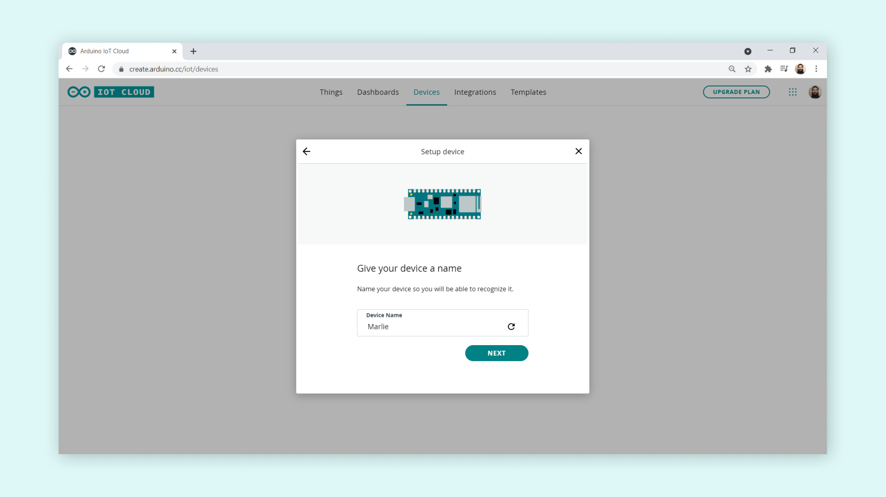

When the configuration is complete (this may take a minute), you will receive a confirmation like the image below. This means that the firmware has also successfully been upgraded. 

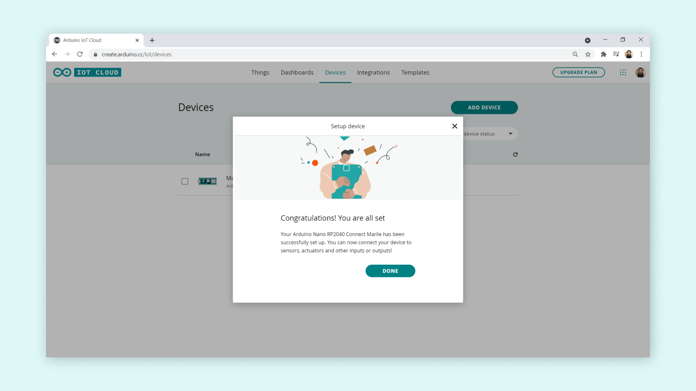

## Option 2: Arduino IDE 2

Upgrading your firmware via the Arduino IDE 2 is a quick and easy solution, and can be done by navigating to **Tools > WiFi101 / WiFiNINA Firmware Updater** inside the editor and follow the steps. A complete guide to how to use this tool is found in the link below:

- [Updating Firmware Version through IDE 2](https://docs.arduino.cc/software/ide-v2/tutorials/ide-v2-fw-cert-uploader#firmware-updater).

## Option 3: Arduino FW Uploader 

The next option is a bit more advanced, and involves using a Command Line Interface (CLI).

### Reset the Bootloader (Situational)

In some cases, it is need to reset the bootloader before upgrading the firmware. For example, if you have been running **MicroPython** on the Nano RP2040 Connect, it is required to reset it. 

To do so, follow the instructions below:

**1.** Connect the board to your computer.

**2.** Place a jumper wire between the REC and GND pins on the board, and click the **reset button**.

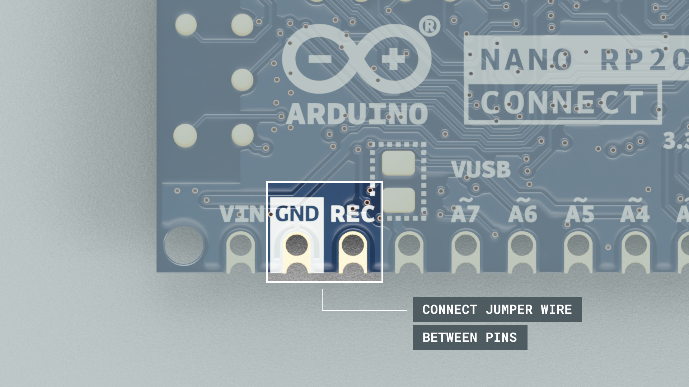

**3.** This will open the mass storage device, where a folder will open.

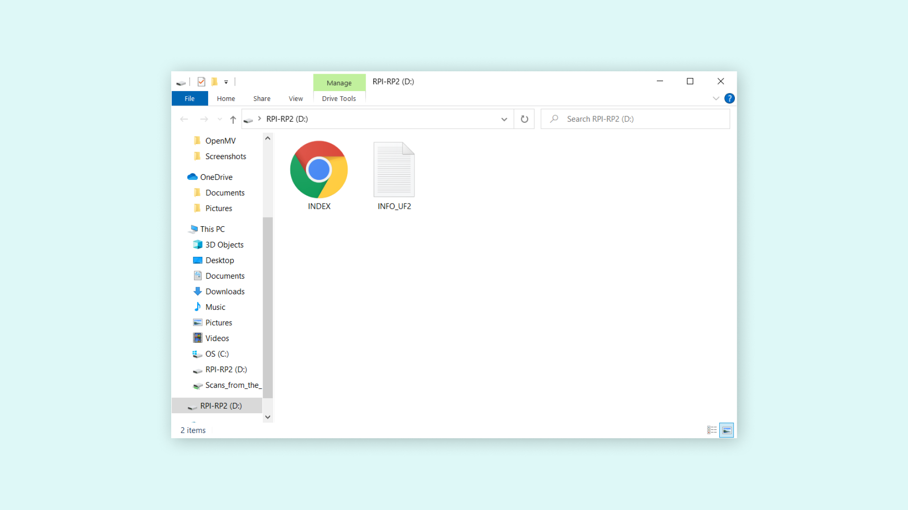

**4.** Download the [blink.ino.elf.uf2 file](https://content.arduino.cc/assets/Blink.ino.elf.uf2) and drag and drop it to the folder.


### Obtaining the Right Port

Before we will upload the firmware, we will need to know what port the board is connected to. Simply open an editor and check what port your board is connected through. In our case, it was `COM7`. For Mac/Linux users, it is something like `/dev/ttyACM0`.

Note down the port, since we will be using this when uploading the firmware.

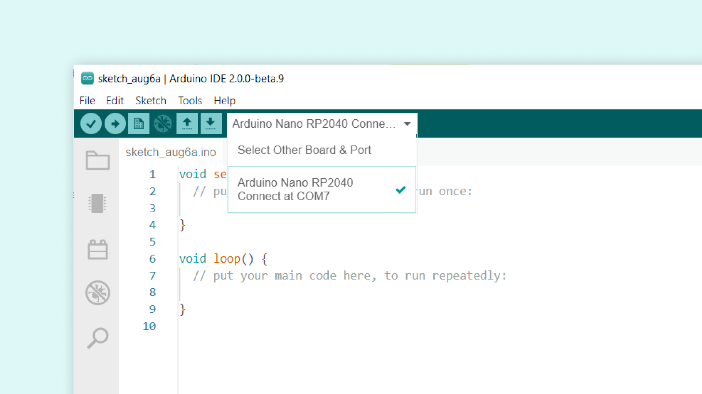

### Uploading the Firmware

To upload the firmware, we will need the **arduino-fwuploader**
tool. You can download the latest version from the [releases](https://github.com/arduino/arduino-fwuploader/releases) page.

Select the version that matches your operating system. In this tutorial, we are using Windows, so we downloaded the `arduino-fwuploader_2.0.1_Windows_64bit.zip` version.

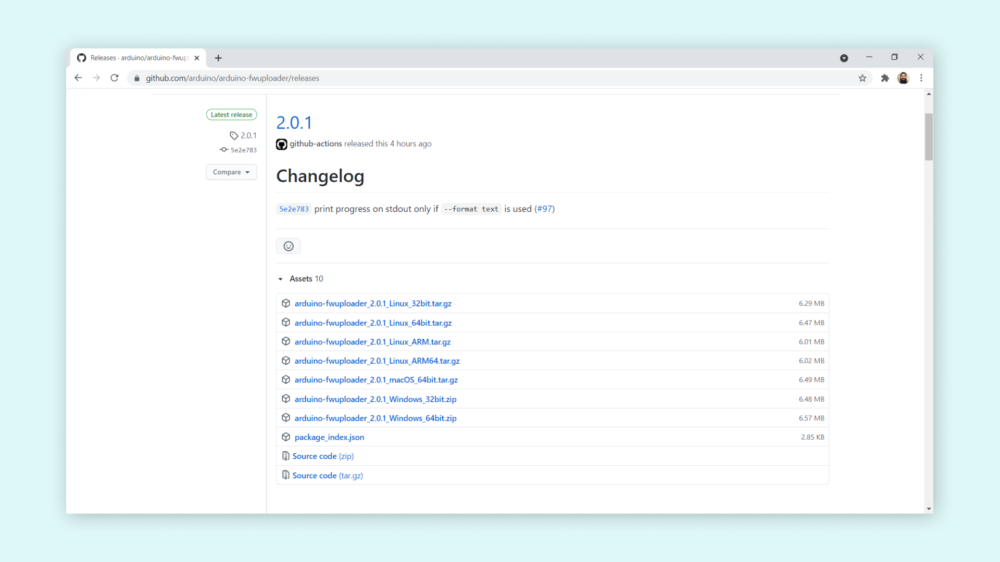

Next, extract the contents of `.zip` file to a good location. Then, open up a CLI (command line interface), such as the CMD on Windows, and navigate to the folder of extraction, using the following command:

```
cd C:\firmware-uploader
```

***Note that the directory will depend on where you unzipped the content.***

We should now see something like this in the CLI:


Now, to upgrade the firmware, we need to create a command that will upload a specific firmware, to a specific board, and specific module. We used the following command to upload the latest NINA firmware (1.4.8):

```
arduino-fwuploader firmware flash -b arduino:mbed_nano:nanorp2040connect -a COM7 -m NINA@1.4.8
```

Enter this command in the CLI, and hit enter. This should now start a process that uploads the stated firmware to your board.

***It is important that you DO NOT disconnect the board during this process.***

When it is finished, you should see this:

```
Flashing progress: 100%
```

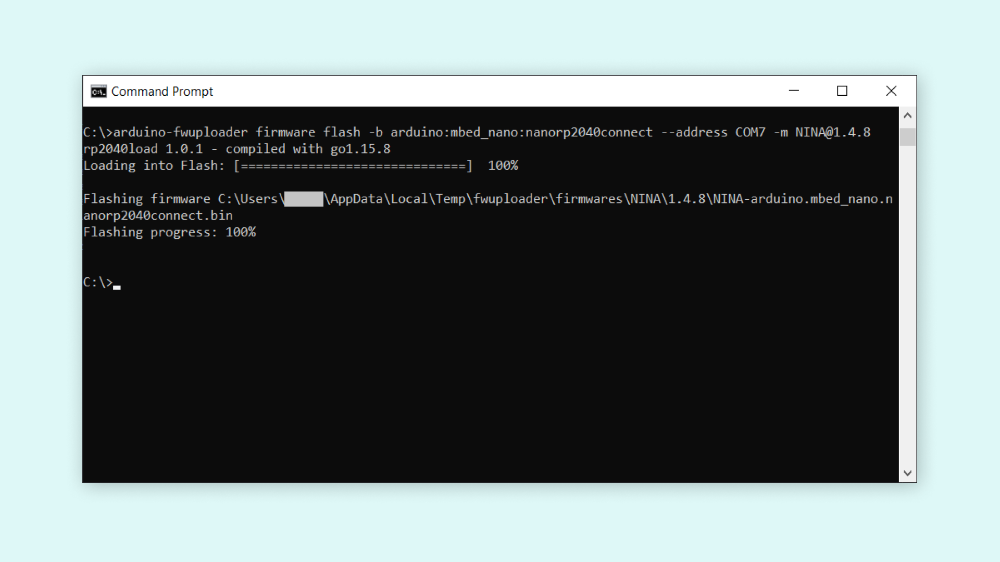

You have now upgraded the NINA firmware for your Nano RP2040 Connect. Congratulations!

#### Understanding the Commands 

To understand the commands used for upgrading the firmware, let's break it down:

- `firmware` - states that we are uploading firmware.
- `-b arduino:mbed_nano:nanorp2040connect` - the board we are using.
- `-a COM7` - the port (which we obtained through the IDE)
- `-m NINA@1.4.8` - the version of the NINA firmware (you can see all available versions [here](https://github.com/arduino/arduino-fwuploader/tree/main/firmwares/NINA)) 

### Troubleshooting

You may run into some issues while updating the firmware of your board. Below are some common issues:

- We have not installed a version of the Arduino IDE. 
- We have not unzipped the arduino-fwuploader.
- We are in the wrong directory.
- The board cannot be located (try reset the bootloader)

#### Error Codes

```
'arduino-fwuploader' is not recognized as an internal or external command,
operable program or batch file.
```

This happens when we try to run the `arduino-fwuploader` tool from the wrong directory. Make sure that you have navigated to the directory where the `arduino-fwuploader.exe` file is located before running the commands.

```
rp2040load 1.0.1 - compiled with go1.15.8
.....................
error during loader sketch flashing: exit status 1
```

This typically happens when the tool fails to find the board. To navigate around this, try reset the bootloader through the [instructions further up in this tutorial](#reset-the-bootloader-situational).

## Conclusion

In this tutorial, we have learned how to upgrade the Nano RP2040 Connect's firmware through either the **Arduino Cloud IoT**, or using the **arduino-fwuploader** tool. 
