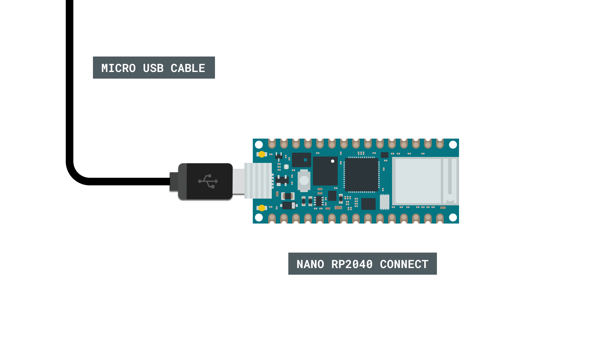
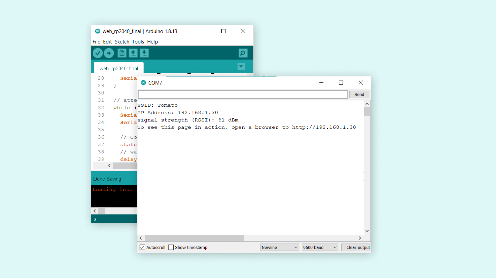
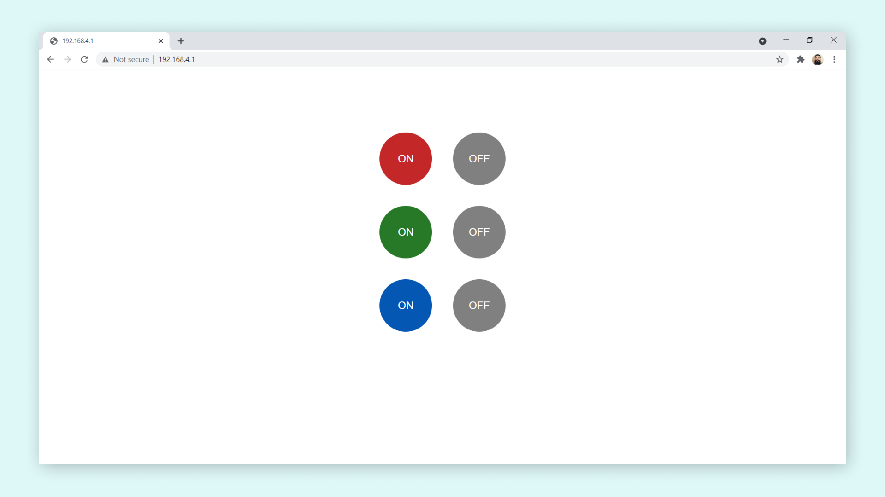

## Introduction 

The Nano RP2040 Connect features a Wi-Fi module and an RGB LED among many other things. In this tutorial we will take a look at how we turn our board into a web server, and control the built-in RGB through a browser. 

>**Note:** if you need help setting up your environment to use your Arduino Nano RP2040 board, please refer to [this installation guide](/software/ide-v2/tutorials/ide-v2-board-manager).

## Goals

The goals of this project are:

- Connect to a Wi-Fi network.
- Set up a web server.
- Connect to the server through a browser.
- Control the RGB LED.

## Hardware & Software Needed

- Arduino IDE ([online](https://create.arduino.cc/) or [offline](https://www.arduino.cc/en/main/software)).
- [WiFiNINA](https://www.arduino.cc/en/Reference/WiFiNINA) library installed.
- [Arduino Nano RP2040 Connect](https://store.arduino.cc/nano-rp2040-connect).


### Circuit



## Controlling over Wi-Fi

There are multiple ways we can access our board over Wi-Fi. In this tutorial, we will turn our board into a web server, that will listen for incoming GET requests. 

Simply explained, we will set up our board to connect to a Wi-Fi network, and start hosting a web server on a specific IP address. If we enter this address in the browser of a computer/browser on the same network, we make a request to this server. The server responds with a set of HTML instructions, which can then be viewed in the browser. It works pretty much as the Internet does, but in our example, it will only happen over the local Wi-Fi network. 

### Controlling an Arduino Through the Browser

Inside the HTML instructions that we print, or send to the browser, we can create **buttons.** These buttons can be modified to add something to the URL. Here is an example of how a button is created:

```markup
<button class='red' type='submit' onmousedown='location.href=\"/RH\"'>ON</button>
```

The most important is what we put inside `href`, which in this case is `/RH`. Whenever this button is clicked, it will update the URL of the page to `http://<board-ip>/RH`. After this happens, the program will go through a set of conditionals, that checks whether this button has been pressed:

```arduino
if (currentLine.endsWith("GET /RH")) {
  doSomething();
}
```

By using this method, we can set up many more buttons that can control different aspects of our Arduino, and is a great building block for building a control interface for your board that can be controlled through a browser, over WiFi.

## Programming the Board

We will now get to the programming part of this tutorial. 

1. First, let's make sure we have the drivers installed. If we are using the Web Editor, we do not need to install anything. If we are using an offline editor, we need to install it manually. This can be done by navigating to **Tools > Board > Board Manager...**. Here we need to look for the **Arduino Mbed OS Nano Boards** and install it.  

2. Now, we need to install the libraries needed. If we are using the Web Editor, there is no need to install anything. If we are using an offline editor, simply go to **Tools > Manage libraries..**, and search for **WiFiNINA** and install it.

3. We can now take a look at some of the core functions of this sketch:

- `char ssid[] = ""` - stores network name.
- `char pass[] = ""` - stores network password.
- `WiFi.begin(ssid, pass)` connects to Wi-Fi with credentials.
- `WiFiServer server(80)` - creates a server that listens for incoming connections on the specified port.
- `WiFiClient client` - creates a client that can connect to to a specified internet IP address.
- `server.begin()` - tells the server to begin listening for incoming connections.
- `client.connected` - checks for connected clients.
- `client.available` - checks for available data.
- `client.read` - reads the available data.
- `client.print()` - print something to the client (e.g. html code).
- `client.stop()` - closes the connection.

The sketch can be found in the snippet below. Upload the sketch to the board. 

```arduino
#include <SPI.h>
#include <WiFiNINA.h>

///////please enter your sensitive data in the Secret tab/arduino_secrets.h
char ssid[] = "";        // your network SSID (name)
char pass[] = "";    // your network password (use for WPA, or use as key for WEP)
int keyIndex = 0;                 // your network key index number (needed only for WEP)

int status = WL_IDLE_STATUS;
WiFiServer server(80);

void setup() {
  pinMode(LEDR, OUTPUT);
  pinMode(LEDG, OUTPUT);
  pinMode(LEDB, OUTPUT);
  Serial.begin(9600);      // initialize serial communication

  // check for the WiFi module:
  if (WiFi.status() == WL_NO_MODULE) {
    Serial.println("Communication with WiFi module failed!");
    // don't continue
    while (true);
  }

  String fv = WiFi.firmwareVersion();
  if (fv < WIFI_FIRMWARE_LATEST_VERSION) {
    Serial.println("Please upgrade the firmware");
  }

  // attempt to connect to WiFi network:
  while (status != WL_CONNECTED) {
    Serial.print("Attempting to connect to Network named: ");
    Serial.println(ssid);                   // print the network name (SSID);

    // Connect to WPA/WPA2 network. Change this line if using open or WEP network:
    status = WiFi.begin(ssid, pass);
    // wait 10 seconds for connection:
    delay(10000);
  }
  server.begin();                           // start the web server on port 80
  printWifiStatus();                        // you're connected now, so print out the status
}


void loop() {
  WiFiClient client = server.available();   // listen for incoming clients

  if (client) {                             // if you get a client,
    Serial.println("new client");           // print a message out the serial port
    String currentLine = "";                // make a String to hold incoming data from the client
    while (client.connected()) {            // loop while the client's connected
      if (client.available()) {             // if there's bytes to read from the client,
        char c = client.read();             // read a byte, then
        Serial.write(c);                    // print it out the serial monitor
        if (c == '\n') {                    // if the byte is a newline character

          // if the current line is blank, you got two newline characters in a row.
          // that's the end of the client HTTP request, so send a response:
          if (currentLine.length() == 0) {
            // HTTP headers always start with a response code (e.g. HTTP/1.1 200 OK)
            // and a content-type so the client knows what's coming, then a blank line:
            client.println("HTTP/1.1 200 OK");
            client.println("Content-type:text/html");
            client.println();

            // the content of the HTTP response follows the header:
            client.print("<style>");
            client.print(".container {margin: 0 auto; text-align: center; margin-top: 100px;}");
            client.print("button {color: white; width: 100px; height: 100px;");
            client.print("border-radius: 50%; margin: 20px; border: none; font-size: 20px; outline: none; transition: all 0.2s;}");
            client.print(".red{background-color: rgb(196, 39, 39);}");
            client.print(".green{background-color: rgb(39, 121, 39);}");
            client.print(".blue {background-color: rgb(5, 87, 180);}");
            client.print(".off{background-color: grey;}");
            client.print("button:hover{cursor: pointer; opacity: 0.7;}");
            client.print("</style>");
            client.print("<div class='container'>");
            client.print("<button class='red' type='submit' onmousedown='location.href=\"/RH\"'>ON</button>");
            client.print("<button class='off' type='submit' onmousedown='location.href=\"/RL\"'>OFF</button><br>");
            client.print("<button class='green' type='submit' onmousedown='location.href=\"/GH\"'>ON</button>");
            client.print("<button class='off' type='submit' onmousedown='location.href=\"/GL\"'>OFF</button><br>");
            client.print("<button class='blue' type='submit' onmousedown='location.href=\"/BH\"'>ON</button>");
            client.print("<button class='off' type='submit' onmousedown='location.href=\"/BL\"'>OFF</button>");
            client.print("</div>");

            // The HTTP response ends with another blank line:
            client.println();
            // break out of the while loop:
            break;
          } else {    // if you got a newline, then clear currentLine:
            currentLine = "";
          }
        } else if (c != '\r') {  // if you got anything else but a carriage return character,
          currentLine += c;      // add it to the end of the currentLine
        }

        // Check to see if the client request was /X
        if (currentLine.endsWith("GET /RH")) {
          digitalWrite(LEDR, HIGH);
        }
        if (currentLine.endsWith("GET /RL")) {
          digitalWrite(LEDR, LOW);              
        }
        if (currentLine.endsWith("GET /GH")) {
          digitalWrite(LEDG, HIGH);              
        }
        if (currentLine.endsWith("GET /GL")) {
          digitalWrite(LEDG, LOW);           
        }
        if (currentLine.endsWith("GET /BH")) {
          digitalWrite(LEDB, HIGH);              
        }
        if (currentLine.endsWith("GET /BL")) {
          digitalWrite(LEDB, LOW);             
        }
      }
    }
    // close the connection:
    client.stop();
    Serial.println("client disconnected");
  }
}

void printWifiStatus() {
  // print the SSID of the network you're attached to:
  Serial.print("SSID: ");
  Serial.println(WiFi.SSID());

  // print your board's IP address:
  IPAddress ip = WiFi.localIP();
  Serial.print("IP Address: ");
  Serial.println(ip);

  // print the received signal strength:
  long rssi = WiFi.RSSI();
  Serial.print("signal strength (RSSI):");
  Serial.print(rssi);
  Serial.println(" dBm");
  // print where to go in a browser:
  Serial.print("To see this page in action, open a browser to http://");
  Serial.println(ip);
}
```

## Testing It Out

After the code has been successfully uploaded to the board, we need to open the Serial Monitor to initialize the program. As soon as we open it, it will attempt to connect to the Wi-Fi network we entered in the code, and if it is successful, it will print out the boards IP address in the Serial Monitor.



We now need to copy this IP address and paste it in the browser on a computer/phone on the same network as our board is connect to. We should now see the following page:



We can now interact with the different buttons. The buttons available are used to control the built-in RGB LED on the Nano RP2040 Connect. There's six buttons in total, three to turn ON the different colors, and three to turn them off.  

### Troubleshoot

If the code is not working, there are some common issues we can troubleshoot:

- We have entered the wrong credentials to our Wi-Fi network.
- We have not installed the **WiFiNINA** library.

## Conclusion

In this tutorial, we have turned our Nano RP2040 Connect into a web server, which different clients can connect to. We have then used the /GET method in order to change the RGB LED on the board, through a set of buttons accessible from the browser.

This method can be quite useful for turning something ON or OFF remotely, and can be an ideal solution for building smart home applications. You can easily replace the control of the RGB LED with something else, such as controlling a motor, relays or other actuators. 
