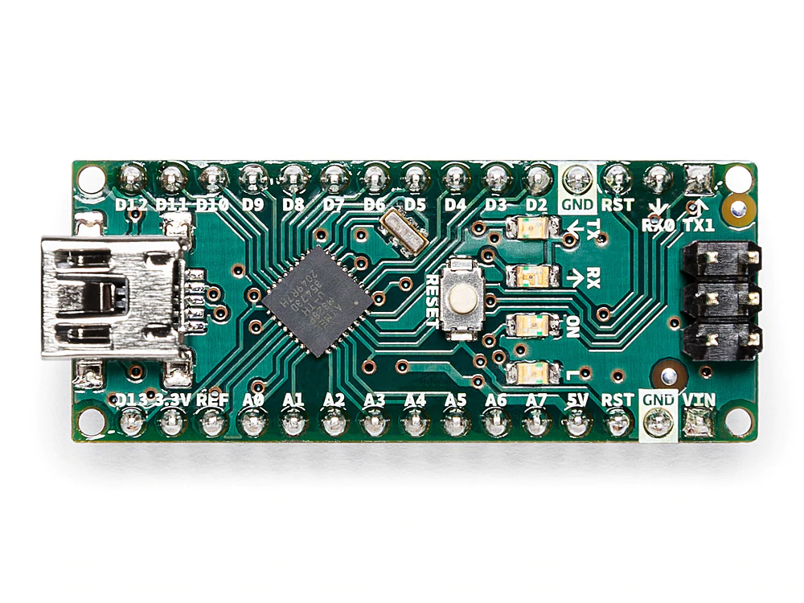
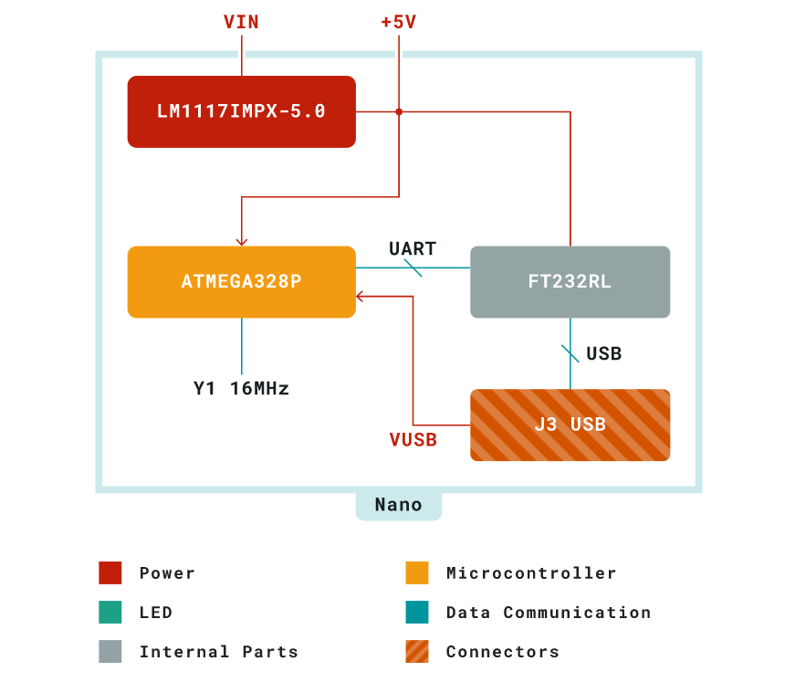
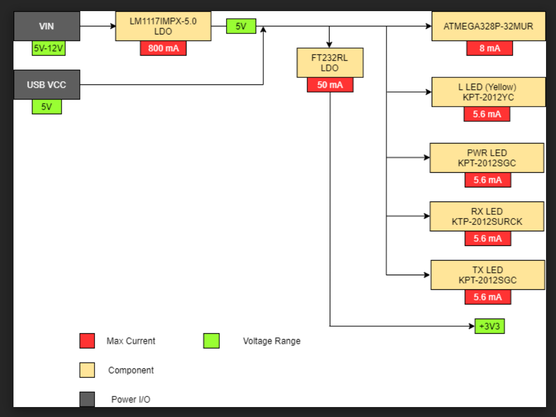
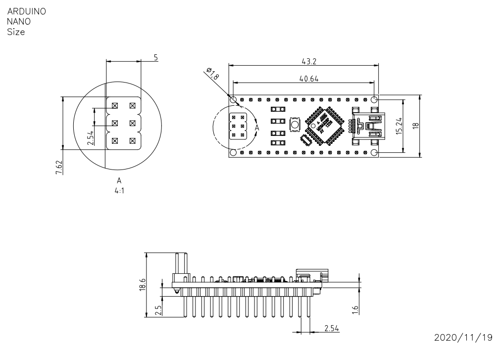

# Description

**Arduino® Nano** is an intelligent development board designed for building faster prototypes with the smallest dimension. Arduino Nano being the oldest member of the Nano family, provides enough interfaces for your breadboard-friendly applications. At the heart of the board is **ATmega328 microcontroller** clocked at a frequency of 16 MHz featuring more or less the same functionalities as the Arduino Duemilanove. The board offers 20 digital input/output pins, 8 analog pins, and a mini-USB port.

# Target Areas 
Maker, Security, Environmental, Robotics and Control Systems

# Features
- **ATmega328** Microcontroller
  - High-performance low-power 8-bit processor
  - Achieve up to 16 MIPS for 16 MHz clock frequency
  - 32 kB of which 2 KB used by bootloader
  - 2 kB internal SRAM
  - 1 kB EEPROM
  - 32 x 8 General Purpose Working Registers
  - Real Time Counter with Separate Oscillator
  - Six PWM Channels
  - Programmable Serial USART
  - Master/Slave SPI Serial Interface
- **Power**
  - Mini-B USB connection
  - 6-20V unregulated external power supply (pin 30)
  - 5V regulated external power supply (pin 27)
- **Sleep Modes**
  - Idle
  - ADC Noise Reduction
  - Power-save
  - Power-down
  - Standby
  - Extended Standby
- **I/O**
  - 20 Digital
  - 8 Analog
  - 6 PWM Output

# Contents 

## The Board
### Application Examples
Arduino Nano is the first embedded microcontroller in the Nano series with minimum functionalities, designed for mini projects from the maker community. With a large number of input/output pins gives the advantage of utilizing several serial communications like UART, SPI and I2C. The hardware is compatible with Arduino IDE, Arduino CLI and web editor.

**Security**: The high-performance and low-power capabilities gives the chance to develop security based applications like access control systems using fingerprint sensors. The flexibility to interface sensors and external devices using serial communication has improved the scope of utility.

**Environmental**: The low-power feature of the microcontroller and the power supply
options for the board has enhanced the ability to implement remote IoT projects related
to environmental issues.

**Robotics**: Robotics has always been the favorite area of exploration for the Maker community and with this tiny embedded hardware you can now create complex and advanced robotic applications.

### Accessories

### Related Products

- Arduino Nano 33 BLE
- Arduino 33 IoT
- Arduino Micro

## Ratings

### Recommended Operating Conditions
| Symbol | Description                                       | Min        | Max     |
| ------ | ------------------------------------------------- | ---------- | ------- | 
|        |  Conservative thermal limits for the whole board: |  -40 °C    | 85 °C   |

### Power Consumption
| Symbol          | Description                         | Min | Typ | Max | Unit |
| --------------- | ----------------------------------- | --- | --- | --- | ---- |
|   USB VCC       | Input supply from USB               |     | TBC |     |  mW  |
|   VIN           | Input from VIN pad                  |     | TBC |     |  mW  |

## Functional Overview
### Block Diagram

### Processor

The primary processor in the Arduino Nano v3.3 board is the high-performance and low-power 8-bit ATmega328 microcontroller that runs at a clock frequency of 16 MHz. The ability to interface external devices through serial communication supported by the chip with UART TTL (5V), I2C (TWI) and SPI. Arduino Nano can be programmed with Arduino software reducing the entry barriers for new users. Smallest dimension embedded hardware makes it a perfect choice for breadboard-friendly projects from the maker community.

### Power Tree

The Arduino Nano can be powered by either the USB port or alternatively via VIN. The input supply of VIN is regulated by an LDO so the supply is limited to 5V for the optimal functioning of the board. There is also another regulator which limits the voltage to 3.3V for powrering the components with low voltage requirements.

## Board Operation
### Getting Started - IDE
If you want to program your Arduino® Nano while offline you need to install the Arduino® Desktop IDE **[1]** To connect the Arduino Uno to your computer, you’ll need a Micro-B USB cable. This also provides power to the board, as indicated by the LED.

### Getting Started - Arduino Web Editor
All Arduino® boards, including this one, work out-of-the-box on the Arduino Web Editor **[2]**, by just installing a simple plugin.
The Arduino Web Editor is hosted online, therefore it will always be up-to-date with the latest features and support for all boards. Follow **[3]** to start coding on the browser and upload your sketches onto your board.

### Sample Sketches
Sample sketches for the Arduino® can be found either in the “Examples” menu in the Arduino® IDE or in the “Documentation” section of the Arduino website **[4]**

### Online Resources
Now that you have gone through the basics of what you can do with the board you can explore the endless possibilities it provides by checking exciting projects on ProjectHub **[5]**, the Arduino® Library Reference **[6]** and the online store **[7]** where you will be able to complement your board with sensors, actuators and more.

## Connector Pinouts

### Analog
| Pin | Function | Type         | Description             |
| --- | -------- | ------------ | ----------------------- |
| 1   | +3V3     | Power        | 5V USB Power            |
| 2   | A0       | Analog       | Analog input 0 /GPIO    |
| 3   | A1       | Analog       | Analog input 1 /GPIO    |
| 4   | A2       | Analog       | Analog input 2 /GPIO    |
| 5   | A3       | Analog       | Analog input 3 /GPIO    |
| 6   | A4       | Analog       | Analog input 4 /GPIO    |
| 7   | A5       | Analog       | Analog input 5 /GPIO    |
| 8   | A6       | Analog       | Analog input 6 /GPIO    |
| 9   | A7       | Analog       | Analog input 7 /GPIO    |
| 10  | +5V      | Power        | +5V Power Rail          |
| 11  | Reset    | Reset        | Reset                   |
| 12  | GND      | Power        | Ground                  |
| 12  | VIN      | Power        | Voltage Input           |

### Digital
| Pin | Function | Type    | Description             |
| --- | -------- | ------- | ----------------------- |
| 1   | D1/TX1   | Digital | Digital Input 1 /GPIO   |
| 2   | D0/RX0   | Digital | Digital Input 0 /GPIO   |
| 3   | D2       | Digital | Digital Input 2 /GPIO   |
| 4   | D3       | Digital | Digital Input 3 /GPIO   |
| 5   | D4       | Digital | Digital Input 4 /GPIO   |
| 6   | D5       | Digital | Digital Input 5 /GPIO   |
| 7   | D6       | Digital | Digital Input 6 /GPIO   |
| 8   | D7       | Digital | Digital Input 7 /GPIO   |
| 9   | D8       | Digital | Digital Input 8 /GPIO   |
| 10  | D9       | Digital | Digital Input 9 /GPIO   |
| 11  | D10      | Digital | Digital Input 10 /GPIO  |
| 12  | D11      | Digital | Digital Input 11 /GPIO  |
| 13  | D12      | Digital | Digital Input 12 /GPIO  |
| 14  | D13      | Digital | Digital Input 13 /GPIO  |
| 15  | Reset    | Reset   | Reset                   |
| 16  | GND      | Power   | Ground                  |

### ATmega328
| Pin | Function | Type         | Description             |
| --- | -------- | ------------ | ----------------------- |
| 1   | PB0      | Internal     | Serial Wire Debug       |
| 2   | PB1      | Internal     | Serial Wire Debug       |
| 3   | PB2      | Internal     | Serial Wire Debug       |
| 4   | PB3      | Internal     | Serial Wire Debug       |
| 5   | PB4      | Internal     | Serial Wire Debug       |
| 6   | PB5      | Internal     | Serial Wire Debug       |

## Mechanical Information

## Certifications
### Declaration of Conformity CE DoC (EU)
We declare under our sole responsibility that the products above are in conformity with the essential requirements of the following EU Directives and therefore qualify for free movement within markets comprising the European Union (EU) and European Economic Area (EEA). 

### Declaration of Conformity to EU RoHS & REACH 211 01/19/2021
Arduino boards are in compliance with RoHS 2 Directive 2011/65/EU of the European Parliament and RoHS 3 Directive 2015/863/EU of the Council of 4 June 2015 on the restriction of the use of certain hazardous substances in electrical and electronic equipment. 

| **Substance**                          | **Maximum Limit (ppm)** |
| -------------------------------------- | ----------------------- |
| Lead (Pb)                              | 1000                    |
| Cadmium (Cd)                           | 100                     |
| Mercury (Hg)                           | 1000                    |
| Hexavalent Chromium (Cr6+)             | 1000                    |
| Poly Brominated Biphenyls (PBB)        | 1000                    |
| Poly Brominated Diphenyl ethers (PBDE) | 1000                    |
| Bis(2-Ethylhexyl} phthalate (DEHP)     | 1000                    |
| Benzyl butyl phthalate (BBP)           | 1000                    |
| Dibutyl phthalate (DBP)                | 1000                    |
| Diisobutyl phthalate (DIBP)            | 1000                    |

Exemptions : No exemptions are claimed. 

Arduino Boards are fully compliant with the related requirements of European Union Regulation (EC) 1907 /2006 concerning the Registration, Evaluation, Authorization and Restriction of Chemicals (REACH). We declare none of the SVHCs (https://echa.europa.eu/web/guest/candidate-list-table), the Candidate List of Substances of Very High Concern for authorization currently released by ECHA, is present in all products (and also package) in quantities totaling in a concentration equal or above 0.1%. To the best of our knowledge, we also declare that our products do not contain any of the substances listed on the "Authorization List" (Annex XIV of the REACH regulations) and Substances of Very High Concern (SVHC) in any significant amounts as specified by the Annex XVII of Candidate list published by ECHA (European Chemical Agency) 1907 /2006/EC.

### Conflict Minerals Declaration 
As a global supplier of electronic and electrical components, Arduino is aware of our obligations with regards to laws and regulations regarding Conflict Minerals, specifically the Dodd-Frank Wall Street Reform and Consumer Protection Act, Section 1502. Arduino does not directly source or process conflict minerals such as Tin, Tantalum, Tungsten, or Gold. Conflict minerals are contained in our products in the form of solder, or as a component in metal alloys. As part of our reasonable due diligence Arduino has contacted component suppliers within our supply chain to verify their continued compliance with the regulations. Based on the information received thus far we declare that our products contain Conflict Minerals sourced from conflict-free areas. 

### FCC Caution
Any Changes or modifications not expressly approved by the party responsible for compliance could void the user’s authority to operate the equipment.

This device complies with part 15 of the FCC Rules. Operation is subject to the following two conditions: 

(1) This device may not cause harmful interference

(2) this device must accept any interference received, including interference that may cause undesired operation.

**FCC RF Radiation Exposure Statement:**

1. This Transmitter must not be co-located or operating in conjunction with any other antenna or transmitter.

2. This equipment complies with RF radiation exposure limits set forth for an uncontrolled environment.

3. This equipment should be installed and operated with minimum distance 20cm between the radiator & your body.

English: 
User manuals for license-exempt radio apparatus shall contain the following or equivalent notice in a conspicuous location in the user manual or alternatively on the device or both. This device complies with Industry Canada license-exempt RSS standard(s). Operation is subject to the following two conditions:

(1) this device may not cause interference

(2) this device must accept any interference, including interference that may cause undesired operation of the device.

French: 
Le présent appareil est conforme aux CNR d’Industrie Canada applicables aux appareils radio exempts de licence. L’exploitation est autorisée aux deux conditions suivantes :

(1) l’ appareil nedoit pas produire de brouillage

(2) l’utilisateur de l’appareil doit accepter tout brouillage radioélectrique subi, même si le brouillage est susceptible d’en compromettre le fonctionnement.

**IC SAR Warning:**

English 
This equipment should be installed and operated with minimum distance 20 cm between the radiator and your body.  

French: 
Lors de l’ installation et de l’ exploitation de ce dispositif, la distance entre le radiateur et le corps est d ’au moins 20 cm.

**Important:** The operating temperature of the EUT can’t exceed 80℃ and shouldn’t be lower than -20℃.

Hereby, Arduino S.r.l. declares that this product is in compliance with essential requirements and other relevant provisions of Directive 2014/53/EU. This product is allowed to be used in all EU member states. 

## Company Information

| Company name    | Arduino S.r.l.                                                |
| --------------- | ------------------------------------------------------------- |
| Company Address | Via Andrea Appiani 25, 20900 MONZA MB, Italy                  |

## Reference Documentation

| Ref                       | Link                                                                                                |
| ------------------------- | --------------------------------------------------------------------------------------------------- |
| Arduino IDE (Desktop)     | https://www.arduino.cc/en/software                                                                  |
| Arduino IDE (Cloud)       | https://create.arduino.cc/editor                                                                    |
| Cloud IDE Getting Started | https://create.arduino.cc/projecthub/Arduino_Genuino/getting-started-with-arduino-web-editor-4b3e4a |
| Arduino Documentation     | https://docs.arduino.cc/hardware/nano                                                               |
| Project Hub               | https://create.arduino.cc/projecthub?by=part&part_id=11332&sort=trending                            |
| Library Reference         | https://www.arduino.cc/reference/en/libraries/                                                      |
| Online Store              | https://store.arduino.cc/                                                                           |

## Revision History

| **Date**   | **Revision** | **Changes**                           |
| ---------- | ------------ | ------------------------------------- |
| 03/08/2022 | 2            | Reference documentation links updates |
| 12/04/2022 | 1            | First Release                         |
