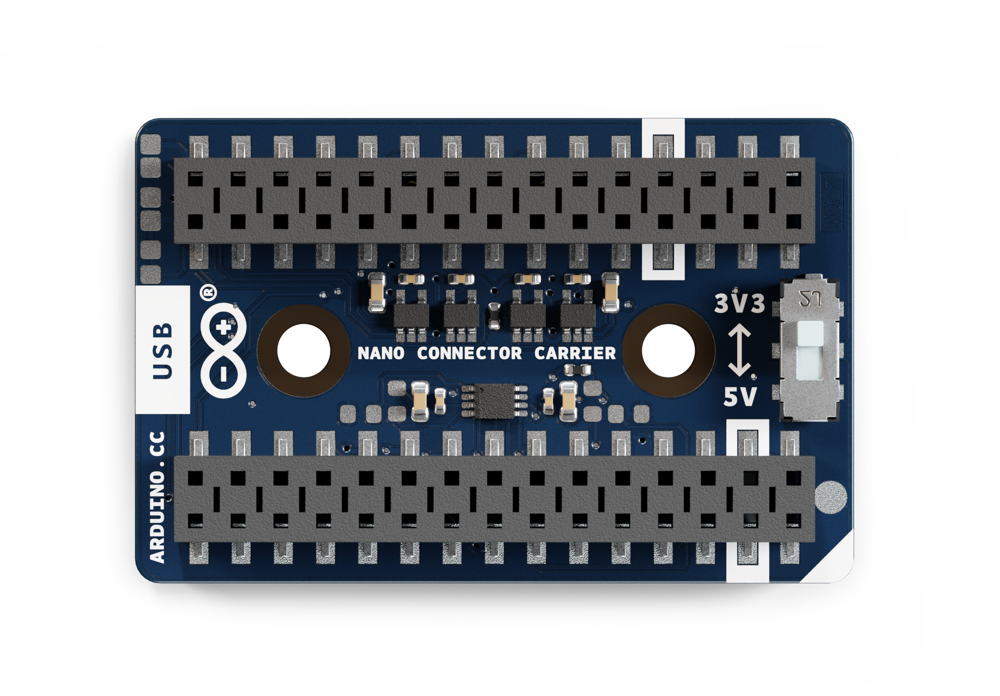

# Description

The Nano Connector Carrier is a practical solution for expanding the capabilities of our Nano product family. It is plug-and-play compatible with Qwiic and Grove modules, making rapid prototyping easier than ever.

Whether diving into MicroPython or Matter, building with Modulino® nodes, or developing AI-powered applications, this carrier provides a simple platform for bringing your ideas to life.

The onboard microSD card slot unlocks new possibilities for data logging, Edge AI and real-time storage needs.

# Target Areas:

Industrial Automation, Rapid Prototyping, Proof of Concept, Edge AI, Research and Development

# CONTENTS

## Application Examples

**Industrial Automation:** 
- **Data Logging:** Data Logger as a compact, all-in-one device for efficient data collection and storage, ideal for IoT and sensor-based applications. With Nano boards advanced features and a compact design, it simplifies sensor interfacing, data management, and storage, making it perfect for smart homes, industrial monitoring, and research projects.
- **Predictive Maintenance:** Leverage the powerful features of the Nano Connector Carrier to develop a robust predictive maintenance prototype for industrial machinery. Utilize Modulino® nodes to monitor key operational parameters and detect anomalies or early signs of wear, enabling proactive maintenance and reducing downtime. Enhance this system with the Nano 33 BLE Sense, which continuously gathers crucial environmental data, including temperature, humidity, and vibrations to assess the overall health of the machinery.
- **Proof of Concept:** Expand your Nano board's capabilities with Nano Connector Carrier. The Nano Connector Carrier is ready for use with a wide range of external hardware components or modules, covering all your needs, from embedded sensing to actuation.

**Prototyping:**
- **Compact Device:** Effortlessly integrate the Connector Carrier into your interactive prototype, regardless of whether the Nano board is based on. Its plug-and-play sensors and actuators make development seamless. Whether using modules from our Qwiic or Grove series, its compact design allows you to experiment in small spaces, making it a perfect platform for testing and validating your tech ideas.
- **Smart Home:** Easily prototype any smart device that can monitor and adjust temperature, humidity, or occupancy levels by combining Nano Connector Carrier, Modulino® nodes and Nano Matter. Integrate with Matter-compatible smart home systems like Alexa or Google Home for frictionless voice control and automation.
- **Controller:** Using the Nano Connector Carrier, you can easily prototype a versatile RC - MIDI - RF - BLE - HID - DMX controller for your projects. With plug-and-play support for sensors and actuators, you can create custom interfaces that respond to touch, motion or even pressure. The compact design allows for a fully portable setup using Modulino® nodes or third-party sensors.

**Education:**
- **Micropython Learning:** Easily dive into MicroPython with the Nano Connector Carrier, Modulino® nodes and Nano ESP32 as your learning platform. Its plug-and-play support for sensors and actuators allows you to experiment with real-world applications right away, whether you're reading sensor data, controlling LEDs, or building interactive projects. 
- **Cross-Disciplinary Student Projects:** The Connector Carrier accelerates interdisciplinary collaboration by enabling rapid prototyping in classroom and lab environments. Its compact, modular design allows students across various fields (including engineering, computer science and the arts) to quickly develop, test, and refine ideas using Arduino Nano boards. Students can seamlessly integrate sensors, actuators and communication modules with built-in connectivity and expansion options, fostering hands-on experimentation and innovation. 
- **Sustainability and Green Tech:** Energy Management project where students can design and test systems that monitor or reduce energy use in buildings or devices, promoting sustainability and teaching about renewable energy or energy efficiency, within integrated solar or wind power systems.

## Features
### General Specifications Overview

The main features of the Nano Connector Carrier are detailed in the table shown below.

| **Feature**            | **Description**                                                                                                                                                        |
| ---------------------- | ---------------------------------------------------------------------------------------------------------------------------------------------------------------------- |
| Interfaces             | 2x Grove analog/digital connector    1x Grove I2C connector    1x Grove UART connector    1x Qwiic I2C connector    1x microSD card reader |
| I/O Voltage            | Switch between +3.3 V and +5 V                                                                                                                                     |
| Dimensions             | 28 mm x 43 mm                                                                                                                                                          |
| Operating Temperatures | -40 °C to +85 °C                                                                                                                                                       |

### Board Selection

The Nano Connector Carrier lets you select +5 V or +3.3 V Nano boards to ensure compatibility with the whole Nano family. To do this, toggle the carrier onboard switch to its respective position, following the table below.

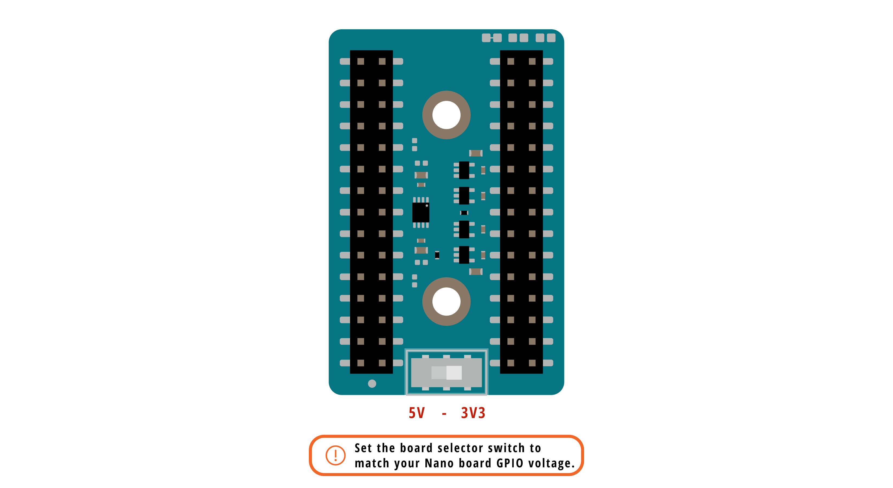

| **3V3**                | **5V**       |
| ---------------------- | ------------ |
| Nano ESP32             | Arduino Nano |
| Nano 33 IoT            | Nano Every   |
| Nano 33 BLE            |              |
| Nano 33 BLE Rev2       |              |
| Nano 33 BLE Sense      |              |
| Nano 33 BLE Sense Rev2 |              |
| Nano RP2040 Connect    |              |
| Nano Matter            |              |

Setting the switch to a specific position (3.3 V or 5V) also manages the voltage output on the Grove connector VCC pin.

<strong>Note:</strong> The logic and power voltage of the Qwiic connector and the microSD card slot are always +3.3 V regardless of the board selector switch position.

### Qwiic I2C Connector

The Qwiic connector is connected to the standard I2C bus on the board (via A4 and A5 pins). It is powered via +3.3 V, following the Qwiic standard system, making the Nano Connector Carrier compatible with the Arduino Modulino nodes.

Its logic level is fixed to +3.3 V, which is translated to the host Nano board voltage defined by the board selector switch.

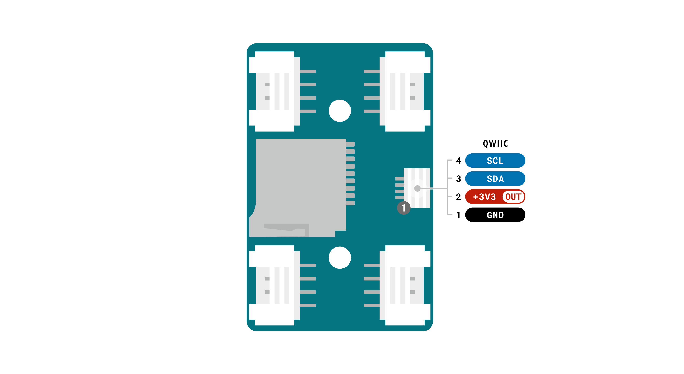

### Grove Connectors

The Nano Connector Carrier features 4x Grove connectors that expose the host board's main communication interfaces.

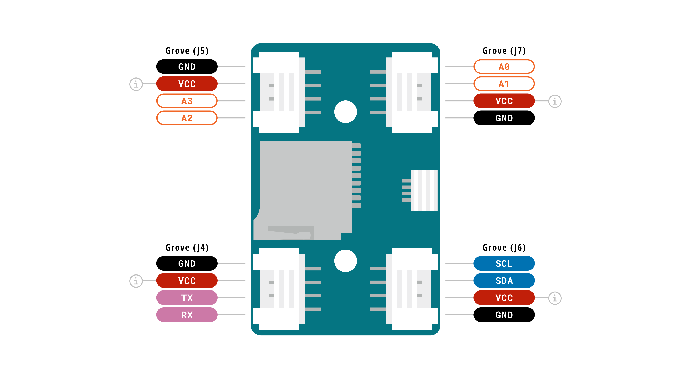

<strong>Note:</strong> The Grove connectors VCC voltage is controlled by the board selector switch.

### Micro SD Card 

The onboard microSD card slot unlocks new possibilities for data logging, Edge AI and real-time storage needs.

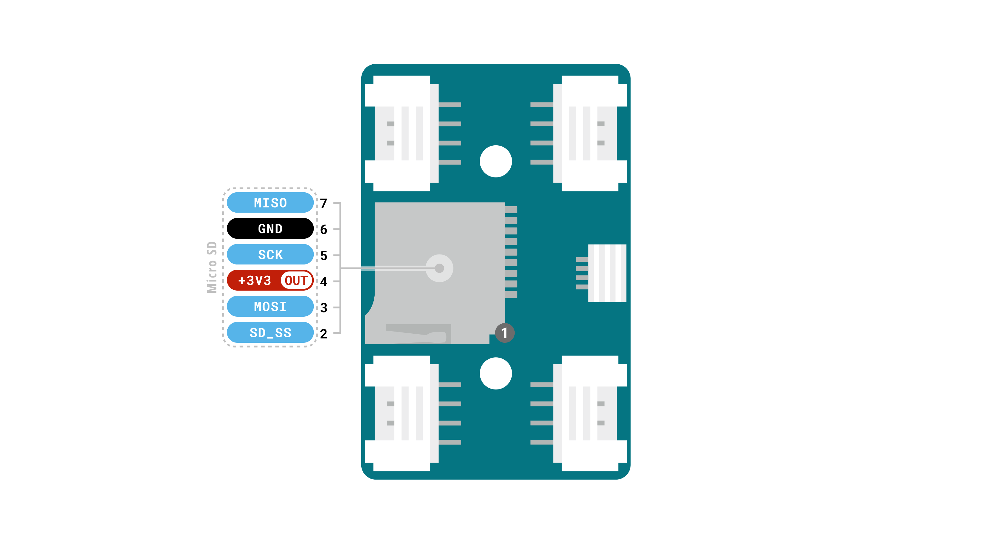

<strong>Note:</strong> The microSD card SPI Slave Select (SS) pin can be changed using the solder jumpers on the carrier. See <a href = "#pinout">pinout section</a> for more details.

### Communication Interfaces

The Nano Connector Carrier exposes all the Nano host board connections and communication interfaces through the header pins and connectors.  

| Interfaces     | Connector                                                                     |
| -------------- | ----------------------------------------------------------------------------- |
| UART (x1)      | - Nano header connector   - Grove connector                                                             |
| SPI (x1)       | - Nano header connector   - Micro SD card slot                         |
| I2C (x1)       | - Nano header connector   - Qwiic connector   - Grove connector |
| Analog/Digital | - Nano header connector   - 2x Grove connectors                        |

### Related Products

- Nano (A000005)
- Nano 33 BLE (ABX00030)
- Nano 33 BLE Rev2 (ABX00071 / ABX00072)
- Nano 33 BLE Sense (ABX00031)
- Nano 33 BLE Sense Rev2 (ABX00069)
- Nano 33 IoT (ABX00027)
- Nano ESP32 (ABX00083 / ABX00092 / ABX00083_CN / ABX00092_CN)
- Nano Every (ABX00028)
- Nano Matter (ABX00112 / ABX00137)
- Nano RP2040 Connect (ABX00053)
- Modulino® nodes

## Power and Ratings
### Recommended Operating Conditions

| Symbol         | Description                     | Min | Typ | Max | Unit |
| -------------- | ------------------------------- | --- | --- | --- | ---- |
| 3V3            | Input voltage from 3.3 V boards | -   | 3.3 | -   | V    |
| 5V             | Input voltage from 5 V boards   | -   | 5.0 | -   | V    |
| TOP | Operating Temperature           | -40 | 25  | 85  | °C   |

<strong>Note:</strong> The Nano Connector Carrier is powered by the host board's nominal voltage.

### Power Tree

The following diagram illustrates the Nano Connector Carrier's main system power architecture.

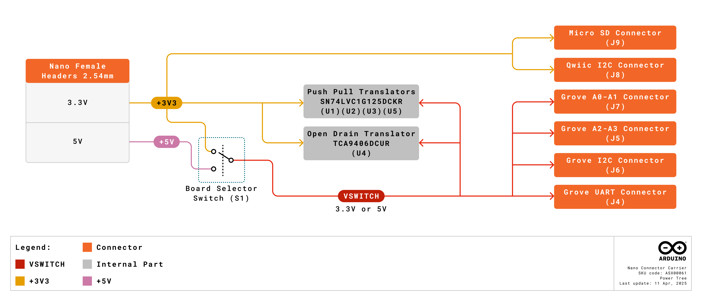

## Functional Overview

The Nano Connector Carrier expands the connectivity of the Nano boards family, featuring a variety of Grove and Qwiic connectors. It also includes a Micro SD card interface for data logging.  

### Pinout

The Nano Connector Carrier pinout is shown in the following figure.

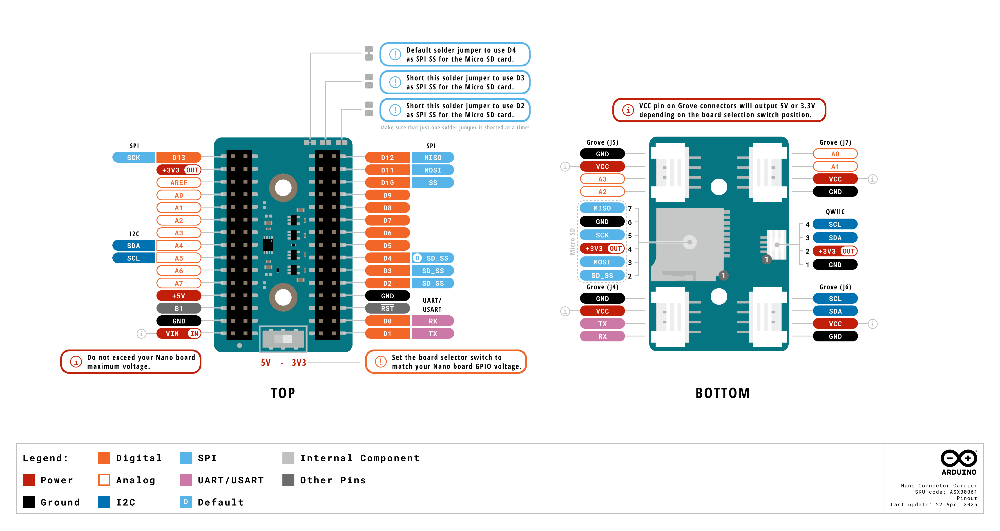

#### Analog (JP1)

| Pin | Function  | Type      | Description                             |
| --- | --------- | --------- | --------------------------------------- |
| 1   | D13 / SCK | Digital   | Serial Clock                            |
| 2   | +3.3 V      | Power Out | +3.3 V Power Rail                         |
| 3   | B0 / AREF | Analog    | Analog Reference                        |
| 4   | A0        | Analog    | Analog input 0                          |
| 5   | A1        | Analog    | Analog input 1                          |
| 6   | A2        | Analog    | Analog input 2                          |
| 7   | A3        | Analog    | Analog input 3                          |
| 8   | A4        | Analog    | Analog input 4 / I²C Serial Data (SDA)  |
| 9   | A5        | Analog    | Analog input 5 / I²C Serial Clock (SCL) |
| 10  | A6        | Analog    | Analog input 6                          |
| 11  | A7        | Analog    | Analog input 7                          |
| 12  | +5V       | Power     | USB power (5 V)                         |
| 13  | BOOT1     | Mode      | Board Reset 1                           |
| 14  | GND       | Power     | Ground                                  |
| 15  | VIN       | Power     | Voltage Input                           |

#### Digital (JP2)

| Pin | Function    | Type     | Description                             |
| --- | ----------- | -------- | --------------------------------------- |
| 15  | D12 / MISO  | Digital  | Master In Slave Out                     |
| 14  | D11 / MOSI  | Digital  | Master Out Slave In                     |
| 13  | D10 / SS    | Digital  | Slave Select                            |
| 12  | D9          | Digital  | Digital pin 9                           |
| 11  | D8          | Digital  | Digital pin 8                           |
| 10  | D7          | Digital  | Digital pin 7                           |
| 9   | D6          | Digital  | Digital pin 6                           |
| 8   | D5          | Digital  | Digital pin 5                           |
| 7   | D4 / SD_SS  | Digital  | Digital pin 4 / Default SD card SS      |
| 6   | D3 / *SD_SS | Digital  | Digital pin 3 / Optional SD card SS     |
| 5   | D2 / *SD_SS | Digital  | Digital pin 2 / Optional SD card SS     |
| 4   | GND         | Power    | Ground                                  |
| 3   | RST         | Internal | Reset                                   |
| 2   | D0 / RX     | Digital  | Digital pin 0 / Serial Receiver (RX)    |
| 1   | D1 / TX     | Digital  | Digital pin 1 / Serial Transmitter (TX) |

__*SD_SS__ are optional SPI Slave Select (SS) pins for the Micro SD card communication. See [pinout](#pinout) for more details.

### Block Diagram

An overview of the Nano Connector Carrier high-level architecture is illustrated in the figure below.

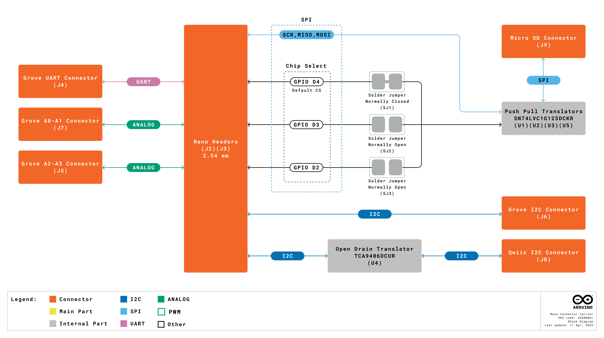

## Board Topology
### Overall View

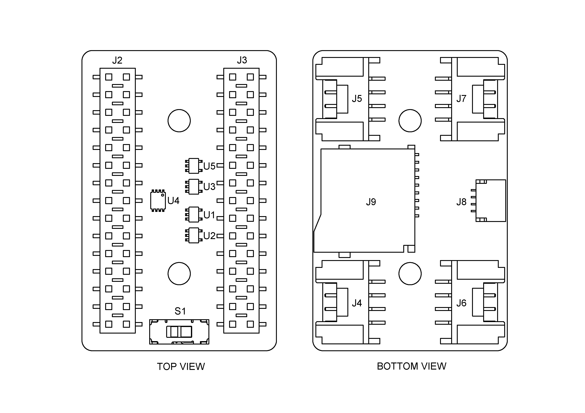

| **Reference**  | **Description**                          |
| -------------- | ---------------------------------------- |
| U1, U2, U3, U5 | Push pull translators (SN74LVC1G125DCKR) |
| U4             | Open drain translator (TCA9406DCUR)      |
| J2, J3         | Nano board headers                       |
| S1             | Board selector switch                    |
| J5             | Grove analog connector                   |
| J7             | Grove analog connector                   |
| J4             | Grove UART connector                     |
| J8             | Qwiic I2C connector                      |
| J9             | microSD card connector                   |

## Device Operation

### Getting Started - IDE

If you want to program your Nano board to use the Nano Connector Carrier while offline you need to install the Arduino® Desktop IDE **[1]**. To connect the Nano board to your computer, you will need a USB cable, which can also provide power to the board.

### Online Resources

Now that you have learned the basics of what you can do with the carrier, you can explore its endless possibilities by checking out exciting projects on Arduino Project Hub **[4]**, the Arduino Library Reference **[5]**, and the online store **[6]**. Here, you can complement your board with sensors, actuators and more.

## Mechanical Information

The Nano Connector Carrier is a double-sided 28 mm x 43 mm board with female double row Nano headers around the top long edges, 4x Grove horizontal connectors, one on each corner of the bottom side, a Micro SD card slot and a Qwiic connector on the bottom edges.

### Board Dimensions
The outline and dimensions of the Nano Connector Carrier and mounting holes can be seen in the following figure; all the dimensions are in mm.

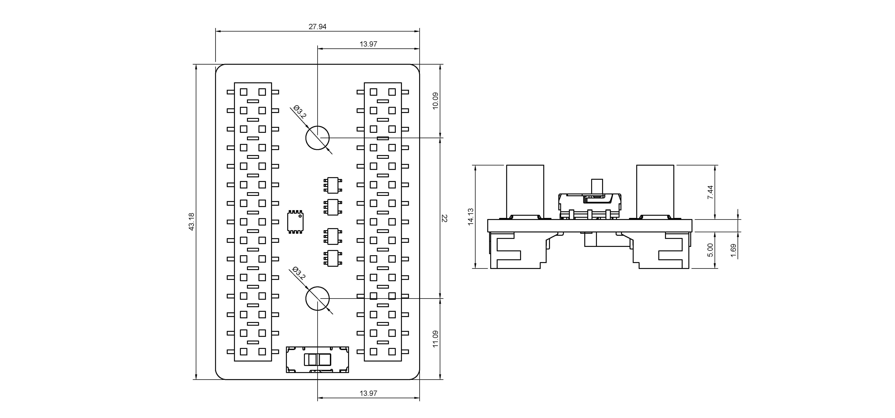

The Nano Connector Carrier has two 3.2 mm drilled mounting holes for mechanical fixing.

### Board Connectors

The Nano Connector Carrier's connectors are placed on the top side of the board, as shown in the figure below; all the dimensions are in mm.

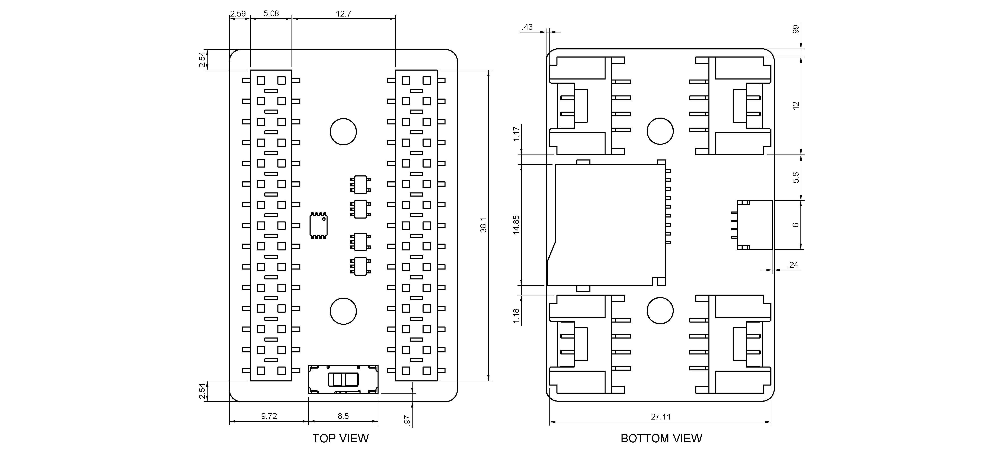

## Certifications

### Certificactions Summary

|  **Certification**  | **Status** |
| :-----------------: | :--------: |
| CE (European Union) |    Yes     |
|        RoHS         |    Yes     |
|        REACH        |    Yes     |
|        WEEE         |    Yes     |
|      FCC (USA)      |    Yes     |
|     IC (Canada)     |    Yes     |
|      UKCA (UK)      |    Yes     |

### Declaration of Conformity CE DoC (EU)

We declare under our sole responsibility that the products above are in conformity with the essential requirements of the following EU Directives and therefore qualify for free movement within markets comprising the European Union (EU) and European Economic Area (EEA).

### Declaration of Conformity to EU RoHS & REACH 211 01/19/2021

Arduino boards are in compliance with RoHS 2 Directive 2011/65/EU of the European Parliament and RoHS 3 Directive 2015/863/EU of the Council of 4 June 2015 on the restriction of the use of certain hazardous substances in electrical and electronic equipment.

| **Substance**                          | **Maximum Limit (ppm)** |
| -------------------------------------- | ----------------------- |
| Lead (Pb)                              | 1000                    |
| Cadmium (Cd)                           | 100                     |
| Mercury (Hg)                           | 1000                    |
| Hexavalent Chromium (Cr6+)             | 1000                    |
| Poly Brominated Biphenyls (PBB)        | 1000                    |
| Poly Brominated Diphenyl ethers (PBDE) | 1000                    |
| Bis(2-Ethylhexyl) phthalate (DEHP)     | 1000                    |
| Benzyl butyl phthalate (BBP)           | 1000                    |
| Dibutyl phthalate (DBP)                | 1000                    |
| Diisobutyl phthalate (DIBP)            | 1000                    |

Exemptions : No exemptions are claimed.

Arduino Boards are fully compliant with the related requirements of European Union Regulation (EC) 1907 /2006 concerning the Registration, Evaluation, Authorization and Restriction of Chemicals (REACH). We declare none of the SVHCs ([https://echa.europa.eu/web/guest/candidate-list-table](https://echa.europa.eu/web/guest/candidate-list-table)), the Candidate List of Substances of Very High Concern for authorization currently released by ECHA, is present in all products (and also package) in quantities totaling in a concentration equal or above 0.1%. To the best of our knowledge, we also declare that our products do not contain any of the substances listed on the "Authorization List" (Annex XIV of the REACH regulations) and Substances of Very High Concern (SVHC) in any significant amounts as specified by the Annex XVII of Candidate list published by ECHA (European Chemical Agency) 1907 /2006/EC.

### Conflict Minerals Declaration

As a global supplier of electronic and electrical components, Arduino is aware of our obligations with regards to laws and regulations regarding Conflict Minerals, specifically the Dodd-Frank Wall Street Reform and Consumer Protection Act, Section 1502. Arduino does not directly source or process conflict minerals such as Tin, Tantalum, Tungsten, or Gold. Conflict minerals are contained in our products in the form of solder, or as a component in metal alloys. As part of our reasonable due diligence Arduino has contacted component suppliers within our supply chain to verify their continued compliance with the regulations. Based on the information received thus far we declare that our products contain Conflict Minerals sourced from conflict-free areas.

### FCC Caution

Any Changes or modifications not expressly approved by the party responsible for compliance could void the user’s authority to operate the equipment.

This device complies with part 15 of the FCC Rules. Operation is subject to the following two conditions:

(1) This device may not cause harmful interference

(2) this device must accept any interference received, including interference that may cause undesired operation.

**FCC RF Radiation Exposure Statement:**

1. This Transmitter must not be co-located or operating in conjunction with any other antenna or transmitter.

2. This equipment complies with RF radiation exposure limits set forth for an uncontrolled environment.

3. This equipment should be installed and operated with a minimum distance of 20 cm between the radiator & your body.

English:
User manuals for licence-exempt radio apparatus shall contain the following or equivalent notice in a conspicuous location in the user manual or alternatively on the device or both. This device complies with Industry Canada licence-exempt RSS standard(s). Operation is subject to the following two conditions:

(1) this device may not cause interference

(2) this device must accept any interference, including interference that may cause undesired operation of the device.

French:
Le présent appareil est conforme aux CNR d’Industrie Canada applicables aux appareils radio exempts de licence. L’exploitation est autorisée aux deux conditions suivantes :

(1) l’ appareil nedoit pas produire de brouillage

(2) l’utilisateur de l’appareil doit accepter tout brouillage radioélectrique subi, même si le brouillage est susceptible d’en compromettre le fonctionnement.

**IC SAR Warning:**

English
This equipment should be installed and operated with a minimum distance of 20 cm between the radiator and your body.

French:
Lors de l’ installation et de l’ exploitation de ce dispositif, la distance entre le radiateur et le corps est d ’au moins 20 cm.

**Important:** The operating temperature of the EUT can’t exceed 85 ℃ and shouldn’t be lower than -40 ℃.

Hereby, Arduino S.r.l. declares that this product is in compliance with essential requirements and other relevant provisions of Directive 201453/EU. This product is allowed to be used in all EU member states.

## Company Information

| Company Information    | Details                               |
| --------------- | -------------------------------------------- |
| Company Name    | Arduino S.r.l.                               |
| Company Address | Via Andrea Appiani, 25 - 20900 MONZA (Italy) |

## Reference Documentation

| Reference                       | Link                                                                                                             |
| ------------------------------- | ---------------------------------------------------------------------------------------------------------------- |
| Arduino IDE (Desktop)           | [https://www.arduino.cc/en/Main/Software](https://www.arduino.cc/en/Main/Software)                               |
| Arduino IDE (Cloud)             | [https://app.arduino.cc/sketches](https://app.arduino.cc/sketches)                                               |
| Arduino Cloud - Getting Started | [https://docs.arduino.cc/arduino-cloud/guides/overview/](https://docs.arduino.cc/arduino-cloud/guides/overview/) |
| Project Hub                     | [https://projecthub.arduino.cc/](https://projecthub.arduino.cc/)                                                 |
| Language Reference              | [https://docs.arduino.cc/language-reference/](https://docs.arduino.cc/language-reference/)                       |
| Online Store                    | [https://store.arduino.cc/](https://store.arduino.cc/)                                                           |

## Change Log

| Date      | **Revision** | **Changes**   |
| --------- | ------------ | ------------- |
| 22/05/2025 | 2            | Technical corrections, voltage notation standardization, nomenclature fixes and change log correction  |
| 21/05/2025 | 1            | First Release |