The Nano Connector Carrier is a versatile expansion board designed for the Arduino Nano form factor. It provides an easy way to interface your Arduino Nano with various sensors, modules and storage options through industry-standard connectors. This carrier board eliminates the need for complex wiring and breadboarding, allowing you to focus on your project's functionality rather than connectivity challenges.

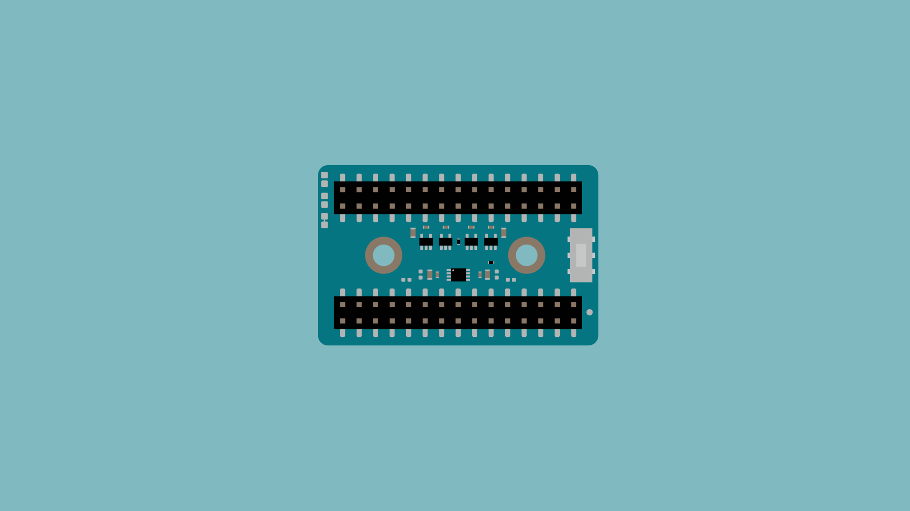

## Compatibility

The carrier is designed to work with all Arduino Nano form factor boards. Its standardized layout ensures compatibility with current and future Arduino Nano family boards, giving you flexibility in developing your current and future projects.

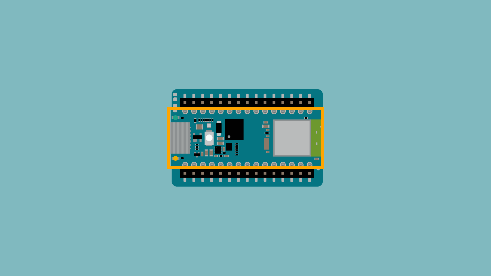

## Features

The Nano Connector Carrier comes packed with the following key features to enhance your projects based on Nano family boards:

### Input Selector Switch

To ensure full compatibility with the Nano family boards, as some boards can be [configured to different input voltage levels](https://docs.arduino.cc/tutorials/nano-esp32/cheat-sheet/#Input:~:text=otherwise%20be%20damaged.-,Input%20Voltage%20(VIN),-If%20you%27re%20using) the carrier includes a switch to select +3.3 VDC or +5 VDC input voltage levels. The selector switch lets you choose the appropriate input voltage for your Nano board.

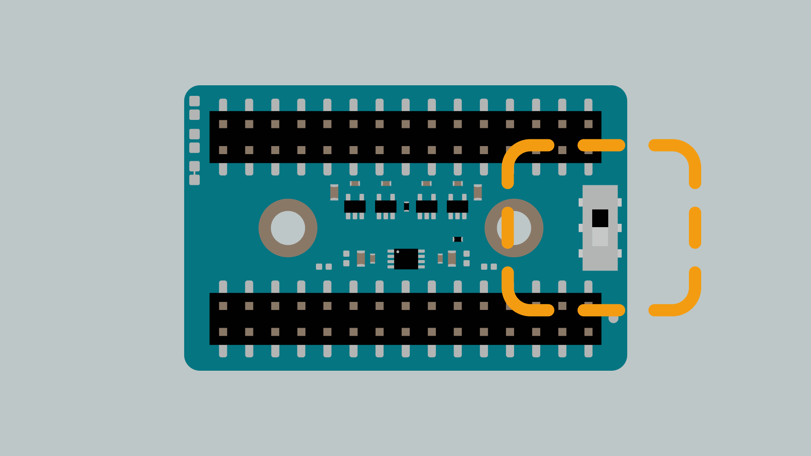

This feature also ensures compatibility with a wide range of sensors and modules that operate at different voltage levels, eliminating the need for additional level shifters in most cases.

### Connectors

The Nano Connector Carrier includes both QWIIC and Grove connectors for expanding the Nano board's capability with external sensors, as well as an onboard microSD card slot to expand the board's memory capabilities :
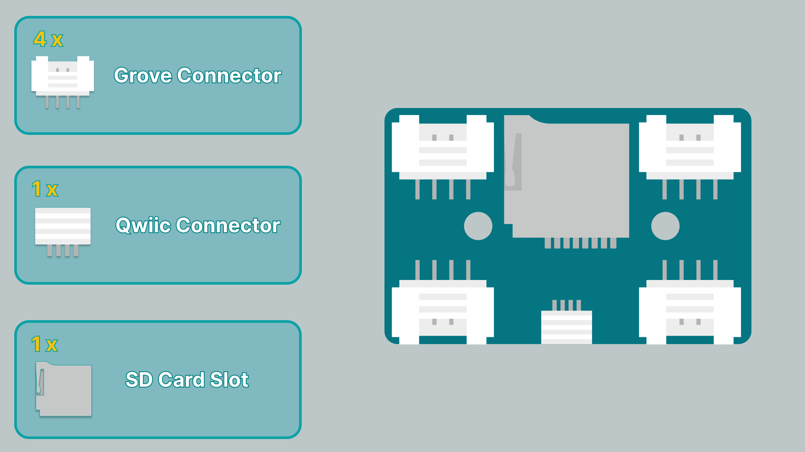

#### Qwiic Connector

The Nano Connector Carrier features a single Qwiic connector, allowing you to easily interface with Arduino Modulino nodes and other Qwiic-based sensors and modules.

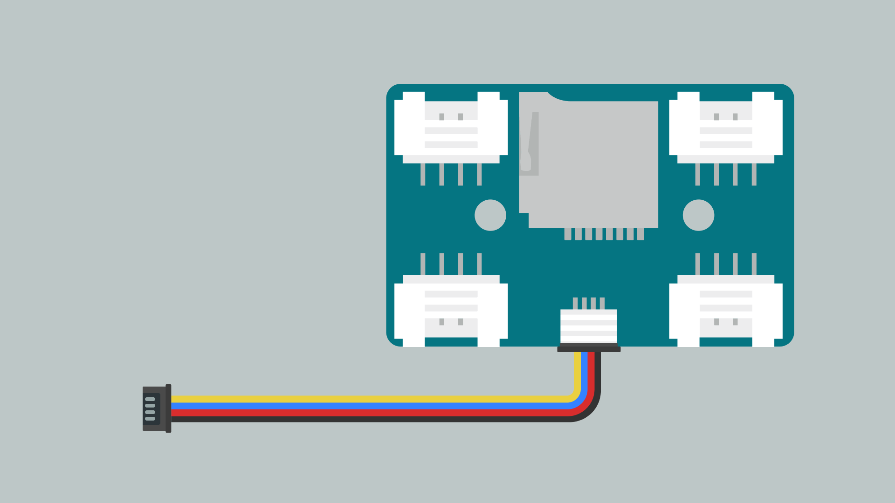

The Qwiic connector uses a 4-pin JST SH connector (P/N: SM04B-SRSS-TB(LF)(SN)) with the following standardized pinout:

| Pin | Connection                               |
|-----|------------------------------------------|
| GND | Ground                                   |
| VCC | +3.3 VDC |
| SDA | I²C Data (connected to the A4 pin of the Nano board)   |
| SCL | I²C Clock (connected to the A5 pin of the Nano board) |

A single Qwiic connector is all you need since it's designed to be daisy-chainable, allowing you to connect multiple Modulino nodes or other Qwiic-compatible devices in series. This connector makes it plug-and-play simple to add sensors, displays and other Qwicc-compatible devices to your project.

#### Grove Connectors

The Nano Connector Carrier also includes four Grove connectors, compatible with the extensive ecosystem of Grove modules.

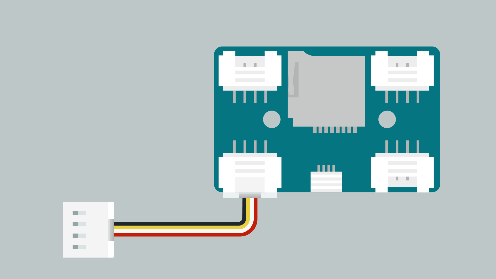

The Grove connector uses a 4-pin DIP-2.0 mm connector (P/N: 114020164) with four different standardized pinouts:

**Grove (J5) - Analog**

| Pin | Connection                           |
|-----|--------------------------------------|
| GND | Ground                               |
| VCC | +3.3 VDC/ +5 VDC (selected by the input selector switch) |
| A3  | Analog pin A3 on the Nano board|
| A2  | Analog pin A2 on the Nano board|

**Grove (J7) - Analog**

| Pin | Connection                           |
|-----|--------------------------------------|
| GND | Ground                               |
| VCC | +3.3 VDC/ +5 VDC (selected by the input selector switch) |
| A1  | Analog pin A1 on the Nano board|
| A0  | Analog pin A0 on the Nano board|

**Grove (J4) - SPI**

| Pin  | Connection                           |
|------|--------------------------------------|
| GND  | Ground                               |
| VCC | +3.3 VDC/ +5 VDC (selected by the input selector switch) |
| MOSI | SPI MOSI (D11 pin on the Nano board)|
| MISO | SPI MISO (D12 pin on the Nano board)|

**Grove (J6) - I²C**

| Pin | Connection                           |
|-----|--------------------------------------|
| GND | Ground                               |
| VCC | +3.3 VDC/ +5 VDC (selected by the input selector switch) |
| SDA | I²C Data (A4 pin on the Nano board, shared with the Qwiic connector) |
| SCL | I²C Clock (A5 pin on the Nano board, shared with the Qwiic connector)|

With the standardized pinouts mentioned, using Groove connectors eliminates the need for soldering or breadboarding and simplifies connecting various and different sensors, actuators and displays to your Nano family board.

#### MicroSD Card Slot

The Nano Connector Carrier includes an onboard microSD card slot for projects requiring data logging or file storage.

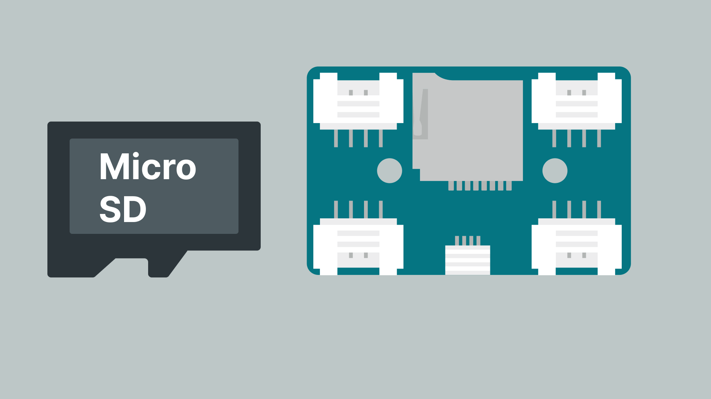

The microSD card slot is connected to the Nano family board through the SPI interface as follows:

| SPI Signal | Arduino Pin                            |
|------------|----------------------------------------|
| MISO       | D12 pin on the Nano board|
| MOSI       | D11 pin on the Nano board|
| SCK        | D13 pin on the Nano board|
| CS         | D4 pin on the Nano board (configurable also to D2 or D3 pins) |

***By default, pin D4 is used as the SPI CS (Chip Select) for the microSD card, but you can also configure solder jumpers on the Nano Connector Carrier to use D2 or D3 pins if needed.***

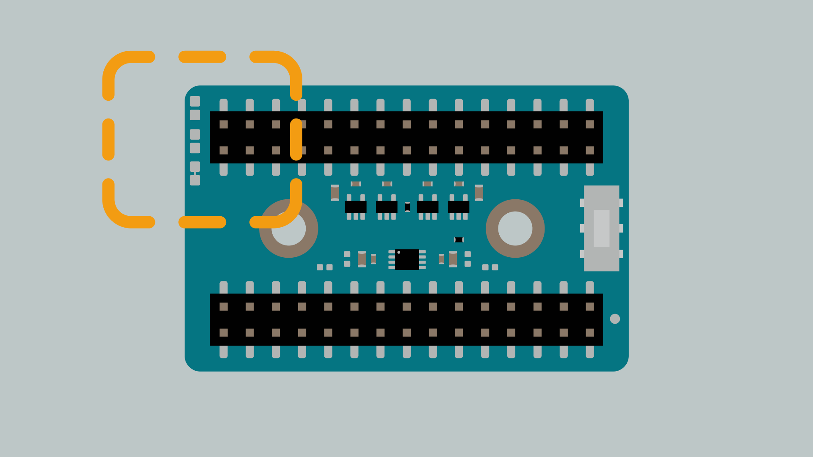

With this feature, your Nano family board can read and write files on a microSD card, making it perfect for data logging applications, playing audio files or storing configuration data.

## Pinout

The Nano Connector Carrier features the intuitive and straightforward Nano family board pinout that easily connects various peripherals to your Nano family board. The carrier is divided into two main sections:

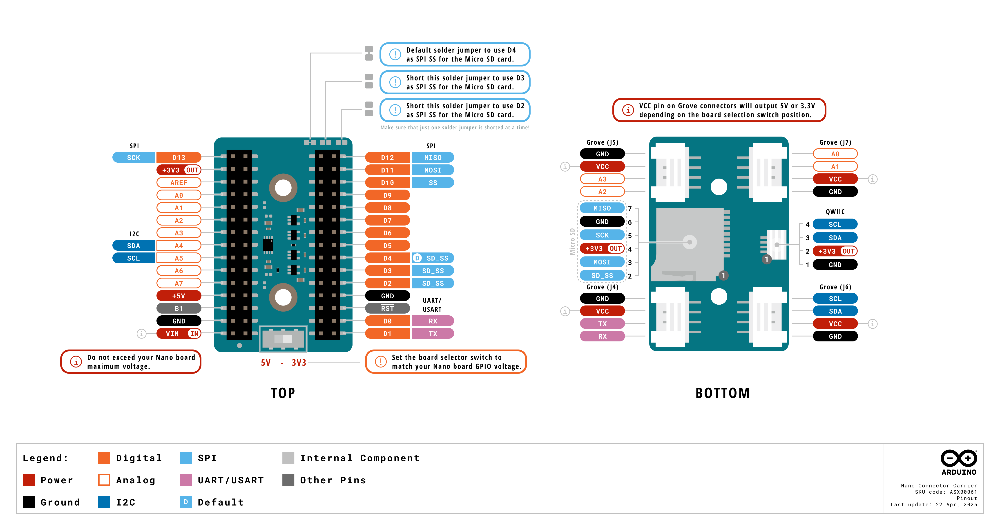

The pinout includes labeled connections for all the interfaces:
- Nano family pins (digital and analog pins)
- SPI interface pins
- I²C interface pins
- Power lines (+5 VDC, +3.3 VDC and GND)
- Serial interface pins

The board's connectors are mapped to specific Nano family pins, making it straightforward to program your projects. The voltage level switch affects all VCC pins on the Grove and Qwiic connectors, allowing you to match your peripheral's voltage requirements.

## What to Do Next?

### Example Project: Teamometer

The Teamometer demonstrates how different Modulino sensor modules can work together to solve a real-world problem. This project combines temperature sensing, LED visual feedback, button interaction and audio alerts to create a smart tea temperature monitor. It's a fun way to see how easily the Nano Connector Carrier can connect to different sensors and modules simultaneously, giving you visual cues, sounds and temperature readings in a straightforward project, even with different connectors.

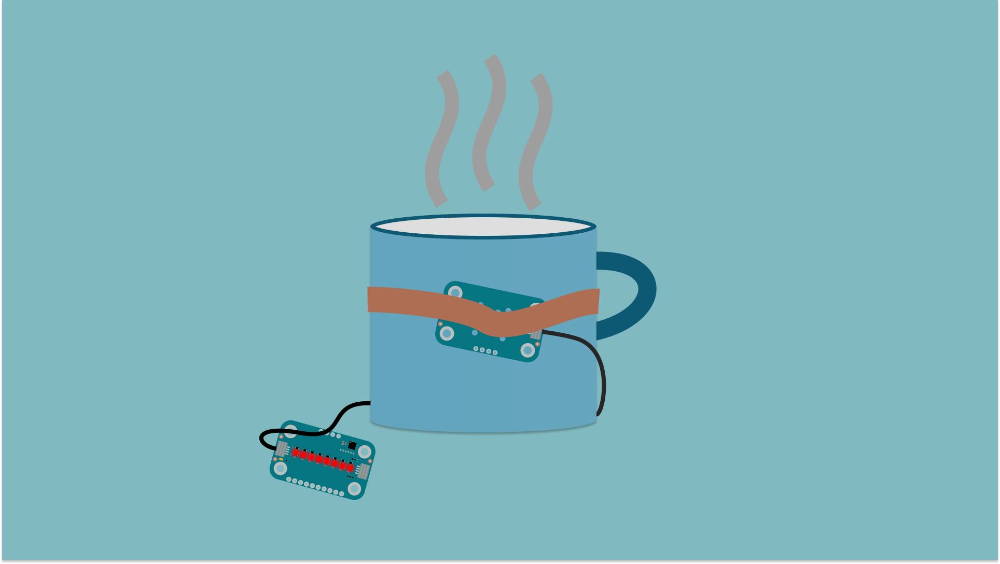

**Components needed:**
- [Modulino Buttons](https://store.arduino.cc/products/modulino-buttons) - ABX00110
- [Modulino Pixels](https://store.arduino.cc/products/modulino-pixels) - ABX00109
- [Modulino Thermo](https://store.arduino.cc/products/modulino-thermo) - ABX00103
- [Nano family board](https://docs.arduino.cc/hardware/)
- [Nano Connector Carrier](https://store.arduino.cc/products/nano-connector-carrier) - ASX00061
- Grove Buzzer sensor
- Thick rubber band (for securing the Thermo module to your cup)
- Cup
- Your favorite tea

**Assembly instructions:**
1. Connect the Modulino Buttons, Pixels and Thermo modules to your Nano family board through the Nano Connector Carrier.
2. Attach the Thermo module to the outside of your cup using the thick rubber band.
3. Connect the Grove Buzzer sensor to your Nano family board through the Nano Connector Carrier. 
4. Upload the code provided below.
5. Fill your cup with hot tea.
6. Wait a few seconds to allow the heat to transfer to the sensor.
7. Press button A to begin monitoring.

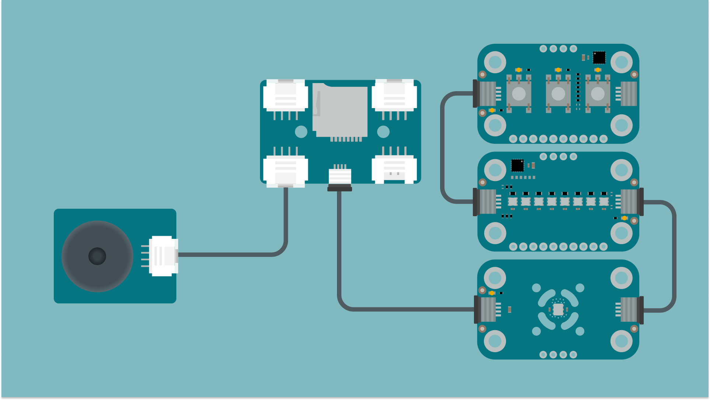

**Code Example:**
```arduino
#include <Modulino.h>

// Create object instances
ModulinoThermo thermo;
ModulinoButtons buttons;
ModulinoPixels leds;

// Define temperature thresholds (in Celsius) feel free tpo change these as the heat transfer will depend a lot on your cup. Thermal paste can be added to improve this.
const float HOT_TEMP = 80.0;       // Fresh tea temperature
const float LUKEWARM_TEMP = 40.0;  // Ideal drinking temperature
const float ROOM_TEMP = 25.0;      // Room temperature

// Define pin for buzzer
const int BUZZER_PIN = A0;

// Variables to track state
bool measuring = false;    // Are we actively measuring temperature?
bool buzzing = false;      // Is the buzzer currently active?
int brightness = 25;       // LED brightness (0-255)

void setup() {
  Serial.begin(9600);
  
  // Initialize Modulino I2C communication
  Modulino.begin();
  
  // Detect and connect to modules
  thermo.begin();
  buttons.begin();
  leds.begin();
  
  // Set up buzzer pin as output
  pinMode(BUZZER_PIN, OUTPUT);
  
  // Initial message
  Serial.println("Tea Temperature Monitor");
  Serial.println("Press Button A to start monitoring");
  
  // Show all LEDs off initially
  leds.clear();
  leds.show();
}

void loop() {
  // Check for new button events
  if (buttons.update()) {
    // Check which button was pressed (0=A, 1=B, 2=C)
    if (buttons.isPressed(0)) {
      Serial.println("Button A pressed - Start measuring!");
      measuring = true;
    } else if (buttons.isPressed(1)) {
      Serial.println("Button B pressed - Stop buzzer!");
      // Turn off buzzer if it's on
      if (buzzing) {
        noTone(BUZZER_PIN);
        buzzing = false;
      }
    }
  }
  
  // If we're in measuring mode, check temperature
  if (measuring) {
    // Read temperature in Celsius from the sensor
    float celsius = thermo.getTemperature();
    
    Serial.print("Temperature (C): ");
    Serial.println(celsius);
    
    // Update the LED progress bar based on temperature
    updateTemperatureDisplay(celsius);
    
    // Check if tea has cooled to lukewarm
    if (celsius <= LUKEWARM_TEMP && celsius > ROOM_TEMP) {
      // Tea is ready to drink! Activate buzzer if not already buzzing
      if (!buzzing) {
        Serial.println("Tea is ready to drink!");
        tone(BUZZER_PIN, 1000); // 1kHz tone
        buzzing = true;
      }
    } 
    // If the tea is removed (temperature drops to near room temp)
    else if (celsius <= ROOM_TEMP) {
      // Turn off buzzer
      if (buzzing) {
        noTone(BUZZER_PIN);
        buzzing = false;
      }
      // Reset measuring state as tea is likely removed
      measuring = false;
      Serial.println("Tea removed or cooled to room temperature");
      Serial.println("Press Button A to start new measurement");
      leds.clear();
      leds.show();
    }
    
    // If tea is still too hot
    else if (celsius > LUKEWARM_TEMP) {
      // Ensure buzzer is off
      if (buzzing) {
        noTone(BUZZER_PIN);
        buzzing = false;
      }
    }
  }
  
  // Small delay to prevent reading too frequently
  delay(500);
}

// Function to update LED display based on temperature
void updateTemperatureDisplay(float celsius) {
  // Calculate how many LEDs to light based on temperature
  // Hotter = more LEDs lit
  
  // Map temperature range to LED count (0-8)
  // If temperature is at or above HOT_TEMP, all LEDs are on
  // If temperature is at or below ROOM_TEMP, no LEDs are on
  int ledCount = map(celsius * 100, ROOM_TEMP * 100, HOT_TEMP * 100, 0, 8);
  
  // Constrain to valid range
  ledCount = constrain(ledCount, 0, 8);
  
  // Update LEDs
  leds.clear(); // Use the class's built-in clear method
  
  // Light up LEDs based on temperature with color coding
  for (int i = 0; i < ledCount; i++) {
    // Choose color based on temperature ranges
    if (celsius >= 70) {
      // Very hot (70°C+): RED
      leds.set(i, RED, brightness);
    } else if (celsius >= 55) {
      // Hot (55-70°C): VIOLET
      leds.set(i, VIOLET, brightness);
    } else if (celsius >= LUKEWARM_TEMP) {
      // Warm (40-55°C): WHITE
      leds.set(i, WHITE, brightness);
    } else if (celsius >= 30) {
      // Getting cool (30-40°C): GREEN
      leds.set(i, GREEN, brightness);
    } else {
      // Cool (below 30°C): BLUE
      leds.set(i, BLUE, brightness);
    }
  }
  
  // Update the LEDs
  leds.show();
}
```

The temperature information will be displayed on the serial console and the Modulino Pixels. As your tea cools, fewer LEDs will light up, and the colors will change from red (very hot) through violet, white, and green, to blue (cool). When your tea reaches the perfect drinking temperature, the buzzer will tell you it is ready.

Keep in mind that because the sensor is designed for atmospheric temperature monitoring you might have to tinker the values a bit(depending on your setup) as the measurement will not be as accurate measuring a different medium.

### Example Project: Motion Logger

The Motion Tracker demonstrates how the Nano Connector Carrier can integrate with the Movement sensor to record motion data. This project showcases real-time motion sensing, button control and data logging to create a portable motion capture system that can be used for activity tracking, sports analysis or interactive projects.

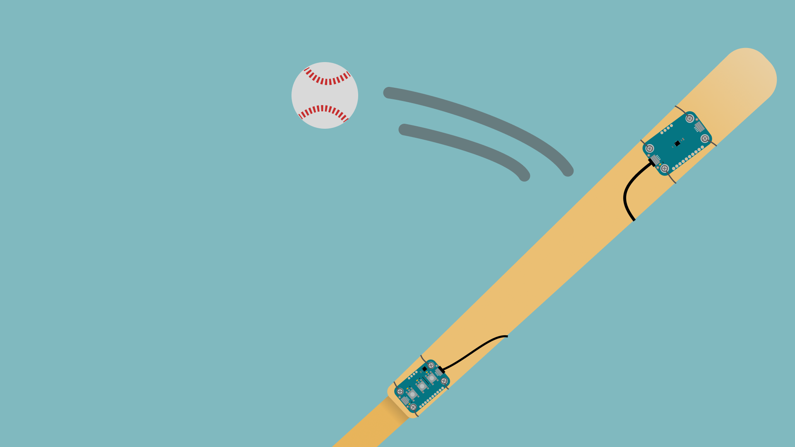

**Components needed:**
- [Modulino Movement](https://store.arduino.cc/products/modulino-movement) - ABX00101
- [Modulino Buttons ](https://store.arduino.cc/products/modulino-buttons) - ABX00110
- MicroSD card
- [Nano Connector Carrier](https://store.arduino.cc/products/nano-connector-carrier) - ASX00061


**Assembly instructions:**
1. Connect the Modulino Movement and Buttons modules to your Nano Connector Carrier
2. Insert a microSD card into the Nano Connector Carrier
3. Upload the example sketch provided below
4. Open the Arduino IDE's Serial Monitor to view real-time motion data
5. Press button A to start recording motion data to the microSD card
6. Move the sensor to capture motion data
7. Press button A again to stop recording

**Example sketch:**
```arduino
/*
 * Modulino Movement Logger
 *
 * Records movement data from a Modulino Movement sensor to an SD card.
 * Press Button A to start/stop recording.
 */
#include "Modulino.h"
#include <SD.h>

// Create objects for the modules
ModulinoMovement movement;
ModulinoButtons buttons;

// SD card configuration
#define SD_CS    4    // SD Card chip select (D4 on Modulino carrier)
File dataFile;

// Variables to track state
bool recordingActive = false;
unsigned long lastRecordTime = 0;
const unsigned long RECORD_INTERVAL = 100;  // Record every 100ms (10Hz)
String fileName = "/movement.csv";  // File name on SD card

// Movement data
float x, y, z;          // Acceleration
float roll, pitch, yaw; // Gyroscope

void setup() {
  // Initialize serial communication
  Serial.begin(115200);
  delay(1000);  // Give serial monitor time to connect
  
  Serial.println("===================================");
  Serial.println("Modulino Movement Logger");
  Serial.println("===================================");
  
  // Initialize Modulino I2C communication
  Modulino.begin();
  
  // Initialize modules
  movement.begin();
  buttons.begin();
  
  Serial.println("Press Button A to start/stop recording");
  
  // Initialize SD card
  Serial.print("Initializing SD card...");
  if (!SD.begin(SD_CS)) {
    Serial.println("SD card initialization failed!");
    Serial.println("Check connections and continue anyway.");
  } else {
    Serial.println("SD card initialized successfully.");
  }
  
  // Create CSV file with headers if it doesn't exist
  if (!SD.exists(fileName)) {
    dataFile = SD.open(fileName, FILE_WRITE);
    if (dataFile) {
      dataFile.println("Time,AccelX,AccelY,AccelZ,Roll,Pitch,Yaw");
      dataFile.close();
      Serial.println("Created new CSV file with headers");
    } else {
      Serial.println("Error creating file!");
    }
  } else {
    Serial.println("File exists, will append to it");
  }
  
  Serial.println("Setup complete!");
  Serial.println("===================================");
}

void loop() {
  // Read new movement data from the sensor (always do this to keep data current)
  movement.update();
  
  // Get acceleration and gyroscope values
  x = movement.getX();
  y = movement.getY();
  z = movement.getZ();
  roll = movement.getRoll();
  pitch = movement.getPitch();
  yaw = movement.getYaw();
  
  // Print current values to serial monitor
  Serial.print("A: ");
  Serial.print(x, 3);
  Serial.print(", ");
  Serial.print(y, 3);
  Serial.print(", ");
  Serial.print(z, 3);
  Serial.print(" | G: ");
  Serial.print(roll, 1);
  Serial.print(", ");
  Serial.print(pitch, 1);
  Serial.print(", ");
  Serial.println(yaw, 1);
  
  // Check for button presses
  if (buttons.update()) {
    // Check if button A was pressed (index 0)
    if (buttons.isPressed(0)) {
      // Toggle recording mode
      recordingActive = !recordingActive;
      
      if (recordingActive) {
        Serial.println("------------------------------------");
        Serial.println("RECORDING STARTED - Button A pressed");
        Serial.println("------------------------------------");
      } else {
        Serial.println("------------------------------------");
        Serial.println("RECORDING STOPPED - Button A pressed");
        Serial.println("------------------------------------");
      }
      
      // Small delay after button press to debounce
      delay(300);
    }
  }
  
  // If recording is active, save data to SD card at the specified interval
  if (recordingActive) {
    unsigned long currentTime = millis();
    if (currentTime - lastRecordTime >= RECORD_INTERVAL) {
      // Open the file for writing
      dataFile = SD.open(fileName, FILE_APPEND);
      
      if (dataFile) {
        // Write timestamp and movement data to CSV file
        dataFile.print(currentTime);
        dataFile.print(",");
        dataFile.print(x, 3);
        dataFile.print(",");
        dataFile.print(y, 3);
        dataFile.print(",");
        dataFile.print(z, 3);
        dataFile.print(",");
        dataFile.print(roll, 1);
        dataFile.print(",");
        dataFile.print(pitch, 1);
        dataFile.print(",");
        dataFile.println(yaw, 1);
        
        // Close the file
        dataFile.close();
      } else {
        Serial.println("Error opening file for writing");
      }
      
      lastRecordTime = currentTime;
    }
  }
  
  // Small delay to keep things responsive but not flood serial monitor
  delay(50);
}
```
The Motion Tracker continuously reads acceleration and orientation data from the Modulino Movement, displaying it in real-time on the Arduino IDE Serial Monitor. When recording is activated, the data is saved to a CSV file on the microSD card, creating a detailed motion profile that can be analyzed later in a spreadsheet or data visualization tools. This project is perfect for capturing movement patterns, analyzing sports techniques or creating interactive motion-controlled devices.

### Example Project: Enclosure Monitor in MicroPython

The Enclosure Monitor demonstrates how MicroPython and Modulino modules can work together to create a smart environmental monitoring system. This project uses temperature sensing and LED visual feedback to monitor conditions inside an enclosure, like a terrarium, server cabinet, or food storage area. It logs data over time while providing immediate visual indicators if temperatures fall outside the ideal range.
Note that the temperature settings can be changed to your specific use-case.

To get started with MicroPython and install the Modulino library on your Arduino board, follow the official guide [here](https://docs.arduino.cc/micropython/modulinos/installation/). This guide will walk you through installing both MicroPython and the necessary Modulino libraries to work with your modules.

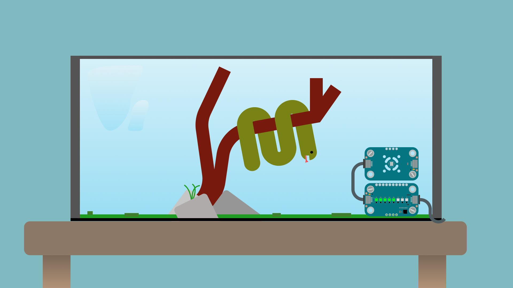

**Components needed:**
- [Modulino Thermo](https://store.arduino.cc/products/modulino-thermo) - ABX00103
- [Modulino Pixels](https://store.arduino.cc/products/modulino-pixels) - ABX00109
- [Nano family board](https://docs.arduino.cc/hardware/)
- [Nano Connector Carrier](https://store.arduino.cc/products/nano-connector-carrier) - ASX00061
- Optional enclosure for permanent installation

**Assembly instructions:**
1. Connect the Modulino Thermo and Pixels modules to your Nano family board through the Nano Connector Carrier.
2. Position the Thermo module where you want to monitor temperature (inside your enclosure).
3. Place the Pixels module where it's visible for status monitoring.
4. Upload the MicroPython code provided below.
5. Open the serial monitor to view real-time readings.
6. The system will automatically begin monitoring and logging data.

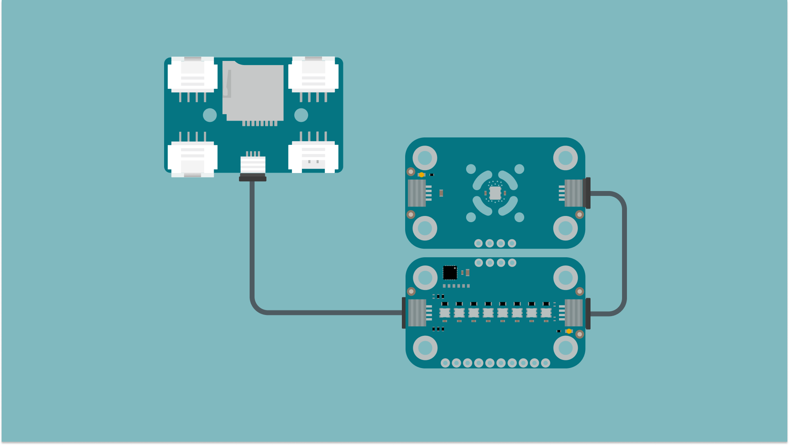

**Code Example:**
```python
"""
Enclosure Temperature Monitor using Modulino Thermo and Pixels modules.
- BLUE LEDs: Too cold (below MIN_TEMP)
- GREEN LEDs: Ideal temperature (between MIN_TEMP and MAX_TEMP)
- RED LEDs: Too hot (above MAX_TEMP)

Logs temperature data to both the console and internal file system.
"""
from modulino import ModulinoThermo, ModulinoPixels, ModulinoColor
from time import sleep
import os

# Create module instances
thermo = ModulinoThermo()
pixels = ModulinoPixels()

# Configuration
MIN_TEMP = 20.0        # Below this is too cold (BLUE)
MAX_TEMP = 25.0        # Above this is too hot (RED)
BRIGHTNESS = 50        # LED brightness (0-100)
LOG_FILE = "templog.csv"  # Log file name in the internal file system
LOG_INTERVAL = 5       # Log every 5 readings

# Create log file with headers if it doesn't exist
try:
    # Check if file exists
    files = os.listdir()
    if LOG_FILE not in files:
        with open(LOG_FILE, 'w') as f:
            f.write('Reading,Temperature,Humidity,Status\n')
        print(f"Created new log file: {LOG_FILE}")
    else:
        print(f"Using existing log file: {LOG_FILE}")
except Exception as e:
    print(f"File system error: {e}")

# Initialize LEDs to off
pixels.clear_all().show()

# Main loop
print("=== Enclosure Temperature Monitor ===")
print(f"Cold: < {MIN_TEMP}°C | Ideal: {MIN_TEMP}-{MAX_TEMP}°C | Hot: > {MAX_TEMP}°C")

counter = 0  # Simple counter for readings

while True:
    counter += 1
    
    # Read temperature and humidity
    temp = thermo.temperature
    humidity = thermo.relative_humidity
    
    # Update display if temperature reading is valid
    if temp is not None:
        # Determine temperature status
        if temp < MIN_TEMP:
            status = "Cold"
            color = ModulinoColor.BLUE
        elif temp > MAX_TEMP:
            status = "Hot"
            color = ModulinoColor.RED
        else:
            status = "Ideal"
            color = ModulinoColor.GREEN
        
        # Print to console
        print(f"Temp: {temp:.1f}°C - {status}", end="")
        if humidity is not None:
            print(f", Humidity: {humidity:.1f}%")
        else:
            print("")
        
        # Update LED display
        pixels.clear_all()
        # Calculate how many LEDs to light (1-8)
        led_count = int(max(1, min(8, (temp - MIN_TEMP + 5) / 15 * 8)))
        for i in range(led_count):
            pixels.set_color(i, color, BRIGHTNESS)
        pixels.show()
        
        # Log to file at interval
        if counter % LOG_INTERVAL == 0:
            try:
                with open(LOG_FILE, 'a') as f:
                    humidity_str = f"{humidity:.1f}" if humidity is not None else "N/A"
                    f.write(f"{counter},{temp:.1f},{humidity_str},{status}\n")
                print("Data logged to file ✓")
            except Exception as e:
                print(f"Failed to write to file: {e}")
    else:
        print("Waiting for temperature reading...")
        # Blink white LED to indicate waiting
        pixels.set_all_color(ModulinoColor.WHITE, 20).show()
        sleep(0.5)
        pixels.clear_all().show()
        sleep(0.5)
    
    # Wait before next reading
    sleep(1)
```

The Enclosure Monitor provides immediate visual feedback about environmental conditions through the Modulino Pixels. LEDs glow BLUE when it's too cold, GREEN when the temperature is in the ideal range, and RED when it's too hot. The number of illuminated LEDs indicates where the temperature falls within each range - more LEDs light up as temperature increases.

Temperature and humidity readings are displayed in real time on the serial monitor and logged to a CSV file on the internal storage. This data can be retrieved later for analysis of environmental trends over time.

Now that you understand the features of the Nano Connector Carrier, here are some exciting project ideas to get you started:

- **Weather Station**: Collect temperature, humidity and pressure data via sensors connected to the Grove connectors to create a simple weather monitoring system.
- **Plant Monitor**: Use soil moisture and light sensors to monitor your houseplants and alert you when they need attention.
- **Data Logger**: Use the microSD card slot to record sensor readings over time, which is perfect for environmental monitoring or tracking experiments.
- **Smart Home interface**: Create a hub with multiple sensors around your home that log data or send alerts.

For additional project inspiration, check out the Arduino Project Hub or join the Arduino community forums to share your creations and learn from others.

## Conclusion

The Nano Connector Carrier transforms your Nano family board into a versatile platform capable of interfacing with different sensors, displays and storage options. By eliminating complex wiring and providing standardized pinouts, the Nano Connector Carrier allows you to focus on developing your application rather than dealing with connection issues.