## Introduction

In this tutorial, we will use MATLAB to turn on the built-in LED over Wi-FI, made possible by the NINA module embedded on the Nano 33 IoT board and MATLAB® Support Package for Arduino® Hardware.


### Goals

The goals of this project are:

- Control the Arduino Nano 33 IoT LED with MATLAB over USB.
- Control the Arduino Nano 33 IoT LED with MATLAB over Wi-Fi.
- Understand the difference between dynamic and static IP addressing.

### Hardware & Software Needed

- [Arduino Nano 33 IoT](https://store.arduino.cc/products/arduino-nano-33-iot)
- [Arduino Nano Motor Carrier](https://store.arduino.cc/products/arduino-nano-motor-carrier)
- [Micro USB Cable](https://store.arduino.cc/products/USB-Cable-type-a-male-to-micro-type-b-male)
- Single cell LiPo/Li-ion 18650 battery and holder with XT30 connector
- Valid MATLAB® licence
- [MATLAB® Support Package for Arduino® Hardware](https://www.mathworks.com/matlabcentral/fileexchange/47522-matlab-support-package-for-arduino-hardware)


***The Arduino Nano 33 IoT, Nano Motor Carrier, Micro USB cable and single cell battery are included as part of the [Arduino Engineering Kit R2](https://store.arduino.cc/products/arduino-engineering-kit-rev2)***

***A valid MATLAB® licence is needed. Your workplace or education institution may have a subscription. Alternatively, a one-year trial subscription to MATLAB® is included as part of the [Arduino Engineering Kit R2](https://store.arduino.cc/products/arduino-engineering-kit-rev2).***


### Why MATLAB?
MATLAB® is an educational and industrial programming platform used to analyse data, perform simulations and carry out model based designs. Through an interactive communication with an Arduino board, you can expand MATLAB's capabilities, while also gaining access to a wide range of math, engineering and plotting functions. Check out the capabilities of MATLAB® over on the [MathWorks website](https://www.mathworks.com/solutions.html#capabilities). In this tutorial, we will establish the connection with MATLAB via a USB and Wi-Fi connection. The [MATLAB Support Package for Arduino Hardware](https://www.mathworks.com/matlabcentral/fileexchange/47522-matlab-support-package-for-arduino-hardware) must be installed (which may require a MathWorks account), in order to facilitate the communication between the MATLAB software on your computer and your Arduino board. 

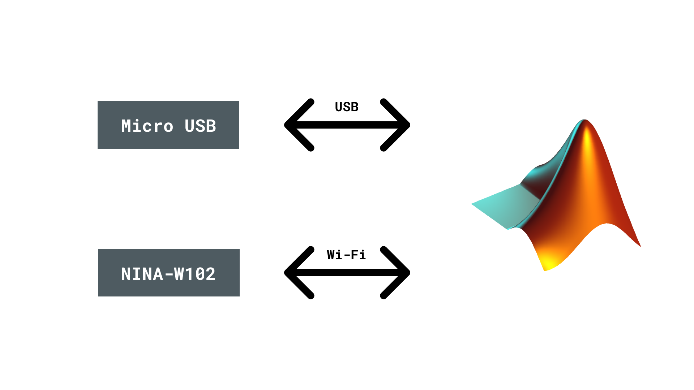 

### Static vs Dynamic IP Addressing
When you connect your Arduino board, you should see the COM port under Device Manager. By referencing the COM port, you can create a two-way data link between your computer and the Arduino device. For a device connected on a network, we can use an Internet Protocol (IP) address to identify it. In the IPv4 standard, this is written as a series of four numbers such as `192.168.1.100`. By default, most routers are configured to assign a dynamic address via a Dynamic Host Configuration Protocol (DHCP). This means less configuration, but at the cost of the IP address changing. In order to reliably address your Arduino board, you may wish to utilise a static IP address. Once a static IP address is assigned, it will stay the same.

### LED on the Arduino Nano 33 IoT
The LED in the Arduino Nano 33 IoT is connected to Digital Pin 13. By pulling this pin HIGH, we can turn the LED on and by pulling it LOW we can turn the LED off.
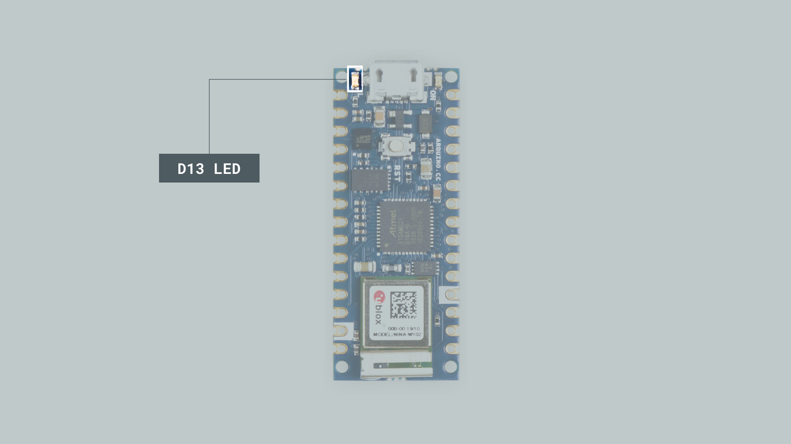

## Control LED over USB with MATLAB
**1.** Place the Nano 33 IoT in the Nano Motor Carrier. Make sure to orient it correctly (the Micro USB connector is on the same side as the blue terminal).
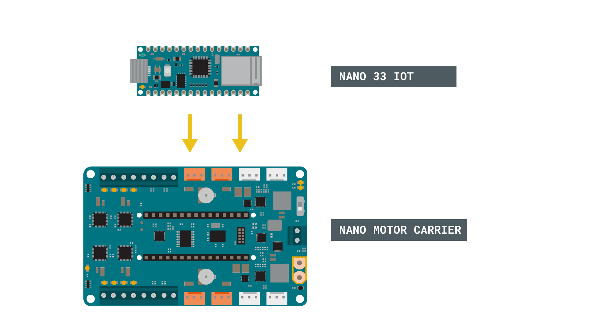


**2.**  Connect the battery. Make sure that the polarity is respected. The negative terminal of the battery should go through the black wire to ground, and the positive terminal should go through the red cable to `BATT`.

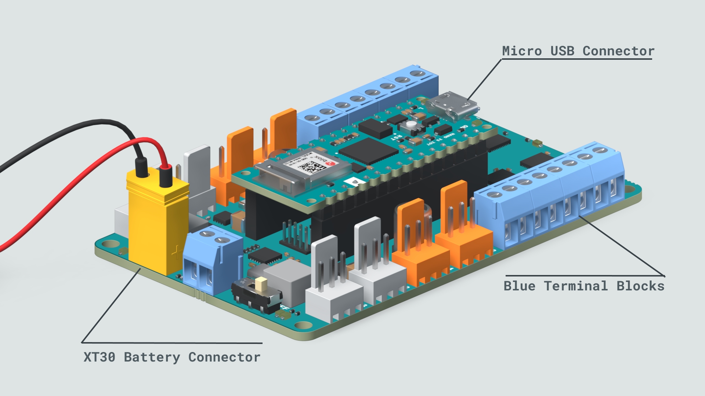


**3.** Turn on the board and connect it to your computer via a Micro USB cable.


***The board should be turned on before connecting to the computer, otherwise the board may not function correctly.***


**4.** Open MATLAB and run the command `arduinosetup()` in the Command Window.


**5.** A Graphical User Interface (GUI) appears, that will help you set up the MATLAB-Arduino connection. To establish the connection over the USB cable, make sure that the USB radio box is selected and then click on Next.

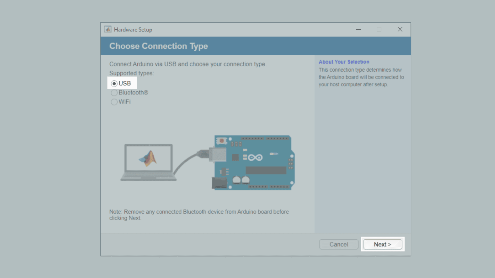


**6.** Choose the "Nano33IoT" from the dropdown menu, as well as the relevant COM port, and click on the blue `Program` button to upload the Arduino Server to the board. When you have done so, click on next.

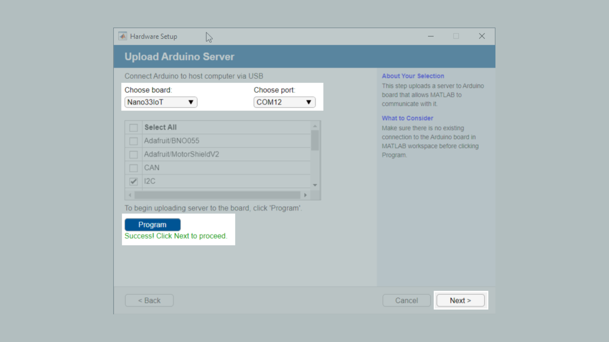

***In order to use the full functionality of the Nano Motor Carrier, you must ensure that the I2C and ArduinoMotorCarrier components are selected.***


**7.** In this step you can review the connection type, Port, board and loaded libraries. You can also click on Test connection to evaluate the Arduino-MATLAB connection. Next, you should see a Green check-mark signalling the successful connection, as shown in the image below.

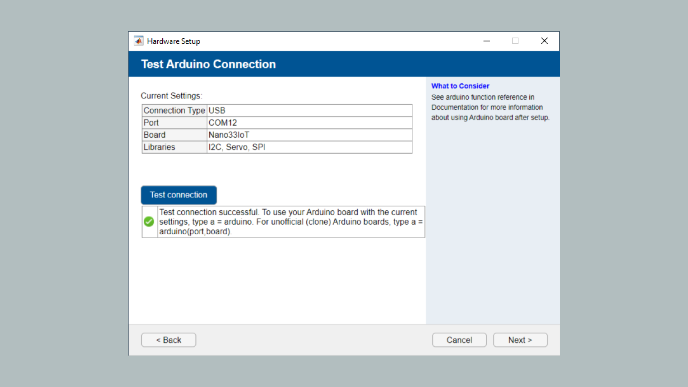


**8.** The Arduino Nano 33 IoT is now configured to interact with MATLAB. Now to create the object in MATLAB, we run the command `a=arduino()`. The properties of the object, including the COM port, are displayed as shown in the example below.

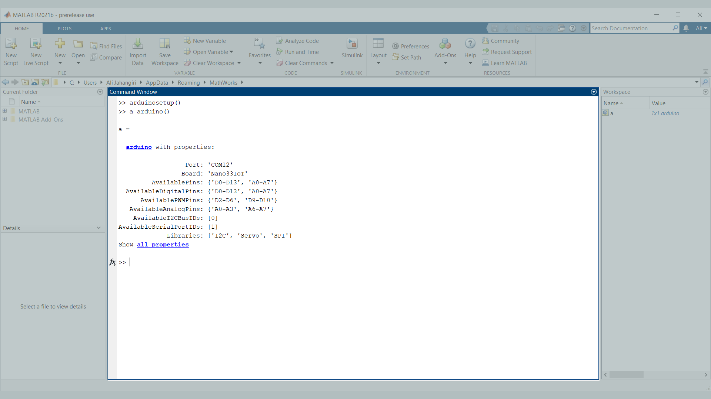


**9.** Enter the command `writeDigitalPin(a,'D13',1);`. This command is similar to the `digitalWrite(D13, HIGH)` by the Arduino programming language. Which means that digital pin 13 (D13) is connected to the built-in LED, `a` is the arduino object we created, and 1 represents a HIGH or ON state. Try turning the LED ON and OFF several times by changing 1 to 0 and vice-versa.


***Unlike in the Arduino IDE, here you cannot address the built-in LED using the `LED_BUILTIN` function.***


**10.** Now, you can use this command to continuously blink an LED as part of a `while` loop. Try entering the script below.

```arduino
while (1)
      writeDigitalPin(a, 'D13', 0);
      pause(0.5);
      writeDigitalPin(a, 'D13', 1);
      pause(0.5);
end
```


**11.** See what happens when you change the pause duration. Try replacing the while with an `if` statement to make it blink a certain number of times.

## Control LED over Wi-Fi with MATLAB

**1.** Firstly, make sure your Arduino board is connected via the USB cable. Run `clear a` to remove the previously created arduino object and then run the `arduinosetup()` command again. This time, select the Wi-Fi option. You will see that a few options appear at the bottom left. Select your Wi-Fi encryption type and enter your SSID, password and port. By default, the Arduino board will obtain a dynamic IP from your router.

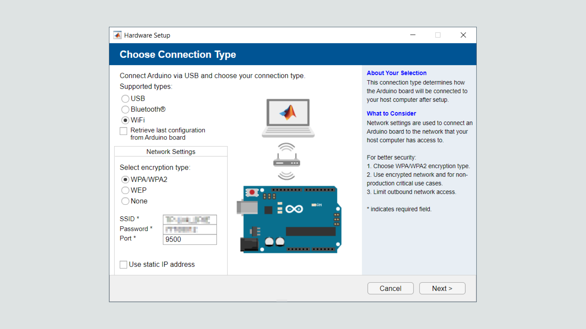


***In order to have a static IP address, check the relevant box and enter in the IP address manually. Some networks/firewalls may disable port connections. Contact your network administrator if needed.***


**2.** Select your board, choose the COM port and hit `Program`.

**3.** Click on `Test connection` to verify that the Wi-Fi connectivity functions correctly and write down the device address and port.

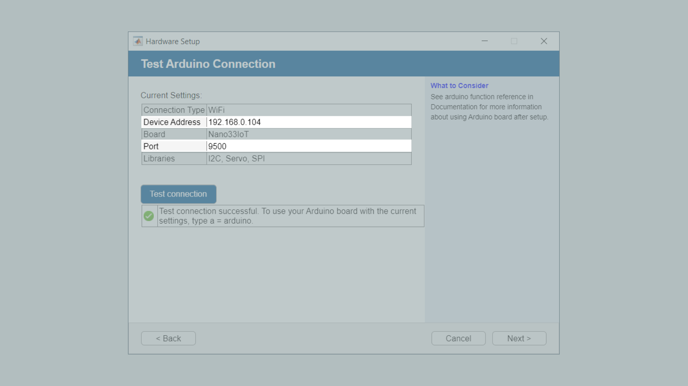

**4.** Enter the following command `a = arduino('device address','Nano33IoT',port)`, where device address and port are the values you wrote down in the last step. If successful, the `a` object will be added to the MATLAB workspace.

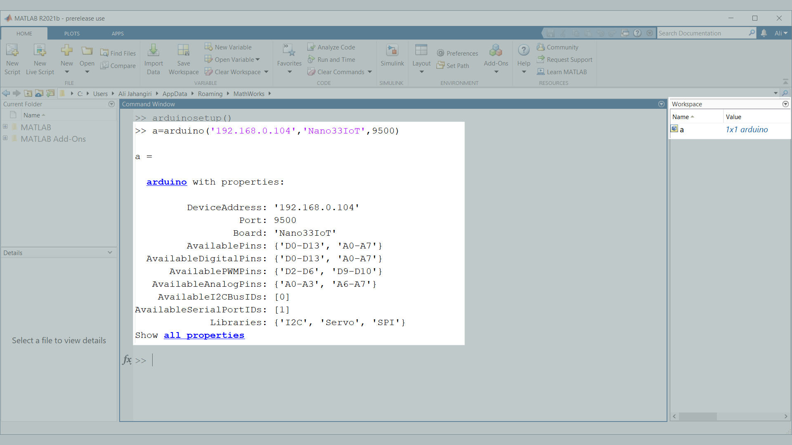

***If you wish to re-run the `arduinosetup()` function again, it is advised to clear any existing Arduino objects from the Workspace. In this example, `a` is the Arduino object so we would run the command `clear a`. Alternatively, enter `clear all` to empty the workspace.***

**5.** Enter the command `writeDigitalPin(a,'D13',1);`. Try turning the LED on and off several times


### Troubleshoot

If the code is not working, there are some common issues we can troubleshoot:

- Make sure to clear previous Arduino objects linked to the device. You can do this by running the command `clear a` where `a` is the Arduino object.
- If you get the message `Unrecognized function or variable 'arduinosetup' ` ensure that you have installed the [MATLAB Support Package for Arduino Hardware](https://www.mathworks.com/matlabcentral/fileexchange/47522-matlab-support-package-for-arduino-hardware).
- If the network requires login, you may be unable to connect. Contact your network administrator or use USB to connect to the board.


## Conclusion

You can now control your Arduino Nano 33 IoT via MATLAB by a wired or wireless connection to control your devices and make use of the powerful features for scientific computing and developing engineering applications!

## Further Ideas

- You can also use the command line arguments to upload the MATLAB server to the Nano 33 IoT via the `arduino()` command. See more information on using this function in the [MathWorks documentation](https://www.mathworks.com/help/supportpkg/arduinoio/ref/arduino.html).

- Try writing a MATLAB code that slowly increases and then decreases the blink speed.

- Write a MATLAB function that allows you to change the speed based on input arguments.

- Use the `writePWMVoltage()` function to control a LED on an external Pin.

- Try moving a DC/Servo motor via Wi-Fi.
