## Introduction 

In this tutorial, we will use Simulink to turn on the board's built-in LED over Wi-FI, made possible by the NINA module embedded on the Nano 33 IoT board and Simulink® Support Package for Arduino® Hardware.

## Goals

The goals of this project are:

- Control the Arduino Nano 33 IoT LED with Simulink over USB.
- Control the Arduino Nano 33 IoT LED with Simulink over Wi-Fi.
- Understand the difference between various deployment methods.
- Create a dashboard to tune the PWM of the LED.

## Hardware & Software Needed

- [Arduino Nano 33 IoT](https://store.arduino.cc/products/arduino-nano-33-iot)
- [Arduino Nano Motor Carrier](https://store.arduino.cc/products/arduino-nano-motor-carrier)
- [Micro USB Cable](https://store.arduino.cc/products/usb-cable-type-a-male-to-micro-type-b-male)
- Single cell LiPo/Li-ion 18650 battery and holder with XT30 connector
- Valid MATLAB® and Simulink® license
- [Simulink® Support Package for Arduino® Hardware](https://www.mathworks.com/matlabcentral/fileexchange/40312-simulink-support-package-for-arduino-hardware)

***The Arduino Nano 33 IoT, Nano Motor Carrier, Micro USB cable and single cell battery are included as part of the [Arduino Engineering Kit Rev 2](https://store.arduino.cc/products/arduino-engineering-kit-rev2)***

***A valid MATLAB® and Simulink® license is needed. Your workplace or education institution may have a subscription. Alternatively, a one-year trial subscription to MATLAB® is included as part of the [Arduino Engineering Kit Rev 2](https://store.arduino.cc/products/arduino-engineering-kit-rev2).***

## What Is Model-Based Design?
Intelligent systems are driving society forward through mega-trends such as machine intelligence, digital twins, electrification and self-driving vehicles. As technology progresses, they become more challenging to handle and new approaches need to be explored to engineer them. Take for example a car. In the past, a simple ECU handled very basic functionality of the car. Today's self-driving cars can compose over 250 million lines of code handling an interconnected system of propulsion, navigation, safety and self-diagnostics. 

A key note, is that all of these subsystems need to be aligned in tandem for the successful implementation of the final product. The solution is to apply **Model-Based Design** (MBD) where system models are used to better understand the process. Designing with Model-Based Design allows for fast testing of new ideas, exposure of design problems early in the design process, automation of code generation and acceleration of the design process. Model-Based design is the gateway to agile prototyping and test driven design, helping you deliver potentially shippable products rapidly and easily. 

## Why Simulink?
The start of MBD begins with a model. Simulink allows for an easy development of a model encompassing the system specifications, that enables collaboration within engineering subdisciplines, required for the product development. In other words, a wide range of pre-built blocks so you can build your model on the shoulders of academic and industrial giants. 

As part of the Arduino Engineering Kit Rev2, Arduino has collaborated with Simulink to provide a unique and easy point of entry to advanced model based design building, upon the Nano Motor Carrier and the Nano 33 IoT. You now have access to all functionalities of the Nano Motor Carrier, directly within Simulink, for developing state-of-the art control algorithms leveraging the combined expertise of MathWorks and Arduino! 

A tightly integrated hardware and software solution allows you to design and prototype quickly, identify issues before they rise and seek venues for optimization. Simulink and Arduino work together to provide a powerful model-based design tool, with minimal knowledge requirements yet impressive capabilities. In line with this, various operation modes are provided for communicating between the Arduino board and Simulink as part of Model-Based Design.

***This tutorial is meant as a very basic introduction to using Simulink with the Nano Motor Carrier. For a detailed hands-on guide, including three exciting projects check out the [Arduino Engineering Kit Rev 2](https://store.arduino.cc/products/arduino-engineering-kit-rev2) which also includes a 1 year trial of Simulink.***

## Operation Modes
In line with the various stages of Model-Based Design, there are four ways to operate Simulink with Arduino hardware.
- **Simulate operating condition in Simulink:**  Simulink allows you to run your algorithm in your computer without the hardware. This is very useful when testing out new flows quickly and rapidly using software models. This is also useful for testing without needing physical prototypes.
- **Use the Arduino as a DAQ extension via Connected I/O:** The Arduino hardware can be used as a data acquisition device or DAQ. The Arduino board only serves to provide input and output interfaces that can be connected to sensors and actuators respectively. The model that you see in Simulink however, is run completely on your computer. 
- **Deploy code for the Arduino model to run standalone:** In this case, in addition to the I/O interface,the Arduino will run the blocks that Simulink has converted into machine readable code.
- **External mode (monitor and tune):** Simulink provides an option to change the operating parameters on the fly. This is useful for debugging, understanding how your Simulink model works in a real world environment as well as tuning of PID or other control systems.

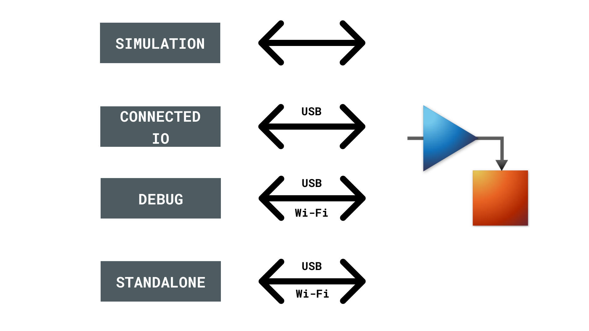

## LED on the Arduino Nano 33 IoT
The LED in the Arduino Nano 33 IoT is connected to Digital Pin 13. By pulling this pin HIGH, we can turn the LED on and by pulling it LOW we can turn the LED off.

***It is recommended that you go through the [MATLAB tutorial](/tutorials/nano-motor-carrier/nano-matlab-wifi-led) before attempting this tutorial.***

## Simulate an LED Turning on and Off

**1.** Open MATLAB. Under the **Home** ribbon, click on the **Simulink** button to open it.
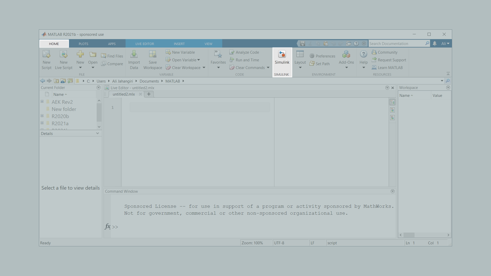

**2.** You will be greeted with the **Simulink Start Page**. Under **Simulink**, click on **Blank Model** to open up a new canvas.

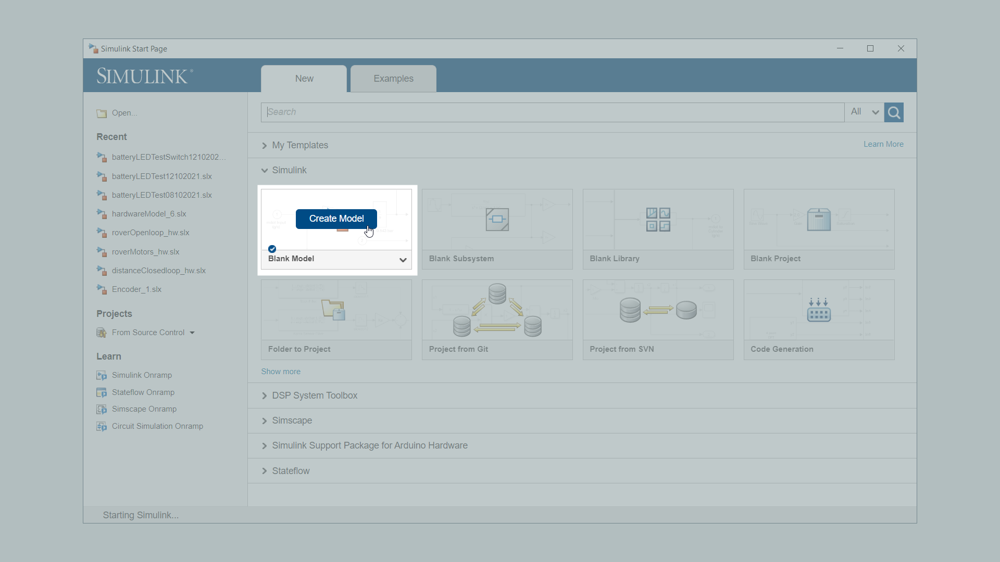

**3.** A new window will pop up. In this Simulink window we will create the model, configure the simulation as well as upload to the Arduino board.

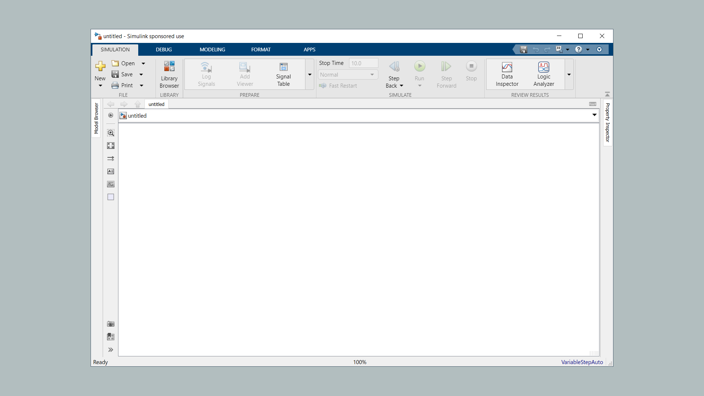

**4.** We can add blocks to do stuff, by selecting **Library Browser** from the **Simulation** ribbon. Under the **Simulink Support Package for Arduino Hardware** click on **Common** and add a **Digital Output** block. We will use this to control the LED on Pin 13.

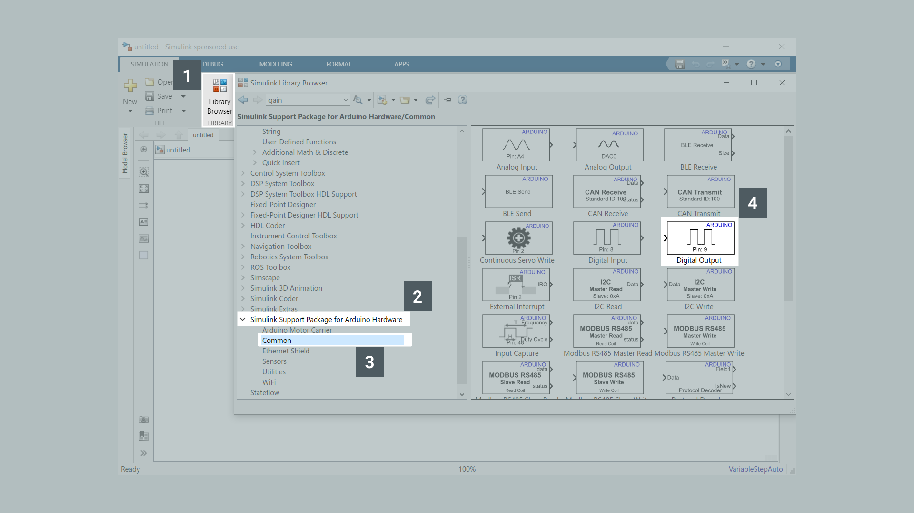

***The easiest way to add a block to your canvas is to drag and drop it.***

**5.** Go back to the **Simulink Library Browser** and under **Simulink** click on **Sources**. A list of different components that can act as sources, appear. Add the **Pulse Generator** block to you model. This block will help us generate the signal to turn the LED on and off.

**6.** We will need one more component from the **Simulink Library Browser**. Under **Simulink** go to **Sinks**. Add the **Scope** block to your model. This will help us visualize the waveform generated.

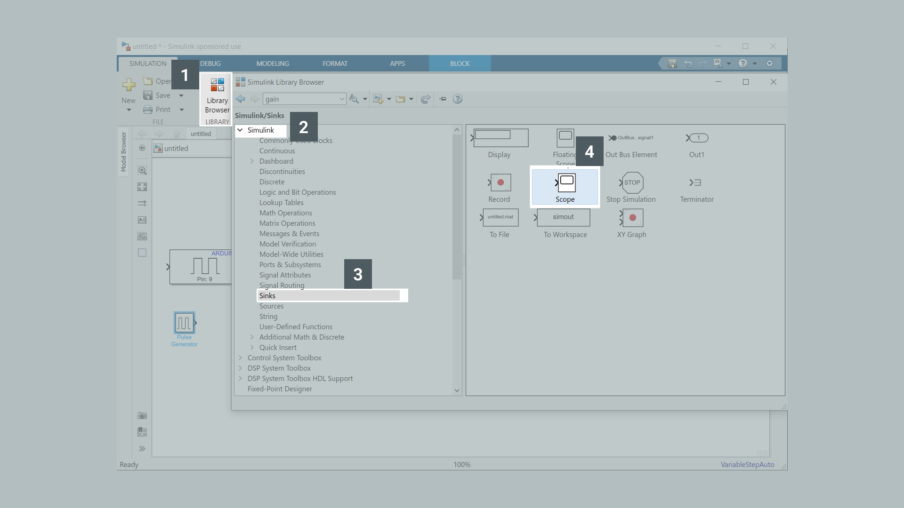

**7.** We will now connect the blocks together. Click on the arrow to the right of the **Pulse Generator** block and drag it to the arrow on the left of the **Digital Input** block. 

***You can click and drag any of the blocks to move them around on the canvas. You can also use the scroll wheel to zoom in and out. In order to fit all of the blocks onto the display, hit <kbd>Space</kbd>.***

**8.** We can see the transmitted signal by listening in with the **Scope** block. To do so, click on the arrow to the left of the **Scope** block and drag onto the link you previously created.

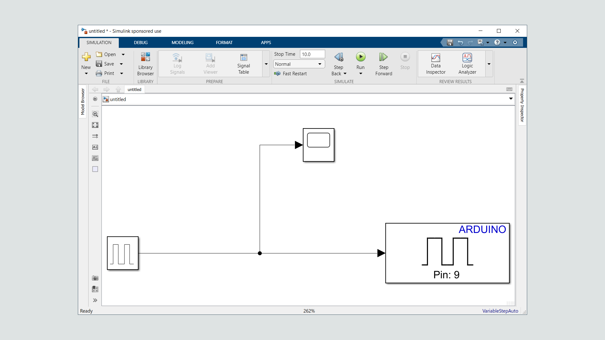

**9.** The blocks are now connected! However, before we continue we need to configure the **Pulse Generator** and **Digital Output** blocks. Let us start with the **Digital Output** block. You can see that by default the Pin is 9. However, [as you know](#led-on-the-arduino-nano-33-iot) the LED is connected to Pin 13 on the Nano 33 IoT. Double click on this block to open up the properties and change **Pin number** to 13.

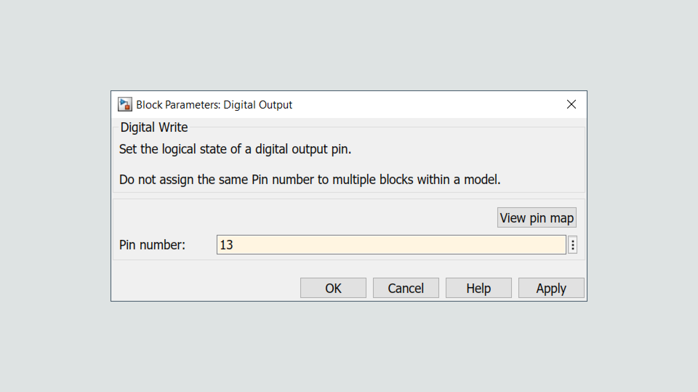

***You can see a list of possible **Pin number** values by clicking on **View pin map**.***

**10.** Now let us configure the **Pulse Generator** block. Double click on the **Pulse Generator** block to open up its **Block Parameters**. First, we will configure the **Pulse type** to be **Sample based**, since we are going to have a fixed time step. Set the **Sample Time** to be 0.2. This means that our model will operate in increments of one fifth of a second. An **Amplitude** of 1 is equivalent to a HIGH digital value for our model. Since we will define each **Period** to have 10 samples, then considering the **Sample Time** of 0.2 seconds, the duration of each period will be 2 seconds. The **Pulse Width** is defined as 5 samples. This will generate a periodic waveform, that turns on and off every one second.

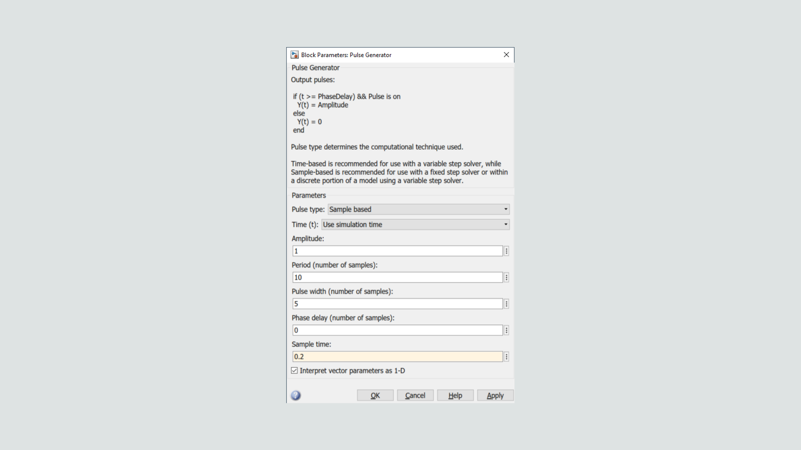

**11.** We can now run a simulation. In the **Simulation** ribbon set the **Stop Time** to 10 seconds then click on **Run**. After a few seconds the simulation should be complete.

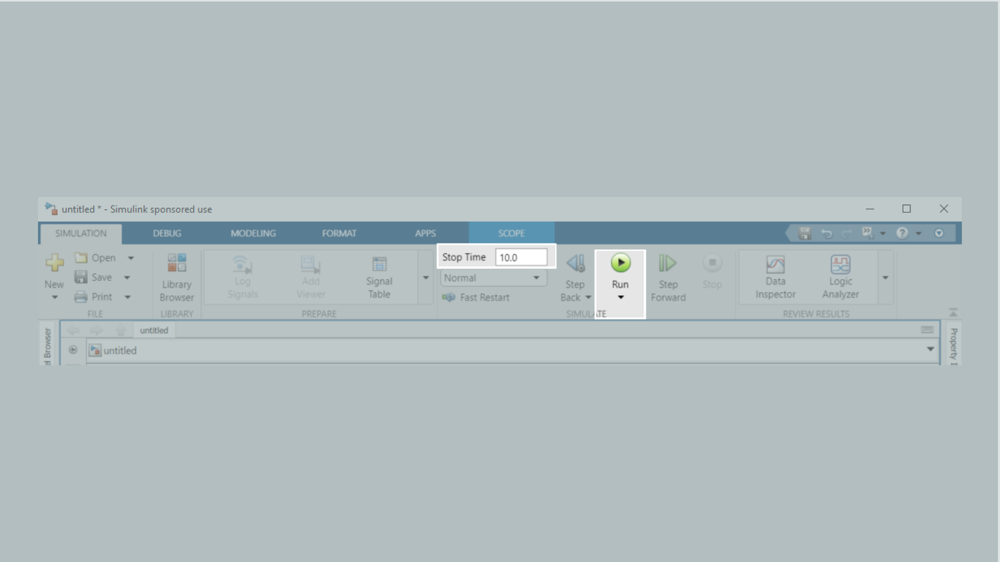

**12.** Double click on the **Scope** block. You should see a square wave with an amplitude of 1, a duty cycle of 50% and a period of 2.

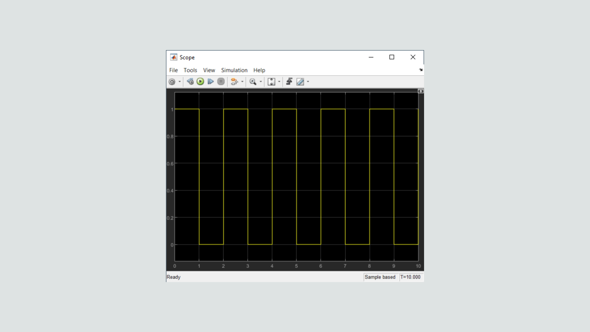

***If your waveform is different or isn't shown, check the connection between the Scope and the Pulse Generator blocks. Make sure you have configured the Pulse Generator as we have done here.***

**13.** Simulink also has the option to use **Dashboard** blocks to visualize the state of the LED. You can find these blocks in  the **Library Browser**, under **Simulink->Dashboard**. For the purposes of this tutorial, click and drag the **Lamp** block to the canvas.

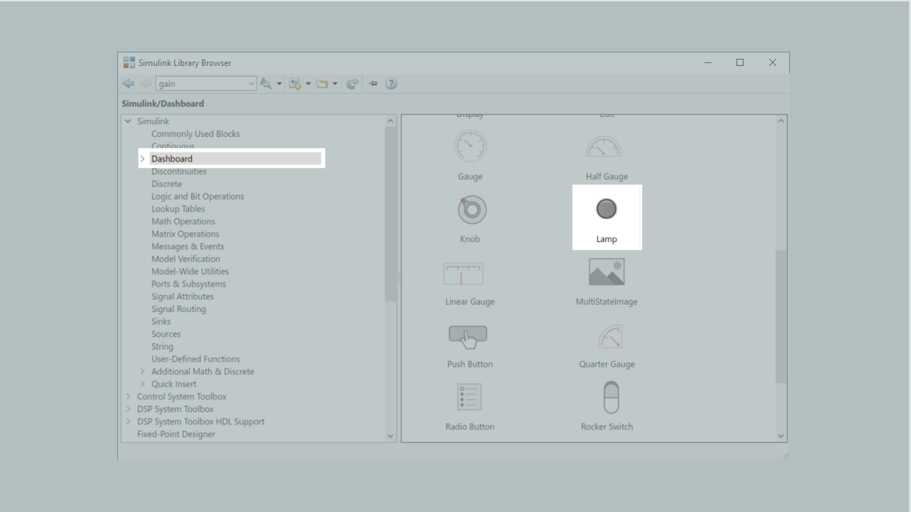

**14.** **Dashboard** blocks do not need to be connected via a signal link. Instead click on the 🔗 icon that appears when you hover over the **Lamp** block to open up **Block Parameters** window. Alternatively you can double click on the **Lamp** block, then click on the signal between the **Pulse Generator** and **Digital Input** blocks.

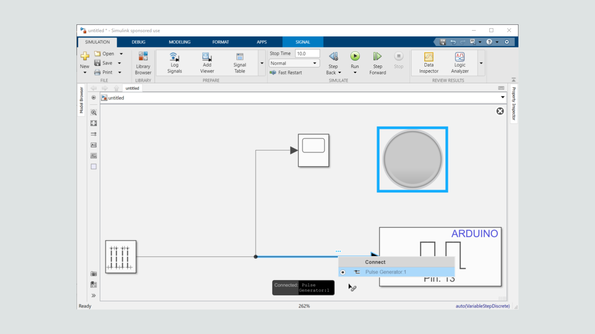

**15.** Try running the simulation again. You will notice that the **Lamp** block turns on and off very quickly. By default, the simulation runs as fast as your hardware will allow for. In order to enable a real-time simulation, click on the arrow underneath the Run button and then click on **Simulation Pacing**. In the window that opens up, enable the **Enable pacing to slow down simulation** checkbox. 

**16.** Now click on **Run**. You will notice that a gauge has appeared next to the green play button, signalling that the **Simulation Pacing** has been enabled. The **Lamp** block will turn on and off every 1 second.

## Control Nano 33 IoT LED From Within Simulink

**1.** We will now configure Simulink to access the hardware IO directly. This will allow you to directly control the LED on the Nano 33 IoT, from the model running in your computer.

**2.** Under the **Modeling** ribbon, click on the **Model Settings** button. This window gives us many options for configuring how the model itself is run including the solver configuration, default data types, diagnostic warnings/errors and the hardware implementation. For the purposes of this tutorial, we will change the hardware implementation to reflect our setup.

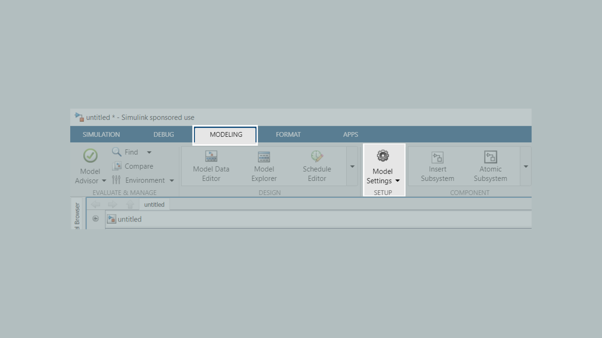

***You can also press <kbd>Ctrl</kbd> + <kbd>E</kbd> to bring up the Model Settings window.***

**3.** In the window that appears, under the **Hardware board** dropdown list select **Arduino Nano 33 IoT**. You will notice that the **Device vendor** and **Device type** items change to **ARM Compatible** and **ARM Cortex** respectively that reflects the microcontroller architecture of the Nano 33 IoT.

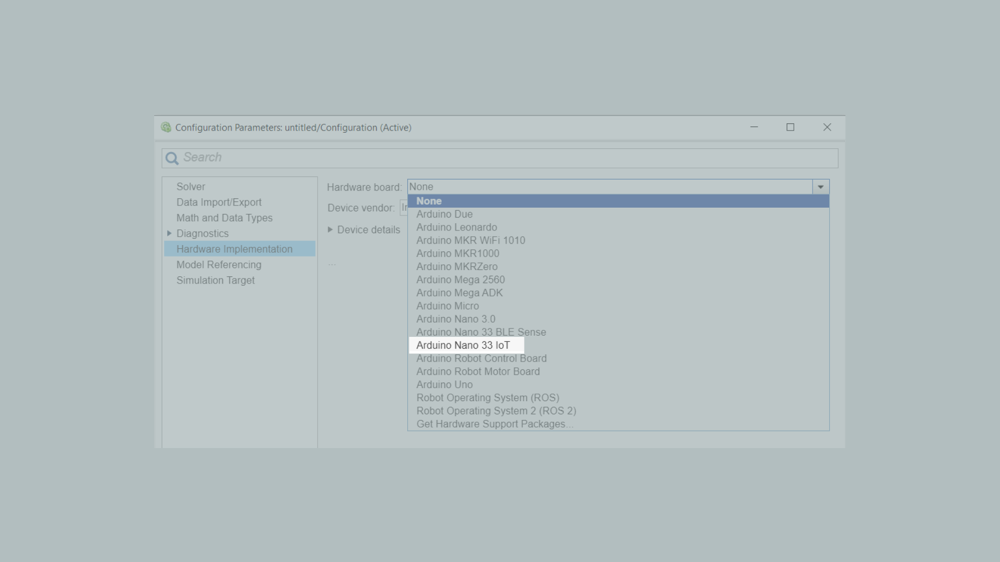

**4.** A new **Hardware** ribbon will appear. If configured correctly, under this ribbon, you will see **Arduino Nano 33 IoT** as the **Hardware Board**. In the **Mode** section, click on the downward facing arrow and select **Connected IO**. 

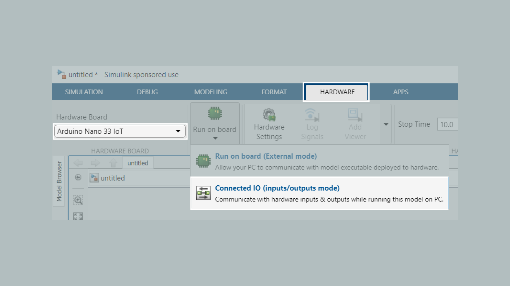

**5.** Make sure the **Stop Time** is set to 10, then click on **Run with IO**.

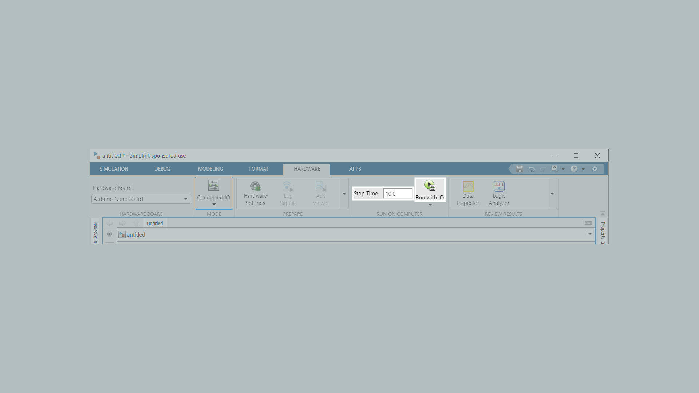

**6.** You should notice that the **Lamp** block on the LED of the Nano 33 IoT, both turn on 5 times in near unison with each other. Remember that in the **Connected IO** mode, Simulink is directly controlling Pin 13 on the Nano 33 IoT, and the board cannot operate in a standalone fashion. In the case that we want the program to operate in a standalone fashion, we need to deploy the model to the Nano 33 IoT by converting the model to microcontroller code and uploading it.

<!--- 
Add a gif/video.
-->

***Try disconnecting the USB cable. You will see that the LED does not blink anymore.***

## Deploy to Nano 33 IoT for Standalone Operation

**1.** With the help of Simulink, we will enable standalone operation. In the **Hardware** ribbon, click on the downward arrow in the **MODE** section (from the previous section, it should be displaying **Connected IO**). Then choose **Run on board (External Mode)**.

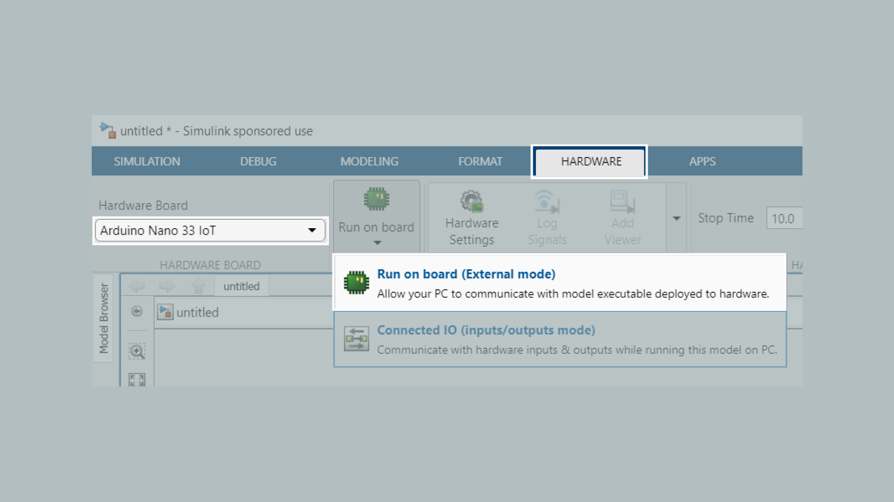

**2.** You will notice that the icons on the ribbon have changed slightly. To the far right, select **Build, Deploy & Start**.

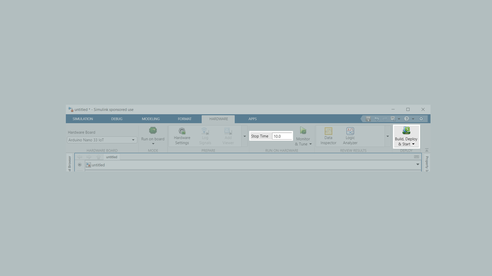

***On R2021b and newer revisions of MATLAB, the default Simulink interface is over XCP. Compared to legacy serial, XCP provides higher stability. You can manually enabled this in older versions, or update to the latest version.***

**3.** The Simulink model will be converted into microcontroller code, with the help of a MathWorks and Arduino libraries. This will take a few minutes, depending on the speed of your computer to complete.

**4.** The LED on you Nano 33 IoT will constantly blink. However, the **Lamp** block in your computer screen will not flash any more. 

<!--- 
Add a gif/video showing the Simulink model and the Nano Motor Carrier.
-->

***Try disconnecting the USB cable. Does the LED continue to blink?***

## Deploy to the Nano 33 IoT with Debug Capabilities

**1.** Now we are going to see how to compile code for the Nano 33 IoT, but keep the connection established to enable real-time debugging. This is very useful when adjusting control parameters such as the Proportional, integral and derivative gain used in PID (Proportional Integral Derivative) control. For now, we will see how to observe the battery levels of the Nano Motor Carrier.

**2.** From the **Simulation** ribbon, open up the **Library Browser**. Scroll down to **Simulink Support Package for Arduino Hardware** and in the **Arduino Motor Carrier** subcategory add the **Battery Read** block to your model.

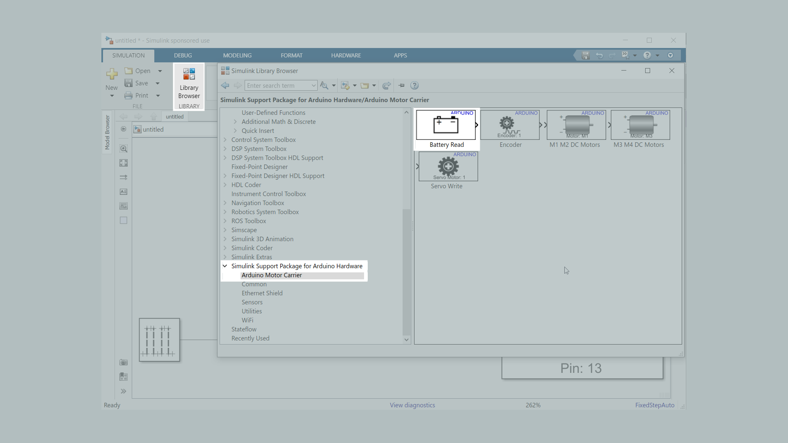

**3.** The **Battery Read** block gives the voltage as an integer between 0 to 4095. To convert this raw value into voltage, we will need to multiple it by 12/4095. To do so we can get the help of a **Gain** block. Go up to the **Simulink** section and under **Commonly Used Blocks** add the **Gain** block to your model.

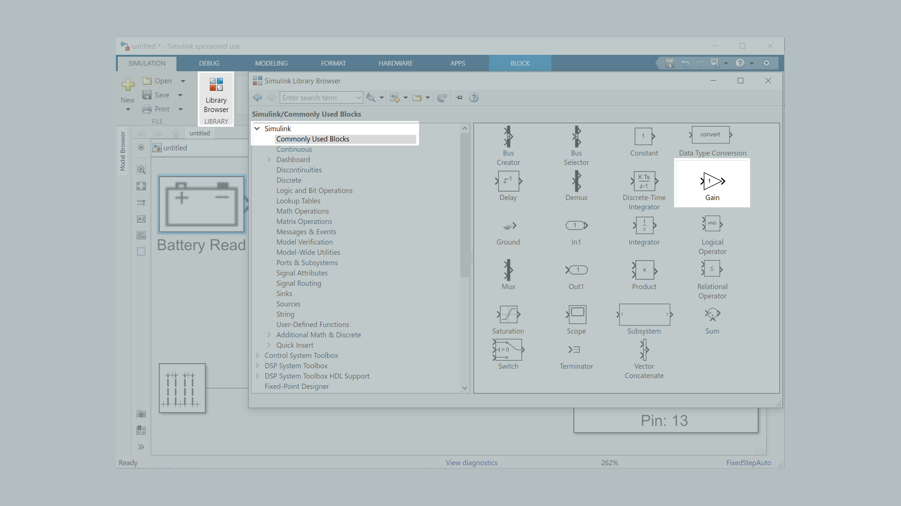

***The **Battery Read** block provides a 12-bit value that is obtained from the ADC on the Nano Motor Carrier. The maximum value (4095) represents a voltage of 12V. The **Gain** block is used to convert the ADC value to a human-readable voltage.***

**4.** Now we need a way to display this value. In the **Simulink** category, under the **Sinks** subsection, find and add the **Display** block; this will allow us to see the values.

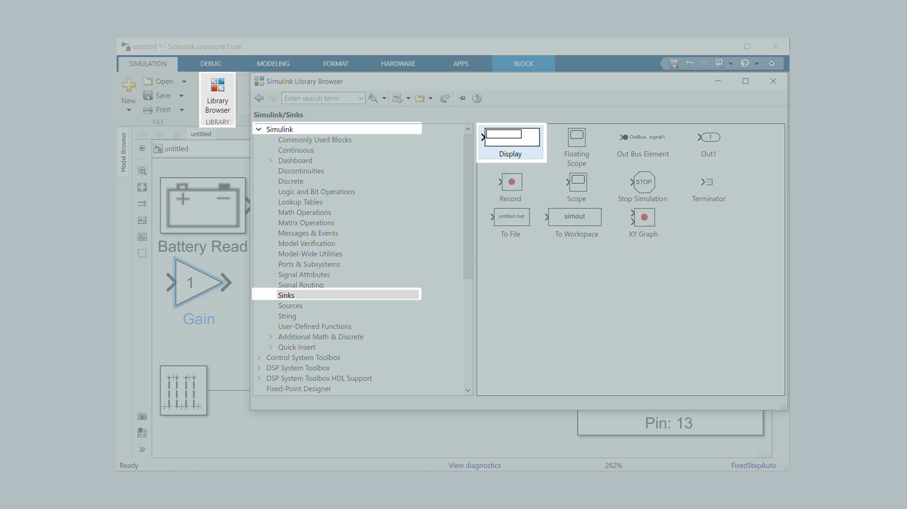

**5.** We will now create a path from the **Battery Read** to the **Gain Block** and then the **Display Block**.

***To create a signal link, click and drag from an outgoing arrow to the incoming arrow on the destination block.***

**6.**  In order to configure the gain block, double click and enter 1/236 as the **Gain**. In the **Signal Attributes** tab, change the **Output data type** to `double` then click on **OK**.

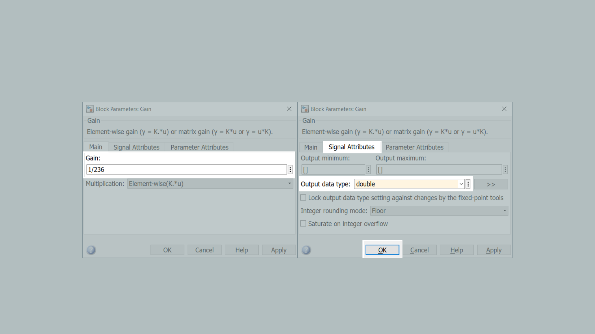

**7.** Go to the **Hardware** ribbon. Make sure that the **Mode** is set to **Run on board** and that the **Stop Time** is set to 10. Click on **Monitor and Tune**. You should see the value on the **Display** block correspond to the voltage of the battery.

<!--- 
Add a gif/video.
-->

## Using Wi-Fi

**1.** Open up the **Hardware Settings** from the **Hardware Ribbon**. In the **Hardware Implementation** tab, under the **Target hardware resources** click on **External mode** then choose `XCP on WiFi` as the **Communication interface**.

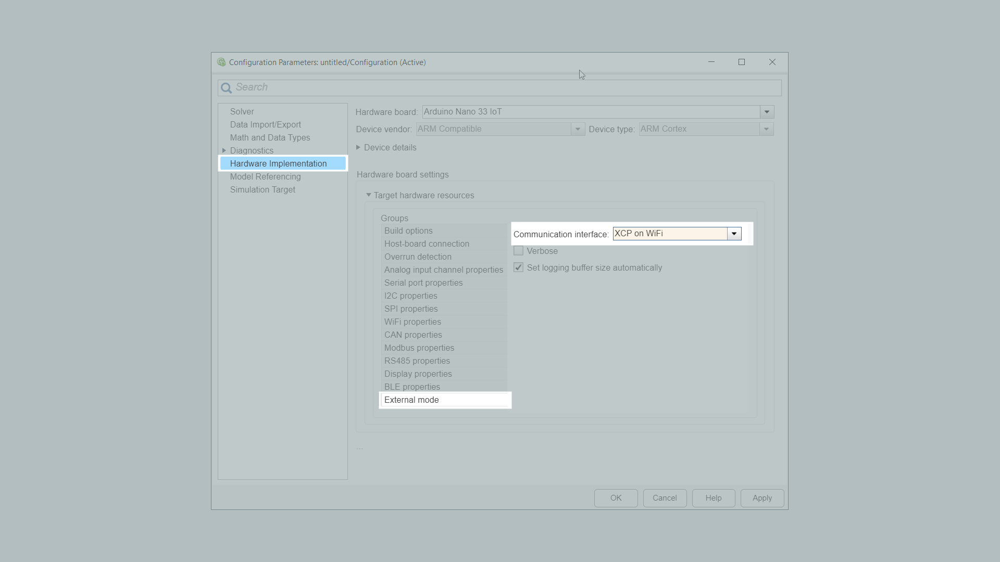

***For the purposes of this tutorial, we will leave the `Use static IP address and disable DHCP` box unchecked. This means that a dynamic IP address will be allocated to the Nano 33 IoT.***

**2.** We now need to configure the wireless settings. Click on **Wi-Fi properties** and enter the **Service set identifier (SSID)** or name of your wireless network. Select the appropriate encryption (`None`, `WEP` or `WPA`) and enter your password.

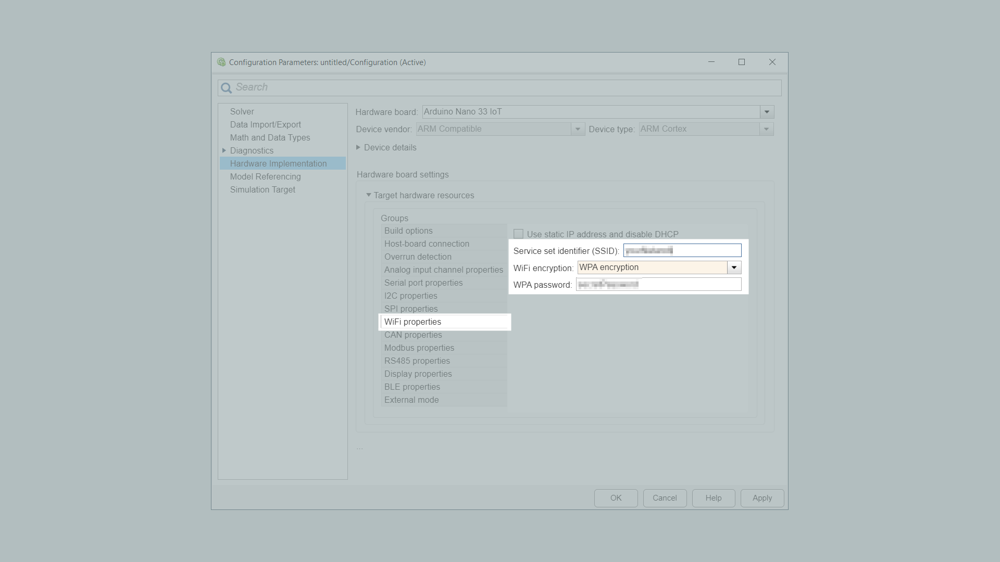

***Some school and corporate networks may require login credentials which is not supported at the moment. In this case, contact your network administrator. Alternatively, you can use a wireless hotspot on your phone.***

**3.** Let us try and add a switch so that we can control the LED wirelessly via Simulink. From the **Simulink Library Browser**, under **Simulink->Signal Routing->Sources** add the **Manual Switch** to the model. Also add the **Constant** block from the **Sources** group.

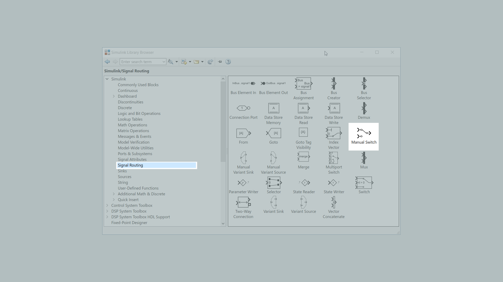

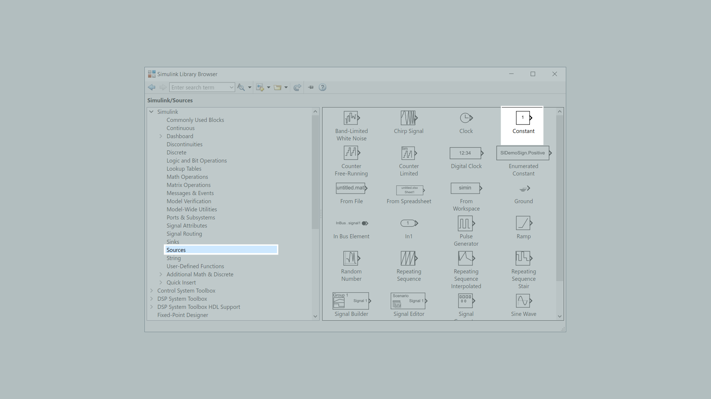

**4.** Add the **Manual Switch** block to the model as seen in the image below, between the **Pulse Generator** and **Digital Output** block. One signal will go from the **Constant** block that we added, and the other from the **Pulse Generator** block we had before as input to the **Manual Switch** block. Make sure that the **Lamp** block is connected to the signal after the **Manual Switch**.

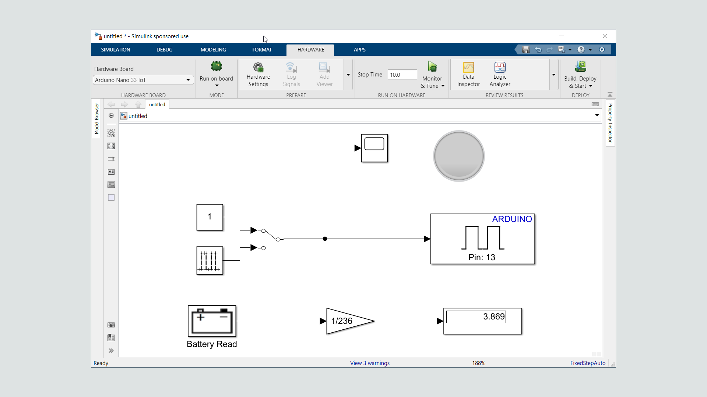

**5.** Double click on the **Constant** block and change the **Constant value** to `0`. This will mean that when we the hit the **Manual switch** to the **Constant** block, the LED will turn off. 

**6.** Click OK and then click on **Monitor & Tune**. Simulink will now compile the model and upload it to the board.

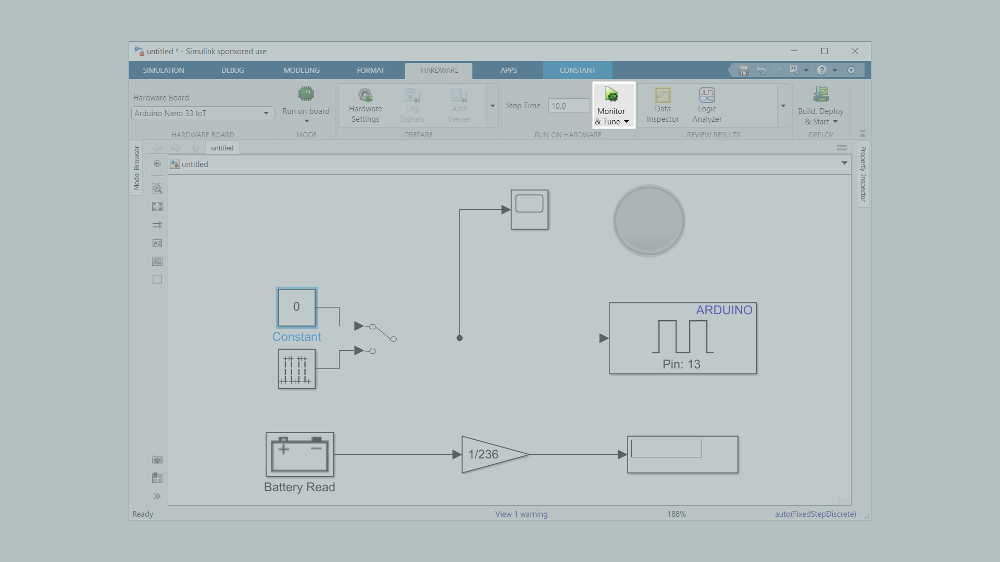

**7.** Once uploaded and the Wi-Fi connection is established you will see **Running the model on Arduino Nano 33 IoT...**. After this step is complete, you can disconnect the USB cable. You should see that the battery voltage is still displayed in real time.

**8.** Double click on the **Manual switch** block. You will see the state of the LED change from blinking to off.

<!--- 
Add a gif/video.
-->

## Conclusion

Now that you have gone through this tutorial, you now know how to use Simulink to control the Nano Motor Carrier with the help of the Nano 33 IoT. You learnt how to create a model, by connecting together **Blocks** and to then simulate it in your computer. Using **Connected IO** you can control your Arduino board connected by a USB cable. Through external mode, you can run deploy the model to your board to run independently (**Build, Start and Deploy**) or keep the connection established with your computer (**Monitor & Tune**). In addition to USB, you can also control the Arduino Nano Motor Carrier over Wi-Fi thanks to the wireless capabilities of the Nano 33 IoT. 

Simulink together with the Arduino platform opens up possibilities for rapid testing of concepts and ideas both in software as well as in hardware. The different operations modes allow you to choose the most suitable approach to your problem. 

## Troubleshooting
- Make sure to not use blocks in a multirate configuration. 
- Connected IO mode has limited compatibility with the Arduino Simulink blocks. Try using External Mode for improved simulation capabilities.
- Wi-Fi mode only works for External Mode (either **Monitor & Tune** or **Build, Start and Deploy**).
- Ensure that `XCP on Serial` or `XCP on Wi-Fi` is selected as the Communication Interface. Compared to legacy Serial, XCP provides additional functionality and stability.
- Make sure that the USB Cable is connected. For the Wi-Fi approach demonstrated in this tutorial, we will need to have the USB connected when the code is being uploaded. 

## Further Ideas
-  Try changing the **Pulse Generator** duty cycle and frequency.
-  In the **Connected IO** or **Monitor & Tune** configuration, try using a **Slider** dashboard element block to change the `Pulse Generator:PulseWidth` parameter during operation. See the [MathWorks documentation](https://www.mathworks.com/help/simulink/slref/slider.html) for more information about this Simulink block.
-  In addition to including all the software and hardware components needed to complete this tutorial, the [Arduino Engineering Kit Rev 2](https://store.arduino.cc/products/arduino-engineering-kit-rev2) includes a specially curated experience to learn about the Simulink-Arduino interface, through three exciting projects in a hands-on manner.
-  Read up more about [Connected I/O and its use with Arduino blocks](https://se.mathworks.com/help/supportpkg/arduino/ug/connected-io.html) or watch this [webinar](https://se.mathworks.com/support/search.html/videos/simulink-io-on-arduino-1546864538301.html) provided by MathWorks.
