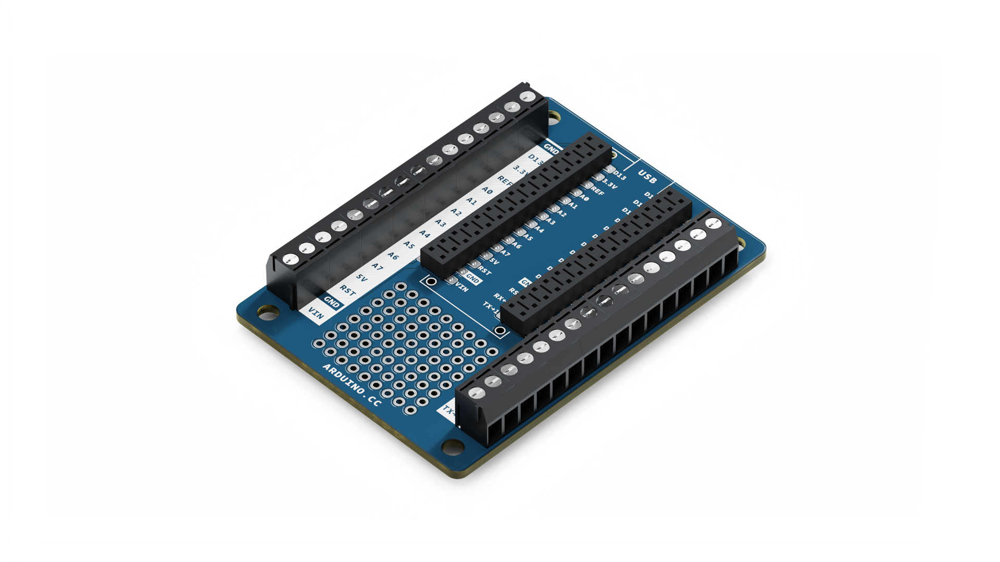
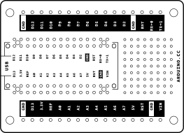
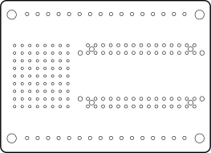
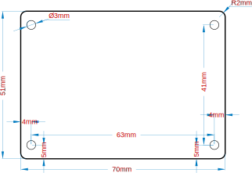

# Description
Arduino® Nano Screw Terminal Adapter is a quick, secure and solderless solution for your next Nano project. Easily connect external connections to the screw terminals and use the onboard prototyping area to evaluate ideas and solutions. Easily switch between the various Nano family boards without soldering, while leaving the rest of your project intact.

# Target areas:
Maker, Nano projects, Prototyping,

# Features
- **Screw connectors** 
    - 30 screw connectors exposing all I/O pins from your Nano board
    - 2 screw connectors providing additional ground connections
    - Silk is labelled for quick and easy reference
- **Through hole**
    - 9x8 through hole prototyping area
- **Nano socket** 
    - Low profile connector for high mechanical stability
    - All pins are accessible via standard breadboard holes
- **Mounting Holes**
    - 4x 3.2mm ⌀ holes
    - Easy integration into your own projects

# CONTENTS
## The Adapter
As it turned out that Arduino users have a need of a quick and easy way to securely build projects as well as adding small circuits for extra control, the Nano Screw Terminal Adapter was developed to assist in building such robust projects, without the need of soldering.

### Compatible boards ###
| Product name                                        | SKU               | Min voltage | Max voltage | 
| --------------------------------------------------- | ----------------- | ----------- | ----------- |
| Arduino® Nano 33 IoT                                | ABX00027/ABX00032 | 5 V         | 18 V      |
| Arduino® Nano 33 BLE Sense                          | ABX00031/ABX00035 | 5 V         | 18 V      |
| Arduino® Nano 33 BLE                                | ABX00030/ABX00028 | 5 V         | 18 V      |
| Arduino® Nano Every                                 | ABX00033/ABX00028 | 5 V         | 18 V      |
| Arduino® Nano RP2040 connect                        | ABX00052/ABX00053 | 5 V         | 18 V      |
| Arduino® Nano Every                                 | ABX00033/ABX00028 | 7 V         | 18 V      |
| Arduino® Nano                                       | A000005           | 7 V         | 12 V      |
**Note!** Please turn to each board's datasheet for further information about power and their capacity. 

### Application Examples
**Motor Driver Design:** Evaluate motor drivers and other smaller circuits on the prototyping area

**External debugging:** All the standard Nano pins are accessible via both breadboard compatible pin headers as well as the screw terminals. This allows for direct probing of signals via a multimeter or oscilloscope while the device is under operation. 

**Rapid solution development:** Quickly connect to external circuitry with pin headers or screw terminals to evaluate new ideas quickly. Rapidly prototype circuits and evaluate various Nano boards to choose the best option for your application. 

## Functional Overview
### Board Topology 
#### Top

| **Ref.** | **Description**                 | **Ref.** | **Description**                  |
| -------- | ------------------------------- | -------- | -------------------------------- |
| J17      | HLE-115-02-F-DV-Footprint-2     | J19      | HLE-115-02-F-DV-Footprint-2      |
| J18      | CONNECTOR MORS.CS16v            | J20      | CONNECTOR MORS.CS 16v            |

#### Bottom

### Headers
The board exposes two 15 pin connectors which can either be assembled with pin headers or soldered through castellated vias. 

***Connector J17***

| **Pin**  | **Function** | **Type**     | **Description**                                              |
| ---- | ------------ | ------------ | ------------------------------------------------------------ |
| 1    | D13/SCK      | Digital            | GPIO                                                            |
| 2    | +3V3         | Power Out    |                                                              |
| 3    | AREF         | Analog       | Analog Reference; can be used as GPIO                        |
| 4    | A0/DAC0      | Analog       | ADC in/DAC out; can be used as GPIO                          |
| 5    | A1           | Analog       | ADC in; can be used as GPIO                                  |
| 6    | A2           | Analog       | ADC in; can be used as GPIO                                  |
| 7    | A3           | Analog       | ADC in; can be used as GPIO                                  |
| 8    | A4/SDA       | Analog       | ADC in; I2C SDA; Can be used as GPIO **(1)**                 |
| 9    | A5/SCL       | Analog       | ADC in; I2C SCL; Can be used as GPIO **(1)**                 |
| 10   | A6           | Analog       | ADC in; can be used as GPIO                                  |
| 11   | A7           | Analog       | ADC in; can be used as GPIO                                  |
| 12   | VUSB         | Power In/Out | Normally NC; can be connected to VUSB pin of the USB connector by shorting a jumper |
| 13   | RST          | Digital In   | Active low reset input (duplicate of pin 18)                 |
| 14   | GND          | Power        | Power Ground                                                 |
| 15   | VIN          | Power In     | Vin Power input                                              |
| 16   | TX           | Digital      | USART TX; can be used as GPIO                                |
| 17   | RX           | Digital      | USART RX; can be used as GPIO                                |
| 18   | RST          | Digital      | Active low reset input (duplicate of pin 13)                 |
| 19   | GND          | Power        | Power Ground                                                 |
| 20   | D2           | Digital      | GPIO                                                         |
| 21   | D3           | Digital      | GPIO                                                         |
| 22   | D4           | Digital      | GPIO                                                         |
| 23   | D5           | Digital      | GPIO                                                         |
| 24   | D6           | Digital      | GPIO                                                         |
| 25   | D7           | Digital      | GPIO                                                         |
| 26   | D8           | Digital      | GPIO                                                         |
| 27   | D9           | Digital      | GPIO                                                         |
| 28   | D10          | Digital      | GPIO                                                         |
| 29   | D11/MOSI     | Digital      | SPI MOSI; can be used as GPIO                                |
| 30   | D12/MISO     | Digital      | SPI MISO; can be used as GPIO                                |

## Mechanical Information
### Board Outline and Mounting Holes

## Certifications
### Declaration of Conformity CE DoC (EU)
We declare under our sole responsibility that the products above are in conformity with the essential requirements of the following EU Directives and therefore qualify for free movement within markets comprising the European Union (EU) and European Economic Area (EEA). 

### Declaration of Conformity to EU RoHS & REACH 211 01/19/2021
Arduino boards are in compliance with RoHS 2 Directive 2011/65/EU of the European Parliament and RoHS 3 Directive 2015/863/EU of the Council of 4 June 2015 on the restriction of the use of certain hazardous substances in electrical and electronic equipment. 

| Substance                              | **Maximum limit (ppm)** |
| -------------------------------------- | ----------------------- |
| Lead (Pb)                              | 1000                    |
| Cadmium (Cd)                           | 100                     |
| Mercury (Hg)                           | 1000                    |
| Hexavalent Chromium (Cr6+)             | 1000                    |
| Poly Brominated Biphenyls (PBB)        | 1000                    |
| Poly Brominated Diphenyl ethers (PBDE) | 1000                    |
| Bis(2-Ethylhexyl} phthalate (DEHP)     | 1000                    |
| Benzyl butyl phthalate (BBP)           | 1000                    |
| Dibutyl phthalate (DBP)                | 1000                    |
| Diisobutyl phthalate (DIBP)            | 1000                    |

Exemptions : No exemptions are claimed. 

Arduino Boards are fully compliant with the related requirements of European Union Regulation (EC) 1907 /2006 concerning the Registration, Evaluation, Authorization and Restriction of Chemicals (REACH). We declare none of the SVHCs (https://echa.europa.eu/web/guest/candidate-list-table), the Candidate List of Substances of Very High Concern for authorization currently released by ECHA, is present in all products (and also package) in quantities totaling in a concentration equal or above 0.1%. To the best of our knowledge, we also declare that our products do not contain any of the substances listed on the "Authorization List" (Annex XIV of the REACH regulations) and Substances of Very High Concern (SVHC) in any significant amounts as specified by the Annex XVII of Candidate list published by ECHA (European Chemical Agency) 1907 /2006/EC.

### Conflict Minerals Declaration 
As a global supplier of electronic and electrical components, Arduino is aware of our obligations with regards to laws and regulations regarding Conflict Minerals, specifically the Dodd-Frank Wall Street Reform and Consumer Protection Act, Section 1502. Arduino does not directly source or process conflict minerals such as Tin, Tantalum, Tungsten, or Gold. Conflict minerals are contained in our products in the form of solder, or as a component in metal alloys. As part of our reasonable due diligence Arduino has contacted component suppliers within our supply chain to verify their continued compliance with the regulations. Based on the information received thus far we declare that our products contain Conflict Minerals sourced from conflict-free areas. 

## FCC Caution
Any Changes or modifications not expressly approved by the party responsible for compliance could void the user’s authority to operate the equipment.

This device complies with part 15 of the FCC Rules. Operation is subject to the following two conditions: 

(1) This device may not cause harmful interference

 (2) this device must accept any interference received, including interference that may cause undesired operation.

**FCC RF Radiation Exposure Statement:**

1. This Transmitter must not be co-located or operating in conjunction with any other antenna or transmitter.

2. This equipment complies with RF radiation exposure limits set forth for an uncontrolled environment.

3. This equipment should be installed and operated with minimum distance 20cm between the radiator & your body.

English: 
User manuals for license-exempt radio apparatus shall contain the following or equivalent notice in a conspicuous location in the user manual or alternatively on the device or both. This device complies with Industry Canada license-exempt RSS standard(s). Operation is subject to the following two conditions:

(1) this device may not cause interference

 (2) this device must accept any interference, including interference that may cause undesired operation of the device.

French: 
Le présent appareil est conforme aux CNR d’Industrie Canada applicables aux appareils radio exempts de licence. L’exploitation est autorisée aux deux conditions suivantes :

(1) l’ appareil nedoit pas produire de brouillage

(2) l’utilisateur de l’appareil doit accepter tout brouillage radioélectrique subi, même si le brouillage est susceptible d’en compromettre le fonctionnement.

**IC SAR Warning:**

English 
This equipment should be installed and operated with minimum distance 20 cm between the radiator and your body.  

French: 
Lors de l’ installation et de l’ exploitation de ce dispositif, la distance entre le radiateur et le corps est d ’au moins 20 cm.

**Important:** The operating temperature of the EUT can’t exceed 85℃ and shouldn’t be lower than -40℃.

Hereby, Arduino S.r.l. declares that this product is in compliance with essential requirements and other relevant provisions of Directive 2014/53/EU. This product is allowed to be used in all EU member states. 

## Company Information
| Company name    | Arduino S.r.l                           |
| --------------- | --------------------------------------- |
| Company Address | Via Andrea Appiani 25 20900 MONZA Italy |

## Revision History
| Date       | **Revision** | **Changes**               |
| ---------- | ------------ | ------------------------- |
| 17/06/2022 | 1            | First release             |
