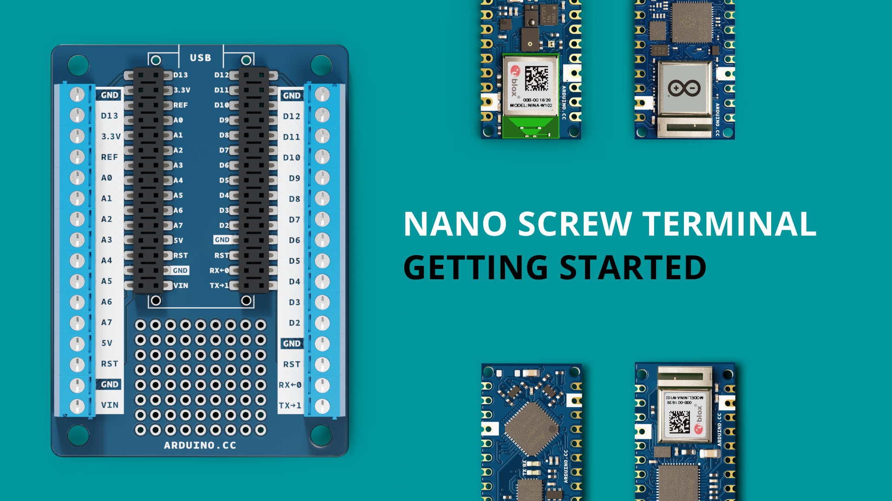
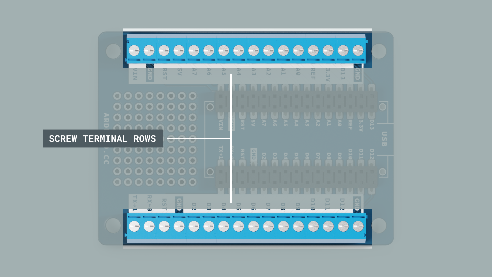
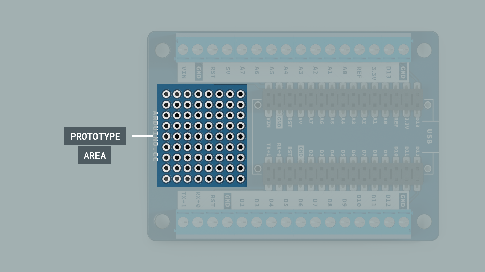
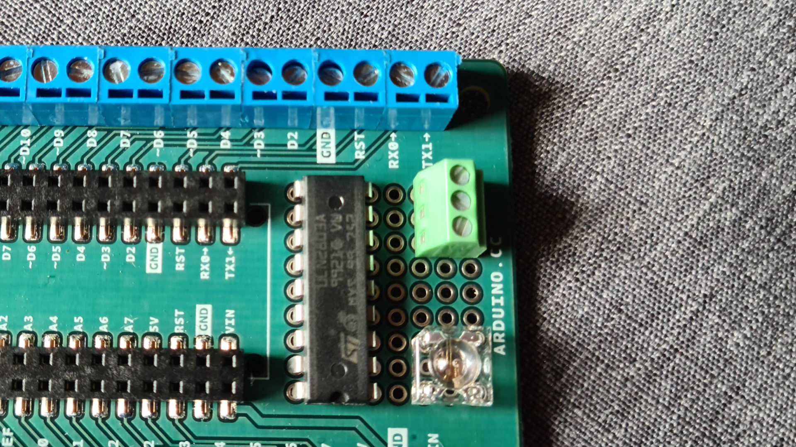
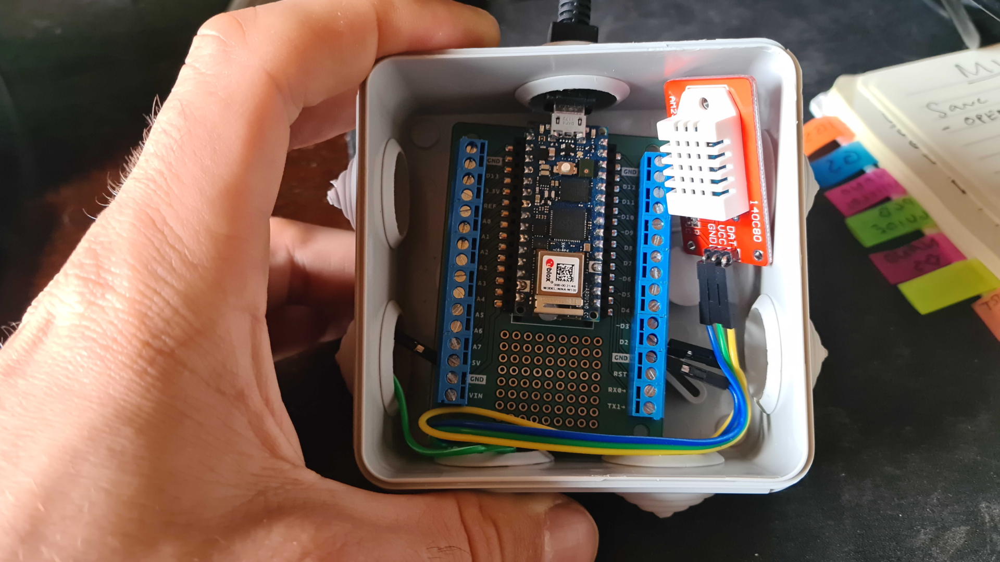

If you love the Nano form factor but are tired of spaghetti-monster looking breadboards: [Nano Screw Terminal Adapter](https://store.arduino.cc/nano-screw-terminal) is here to help. 

In this guide, we will have a look at how this adapter functions, some inspiration for use cases, and some important considerations to take into account while using this adapter.

## Hardware & Software Needed

- [Nano Screw Terminal Adapter](https://store.arduino.cc/nano-screw-terminal)

### Compatible Boards

The Nano Screw Terminal Adapter is compatible with the following boards:

- [Nano](https://store.arduino.cc/products/arduino-nano)
- [Nano Every](https://store.arduino.cc/nano-every)
- [Nano 33 IoT](https://store.arduino.cc/arduino-nano-33-iot)
- [Nano 33 BLE](https://store.arduino.cc/nano-33-ble)
- [Nano 33 BLE Sense](https://store.arduino.cc/nano-33-ble-sense)
- [Nano RP2040 Connect](https://store.arduino.cc/nano-rp2040-connect)
- [Nano R4](https://store.arduino.cc/products/nano-r4)

## Overview

The [Nano Screw Terminal Adapter](https://store.arduino.cc/nano-screw-terminal) serves a simple purpose: provide screw terminal connections with clear markings to your Nano board. This makes it easy to assemble robust circuits that can be used for finished projects. 

As a bonus, it also comes with a smaller prototyping area that you can solder components to (through hole). Perfect for adding a tiny display, LEDs or sensors.

### Screw Terminals

The two screw terminal blocks are mounted on each side of the adapter and provides easy connections that can be fastened with a simple flathead screwdriver.

There are also two extra GND connectors for your convenience.

### Prototyping Area

The prototyping area is **9x8**, with a pitch of **2.54 mm**. While not huge, it is perfect for mounting smaller circuits ICs, sensors or other components.

An example on how much you can fit on the area is:
- A ULN2803A motor driver for stepper/DC motors.
- A connector row.
- A square RGB LED.

## Considerations

As the pinout slightly differs from one Nano board to another, there are some important considerations to take into account. This sections lists out all considerations to take into account when using this product.

### RST Pin

The pin marked **"RST"** on the Nano Screw Terminal Adapter stands for **"reset"**. The function of this pin varies from board to board.

An example of this is the [Nano RP2040 Connect](https://store.arduino.cc/nano-rp2040-connect), where this pin is named **"REC"** as in **"recovery"**.

### PWM

There are no PWM markings (~) on the adapter. This is because the PWM supported pins varies from board to board. 

To know which pins are PWM, please refer to the pinout of your board (available in the [hardware documentation](/)), or the markings on your board.

## Use Cases

The Nano Screw Terminal Adapter can be used for any project that already involves an Arduino Nano board.

In particular, the adapter can be used when a project is done with the "breadboard prototyping phase", and need more reliable connections.

Seen in the image below is a DHT22 temperature/humidity sensor, connected to a [Nano RP2040 Connect](https://store.arduino.cc/nano-rp2040-connect) board, placed inside a water tight enclosure (for outdoor use).

## Conclusion

The Nano Screw Terminal Adapter is a great board that will help you create robust electronic circuits with your Nano boards.

In this guide, we have gone through some of the technical specifications, as well as highlighting some important considerations.