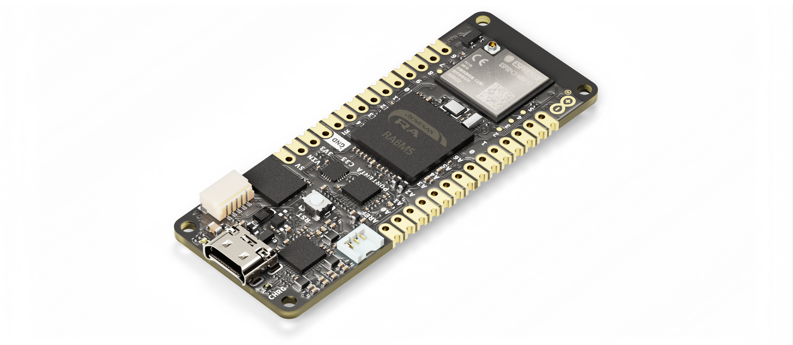

# Description 

The Portenta C33 is a powerful System-on-Module designed for low-cost Internet of Things (IoT) applications. Based on the R7FA6M5BH2CBG microcontroller from Renesas®, this board shares the same form factor as the Portenta H7 and it is backward compatible with it, making it fully compatible with all Portenta family shields and carriers through its high-density connectors. As a low-cost device, the Portenta C33 is an excellent choice for developers looking to create IoT devices and applications on a budget. Whether you're building a smart home device or a connected industrial sensor, the Portenta C33 provides the processing power and connectivity options you need to get the job done.

# Target Areas

IoT, building automation, smart cities, and agriculture

# CONTENTS
## Application Examples

Thanks to its dual-core processor, the Portenta C33 supports a wide array of applications. From industrial applications to rapid prototyping, IoT solutions, and building automation, among many others.

- **Industrial Automation:** The Portenta C33 can be implemented as a solution for different industrial applications:

    - **Industrial IoT gateway:** Connect your devices, machines and sensors to a Portenta C33 gateway. Collect operation data in real-time and display them on Arduino IoT Cloud dashboard, leveraging end-to-end secure data encryption.
    - **Machine monitoring to track OEE/OPE:** Track Overall Equipment efficiency (OEE) and Overall Process Effectiveness (OPE) with Portenta C33 as an IoT node. Collect data and get alerted on machine uptime and unplanned downtime to provide reactive maintenance and improve production rate.
    - **Inline Quality Assurance:** Leverage full compatibility between Portenta C33 and Nicla family to carry out quality control in your production lines. Collect Nicla smart sensing data with Portenta C33 to catch defects early and resolve them before they travel down the line.

- **Prototyping:** The Portenta C33 can assist Portenta and MKR developers with their IoT prototypes by integrating ready-to-use WiFi/BLE® connectivity and a wide variety of peripheral interfaces, including CAN, SAI, SPI, I2C. Moreover, Portenta C33 can be promptly programmed with high-level languages like MicroPython, allowing for rapid prototyping of IoT applications.
  
- **Building Automation:** The Portenta C33 can be used in multiple building automation applications:

    - **Energy Consumption Monitoring:** Collect and monitor consumption data from all services (e.g. Gas, Water, Electricity) in a single system. Display usage trends in Arduino IoT Cloud charts, providing an overall image for energy management optimization and cost reduction.
    - **Appliances Control System**:** Leverage high-performing Portenta C33 MCU to real-time control your appliances. Adjust HVAC heating or improve the efficiency of your ventilation system, control the motors of your curtains, and switch on/off lights. The onboard Wi-Fi connectivity easily allows Cloud integration, so that everything is under control even from remote.

## Board Overview 

The Portenta C33 is a powerful microcontroller board designed for low-cost IoT applications. Based on the high-performance R7FA6M5BH2CBG microcontroller from Renesas, it offers a range of key features and a low-power design that make it well-suited for a variety of applications.The board has been designed with the same form factor as the Portenta H7 and is backward compatible, making it fully compatible with all Portenta family shields and carriers through its MKR-styled and high-density connectors.

The main features of the Portenta C33 are the following:

- 200MHz, Arm Cortex-M33 core microcontroller with 2MB Flash memory and 256kB SRAM (R7FA6M5BH2CBG)
- External 16MB QSPI Flash memory (MX25L12833F)
- On-board 2.4GHz Wi-Fi (802.11 b/g/n) and Bluetooth® 5 module (ESP32­-C3-­MINI-­1U)
- Ethernet physical layer (PHY) transceiver (LAN8742AI)
- On-board ready-to-use IoT secure element (SE051)
- USB-C port for power and data (accessible also through the board's high-density connectors)
- Highly flexible power supply architecture designed specifically for low-power applications 
- Various options for easily powering the board: USB-C port, single-cell lithium-ion/lithium-polymer battery and external power supply connected through MKR-styled connectors
- Various analog peripherals, such as a 12-bit analog-to-digital converter (ADC) and a 12-bit digital-to-analog converter (DAC)
- Various digital peripherals, such as GPIO (x7), I2C (x1), UART (x4), SPI (x2), PWM (x10), CAN (x2), I2S (x1), SPDIF (x1), PDM(x1), and SAI (x1)
- JTAG/SWD debug port (accessible through the board's high-density connectors)
- Board dimensions: 66.04mm x 25.40mm
- Castellated pins allow the board to be positioned as a surface-mountable module

****

[comment]: <> (Force page break here) 

  
## Specifications

### Recommended Operating Conditions 

Table 1 provides a comprehensive guideline for the optimal use of the Portenta C33, outlining typical operating conditions and design limits. The operating conditions of the Portenta C33 are largely a function of the operating conditions specified by its components.

|         **Parameter**        |    **Symbol**   | **Min** | **Typ** | **Max** | **Unit** |
|:----------------------------:|:---------------:|:-------:|:-------:|:-------:|:--------:|
|   USB Supply Input Voltage   | VUSB |    -    |   5.0   |    -    |     V    |
| Battery Supply Input Voltage | VUSB |   -0.3  |   3.7   |   4.8   |     V    |
|     Supply Input Voltage     |  VIN |   4.1   |   5.0   |   6.0   |     V    |
|     Operating Temperature    |  TOP |   -40   |    -    |    85   |    °C    |

**<caption>Table 1: Recommended Operating Conditions</caption>**

### Current Consumption

The operating current of the Portenta C33 depends greatly on the application. Table 2 summarizes the board's power consumption in a defined application and conditions.

|       **Parameter**       |    **Symbol**   |                                **Condition**                                | **Typ** | **Unit** |
|:-------------------------:|:---------------:|:---------------------------------------------------------------------------:|:-------:|:--------:|
| Board Current Consumption | ITOT | VBAT=3.7V, USB cable disconnected, all peripherals in sleep mode |    -    |     -    |

**<caption>Table 2: Power Consumption in a Defined Application and Conditions</caption>**

*
**Note**: Current consumption measurements were taken under controlled laboratory conditions, with the Portenta C33 running a specific application and connected to a specific power source. Results may vary depending on the application and operating conditions.
*

[comment]: <> (Force page break here) 

## Hardware

The core of the Portenta C33 is the R7FA6M5BH2CBG microcontroller from Renesas. The board also contains several peripherals connected to its microcontroller. 

### Block Diagram

An overview of the Portenta C33 high-level architecture is illustrated in Figure 2.

****

### Power Supply 

The Portenta C33 can be powered through one of these interfaces:

- USB-C port
- Battery
- MKR pins

The figure below shows the power options available on the board and illustrates its power architecture. 

### Mechanical Specification

#### Board Pinout 
#### Board Connectors

### Board Accesories 

## Document Revision History

| Date       | **Revision** | **Changes**                        |
|------------|--------------|------------------------------------|
| 00/00/2023 | 1            | First release                      |

