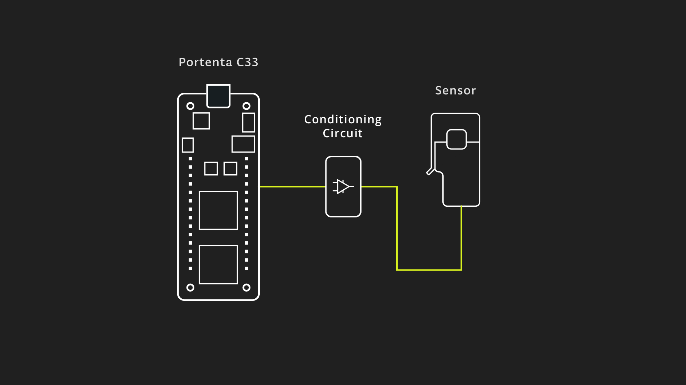
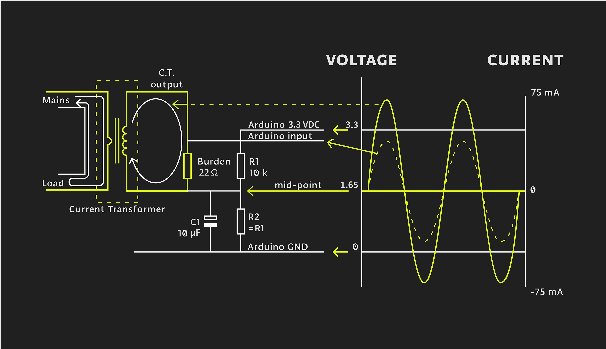
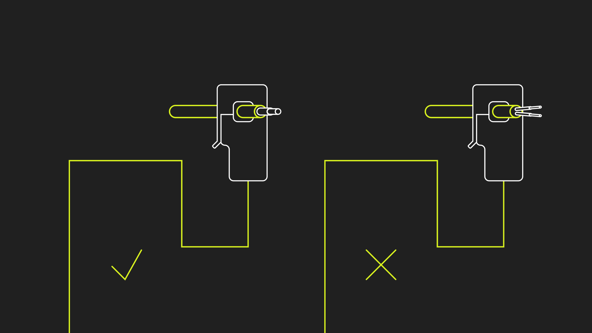

## Introduction

This application note explores the implementation of a simple yet useful energy meter using the Arduino® Portenta C33 and a non-invasive current transformer. The proposed energy meter enables real-time measurement and monitoring of electrical current consumption, providing valuable and useful insights into energy usage patterns to the user.

Non-invasive current transformers offer several advantages, including electrical safety, easy installation, and the ability to measure current in existing electrical circuits without interrupting the flow of current. These characteristics make them well-suited for applications such as energy metering, power monitoring, and load management.

The Portenta C33 features a powerful microcontroller and onboard wireless connectivity, making it an ideal choice for energy monitoring applications. The Portenta C33's onboard Wi-Fi® module enables seamless integration with wireless networks and facilitates communication with the [Arduino IoT Cloud platform](https://create.arduino.cc/iot/).



By combining the Portenta C33 and the SCT013-000 current transformer, you can quickly build an energy meter that can measure Root Means Square (RMS) current, power consumption, and communicates the data to the Arduino IoT Cloud platform for further analysis and visualization.

## Goals

The main goals of this application note are as follows:

- Develop a functional energy meter that can provide real-time insights into energy usage patterns, allowing users to track and analyze their energy consumption.
- Showcase the integration of the Portenta C33 board with a non-invasive current transformer to measure AC current.
- Calculate the RMS (Root Mean Square) value of a current waveform, providing an accurate representation of the actual current flowing through the circuit.
- Use the measured RMS current and a known AC voltage to calculate power consumption in Watts.
- Establish a connection between the Portenta C33 and the Arduino IoT Cloud to send the measured RMS current data for further analysis, visualization, and remote monitoring.

## Hardware and Software Requirements

### Hardware Requirements

- [Portenta C33](https://store.arduino.cc/products/portenta-c33) (x1)
- USB-C® cable (x1)
- Wi-Fi® W.FL antenna (x1)
- SCT013-000 current transformer (x1)
- [Conditioner circuit](#hardware-setup-overview) (x1)

### Software Requirements

- [Arduino IDE 1.8.10+](https://www.arduino.cc/en/software), [Arduino IDE 2.0+](https://www.arduino.cc/en/software), or [Arduino Web Editor](https://create.arduino.cc/editor)
- For the Wi-Fi® connectivity feature of Portenta C33, we will use [Arduino IoT Cloud](https://create.arduino.cc/iot/things). In case you do not have an account, create one for free [here](https://cloud.arduino.cc/).
- The [energy meter example sketch](assets/current_transformer.zip)

## Hardware Setup Overview

The electrical connections of the intended application design are shown in the diagram below:



The overview illustrates the connection from the sensor passing through a conditioner circuit and interfacing with the Portenta C33. 

**Take into account that only one AC wire must pass in between the current transformer**, as shown below:




## Measuring Current Using Non-Invasive Current Transformers
Non-invasive current transformers, such as the SCT013-000 current transformer used in this application note, provide a safe and convenient method for measuring electrical current, without the need for direct electrical connections. These transformers work on the principle of [electromagnetic induction](https://en.wikipedia.org/wiki/Electromagnetic_induction) and consist of a primary winding and a secondary winding.

As shown in the animation below, the primary winding typically consists of a single turn or a few turns of a conductor, while the secondary winding consists of a large number of turns wound around a magnetic core. When an alternating current flows through the primary winding, it induces a proportional current in the secondary winding. This induced current can be measured and used to determine the magnitude of the primary current.


As shown in the animation below, the primary winding is typically a single turn or a few turns of a conductor, while the secondary winding is a large number of turns wound around a magnetic core. When an alternating current flows through the primary winding, it induces a proportional current in the secondary winding. This induced current can be measured and used to determine the magnitude of the primary current.


To accurately measure the induced current, a **burden resistor** is connected in parallel with the secondary winding of the current transformer. The burden resistor creates a voltage drop proportional to the secondary current, which can be measured using an analog or digital sensor, for example, the analog input pins of the Portenta C33. In this application note, the measured secondary current is converted into an RMS current value using appropriate calibration ratios and calculations.

***The value of the burden resistor must be carefully chosen to match the physical characteristics of your current transformer and measurement sensor.***

To calculate the ideal burden resistor some math is required. Below you can find the calculations done for the SCT013-000 current transformer used this the application note:

- Primary winding peak current (I<sub>P</sub>):


- Secondary winding peak current (I<sub>S</sub>):


- Ideal burden resistor (R<sub>Burden</sub>):


For this application note and the used non-invasive current transformer, the ideal burden resistor R<sub>Burden</sub> is 21.9 Ω; you can use a commercially available resistor value, for example, 22 Ω.

Non-invasive current transformers offer several advantages, including electrical safety, easy installation, and the ability to measure current in existing electrical circuits without interrupting the current flow. These characteristics make them well-suited for applications such as:

- Energy metering
- Power monitoring
- Load management

## Non-Invasive Current Transformer Example Sketch

The non-invasive current transformer sketch has a simple structure which is explained below.

```arduino
/**
  Energy metering application note
  Name: current_cloud.ino
  Purpose: This sketch interfaces the Portenta C33 with the SCT013-000 current transformer 
  to measure RMS current and power.

  @author Arduino Team
  @version 1.0 20/06/23
*/

// Import the properties and definitions for the Arduino IoT Cloud integration
#include "thingProperties.h"

// Define a floating-point conversion factor for the SCT013-000 current transformer configuration
float   Sensor_Factor  = 51.8;

// Define floating-point variables for the Root Mean Square (RMS) current and apparent Power
float   Irms, AP;

// Define an integer for the specific voltage of the geographical region
int     Region_Voltage = 110;

// Define a boolean variable to control whether or not the sampling process is active
bool    Sample_Switch  = true;

// Define the pin where the current transformer is connected
#define TRANSFORMER_PIN       A0       

void setup() {
  // Initialize the serial communication with a baud rate of 115200
  Serial.begin(115200);

  // Set the current transformer pin as input
  // Set the resolution of the analog read to 12 bits
  // Pause the execution of the program for one second
  pinMode(TRANSFORMER_PIN, INPUT);
  analogReadResolution(12);
  delay(1000); 

  // Call the function to setup the Arduino IoT Cloud
  iot_cloud_setup();
}

void loop() {
  // Update the status of the Arduino Cloud
  ArduinoCloud.update();
  
  // If the sampling switch is active, calculate the RMS current
  if (Sample_Switch == true) {
    Irms = getCurrent();                   

    // Calculate apparent power
    AP = Irms * Region_Voltage;                                    
  
    // Print RMS current and apparent power to the IDE's Serial Monitor
    Serial.print(F("- I_rms [A]: "));
    Serial.print(Irms);
    Serial.print(F("- Apparent Power [VA]: "));
    Serial.print(AP);
  } else {
    // If the sampling switch is not active, print a message saying the energy measurement has been paused
    Serial.println(F("- Energy measurement has been paused!"));
  }
  
  // Update the RMS current and apparent power in the Arduino IoT Cloud
  cloud_Current = Irms;
  cloud_ApparentPower = AP;
  
  // Pause the execution of the program for one second
  delay(1000); 
}

/**
  This function is executed every time a new value is received from the Arduino IoT Cloud
  
  @param none
  @return none
*/
void onCloudCurrentChange()  {
  // Print a debug message
  Serial.print(F("- Updated I_RMS value for IoT Cloud"));
}

/**
  Reads the designated analog pin, connected to a SCT013-000 current transformer and calculates RMS Current
  
  @param none
  @return RMS current (amperes)
*/
float getCurrent() {
  float Current = 0;
  float I_Sum = 0;
  int N = 0;
  long time = millis();
  
  // Collect samples for 0.5 seconds (approx. 30 cycles at 60 Hz)
  while(millis() - time < 500) {                                       
    
    // Read the analog pin
    int sensorValue = analogRead(TRANSFORMER_PIN);
    
    // Convert the analog reading to voltage
    float sensorVoltage = sensorValue * (3.1 / 4096.0);

    // Convert the sensor voltage to current
    Current = sensorVoltage * Sensor_Factor;
    
    // Calculate the sum of the squares of the current
    I_Sum += sq(Current);                                           
    N++;
    delay(1);
  }

  // Compensate for the negative semi-cycle quadratics
  I_Sum = I_Sum * 2;                                                
  
  // Calculate RMS current (average)
  Current = sqrt((I_Sum)/N);                                     
  return(Current);
}

/**
  Sets up the connection to the Arduino IoT Cloud
  
  @param none
  @return none
*/
void iot_cloud_setup() {
  // Defined in thingProperties.h
  initProperties();

  // Connect to Arduino IoT Cloud
  ArduinoCloud.begin(ArduinoIoTPreferredConnection);
  
  /*
     The following function allows you to obtain more information
     related to the state of network and IoT Cloud connection and errors
     the higher number the more granular information you’ll get.
     The default is 0 (only errors).
     Maximum is 4
 */
  setDebugMessageLevel(2);
  ArduinoCloud.printDebugInfo();
  
  sct_ratio = Sensor_Factor;
  system_Voltage = Region_Voltage;
  sample_Control = Sample_Switch;
}

/**
  This function is executed every time a new value from sct_ratio is received from the Arduino IoT Cloud
  
  @param none
  @return none
*/
void onSctRatioChange()  {
  Sensor_Factor = sct_ratio;
}

/*
  This function is executed every time a new value from system_Voltage is received from the Arduino IoT Cloud
*/
void onSystemVoltageChange()  {
  Region_Voltage = system_Voltage;
}

*
  This function is executed every time a new value from sample_Control is received from the Arduino IoT Cloud
*/
void onSampleControlChange()  {
  Sample_Switch = sample_Control;
  
  if (Sample_Switch == true){
    Serial.println(F("Energy measurement started - Arduino Cloud triggered"));
  }
  if (Sample_Switch == false){
    Serial.println(F("Eenrgy measurement paused - Arduino Cloud triggered"));
  }
}
```

The following sections will help you to understand the main parts of the code.

### Variables and Constants

The key variables and constants used in the sketch are:

```arduino
// Conversion factor for the specific sensor configuration
float Sensor_Factor = 51.8;

// RMS Current and Apparent Power variable
float Irms, AP;

// Voltage specific to the geographical region in volts
int Region_Voltage = 110;

// Boolean variable to control measurement sampling
bool Sample_Switch = true;

// Analog pin to which the current transformer is connected
#define TRANSFORMER_PIN A0
```

- `Sensor_Factor`: A conversion factor used to convert the raw current transformer reading to an RMS current value.
- `Irms` and `AP`: Variables used to store the RMS current and apparent power respectively.
- `Region_Voltage`: The voltage of the power system you are monitoring. This varies depending on the country and the type of power system.
- `Sample_Switch`: A boolean switch to control whether or not your Portenta C33 should be measuring power. If it is true, your Portenta C33 will measure power.
- `TRANSFORMER_PIN`: The pin on your Portenta C33 board that the current transformer is connected to.

### Initialization Function

The `setup()` function helps set up the communication with the Arduino IoT Cloud, as well as the communication settings of the board itself:

```arduino
void setup() {
  // Initialize the serial communication with a baud rate of 115200
  Serial.begin(115200);

  // Set the current transformer pin as input
  // Set the resolution of the analog read to 12 bits
  // Pause the execution of the program for one second
  pinMode(TRANSFORMER_PIN, INPUT);
  analogReadResolution(12);
  delay(1000); 

  // Call the function to setup the Arduino IoT Cloud
  iot_cloud_setup();
}
```

This function runs once when the Portenta C33 starts:

* It initializes the serial communication.
* Sets the pin mode of the current transformer input pin to input. 
* Sets the ADC resolution to 12 bits and waits for a second for the system to stabilize.
* Finally calls the `iot_cloud_setup()` function to set up the Arduino IoT Cloud connection.

### The Main Loop

The main loop of the sketch is as follows:

```arduino
void loop() {
  // Update the status of the Arduino Cloud
  ArduinoCloud.update();
  
  // If the sampling switch is active, calculate the RMS current
  if (Sample_Switch == true) {
    Irms = getCurrent();                   

    // Calculate apparent power
    AP = Irms * Region_Voltage;                                    
  
    // Print RMS current and apparent power to the IDE's Serial Monitor
    Serial.print(F("- I_RMS [A]: "));
    Serial.print(Irms);
    Serial.print(F("- Apparent power [VA]: "));
    Serial.print(AP);
  } else {
    // If the sampling switch is not active, print a message saying the energy measurement has been paused
    Serial.println(F("- Energy measurement has been paused!"));
  }
  
  // Update the RMS current and apparent power in the Arduino IoT Cloud
  cloud_Current = Irms;
  cloud_ApparentPower = AP;
  
  // Pause the execution of the program for one second
  delay(1000); 
}
```

The main `loop()` function executes continuously. At each iteration:

* It first updates the Arduino IoT Cloud connection. 
* If the `Sample_Switch` is true, it measures current, calculates apparent power, and prints them to the IDE's Serial Monitor. 
* If `Sample_Switch` is false, it simply prints that the energy measurement is paused.
* It then updates the `cloud_Current` and `cloud_ApparentPower` variables with the local values of current and apparent power, then waits for a second before the next iteration.

### User Functions

The `iot_cloud_setup()` function groups the initial configuration process of the Arduino Cloud as follows:

```arduino
void iot_cloud_setup() {
  // Defined in thingProperties.h
  initProperties();

  // Connect to Arduino IoT Cloud
  ArduinoCloud.begin(ArduinoIoTPreferredConnection);
  
  /*
     The following function allows you to obtain more information
     related to the state of network and IoT Cloud connection and errors
     the higher number the more granular information you’ll get.
     The default is 0 (only errors).
     Maximum is 4
 */
  setDebugMessageLevel(2);
  ArduinoCloud.printDebugInfo();
  
  sct_ratio = Sensor_Factor;
  system_Voltage = Region_Voltage;
  sample_Control = Sample_Switch;
}
```

This function is responsible for setting up the connection with the Arduino IoT Cloud: 
* It initiates the properties of the cloud connection. 
* Begins the cloud connection with the preferred connection method. 
* Sets the debug message level to 2 for detailed debugging, and prints the debug information.

The variables `sct_ratio`, `system_Voltage`, and `sample_Control` are used to synchronize the local values with the Arduino IoT Cloud.

Now, let's talk about the `getCurrent()` function:

```arduino
float getCurrent() {
  float Current = 0;
  float I_Sum = 0;
  int N = 0;
  long time = millis();
  
  // Collect samples for 0.5 seconds (approx. 30 cycles at 60 Hz)
  while(millis() - time < 500) {                                       
    
    // Read the analog pin
    int sensorValue = analogRead(TRANSFORMER_PIN);
    
    // Convert the analog reading to voltage
    float sensorVoltage = sensorValue * (3.1 / 4096.0);

    // Convert the sensor voltage to current
    Current = sensorVoltage * Sensor_Factor;
    
    // Calculate the sum of the squares of the current
    I_Sum += sq(Current);                                           
    N++;
    delay(1);
  }

  // Compensate for the negative semi-cycle quadratics
  I_Sum = I_Sum * 2;                                                
  
  // Calculate RMS current (average)
  Current = sqrt((I_Sum)/N);                                     
  return(Current);
}
```

The `getCurrent()` function calculates the RMS current from the sensor reading. It reads the sensor value, converts it to voltage, then calculates the current. The square of the current is summed over 0.5 seconds (approximately 30 cycles at 60 Hz). This sum is compensated for the negative semi-cycle quadratics and then used to calculate the RMS current. This value is returned to the user.

Finally, `onSctRatioChange()`, `onSystemVoltageChange()`, and `onSampleControlChange()` functions: These functions get executed every time the corresponding value is changed from the Arduino IoT Cloud. For example, if `onSctRatioChange()` is executed, the `Sensor_Factor` will be updated with the new value received from the cloud, and similarly for the others.

### Full Example Code

The complete example code can be downloaded [here](assets/current_transformer.zip). The `thingProperties.h` header is already included for your reference, and it is based on the variables of the example code. The header is generated automatically with Arduino IoT Cloud. If you desire to modify the requirements of the application environment, it is recommended to make changes within the Arduino Cloud environment.

### Arduino Cloud Dashboard

The Arduino Cloud allows to create a dashboard with professional real-time Human-Computer Interaction (HCI) as can be seen in the following animation, showing an active Portenta C33 board:


One of the standout features of the Arduino Cloud Dashboard is the ability to update the current transformer's ratio in real time. This feature becomes particularly useful when you need to switch to a different current transformer in a live deployment scenario. Different current transformers can possess different electrical characteristics more or less convenient for different scenarios, and the real-time update capability simplifies the swap between them.

Additionally, the dashboard lets you select the installation voltage to meet the requirements of your site. This adaptability underscores the flexibility and user-friendliness of the Arduino Cloud Dashboard, making it an invaluable tool for handling real-time sensor data.


On a mobile phone, the Arduino Cloud dashboard displays the information as the previous figure. It provides the complete interface you would use on a desktop platform, making it a very useful feature to access the dashboard wherever you are.

## Conclusions

In this application note, we delved into the interaction between a Portenta C33 board and the SCT013-000 current transformer. We examined how the Arduino IoT Cloud enables us to visualize and analyze real-time and historical sensor data intuitively.

By using the Portenta C33 board and the Arduino IoT Cloud, you can transform raw sensor data into meaningful insights. Whether it is reading the RMS current and apparent power information, altering the current transformer configurations in real-time, or adapting to unique site requirements, this application note offers a robust and versatile system for handling these tasks.

One of the key takeaways from this application note is its potential for this application in various real-world scenarios. By integrating IoT and Cloud capabilities, we can effectively monitor and manage energy usage, leading to more efficient power consumption and contributing to a sustainable future.

### Next Steps

Now that you have learned to deploy a Portenta C33 with SCT013-000 current transformer, using the on-demand remote actuation and real-time data visualization of the Arduino Cloud platform, you will be able to expand the application further by adding new measurement equipment with similar characteristics. You could also deploy multiple sensors connected to different boards, creating a cluster to gather energy measurements from every point of interest in an electrical installation.