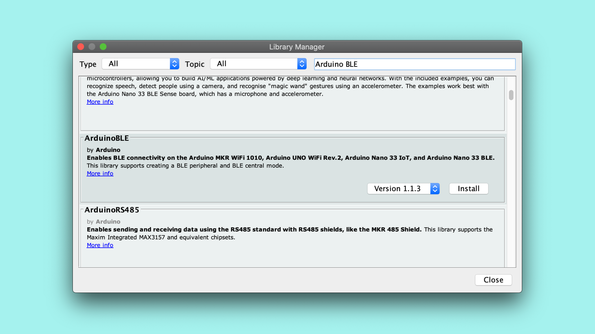
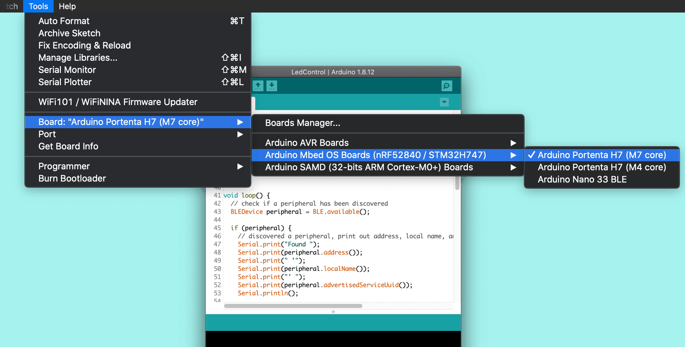
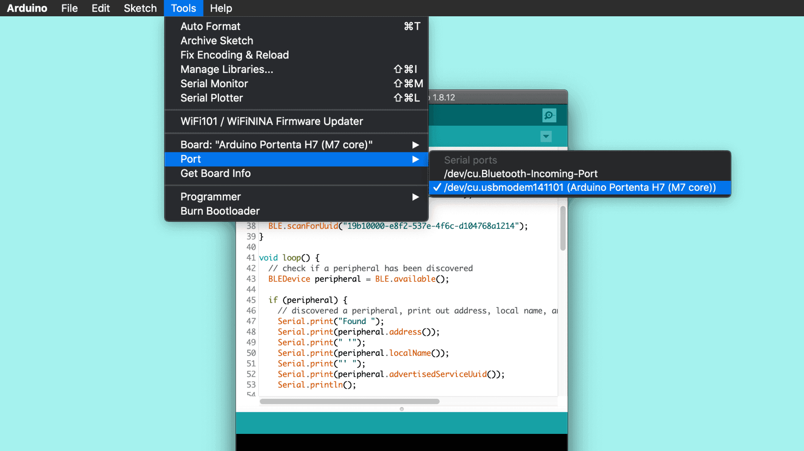
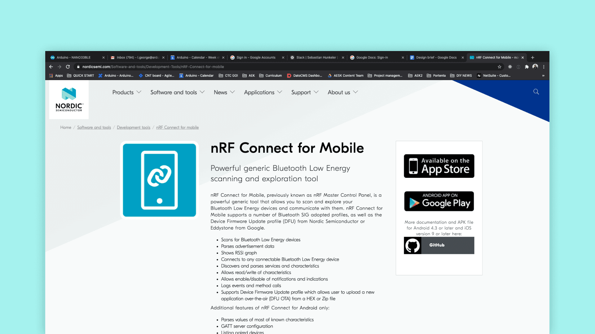
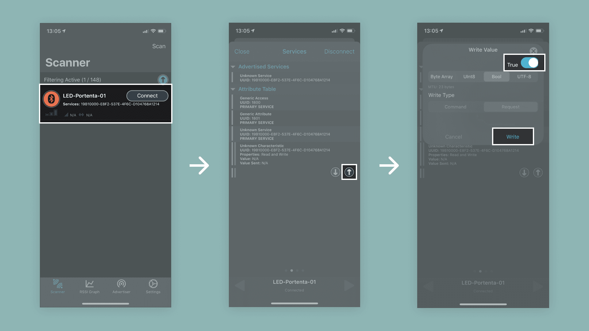

## Overview
In this tutorial we will enable low energy Bluetooth® on the Portenta H7 to allow an external Bluetooth® device to control the built-in LED either by turning it on or off.

## Goals

- Enabling Bluetooth® Low Energy connectivity on the Portenta H7.
- Connecting the Portenta to an external Bluetooth® Low Energy Mobile Application (In this case [nRF Connect](https://www.nordicsemi.com/Software-and-tools/Development-Tools/nRF-Connect-for-mobile) by Nordic Semiconductor).

### Required Hardware and Software

- [Portenta H7 (ABX00042)](https://store.arduino.cc/portenta-h7) or [Portenta H7 Lite Connected (ABX00046)](https://store.arduino.cc/products/portenta-h7-lite-connected)
- USB-C® cable (either USB-A to USB-C® or USB-C® to USB-C®)
- Arduino IDE 1.8.13+  or Arduino Pro IDE 0.0.4+ 
- Mobile device, phone or tablet
- [nRFconnect](https://www.nordicsemi.com/Software-and-tools/Development-Tools/nRF-Connect-for-mobile) or equivalent tool downloaded on your mobile device: [nRF Connect for iOS](https://itunes.apple.com/us/app/nrf-connect/id1054362403?ls=1&mt=8) or [nRF Connect for android](https://play.google.com/store/apps/details?id=no.nordicsemi.android.mcp)

## Portenta and Low Energy Bluetooth®
The onboard Wi-Fi/Bluetooth® module of the Portenta H7 offers low energy Bluetooth® functionality, in order to provide the board with the flexibility to be easily connected to devices which also support Bluetooth® Low Energy, such as the Arduino Nano 33 IoT or most modern smartphones. Compared to classic Bluetooth®, Low Energy Bluetooth® is intended to provide considerably reduced power consumption and cost while maintaining a similar communication range.

## Instructions

### Configuring the Development Environment
To communicate with the Portenta H7 via Bluetooth®, you need to upload a pre-built sketch that starts a Bluetooth® network and allows your mobile device, which will be used to control the LEDs, to connect to it. The sketch uses the [ArduinoBLE](https://www.arduino.cc/en/Reference/ArduinoBLE) Library that enables the Bluetooth® Low Energy module and handles important functions, such as scanning, connecting and interacting with services provided by other devices. You will also be using a third party application (e.g. [nRF Connect](https://www.nordicsemi.com/Software-and-tools/Development-Tools/nRF-Connect-for-mobile)), running on your mobile device in order to connect your device to the board and help you control the built-in LED.

 

### 1. The Basic Setup

Begin by plugging in your Portenta board to the computer using a USB-C® cable and open the Arduino IDE. If this is your first time running Arduino sketch files on the board, we suggest you check out how to [set up the Portenta H7 for Arduino](setting-up-portenta) before you proceed.


### 2. Install the ArduinoBLE Library 

You will need to install the ArduinoBLE library in the Arduino IDE you are using. To install the library go to : **Tools > Manage Libraries...** type **ArduinoBLE** and click **Install**. Make sure you install ArduinoBLE version 1.1.3 or higher.




### 3. Create the Bluetooth® Low Energy Sketch

Let's program the Portenta with the following example sketch. If the Bluetooth® Low Energy module has been initialized correctly, you will see the blue LED lighting up for one second after uploading the sketch. If it fails, you will see the red LED lighting up instead. Copy and paste the following code into a new sketch in your IDE or download it from [Arduino_Pro_Tutorials](https://github.com/arduino-libraries/Arduino_Pro_Tutorials) in the Arduino IDE and open it from: **Examples > Arduino_Pro_Tutorials > BLE Connectivity on Portenta H7 > PortentaBLE**

```cpp
#include <ArduinoBLE.h>

BLEService ledService("19b10000-e8f2-537e-4f6c-d104768a1214");

// Bluetooth® Low Energy LED Switch Characteristic - custom 128-bit UUID, read and writable by central
BLEByteCharacteristic switchCharacteristic("19b10000-e8f2-537e-4f6c-d104768a1214", BLERead | BLEWrite);

const int ledPin = LED_BUILTIN; // Pin to use for the LED

void setup() {
  Serial.begin(9600);
  //while (!Serial);   // Uncomment to wait for serial port to connect.

  // Set LED pin to output mode
  pinMode(ledPin, OUTPUT);
  digitalWrite(ledPin, HIGH);

  // Begin initialization
  if (!BLE.begin()) {
    Serial.println("Starting Bluetooth® Low Energy failed!");
    digitalWrite(LEDR, LOW);
    delay(1000);
    digitalWrite(LEDR, HIGH);

    // Stop if Bluetooth® Low Energy couldn't be initialized.
    while (1);
  }

  // Set advertised local name and service UUID:
  BLE.setLocalName("LED-Portenta-01");
  BLE.setAdvertisedService(ledService);

  // Add the characteristic to the service
  ledService.addCharacteristic(switchCharacteristic);

  // Add service
  BLE.addService(ledService);

  // Set the initial value for the characeristic:
  switchCharacteristic.writeValue(0);

  // start advertising
  BLE.advertise();
  digitalWrite(LEDB, LOW);
  delay(1000);
  digitalWrite(LEDB, HIGH);
  Serial.println("BLE LED Control ready");
}

void loop() {
  // Listen for Bluetooth® Low Energy peripherals to connect:
  BLEDevice central = BLE.central();

  // If a central is connected to peripheral:
  if (central) {
    Serial.print("Connected to central: ");
    // Print the central's MAC address:
    Serial.println(central.address());
    digitalWrite(LEDB, HIGH);
    delay(100);
    digitalWrite(LEDB, LOW);
    delay(100);
    digitalWrite(LEDB, HIGH);

    // While the central is still connected to peripheral:
    while (central.connected()) {
      // If the remote device wrote to the characteristic,
      // Use the value to control the LED:
      if (switchCharacteristic.written()) {
        if (switchCharacteristic.value()) {   // Any value other than 0
          Serial.println("LED on");
          digitalWrite(ledPin, LOW);          // Will turn the Portenta LED on
        } else {                             
          Serial.println("LED off");
          digitalWrite(ledPin, HIGH);         // Will turn the Portenta LED off          
        }
      }
    }

    // When the central disconnects, print it out:
    Serial.print("Disconnected from central: ");
    Serial.println(central.address());    
    digitalWrite(LEDB, HIGH);
    delay(100);
    digitalWrite(LEDB, LOW);
    delay(100);
    digitalWrite(LEDB, HIGH);
  }
}
```

In this example, you use a pre-defined Bluetooth® number code pre-setup for controlling a device's LED. This code can also be referred to as [GATT codes](https://www.bluetooth.com/specifications/gatt/services/), which define how two Bluetooth® low energy devices transfer data. Once a connection is established with a device, its respective GATT code, which is a 16 bit identifier, is stored in a lookup table for future reference. 

These GATT codes are very long, but, in this example, it is always the same code:

```BLEService ledService("19b10000-e8f2-537e-4f6c-d104768a1214"); // BLE LED Service```

***Remember that on the Portenta the built-in LED is turned on by setting it to LOW and turned off by setting it to HIGH, the opposite of most other Arduino boards.***

### 4. Upload the Sketch 

Double press the reset button so the built-in LED is slowly pulsing green. Then, select your board in the menu: **Tools > Board > Arduino Portenta H7 (M7 core)** 



Choose the **Port** where your Portenta is connected to and **Upload** the sketch. Open the Serial Monitor once you have **uploaded** the code to the board to see debugging messages. If the Bluetooth® Low Energy setup was successful, you should see the message `BLE LED Control ready`. If something went wrong, you will see the message `Starting Bluetooth® Low Energy failed!`. In that case update the Arduino BLE library (in the Library Manager) and the board (in the Board Manager) to the latest version and try again.



### 5. Connect an External Device

On your mobile device install **nRF Connect** or an equivalent app that allows for Bluetooth® Low Energy connections. We will refer to **nRF Connect** for the rest of this tutorial.



Once you have downloaded the nRF application on your mobile device, look for your Portenta in the device list. You may filter the list by "Portenta" to easierly find your board in case you are using **nRF Connect**. 

- When you found your board in the list tap "Connect". 
- Navigate to the "Services" screen and tap the arrow up button. 
- Switch to "Bool" type and move the toggle to "True". Confirm the dialog with a tap on "Write" and you should see the built-in LED turned on. If you do the same procedure again but setting the toggle switch to "False", it will turn off the LED.



## Conclusion
This tutorial shows how to connect and control the built-in LED using a Bluetooth® Low Energy connection. You have learnt how a simple Bluetooth® Low Energy connection between your Portenta and your cell phone, which has basic communication abilities between the two devices, works.

### Next Steps

Now that you learnt how to configure the Portenta as a Bluetooth® Low Energy endpoint, you can try with two Portentas (or other Bluetooth® Low Energy capable Arduino devices), to facilitate bidirectional communication. More information on how to achieve that can be found on the [BLE library reference page](https://www.arduino.cc/en/Reference/ArduinoBLE).


## Troubleshooting

### Sketch Upload Troubleshooting
If you try to upload a sketch and receive an error message, saying that the upload has failed, you can try to upload the sketch while the Portenta H7 is in bootloader mode. To do so, you need to double click the reset button. The green LED will start fading in and out. Try to upload the sketch again. The green LED will stop fading when the upload completes.
