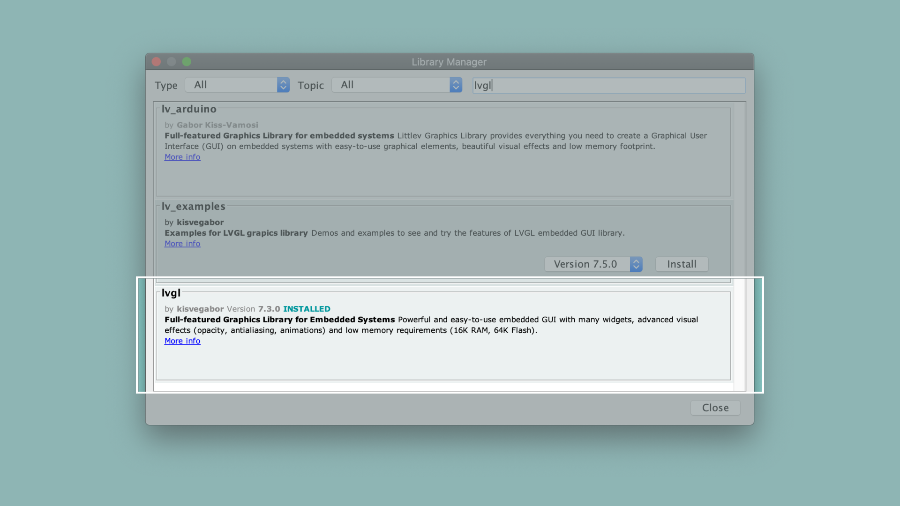

## Overview
In this tutorial you will learn to use [LVGL](https://lvgl.io/) to create a simple graphical user interface that consists of a text label which updates itself.

## Goals

-   Understanding the structure to build LVGL interfaces.
-   Building a simple UI with a text label.
-   Configuring the setup to display the User-Interface.

### Required Hardware and Software

-   [Portenta H7 (ABX00042)](https://store.arduino.cc/products/portenta-h7)
-   USB-C® cable (either USB-A to USB-C® or USB-C® to USB-C®)
-   Arduino IDE 1.8.10+  or Arduino Pro IDE 0.0.4+
-   USB-C® hub with HDMI
-   External monitor
-   HDMI cable

## The Light and Versatile Graphics Library

Graphical User interfaces are needed for visualizing information and interacting with certain aspects of an application. The Light and Versatile Graphics Library, also known as [LVGL](https://lvgl.io/), is an open-sourced library used to create graphical user-interfaces for microcontrollers and high-end processors. The light weight embedded library provides all the necessary widgets and user interface elements that will allow you to easily create user interfaces for displays and touch screens.

## Instructions

### Building a Simple GUI

This tutorial will guide you through building a basic user interface using the LVGL Library, which you can download using the Arduino Library Manager. The setup for this tutorial requires you to first upload the finished sketch file to the Portenta board. You will then connect the board to a USB-hub in order to connect it to an external monitor as well. Once the hub is powered externally, a graphical user interface with a label will be displayed on the screen.


### 1. The Basic Setup

Begin by plugging your Portenta board into the computer using a USB-C® cable and open the Arduino IDE. If this is your first time running Arduino sketch files on the board, we suggest you check out how to [set up the Portenta H7 for Arduino](setting-up-portenta) before you proceed.


### 2. Download the LVGL Library

Next, select 'Portenta' in the **Tools > Board** menu before installing [lvgl](https://github.com/lvgl/lvgl) from the Library Manager. Then go to **Sketch > Include Libraries > Manage Libraries** and search for LVGL. Download **lvgl** by [kisvegabor](https://github.com/kisvegabor).



***The sketches that we show are using the version 7.11.0. If you have the version 8 or greater you will need to make changes on the code, check LVGL API docs to see the update changes: [https://docs.lvgl.io/master/](https://docs.lvgl.io/master/).***

### 3. Adding a Label Widget

Let's start by including the library that we are going to use.

```cpp
#include "Portenta_LittleVGL.h"
```

Create a custom label widget named `label`. This object allows to easily configure its text. The following line of code declares the variable. You can add it at the beginning of your sketch.

```cpp
static lv_obj_t *label;
```

Then inside the `setup()` configure the content and the position of the label.

```cpp
void setup() {
  Serial.begin(9600);

  // Initialize Portenta's video interface
  portenta_init_video();

  // Setting up the label making it a child of the screen
  label = lv_label_create(lv_scr_act(), NULL);

  // Set the label's text
  lv_label_set_text(label , "Counter");

  // We move it to the center of the screen and align it centered
  lv_obj_align(label, NULL, LV_ALIGN_CENTER, 0, 0);
}
```

This sketch creates a label that will be displayed in the center of the connected monitor.

### 4. Connect an External Monitor

Compile and upload the sketch to your Portenta H7. At this point your board becomes the host. Unplug the board from your computer and connect it to the USB-hub along with a monitor, which is connected to the HDMI port. Power up your hub by connecting it to an external power source and the monitor will display a label saying `Counter`.


***If you are not familiar how the USB host works, we recommend you to have a look at the [USB Host tutorial](https://docs.arduino.cc/tutorials/portenta-h7/usb-host).***

Our label object currently has LVGL's default style. If you want to customize the style, you can have a look at LVGL's [documentation](https://docs.lvgl.io/latest/en/html/widgets/label.html).

### 5. Creating a Simple Counter

Let's create a counter that increases each second and update the label on the screen. To do so, you have to create a label and an updating task that is going to update the label periodically and change its value. This is possible using an LVGL concept called 'Task'.

First, you can create a counter variable at the beginning of the program (before the `setup()` function).

```cpp
int counter = 0;
```

Then, you can create the function that is going to update the value of the counter and its label. Add it to the sketch just before the `setup()` function.

```cpp
static void updateCounterTask(lv_task_t *task) {
  // Print the count to the Serial monitor
  Serial.println(counter);

  // Update the text of the label
  lv_label_set_text_fmt(label, "%d" , counter);

  // Increase the count number
  counter++;
}
```

As the last line inside the `setup()` function, you can create the task that calls your `updateCounterTask()` function every second (1000 milliseconds).

```cpp
 // Create a task to update the counter
lv_task_create(updateCounterTask, 1000, LV_TASK_PRIO_MID, NULL);
```

Finally, in the loop function add `lv_task_handler()` which will execute any pending tasks. This will cause the user interface to update.

```cpp
void loop() {
  // put your main code here, to run repeatedly:
  lv_task_handler();
}
```


### 6. Upload the Sketch

Below is the complete sketch of the tutorial that updates the label's text with an incrementing counter value. Upload the sketch to your Portenta H7 and connect it to an external monitor as described in Step 4.

```cpp
#include "Portenta_LittleVGL.h"

static lv_obj_t *label;
int counter = 0;

static void updateCounterTask(lv_task_t *task) {
  // Print the count to the Serial monitor
  Serial.println(counter);

  // Update the text of the label
  lv_label_set_text_fmt(label, "%d" , counter);

  // Increase the count number
  counter++;
}

void setup() {
  Serial.begin(9600);

  // Initialize Portenta's video interface
  portenta_init_video();

  // Setting up the label making it a child of the screen
  label = lv_label_create(lv_scr_act(), NULL);

  // Set the label's text
  lv_label_set_text(label , "Counter");

  // We move it to the center of the screen and align it centered
  lv_obj_align(label, NULL, LV_ALIGN_CENTER, 0, 0);

  // Create a task to update the counter
  lv_task_create(updateCounterTask, 1000, LV_TASK_PRIO_MID, NULL);
}

void loop() {
  // put your main code here, to run repeatedly:
  lv_task_handler();
}

```

## Conclusion

This tutorial shows how to build a simple user interface with your Portenta. Starting with a static view in the monitor and then converting it into a simple dynamic application that features an updating variable on the screen. The tutorial also shows how to use the "task" feature of LVGL to run instructions recurrently.

### Next Steps
Now that you know how to build a simple UI for a screen, you can try to add more labels to the screen to show various information or try out different LVGL widgets.

## Troubleshooting

### Counter Label Does Not Update

- Make sure that the label and task are declared on top of the sketch, outside the `setup()` and `loop()` like a normal variable.
- Check if the task has the same structure in the first declaration and the function creation.
- Look inside the `loop()` and see if `lv_task_handler()` is there.

### Sketch Upload Troubleshooting

- If you have troubles uploading the sketch, try to first set the board in bootloader mode, by clicking the reset button twice. Then you should see the built-in LED pulsating.
- If you uploaded the sketch and you do not have any output in the display, make sure you have `portenta_init_video()` in the `setup()`.
- Unplug and plug the HDMI cable in again.
- Reset the Portenta once it is connected to the USB-hub.
