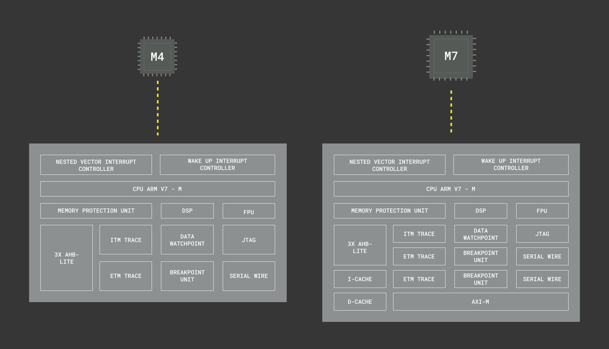
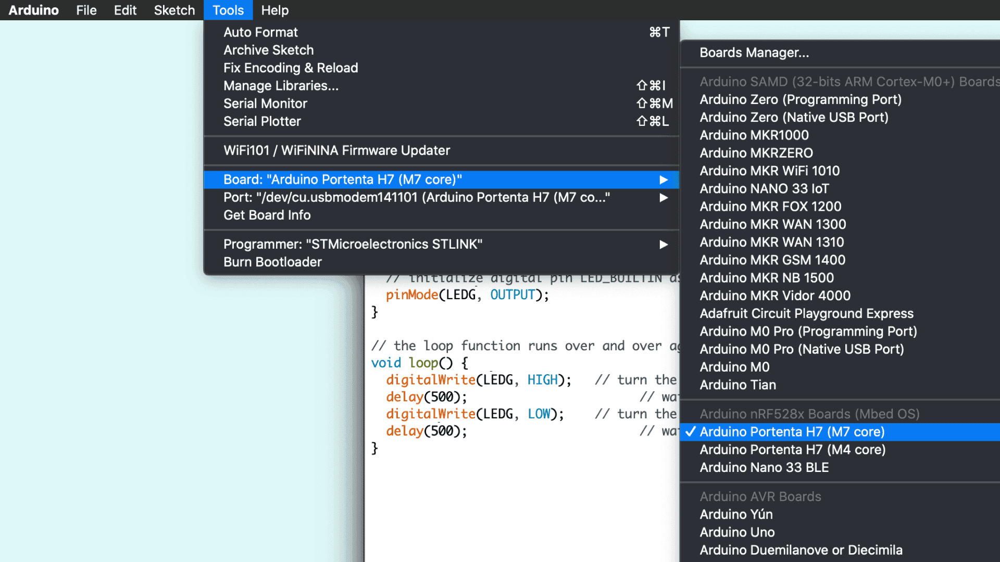
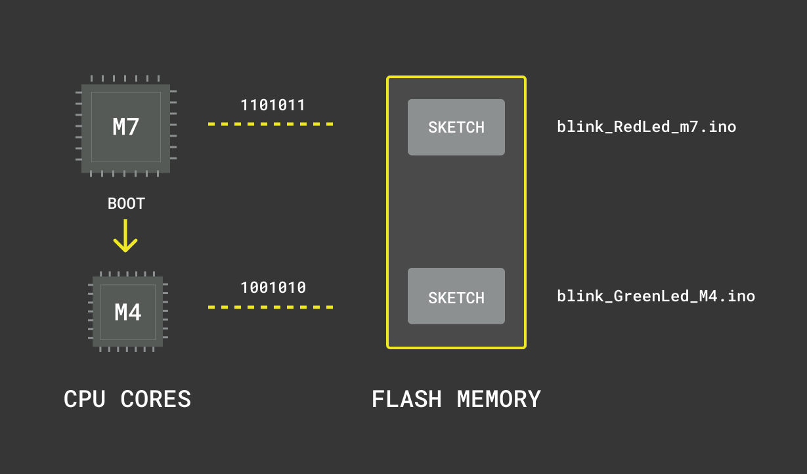
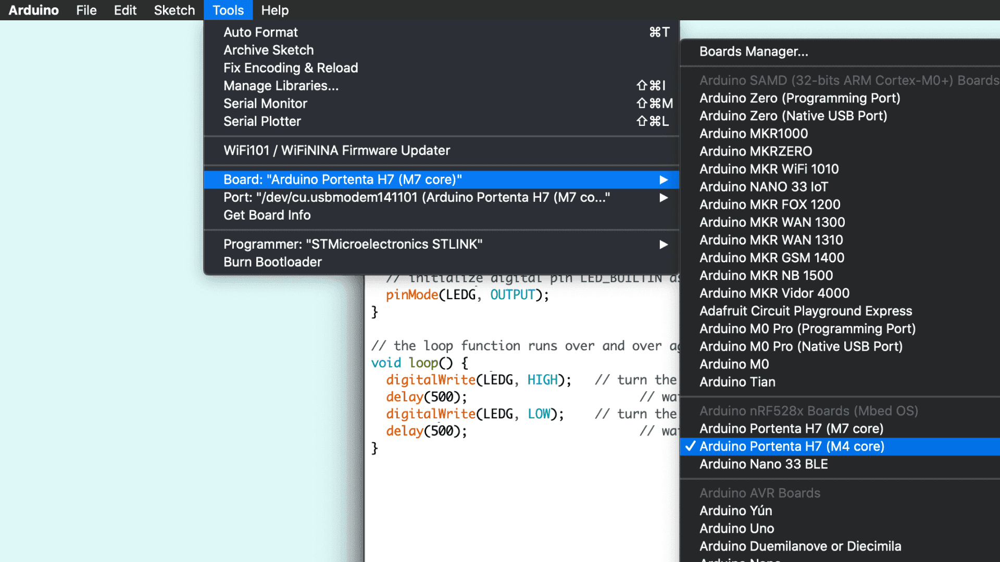

## Overview
The Portenta H7 is equipped with a processor that has two processing units called cores. Dual core processing is the ability of a processor to read and execute instructions in two different cores simultaneously. In other words, a dual core processor can execute two applications, in this case two Arduino sketches, at the same time. In this tutorial you will run two classic Arduino blink programs simultaneously on different cores of the Portenta board that blinks the RGB LED in two different colors.

## Goals

- How to upload and run applications on Portenta's M7 and M4 cores.
- Learn about the characteristics of the M7 and the M4 cores.
- How to force boot the M4 core through the M7 core and why that is necessary.
- Controlling the colors of the built-in RGB LED. 

### Required Hardware and Software

- [Portenta H7 (ABX00042)](https://store.arduino.cc/portenta-h7), [Portenta H7 Lite (ABX00045)](https://store.arduino.cc/products/portenta-h7-lite) or [Portenta H7 Lite Connected (ABX00046)](https://store.arduino.cc/products/portenta-h7-lite-connected)
- USB-C® cable (either USB A to USB-C® or USB-C® to USB-C®)
- Arduino IDE 1.8.10+ 

## Cortex® M7 & M4 
Processor cores are individual processing units within the board's main processing unit (do not confuse a processor core with an [Arduino core](https://docs.arduino.cc/learn/starting-guide/cores)). These cores are responsible for executing instructions at a particular clock speed. The on-board  Arm Cortex processor comes with two cores (Cortex® M7 and M4), with slightly different architectures and clock speeds. The M7 runs at 480 MHz and the architecture is designed to separate Instruction and Data buses to optimize CPU latency. The M4 runs at 240 MHz and the architecture supports the ART™ accelerator (a block that speeds up instruction fetching accesses of the Cortex-M4 core to the D1-domain internal memories). The higher clock rate of the M7 makes it suitable to handle complex processing tasks such as data storage, debugging or handling input/output peripherals at a higher efficiency compared to the M4. The dual core processor of the Portenta H7 sets it apart from other single core Arduino boards, by allowing true multitasking, faster data processing capabilities, enhanced processing power and application partitioning.  



## Instructions

### Accessing the M7 and M4 Core
To best illustrate the idea of dual core processing, you will be running two separate sketch files. One on each of the cores which blinks the RGB LED in a different color. The **BlinkRedLed_M7.ino** sketch will set the built-in RGB LED on the board to red and blink it with a delay of 500 ms. The **BlinkGreenLed_M4.ino** sketch will access the green LED in the RGB led and blink it with a delay of 200 ms. Both the cores will be executing the corresponding sketch file simultaneously and as a result both the green and red LED blink, however, at different intervals.


### 1. The Basic Setup
Begin by plugging-in your Portenta board to your computer using an appropriate USB-C® cable and have the  Arduino IDE open. If this is your first time running Arduino sketch files on the board, we suggest you check out how to [Setting Up Portenta H7 For Arduino](setting-up-portenta) before you proceed.


**Note:** You can access the examples from the tutorials library once it is installed: **Examples > Arduino_Pro_Tutorials > Dual Core Processing**

### 2. Setting the LED Color 
In the previous tutorial you learned how to access the built-in RGB LED through the macro definition LED_BUILTIN. You can also control the distinct Red, Green and Blue LED separately through the LEDR, LEDG and LEDB macro definition respectively. 

Please note that, opposed to other Arduino boards, on the Portenta H7 the built-in RGB led pins need to be pulled to ground to make the LED light up. This means that a voltage level of LOW will turn the LED on, a voltage level of HIGH will turn it off.

The following sketch blinks the red LED at an interval of 200ms controlled by the M7 core. Save your sketch as **BlinkRedLed_M7** and compile your sketch file.

```cpp
// the setup function runs once when you press reset or power the board
void setup() {
    // initialize digital pin LEDR as an output.
    pinMode(LEDR, OUTPUT);
}

// the loop function runs over and over again forever
void loop() {
   digitalWrite(LEDR, LOW); // turn the red LED on (LOW is the voltage level)
   delay(200); // wait for 200 milliseconds
   digitalWrite(LEDR, HIGH); // turn the LED off by making the voltage HIGH
   delay(200); // wait for 200 milliseconds
}
```

### 3. Upload the Sketch to the M7 Core 
Select the **Arduino Portenta H7 (M7 core)** from the **Board** menu and the port the Portenta is connected to (e.g. /dev/cu.usbmodem141101). Upload the **BlinkRedLed_M7.ino** sketch. Doing so will automatically compile the sketch beforehand. When the sketch is uploaded, the RGB LED on the board will start blinking red.



### 4. Making the LED Blink Green
Let's write another sketch that makes the RGB LED on the board blink green. Open a new sketch file and call it **BlinkGreenLed_M4.ino**. Copy and paste the following program that blinks the LED green, denoted by the variable `LEDG`,  with a delay of 500ms. This time the blinking is controlled by the M4 core.

```cpp
// the setup function runs once when you press reset or power the board
void setup() {
    // initialize digital pin LEDG as an output.
    pinMode(LEDG, OUTPUT);
}

// the loop function runs over and over again forever
void loop() {
   digitalWrite(LEDG, LOW); // turn the LED on (LOW is the voltage level)
   delay(500); // wait for half a second
   digitalWrite(LEDG, HIGH); // turn the LED off by making the voltage HIGH
   delay(500); // wait for half a second
}
```

If you would like to upload the sketch to the M4, at this point nothing would change. The reason is that the M4 core does not start up by itself. There is one more step required to make the M4 core blink the LED green: Force booting the M4.

### 5. Force Booting the M4 Core
The bootloader of the H7 boards is configured in such a way that only M7 gets booted automatically. The reason is that for simple use cases the M4 may not be needed, hence be unprogrammed and does not need to get powered. One such instance is when the M7 does not have the appropriate firmware that automatically handles the initialization of the M4. As a result you need to force boot the M4 so that it can run a sketch. You can do so through the M7 using a special command, `bootM4()`  that boots the M4 when the board is powered.



Before you can upload the code for the M4 core to the Flash memory you need to add the `bootM4()` command in the **BlinkRedLed_M7.ino** sketch file that is uploaded and run by the M7 core. Copy and paste the following command `bootM4()` inside the `setup()` function of the **BlinkRedLed_M7.ino**  sketch and upload the sketch to M7 once again.

```cpp
// the setup function runs once when you press reset or power the board
void setup() {
    // initialize digital pin LED_BUILTIN as an output.
   bootM4();
   pinMode(LEDR, OUTPUT);
}

// the loop function runs over and over again forever
void loop() {
   digitalWrite(LEDR, LOW); // turn the LED on (LOW is the voltage level)
   delay(200); // wait for 200 milliseconds
   digitalWrite(LEDR, HIGH); // turn the LED off by making the voltage HIGH
   delay(200); // wait for 200 milliseconds
}
```

Once this sketch runs on the M7 core, it boots the M4 core and allows it to run its corresponding sketch.

### 6. Uploading to the M4 Core
The final step is to upload the sketch that you prepared for the M4. Now open **Tools> Boards** from the IDE menu and select **Arduino Portenta H7 (M4 core)** from the boards. Upload the **BlinkGreenLed_M4.ino** to the board. Note that there is no separate serial port listed for the M4 in the port menu as the M7 takes care of the serial communication. The RGB LED blinking in RED currently starts blinking in green simultaneously at an interval of 500 ms. When the blinking overlaps the mix of red and green light is perceived as yellow.



### Programming Both Cores With Just One Sketch
So far, you used separate sketch files to program the different cores. You can also combine these two sketch files into one by taking advantage the preprocessor directives '#ifdef'. This way you can program different behaviors for both cores by using the same program. 

***Programming bigger applications by using this method may increase the difficulty of the program you will need to create.*** 

Let's now create a new sketch to  blink both of LEDs with random sequences, this will allow you to clearly see different behaviors for both of the LEDs using a very simple program.

### 1. Programming the M7 Core Set-Up
Let's start by opening a new sketch and naming it **BlinkBothCores.ino**. Then let's add the following lines of code. 

```cpp
int myLED;

void setup() {

  randomSeed(analogRead(0));
   
  #ifdef CORE_CM7  
    bootM4();  
    myLED = LEDB; // built-in blue LED
  #endif
```

The code between `#ifdef CORE_CM7` and `#endif` will only apply for the M7 Core to boot the M4 core, allowing it to run its corresponding sketch. That portion of code will also allow the M7 core control the blue LED of the board.

### 2. Programming the M4 Core Setup
Then, as well inside the `setup()` function, you will need to include the following lines to configure properly the green LED in the M4 core.

```cpp
#ifdef CORE_CM4  
  myLED = LEDG; // built-in greeen LED
#endif   
```

### 3. Finishing the Setup() Function and Programming the Loop()
To finish with the `setup()`, you will need to initialize the LEDs as outputs. 

Then in the `loop()` function you will need to include the sequence that blink the LEDs. to do so, add  the following portion of code right after the `#endif`. 

```cpp
  pinMode(myLED, OUTPUT);
}

void loop() {
   digitalWrite(myLED, LOW); // turn the LED on 
   delay(200); 
   digitalWrite(myLED, HIGH); // turn the LED off 
   delay(rand() % 2000 + 1000); // wait for a random amount of time between 1 and 3 seconds.
} 
```

Now can upload the sketch to both the cores of the Portenta H7 individually. With this sketch, you will be able to control the LED through both the cores (M4 and M7) and you should be able to see the Blue and Green LEDs of the Portenta board blinking with different sequences.

## Conclusion
This tutorial introduces the idea of dual core processing and illustrates the concept by using the M7 and M4 cores to control the different colors of the built-in RGB LED. This simple example only describes how to access the M7 and M4 cores. In the upcoming tutorials you will learn how to create applications that leverage the potential of dual core processing to perform more complex tasks. 

### Next Steps

- Proceed with the next tutorial [Setting Up a Wi-Fi Access Point](https://docs.arduino.cc/tutorials/portenta-h7/wifi-access-point/) to learn how to make use of the built-in Wi-Fi module and configure your Portenta H7 as a Wi-Fi access point.
