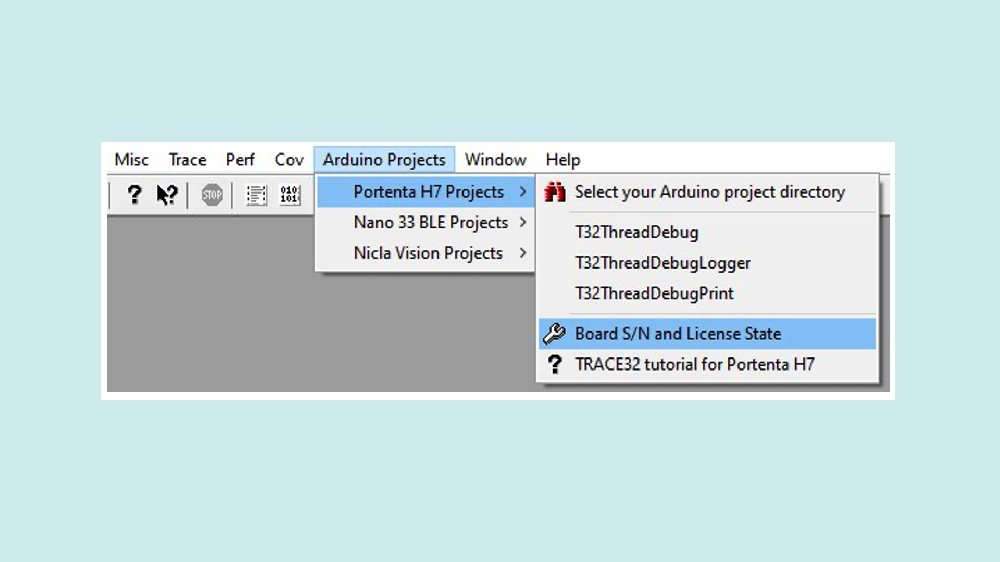
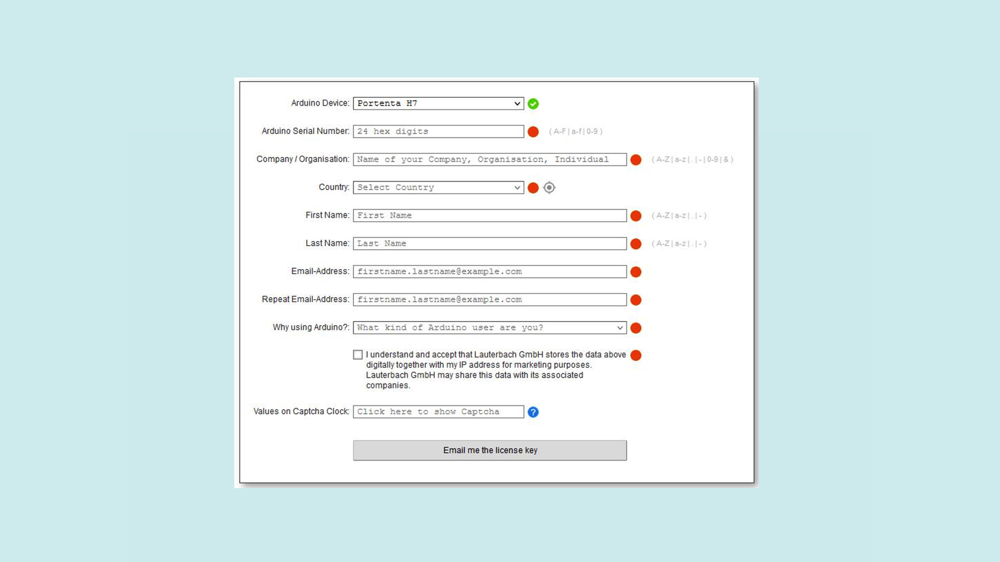
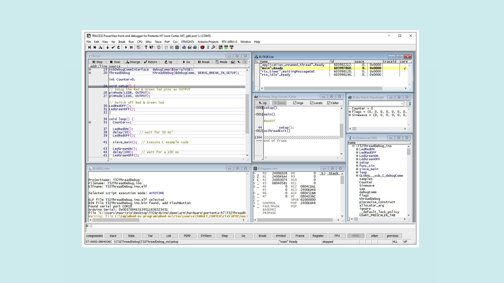

## Overview

This tutorial will show you how to use the Lauterbach TRACE32 GDB front-end debugger to debug your Arduino boards' applications via GDB on a serial interface. It also explains how to obtain a free license for a fully functional version of TRACE32 using your board's serial number.

## Goals

- How to get a free license key for TRACE32 GDB Front End debugger
- How to download and start the Lauterbach TRACE32 GDB Front End debugger
- How to Flash and debug some ready-to-run demos

### Required Hardware
To use the TRACE32 GDB Front End debugger, you will need one of the following boards:
- [Portenta H7 (ABX00042)](https://store.arduino.cc/products/portenta-h7), [Portenta H7 Lite (ABX00045)](https://store.arduino.cc/products/portenta-h7-lite) or [Portenta H7 Lite Connected (ABX00046)](https://store.arduino.cc/products/portenta-h7-lite-connected)
- [Nicla Vision (ABX00051)](https://store.arduino.cc/products/nicla-vision)
- [Arduino Nano 33 BLE (ABX00030)](https://store.arduino.cc/nano-33-ble)
- [Arduino Nano 33 BLE Sense (ABX00031)](https://store.arduino.cc/nano-33-ble-sense)
-  USB-C® cable (either USB-A to USB-C® or USB-C® to USB-C®) for Portenta H7
-  Micro USB cable (either USB-A to Micro USB or USB-C® to Micro USB) for Nicla Vision, Nano 33 BLE and Nano 33 BLE Sense

### Required Software
-  [Arduino IDE 1.8.10+](https://www.arduino.cc/en/software) or [Arduino IDE 2.0+](https://www.arduino.cc/en/software)
-  Lauterbach TRACE32 software build 144320 (6 Feb 2022) or higher for Portenta H7, Nano 33 BLE and Nano 33 BLE Sense, available [here](https://repo.lauterbach.com/download_demo.html)
-  Lauterbach TRACE32 software build 161373 (31 Jul 2023) for Nicla Vision, available [here](https://repo.lauterbach.com/download_demo.html)


## Instructions

### TRACE32 GDB Front End Debugger

In this tutorial, you will learn how to upload an application that contains an MRI (Monitor for Remote Inspection) to your Arduino boards. This is a GDB-compatible serial monitor, which is included both in the ThreadDebug sketch in the IDE Examples and in all the examples available inside the TRACE32 /demo directory.

In the next steps, the **double-tilde (~~)** is used as a placeholder for the directory where you unzipped the TRACE32 software.

### Downloading the TRACE32 Debugger

In order to download the TRACE32 debugger, open the [Lauterbach download page](https://www.lauterbach.com/download_demo.html) in your browser. Download the zip file named **Debugger for GDB target (Arduino Pro)**.

Extract the zip file to a directory of your choice. On Windows systems, please avoid C:\T32, because this is the default installation directory for the full TRACE32 distribution.

### Registration and License Key

Without a valid license, the TRACE32 debugger only works for a few minutes in demo mode. To avoid this limitation, Lauterbach may generate a **free license** based on the serial number of your board. The license will be valid for one year and can easily be renewed for free after this expiration using the same procedure. 

In order to obtain a new license, you need to first get the serial number of your board. There are two alternative ways to do so:

- In the Arduino IDE, select the "Tools->Get Board Info" menu command after choosing the port to which your board is connected. This should show a 16-character (64-bit) long serial number for your Nano BLE devices and a 24-character (96-bit) long serial number for your Portenta H7 or Nicla Vision.


***For Portenta H7 and Nicla Vision only: if you only see a 16-character (64-bit) long serial number, then you need to update your Arduino IDE and your boards' core from the Boards Manager in the IDE. Details on how to do so can be found on the Arduino website. In addition, make sure your board has the [latest bootloader](https://docs.arduino.cc/tutorials/portenta-h7/updating-the-bootloader) installed.***

- Use the TRACE32 debugger. Check the section "Starting the TRACE32 Debugger" to learn how to get started. Click the menu item "Board S/N and License State". Your board's serial number will be printed in the AREA window and a dialog LICENSE.state will be opened.




***Note: Newer TRACE32 software version should automatically detect and show the board serial number, at the first connection to the target.***

At this point, you are ready to register at the [Lauterbach registration page](http://www.lauterbach.com/4543):

[www.lauterbach.com/4543](http://www.lauterbach.com/4543)

Copy & paste your board's serial number and enter your name and e-mail address to get your new license. 



When you receive the email containing your license key, follow the instructions provided at the end of the message: 
- Copy the complete line of code provided in the email and paste it into the **license.t32** text file in your TRACE32 installation directory. Create the file license.t32 if it does not exist yet. On Windows, the TRACE32 system directory is by default "C:\T32".
- Restart TRACE32 after adding the license key.

### Starting the TRACE32 Debugger

To use the debugger, launch the appropriate executable for your host operating system. The executables can be found in the corresponding sub-directory for your operating system:

`~~/bin/windows` for 32-bit Windows hosts

`~~/bin/windows64` for 64-bit Windows hosts

`~~/bin/linux` for 32-bit Linux hosts

`~~/bin/linux64` for 64-bit Linux hosts.

To simplify the access, we suggest creating a link to the corresponding executable file on your desktop:

- for Windows, this is t32marm.exe

- for Linux, this is t32marm-qt

#### Setting Up the Serial Port

On Windows systems, the TRACE32 start-up script will automatically search for the right COM port attached to the board.

On Linux systems, you will need to edit the `system-settings.cmm` file to manually add the serial port your board is connected to. This is a text file and can be opened with your favorite text editor. Edit the line that defines &GDBPORT to refer to the serial port, for example: `&GDBPORT="/dev/ttyACM0"`. This must be done **before** you start the TRACE32 software. After changing the port, you can start the TRACE32 debugger or re-start it in case it was open while you performed the changes.

***The manual port setting is also useful for Windows systems when you connect multiple boards simultaneously and you would like to select a specific board to be used by TRACE32 for debugging. The automatic port selection is disabled when a &GDBPORT definition is found in `system-settings.cmm`.***

### Running Your First Demo

A number of pre-built demo programs are available in the tool. They can be accessed from the "Arduino Projects" menu. The following instructions relate to the T32ThreadDebug example. However, other examples follow a similar pattern.

The demo directory already includes the symbolic file (.elf) for debugging and the binary file (.bin) for Flash programming.


#### ELF File Selection

Select "T32ThreadDebug" from the "Portenta H7 Projects" menu and you will be presented with a dialog called "Elf File Selection". This is where the TRACE32 initial environment can be configured.


In this dialog, you can select which variant of the Arduino IDE you would like to use to source ELF files or if you want to use the current directory. To follow this tutorial, please select "current dir". 

The list on the right of the "Options" selection should then become populated with a number of available ELF files ready for downloading and debugging. Select the one you are interested into with a double click. In this tutorial, "T32ThreadDebug.ino.elf" has been selected. This will also show file attributes such as date, time and size. 

To select an ELF file from a custom directory, click the "File" button underneath the "User's choice" field and browse for the desired ELF file. You can decide to change the behavior of this script the next time it is executed.

If the application has already been programmed on the Flash, for instance via the Arduino IDE or a previous TRACE32 session, select "Load debug symbols (program is already in Flash)" to prevent an unnecessary erase and write cycle of the on-chip Flash memory.

If the application has changed or does not match the contents of the Flash, then select "Flash program and load debug symbols".

Click the "OK" button to confirm all of your choices and start the session.

#### Debugging Session

If the Flash is being programmed, TRACE32 will prompt you to double-click the reset button on the board to enable the bootloader mode. The built-in green LED of the board will fade in and out when the board will be in bootloader mode. Click the "OK" button to proceed. Diagnostic messages will be displayed in the TRACE32 AREA window whilst the erasing and programming take place.

The script will then be uploaded to the board and cause TRACE32 to open some debug windows. When everything is ready, you should see the Program Counter halted at the beginning of the setup() function. You may now use the arrow buttons in the toolbar to step through the code and inspect the variables, registers, call stack etc.



In case of errors, please check the physical connection to the board, check if your host PC has detected the board's serial port and if this is the port configured in TRACE32. Reset the board and retry.

Take a look at the `readme.txt` file inside the demo directory for further information about the demo.

### Compile and Debug Other Projects

The provided demos or any other project of your choice can be edited, compiled, and flashed with the Arduino IDE. You can open for example the `T32ThreadDebug.ino` file in the Arduino IDE, build and flash it. Flashing is also possible with TRACE32 tool.

***IMPORTANT: If you choose to program the Flash within the Arduino IDE, do not close the IDE after programming; leave it open. This is very important because, if you close the IDE, it cleans up the temporary build directory which includes the ELF file.***

The demo directory contains a startup script that will copy the ELF file and the binary file in the current working directory. After the startup script is run, you can safely close the Arduino IDE if you do not need it anymore.

When you are done with flashing your application to the board, you can switch back to TRACE32. Select the type of Arduino IDE. If an ELF file is found, double-click to select it, then select "Load debug symbols (program is already in flash)" and click "OK".

### Custom Startup Script

You may also create a custom startup script for your own application. A minimal startup script is shown below. Copy it into a text file and save it with a file extension ".cmm". To execute it, call the menu command "File-->Run Script..." from the TRACE32 GUI.

```cpp
SYStem.Down
SYStem.CPU PortentaH7-CM7 ; or SYStem.CPU NICLAVISION-CM7
SYStem.PORT <serial_port>  ; e.g. COM8 (Windows) or /dev/ttyUSB0 (Linux)
SYStem.Option MMUSPACES ON
Break.CONFIG.METHOD.Program Onchip

SYStem.Mode Attach

Data.LOAD.Elf * /NoCODE

TASK.CONFIG ~~/demo/arm/kernel/rtxarm/v5/rtx.t32
MENU.ReProgram ~~/demo/arm/kernel/rtxarm/v5/rtx.men

List.auto
ENDDO
```

You can also copy the script `start.cmm` from the T32ThreadDebug demo directory to your working directory. For an application using the Serial Monitor, it is necessary to copy both `start.cmm` and `term.cmm` from the T32ThreadDebugPrint demo directory.

For each demo the corresponding `start.cmm` script comes with a predefined window layout. For your own layout, manually open and arrange the windows as you prefer, then save this window layout using the "Store Windows..." command in the Window menu. Save the file as `win.cmm`. It will be automatically found and used the next time you start a debugging session.

## Conclusion

In this tutorial, you learned how to acquire a free version of the TRACE32 GDB Front End debugger, fully licensed for your Arduino board for one year. You learned how to start the debugger and debug some ready-to-run demos. Furthermore, you learned how to debug an application compiled with the classic Arduino IDE.

### Next Steps
Lauterbach also provides hardware-based debug & trace tools. To learn more about them please visit:

- [https://www.lauterbach.com](https://www.lauterbach.com)
- [https://www.lauterbach.com/microtrace_cortexm.html](https://www.lauterbach.com/microtrace_cortexm.html)


## Troubleshooting

### Portenta’s or Nicla's Serial Number Is Not 24 Digits Long

- Update Arduino IDE to the latest version available
- Update **Arduino mbed-enabled Boards** core from Arduino IDE menu: **Tools > Board > Boards Manager**
- Update the board's bootloader using the instructions available [here](https://docs.arduino.cc/tutorials/portenta-h7/updating-the-bootloader).

### Error Message in AREA View: 'No More Arguments Expected' 

- This may be caused by unsupported characters in your Windows user name. Make sure your user name contains neither any spaces nor special characters.

### Debugger Connection Issues

In case the debugger encounters any issues while connecting to the Portenta, try the following:

- Reset the board before running the startup script.
- If the errors persist, please check the physical connection. Check if your host PC has detected the board's serial port and if this is the port configured in TRACE32 (check also the configuration in the startup file). Reset the board and retry.

### Flashing Issues

- Before flashing your board with the Arduino IDE, please disconnect the TRACE32 debugger by typing the command: “SYStem.Down” on the command line interface. Alternatively, open the menu: “CPU-> System Settings…” and press the radio button “Down” in the “Mode” section.

### Debugger Hanging Issues

- The TRACE32 GDB front-end debugger is a run-mode debugger: At a breakpoint, only the user threads are stopped. The kernel and all other system threads continue to run. It may happen that the debugger hangs if a breakpoint is set in critical system areas. In this case, reset the board, remove all breakpoints, and connect again to the target (SYStem.Mode Attach command).

### Issues While Starting TRACE32 on Linux

- The TRACE32 executable for Linux requires the Qt libraries. Please verify that one of the following versions of Qt is installed:
- Qt4 >= 4.6.2	(Linux 32-bit or 64-bit)
- or Qt5 >= 5.9	(Linux 64-bit)

On Ubuntu Linux, for example, you can install the Qt5 libraries using apt-get: `sudo apt-get install qt5-default`

### Issues With the GDB Serial Port on Host Linux

The user running the TRACE32 executable on Linux must have permission to access serial devices. For example, in Ubuntu, a temporary permission can be set as follows:

`sudo chown :username /dev/devicename`

You can also set permanent permission by adding the user to the "dialout" group. For example, in Ubuntu:

`sudo adduser username dialout`

Alternatively, you can run the TRACE32 executable with root permissions.
