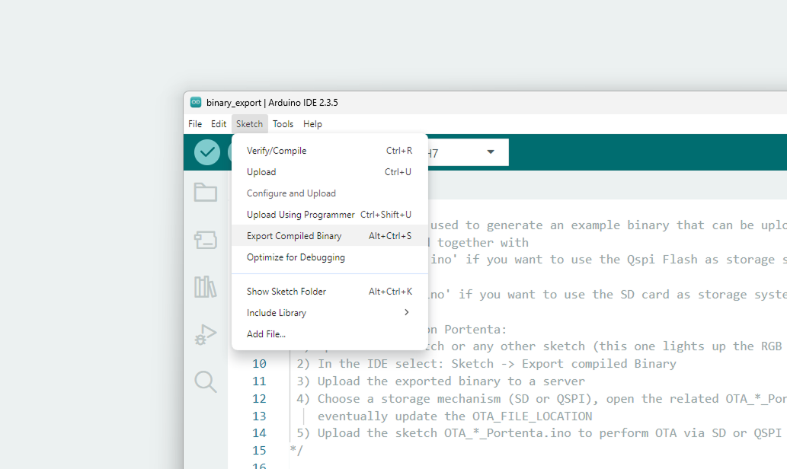
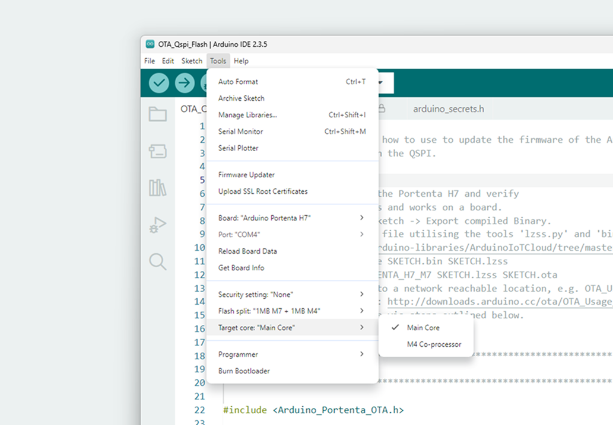
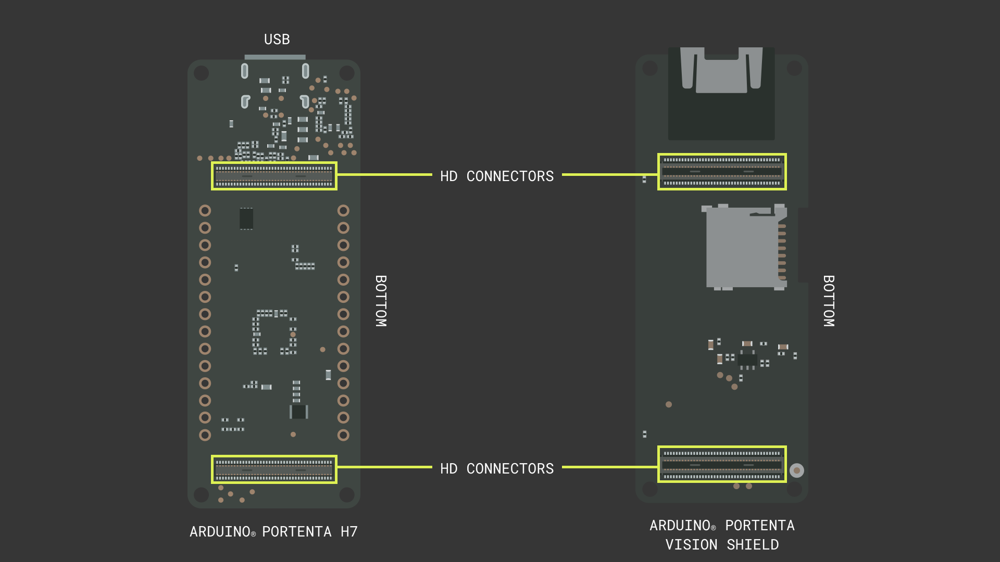
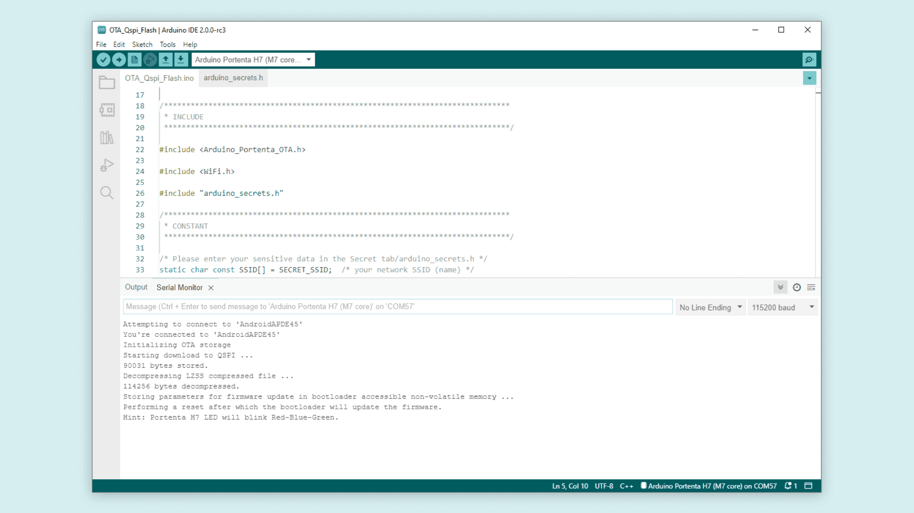
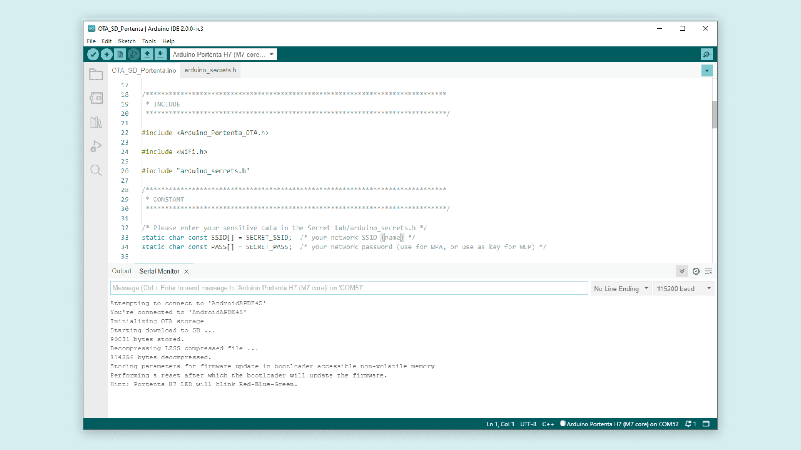

## Overview
In this tutorial, you will learn how to use and allow firmware updates via **OTA (Over-The-Air)** feature with the **Arduino Portenta H7**. With this tutorial, you will be able to create a binary file to be used with the OTA feature and use the internal **QSPI** or a external **SD card** to accomplish the OTA (Over-The-Air) process. 

***To proceed with OTA using a SD Card, you will need to use a carrier or shield with a SD card slot, e.g Portenta Breakout, Portenta Max Carrier, Portenta Vision Shield.***

## Goals
The goals of this tutorial are: 
- Create an OTA file required to use the OTA (Over-The-Air) feature. 
- Use QSPI or SD card storage to load the firmware downloaded using the OTA feature.

## Hardware and Software Needed 
- [Arduino Portenta H7](https://store.arduino.cc/portenta-h7)
- Operative System: Linux or MacOS system, this procedure is not 100% compatible on Windows.
- Arduino IDE 1.8.10+ or Arduino Pro IDE 0.0.4+
- USB-C® type cable (either USB-A to USB-C® or USB-C® to USB-C®)
- Arduino IoT Cloud and Arduino_Portenta_OTA libraries
- SD card (optional, you can use QSPI instead)
- Carrier or shield compatible with the Portenta H7 with a SD Card slot, in case you choose to use the SD Card.

## What OTA Means
**OTA** (Over-The-Air) is a method of distributing wirelessly to end devices to update their firmware, configuration or security-related protocols. The purpose of this method is to change a device’s behavior or its settings for better performance, for adding new features or to change its targeted usage. 

## Instructions 

We will explain briefly the steps required to be able to use OTA (Over-The-Air) process with Arduino Portenta H7. It will consist of firmware OTA file creation and use of preferred storage mode (QSPI or SD card). 

### Firmware OTA File Creation
You will need to create the binary file required for the OTA (Over-The-Air) process to be able use it with either storage option stated previously. For the purpose of this tutorial, you will have to use the following script to create the binary file. 

```cpp
/*
 This sketch can be used to generate an example binary that can be uploaded to Portenta via OTA.
 It needs to be used together with
  - 'OTA_Qspi_Flash.ino' if you want to use the Qspi Flash as storage system
 OR
  - 'SD_Qspi_Flash.ino' if you want to use the SD card as storage system

 Steps to test OTA on Portenta:
 1) Upload this sketch or any other sketch (this one lights up the RGB LED with different colours).
 2) In the IDE select: Sketch -> Export compiled Binary
 3) Upload the exported binary to a server
 4) Choose a storage mechanism (SD or QSPI), open the related OTA_*_Portenta.ino sketch,
    eventually update the OTA_FILE_LOCATION
 5) Upload the sketch OTA_*_Portenta.ino to perform OTA via SD or QSPI Flash
*/

void setLed(int blue, int green, int red) {
  digitalWrite(LEDB, blue);
  digitalWrite(LEDG, green);
  digitalWrite(LEDR, red);
}


void setup()
{
  pinMode(LEDB, OUTPUT);
  pinMode(LEDG, OUTPUT);
  pinMode(LEDR, OUTPUT);
}

void loop()
{ //led BLUE ON
  setLed(1, 0, 0);
  delay(1000);
  //led GREEN ON
  setLed(0, 1, 0);
  delay(1000);
  //led RED ON
  setLed(0, 0, 1);
  delay(1000);
}
```

This script will light up the RGB LED with 3 different colors in sequence. This code will need to be uploaded to the Arduino Portenta H7 firsthand. This is to verify whether the sketch compiles and is working correctly. After verifying this, in Arduino IDE, you will search for **Sketch > Export Compiled Binary**. 



With the binary file ready, you can now create the OTA file needed to enable Over-The-Air process. 

To continue, macOS or Linux environment is required. For Windows environment, it is possible to use virtualization software such as [Oracle VM Virtualbox](https://www.virtualbox.org/) using your preferred choice of compatible Linux distribution. If you're not familiar with Linux environments, [Ubuntu](https://ubuntu.com/) is one of many distributions that can help you explore Linux environment with ease of access. 

Once you're comfortable with an environment, you will need a tool which can be found at the following link.

***[Arduino IoT Cloud Library - Over-The-Air Tools](https://github.com/arduino-libraries/ArduinoIoTCloud/tree/master/extras/tools)***

You will have to extract the library at a preferred location to be able to use the tools. Then, you will need to run on the terminal the following commands in sequence to be able to create the OTA file. 

Copy the binary file into the library tool's folder 

```cpp
// Exported binary format reference: sketch.bin
cp OTA_Usage_Portenta.ino.PORTENTA_H7_M7.bin ~/Arduino/libraries/ArduinoIoTCloud/extras/tools/
```

Go inside that directory

```cpp
cd ~/Arduino/libraries/ArduinoIoTCloud/extras/tools
```

Encode your binary file into `OTA_Usage_Portenta.ino.PORTENTA_H7_M7.lzss`

```cpp
// Argument format: ./lzss.py --encode sketch.bin sketch.lzss
./lzss.py --encode OTA_Usage_Portenta.ino.PORTENTA_H7_M7.bin OTA_Usage_Portenta.ino.PORTENTA_H7_M7.lzss
```

Convert your encoded file into `.ota` format

```cpp
// Argument format: ./bin2ota.py PORTENTA_H7_M7 sketch.lzss sketch.ota
./bin2ota.py PORTENTA_H7_M7 OTA_Usage_Portenta.ino.PORTENTA_H7_M7.lzss OTA_Usage_Portenta.ino.PORTENTA_H7_M7.ota
```

You can use `OTA_Usage_Portenta.ino.PORTENTA_H7_M7` as a sketch name for facilitated identification of the file. After this, you will have the `.ota` file of the sketch that you will use with the OTA process. 

### Installing Python 3 On Linux

If you are using Linux, maybe you cannot run the **bin2ota.py** script. This may be because you need to install [Python 3](https://www.python.org/) and the necessary modules. To do it execute the next command on your **Linux terminal**: 

```cpp 
sudo apt install python-is-python3
``````

You will also need to install the **crccheck** module on python by following the next instructions:

Installing pip on python:
```cpp
//Necessary to install python modules:
sudo apt install python3-pip 
```
Installing the crccheck necessary module on python:

```cpp
//Necessary to run the script:
pip install crccheck
```
Once you have done it, you should be able to run the bin2ota.py script successfully. 

### Uploading OTA file to the net ###

Now you can upload your .OTA file to an online reachable location, e.g. *OTA_Usage_Portenta.ino.PORTENTA_H7_M7.ota*  has been uploaded to: 

https://downloads.arduino.cc/ota/OTA_Usage_Portenta.ino.PORTENTA_H7_M7.ota

You can change the default file location on the code by modifying the next line on the ***"OTA_Qspi_Flash"** sketch or in the **"OTA_SD_Portenta"** sketch depending on which method are you going to follow:

```cpp
static char const OTA_FILE_LOCATION[] = "Introduce here your online OTA file location";
```
It is important to know that if your OTA file is uploaded to an HTTPS website you will need to modify the next line in the code:

```cpp
  int const ota_download = ota.download(OTA_FILE_LOCATION, true /* is_https */);
```
This line is in **line 87** for the **"OTA_Qspi_Flash"** sketch or in **line 88** on the **"OTA_SD_Portenta"** sketch.

If you are going to use the example OTA file used in this tutorial you don't need to follow the steps in this section, just execute the sketch with the default file location.


***Now you have two options to choose, use QSPI or use an SD Card to storage your OTA file. You can use the left side index to jump to the option that you may need.***

### QSPI Storage Mode

#### Setting Up
To use internal **QSPI** storage for downloading the binary file via OTA (Over-The-Air), you will only need the Arduino Portenta H7 board connected to the computer with the [Arduino IDE](https://www.arduino.cc/en/software). With it, you will need to have selected the **Arduino Portenta H7 (M7 Core)** with the Flash split of **1 MB M7 + 1 MB M4** for the purpose of this tutorial and the corresponding port. 



#### Writing the Script
To proceed with a OTA using the QSPI flash, you can open the sketch from **Examples >Arduino_Portenta_OTA > OTA_Qspi_Flash**.

***Do not forget to fill your Wi-Fi AP SSID and password on the `arduino_secrets.h` tab.***

This sketch will connect to your Wi-Fi, verify whether the OTA feature is available by checking the installed firmware on your Portenta.

Then prepare the OTA storage, download the .ota file from the internet, decompress it, reset the board so after the reboot it will swipe the new firmware and you will notice it by checking the Built-in LED flashing on red, green and blue.

### SD Card Storage Mode

#### Setting Up
To use the **SD card** as the preferred OTA (Over-The-Air) storage device, you can use the Arduino Portenta Vision Shield and Portenta H7 connected via **HD (High-Density)** Connectors.  



With this, you will need the Arduino Portenta H7 board connected to the computer with the Arduino IDE. You will need to have selected the **Arduino Portenta H7 (M7 Core)** with the Flash split of **1MB M7 + 1 MB M4** for the purpose of this tutorial and the corresponding port.

#### Writing the Script
As same as QSPI storage mode, to proceed with a OTA using the SD Card, you can open the sketch from **Examples > Arduino_Portenta_OTA > OTA_SD_Portenta**.

***Do not forget to fill your Wi-Fi AP SSID and password on the `arduino_secrets.h` tab.***

This sketch will connect to your Wi-Fi, verify whether the OTA feature is available by checking the installed firmware on your Portenta.

Then prepare the OTA storage, download the .ota file from the internet, decompress it, reset the board so after the reboot it will swipe the new firmware and you will notice it by checking the Built-in LED flashing on red, green and blue.

## Testing the Code
Having successfully uploaded the code and completed the OTA process, you will be able to see the Arduino Portenta H7 blinking LED Red, Blue, Green in a cyclic manner. You will also be able to see process log in the Serial Monitor provided by Arduino IDE for more details.






## Conclusion
You have now learned how to use the OTA feature provided by the Arduino Portenta H7, by updating its firmware. You will now be able to create the OTA file with the sketch designed by yourself and use this to update Arduino Portenta H7’s firmware via OTA (Over-The-Air) feature with either QSPI or SD card storage mechanism. 

### Next Steps 
Now, with the OTA capability in place, you can design future-proof system based on Arduino Portenta H7 or try different system disciplines using the OTA capability. 

## Full Sketches
The complete script is as follows.

### QSPI Storage Mode

```cpp
#include <Arduino_Portenta_OTA.h>
#include <WiFi.h>
#include "arduino_secrets.h" 

static char const SSID[] = SSID_NAME;  /* your network SSID (name) */
static char const PASS[] = SSID_PASS;  /* your network password (use for WPA, or use as key for WEP) */

static char const OTA_FILE_LOCATION[] = "https://downloads.arduino.cc/ota/OTA_Usage_Portenta.ino.PORTENTA_H7_M7.ota";

void setup()
{
  Serial.begin(115200);
  while (!Serial) {}

  if (WiFi.status() == WL_NO_SHIELD)
  {
    Serial.println("Communication with WiFi module failed!");
    return;
  }

  int status = WL_IDLE_STATUS;
  while (status != WL_CONNECTED)
  {
    Serial.print  ("Attempting to connect to '");
    Serial.print  (SSID);
    Serial.println("'");
    status = WiFi.begin(SSID, PASS);
    delay(10000);
  }
  Serial.print  ("You're connected to '");
  Serial.print  (WiFi.SSID());
  Serial.println("'");

  Arduino_Portenta_OTA_QSPI ota(QSPI_FLASH_FATFS_MBR, 2);
  Arduino_Portenta_OTA::Error ota_err = Arduino_Portenta_OTA::Error::None;

  if (!ota.isOtaCapable())
  {
    Serial.println("Higher version bootloader required to perform OTA.");
    Serial.println("Please update the bootloader.");
    Serial.println("File -> Examples -> STM32H747_System -> STM32H747_manageBootloader");
    return;
  }

  Serial.println("Initializing OTA storage");
  if ((ota_err = ota.begin()) != Arduino_Portenta_OTA::Error::None)
  {
    Serial.print  ("Arduino_Portenta_OTA::begin() failed with error code ");
    Serial.println((int)ota_err);
    return;
  }

  Serial.println("Starting download to QSPI ...");
  int const ota_download = ota.download(OTA_FILE_LOCATION, false /* is_https */);
  if (ota_download <= 0)
  {
    Serial.print  ("Arduino_Portenta_OTA_QSPI::download failed with error code ");
    Serial.println(ota_download);
    return;
  }
  Serial.print  (ota_download);
  Serial.println(" bytes stored.");


  Serial.println("Decompressing LZSS compressed file ...");
  int const ota_decompress = ota.decompress();
  if (ota_decompress < 0)
  {
    Serial.print("Arduino_Portenta_OTA_QSPI::decompress() failed with error code");
    Serial.println(ota_decompress);
    return;
  }
  Serial.print(ota_decompress);
  Serial.println(" bytes decompressed.");


  Serial.println("Storing parameters for firmware update in bootloader accessible non-volatile memory ...");
  if ((ota_err = ota.update()) != Arduino_Portenta_OTA::Error::None)
  {
    Serial.print  ("ota.update() failed with error code ");
    Serial.println((int)ota_err);
    return;
  }

  Serial.println("Performing a reset after which the bootloader will update the firmware.");
  Serial.println("Hint: Portenta H7 LED will blink Red-Blue-Green.");
  delay(1000); /* Make sure the serial message gets out before the reset. */
  ota.reset();
}

void loop()
{
}
```

### SD Card Storage Mode

```cpp
#include <Arduino_Portenta_OTA.h>
#include <WiFi.h>
#include "arduino_secrets.h" 

static char const SSID[] = SSID_NAME;  /* your network SSID (name) */
static char const PASS[] = SSID_PASS;  /* your network password (use for WPA, or use as key for WEP) */

static char const OTA_FILE_LOCATION[] = "https://downloads.arduino.cc/ota/OTA_Usage_Portenta.ino.PORTENTA_H7_M7.ota";

void setup()
{
  Serial.begin(115200);
  while (!Serial) {}

  if (WiFi.status() == WL_NO_SHIELD)
  {
    Serial.println("Communication with WiFi module failed!");
    return;
  }

  int status = WL_IDLE_STATUS;
  while (status != WL_CONNECTED)
  {
    Serial.print  ("Attempting to connect to '");
    Serial.print  (SSID);
    Serial.println("'");
    status = WiFi.begin(SSID, PASS);
    delay(10000);
  }
  Serial.print  ("You're connected to '");
  Serial.print  (WiFi.SSID());
  Serial.println("'");

  Arduino_Portenta_OTA_SD ota(SD_FATFS_MBR, 1);
  Arduino_Portenta_OTA::Error ota_err = Arduino_Portenta_OTA::Error::None;

  if (!ota.isOtaCapable())
  {
    Serial.println("Higher version bootloader required to perform OTA.");
    Serial.println("Please update the bootloader.");
    Serial.println("File -> Examples -> STM32H747_System -> STM32H747_manageBootloader");
    return;
  }

  Serial.println("Initializing OTA storage");
  if ((ota_err = ota.begin()) != Arduino_Portenta_OTA::Error::None)
  {
    Serial.print  ("Arduino_Portenta_OTA::begin() failed with error code ");
    Serial.println((int)ota_err);
    return;
  }


  Serial.println("Starting download to SD ...");
  int const ota_download = ota.download(OTA_FILE_LOCATION, false /* is_https */);
  if (ota_download <= 0)
  {
    Serial.print  ("Arduino_Portenta_OTA_SD::download failed with error code ");
    Serial.println(ota_download);
    return;
  }
  Serial.print  (ota_download);
  Serial.println(" bytes stored.");


  Serial.println("Decompressing LZSS compressed file ...");
  int const ota_decompress = ota.decompress();
  if (ota_decompress < 0)
  {
    Serial.print("Arduino_Portenta_OTA_SD::decompress() failed with error code");
    Serial.println(ota_decompress);
    return;
  }
  Serial.print(ota_decompress);
  Serial.println(" bytes decompressed.");


  Serial.println("Storing parameters for firmware update in bootloader accessible non-volatile memory");
  if ((ota_err = ota.update()) != Arduino_Portenta_OTA::Error::None)
  {
    Serial.print  ("Arduino_Portenta_OTA::update() failed with error code ");
    Serial.println((int)ota_err);
    return;
  }

  Serial.println("Performing a reset after which the bootloader will update the firmware.");
  Serial.println("Hint: Portenta H7 LED will blink Red-Blue-Green.");
  delay(1000);
  ota.reset();
}

void loop()
{
}
```

## Troubleshooting
For troubleshooting the issues that might have arose following the tutorial, you can use following tips to solve the issue. 

- If there has been an issue with Wi-Fi module, it means the device may have suffered from losing the Wi-Fi firmware partition. To solve this, you will have to use **PortentaWiFiFirmwareupdater** sketch found on Arduino IDE examples to fix the issue. 
- QSPI storage may throw error -3 while running Portenta H7 OTA QSPI example. To fix this, you can use this guide of [Reading and Writing Flash Memory](https://docs.arduino.cc/tutorials/portenta-h7/reading-writing-flash-memory) in the section **Programming the QSPI Flash**. At this point, run the example and it should have been solved by eliminating error -3 (OTA Storage initialization error). 
