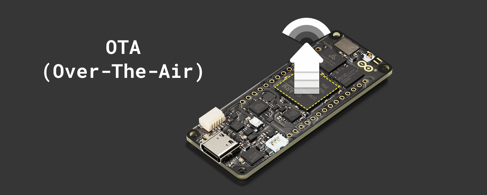

## Overview

In this tutorial, you will learn how to use and allow firmware updates via **OTA (Over-The-Air)** with the **Arduino Portenta H7**. With this tutorial, you will be able to create a binary file for use with the OTA (Over-The-Air) feature and either use the internal **QSPI** or an external **SD card** to complete the OTA process.



***To proceed with OTA using an SD Card, you will need to use a carrier or shield with an SD card slot, e.g., Portenta Breakout, Portenta Max Carrier, or Portenta Vision Shield.***

## Goals

The goals of this tutorial are:

- Create an OTA file required to use the OTA (Over-The-Air) feature
- Use QSPI or SD card storage to load the firmware downloaded using the OTA feature

## Hardware and Software Needed

- [Arduino Portenta H7](https://store.arduino.cc/portenta-h7)
- Operating System: Linux, macOS, or Windows (with Python® 3 installed)
- Arduino IDE 1.8.10+ or Arduino IDE 2.0+
- USB-C® cable (either USB-A to USB-C or USB-C to USB-C)
- [Arduino_Portenta_OTA library](https://github.com/arduino-libraries/Arduino_Portenta_OTA)
- SD card (optional, you can use QSPI instead)
- Carrier or shield compatible with the Portenta H7 with an SD card slot (if using SD card method)

## What OTA Means

**OTA** (Over-The-Air) is a method of distributing updates wirelessly to end devices to update their firmware, configuration, or security-related protocols.

The purpose of this method is to change a device's behavior or settings to improve performance, add new features, or change its intended use.

## Instructions 

We will explain the steps required to use the OTA (Over-The-Air) process. It will consist of creating and using the OTA firmware file and selecting the preferred storage mode (QSPI or SD card).

This tutorial focuses on the Arduino Portenta H7, but the OTA (Over-The-Air) functionality is also compatible with other boards including [Nicla Vision](https://docs.arduino.cc/hardware/nicla-vision/#tutorials), [Opta](https://docs.arduino.cc/hardware/opta/#tutorials), and [GIGA R1 WiFi](https://docs.arduino.cc/hardware/giga-r1-wifi/#tutorials). The [`Arduino_Portenta_OTA` library](https://github.com/arduino-libraries/Arduino_Portenta_OTA) automatically detects your board and applies the appropriate configuration.

### Firmware OTA File Creation

You will need to create the binary file required for the OTA (Over-The-Air) process, which can be used with either storage option stated previously. For this tutorial, you will have to use the following script to create the binary file. 

```cpp
/*
 This sketch can be used to generate an example binary that can be uploaded to Portenta via OTA.
 It needs to be used together with
  - 'OTA_Qspi_Flash.ino' if you want to use the Qspi Flash as storage system
 OR
  - 'SD_Qspi_Flash.ino' if you want to use the SD card as storage system

 Steps to test OTA on Portenta:
 1) Upload this sketch or any other sketch (this one lights up the RGB LED with different colours).
 2) In the IDE select: Sketch -> Export compiled Binary
 3) Upload the exported binary to a server
 4) Choose a storage mechanism (SD or QSPI), open the related OTA_*_Portenta.ino sketch,
    eventually update the OTA_FILE_LOCATION
 5) Upload the sketch OTA_*_Portenta.ino to perform OTA via SD or QSPI Flash
*/

void setLed(int blue, int green, int red) {
  digitalWrite(LEDB, blue);
  digitalWrite(LEDG, green);
  digitalWrite(LEDR, red);
}


void setup()
{
  pinMode(LEDB, OUTPUT);
  pinMode(LEDG, OUTPUT);
  pinMode(LEDR, OUTPUT);
}

void loop()
{ //led BLUE ON
  setLed(1, 0, 0);
  delay(1000);
  //led GREEN ON
  setLed(0, 1, 0);
  delay(1000);
  //led RED ON
  setLed(0, 0, 1);
  delay(1000);
}
```

This sketch will light up the RGB LED with three different colors in sequence. This code will need to be uploaded to the Arduino Portenta H7 first. It is to verify whether the sketch compiles and works correctly.

After verifying this, in the Arduino IDE, navigate to **Sketch > Export Compiled Binary** (or use the keyboard shortcut **Alt+Ctrl+S**).


***When exporting the binary, multiple files will be available. Use the file named `sketch_name.ino.bin` (Without the bootloader tag) for OTA updates. Do not use the file with `_bootloader` in its name, as the bootloader should be updated tethered using the [dedicated bootloader update procedure](https://docs.arduino.cc/tutorials/portenta-h7/updating-the-bootloader/).***

With the binary file ready, you can now create the OTA file required for Over-The-Air updates.

### Creating the OTA File

To create the OTA file, you will need a macOS, Linux, or Windows environment with Python® 3 installed.

***__Note:__ Windows users will need to compile the LZSS compression library before running the conversion tools (instructions provided below).***

Once you have a compatible environment, you will need the tools, which can be found at the following link:

***[Arduino IoT Cloud Library - Over-The-Air Tools](https://github.com/arduino-libraries/ArduinoIoTCloud/tree/master/extras/tools)***

You will need to download the library and extract it to a preferred location to use the tools. Then, you will need to run the following commands in sequence in your terminal to create the OTA file.

#### Using macOS and Linux

Copy the binary file into the library tool's folder:

```bash
# Exported binary format reference: sketch.bin
cp OTA_Usage_Portenta.ino.PORTENTA_H7_M7.bin ~/Arduino/libraries/ArduinoIoTCloud/extras/tools/
```

Navigate to the tools directory:

```bash
cd ~/Arduino/libraries/ArduinoIoTCloud/extras/tools
```

Encode your binary file into `OTA_Usage_Portenta.ino.PORTENTA_H7_M7.lzss` (LZSS format):

```bash
# Argument format: ./lzss.py --encode sketch.bin sketch.lzss
./lzss.py --encode OTA_Usage_Portenta.ino.PORTENTA_H7_M7.bin OTA_Usage_Portenta.ino.PORTENTA_H7_M7.lzss
```

Convert your encoded file into `.ota` format:

```bash
# Argument format: ./bin2ota.py PORTENTA_H7_M7 sketch.lzss sketch.ota
./bin2ota.py PORTENTA_H7_M7 OTA_Usage_Portenta.ino.PORTENTA_H7_M7.lzss OTA_Usage_Portenta.ino.PORTENTA_H7_M7.ota
```

You can use `OTA_Usage_Portenta.ino.PORTENTA_H7_M7` as the sketch name to make the file easier to identify. After this, you will have the `.ota` file for the sketch, which you can use with the OTA process.

### Installing Python® 3 On Linux

If you are using Linux and cannot run the **`bin2ota.py`** script, you may need to install [Python® 3](https://www.python.org/) and the necessary modules. To do this, run the following command on your **Linux terminal**:

```bash 
sudo apt install python-is-python3
```

You will also need to install the **`crccheck`** module for Python® by following these instructions:

Installing pip on Python®:

```bash
# Necessary to install python modules
sudo apt install python3-pip 
```

Installing the `crccheck` necessary module on Python®:

```bash
# Necessary to run the script
pip install crccheck
```

Once you have completed these steps, you should be able to run the `bin2ota.py` script successfully.

#### Using Windows

For Windows, the LZSS library needs to be compiled before using the conversion tools, as the provided library is compiled for Linux.

Download and install **MSYS2** from [https://www.msys2.org/](https://www.msys2.org/). After installation, open the **MSYS2 MINGW64** terminal and install the GCC compiler:

```bash
pacman -S mingw-w64-x86_64-gcc
```

Navigate to the tools directory within the **MSYS2 MINGW64** terminal:

```bash
cd "/c/path/to/ArduinoIoTCloud/extras/tools"
```

Replace the path with your actual location. For example:

```bash
cd "/d/Downloads/ArduinoIoTCloud-master/extras/tools"
```

Compile the LZSS library for Windows with the following command:

```bash
gcc -shared -o lzss.dll -fPIC lzss.c
```

It will create `lzss.dll` in the tools directory.

Open `lzss.py` in a text editor (e.g., Notepad) and locate *line 15*, which should look like this:

```python
lzss_functions = ctypes.CDLL(LZSS_SO_FILE)
```

Replace and update it with the following code:

```python
import os

...

# Try to load Windows DLL first, fall back to Linux .so
script_dir = os.path.dirname(os.path.abspath(__file__))
dll_path = os.path.join(script_dir, "lzss.dll")

if os.path.exists(dll_path):
 lzss_functions = ctypes.CDLL(dll_path)
else:
 lzss_functions = ctypes.CDLL(LZSS_SO_FILE)
```

Open **Command Prompt** or **PowerShell** and install the required Python® module:

```bash
pip install crccheck
```

In **Command Prompt** or **PowerShell**, navigate to the tools directory and run:

```bash
cd "C:\path\to\ArduinoIoTCloud\extras\tools"
```

Encode your binary file into `OTA_Usage_Portenta.ino.PORTENTA_H7_M7.lzss` (LZSS format):

```bash
python lzss.py --encode OTA_Usage_Portenta.ino.PORTENTA_H7_M7.bin OTA_Usage_Portenta.ino.PORTENTA_H7_M7.lzss
```

Convert your encoded file into `.ota` format:

```bash
python bin2ota.py PORTENTA_H7_M7 OTA_Usage_Portenta.ino.PORTENTA_H7_M7.lzss OTA_Usage_Portenta.ino.PORTENTA_H7_M7.ota
```

After completing these steps, you will have the `.ota` file ready for use with the OTA process.

### Uploading OTA File to the Internet

Now you can upload your `.ota` file to an online reachable location. For example, `OTA_Usage_Portenta.ino.PORTENTA_H7_M7.ota` has been uploaded to: 

https://downloads.arduino.cc/ota/OTA_Usage_Portenta.ino.PORTENTA_H7_M7.ota

You can change the default file location in the code by modifying the following line in the **"OTA_Qspi_Flash"** sketch or in the **"OTA_SD_Portenta"** sketch, depending on which method you are going to follow:

```cpp
static char const OTA_FILE_LOCATION[] = "https://your-url-here/your-ota-file.ota";
```

***The latest library examples use HTTPS by default. Make sure your OTA file is hosted on an HTTPS server, or change the `is_https` parameter in the download function to `false` if using HTTP.***

For QSPI Flash example (line 97):

```cpp
int const ota_download = ota.download(OTA_FILE_LOCATION, true /* is_https */);
```

For SD Card example (line 88):

```cpp
int const ota_download = ota.download(OTA_FILE_LOCATION, false /* is_https */);
```

If you are going to use the example OTA file provided in this tutorial, you don't need to change the file location.

With your OTA file uploaded and the file location configured, you have two storage options: [QSPI](#qspi-storage-mode) or [SD Card](#sd-card-storage-mode).

### QSPI Storage Mode

#### Setting Up

To use the internal **QSPI** storage for downloading the binary file via OTA (Over-The-Air), you will only need the Arduino Portenta H7 board connected to the computer with the [Arduino IDE](https://www.arduino.cc/en/software).

Before uploading the OTA sketch, configure the following settings in the Arduino IDE via the **Tools** menu:

- **Board**: Select `Arduino Portenta H7`
- **Flash split**: Select `1MB M7 + 1MB M4`
- **Target core**: Select `Main Core` (M7 core)
- **Port**: Select the appropriate COM port for your Portenta H7


#### Running the Script

To proceed with OTA using the QSPI flash, you can open the sketch from **Examples > Arduino_Portenta_OTA > OTA_Qspi_Flash**.

***Do not forget to fill in your Wi-Fi® AP SSID and password in the `arduino_secrets.h` tab.***

```cpp
/*
 * This example demonstrates how to update the firmware of the Arduino Portenta H7 using
 * a firmware image stored on the QSPI.
 *
 * Steps:
 *   1) Create a sketch for the Portenta H7 and verify
 *      that it both compiles and works on the board.
 *   2) In the IDE select: Sketch -> Export compiled Binary.
 *   3) Create an OTA update file using the tools 'lzss.py' and 'bin2ota.py' stored in
 *      https://github.com/arduino-libraries/ArduinoIoTCloud/tree/master/extras/tools .
 *      A) ./lzss.py --encode SKETCH.bin SKETCH.lzss
 *      B) ./bin2ota.py PORTENTA_H7_M7 SKETCH.lzss SKETCH.ota
 *   4) Upload the OTA file to a network-reachable location, e.g., OTA_Usage_Portenta.ino.PORTENTA_H7_M7.ota
 *      has been uploaded to: https://downloads.arduino.cc/ota/OTA_Usage_Portenta.ino.PORTENTA_H7_M7.ota
 *   5) Perform an OTA update via the steps outlined below.
 */

/******************************************************************************
 * INCLUDE
 ******************************************************************************/

#include <Arduino_Portenta_OTA.h>

#include <WiFi.h>

#include "arduino_secrets.h"

/******************************************************************************
 * CONSTANT
 ******************************************************************************/

/* Please enter your sensitive data in the Secret tab/arduino_secrets.h */
static char const SSID[] = SECRET_SSID;  /* your network SSID (name) */
static char const PASS[] = SECRET_PASS;  /* your network password (use for WPA, or use as key for WEP) */

#if defined(ARDUINO_NICLA_VISION)
static char const OTA_FILE_LOCATION[] = "https://downloads.arduino.cc/ota/OTA_Usage_Portenta.ino.NICLA_VISION.ota";
#elif defined(ARDUINO_PORTENTA_H7_M7)
static char const OTA_FILE_LOCATION[] = "https://downloads.arduino.cc/ota/OTA_Usage_Portenta.ino.PORTENTA_H7_M7.ota";
#elif defined(ARDUINO_OPTA)
static char const OTA_FILE_LOCATION[] = "https://downloads.arduino.cc/ota/OTA_Usage_Portenta.ino.OPTA.ota";
#elif defined(ARDUINO_GIGA)
static char const OTA_FILE_LOCATION[] = "https://downloads.arduino.cc/ota/OTA_Usage_Portenta.ino.GIGA.ota";
#else
#error "Board not supported"
#endif

/******************************************************************************
 * SETUP/LOOP
 ******************************************************************************/

void setup()
{
  Serial.begin(115200);
  while (!Serial) {}

  if (WiFi.status() == WL_NO_SHIELD)
  {
    Serial.println("Communication with WiFi module failed!");
    return;
  }

  int status = WL_IDLE_STATUS;
  while (status != WL_CONNECTED)
  {
    Serial.print  ("Attempting to connect to '");
    Serial.print  (SSID);
    Serial.println("'");
    status = WiFi.begin(SSID, PASS);
    delay(10000);
  }
  Serial.print  ("You're connected to '");
  Serial.print  (WiFi.SSID());
  Serial.println("'");

  Arduino_Portenta_OTA_QSPI ota(QSPI_FLASH_FATFS_MBR, 2);
  Arduino_Portenta_OTA::Error ota_err = Arduino_Portenta_OTA::Error::None;

  if (!ota.isOtaCapable())
  {
    Serial.println("Higher version bootloader required to perform OTA.");
    Serial.println("Please update the bootloader.");
    Serial.println("File -> Examples -> Portenta_System -> PortentaH7_updateBootloader");
    return;
  }

  Serial.println("Initializing OTA storage");
  if ((ota_err = ota.begin()) != Arduino_Portenta_OTA::Error::None)
  {
    Serial.print  ("Arduino_Portenta_OTA::begin() failed with error code ");
    Serial.println((int)ota_err);
    return;
  }


  Serial.println("Starting download to QSPI ...");
  int const ota_download = ota.download(OTA_FILE_LOCATION, true /* is_https */);
  if (ota_download <= 0)
  {
    Serial.print  ("Arduino_Portenta_OTA_QSPI::download failed with error code ");
    Serial.println(ota_download);
    return;
  }
  Serial.print  (ota_download);
  Serial.println(" bytes stored.");


  Serial.println("Decompressing LZSS compressed file ...");
  int const ota_decompress = ota.decompress();
  if (ota_decompress < 0)
  {
    Serial.print("Arduino_Portenta_OTA_QSPI::decompress() failed with error code");
    Serial.println(ota_decompress);
    return;
  }
  Serial.print(ota_decompress);
  Serial.println(" bytes decompressed.");


  Serial.println("Storing parameters for firmware update in bootloader accessible non-volatile memory ...");
  if ((ota_err = ota.update()) != Arduino_Portenta_OTA::Error::None)
  {
    Serial.print  ("ota.update() failed with error code ");
    Serial.println((int)ota_err);
    return;
  }

  Serial.println("Performing a reset after which the bootloader will update the firmware.");
  Serial.println("Hint: Portenta H7 LED will blink Red-Blue-Green.");
  delay(1000); /* Make sure the serial message gets out before the reset. */
  ota.reset();
}

void loop()
{

}
```

This sketch will connect to your Wi-Fi®, verify whether the OTA feature is available by checking the installed firmware on your Portenta.

Then, prepare the OTA storage, download the .ota file from the internet, decompress it, and reset the board so that the new firmware is applied after the reboot.

### SD Card Storage Mode

#### Setting Up

To use the **SD card** as the preferred OTA (Over-The-Air) storage device, you can use the Arduino Portenta Vision Shield and Portenta H7 connected via **HD (High-Density)** Connectors.  


Before uploading the OTA sketch, configure the following settings in the Arduino IDE via the **Tools** menu:

- **Board**: Select `Arduino Portenta H7`
- **Flash split**: Select `1MB M7 + 1MB M4`
- **Target core**: Select `Main Core` (M7 core)
- **Port**: Select the appropriate COM port for your Portenta H7

#### Running the Script

As with the QSPI storage mode, to proceed with OTA using the SD Card, open the sketch from **Examples > Arduino_Portenta_OTA > OTA_SD_Portenta**.

***Do not forget to fill in your Wi-Fi® AP SSID and password in the `arduino_secrets.h` tab.***

```cpp
/*
 * This example demonstrates how to update the firmware of the Arduino Portenta H7 using
 * a firmware image stored on the SD card.
 *
 * Steps:
 *   1) Create a sketch for the Portenta H7 and verify
 *      that it both compiles and works on the board.
 *   2) In the IDE select: Sketch -> Export compiled Binary.
 *   3) Create an OTA update file using the tools 'lzss.py' and 'bin2ota.py' stored in
 *      https://github.com/arduino-libraries/ArduinoIoTCloud/tree/master/extras/tools .
 *      A) ./lzss.py --encode SKETCH.bin SKETCH.lzss
 *      B) ./bin2ota.py PORTENTA_H7_M7 SKETCH.lzss SKETCH.ota
 *   4) Upload the OTA file to a network-reachable location, e.g., OTA_Usage_Portenta.ino.PORTENTA_H7_M7.ota
 *      has been uploaded to: http://downloads.arduino.cc/ota/OTA_Usage_Portenta.ino.PORTENTA_H7_M7.ota
 *   5) Perform an OTA update via the steps outlined below.
 */

/******************************************************************************
 * INCLUDE
 ******************************************************************************/

#include <Arduino_Portenta_OTA.h>

#include <WiFi.h>

#include "arduino_secrets.h"

/******************************************************************************
 * CONSTANT
 ******************************************************************************/

/* Please enter your sensitive data in the Secret tab/arduino_secrets.h */
static char const SSID[] = SECRET_SSID;  /* your network SSID (name) */
static char const PASS[] = SECRET_PASS;  /* your network password (use for WPA, or use as key for WEP) */

static char const OTA_FILE_LOCATION[] = "http://downloads.arduino.cc/ota/OTA_Usage_Portenta.ino.PORTENTA_H7_M7.ota";

/******************************************************************************
 * SETUP/LOOP
 ******************************************************************************/

void setup()
{
  Serial.begin(115200);
  while (!Serial) {}

  if (WiFi.status() == WL_NO_SHIELD)
  {
    Serial.println("Communication with WiFi module failed!");
    return;
  }

  int status = WL_IDLE_STATUS;
  while (status != WL_CONNECTED)
  {
    Serial.print  ("Attempting to connect to '");
    Serial.print  (SSID);
    Serial.println("'");
    status = WiFi.begin(SSID, PASS);
    delay(10000);
  }
  Serial.print  ("You're connected to '");
  Serial.print  (WiFi.SSID());
  Serial.println("'");

  //Arduino_Portenta_OTA_SD ota(SD_FATFS, 0);
  Arduino_Portenta_OTA_SD ota(SD_FATFS_MBR, 1);
  Arduino_Portenta_OTA::Error ota_err = Arduino_Portenta_OTA::Error::None;

  if (!ota.isOtaCapable())
  {
    Serial.println("Higher version bootloader required to perform OTA.");
    Serial.println("Please update the bootloader.");
    Serial.println("File -> Examples -> Portenta_System -> PortentaH7_updateBootloader");
    return;
  }

  Serial.println("Initializing OTA storage");
  if ((ota_err = ota.begin()) != Arduino_Portenta_OTA::Error::None)
  {
    Serial.print  ("Arduino_Portenta_OTA::begin() failed with error code ");
    Serial.println((int)ota_err);
    return;
  }


  Serial.println("Starting download to SD ...");
  int const ota_download = ota.download(OTA_FILE_LOCATION, false /* is_https */);
  if (ota_download <= 0)
  {
    Serial.print  ("Arduino_Portenta_OTA_SD::download failed with error code ");
    Serial.println(ota_download);
    return;
  }
  Serial.print  (ota_download);
  Serial.println(" bytes stored.");


  Serial.println("Decompressing LZSS compressed file ...");
  int const ota_decompress = ota.decompress();
  if (ota_decompress < 0)
  {
    Serial.print("Arduino_Portenta_OTA_SD::decompress() failed with error code");
    Serial.println(ota_decompress);
    return;
  }
  Serial.print(ota_decompress);
  Serial.println(" bytes decompressed.");


  Serial.println("Storing parameters for firmware update in bootloader accessible non-volatile memory");
  if ((ota_err = ota.update()) != Arduino_Portenta_OTA::Error::None)
  {
    Serial.print  ("Arduino_Portenta_OTA::update() failed with error code ");
    Serial.println((int)ota_err);
    return;
  }

  Serial.println("Performing a reset after which the bootloader will update the firmware.");
  Serial.println("Hint: Portenta H7 LED will blink Red-Blue-Green.");
  delay(1000);
  ota.reset();
}

void loop()
{

}
```

This sketch will connect to your Wi-Fi®, verify whether the OTA feature is available by checking the installed firmware on your Portenta.

Then, prepare the OTA storage, download the .ota file from the internet, decompress it, and reset the board so that the new firmware is applied after the reboot.

## Testing the Code

After successfully uploading the code and completing the OTA process, you will see the Arduino Portenta H7 LED blink Red, Blue, and Green in a cyclic pattern. You can also view the process log in the Serial Monitor provided by the Arduino IDE for more details.


## Understanding LZSS Compression and Decompression

For those interested in the compression mechanism or optimizing download performance, you can explore different decompression methods.

The standard OTA examples use a two-step process:

1. Download the compressed `.ota` file to storage
2. Decompress the file before firmware update

The `Arduino_Portenta_OTA` library also supports **on-the-fly decompression**, where the file is decompressed as it's being downloaded, which can be preferable for certain use cases.

The [`OTA_Qspi_Flash`](#qspi-storage-mode) and [`OTA_SD_Portenta`](#sd-card-storage-mode) examples show this approach, which is recommended for its simplicity and easier debugging.

For a more simplified approach, the library provides a built-in `downloadAndDecompress()` function. You can open this example from the Arduino IDE by going to **File > Examples > Arduino_Portenta_OTA > OTA_Qspi_Flash_download_onthefly**.

```cpp
/*
 * This example demonstrates how to use to update the firmware of the Arduino Portenta H7 using
 * a firmware image stored on the QSPI.
 *
 * Steps:
 *   1) Create a sketch for the Portenta H7 and verify
 *      that it both compiles and works on a board.
 *   2) In the IDE select: Sketch -> Export compiled Binary.
 *   3) Create an OTA update file utilising the tools 'lzss.py' and 'bin2ota.py' stored in
 *      https://github.com/arduino-libraries/ArduinoIoTCloud/tree/master/extras/tools .
 *      A) ./lzss.py --encode SKETCH.bin SKETCH.lzss
 *      B) ./bin2ota.py PORTENTA_H7_M7 SKETCH.lzss SKETCH.ota
 *   4) Upload the OTA file to a network reachable location, e.g. OTA_Usage_Portenta.ino.PORTENTA_H7_M7.ota
 *      has been uploaded to: http://downloads.arduino.cc/ota/OTA_Usage_Portenta.ino.PORTENTA_H7_M7.ota
 *   5) Perform an OTA update via steps outlined below.
 */

/******************************************************************************
 * INCLUDE
 ******************************************************************************/

#include <Arduino_Portenta_OTA.h>

#include <WiFi.h>

#include "arduino_secrets.h" 

/******************************************************************************
 * CONSTANT
 ******************************************************************************/

/* Please enter your sensitive data in the Secret tab/arduino_secrets.h */
static char const SSID[] = SECRET_SSID;  /* your network SSID (name) */
static char const PASS[] = SECRET_PASS;  /* your network password (use for WPA, or use as key for WEP) */

#if defined(ARDUINO_NICLA_VISION)
static char const OTA_FILE_LOCATION[] = "https://downloads.arduino.cc/ota/OTA_Usage_Portenta.ino.NICLA_VISION.ota";
#elif defined(ARDUINO_PORTENTA_H7_M7)
static char const OTA_FILE_LOCATION[] = "https://downloads.arduino.cc/ota/OTA_Usage_Portenta.ino.PORTENTA_H7_M7.ota";
#elif defined(ARDUINO_OPTA)
static char const OTA_FILE_LOCATION[] = "https://downloads.arduino.cc/ota/OTA_Usage_Portenta.ino.OPTA.ota";
#elif defined(ARDUINO_GIGA)
static char const OTA_FILE_LOCATION[] = "https://downloads.arduino.cc/ota/OTA_Usage_Portenta.ino.GIGA.ota";
#else
#error "Board not supported"
#endif

/******************************************************************************
 * SETUP/LOOP
 ******************************************************************************/

void setup()
{
  Serial.begin(115200);
  while (!Serial) {}

  if (WiFi.status() == WL_NO_SHIELD)
  {
    Serial.println("Communication with WiFi module failed!");
    return;
  }

  int status = WL_IDLE_STATUS;
  while (status != WL_CONNECTED)
  {
    Serial.print  ("Attempting to connect to '");
    Serial.print  (SSID);
    Serial.println("'");
    status = WiFi.begin(SSID, PASS);
    if(status != WL_CONNECTED) {
      delay(10000);
    }
  }
  Serial.print  ("You're connected to '");
  Serial.print  (WiFi.SSID());
  Serial.println("'");

  Arduino_Portenta_OTA_QSPI ota(QSPI_FLASH_FATFS_MBR, 2);
  Arduino_Portenta_OTA::Error ota_err = Arduino_Portenta_OTA::Error::None;

  if (!ota.isOtaCapable())
  {
    Serial.println("Higher version bootloader required to perform OTA.");
    Serial.println("Please update the bootloader.");
    Serial.println("File -> Examples -> Portenta_System -> PortentaH7_updateBootloader");
    return;
  }

  Serial.println("Initializing OTA storage");
  if ((ota_err = ota.begin()) != Arduino_Portenta_OTA::Error::None)
  {
    Serial.print  ("Arduino_Portenta_OTA::begin() failed with error code ");
    Serial.println((int)ota_err);
    return;
  }

  uint32_t start = millis();
  float elapsed, speed;

  Serial.println("Starting download to QSPI ...");
  int const ota_download = ota.downloadAndDecompress(OTA_FILE_LOCATION, true /* is_https */);
  if (ota_download <= 0)
  {
    Serial.print  ("Arduino_Portenta_OTA_QSPI::download failed with error code ");
    Serial.println(ota_download);
    return;
  }
  Serial.print  (ota_download);
  Serial.println(" bytes stored.");

  elapsed = (millis()-start)/1000.0; // elapsed expressed in seconds
  speed = (ota_download/elapsed)/1024;

  Serial.print("download elapsed ");
  Serial.print(elapsed);
  Serial.print("s speed: ");
  Serial.print(speed);
  Serial.println("KBps");

  Serial.println("Storing parameters for firmware update in bootloader accessible non-volatile memory ...");
  if ((ota_err = ota.update()) != Arduino_Portenta_OTA::Error::None)
  {
    Serial.print  ("ota.update() failed with error code ");
    Serial.println((int)ota_err);
    return;
  }

  Serial.println("Performing a reset after which the bootloader will update the firmware.");
  Serial.println("Hint: Portenta H7 LED will blink Red-Blue-Green.");
  delay(1000); /* Make sure the serial message gets out before the reset. */
  ota.reset();
}

void loop()
{

}
```

This example uses the `downloadAndDecompress()` function, which puts downloading and decompression in a single operation. This method is more memory-efficient than the standard two-step process and easier to implement than the LZSS example.

If you need complete control over the decompression process or want to implement custom workflows, you can work directly with the LZSS compression functions. You can open this example from the Arduino IDE by going to **File > Examples > Arduino_Portenta_OTA > LZSS**.

The following example shows both the standard two-step method and on-the-fly decompression at a low level, providing performance measurements for comparison:

```cpp
/*
 * This example demonstrates how to download a lzss file and decompress it in two ways:
 * -1 download the file on the filesystem and then decompress the downloaded file on the filesystem
 * -2 download and decompress the file on the fly
 * this sketch also provides a comparison in terms of speed and execution time
 *
 */

/******************************************************************************
 * INCLUDE
 ******************************************************************************/

#include <Arduino_Portenta_OTA.h>

#include <WiFi.h>

#include "arduino_secrets.h"
#include <decompress/lzss.h>

/******************************************************************************
 * CONSTANT
 ******************************************************************************/

/* Please enter your sensitive data in the Secret tab/arduino_secrets.h */
static char const SSID[] = SECRET_SSID;  /* your network SSID (name) */
static char const PASS[] = SECRET_PASS;  /* your network password (use for WPA, or use as key for WEP) */


#if defined(ARDUINO_NICLA_VISION)
static char const URL_FILE[] = "https://downloads.arduino.cc/ota/OTA_Usage_Portenta.ino.NICLA_VISION.ota";
#elif defined(ARDUINO_PORTENTA_H7_M7)
static char const URL_FILE[] = "https://downloads.arduino.cc/ota/OTA_Usage_Portenta.ino.PORTENTA_H7_M7.ota";
#elif defined(ARDUINO_OPTA)
static char const URL_FILE[] = "https://downloads.arduino.cc/ota/OTA_Usage_Portenta.ino.OPTA.ota";
#elif defined(ARDUINO_GIGA)
static char const URL_FILE[] = "https://downloads.arduino.cc/ota/OTA_Usage_Portenta.ino.GIGA.ota";
#else
#error "Board not supported"
#endif

static char const DOWNLOAD_DESTINATION[] =      "/fs/UPDATE.BIN.LZSS";
static char const DECOMPRESSED_DESTINATION[] =  "/fs/UPDATE.BIN";

LZSSDecoder *decoder = nullptr;
FILE* download_target = nullptr;

/******************************************************************************
 * SETUP/LOOP
 ******************************************************************************/
void decompress_on_the_fly_cbk(const char*, uint32_t);
void putc_file(const uint8_t c);

void setup() {
  Serial.begin(115200);
  while (!Serial) {}

  if (WiFi.status() == WL_NO_SHIELD)
  {
      Serial.println("Communication with WiFi module failed!");
      return;
  }

  int status = WL_IDLE_STATUS;
  while (status != WL_CONNECTED)
  {
      Serial.print  ("Attempting to connect to '");
      Serial.print  (SSID);
      Serial.println("'");
      status = WiFi.begin(SSID, PASS);
      if(status != WL_CONNECTED) {
          delay(10000);
      }
  }
  Serial.print  ("You're connected to '");
  Serial.print  (WiFi.SSID());
  Serial.println("'");

  // Init fs
  mbed::BlockDevice * _bd_raw_qspi = mbed::BlockDevice::get_default_instance();;
  auto _bd_qspi = new mbed::MBRBlockDevice(_bd_raw_qspi, 2);
  auto _fs_qspi = new mbed::FATFileSystem("fs");
  int const err_mount = _fs_qspi->mount(_bd_qspi);
  if (err_mount) {
      Serial.print("Error while mounting the filesystem. Err = ");
      Serial.println(err_mount);
      return;
  }

  MbedSocketClass * socket = static_cast<MbedSocketClass*>(&WiFi);
  remove(DOWNLOAD_DESTINATION);
  remove(DECOMPRESSED_DESTINATION);

  uint32_t start;
  int bytes;
  float elapsed, speed;
  start = millis();
  Serial.println("Starting download to QSPI ...");
  bytes = socket->download(URL_FILE, DOWNLOAD_DESTINATION, true /* is_https */);
  if (bytes <= 0)
  {
      Serial.print  ("MbedSocketClass::download failed with error code ");
      Serial.println(bytes);
      return;
  }
  Serial.print  (bytes);
  Serial.println(" bytes stored.");

  elapsed = (millis()-start)/1000.0; // elapsed expressed in seconds
  speed = (bytes/elapsed)/1024;

  Serial.print("download elapsed ");
  Serial.print(elapsed);
  Serial.print("s speed: ");
  Serial.print(speed);
  Serial.println("KBps");

  FILE* downloaded_file = fopen(DOWNLOAD_DESTINATION, "rb");
  FILE* decompressed_file = fopen(DECOMPRESSED_DESTINATION, "wb");

  start = millis();
  lzss_init(downloaded_file, decompressed_file, bytes, nullptr);

  lzss_decode();
  /* Write the data remaining in the write buffer to
  * the file.
  */
  lzss_flush();

  elapsed = (millis()-start)/1000.0; // elapsed expressed in seconds

  Serial.print("decompress elapsed ");
  Serial.print(elapsed);
  Serial.print("s");
  Serial.print(" size ");
  Serial.println(ftell(decompressed_file));

  fclose(downloaded_file);
  fclose(decompressed_file);

  // On the fly decompression
  remove(DOWNLOAD_DESTINATION);
  remove(DECOMPRESSED_DESTINATION);

  download_target = fopen(DECOMPRESSED_DESTINATION, "wb");
  decoder = new LZSSDecoder(putc_file);

  Serial.println("Starting download & decompress on the fly");
  start = millis();
  bytes = socket->download(URL_FILE, true /* is_https */, decompress_on_the_fly_cbk);
  if (bytes <= 0)
  {
      Serial.print  ("MbedSocketClass::download failed with error code ");
      Serial.println(bytes);
      return;
  }

  Serial.print("downloaded ");
  Serial.print(bytes);
  Serial.print(" bytes ");

  elapsed = (millis()-start)/1000.0; // elapsed expressed in seconds
  speed = (bytes/elapsed)/1024;

  Serial.print  (ftell(download_target));
  Serial.println(" bytes stored.");

  Serial.print("download elapsed ");
  Serial.print(elapsed);
  Serial.print("s speed: ");
  Serial.print(speed);
  Serial.println("KBps");

  delete decoder;
  fclose(download_target);
}

void loop() {
}

void decompress_on_the_fly_cbk(const char* buffer, uint32_t size) {
    decoder->decompress((uint8_t*)buffer, size);
}

void putc_file(const uint8_t c) {
    fwrite(&c, 1, 1, download_target);
}
```

### Understanding OTA Methods

The standard two-step method, as shown in the [`OTA_Qspi_Flash`](#qspi-storage-mode) and [`OTA_SD_Portenta`](#sd-card-storage-mode) examples, separates downloading and decompression into distinct operations, making it easier to understand and troubleshoot. This approach works well for learning and development. However, this method requires storage space for both the compressed and decompressed files, which may be a consideration for storage-constrained applications.

On-the-Fly with `downloadAndDecompress()` method combines downloading and decompression into a single operation, reducing storage requirements. It provides a practical balance between efficiency and ease of use, making it suitable for production deployments with limited storage space.

The LZSS example provides direct access to the compression functions, enabling custom implementations and detailed performance analysis. It requires more complex error handling and a thorough understanding of the compression process.

For typical use cases, the standard two-step method provides the best starting point. Consider the `downloadAndDecompress()` function when storage management is important. Use the low-level LZSS approach only when you need custom behavior or detailed performance measurements.

## Conclusion

In this tutorial, you learned how to set up and perform Over-The-Air (OTA) firmware updates on the Arduino Portenta H7 and compatible boards. You explored how to create OTA files from compiled binaries, configure both QSPI and SD card storage options, and deploy wireless firmware updates. Additionally, you learned about LZSS compression methods and their performance characteristics.

With the `Arduino_Portenta_OTA` library, you can remotely update your devices without physical access, choose between storage methods based on your hardware configuration, and select the decompression approach that best fits your performance requirements. This makes OTA updates an important capability for maintaining deployed IoT systems, prototyping advanced applications, and building production-ready solutions that can be updated over the network.

### Next Steps

Now, with the OTA capability in place, you can design a future-proof system based on Arduino Portenta H7 or try different system applications using the OTA capability.

## Troubleshooting

For troubleshooting issues that might have arisen while following the tutorial, you can use the following tips to solve the issue.

- If there has been an issue with the Wi-Fi® module, it means the device may have lost the Wi-Fi® firmware partition. To solve this, you will have to use the **WiFiFirmwareUpdater** sketch found in the Arduino IDE examples to fix the issue.
- QSPI storage may throw error -3 while running the Portenta H7 OTA QSPI example. To fix this, you can use the guide on [Reading and Writing Flash Memory](https://docs.arduino.cc/tutorials/portenta-h7/reading-writing-flash-memory) in the section **Programming the QSPI Flash**. At this point, run the example again, and the error -3 (OTA Storage initialization error) should be resolved.
