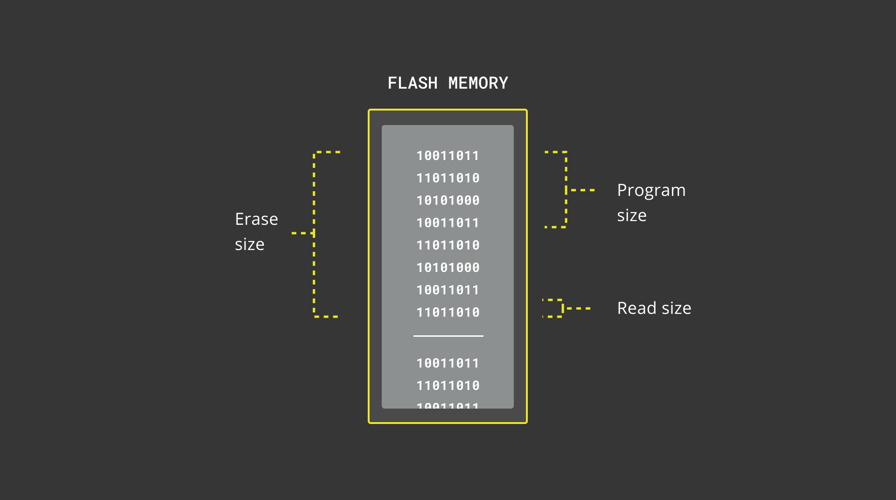

## Overview 
This tutorial demonstrates how to use the on-board Flash memory of the Portenta H7 to read and write data using the BlockDevice API provided by Mbed OS. As the internal memory is limited in size, we will also take a look at saving data to the QSPI Flash memory.

## Goals

- Accessing the Portenta's internal Flash memory using Mbed's Flash In-Application Programming Interface 
- Accessing the Portenta's QSPI Flash memory using Mbed's Flash In-Application Programming Interface 
- Reading the memory's characteristics

### Required Hardware and Software

- [Portenta H7 (ABX00042)](https://store.arduino.cc/portenta-h7) or [Portenta H7 Lite Connected (ABX00046)](https://store.arduino.cc/products/portenta-h7-lite-connected)
- USB-C® cable (either USB-A to USB-C® or USB-C® to USB-C®)
- Arduino IDE 1.8.10+ or Arduino Pro IDE 0.0.4+ or Arduino CLI 0.13.0+

## Mbed OS APIs for Flash Storage
Portenta's core is based on the Mbed operating system, allowing for Arduino APIs to be integrated using APIs exposed directly by Mbed OS. 

Mbed OS has a rich API for managing storage on different mediums, ranging from the small internal Flash memory of a microcontroller to external SecureDigital cards with large data storage space.

In this tutorial, you are going to save a value persistently inside the Flash memory. That allows to access that value even after rebooting the board. You will retrieve some information from a Flash block by using the [FlashIAPBlockDevice](https://os.mbed.com/docs/mbed-os/v6.9/apis/flashiapblockdevice.html) API and create a block device object within the available space of the memory. In case of the internal memory, it corresponds to the space which is left after uploading a sketch to the board.

***Be aware of the Flash r/w limits: Flash memories have a limited amount of read/write cycles. Typical Flash memories can perform about 10000 writes cycles to the same block before starting to "wear out" and begin to lose the ability to retain data. You can render your board useless with improper use of this example and described APIs.***

## Block Device Blocks

Blocks of Flash memory can be accessed through the block device APIs. They are byte addressable but operate in units of blocks. There are three types of blocks for the different block device operations: read blocks, erase blocks and program blocks. The recommended procedure for programming data is to first erase a block and then programming it in units of the program block size. The sizes of the erase, program and read blocks may not be the same, but they must be multiples of each another. Keep in mind that the state of an erased block is undefined until you program it with data.



## Programming the Internal Flash

### 1. Create the Structure of the Program
Before we start it's important to keep the above mentioned **Flash r/w limits** in mind! Therefore this method should only be used for **once-in-a-while** read and write **operations**, such as reading a user setting in the `setup()`. It is not a good idea to use it for constantly updated values such as sensor data.

Having this in mind, it is time to create a sketch to program the Portenta. After creating new sketch and giving it a fitting name (in this case `FlashStorage.ino`), you need to create one more file to be used by the sketch, called `FlashIAPLimits.h`, that you will use to define some helper functions. This allows you to reuse the helper file later for other sketches.

### 2. The Helper Functions
Within the `FlashIAPLimits.h` file, you can start by including necessary libraries and defining the namespace. 

```cpp
// Ensures that this file is only included once
#pragma once 

#include <Arduino.h>
#include <FlashIAP.h>
#include <FlashIAPBlockDevice.h>

using namespace mbed;
```

After that, you can create a struct which will later be used to save the storage's properties.

```cpp
// An helper struct for FlashIAP limits
struct FlashIAPLimits {
  size_t flash_size;
  uint32_t start_address;
  uint32_t available_size;
};
```

The last part of the helper file consists of the `getFlashIAPLimits()` function used to calculate both the size of the Flash memory as well as the size and start address of the available memory.

This is done with Mbed's [FlashIAP](https://os.mbed.com/docs/mbed-os/v6.6/mbed-os-api-doxy/classmbed_1_1_flash_i_a_p.html) API. It finds the address of the first sector after the sketch stored in the microcontroller's ROM: `FLASHIAP_APP_ROM_END_ADDR` and uses the FlashIAP to calculate the Flash memory's size with `flash.get_flash_size()`. The other parameters can be determined using the same API.

```cpp
// Get the actual start address and available size for the FlashIAP Block Device
// considering the space already occupied by the sketch (firmware).
FlashIAPLimits getFlashIAPLimits()
{
  // Alignment lambdas
  auto align_down = [](uint64_t val, uint64_t size) {
    return (((val) / size)) * size;
  };
  auto align_up = [](uint32_t val, uint32_t size) {
    return (((val - 1) / size) + 1) * size;
  };

  size_t flash_size;
  uint32_t flash_start_address;
  uint32_t start_address;
  FlashIAP flash;

  auto result = flash.init();
  if (result != 0)
    return { };

  // Find the start of first sector after text area
  int sector_size = flash.get_sector_size(FLASHIAP_APP_ROM_END_ADDR);
  start_address = align_up(FLASHIAP_APP_ROM_END_ADDR, sector_size);
  flash_start_address = flash.get_flash_start();
  flash_size = flash.get_flash_size();

  result = flash.deinit();

  int available_size = flash_start_address + flash_size - start_address;
  if (available_size % (sector_size * 2)) {
    available_size = align_down(available_size, sector_size * 2);
  }

  return { flash_size, start_address, available_size };
}
```

### 3. Reading & Writing Data
Going back to the `FlashStorage.ino` file, some more files need to be included in order to implement reading and writing to the Flash. The `FlashIAPBlockDevice.h` API will be used to create a block device in the empty part of the memory. Additionally, you can include the helper file `FlashIAPLimits.h` to have access to the address and size calculation function that you just created. You can also reference the `mbed` namespace for better readability.

```cpp
#include <FlashIAPBlockDevice.h>
#include "FlashIAPLimits.h"

using namespace mbed;
```

The `setup()` function will first wait until a serial connection is established and then feed the random number generator, which is used later in this tutorial to write a random number in the Flash memory every time the device boots up.

```cpp
void setup() {
  Serial.begin(115200);
  while (!Serial);

  Serial.println("FlashIAPBlockDevice Test");
  Serial.println("------------------------");  

  // Feed the random number generator for later content generation
  randomSeed(analogRead(0));
```

Next the helper function, defined in the `FlashIAPLimits.h` file is called to calculate the memory properties, which are then used to create a block device using the `FlashIAPBlockDevice.h` library.

```cpp
// Get limits of the the internal flash of the microcontroller
auto [flashSize, startAddress, iapSize] = getFlashIAPLimits();

Serial.print("Flash Size: ");
Serial.print(flashSize / 1024.0 / 1024.0);
Serial.println(" MB");
Serial.print("FlashIAP Start Address: 0x");
Serial.println(startAddress, HEX);
Serial.print("FlashIAP Size: ");
Serial.print(iapSize / 1024.0 / 1024.0);
Serial.println(" MB");

// Create a block device on the available space of the flash
FlashIAPBlockDevice blockDevice(startAddress, iapSize);
```

Before using the block device, the first step is to initialize it using `blockDevice.init()`. Once initialized, it can provide the sizes of the blocks for programming the Flash. In terms of reading and writing Flash memory blocks, there is a distinction between the size of a readable block in bytes, a programmable block, which size is always a multiple of the read size, and an erasable block, which is always a multiple of a programmable block.

When reading and writing directly from and to the Flash memory, you need to always allocate a buffer with a multiple of the program block size. The amount of required program blocks can be determined by dividing the data size by the program block size. The final buffer size is equal to the amount of program blocks multiplied by the program block size.

```cpp
// Initialize the Flash IAP block device and print the memory layout
blockDevice.init();

const auto eraseBlockSize = blockDevice.get_erase_size();
const auto programBlockSize = blockDevice.get_program_size();

Serial.println("Block device size: " + String((unsigned int) blockDevice.size() / 1024.0 / 1024.0) + " MB");
Serial.println("Readable block size: " + String((unsigned int) blockDevice.get_read_size())  + " bytes");
Serial.println("Programmable block size: " + String((unsigned int) programBlockSize) + " bytes");
Serial.println("Erasable block size: " + String((unsigned int) eraseBlockSize / 1024) + " KB");
    
String newMessage = "Random number: " + String(random(1024));

// Calculate the amount of bytes needed to store the message
// This has to be a multiple of the program block size
const auto messageSize = newMessage.length() + 1; // C String takes 1 byte for NULL termination
const unsigned int requiredEraseBlocks = ceil(messageSize / (float)  eraseBlockSize);
const unsigned int requiredProgramBlocks = ceil(messageSize / (float)  programBlockSize);
const auto dataSize = requiredProgramBlocks * programBlockSize;  
char buffer[dataSize] {};
```

In the last part of the `setup()` function you can now use the block device to read and write data. First the buffer is used to read what was stored within the previous execution, then the memory gets erased and reprogrammed with the new content. At the end of the reading and writing process, the block device needs to be de-initialized again using `blockDevice.deinit()`.

```cpp
// Read back what was stored at previous execution
Serial.println("Reading previous message...");
blockDevice.read(buffer, 0, dataSize);
Serial.println(buffer);

// Erase a block starting at the offset 0 relative
// to the block device start address
blockDevice.erase(0, requiredEraseBlocks * eraseBlockSize);

// Write an updated message to the first block
Serial.println("Writing new message...");
Serial.println(newMessage);  
blockDevice.program(newMessage.c_str(), 0, dataSize);

// Deinitialize the device
blockDevice.deinit();
Serial.println("Done.");
```

Finally the `loop()` function of this sketch will be left empty, considering that the Flash reading and writing process should be carried out as little as possible.

### 4. Upload the Sketch 
Below is the complete sketch of this tutorial consisting of the main sketch and the `FlashIAPLimits.h` helper file, upload both of them to your Portenta H7 to try it out.

**FlashIAPLimits.h**
```cpp
/**
Helper functions for calculating FlashIAP block device limits
**/

// Ensures that this file is only included once
#pragma once 

#include <Arduino.h>
#include <FlashIAP.h>
#include <FlashIAPBlockDevice.h>

using namespace mbed;

// A helper struct for FlashIAP limits
struct FlashIAPLimits {
  size_t flash_size;
  uint32_t start_address;
  uint32_t available_size;
};

// Get the actual start address and available size for the FlashIAP Block Device
// considering the space already occupied by the sketch (firmware).
FlashIAPLimits getFlashIAPLimits()
{
  // Alignment lambdas
  auto align_down = [](uint64_t val, uint64_t size) {
    return (((val) / size)) * size;
  };
  auto align_up = [](uint32_t val, uint32_t size) {
    return (((val - 1) / size) + 1) * size;
  };

  size_t flash_size;
  uint32_t flash_start_address;
  uint32_t start_address;
  FlashIAP flash;

  auto result = flash.init();
  if (result != 0)
    return { };

  // Find the start of first sector after text area
  int sector_size = flash.get_sector_size(FLASHIAP_APP_ROM_END_ADDR);
  start_address = align_up(FLASHIAP_APP_ROM_END_ADDR, sector_size);
  flash_start_address = flash.get_flash_start();
  flash_size = flash.get_flash_size();

  result = flash.deinit();

  int available_size = flash_start_address + flash_size - start_address;
  if (available_size % (sector_size * 2)) {
    available_size = align_down(available_size, sector_size * 2);
  }

  return { flash_size, start_address, available_size };
}
```

**FlashStorage.ino**
```cpp
#include <FlashIAPBlockDevice.h>
#include "FlashIAPLimits.h"

using namespace mbed;

void setup() {
  Serial.begin(115200);
  while (!Serial);

  Serial.println("FlashIAPBlockDevice Test");
  Serial.println("------------------------");  

  // Feed the random number generator for later content generation
  randomSeed(analogRead(0));

  // Get limits of the the internal flash of the microcontroller
  auto [flashSize, startAddress, iapSize] = getFlashIAPLimits();

  Serial.print("Flash Size: ");
  Serial.print(flashSize / 1024.0 / 1024.0);
  Serial.println(" MB");
  Serial.print("FlashIAP Start Address: 0x");
  Serial.println(startAddress, HEX);
  Serial.print("FlashIAP Size: ");
  Serial.print(iapSize / 1024.0 / 1024.0);
  Serial.println(" MB");

  // Create a block device on the available space of the flash
  FlashIAPBlockDevice blockDevice(startAddress, iapSize);

  // Initialize the Flash IAP block device and print the memory layout
  blockDevice.init();
  
  const auto eraseBlockSize = blockDevice.get_erase_size();
  const auto programBlockSize = blockDevice.get_program_size();
  
  Serial.println("Block device size: " + String((unsigned int) blockDevice.size() / 1024.0 / 1024.0) + " MB");
  Serial.println("Readable block size: " + String((unsigned int) blockDevice.get_read_size())  + " bytes");
  Serial.println("Programmable block size: " + String((unsigned int) programBlockSize) + " bytes");
  Serial.println("Erasable block size: " + String((unsigned int) eraseBlockSize / 1024) + " KB");
     
  String newMessage = "Random number: " + String(random(1024));
  
  // Calculate the amount of bytes needed to store the message
  // This has to be a multiple of the program block size
  const auto messageSize = newMessage.length() + 1; // C String takes 1 byte for NULL termination
  const unsigned int requiredEraseBlocks = ceil(messageSize / (float)  eraseBlockSize);
  const unsigned int requiredProgramBlocks = ceil(messageSize / (float)  programBlockSize);
  const auto dataSize = requiredProgramBlocks * programBlockSize;  
  char buffer[dataSize] {};

  // Read back what was stored at previous execution
  Serial.println("Reading previous message...");
  blockDevice.read(buffer, 0, dataSize);
  Serial.println(buffer);

  // Erase a block starting at the offset 0 relative
  // to the block device start address
  blockDevice.erase(0, requiredEraseBlocks * eraseBlockSize);

  // Write an updated message to the first block
  Serial.println("Writing new message...");
  Serial.println(newMessage);  
  blockDevice.program(newMessage.c_str(), 0, dataSize);

  // Deinitialize the device
  blockDevice.deinit();
  Serial.println("Done.");
}

void loop() {}
```

### 5. Results
After uploading the sketch open the Serial Monitor to start the Flash reading and writing process. The first time you start the script, the block device will be filled randomly. Now try to reset or disconnect the Portenta and reconnect it, you should see a message with the random number written to the Flash storage in the previous execution.

***Note that the value written to the Flash storage will persist if the board is reset or disconnected. However, the Flash storage will be reprogrammed once a new sketch is uploaded to the Portenta and may overwrite the data stored in the Flash.***

## Programming the QSPI Flash

One issue with the internal Flash is that it is limited in size and the erase blocks are pretty large. This leaves very little space for your sketch and you may quickly run into issues with more complex applications. Therefore, you can use the external QSPI Flash which has plenty of space to store data.
For that, the block device needs to be initialized differently, but the rest of the sketch remains the same. To initialize the device you can use the [QSPIFBlockDevice](https://os.mbed.com/docs/mbed-os/v6.9/apis/qspifblockdevice.html) class which is a block device driver for NOR-based QSPI Flash devices.

```cpp
#define BLOCK_DEVICE_SIZE 1024 * 8 // 8 KB
#define PARTITION_TYPE 0x0B // FAT 32

// Create a block device on the available space of the flash
QSPIFBlockDevice root(PD_11, PD_12, PF_7, PD_13,  PF_10, PG_6, QSPIF_POLARITY_MODE_1, 40000000);
MBRBlockDevice blockDevice(&root, 1);  

// Initialize the Flash IAP block device and print the memory layout
if(blockDevice.init() != 0 || blockDevice.size() != BLOCK_DEVICE_SIZE) {    
  Serial.println("Partitioning block device...");
  blockDevice.deinit();
  // Allocate a FAT 32 partition
  MBRBlockDevice::partition(&root, 1, PARTITION_TYPE, 0, BLOCK_DEVICE_SIZE);
  blockDevice.init();
}
```

While the QSPI block device memory can be used directly, it is better to use a partition table as the QSPI storage is also filled with other data, such as the Wi-Fi firmware. For that you use the [MBRBlockDevice](https://os.mbed.com/docs/mbed-os/v6.8/apis/mbrblockdevice.html) class and allocate a 8 KB partition, which can then be used to read and write data.

The full QSPI version of the sketch is as follows:

```cpp
#include "QSPIFBlockDevice.h"
#include "MBRBlockDevice.h"

using namespace mbed;

#define BLOCK_DEVICE_SIZE 1024 * 8 // 8 KB
#define PARTITION_TYPE 0x0B // FAT 32

void setup() {
  Serial.begin(115200);
  while (!Serial);

  Serial.println("QSPI Block Device Test");
  Serial.println("------------------------");  

  // Feed the random number generator for later content generation
  randomSeed(analogRead(0));

  // Create a block device on the available space of the flash
  QSPIFBlockDevice root(PD_11, PD_12, PF_7, PD_13,  PF_10, PG_6, QSPIF_POLARITY_MODE_1, 40000000);
  MBRBlockDevice blockDevice(&root, 1);  

  // Initialize the Flash IAP block device and print the memory layout
  if(blockDevice.init() != 0 || blockDevice.size() != BLOCK_DEVICE_SIZE) {    
    Serial.println("Partitioning block device...");
    blockDevice.deinit();
    // Allocate a FAT 32 partition
    MBRBlockDevice::partition(&root, 1, PARTITION_TYPE, 0, BLOCK_DEVICE_SIZE);
    blockDevice.init();
  }
  
  const auto eraseBlockSize = blockDevice.get_erase_size();
  const auto programBlockSize = blockDevice.get_program_size();

  Serial.println("Block device size: " + String((unsigned int) blockDevice.size() / 1024) + " KB");  
  Serial.println("Readable block size: " + String((unsigned int) blockDevice.get_read_size())  + " bytes");
  Serial.println("Programmable block size: " + String((unsigned int) programBlockSize) + " bytes");
  Serial.println("Erasable block size: " + String((unsigned int) eraseBlockSize / 1024) + " KB");
     
  String newMessage = "Random number: " + String(random(1024));
  
  // Calculate the amount of bytes needed to store the message
  // This has to be a multiple of the program block size
  const auto messageSize = newMessage.length() + 1; // C String takes 1 byte for NULL termination
  const unsigned int requiredEraseBlocks = ceil(messageSize / (float)  eraseBlockSize);
  const unsigned int requiredBlocks = ceil(messageSize / (float)  programBlockSize);
  const auto dataSize = requiredBlocks * programBlockSize;  
  char buffer[dataSize] {};  

  // Read back what was stored at previous execution  
  Serial.println("Reading previous message...");
  blockDevice.read(buffer, 0, dataSize);
  Serial.println(buffer);

  // Erase a block starting at the offset 0 relative
  // to the block device start address
  blockDevice.erase(0, requiredEraseBlocks * eraseBlockSize);

  // Write an updated message to the first block
  Serial.println("Writing new message...");
  Serial.println(newMessage);  
  blockDevice.program(newMessage.c_str(), 0, dataSize);

  // Deinitialize the device
  blockDevice.deinit();
  Serial.println("Done.");
}

void loop() {}
```

## Conclusion
We have learned how to use the available space in the Flash memory of the microcontroller to read and save custom data. It is not recommended to use the Flash of the microcontroller as the primary storage for data-intensive applications. It is better suited for read/write operations that are performed only once in a while such as storing and retrieving application configurations or persistent parameters.

## Next Steps
Now that you know how to use block device to perform reading and writing Flash memory, you can look into the [next tutorial](https://docs.arduino.cc/tutorials/portenta-h7/flash-optimized-key-value-store) on how to use the [TDBStore API](https://os.mbed.com/docs/mbed-os/latest/apis/kvstore.html) to create a [key value store](https://en.wikipedia.org/wiki/Key%E2%80%93value_database) in the Flash memory.

