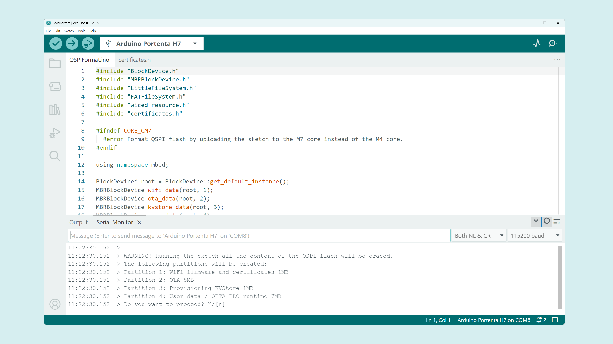
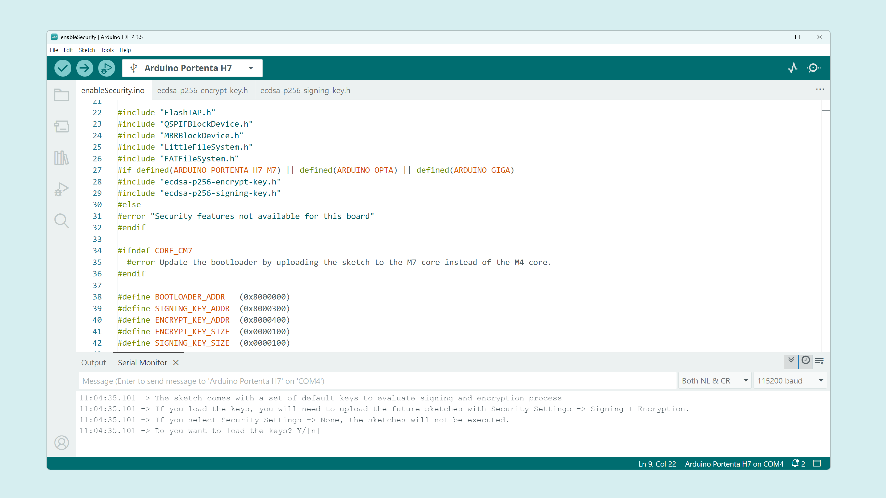
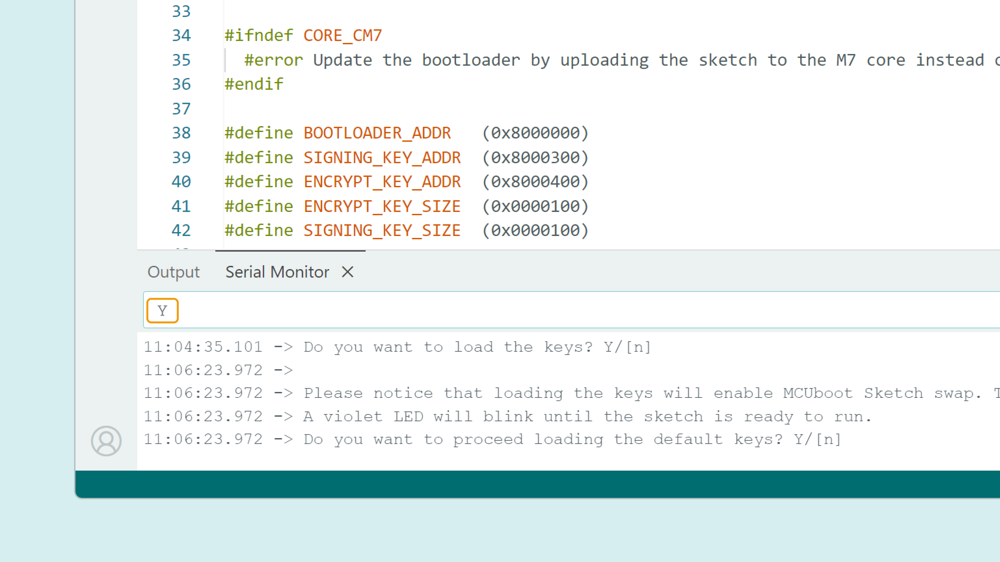
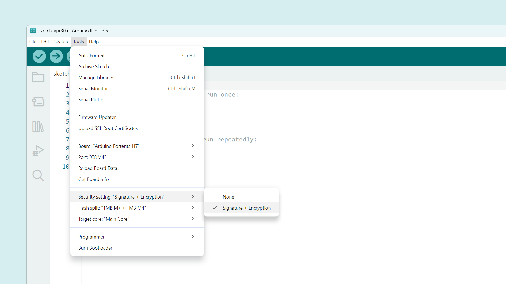

## Introduction
This short tutorial will guide the user through enabling the secure boot on the Portenta H7, generating custom security keys and using them with the MCUboot bootloader.

Secure boot is the process where a compiled sketch is authenticated against the hardware before it is authorized to be used in the boot process. The hardware is pre-configured to authenticate code using trusted security credentials.

In other words, secure boot ensures that the boot technology and operating system software are the legitimate manufacturer version and have not been altered or tampered with by any malicious actor or process.

## Hardware & Software Required

- [Portenta H7](https://store.arduino.cc/portenta-h7)
- [Arduino IDE 2.0+](https://www.arduino.cc/en/software)
- [Arduino Core for mbed enabled devices](https://github.com/arduino/ArduinoCore-mbed) version 3.1.0+
- [imgtool](https://github.com/arduino/imgtool-packing/releases/latest) (optional)

## Instructions

### Flashing the Latest Bootloader

In order to enable the secure boot, you must **update** the bootloader on your Portenta H7. You can find more info on how to perform the update in [this other tutorial](https://docs.arduino.cc/tutorials/portenta-h7/updating-the-bootloader).

Once the bootloader has been updated, it is possible to use [secure boot](https://www.keyfactor.com/blog/what-is-secure-boot-its-where-iot-security-starts/) to have an additional layer of security. 

### Format the QSPI Flash

First, before enabling the secure boot feature on your Portenta H7, you might need to format the QSPI flash memory.

For this, navigate to **File > Examples > STM32H747_System > QSPIFormat** and follow the steps below:



- Upload the **QSPIFormat** example to your Portenta H7.
- Open the Arduino IDE Serial Monitor.
- Follow the steps shown in the Serial Monitor. 

You will be asked for:

- Permission to proceed and **erase** the QSPI flash. Type `Y` in the Serial Monitor and press enter.
- Once done, you will be asked to **restore** the WiFi firmware. Type `Y` in the Serial Monitor and press enter.
- Select between **LitteFS** or **FatFS** to format user partition. Type `Y` for LittleFS or `No` for FatFS.
- Wait for the process to be done. It should say something like "It is now secure to reboot or disconnect the board".

Now you are ready to jump to the following step to enable the secure boot.

### Use Default Security Keys

Upload the `enableSecurity` example sketch that can be found under **File > Examples > MCUboot** in the IDE upper menu.



Two keys are embedded in the example sketch: 

- A private 256bit [ECDSA](https://en.wikipedia.org/wiki/Elliptic_Curve_Digital_Signature_Algorithm) key is used to extract the encryption key and decrypt the binary update (`ecdsa-p256-encrypt-key.h`).
- A public key is used for image verification (`ecdsa-p256-signing-key.h`).

***If the security keys are not overridden, the default ones are used. The default keys are in `C:\Users\<user>\AppData\Local\Arduino15\packages\arduino\hardware\mbed_portenta\<x.x.x>\libraries\MCUboot\default_keys.`***

In the *Serial Monitor* you will be asked for confirmation to load the default keys. Enter `Y` to confirm, `n` to abort.



Finally, wait for the keys to be loaded. In the *Serial Monitor* you will see a message saying: *Security features enabled. It's now safe to reboot or disconnect your board.* 

From that point on, you must configure your future sketches **Security setting** to **Signature + Encryption** (the option can be found under **Tools > Security settings** in the IDE when selecting *Portenta H7* as board, or use `--board-options security=sien` if working with the Arduino CLI). 



***Not configuring this setting will cause the bootloader not to run the compiled sketch because it is not trusted.***

### Generate Custom Security Keys

The default keys provided with the mbed platform are obviously only intended for development purposes. In a production environment it is strongly recommended to generate a new key pair (public and private key).
This can be done with **imgtool**. You can download and install it directly from the [release section](https://github.com/arduino/imgtool-packing/releases/latest).

***`imgtool` is already installed by the mbed platform.*** 

The tool can be found in:

- `%LOCALAPPDATA%\Arduino15\packages\arduino\tools\imgtool` on Windows.
- `~/.arduino15/packages/arduino/tools/imgtool` on Linux.
- `~/Library/Arduino15/packages/arduino/tools/imgtool` on macOS.

To **generate** the new keys you can use this command line:

```bash
imgtool keygen --key my-sign-keyfile.pem -t ecdsa-p256
imgtool keygen --key my-encrypt-keyfile.pem -t ecdsa-p256
```
This command line will generate two private PEM encoded security keys and save them in the current directory with `my-sign-keyfile.pem` and `my-encrypt-keyfile.pem` names. The algorithm used to generate the keys is ECDSA 256bit.

***Remember to __save the keys and keep them in a secure location__ and not to lose them.***

### Upload the Custom Keys to the Board
Once the keys have been generated, they have to be uploaded to the Portenta H7. This procedure has to be done only once, because it is persistent. To extract the public\private key and encode it in to a "C" byte array inside a `.h` header file you can use:

```bash
imgtool getpriv -k my-encrypt-keyfile.pem > ecsda-p256-encrypt-priv-key.h 
imgtool getpub -k my-sign-keyfile.pem > ecsda-p256-signing-pub-key.h
```

Now you have to replace the keys inside the `enableSecurity` sketch found under **File > Examples > MCUboot** in the IDE upper menu.

To do so, just save the sketch to another location and replace the `ecsda-p256-encrypt-priv-key.h` and `ecsda-p256-signing-pub-key.h` files with the newly generated ones and then upload the sketch again.

***__NOTE:__ In case the keys are compromised, this process can be performed again with a new set of keys, but any firmware signed with the previous pair will no longer work.***

### Use the Custom Keys when Compiling
Since the default keys have been changed in favour of custom generated ones, the new ones have to be used when compiling and uploading a sketch, because the compiled sketch is signed and encrypted using such keys.

To override the security keys used during the compilation, we recommend using the **Arduino CLI** and specify the keys with:

```bash
arduino-cli compile -b arduino:mbed_portenta:envie_m7 --board-options security=sien --keys-keychain <path-to-your-keys> --sign-key ecdsa-p256-signing-priv-key.pem --encrypt-key ecdsa-p256-encrypt-pub-key.pem <directory-of-sketch-to-compile>
```

You can also navigate to your `mbed_portenta` core found in:

- `%LOCALAPPDATA%\Arduino15\packages\arduino\hardware\mbed_portenta\x.x.x\boards.txt` (this may vary depending on the operating system).
- Then, change the default location your IDE search for the security keys by updating these lines inside the `boards.txt` file:

```bash
envie_m7.menu.security.sien.build.keys.keychain={runtime.platform.path}/libraries/MCUboot/default_keys
envie_m7.menu.security.sien.build.keys.sign_key=ecdsa-p256-signing-priv-key.pem
envie_m7.menu.security.sien.build.keys.encrypt_key=ecdsa-p256-encrypt-pub-key.pem
```

## Learn More
If you want to implement secure boot for your platform, take a look at [this article](https://arduino.github.io/arduino-cli/latest/guides/secure-boot/).
