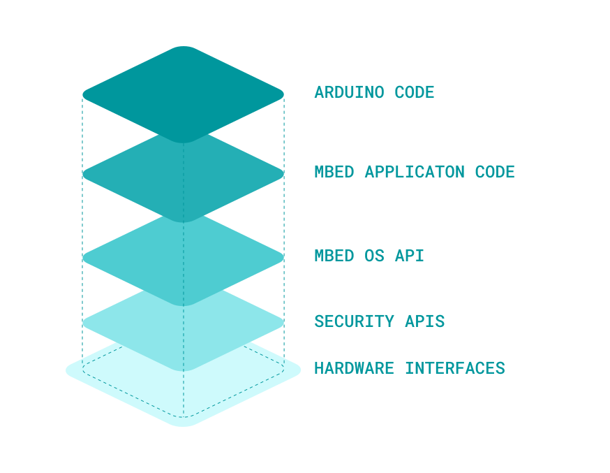
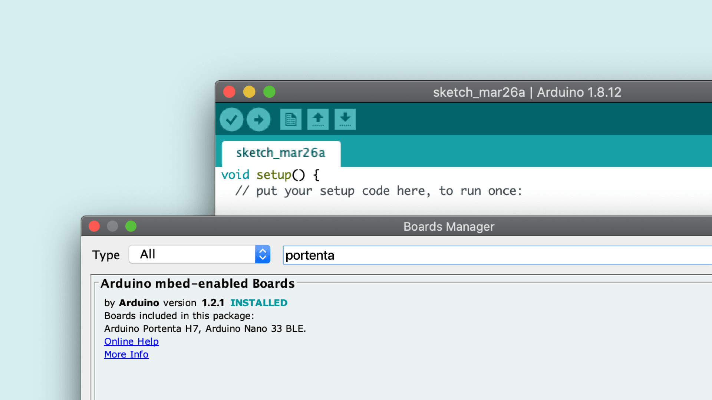
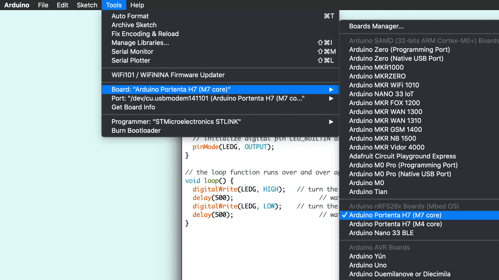

## Overview
Congratulations on your purchase of one of our most powerful microcontroller boards to date! We know you are eager to try out your new board but before you can start using the Portenta H7 to run Arduino sketches you need to configure your computer and the Arduino IDE. This tutorial teaches you how to set up the board, how to configure your computer and how to run the classic Arduino blink example to verify if the configuration was successful.

One of the benefits of the Portenta H7 is that it supports different types of software cores. A core is the software API for a particular set of processors. It is the API that provides functions such as digitalRead(), analogWrite(), millis() etc. which directly operate on the hardware.

At the moment of writing the tutorial, there is an Arduino core and a MicroPython core available for working with Portenta. The latter one allows you to write sketches in the popular programming language Python® rather than C or C++ and run them on the Portenta H7.

This tutorial focuses on the Arduino core which allows you to benefit from the thousands of existing Arduino libraries and code examples written in C and C++ which are compatible with the Arduino core. A tutorial about setting the Portenta H7 up for development with the MicroPython core will be released soon.

## Goals

- About the Arduino and Mbed operating system (Mbed OS) stack
- Installing the Mbed library
- Controlling the built in LED on the Portenta board

### Required Hardware and Software

- [Portenta H7 (ABX00042)](https://store.arduino.cc/products/portenta-h7), [Portenta H7 Lite (ABX00045)](https://store.arduino.cc/products/portenta-h7-lite) or [Portenta H7 Lite Connected (ABX00046)](https://store.arduino.cc/products/portenta-h7-lite-connected)
- USB-C® cable (either USB-A to USB-C® or USB-C® to USB-C®)

## Portenta and The Arduino Core
The Portenta H7 is equipped with two Arm Cortex ST processors (Cortex-M4 and Cortex-M7) which run the Mbed OS. Mbed OS is an embedded real time operating system (RTOS) designed specifically for microcontrollers to run IoT applications on low power. A real-time operating system is an operating system designed to run real-time applications that process data as it comes in, typically without buffer delays. [Here you can read more about real time operating systems](https://www.ni.com/en-us/innovations/white-papers/07/what-is-a-real-time-operating-system--rtos--.html).

The Arduino core for the Portenta H7 sits on top of the Mbed OS and allows to develop applications using Mbed OS APIs which handle for example storage, connectivity, security and other hardware interfacing. [Here you can read more about the Mbed OS APIs](https://os.mbed.com/docs/mbed-os/latest/apis/index.html). However, taking advantage of the Arm® Mbed™ real time operating system's powerful features can be a complicated process. Therefore we simplified that process by allowing you to run Arduino sketches on top of it.



## Instructions

### Configuring the Development Environment
In this section, we will guide you through a step-by-step process of setting up your Portenta board for running an Arduino Sketch that blinks the built-in RGB LED.

***IMPORTANT: Please make sure to update the bootloader to the most recent version to benefit from the latest improvements. Follow [these steps](https://docs.arduino.cc/tutorials/portenta-h7/updating-the-bootloader/) before you proceed with the next step of this tutorial.***

### 1. The Basic Setup
Let's begin by Plug-in your Portenta to your computer using the appropriate USB-C® cable. Next, open your IDE and make sure that you have the right version of the Arduino IDE downloaded on to your computer.


### 2. Adding the Portenta to the List of Available Boards
In your Arduino IDE, open the board manager and search for "portenta". Find the Arduino mbed-enabled Boards library and click on "Install" to install the latest version of the mbed core (1.2.3 at the time of writing this tutorial).

**Note:** If you have previously installed the Nano 33 BLE core it will be updated by following this step.



### 3. Uploading the Classic Blink Sketch
Let's program the Portenta with the classic blink example to check if the connection to the board works. There are two ways to do that:

- In the classic Arduino IDE open the blink example by clicking the menu entry **File > Examples > 01.Basics > Blink**. You need to swap LOW and HIGH pin values as the built-in LED on Portenta is turned on by pulling it LOW.
- In the Arduino IDE copy and paste the following code into a new sketch in your IDE.

```cpp
// the setup function runs once when you press reset or power the board
void setup() {
    // initialize digital pin LED_BUILTIN as an output.
    pinMode(LED_BUILTIN, OUTPUT);
    digitalWrite(LED_BUILTIN, HIGH); // turn the LED off after being turned on by pinMode()
}

// the loop function runs over and over again forever
void loop() {
    digitalWrite(LED_BUILTIN, LOW); // turn the LED on (LOW is the voltage level)
    delay(1000); // wait for a second
    digitalWrite(LED_BUILTIN, HIGH); // turn the LED off by making the voltage HIGH
    delay(1000); // wait for a second
}
```

***Remember that the built-in RGB LEDs on the Portenta H7 need to be pulled to ground to make them light up. This means that a voltage level of __LOW__ on each of their pins will turn the specific color of the LED on, a voltage level of __HIGH__ will turn them off. Furthermore invoking __pinMode(LED_BUILTIN, OUTPUT)__ pulls the LED LOW which means it turns the LED on.***

For Portenta H7 LED_BUILTIN represents the built-in RGB LED on the board in green color.

**Note:** The individual colors of the built-in RGB LED can be accessed and controlled separately. In the tutorial [Dual core processing](https://docs.arduino.cc/tutorials/portenta-h7/dual-core-processing/) you will learn how to control the LED to light it in different colors

### 4. Upload the Blink Sketch 
Now it's time to upload the sketch and see if the LED will start to blink. Make sure you select Arduino Portenta H7 (M7 core) as the board and the port to which the Portenta H7 is connected. If the Portenta H7 doesn't show up in the list of ports, go back to step 1 and make sure that the drivers are installed correctly. Once selected click Upload. Once uploaded the built-in LED should start blinking with an interval of 1 second.

**Note:** The Portenta H7 has an M7 and an M4 processor which run separate cores. That's why you need to select the one to which you want to upload your sketch to (check out the tutorial [Dual core processing](https://docs.arduino.cc/tutorials/portenta-h7/dual-core-processing/) to learn more about Portenta's processors).



**Optional:** We collect all the sketches from the tutorials in a library which you can install from the Library Manager: **Tools > Manage Libraries**. Search for 'Arduino_Pro_Tutorials' or download them from the [repository](https://github.com/arduino-libraries/Arduino_Pro_Tutorials/releases).

## Conclusion
You have now configured your Portenta board to run Arduino sketches. Along with that you gained an understanding of how the Arduino Core runs on top of Mbed OS.

### Next Steps
-   Proceed with the next tutorial [Dual core processing](https://docs.arduino.cc/tutorials/portenta-h7/dual-core-processing/) to learn how to make use of Portenta H7's two processors to do two separate tasks simultaneously.
-   Read more about why we chose Mbed as as the foundation [here](https://blog.arduino.cc/2019/07/31/why-we-chose-to-build-the-arduino-nano-33-ble-core-on-mbed-os/).

## Troubleshooting
### Sketch Upload Troubleshooting
If trying to upload a sketch but you receive an error message, saying that the upload has failed you can try to upload the sketch while the Portenta H7 is in bootloader mode. To do so you need to double click the reset button. The green LED will start fading in and out. Try to upload the sketch again. The green LED will stop fading when the upload completes.


### USB Hub Issues Troubleshooting
If you would like to use a USB hub to connect other devices to the Portenta make sure it's an active USB hub that can provide power to these devices. Passive hubs won't work. If you're using an active USB hub but still don't get it to work it may be a model that is not supported.

### Ubuntu Issues Troubleshooting
If you're having troubles getting your Portenta to work on Ubuntu you can try the following:

- Make sure **modemmanager** is not installed. Otherwise remove it with `sudo apt-get remove modemmanager`
- Add the following rules to you udev rules 
```cpp
SUBSYSTEM=="usb", ATTRS{idVendor}=="2341", MODE="0666"
SUBSYSTEM=="usb", ATTRS{idVendor}=="1fc9", MODE="0666"
SUBSYSTEM=="usb", ATTRS{idVendor}=="0525", MODE="0666"
```

- Reboot your PC
- You may use the following commands to create a new udev rule from scratch:
`echo 'SUBSYSTEMS=="usb", ATTR{idVendor}=="2341", MODE:="0666"' > 20-portenta.rules` 
`sudo mv 20-portenta.rules /etc/udev/rules.d/`
