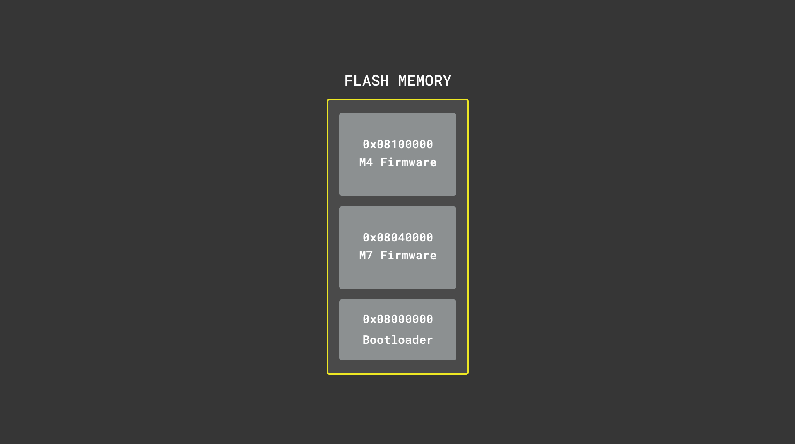
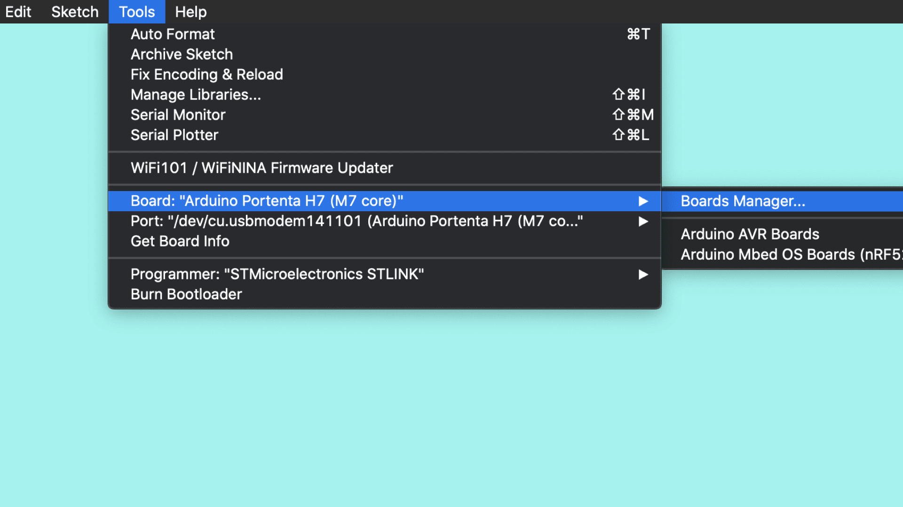
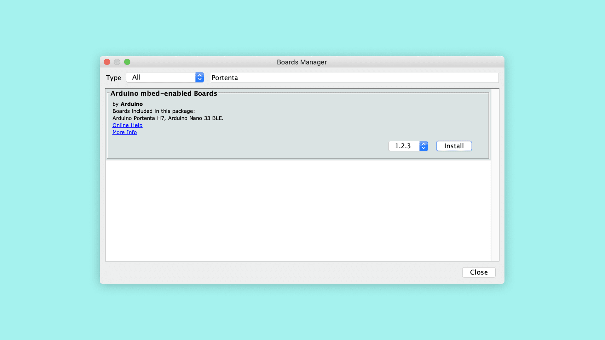
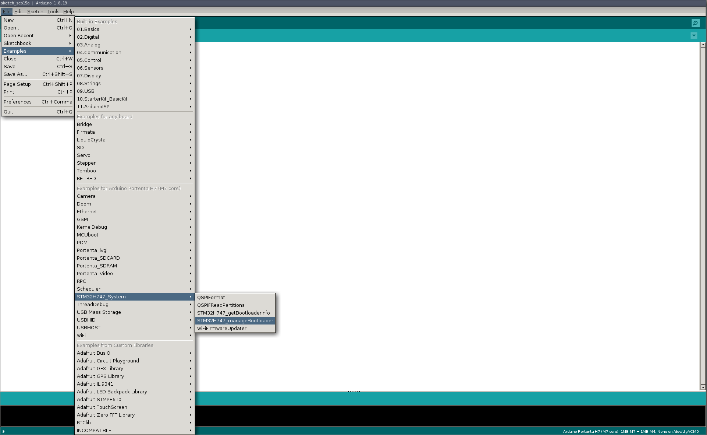
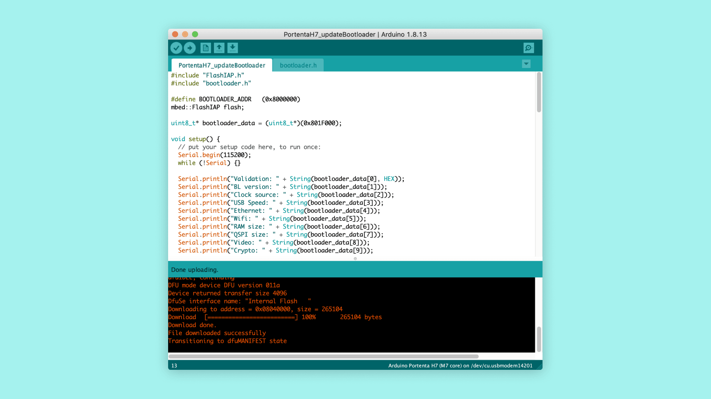
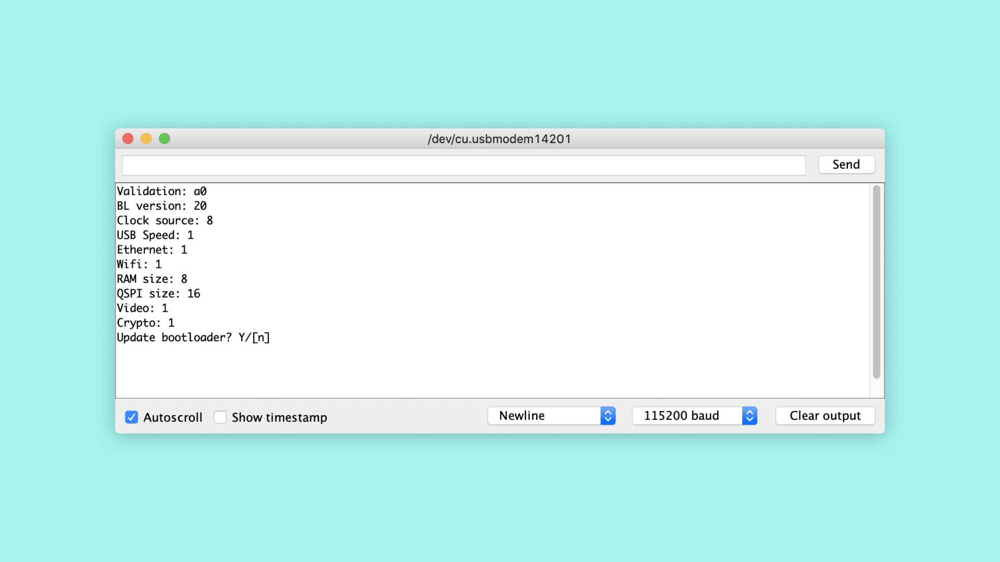
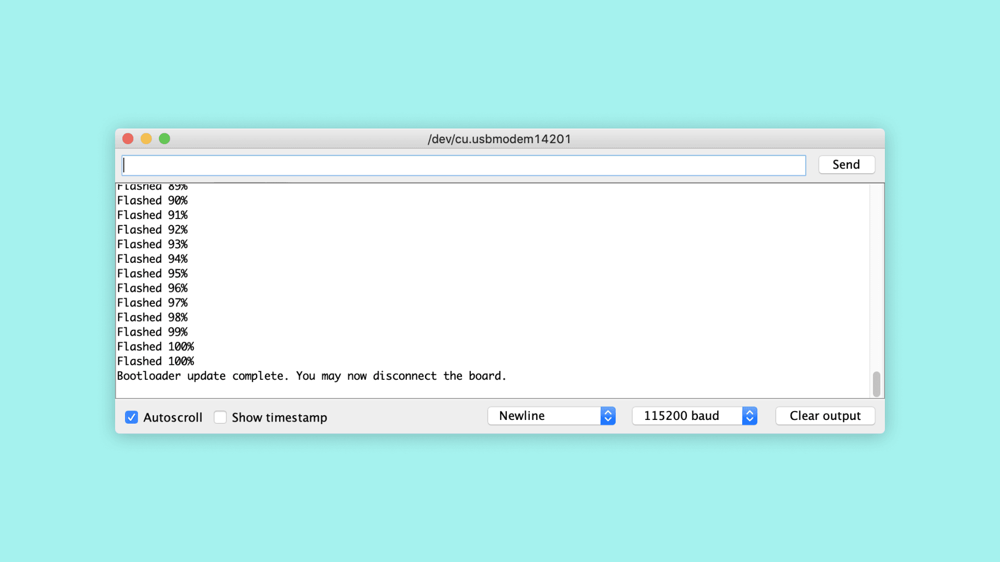

## Overview
This tutorial will explain what a bootloader is, why you should consider keeping it updated and how you can update it. The Portenta H7 also features a second ST ROM bootloader which is a separate mechanism that we do not cover in this tutorial. For the remainder of this tutorial, when we reference a bootloader, the custom bootloader provided by Arduino is meant.

## Goals

- The concept of a bootloader
- How to use the Arduino IDE board manager to update the Portenta core
- How to use the Arduino IDE to update the Portenta bootloader to the latest version

### Required Hardware and Software

- [Portenta H7 (ABX00042)](https://store.arduino.cc/products/portenta-h7), [Portenta H7 Lite (ABX00045)](https://store.arduino.cc/products/portenta-h7-lite) or [Portenta H7 Lite Connected (ABX00046)](https://store.arduino.cc/products/portenta-h7-lite-connected)
- USB-C® cable (either USB-A to USB-C® or USB-C® to USB-C®)
- Arduino IDE 1.8.10+

## What Is a Firmware?

In order to understand how a bootloader works, you first need to understand what a firmware is in the world of Arduino. A firmware consists of your sketch (.ino file) plus a couple of files and libraries that give you access to the hardware functions. Those files and libraries together make a bundle that is called a **core**. If you ever wondered what exactly `digitalWrite(pin, HIGH)` does under the hood, the core is the place where you need to look. That also explains why the different hardware architectures on the different Arduino boards need a separate core, because the hardware level implementation of a function like `digitalWrite` is hardware specific.


## What Is a Bootloader?

A bootloader is a small application that gets started when an Arduino board gets powered. When you order an official Arduino board it comes pre-flashed with a bootloader.

The bootloader helps to upload a new sketch to the board. If the bootloader was not there, you would need an external programmer device to upload your sketch to the board. The bootloader determines whether it should upload a new firmware or if it should launch an existing one that was uploaded previously. If you do not take any action, the bootloader launches an existing firmware. On the other hand, when you double press the reset button on the board, the bootloader recognizes that and waits for a firmware to be uploaded. The bootloader then takes care of storing the new firmware in the memory.


## Memory Layout

Both the bootloader and the firmware have predefined (but adjustable) locations in the memory where they get stored. In the end, the processor needs to know where to find the instructions to do its work. On the Portenta, for example, the bootloader is stored at the Flash memory address `0x08000000`. When the board gets powered on, it will jump to this location and start to do its job. The bootloader in turn knows that e.g. for the M7 the firmware can be found at location `0x08040000`, so it will jump there if it does not need to upload a new firmware.
Should you for some reason want to adjust the start address of the application, you can edit the property `target.mbed_app_start` in the [mbed_app.json config file](https://github.com/arduino/ArduinoCore-mbed/blob/master/variants/PORTENTA_H7_M7/conf/mbed_app.json) of the core. Apart from modifying the json, you also need to change the text section start address [here](https://github.com/arduino/ArduinoCore-mbed/blob/master/variants/PORTENTA_H7_M7/linker_script.ld#L3). Alternatively you can recompile Mbed OS using the `mbed-os-to-arduino` [script](https://github.com/arduino/ArduinoCore-mbed/blob/master/mbed-os-to-arduino).




## Instructions

### Flashing the Latest Bootloader
Even though the Arduino boards come pre-flashed with a bootloader, there are sometimes improvements or bug fixes which get integrated into an updated bootloader version. They usually improve stability and performance. To benefit from that, it makes sense to update it when there is a new version.

The bootloader is stored in a location that does not get overwritten by a firmware being uploaded to the Portenta. If you upload for example the OpenMV firmware and then later decide to switch back to a regular Arduino firmware, the bootloader will not be affected.

### 1. Updating the Core
New versions of the bootloader normally get shipped together with the core. That means you first have to update the core before you can update the bootloader. To do so open the board manager in the menu under **Tools >Board >Boards Manager...**



In the board manager and search for "portenta". Find the Arduino mbed-enabled Boards package and click on "Install" to install the latest version of the mbed core (1.3.0 at the time of writing this tutorial).



### 2. Updating the Bootloader
To update the bootloader, you can use the **STM32H747_manageBootloader** sketch. You can find the sketch file under **File > Examples > STM32H747_System**



Compile and upload the sketch to the board. Make sure you have selected the right port before you upload.



Open the Serial Monitor and you will see the specifications of your current bootloader and your board. Enter **Y** in the text field and press enter to begin the update process.



You will see the message "Bootloader update complete. You may now disconnect the board." when the update is complete.



**Expert tip:** Newer versions of the bootloader allow to fetch the version number via dfu-util. To see it, put the Portenta board into bootloader mode and invoke the dfu-util command: `dfu-util -l | grep "Bootloader"`. The dfu-util command can be found in the Arduino15/packages/arduino/tools/dfu-util directory.

## Conclusion
Having an updated bootloader is important to benefit from improved performance and resolved bugs. As mentioned earlier, we recommend to keep an eye out for new releases on our [Github repository](https://github.com/arduino/ArduinoCore-mbed/tree/master/bootloaders) and update the bootloader whenever there is a new release available.

## Troubleshooting
### LIBUSB_ERROR_IO Error

There are times when your code compiles perfectly but is unable to upload. If you encounter the following error message, it means that the IDE has encountered issues communicating with the USB interface of your board.

```cpp
dfu-util: error get_status: LIBUSB_ERROR_IO
Opening DFU capable USB device... 
```

Unplug and plug in the board to re-initiate the USB interface and you should be able to upload the code without issues.
