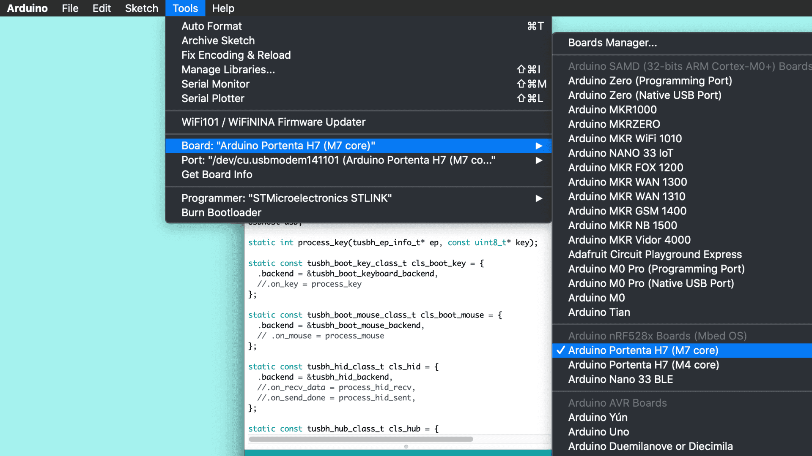
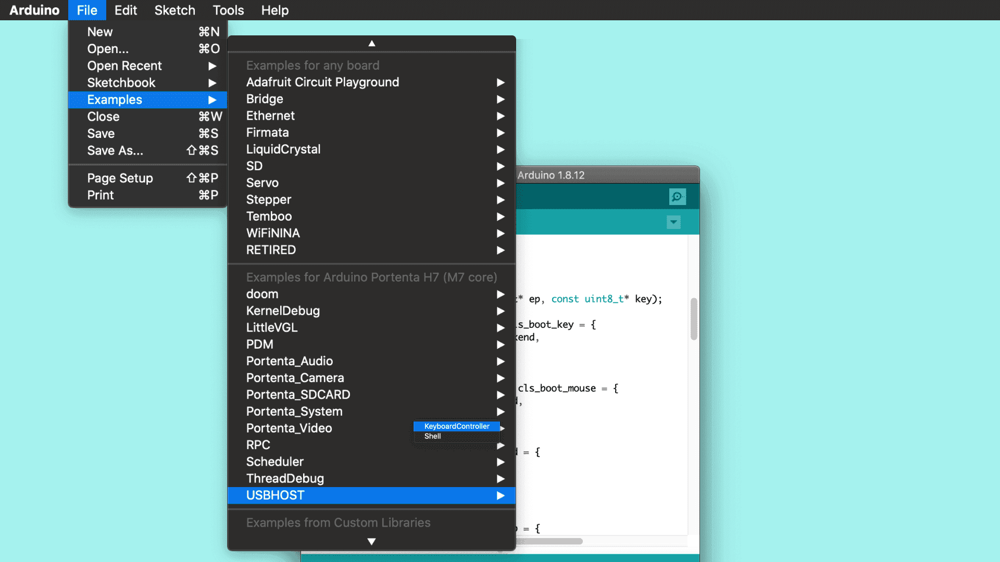
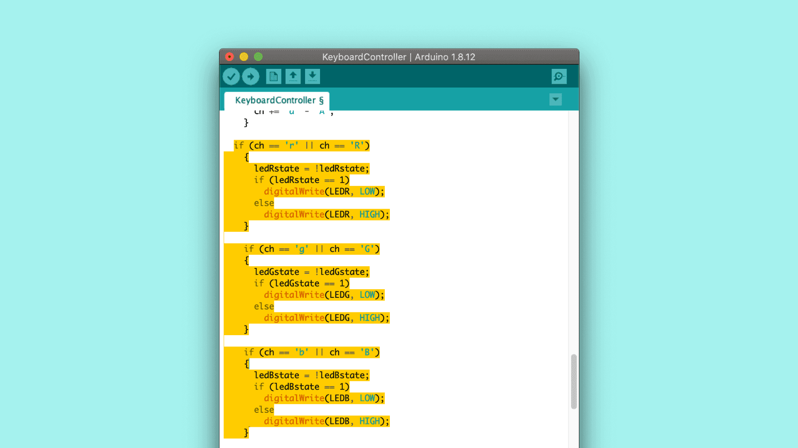
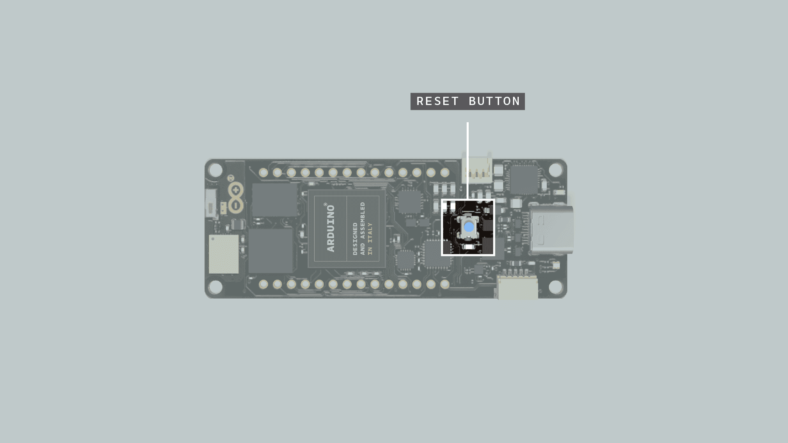
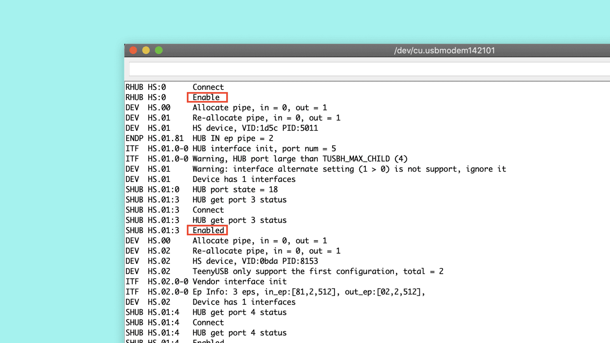

## Overview
It is possible to configure the Portenta H7 to act as a USB host in a way that allows to connect peripherals such as a keyboard or mouse to interact with the board. This way, you could connect a keyboard to your Portenta and type numbers or characters to trigger actions from your sketch.

## Goals

- How to configure the Portenta H7 as a USB host
- How to use the **KeyboardController** library to establish a USB connection with the Portenta H7
- To write a small program that reads button presses from a keyboard
- How to debug the data being sent from the peripheral to the Portenta H7 using an additional Arduino board.

### Required Hardware and Software

- [Portenta H7 (ABX00042)](https://store.arduino.cc/products/portenta-h7), [Portenta H7 Lite (ABX00045)](https://store.arduino.cc/products/portenta-h7-lite) or [Portenta H7 Lite Connected (ABX00046)](https://store.arduino.cc/products/portenta-h7-lite-connected)
- USB-C® cable (either USB-A to USB-C® or USB-C® to USB-C®)
- Active USB-C® hub (optional)
- External keyboard
- Arduino IDE 1.8.10+  or Arduino Pro IDE 0.0.4+
- Power supply for the USB hub (if a USB hub is used)

### Extra Materials

-   Arduino Arduino MKR WiFi 1010 (or other board with at least two serial ports, check [here](https://www.arduino.cc/reference/en/language/functions/communication/serial/) the list of Arduino boards with more than one serial port.)
-   USB cable compatible with the Arduino Arduino MKR WiFi 1010 (or the board you have selected)
-   3 jumper wires

## USB Host and Client Mode 

When using the Portenta H7 as a USB host, it can receive and manage the information provided by other USB peripherals connected to it through a hub. In this scenario, the Portenta H7 is referred to as "USB host" or "controller" device, and the peripheral is called the "client" device (usually a mouse or a keyboard). 

Computers are by default USB hosts too, as they receive the information the USB peripherals provide. PCs follow a “plug and play” mechanism, this means that, whenever a USB device is connected, the host detects the device and loads the appropriate drivers for the device to establish a communication channel over the serial bus.

In contrast of being the host point for peripherals, the Portenta H7 can also be connected to the computer as the "client". In this case, the PC is the USB host and the Portenta H7 the peripheral. You can see this scenario whenever you upload sketches to the board or when you monitor data through the Serial Monitor. 

Furthermore, the Portenta H7 can also be set to be a mouse or keyboard itself. With the corresponding sketch, circuitry and components, you could send keyboard or mouse data to a PC (not covered in this tutorial).

## Instructions

### Setting Up the USB Host

In this tutorial you are going to configure your Portenta H7 as a USB Host. This will allow you to toggle the RGB built-in LEDs of the board by pressing the corresponding keys (r, g, b) on a USB keyboard that will be plugged into a USB hub.

Throughout the tutorial, you will learn how to establish a serial communication between the board and the keyboard and also, how to program the board so it acts as a USB Host device.

To achieve this, you will use the [USBHOST](https://os.mbed.com/handbook/USBHost) library which is part of the Portenta H7 core. This library facilitates the USB connections between USB devices and and the Portenta board.

Thanks to USB OTG (On The Go) specification the Portenta H7 can switch between host and client modes automatically. The code that enables USB OTG in Portenta H7 is included in the **mbed** core and it is ready to function without additional configurations. Some related classes to make use of the USB port for different use cases are:

- `USBCDC_ECM` > Ethernet over USB (See [here](https://os.mbed.com/docs/mbed-os/v5.15/apis/usbcdc-ecm.html))
- `USBMSD` > Mass storage device over USB (See [here](https://os.mbed.com/docs/mbed-os/v5.15/apis/usbmsd.html))
- `USBCDC` > Serial port over USB (See [here](https://os.mbed.com/docs/mbed-os/v5.15/apis/usbcdc.html))
- `USBHID` > USB human interface devices e.g. mouse or keyboard (See [here](https://os.mbed.com/docs/mbed-os/v5.15/apis/usbhid.html))

### 1. The Basic Setup

Begin by plugging in your Portenta board to the computer using a USB-C®  cable and open the Arduino IDE. If this is your first time running Arduino sketch files on the board, we suggest you to check out how to [set up the Portenta H7 for Arduino](https://docs.arduino.cc/tutorials/portenta-h7/setting-up-portenta) before you proceed.


### 2. Creating the Keyboard Controller

Let's create a sketch that handles the USB connections and  modifies the state of the LEDs with each press on the R, G or B keys. When you press the key first time, the LEDs will switch on and, to turn them off, you will need to press the corresponding key again.

Since programming the USB protocol that allows the board to handle USB devices is an arduous task, you will use a pre-built example called **KeyboardController**. To find it, make sure you have the board description for the Arduino Portenta H7 installed using the Boards Manager.



Then, open: **File > Examples > USBHOST > KeyboardController**.



The **USBHost** library that is used in this example is a revamp of the classic Arduino **USBHost** library. This new version, among adapting the protocol to the newer USB version, allows to connect devices through USB Hubs (USB adapters). For a better understanding about how the USBHost library works, it could be helpful for you to take a look at the Arduino [USBHost](https://www.arduino.cc/en/Reference/USBHost) library.

**Note:** You can find the finished sketch in the examples of the Arduino_Pro_Tutorials library: **Examples > Arduino_Pro_Tutorials > Portenta H7 as a USB Host > LEDKeyboardController**

### 3. Detecting the Keys From the Keyboard

The example you opened describes how the board will handle the connection with a keyboard, addressing the functionality of each one of its keys. In order to detect which one of the keys from the keyboard is pressed, you will need to modify and add some lines of code to the example.

Let's start by removing the comment line ( `//` ) of the following line `.on_key = process_key` at the beginning of the code. By doing this, each time you press a key, the program calls the function that converts the data received from the keyboard from `HEX` to a `char` type.

```cpp
static const tusbh_boot_key_class_t cls_boot_key = {
  .backend = &tusbh_boot_keyboard_backend,
  .on_key = process_key
};
```

Then, in order to modify the state of the LEDs of the board with the R, G or B keys, you need to add the following portion of code inside the `process_key()` function after `stdin_recvchar(ch);`, as shown in the image below:
```cpp
   if (ch == 'r' || ch == 'R')
    {
      ledRstate = !ledRstate;
      if (ledRstate)
        digitalWrite(LEDR, LOW);
      else
        digitalWrite(LEDR, HIGH);
    }

    if (ch == 'g' || ch == 'G')
    {
      ledGstate = !ledGstate;
      if (ledGstate)
        digitalWrite(LEDG, LOW);
      else
        digitalWrite(LEDG, HIGH);
    }

    if (ch == 'b' || ch == 'B')
    {
      ledBstate = !ledBstate;
      if (ledBstate)
        digitalWrite(LEDB, LOW);
      else
        digitalWrite(LEDB, HIGH);
    }
```



### 4. Initializing the LEDs

Once you have the code that detects if the correct keys are pressed and controls the LEDs accordingly, you need to initialize the LEDs. To do so, add the following portion of code inside the `setup()` function.
```cpp
pinMode(LEDR, OUTPUT);
pinMode(LEDG, OUTPUT);
pinMode(LEDB, OUTPUT);

//Turn off the LEDs
digitalWrite(LEDR, HIGH);
digitalWrite(LEDG, HIGH);
digitalWrite(LEDB, HIGH);
```

And then, to finish editing the code, you need to initialize `ledRstate`, `ledGstate` and `ledBstate` variables as booleans, by adding this portion of code before the `setup()` function.

```cpp
bool ledRstate = false;
bool ledGstate = false;
bool ledBstate = false;
```

### 5. Upload the Code

Before uploading the sketch to the board, save it  in your sketchbook and name it **leds_keyController.ino**. Then select the **Arduino Portenta H7 (M7 core)** from the **Board** menu and the port the Portenta is connected to. Upload the **leds_keyController.ino** sketch. Doing so will automatically compile the sketch beforehand.

***Turning the Portenta into a USB host will stop it from advertising it is a serial port. To get it back, simply do a double press on the reset button to turn it into bootloader mode.***


### 6. Connecting a Keyboard to Portenta

When you connect the Portenta board to the computer to program it, the computer is the USB host and the Portenta board is the USB client. The same happens when you connect an external keyboard to your PC. For this tutorial the Portenta board will be the host. It will not be connected to the PC after programming it! Let's see how to make the connections.


In the image above you can see that:

- The Portenta is connected to the "HOST" port of the USB hub (USB-C® adapter)
- The USB Hub (USB-C® adapter) needs to be powered externally with a power supply. This is required to provide power to Portenta.
- You should connect the keyboard to the USB Hub (USB-C® adapter) in the same way you would connect it to your PC.

### Alternative Configuration (No USB Hub Required)

If you do not have a USB-C® type hub, you may complete this tutorial with a USB-C® type keyboard or with a USB-A type keyboard and a USB-A to USB-C® adapter. To do so, proceed as follows:

- Power the Portenta H7 through the VIN pin with 5V. (Check [pinout diagram](https://content.arduino.cc/assets/Pinout-PortentaH7_latest.pdf))
- Connect the keyboard directly to the Portenta's USB-C® connector (use a USB-A to USB-C® adapter if your keyboard's connector is USB type A)
- Add the following line of code in your sketch to enable power supply through Portenta's USB connector: `usb.supplyPowerOnVBUS(true);`

### 7. Toggling the LEDs

Once you have connected your portenta board, you should be able to toggle the LEDs by pressing the R, G and B keys.


If it does not work as it should, try the following:

1. Reset the portenta by pressing the Reset button. 
2. Disconnect the Portenta board from the USB Hub (USB-C® adapter), disconnect the power from the USB Hub, connect the Portenta to the USB Hub and then connect the power to the USB Hub.

## Conclusion

This tutorial shows how to connect and control a keyboard by configuring Portenta as a USB Host. You have also learnt how to modify one of the pre-built examples for Portenta to have a visual reference of the interactions between the keyboard and the Portenta board.

### Next Steps

Now that you have learnt how to set up the board as a USB Host and understood how the example works, start experimenting with the **KeyboardController.ino** sketch. This sketch can be tweaked in a variety of ways based on your needs. For example, you could add a mouse to the USB Hub and increase the brightness of the built-in LEDs when pressing the left button and decrease it when pressing the right button.

## Troubleshooting

### The LEDs Are Not Toggling

This troubleshooting guide will help you to find out why the LEDs of your Portenta do not toggle when you press the keys on the keyboard. To do so, you will need some extra components:

* Arduino Arduino MKR WiFi 1010 board (or another Arduino board with at least two serial ports)
* USB cable to connect the extra board to the PC
* 3 jumper wires

To detect what the problem is, you are going to send all the information about the USB peripheral (in this case the keyboard) through serial communication from Portenta to the Arduino MKR WiFi 1010 board. Once this info arrives to the Arduino MKR WiFi 1010 board, you can print it out through the Serial Monitor, which will allow you to debug what can be happening.

### 1. Connect the Portenta to the Arduino MKR WiFi 1010

To connect the Portenta to the Arduino MKR WiFi 1010 board, you will need connect the pins with Serial1 functionality (13RX and 14TX on both boards) between them as shown in the image below. Do not forget to connect as well the ground pins (GND) of the boards.


### 2. Program the Arduino MKR WiFi 1010 Board

To set up Arduino MKR WiFi 1010 board copy the following code, paste it into a new sketch file and name it **mkr1010_serial.ino**. Then upload it to the board. Make sure you select **Arduino MKR WiFi 1010** as the board and the port to which the board is connected.

```cpp
char data;

void setup()
{
  Serial.begin(9600);
  Serial1.begin(115200);
}

void loop()
{

  if (Serial1.available())
  {
    data = Serial1.read();
    Serial.write(data);
  }
}
```

### 3. Connection Schema

After programming your Arduino MKR WiFi 1010 board and connecting the Portenta board to the Arduino MKR WiFi 1010, your connection schema should be similar to the following:


### 4. Open the Serial Monitor of the Arduino MKR WiFi 1010

Once you have everything connected, open the Serial Monitor and reset the Portenta. After resetting the Portenta board, your Serial Monitor should display something similar to the following:



In the data received on the MKR WiFi 1010 board you should see some "Enabled" messages. It means that the Portenta detected the different ports of your USB Hub. If you can see them, whenever you press a key on the keyboard, it should get printed to the Serial Monitor.

If in the messages received on the MKR WiFi 1010 board you see any "Disabled" message, it means that something went wrong with the communication of the USB Hub and the Portenta board. If this happens, try:

1. Reset the Portenta by pressing the reset button.
2. Disconnect the Portenta board from the USB Hub (USB-C® adapter), disconnect the power from the USB Hub, connect the Portenta to the USB Hub and connect the power to the USB Hub.

If, after repeating this process several times, the connection still is not working, the USB Hub you are using may not be compatible with the Portenta board and you will need a different USB Hub to complete this tutorial.
