## Overview
Portenta H7 comes with an on-board Wi-Fi and a Bluetooth® Module that allows to develop IoT applications that require wireless connectivity and Internet access. Turning the board into an access point allows to create a Wi-Fi network on its own and allows other devices to connect to it. In  this tutorial you will learn to set up your board as an access point web server and remotely control the red, green and blue LEDs on the built-in RGB LED by accessing an HTML page on your mobile device’s browser. 

## Goals

-   About the built-in Wi-Fi + Bluetooth® module.
-   How a  client-server model works 
-   How to create an HTTP communication channel between the board and an external device. 

### Required Hardware and Software

- [Portenta H7 (ABX00042)](https://store.arduino.cc/portenta-h7) or [Portenta H7 Lite Connected (ABX00046)](https://store.arduino.cc/products/portenta-h7-lite-connected) 
- One USB-C® cable (either USB-A to USB-C® or USB-C® to USB-C®)
- Arduino IDE 1.8.10+  or Arduino Pro IDE 0.0.4 +
- A smart phone

## Access Point Configuration
The Portenta H7 features a  [Murata 1DX](https://wireless.murata.com/type-1dx.html), which is a high performance chipset which supports Wi-Fi 802.11b/g/n + Bluetooth® 5.1 BR/EDR/LE, up to 65 Mbps PHY data rate on Wi-Fi and 3 Mbps PHY data rate on Bluetooth®. This module helps to configure the Portenta into three different modes of operation -  an Access Point,  a Station, or both. In this tutorial we will only focus on the access point configuration.

When the board is configured to operate as an access point, it can create its own wireless LAN (WLAN) network. In this mode, the board transmits and receives signals at 2.4 GHz allowing other electronic devices with Wi-Fi capabilities using the same bandwidth to connect to the board.

With the access point set up, you create a client server architecture where the board provides a web server communicating with the client devices over HTTP. The connected devices can then make HTTP GET requests to the server to retrieve web pages served by the web server on the board. This makes the Portenta H7 an ideal board for developing IoT solutions where external client devices can send and receive information while more complex processing tasks take place on the server.


## Instructions

### Setting Up the Web Server
In this tutorial you are going to convert the board into an access point and use it to set up a web server which provides a HTML webpage. This page contains buttons to toggle the red, green and blue color of the built-in LED. You will then connect your mobile device to this access point and access this web page through the browser on your mobile phone. Once retrieved, you will be able to control the state of the red, green and blue LED on the built-in RGB LED from your mobile device. 


### 1. The Basic Setup
Begin by plugging in your Portenta board to your computer using a USB-C® cable and open the  Arduino IDE. If this is your first time running Arduino sketch files on the board, we suggest you check out how to [set up the Portenta H7 for Arduino](https://docs.arduino.cc/tutorials/portenta-h7/setting-up-portenta) before you proceed. 

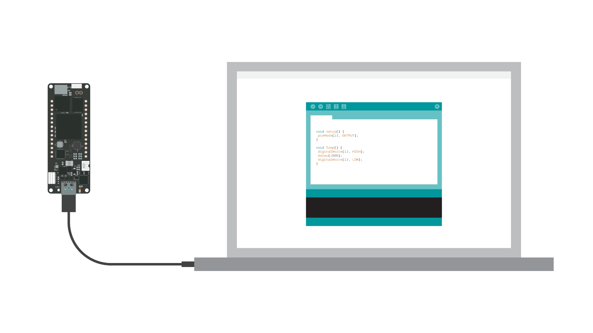

### 2. Create the Web Server Sketch
Next you need to create a web server sketch that will handle the HTTP GET requests and provide the client devices with the HTML web page. The [Wi-Fi](https://www.arduino.cc/en/Reference/WiFi) library provides all necessary methods that allows Arduino boards to use their Wi-Fi features provided by the on-board Wi-Fi module. To set up the web server copy the following code, paste it into a new sketch file and name it **SimpleWebServer.ino**. 

**Note:** You can access the final sketch inside the library: **Examples > Arduino_Pro_Tutorials > Portenta H7 as a WiFi Access Point > SimpleWebServer**

```cpp
#include <WiFi.h>
#include "arduino_secrets.h"

///////please enter your sensitive data in the Secret tab/arduino_secrets.h
char ssid[] = SECRET_SSID;    // your network SSID (name)
char pass[] = SECRET_PASS;    // your network password (use for WPA, or use as key for WEP)
int keyIndex = 0;             // your network key Index number (needed only for WEP)

int status = WL_IDLE_STATUS;

WiFiServer server(80);

void setup() {
  // put your setup code here, to run once:
  Serial.begin(9600);
  while (!Serial) {
    ; // wait for serial port to connect. Needed for native USB port only
  }
  
  Serial.println("Access Point Web Server");

  pinMode(LEDR,OUTPUT);
  pinMode(LEDG,OUTPUT);
  pinMode(LEDB,OUTPUT); 

  // by default the local IP address of will be 192.168.3.1
  // you can override it with the following:
  // WiFi.config(IPAddress(10, 0, 0, 1));

  if(strlen(pass) < 8){    
    Serial.println("Creating access point failed");
    Serial.println("The Wi-Fi password must be at least 8 characters long");
    // don't continue
    while(true);
  }
    
  // print the network name (SSID);
  Serial.print("Creating access point named: ");
  Serial.println(ssid);

  //Create the Access point
  status = WiFi.beginAP(ssid,pass);
  if(status != WL_AP_LISTENING){
    Serial.println("Creating access point failed");
    // don't continue
    while (true);
  }

  // wait 10 seconds for connection:
  delay(10000);

  // start the web server on port 80
  server.begin();

  // you're connected now, so print out the status
  printWiFiStatus();
  
}

void loop() {

 // compare the previous status to the current status
  if (status != WiFi.status()) {
    // it has changed update the variable
    status = WiFi.status();

    if (status == WL_AP_CONNECTED) {
      // a device has connected to the AP
      Serial.println("Device connected to AP");
    } else {
      // a device has disconnected from the AP, and we are back in listening mode
      Serial.println("Device disconnected from AP");
    }
  }

  WiFiClient client = server.available();   // listen for incoming clients

  if (client) {                             // if you get a client,
    Serial.println("new client");           // print a message out the serial port
    String currentLine = "";                // make a String to hold incoming data from the client
  
    while (client.connected()) {            // loop while the client's connected
     
      if (client.available()) {             // if there's bytes to read from the client,
        char c = client.read();             // read a byte, then
        Serial.write(c);                    // print it out the serial monitor
        if (c == '\n') {                    // if the byte is a newline character

          // if the current line is blank, you got two newline characters in a row.
          // that's the end of the client HTTP request, so send a response:
          if (currentLine.length() == 0) {
            // HTTP headers always start with a response code (e.g. HTTP/1.1 200 OK)
            // and a content-type so the client knows what's coming, then a blank line:
            client.println("HTTP/1.1 200 OK");
            client.println("Content-type:text/html");
            client.println();

            // the content of the HTTP response follows the header:
            client.print("<html><head>");
            client.print("<style>");
            client.print("* { font-family: sans-serif;}");
            client.print("body { padding: 2em; font-size: 2em; text-align: center;}");            
            client.print("a { -webkit-appearance: button;-moz-appearance: button;appearance: button;text-decoration: none;color: initial; padding: 25px;} #red{color:red;} #green{color:green;} #blue{color:blue;}");
            client.print("</style></head>");
            client.print("<body><h1> LED CONTROLS </h1>");
            client.print("<h2><span id=\"red\">RED </span> LED </h2>");
            client.print("<a href=\"/Hr\">ON</a> <a href=\"/Lr\">OFF</a>");
            client.print("<h2> <span id=\"green\">GREEN</span> LED </h2>");
            client.print("<a href=\"/Hg\">ON</a> <a href=\"/Lg\">OFF</a>");
            client.print("<h2> <span id=\"blue\">BLUE</span> LED </h2>");
            client.print("<a href=\"/Hb\">ON</a> <a href=\"/Lb\">OFF</a>");
            client.print("</body></html>");

            // The HTTP response ends with another blank line:
            client.println();
            // break out of the while loop:
            break;
          } else {      // if you got a newline, then clear currentLine:
            currentLine = "";
          }
        } else if (c != '\r') {    // if you got anything else but a carriage return character,
          currentLine += c;      // add it to the end of the currentLine
        }

        // Check to see if the client request was "GET /H" or "GET /L":
        if (currentLine.endsWith("GET /Hr")) {
          digitalWrite(LEDR, LOW);               // GET /Hr turns the Red LED on
        }
        if (currentLine.endsWith("GET /Lr")) {
          digitalWrite(LEDR, HIGH);                // GET /Lr turns the Red LED off
        }
        if (currentLine.endsWith("GET /Hg")){
          digitalWrite(LEDG, LOW);                // GET /Hg turns the Green LED on
        }
        if (currentLine.endsWith("GET /Lg")){
          digitalWrite(LEDG, HIGH);                // GET /Hg turns the Green LED on
        }
        if (currentLine.endsWith("GET /Hb")){
          digitalWrite(LEDB, LOW);                // GET /Hg turns the Green LED on
        }
        if (currentLine.endsWith("GET /Lb")){
          digitalWrite(LEDB, HIGH);                // GET /Hg turns the Green LED on
        } 
        
      }
    }
    // close the connection:
    client.stop();
    Serial.println("client disconnected");
  }
  
}

void printWiFiStatus() {
  // print the SSID of the network you're attached to:
  Serial.print("SSID: ");
  Serial.println(WiFi.SSID());

  // print your Wi-Fi shield's IP address:
  IPAddress ip = WiFi.localIP();
  Serial.print("IP Address: ");
  Serial.println(ip);

  // print where to go in a browser:
  Serial.print("To see this page in action, open a browser to http://");
  Serial.println(ip);
}
```

This sketch describes how the server will handle an incoming HTTP GET request from a client, both to request the HTML web page from the server and the requests to change the LED states using dedicated URLs. 

Here the web page is just a simple HTML page with buttons to toggle the LED states.  The way in which the web page works is: whenever a button on the web page is pressed, the client device (in this case your phone) sends a HTTP GET request to a URL denoted by a letter, in this case H or L (H stands for HIGH, L stands for LOW) followed by the LED color that should be turned on or off r, g or b. For example, to turn on the red LED the URL is /Hr . Once the server receives this request, it changes the corresponding LED state, closes the connection and continues to listen to next requests. 


***Remember that the built-in RGB LEDs on the Portenta H7 need to be pulled to ground to make them light up. This means that a voltage level of __LOW__ on each of their pins will turn the specific color of the LED on, a voltage level of __HIGH__ will turn them off.***

### 3. Create the arduino_secrets.h Tab

A good practice is to have sensitive data like the SSID and the password required to identify and connect to a certain network within a separate file. Click on the arrow icon below the Serial Monitor button and open a new tab in the Arduino IDE. This will create a new file.

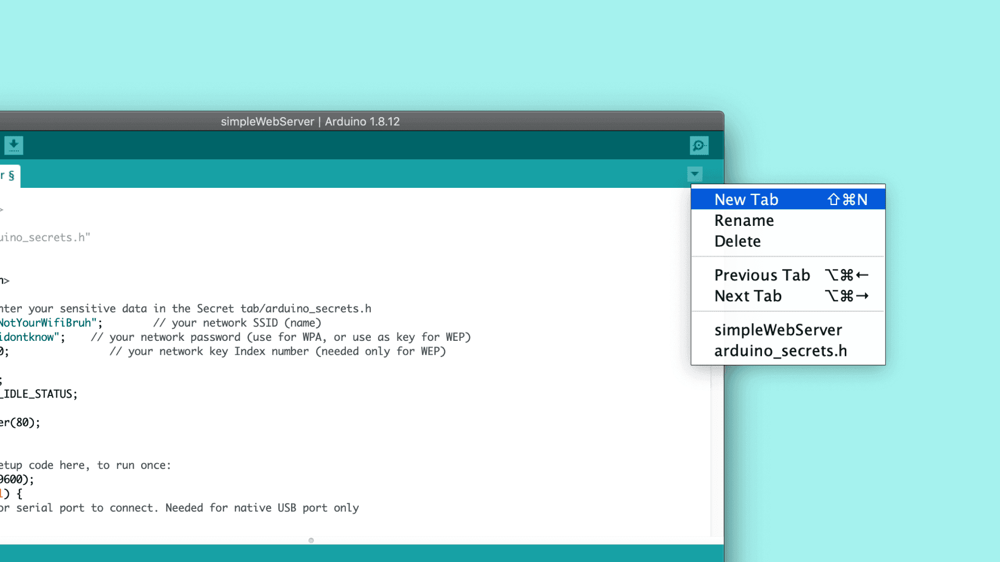

Name the file **arduino_secrets.h** and click OK.

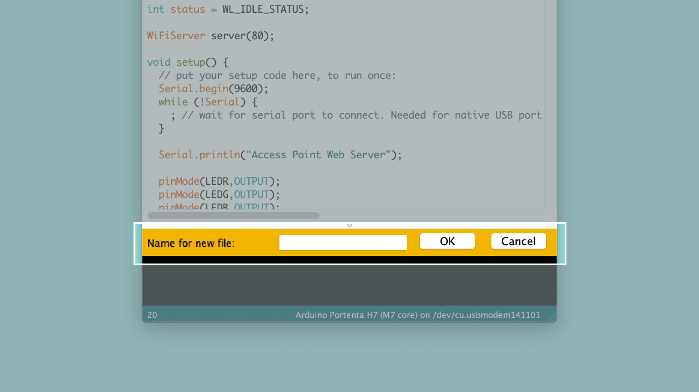

Once you have created the new tab, you will see an empty page in the IDE. Define two constants `SECRET_SSID`  and `SECRET_PASS` that will hold the name of the Wi-Fi network and the corresponding password. Add the following lines to your **arduino_secrets.h** file:

```cpp
# define SECRET_SSID "PortentaAccessPoint"
# define SECRET_PASS "123Qwerty"
```

***The SSID (PortentaAccessPoint) and password (123Qwerty) are placeholder strings made for this tutorial. For security reasons you should rename them to something memorable but not easy to guess. Keep in mind that the password must be at least 8 characters long.*** 

In order to access the `SECRET_SSID` and `SECRET_PASS` constants in the **simpleWebServer.ino** sketch file, the header file that you have just created needs to be included. In your sketch file this has already been taken care of by the following line at the beginning of the sketch: 

```cpp
# include “arduino_secrets.h”
```

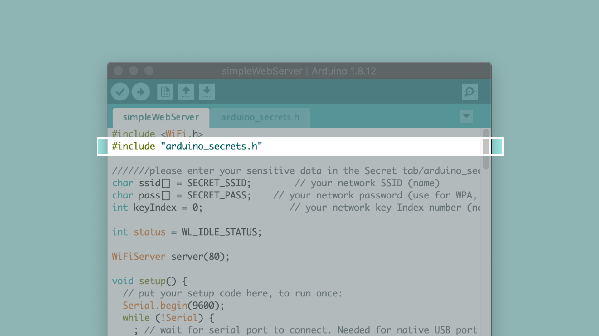

### 4. Upload the Code

Select the **Arduino Portenta H7 (M7 core)** from the **Board** menu and the port the Portenta is connected to. Upload the **simpleWebServer.ino** sketch. Doing so will automatically compile the sketch beforehand.

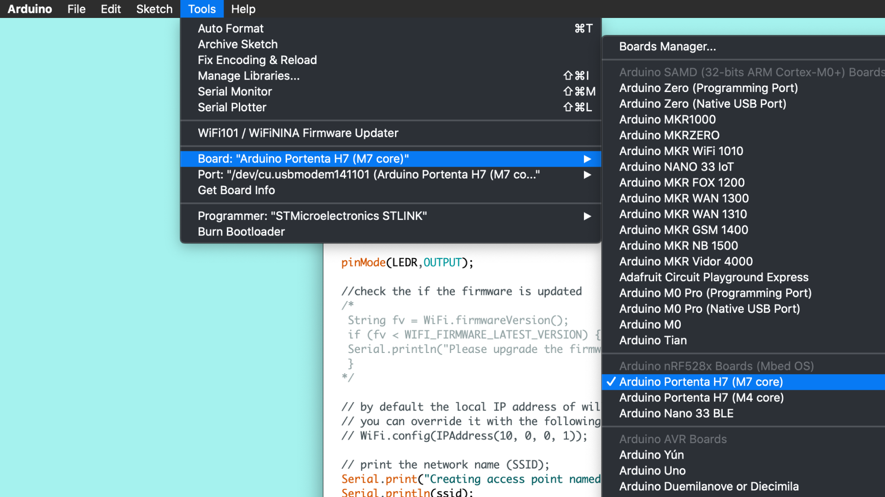

Once you have uploaded the code, open the Serial Monitor. You will be able to see the IP address of the access point. You will also see the message, `Device disconnected from AP` which means there are no devices connected to the Access point yet.  

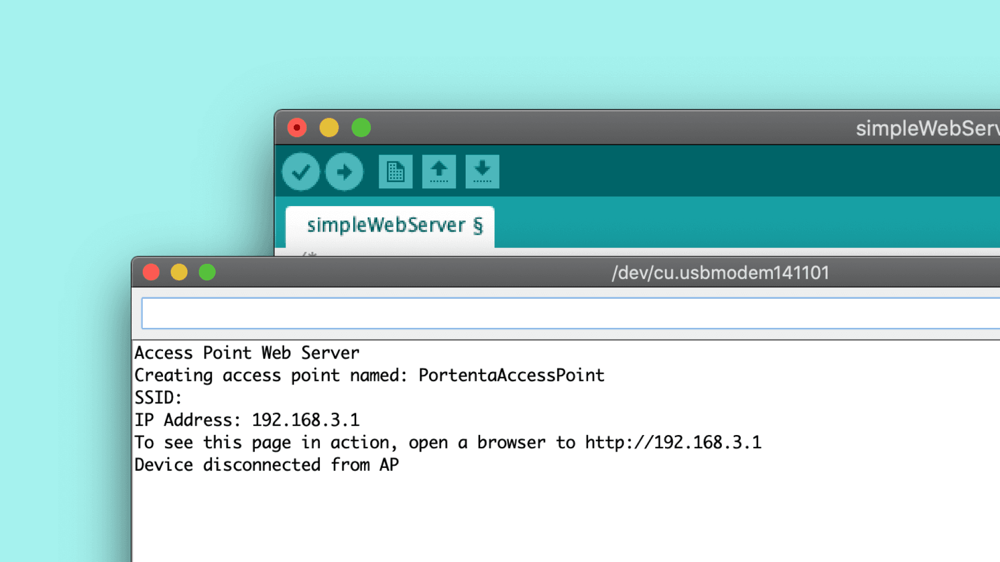

### 5. Connecting to the Portenta Access Point

Once the access point is active and ready to be connected with external devices, you will be able to find the **PortentaAccessPoint** on the list of networks on your mobile device. Once you have entered the password you have defined earlier, your smart phone will connect to access point. 

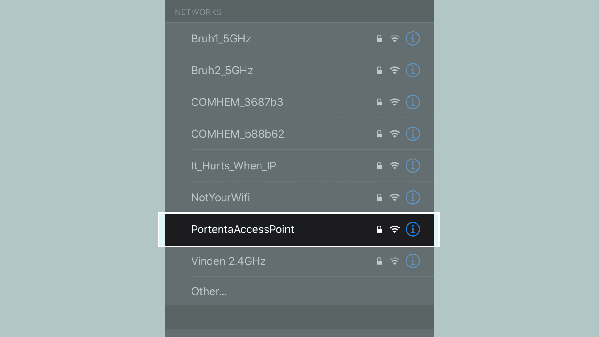

Now open a browser window on your mobile device and copy & paste the URL containing Portenta’s IP address that is displayed on the serial monitor. 

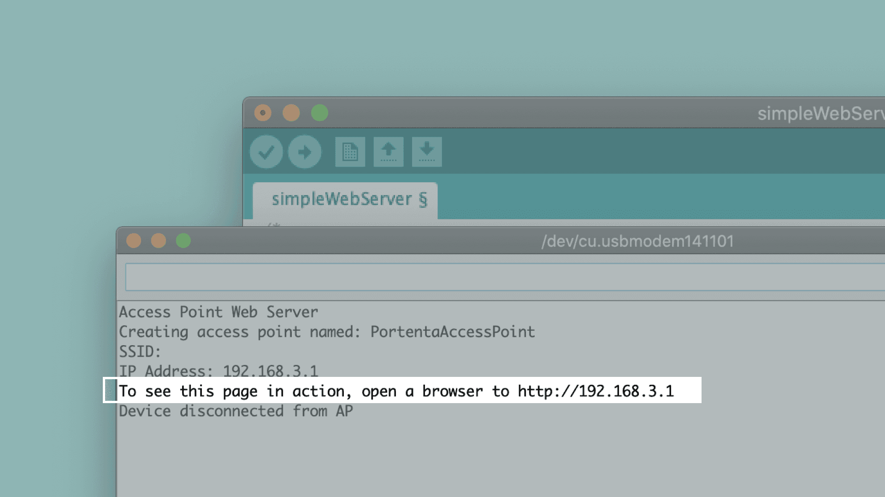

Once you have entered the URL, the client sends a GET request to the web server to fetch the HTML web page specified in the code. Once loaded, you will see the web page in your mobile browser. 

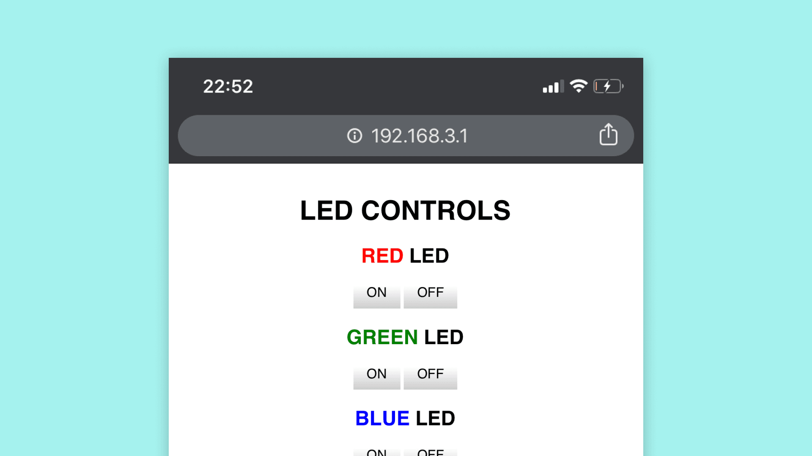

### 6. Access the Board From Your Mobile Device

If you take a look at the Serial Monitor, you can see the details of the HTTP GET request and other details of the device connected to the access point. The GET request is always in the following format: 

```
GET URL HTTP/1.1
```

The URL is a string of characters sent to the server, in this case /Hx (where x stands for the color of the LED). This request containing the URL is received on the server and it replies with the following HTTP/1.1 response indicating that the connection was successful:

```
HTTP/1.1 200 OK
```

Once the server has responded to this request, it closes the connection and continues listening to next GET requests. 

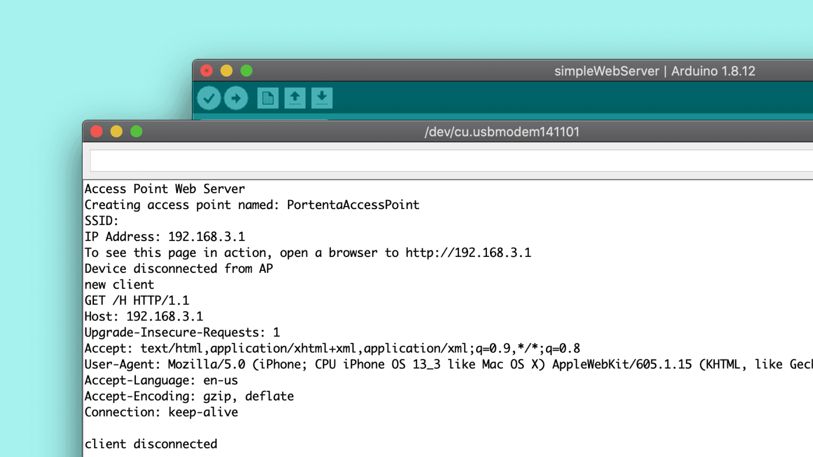

You are now be able to toggle the states of the red, green and blue LED through the buttons displayed on your mobile browser. Every time you press a button, the client sends a GET request to a URL in the format /Hx or /Lx ,where x can be ‘r’, ‘g’ or ‘b’, depending on the button pressed on the HTML page. The web server then reads the URL requested by the client, changes the state of the LED corresponding to the URL and closes the connection. 

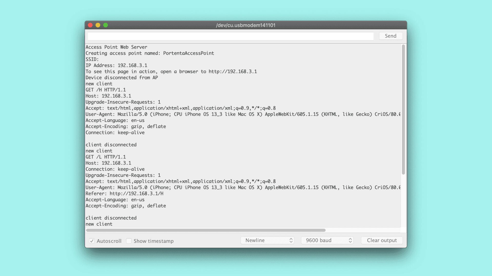

## Conclusion

This tutorial shows one of the several capabilities of the on-board WiFi+Bluetooth® module by configuring the board as an access point and setting up a web server. You have also learnt how a simple client-server model and the underlying HTTP requests and responses work. 

### Next Steps 

Now that you have learnt how to set up a board as an access point and understand the client-server model, start experimenting with the **simpleWebServer.ino** sketch. This sketch can be tweaked in a variety of ways based on your needs. For example, you can add a slider to the HTML page that changes the blink rate of the built-in RGB LED from your mobile device.
