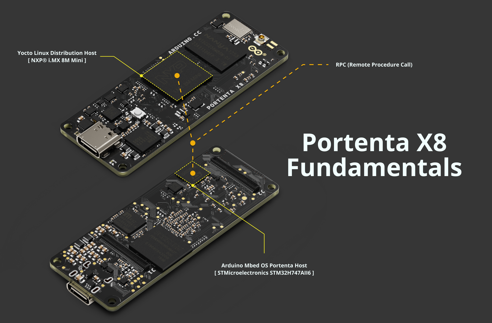
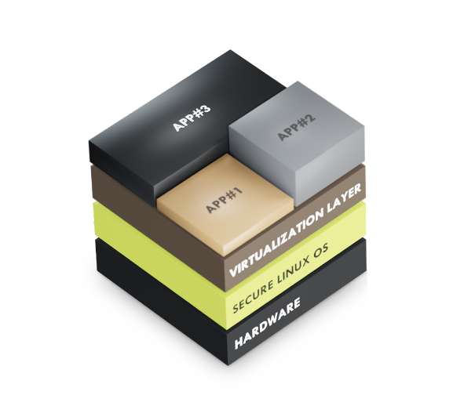

## Overview

The **Portenta X8** is one of the most advanced boards available from Arduino, introducing new concepts not typically found in other Arduino boards.

In this article, we will cover the foundations of the Portenta X8, helping you understand how it works and how you can leverage its advanced features. You will learn about FoundriesFactory® and how containers on the Portenta X8 work.

## Goals

- Understand how the Portenta X8 works
- Learn how containers work on the Portenta X8

### Required Hardware and Software

- [Portenta X8](https://store.arduino.cc/portenta-x8)
- [USB-C® cable (USB-C® to USB-A cable)](https://store.arduino.cc/products/usb-cable2in1-type-c)
- [fioctl](https://docs.foundries.io/latest/getting-started/install-fioctl/index.html)

## Portenta X8: Linux & Arduino Interoperability

The Portenta X8 runs on a **Yocto-based Linux distribution** with built-in support for Docker containers. It allows users to upload sketches to the M4 core of the STM32H7 using the Arduino IDE.

While the process may be familiar to Arduino users, the Portenta X8 uses a service called `monitor-m4-elf-file.service`. This service monitors a specific directory for updated sketches. It flashes the M4 core with new code via OpenOCD, providing a seamless integration between the Linux and Arduino environments on the board.

Additionally, the Portenta X8 uses **Remote Procedure Call (RPC)** mechanisms to enable communication between the Linux system and the Arduino cores. Through RPC, data can be exchanged between the M4 and M7 cores, with the M7 core managing data transfers between the M4 core running Arduino sketches and the Linux environment.

The communication uses **MessagePack-RPC**, a lightweight protocol for serialized data transfer, supporting protocols such as OpenAMP, SPI, and TCP/IP. This setup provides solid interaction between Linux-based processes and Arduino sketches without the typical complexity of dual-core processing.

The Portenta X8 provides a powerful and flexible platform by integrating Linux capabilities with Arduino's ease of use. Users can deploy and manage device independent applications using Docker containers while benefiting from Arduino’s rich ecosystem for embedded development. This hybrid environment makes it ideal for complex, multifunctional projects.

If you need help setting up your board, please refer to the [**Portenta X8 User Manual**](https://docs.arduino.cc/tutorials/portenta-x8/user-manual) to learn the basics and get started with your Portenta X8.

## Embedded Linux

**Embedded Linux** refers to embedded systems using the Linux kernel and other open-source components. Linux is widely used in embedded devices due to its open-source nature and availability.

An **Embedded Linux** system consists of the following components:

* **Bootloader**: This is the first program executed after powering the board. It initializes the hardware and loads the operating system, including the **device tree**, which provides information on hardware components and forwards it to the kernel.

  The **device tree** is a database containing information on the hardware components of the board, which is used to forward information from the bootloader to the Kernel at the hardware level.

* **Linux Kernel**: This is the core of the operating system. It deals with resource management, scheduling, hardware access and all the low-level operations the user does not want to worry about.

  In particular, the Linux Kernel manages all the hardware resources, like CPU, memory, and I/Os, and it provides a set of APIs that abstracts those resources, allowing the user applications and libraries to be easily deployed.

* **Root Filesystem**: This contains system programs, utilities, configurations, and user data. It is equivalent to the `C:` drive on Windows in broad terms. On the Portenta X8, the root filesystem can be mounted from a USB, SD card, or flash memory.

When working with Linux-based embedded devices, you need to provide a base distribution, a mechanism for updates, and applications running on the board. The Portenta X8 uses a Linux distribution built with the Yocto Project® as the base platform, with applications installed as containers.

Using a pre-packaged Linux distribution may seem convenient, but it can lead to challenges when specific functionality or updates are needed. On the other hand, a generic distribution may be more customizable but might introduce conflicts during updates or require extra software that could cause inefficiencies.

### Linux Yocto Distribution

A Linux distribution consists of the Linux kernel, GNU tools, additional software, and a package manager. More than 300 Linux distributions exist, including Ubuntu, Debian, Fedora, and Red Hat as examples.

The Portenta X8 uses a [Yocto Linux distribution](https://www.yoctoproject.org/), built using [OpenEmbedded (OE)](http://www.openembedded.org/wiki/Main_Page) and [BitBake](https://docs.yoctoproject.org/bitbake/) to generate a full Linux image. BitBake and OE are combined to form the Yocto reference project, historically called [Poky](https://www.yoctoproject.org/software-item/poky/).

In addition, a full metadata selection is defined to select which tasks to perform. The following metadata is used in a Yocto project:

* **Recipes**: They deliver information regarding each package (e.g., author, homepage, license, etc.), recipe version, existing dependencies, source code location and how to retrieve it, configuration settings, and the target path where the created package will be saved. Files with the **`.bb`** extension are recipe files.

* **Configuration file**: These files contain metadata that defines how to perform the build process. They (with the **`.conf`** file extension) determine the configuration options for the machine, the compiler, the distribution, and general and user configurations.

  They allow you to set the target where you want to create the image and where you want to save the downloaded sources and other particular configurations.

* **Classes**: Class files with the extension **`.bbclass`** contain common functionalities that can be shared between various recipes within the distribution. When a recipe inherits a class, it also inherits its settings and functions.

* **File append**: With the extension **`.bbappend`**, File append extends or overwrites information for an existing recipe.

OpenEmbedded Core contains a recipe layer, classes, and associated files common to all OE-based systems, including Yocto. This metadata set is maintained by both the Yocto project and the OpenEmbedded project.

The Yocto distribution is a development environment that comprises various functional areas, as shown in the figure below.

Yocto allows metadata separation using **layers**, enabling modular development by isolating specific configurations or features.

* **Layer:** The layers allow you to separate metadata by differentiating them according to software, hardware information, metadata concerning distribution, and adopted policies. Within each layer are the `conf` (with layer-specific configuration files) and `recipes-` directories. To illustrate how to use layers to maintain modularity, consider the example of recipes to support a specific target, which usually resides in a BSP layer.

  In this scenario, those recipes should be isolated from other recipes and supporting metadata, like a new Graphical User Interface (GUI). You would then have a couple of layers: one for the machine's configurations and one for the GUI environment. This would allow a specific machine to present special GUI features within the BSP layer without affecting the recipes inside the GUI layer itself. All of this is possible via an append file.

* **Source file:** To cross-compile any software module, be it a distribution or an application, we must have access to various source files. The latter can be sourced from three different upstream areas: Upstream Project Releases (archived at a specific location), Local Projects (available at a certain local path), and Source Control Managers (like GitHub).

* **Package feeds:** This area contains packages generated by the build system, which will be used later to generate operating system images or Software Development Kits (SDKs).

* **Build System:** The Build System macroblock is the heart of the Yocto distribution. It contains various processes controlled by BitBake, a tool written in Python. The Build System parses the metadata, extracting the list of tasks to be performed. BitBake checks the software build process using the recipes. It writes a *stamp* file in the Build Directory for each completed task.

* **Images:** They are compressed forms of the Root Filesystem, ready to be installed on the target. BitBake releases multiple lists of images saved into the Build Directory, including *kernel-image*, *root-filesystem-image*, and *bootloaders*.

* **SDK:** The SDK generation process can produce a standard or extensible SDK. In both cases, the output is an SDK installation script, which installs a cross-development toolchain, a set of libraries, and header files and generates an environment setup script. The toolchain can be considered part of the build system. In contrast, libraries and headers are target parts since they are generated for the target hardware.

***If you want to learn more about how to work with Yocto Distribution on your Portenta X8, please check the [Portenta X8's user manual](https://docs.arduino.cc/tutorials/portenta-x8/user-manual/#working-with-linux) of this user manual.***

### Docker Containers

The Portenta X8 allows flexible, device independent software deployment through a modular container architecture powered by Docker containers. Containers offer a way to package software with all its required dependencies, such as libraries, frameworks, and configuration files, into a self-contained unit.

This packaging guarantees consistency in how software behaves, regardless of the base computing environment, whether it is a local machine, server, or cloud platform.

To understand containers, it is helpful to compare them to traditional virtualization. Traditional virtual machines (VMs) run an entire operating system on top of a host system, with each VM requiring its resources and environment, leading to overhead.

Containers take a different approach by virtualizing parts of the system while sharing the base host operating system. This lightweight approach means containers use fewer resources and have faster start-up times than full VMs, allowing scaling and rapid deployment.

The concept of containers has changed software development and deployment practices. Some key benefits of using containers include:

- **Simplified Development, Testing, and Deployment**: By decoupling applications from the base infrastructure, containers allow consistent behavior across various software lifecycle stages. Developers can ensure their code behaves identically in development, testing, and production environments.

- **Version Control and Easy Rollbacks**: Containers can be versioned, making it easy to roll back to previous states if updates introduce errors or issues. This flexibility is a valuable feature for maintaining stable software environments.

- **Isolation and Security**: Containers run applications in isolated environments, reducing interactions with other containers or the host system. This separation enhances security by reducing the top layer for potential attacks.

- **Granularity and Modularization**: Containers provide the capability to isolate specific components of an application. For example, different microservices of a larger application can be nested in individual containers. This approach improves control, scalability, and performance adjustment.

#### Portenta X8 & Docker Containers

The Portenta X8 leverages Docker for containerization. Docker uses **Linux Containers (LXC)** to create lightweight, isolated environments. With Docker, users can access various tools for building, running, and managing containers. These include:

- **Dockerfile**: A script that defines the instructions to build a container image. This image is a snapshot of the software and its environment.

- **Docker Daemon**: A service running on the host machine that manages container operations, such as starting, stopping, and networking.

- **Docker Swarm and Kubernetes**: Tools for managing containers at scale, allowing robust deployment strategies and automation across multiple systems.

#### Portability and Security

Docker containers ensure that applications remain portable. Because the container bundles everything it needs, it can be moved between machines and cloud environments without modification. This portability makes it easy to deploy and scale applications wherever needed.

Furthermore, container isolation protects applications by preventing security threats from spreading between containers or affecting the host system. This ensures a secure, robust operating environment.

### Benefits of Containers

For example, if you are developing an application on a laptop and your environment has a specific configuration. Other developers may have slightly different configurations. The application will rely on your configuration and depend on specific files, libraries, and dependencies. On the other hand, your business has development and production environments with their configurations and supporting files. You would want to emulate that environment as much as possible locally.

With containers, you can make your app work across environments, pass quality assurance and deploy as fast as possible effortlessly.

The container image contents can be compared to installing a Linux distribution complete with RPM packages, configuration files, etc. However, a container image distribution is easier to install than setting a whole new copy of the operating system.

A Linux container is a good solution that requires portability, configurability, and isolation. The idea behind Linux containers is to help develop solutions faster to meet business needs as they arise. In certain scenarios, when real-time data streaming is implemented, containers are a dominant solution to provide the scalability that the application needs. Regardless of the infrastructure on-site, in the Cloud, or a mix of both.

#### Docker Containers in Action

Docker images contain multiple read-only layers that package all necessary files to configure a container. These layers are built using a **dockerfile ** containing the commands required to build the image. Containers can then be launched from the image, with any changes being written to a thin, writable layer, ensuring the original image remains unchanged. 

Containers go through various states during their lifecycle, including **Created**, **Running**, **Paused**, **Stopped**, and **Deleted**, depending on their activity and status. Docker's command-line tools, such as `docker run`, `docker ps`, and `docker stop`, allow you to manage containers efficiently.

Docker's isolation model means that containers run independently of each other, providing additional security and minimizing the risk of cross-container issues. This portability ensures that once a container is created, it can be moved and run on any environment without reconfiguring the application, streamlining the deployment process.

### Portenta X8 Manager

With Arduino Cloud's integration with **Foundries.io** via the **Portenta X8 Manager**, you can create a **Foundries.io Factory** to manage Portenta X8 devices and containers as an optional feature. A *Factory* helps manage, organize, and update devices while simplifying container deployment and team management.

***__Using Foundries.io and its features, including the Portenta X8 Manager, is optional and not required for the Portenta X8 to function.__ It is an enhancement option designed to simplify development, provide secure over-the-air updates, and add additional management capabilities.***

***For more information on configuration and environment exploration, please refer to the [Portenta X8 Board Manager](https://docs.arduino.cc/tutorials/portenta-x8/user-manual/#portenta-x8-board-manager) section of the [Portenta X8 User Manual](https://docs.arduino.cc/tutorials/portenta-x8/user-manual/).***

#### Benefits of Foundries.io

Foundries.io has developed a custom Linux distribution based on Yocto. It is designed with minimal software installed by default, making it ideal for professional applications. Foundries.io emphasizes cybersecurity, integrating features such as **OP-TEE** and **OSTREE**, which ensure system integrity and security.

One key advantage of Foundries.io is its **Over-The-Air (OTA)** system update mechanism. This OTA system is based on a client running on the target device and a robust cloud server, allowing seamless updates.

Foundries.io also integrates **Docker Compose** to deploy software solutions. Instead of installing individual apps, entire containers are deployed, which may run a full distribution or just the minimal environment needed to run a particular set of applications, similar to an app store but based on containers.

In summary, it provides:

- Minimal preinstalled software, ideal for professional applications.
- Enhanced cybersecurity features like **OP-TEE** and **OSTREE**.
- **Over-The-Air (OTA)** system updates.
- Integration with **Docker Compose** to deploy entire containers for applications.

Foundries.io also offers **FoundriesFactory**, a Cloud-based *DevSecOps* subscription service. It allows you to build, test, deploy, and maintain secure IoT and edge devices. Each Factory has a unique ID and automatic builds of the base system and containers are handled in one place, streamlining the development process and ensuring a secure, up-to-date environment for your IoT and Edge devices.

#### Factory Repositories

The Factory uses four main repositories to customize images:

- **ci-scripts.git**: Defines build jobs for the continuous integration system.
- **lmp-manifest.git**: Specifies the platform’s image layers.
- **meta-subscriber-overrides.git**: Customizes the Factory image by adding or removing packages and implementing board-specific features.
- **containers.git**: Defines containers and how they should be orchestrated using Docker or `docker compose`.

Foundries.io simplifies container management by building images with the Yocto Project and **Linux microPlatform (LmP)**, optimized for IoT.

#### Managing Containers in the Factory

Through the Factory, you can monitor connected devices, track the containers running on them, and manage different versions of these containers. Each time a repository is updated, the continuous integration system generates a new target that can be deployed on your Portenta X8 devices.

Foundries.io simplifies container management, building images using the Yocto Project and their **Linux microPlatform (LmP)** distribution, which is optimized for IoT and embedded systems. LmP contains an extensive set of components designed for IoT applications, allowing for fast, consistent deployments across different environments.

#### Managing Devices with **fioctl**

The Foundries.io tool *fioctl* enables command-line management of your devices, allowing you to upload containers, push updates, and deploy new applications seamlessly. It simplifies the deployment process across multiple devices, ensuring smooth integration and management of containers within your Factory.

## Arduino Environment

The user can upload sketches on the **M4 core** of **STM32H7** through the **Arduino IDE 1.8.10 or above**.

To do that, it is sufficient to open the Arduino IDE, make sure you have selected the Portenta X8 in the board selector, and start writing your sketch.

***Have a look at [this section](https://docs.arduino.cc/tutorials/portenta-x8/user-manual/#portenta-x8-with-arduino-ide) from the Portenta X8 user manual if you would like to start uploading your sketch on Portenta X8.***

From a user perspective, the process may appear the same as for other Arduino boards, but there are significant differences in what happens behind the scenes: the Portenta X8 includes a service that waits for a sketch to be uploaded to a folder. This service is called `monitor-m4-elf-file.service`.

It monitors the directory `/tmp/arduino/` looking for an updated version of the `m4-user-sketch.elf`. Each time it detects a new file, it proceeds to flash the M4 with the new sketch using `openOCD` (check [openOCD website](https://openocd.org/doc/html/About.html) if you want to learn more).

## Communication Between Linux and Arduino

The Portenta X8 has two processors that need to exchange data. This is accomplished using **RPC (Remote Procedure Call)**.

RPC is a method where a program on one computer triggers a procedure or function on another computer. Simply put, RPC allows a program to run functions on a different system accessible through a network.

A key feature of RPC is transparency. The remote procedure call should appear like a local one, meaning the network communication details are "hidden" from the user.

RPC works well in distributed computing environments, particularly with the client-server model. The *procedure call* acts as a *request* from the client, and the returned result is the *response* from the server. Distributed computing connects multiple computers over a network (often the Internet) to handle large computational tasks.

While RPC aims to make remote procedure calls feel as seamless as local ones, there are always potential network communication issues that can fail. As a result, different RPC implementations may handle these challenges in various ways. For example, some use *at most once* semantics, ensuring that it won’t be executed multiple times if a remote procedure call fails. Others use *at least once* semantics, ensuring the procedure is executed at least once, though it might run more than once.

There are several types of RPC implementations. For the Portenta X8, **MessagePack-RPC** is used (you can check out more details in the [library repository](https://github.com/msgpack-rpc/msgpack-rpc)). This implementation uses MessagePack, a data serialization format, to encode the exchange data.

This data is transported over different protocols:

- OpenAMP via Shared Memory
- SPI
- Linux Char Device
- TCP/IP

As shown in the image, the **M7 core** of the **STM32H7** facilitates communication between the Linux environment and the Arduino side. If an Arduino sketch runs on the **M4 core**, the **M7 core** transfers data and requests between the M4 core and the Linux system. Due to this hardware setup, the Portenta X8 does not support traditional dual-core processing.

On the Linux side, a service called `m4-proxy` sends data between the two systems.

The communication process between Arduino and Linux works like this (refer to the image below):

- A program registers as the RPC server on a specific port for a list of procedures the M4 core might call.
- `m4-proxy` forwards the calls from the M4 core to the appropriate program and port.

## Conclusion

In this tutorial, we explored the Portenta X8's features, including its integration with factories and containers through Foundries.io and its dual-core architecture, enabling communication between Linux and Arduino environments.

The Portenta X8 offers versatility for professional IoT and edge applications by combining Docker containers for Linux-based processes with the Arduino IDE for real-time tasks on the M4 core. This hybrid approach, built-in cybersecurity, and over-the-air updates provide a secure and efficient development environment.

To see these concepts in action, explore our other [tutorials](https://docs.arduino.cc/hardware/portenta-x8/#tutorials), which demonstrate practical applications of factories and containers with the Portenta X8.
