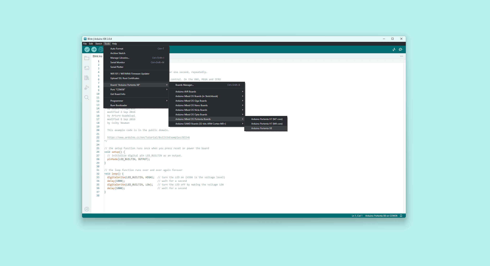
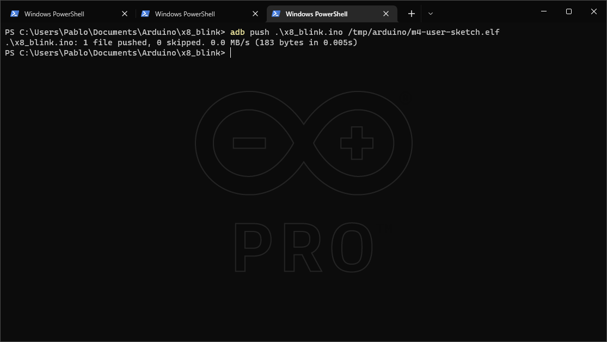

## Overview

In this tutorial, we will go through the process of uploading sketches to the M4 core on the STM32H747XI MCU. For the user, the process is the same as usual but it differs quite a bit in regards to what happens behind the scenes compared to other Arduino boards.

## Goals

- Learn how to use the Arduino IDE to compile and upload a sketch
- Learn how to compile the sketch binaries with the Arduino IDE and upload them manually via ADB

### Required Hardware and Software

- [Portenta X8](https://store.arduino.cc/products/portenta-x8)
- USB-C® cable (either USB-A to USB-C® or USB-C® to USB-C®)
- [Arduino IDE 1.8.10+](https://www.arduino.cc/en/software), [Arduino IDE 2](https://www.arduino.cc/en/software), or [Arduino CLI](https://github.com/arduino/arduino-cli)
- Latest "Arduino Mbed OS Portenta Boards" Core

## Instructions

### Standard Arduino IDE Upload

It is a straightforward process to upload to M4 Core using Arduino IDE. You will have to select the Portenta X8 in the board selector inside the Arduino IDE.



Create a custom sketch or open one of the example sketches. For example, we will use the blink sketch:

```arduino
void setup(){
  pinMode(LED_BUILTIN ,OUTPUT);
}

void loop(){
  digitalWrite(LED_BUILTIN , HIGH);
  delay(1000);
  digitalWrite(LED_BUILTIN , LOW);
  delay(1000);
}
```

1. Select the port of your device in the port selector menu
2. Press the Compile and Upload button

The sketch gets compiled into a binary. That binary file is then uploaded to the Linux side of the Portenta X8 via an `adb` SSH connection. The flashing is done on the board itself by active service on Linux. When the sketch has been uploaded successfully, check if the onboard LED is blinking at an interval of one second.

### Upload Manually Using ADB

An alternative to using the standard Arduino IDE upload procedure is by uploading the sketch manually using ADB. First, we need to compile the sketch. In the Arduino IDE, select "Export compiled binary" from the Sketch menu. It will compile the sketch and save the binary file in the sketch folder. Alternatively, you can use the [Arduino CLI](https://arduino.github.io/arduino-cli/) to create an `elf` file.

To upload the firmware, you can use the ADB tool that has been installed as part of the Portenta X8 core. It can be found at `Arduino15\packages\arduino\tools\adb\32.0.0`.

From that directory, you can use the `adb` tool. To upload your compiled sketch, you will need to use the following command:

```
adb push <sketchBinaryPath> /tmp/arduino/m4-user-sketch.elf
```



## How Does It Work?

The Portenta X8 has a service that waits for a sketch to be uploaded to a folder. If it detects changes, the device will flash the M4 with the uploaded firmware. This works thanks to the following service:

* **monitor-m4-elf-file.service**: this service monitors the directory `/tmp/arduino/m4-user-sketch.elf` and each time it detects a new file, it will proceed to flash the M4 using `openOCD` with the sketch that has been pushed.

## Conclusion

In this tutorial, you have learned how to upload a sketch to the M4 core, by using the standard Arduino IDE procedure and manually with ADB. Now for example you can connect an I<sup>2</sup>C sensor and interact with it.

## Troubleshooting

- If you cannot use the `ADB` tool and the folder `Arduino15\packages\arduino\tools\adb\32.0.0` is empty, remove the Mbed Portenta Core and install it again.