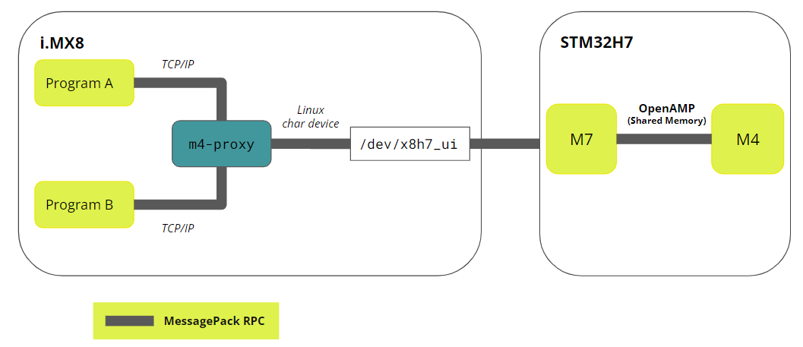
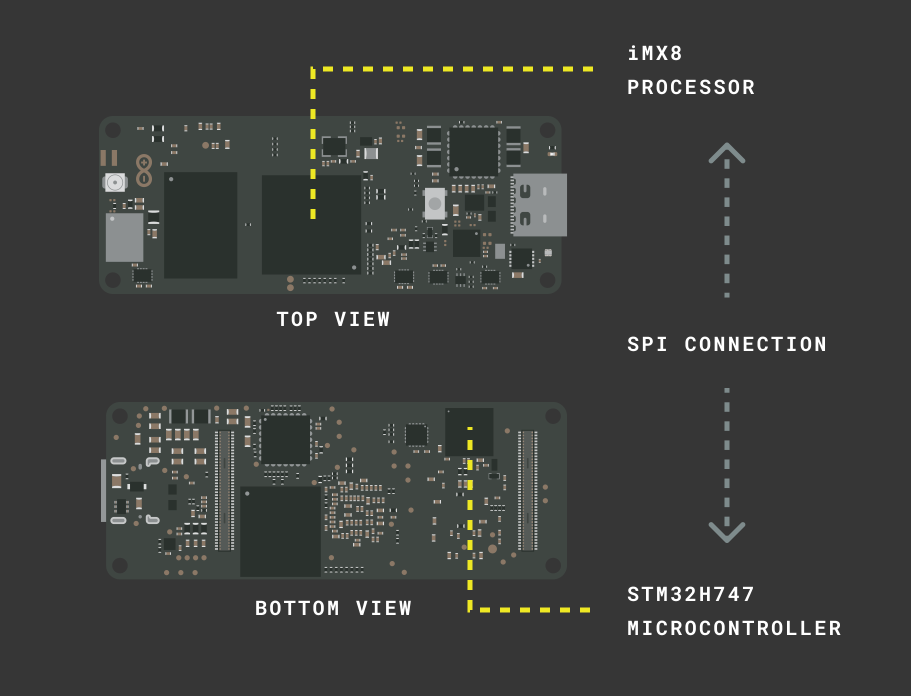
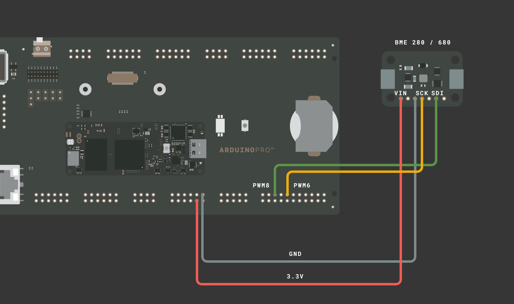

## Overview

The container infrastructure provided by Arduino contains a pre-built Python® image that you can use to run Python® applications on the Portenta X8. In this tutorial, we are going to build a container based on a provided one.

While all the peripherals are accessible from the iMX8 processor running the Linux environment, it can be useful to let the onboard microcontroller take care of certain peripheral handling and exchange only the required data between the microcontroller and the Python® application.

You will be guided on how to achieve this setup. It is recommendable to familiarize yourself with the foundational elements of the Portenta X8 and its infrastructure by reading [fundamentals of the Portenta X8](https://docs.arduino.cc/tutorials/portenta-x8/x8-fundamentals) if you have not already done so.

## Goals

- Learn how the RPC mechanism on the X8 works
- Learn how to exchange sensor data between Linux and an Arduino sketch
- Learn how to modify a container and run it
- Learn how to use commands to debug the container and service infrastructure

### Required Hardware and Software

- [Portenta X8](https://store.arduino.cc/products/portenta-x8)
- [Portenta breakout](https://docs.arduino.cc/hardware/portenta-breakout)
- Any sensor (in this example, we will use an [BME680](https://www.bosch-sensortec.com/products/environmental-sensors/gas-sensors/bme680/) I<sup>2</sup>C module)
- [Arduino IDE 1.8.10+](https://www.arduino.cc/en/software), [Arduino IDE 2](https://www.arduino.cc/en/software), or [Arduino Cloud Editor](https://create.arduino.cc/editor)

## Remote Procedure Call - RPC

**REWORK THE TEXT**

The two processors inside Portenta X8 need a communication mechanism to exchange data. The communication mechanism is called **RPC (Remote Procedure Call)**.

The expression RPC refers to activating a "procedure" or "function" by a program on a computer other than the one on which the program is executed. In other words, RPC allows a program to execute procedures "remotely" on "remote" computers (but accessible through a network).

The idea of transparency is also essential to the concept of RPC. The remote procedure call must be performed in a way similar to that of the traditional "local" procedure call; the details of the network communication must, therefore, be "hidden" (i.e., made transparent) for the user.

The RPC paradigm is particularly suitable for distributed computing based on the client-server model: the "call procedure" corresponds to the "request" sent by the "client," and the "return value" of the procedure corresponds to the "response" sent by the "server." Distributed computing uses the resources of several computers connected to a network (usually via the Internet) to solve large-scale computational problems.

Although the ultimate goal of the RPC paradigm is to provide a remote procedure call mechanism whose semantics are essentially equivalent to that of the local procedure call (hence the aforementioned transparency of the mechanism), this equivalence is never fully achieved due to difficulties that can arise in network communication (always subjected to failure).

Since there is no single obviously "right" way to handle these complications, RPC mechanisms can differ subtly in the exact semantics of the remote call. Some mechanisms, for example, have "at most once" semantics: in other words, a remote procedure call can fail (i.e., not be executed), but it is guaranteed not to result in multiple activations.

The opposite approach is represented by the "at least once" semantics, which guarantees that the procedure is called at least once (it could therefore happen that it is activated several times).

As a consequence, there are multiple types of RPC implementations. In the case of Portenta X8, **MessagePack-RPC** is used (check the [library repository](https://github.com/msgpack-rpc/msgpack-rpc) to get more details). It is an RPC implementation that uses MessagePack as a serialization protocol, i.e., data exchange is encoded in MsgPack format.

It is transported over different protocols:

* OpenAMP via Shared Memory
* SPI
* Linux Char Device
* TCP/IP



As you can see in the image above, the **M7 core** of **STM32H7** simplifies communication between the Linux and the Arduino environments. If an Arduino sketch runs on the **M4 core**, the **M7 core** will hand over any data/request between the M4 core and the Linux side. Due to this hardware design, traditional dual-core processing is not supported in the Portenta X8.

At the same time, on the Linux side, a service sends data between the two worlds, `m4-proxy`.

So, the communication between Arduino and Linux side will proceed as follows:

* A program registers as the RPC server on port X for a list of procedures that the M4 may call
* `m4-proxy` will forward the calls from the M4 to the registered program/port


## Python® on the X8

Python® is a modern and powerful scripting language used for a wide range of applications. In this tutorial, we only read sensor data from an Arduino sketch, but you could extend the example and process the data further.

### Communication Between Linux and Arduino Sketches

The Python® script will run on the Linux side and therefore on the iMX8 processor. The Arduino sketch, on the other hand, will run on the STM32H747 microcontroller. It allows for real-time processing on the Arduino side while running a fully-fledged operating system on iMX8.

However, the two processors need a communication mechanism to exchange data with one another. **RPC (Remote Procedure Call)** is the communication mechanism for this task. To establish communication, the M7 core on the STM32H747 microcontroller is used to hand over any data/request to the M4 core. That means your Arduino sketch will solely run on the M4 core. Dual-core processing on the Arduino side is currently not supported.

On the Linux side, there is a service that takes care of sending data between the two worlds. It is called **`m4-proxy`**.

You can check if the service is running by logging into the X8 via `adb shell` and then executing the next command:

```bash
sudo journalctl -fu m4-proxy
```

If the service has stopped unexpectedly, you can restart it with the following command:

```bash
sudo systemctl restart m4-proxy
```

## The Arduino Sketch

The Arduino sketch to read sensor data doesn't look much different from an ordinary sketch. The only difference is that we expose the sensor data via RPC.

```arduino
RPC.bind("temperature", []{ return bme.temperature; });
RPC.bind("humidity", []{ return bme.humidity; });
RPC.bind("pressure", []{ return bme.pressure / 100.0F; });
RPC.bind("gas", []{ return bme.gas_resistance / 1000.0; });
RPC.bind("altitude", []{ return bme.readAltitude(SEALEVELPRESSURE_HPA); });
```

Two additional header files need to be included to enable the RPC mechanism on Portenta X8:

```arduino
#include <RPC.h>
#include <SerialRPC.h>
```

The `RPC.bind()` method makes the data available via the specified name e.g. "temperature". In our example, an anonymous function is created to return the corresponding sensor property whenever requested.

Alternatively, you could bind the name to an existing, named function instead. The data can then easily be requested using that name (e.g. "humidity") by querying the `m4-proxy` service. Once data is requested, it is packaged as a message and sent over SPI to the iMX8.



You can find the sketch in the software package [here](assets/python-sensor-rpc.zip). You may need to change the sketch depending on the choice of the sensor to read from. If you're using an I<sup>2</sup>C sensor, you can connect SCL to **PWM6** and SDA to **PWM8** on the Portenta breakout.

That is because the labeled I<sup>2</sup>C pins on the Portenta Breakout are only available on the Linux side. If you are using an analog sensor, you can connect it to any analog pin. Please refer to the pinout diagram on the Portenta Breakout [documentation page](/hardware/portenta-breakout).



Make sure you have installed the **Arduino Mbed OS Portenta Boards** core and upload the sketch to the X8 in the Arduino IDE or via Arduino CLI.

### Debugging the Arduino Sketch

To check if the Arduino sketch is working correctly, you may want to read the messages from the `Serial.println` statements. You cannot currently read them directly in the serial monitor of the Arduino IDE. Instead, you can use a simple service called **`py-serialrpc`**, which listens for those messages and prints them to the console.

This service needs to run on the Linux side of the X8. You can get the files [here](assets/py-serialrpc.zip). The compressed file will have every file needed to build a container as the docker compose app. From the command prompt of your local machine, navigate to the adb tool folder and upload the files to the X8 with command:

```bash
adb push <local directory path>/py-serialrpc /home/fio
```

Log into the X8 shell with `adb shell` and navigate into the `serialrpc` folder. Build the container using

```bash
sudo docker build . -t py-serialrpc`
```

The `-t` flag assigns a tag to the container. Then run the container by executing `cd..` and then:

```bash
sudo docker compose up -d
```

The `-d` flag detaches the container so it runs in the background. Note that this will run the docker compose app and have the container built persistently across reboots by registering it as a systemd service.

To stop the container, run:

```bash
sudo docker compose stop
```

Check if the container is running by executing:

```bash
sudo docker ps
```

You can then access the log of its service at any time by using following command from the **same directory**:

```bash
sudo docker compose logs -f --tail 20
```

If you do not wish to run the container in the background, skip the `-d` flag, you will get the console output directly in the executing shell. Once the container is running, you will see the messages being sent from the M4.

## The Python® Application

The Python® application requests the sensor data from the M4 over RPC and unpacks the message. Data can be requested by calling the function exposed over RPC on the M4 e.g.:

```python
m4_proxy_address = 'm4-proxy'
m4_proxy_port = 5001
rpc_address = RpcAddress(m4_proxy_address, m4_proxy_port)
rpc_client = RpcClient(rpc_address)
temperature = rpc_client.call('temperature')
```

The complete Python® application files are in the same package as the Arduino sketch (see above). Like in the previous step, upload the `python-sensor-rpc` folder to the Portenta X8 via:

```bash
adb push <local directory path>/python-sensor-rpc /home/fio
```

Log into the X8 via `adb shell`. Then navigate into the `python-sensor-rpc` folder and execute:

```bash
sudo docker build . -t python-sensor-rpc
```

When it has finished, you can run the container with:

```bash
sudo docker compose up
```

After a few seconds, you should see the output from the Python application featuring the sensor readings on the M4 that exchanges through the RPC mechanism. The output should look similar to the following:

```bash
python-sensor-rpc_1  | ============================================
python-sensor-rpc_1  | ==       Portenta X8 Sensor reading       ==
python-sensor-rpc_1  | ============================================
python-sensor-rpc_1  |
python-sensor-rpc_1  | Temperature:  25.904266357421875
python-sensor-rpc_1  | Humidity:  25.564695358276367
python-sensor-rpc_1  | Pressure:  976.4400024414062
python-sensor-rpc_1  | Gas:  136.496
python-sensor-rpc_1  | Altitude:  311.0769348144531
```

Whenever you change anything in the Python® script on your computer, you will have to resync and push the new script to the Portenta X8 and rebuild the container. Following command sequence will help you to do this process:

```bash
# On your computer
adb push python-sensor-rpc /home/fio
```

```bash
# On the Portenta X8
sudo docker compose down
```

```bash
# On the Portenta X8
sudo docker build . -t python-sensor-rpc
```

```bash
# On the Portenta X8
sudo docker compose up
```

Alternatively, you could modify the files directly on the X8 using an editor such as **VIM**, so you do not need to upload the files every time. Rebuilding the container will be necessary in any case though.

If you wonder how to specify the Python® script that is executed when running a container, have a look at the `Dockerfile` file. There you will find the `ENTRYPOINT` command that takes multiple arguments. In our example:

```python
ENTRYPOINT [ "python3", "m4_to_python.py"]`
```

## Conclusion

In this tutorial, you learned how to use the docker infrastructure to build a container that runs a Python® application. You have also learned how to use the RPC mechanism to exchange data between the microcontroller and the iMX8, which runs the Linux operating system.

### Next Steps

- You may further process the data you receive from the Arduino sketch and, e.g., upload it to a Cloud service or similar.
- Familiarize yourself with Docker commands to adjust the docker configuration to your needs.
