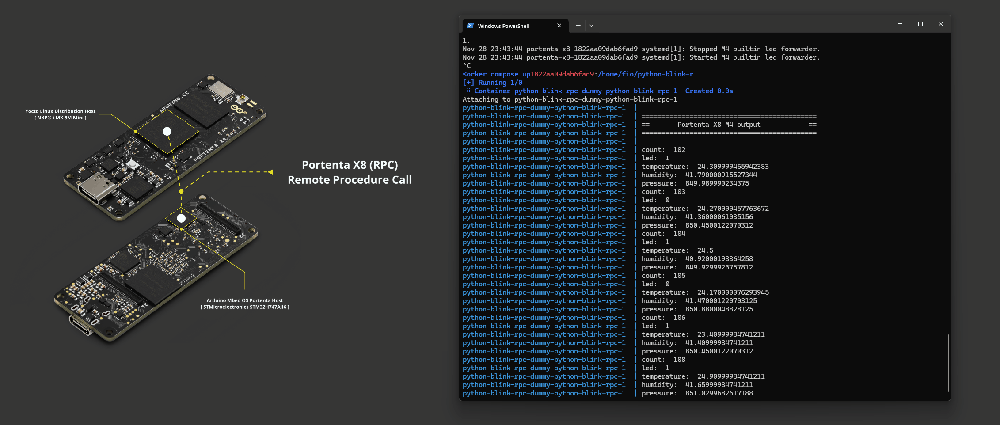
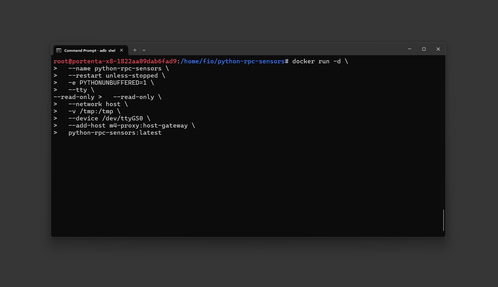
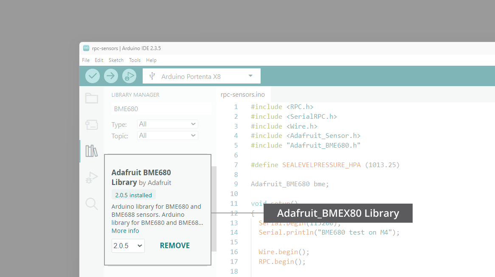
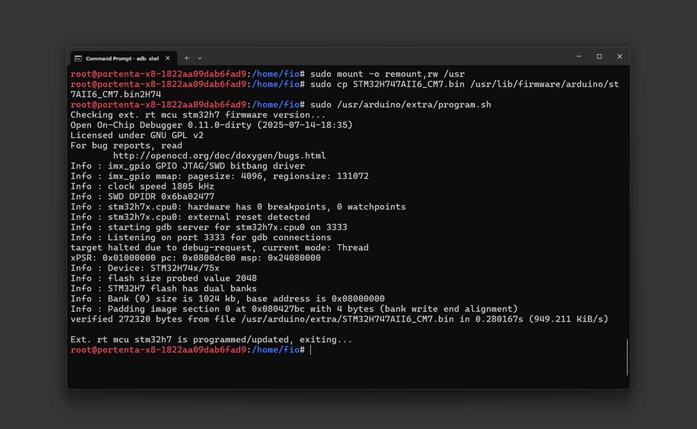

## Overview



The container infrastructure provided by Arduino includes a prebuilt Python® image you can use to run Python® applications on the Portenta X8. In this tutorial, we are going to build a container based on a provided one.

While all peripherals are accessible from the iMX8 processor running the Linux environment, it can be useful to let the onboard microcontroller handle certain peripheral operations and exchange only the required data between the microcontroller and the Python® application.

You will be guided on how to set up this. It is recommended to familiarize yourself with the foundational elements of the Portenta X8 and its infrastructure by reading [fundamentals of the Portenta X8](https://docs.arduino.cc/tutorials/portenta-x8/x8-fundamentals) if you have not already done so.

***Public Docker images are available on [Docker Hub](https://hub.docker.com/u/arduino) for simplified deployment.***

## Goals

- Learn how the RPC mechanism on the X8 works
- Learn how to exchange sensor data between Linux and an Arduino sketch
- Learn how to modify a container and run it
- Learn how to use commands to debug the container and service infrastructure

### Required Hardware and Software

- [Portenta X8](https://store.arduino.cc/products/portenta-x8)
- [Portenta breakout](https://docs.arduino.cc/hardware/portenta-breakout)
- Any sensor (in this example, we will use an [BME680](https://www.bosch-sensortec.com/products/environmental-sensors/gas-sensors/bme680/) I<sup>2</sup>C module)
- [USB-C® cable (USB-C® to USB-A cable)](https://store.arduino.cc/products/usb-cable2in1-type-c)
- [Arduino IDE 1.8.10+](https://www.arduino.cc/en/software), [Arduino IDE 2](https://www.arduino.cc/en/software), or [Arduino Cloud Editor](https://create.arduino.cc/editor)

## Remote Procedure Call - RPC

The two processors within the Portenta X8 require a communication mechanism to exchange data, known as an **RPC (Remote Procedure Call)**.

**RPC** allows a program to trigger a **`procedure`** or **`function`** on another computer over a network rather than locally. It lets a program execute procedures **remotely**, with the details of network communication hidden to maintain transparency, making the remote call appear similar to a local one.

It is particularly useful for distributed computing in a client-server model. The **`procedure call`** behaves as a **`request`** from the client, and the **`return value`** serves as the server's **`response`**. This model uses multiple computers connected over a network (often the Internet) to solve large computational tasks.

While RPC aims to closely replicate local procedure calls, complete equivalence is not possible due to network communication challenges that can cause failures. To manage these issues, different RPC mechanisms adopt distinct semantics:

- **`At most once` semantics** ensures that a remote call may fail, but will not be run multiple times.
- **`At least once` semantics** guarantees that the call is made at least once, even if it results in multiple activations.

The Portenta X8 uses **MessagePack-RPC** for its communication (see the [library repository](https://github.com/msgpack-rpc/msgpack-rpc-python) for details). *MessagePack-RPC* relies on *MessagePack* as the serialization protocol, encoding data in *MsgPack* format, and is supported over:

- OpenAMP via Shared Memory
- SPI
- Linux Char Device
- TCP/IP


In the image above, the **M7 core** of the **STM32H7** manages communication between the Linux and Arduino environments. If an Arduino sketch runs on the **M4 core**, the **M7 core** acts as an intermediary, handling data requests between the M4 core and the Linux environment. Due to this setup, traditional dual-core processing is not supported on the Portenta X8.

On the Linux side, a service called `m4-proxy` handles data transfer between Linux and Arduino.

The communication process works as follows:

- A program registers as the RPC server on port X, listing the procedures available for the M4 to call.
- `m4-proxy` then forwards the calls from the M4 to the appropriate program/port.


## Python® on the X8

Python® is a modern and powerful scripting language used for a wide range of applications. In this tutorial, we only read sensor data from an Arduino sketch, but you could extend the example and process the data further.

### Communication Between Linux and Arduino Sketches

The Python® script will run on the Linux side and therefore on the iMX8 processor. The Arduino sketch, on the other hand, will run on the STM32H747 microcontroller. It enables real-time processing on the Arduino side while running a fully-fledged operating system on the iMX8.

However, the two processors need a communication mechanism to exchange data. **RPC (Remote Procedure Call)** is the communication mechanism for this task. To establish communication, the M7 core on the STM32H747 microcontroller is used to transfer data or requests to the M4 core. That means your Arduino sketch will solely run on the M4 core. Dual-core processing on the Arduino side is currently not supported.

On the Linux side, a service handles sending data between the two worlds. It is called **`m4-proxy`**.

You can check if the service is running by logging into the X8 via `adb shell` and then executing the following command:

```bash
sudo journalctl -fu m4-proxy
```

If the service has stopped unexpectedly, you can restart it with the following command:

```bash
sudo systemctl restart m4-proxy
```

## Arduino Sketch: Sensor Data Over RPC

The Arduino sketch to read sensor data does not look much different from an ordinary sketch. The only difference is that we expose the sensor data via RPC.

```arduino
RPC.bind("temperature", []{ return 100; });
RPC.bind("humidity", []{ return 200; });
RPC.bind("pressure", []{ return 300; });
RPC.bind("gas", []{ return 400; });
RPC.bind("altitude", []{ return 500; });
```

Two additional header files need to be included to enable the RPC mechanism on Portenta X8:

```arduino
#include <RPC.h>
#include <SerialRPC.h>
```

The `RPC.bind()` method makes the data available under the specified name, e.g., "temperature". In our example, an anonymous function is created to return the corresponding sensor property whenever requested.

Alternatively, you could bind the name to an existing named function. The data can then be easily requested using that name (e.g., `humidity`) by querying the `m4-proxy` service. Once data is requested, it is packaged as a message and sent over SPI to the iMX8.


You can find the sketch and complete example available for download [here](assets/python-rpc-sensors.zip), or access the source code in the [GitHub repository](https://github.com/arduino/portenta-containers/tree/main/python-rpc-sensors). 

The example uses preset sensor values for demonstration. If you want to connect a real sensor, you may need to modify the sketch depending on which sensor you choose. For I<sup>2</sup>C sensors like the BME680 or BME280, you can connect:

- **SCL** to **PWM6** (I<sup>2</sup>C SCL on M4 side)
- **SDA** to **PWM8** (I<sup>2</sup>C SDA on M4 side)

These pins provide I<sup>2</sup>C access from the M4 core. The labeled I<sup>2</sup>C pins on the Portenta Breakout are only available on the Linux side. If you are using an analog sensor, you can connect it to any analog pin accessible by the M4. Please refer to the pinout diagram on the Portenta Breakout [documentation page](/hardware/portenta-breakout).


Make sure you have installed the **Arduino Mbed OS Portenta Boards** core and upload the sketch to the X8 in the Arduino IDE or via Arduino CLI.

***The example code provided in the repository uses preset sensor values (returning fixed values like 100, 200, 300, etc.) for demonstration purposes. It allows you to test the RPC mechanism without connecting actual hardware sensors. To use real sensor data, you will need to modify the Arduino sketch to include your sensor library and update the `RPC.bind()` calls to return actual sensor readings instead of the preset values. For sensor implementation example please refer to [this section](#sensor-implementation).***

### Debugging the Arduino Sketch

To check if the Arduino sketch is working correctly, you may want to read the messages from the `Serial.println` statements. You cannot currently read them directly from the Arduino IDE's serial monitor. Instead, you can use the **`python-rpc-serial`** container, which listens for those messages and prints them to the console.

You have two options to run this container. By pulling the pre-built image or building from the source.

Using the pre-built image is recommended process. Log into the X8 via `adb shell` and pull the pre-built image:

```bash
docker pull arduino/python-rpc-serial
```

Then run using the following command:

```bash
docker run -d \
  --name python-rpc-serial \
  --restart unless-stopped \
  -e PYTHONUNBUFFERED=1 \
  --tty \
  --read-only \
  -p 5002-5020:5002-5020 \
  -v /tmp:/tmp \
  --device /dev/ttyGS0 \
  --add-host m4-proxy:host-gateway \
  arduino/python-rpc-serial:latest
```

If you want to modify the container or learn how it is built, you can build it from source. Download the files [**here**](assets/python-rpc-serial.zip). Extract the files to your local machine, then from the command prompt, navigate to the adb tool folder and upload the files to the X8 with the command:

```bash
adb push <local directory path>/python-rpc-serial /home/fio
```

Log into the X8 shell with `adb shell` and navigate into the `python-rpc-serial` folder. Build the container using:

```bash
docker build . -t python-rpc-serial
```

The `-t` flag assigns a tag to the container. Then run the container by executing `cd..` and then:

```bash
docker compose up -d
```

The `-d` flag detaches the container so it runs in the background. Note that this will run the Docker Compose app and have the container built persistently across reboots by registering it as a systemd service.

The provided `docker-compose.yml` files are preconfigured to pull images from a specific container registry (`hub.foundries.io/${FACTORY}/python-rpc-serial:latest`). When building locally, the `${FACTORY}` environment variable may not be defined in your environment, causing `invalid reference format` errors. For local development with locally-built images, it is recommended to use `docker run` directly as shown above.

To stop the container, run:

```bash
docker compose stop
```

Or if using `docker run`:

```bash
docker stop python-rpc-serial
```

```bash
docker rm python-rpc-serial
```

Check if the container is running by executing:

```bash
docker ps
```

You can then access the log of its service at any time by using the following command from the same directory:

```bash
docker compose logs -f --tail 20
```

Or if using `docker run`:

```bash
docker logs -f python-rpc-serial
```

If you do not wish to run the container in the background, skip the `-d` flag, you will get the console output directly in the executing shell. Once the container is running, you will see the messages being sent from the M4.

## Python® Application: Reading Sensor Data

The Python® application requests the sensor data from the M4 over RPC and unpacks the message. Data can be requested by calling the function exposed over RPC on the M4, e.g.:

```python
m4_proxy_host = 'm4-proxy'
m4_proxy_call_port = 5001
rpc_address = RpcAddress(m4_proxy_host, m4_proxy_call_port)
get_value = lambda value: RpcClient(rpc_address).call(value)
temperature = get_value('temperature')
```

The complete Python® application files are available for download [**here**](assets/python-rpc-sensors.zip). Download and extract the files to your local machine, then upload the `python-rpc-sensors` folder to the Portenta X8 via:

```bash
adb push <local directory path>/python-rpc-sensors /home/fio
```

Log into the X8 via `adb shell`. Then navigate into the `python-rpc-sensors` folder and execute:

```bash
docker build . -t python-rpc-sensors
```

When it has finished, you can run the container with:

```bash
docker compose up
```

The `docker-compose.yml` file requires a `${FACTORY}` environment variable for registry configuration. If undefined, this causes `invalid reference format` errors. You can run the container directly using your locally-built image:

```bash
docker run -d \
  --name python-rpc-sensors \
  --restart unless-stopped \
  -e PYTHONUNBUFFERED=1 \
  --tty \
  --read-only \
  --network host \
  -v /tmp:/tmp \
  --device /dev/ttyGS0 \
  --add-host m4-proxy:host-gateway \
  python-rpc-sensors:latest
```

After a few seconds, you should see the output from the Python® application featuring the sensor readings on the M4 that exchanges through the RPC mechanism. The output should look similar to the following:



View the logs using:

```bash
docker compose logs -f --tail 20
```

Or if using `docker run`:

```bash
docker logs -f python-rpc-sensors
```

Whenever you change anything in the Python® script on your computer, you will need to resync and push the new script to the Portenta X8, then rebuild the container. The following command sequence will help you to do this process:

```bash
adb push python-rpc-sensors /home/fio
```

```bash
docker compose down
```

```bash
docker build . -t python-rpc-sensors
```

```bash
docker compose up
```

Or if using `docker run`:

```bash
docker stop python-rpc-sensors
```

```bash
docker rm python-rpc-sensors
```

```bash
docker build . -t python-rpc-sensors
```

```bash
docker run -d --name python-rpc-sensors --restart unless-stopped -e PYTHONUNBUFFERED=1 --tty --read-only --network host -v /tmp:/tmp --device /dev/ttyGS0 --add-host m4-proxy:host-gateway python-rpc-sensors:latest
```

Alternatively, you could modify the files directly on the X8 using an editor such as **VIM**, so you do not need to upload the files every time. Rebuilding the container will be necessary in any case, though.

The repository contains the Python® script at `/python/main.py` which is copied into the container at `/app/python/main.py` during the build process. The Arduino sketch is also included in the repository at `/firmware/rpc-sensors` for reference.

If you are wondering how to specify the Python® script to run when a container is started, have a look at the `Dockerfile` in the repository. For the `python-rpc-sensors` example, the Dockerfile uses:

```python
CMD ["python","-u","main.py"]
```

The `-u` flag runs Python® in unbuffered mode, making sure that print statements and logs appear in the container output.

## Sensor Implementation

The example provided in the repository uses preset sensor values for testing. To connect and read from actual sensors, you need to modify the Arduino sketch to include the appropriate sensor library and implement proper sensor initialization and reading.

### Required Arduino Libraries

To try out the sensor examples, you need to install the corresponding libraries in the Arduino IDE:

- [Adafruit BME680 Library](https://github.com/adafruit/Adafruit_BME680)
- [Adafruit BME280 Library](https://github.com/adafruit/Adafruit_BME280_Library)
- Adafruit Unified Sensor (Notified when installing either libraries above using the Arduino IDE's library manager)

Install these libraries via the Arduino IDE Library Manager **Sketch > Include Library > Manage Libraries**, then upload the modified sketch to the Portenta X8.



The Python® script and Docker configuration do not require any changes when switching from preset sensor values to real sensors. The same `main.py`, `Dockerfile`, and container setup work with both implementations since they use the same RPC function names (`temperature`, `humidity`, `pressure`, `gas`, `altitude`).

### BME680 Sensor Example

The BME680 is an environmental sensor that provides temperature, humidity, pressure, gas resistance, and altitude readings. Here is an example implementation:

```arduino
#include <RPC.h>
#include <SerialRPC.h>
#include <Wire.h>
#include <Adafruit_Sensor.h>
#include "Adafruit_BME680.h"

#define SEALEVELPRESSURE_HPA (1013.25)

Adafruit_BME680 bme;

void setup()
{
  Serial.begin(115200);
  Serial.println("BME680 test on M4");
  
  Wire.begin();
  RPC.begin();
  
  Serial.println("Trying to find sensor...");
  
  for (auto status = bme.begin(); !status; delay(250)) {
    Serial.println("Could not find a valid BME680 sensor, check wiring!");
  }
  
  // Configure sensor oversampling and filter
  bme.setTemperatureOversampling(BME680_OS_8X);
  bme.setHumidityOversampling(BME680_OS_2X);
  bme.setPressureOversampling(BME680_OS_4X);
  bme.setIIRFilterSize(BME680_FILTER_SIZE_3);
  bme.setGasHeater(320, 150); // 320°C for 150 ms
  
  Serial.println("Registering RPC calls...");
  RPC.bind("temperature", []{ return bme.temperature; });
  RPC.bind("humidity", []{ return bme.humidity; });
  RPC.bind("pressure", []{ return bme.pressure / 100.0F; });
  RPC.bind("gas", []{ return bme.gas_resistance / 1000.0; });
  RPC.bind("altitude", []{ return bme.readAltitude(SEALEVELPRESSURE_HPA); });
  
  Serial.println("Finished Init");
}

void loop()
{
  if (!bme.performReading()) {
    Serial.println("Failed to perform reading");
    return;
  }
  
  Serial.print("Temperature = ");
  Serial.print(bme.temperature);
  Serial.println(" *C");
  
  Serial.print("Pressure = ");
  Serial.print(bme.pressure / 100.0);
  Serial.println(" hPa");
  
  Serial.print("Humidity = ");
  Serial.print(bme.humidity);
  Serial.println(" %");
  
  Serial.print("Gas = ");
  Serial.print(bme.gas_resistance / 1000.0);
  Serial.println(" KOhms");
  
  Serial.print("Approx. Altitude = ");
  Serial.print(bme.readAltitude(SEALEVELPRESSURE_HPA));
  Serial.println(" m");
  
  Serial.println();
  delay(1000);
}
```

This sketch includes sensor initialization with error checking, configuration of oversampling rates, and continuous sensor readings in the loop that can be monitored through the serial output or accessed via RPC from the Python® application.

### BME280 Sensor Example

The BME280 provides temperature, humidity, pressure, and altitude readings but lacks a gas sensor. Here is an example implementation:

```arduino
#include <RPC.h>
#include <SerialRPC.h>
#include <Wire.h>
#include <Adafruit_BME280.h>
#include <Adafruit_Sensor.h>

#define SEALEVELPRESSURE_HPA (1013.25)

Adafruit_BME280 bme;

void setup()
{
  Serial.begin(115200);
  Serial.println("BME280 test on M4");
  
  Wire.begin();
  RPC.begin();
  
  for (auto status = bme.begin(); !status; delay(250)) {
    Serial.println("Could not find a valid BME280 sensor, check wiring!");
    Serial.print("SensorID was: 0x");
    Serial.println(bme.sensorID(), 16);
  }
  
  Serial.println("Registering RPC calls...");
  RPC.bind("temperature", []{ return bme.readTemperature(); });
  RPC.bind("humidity", []{ return bme.readHumidity(); });
  RPC.bind("pressure", []{ return bme.readPressure() / 100.0F; });
  RPC.bind("gas", []{ return 0; }); // BME280 has no gas sensor
  RPC.bind("altitude", []{ return bme.readAltitude(SEALEVELPRESSURE_HPA); });
  
  Serial.println("Finished Init");
}

void loop()
{
  Serial.print("Temperature = ");
  Serial.print(bme.readTemperature());
  Serial.println(" *C");
  
  Serial.print("Pressure = ");
  Serial.print(bme.readPressure() / 100.0F);
  Serial.println(" hPa");
  
  Serial.print("Humidity = ");
  Serial.print(bme.readHumidity());
  Serial.println(" %");
  
  Serial.print("Approx. Altitude = ");
  Serial.print(bme.readAltitude(SEALEVELPRESSURE_HPA));
  Serial.println(" m");
  
  Serial.println();
  delay(1000);
}
```

For the BME280, a dummy gas RPC binding that returns 0 is included since this sensor does not have gas sensing capabilities. This provides compatibility with the Python® script that expects all five RPC calls.


### Python® Script Considerations

The Python® script in the repository uses an optimized approach for making multiple RPC calls:

```python
def get_data_from_m4(rpc_address):
    data = ()
    sensors = ('temperature', 'humidity', 'pressure', 'gas', 'altitude')
    try:
        get_value = lambda value: RpcClient(rpc_address).call(value)
        data = tuple(get_value(measure) for measure in sensors)
    except RpcError.TimeoutError:
        print("Unable to retrieve data from the M4.")
    return data
```

This approach creates a new `RpcClient` instance for each call due to a known limitation with the `msgpackrpc` library. The lambda function and tuple comprehension provide a clean way to collect all sensor readings.

## Troubleshooting

### RPC Communication Issues

If you are experiencing issues with RPC communication, such as the Python® script outputting:

```
Unable to retrieve data from the M4
```

Even after following the setup correctly, it may be due to firmware compatibility issues with certain OS versions.

### Manually Flashing the STM32H7 Firmware

When encountering persistent RPC communication issues, you can manually flash a compatible firmware version to the STM32H7 microcontroller. You will need either a [pre-built firmware binary](assets/STM32H747AII6_CM7.bin) or you can build it yourself from [source](https://github.com/arduino/portentax8-stm32h7-fw/releases).

From your local machine, push the firmware binary to the X8:

```bash
adb push STM32H747AII6_CM7.bin /home/fio
```

Connect to the X8 and switch to root:

```bash
cd /home/fio
```

Remount the `/usr` partition as read-write and copy the firmware to the correct location:

```bash
sudo mount -o remount,rw /usr
```

```bash
sudo cp STM32H747AII6_CM7.bin /usr/lib/firmware/arduino/stm32h7-fw/STM32H747AII6_CM7.bin
```

Flash the firmware using the programming script:

```bash
sudo /usr/arduino/extra/program.sh
```

The programming script will verify and flash the new firmware. You should see output indicating the programming progress, verification, and successful reset. After flashing completes, restart the X8 and try rerunning your Python® application or [example](#building-the-image-from-source).



### Building Firmware From Source

If you need to build the firmware yourself or make modifications, you will need Git, the ARM GCC toolchain (`arm-none-eabi-gcc`), and Make installed on your system.

Clone the firmware repository and initialize its submodules:

```bash
git clone https://github.com/arduino/portentax8-stm32h7-fw.git
```

```bash
cd portentax8-stm32h7-fw
```

```bash
git submodule update --init --recursive
```

On Windows, using Git Bash, you will need to add the ARM toolchain to your `PATH`. The toolchain is typically installed with the Arduino IDE:

```bash
export PATH=$PATH:/c/Users/YOUR_USERNAME/AppData/Local/Arduino15/packages/arduino/tools/arm-none-eabi-gcc/7-2017q4/bin
```

Replace `YOUR_USERNAME` with your actual Windows username. Build the firmware:

```bash
make
```

The compiled binary will be located at:

```
build/STM32H747AII6_CM7.bin
```

If you encounter compilation errors with `src/pwm.c` regarding `initializer element is not constant`, you may need to apply a fix. Edit line 38 in `src/pwm.c` and change:

```c
static unsigned int const MAX_PWM_CHANNEL_NUM = (NUM_PWM_CHANNELS - 1);
```

To

```c
#define MAX_PWM_CHANNEL_NUM (NUM_PWM_CHANNELS - 1)
```

Then run the following command again:

```bash
make clean && make
```

## Conclusion

In this tutorial, you learned how to use the Docker infrastructure to run a Python® application on the Portenta X8. You explored two approaches to running the application: using a prebuilt Docker image for quick deployment and building the image from source for customization. You have also learned how to use the RPC mechanism to exchange data between the microcontroller and the iMX8, which runs Linux, and how real sensor readings can be implemented using BME680 and BME280 sensors.

### Next Steps

- You may further process the data you receive from the Arduino sketch and, e.g., upload it to a Cloud service or similar.
- Familiarize yourself with Docker commands to adjust the docker configuration to your needs.
- Experiment with other sensors and create custom RPC bindings for your specific use case.