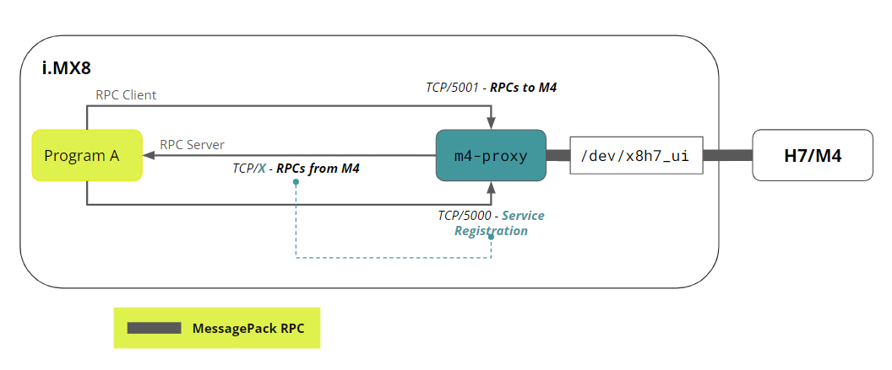

## Overview


The container infrastructure provided by Arduino includes a prebuilt Python® image you can use to run Python® applications on the Portenta X8. In this tutorial, we are going to build a container based on a provided one.

While all peripherals are accessible from the iMX8 processor running the Linux environment, it can be useful to let the onboard microcontroller handle certain peripheral operations and exchange only the required data between the microcontroller and the Python® application.

You will be guided on how to set up this. It is recommended to familiarize yourself with the foundational elements of the Portenta X8 and its infrastructure by reading [fundamentals of the Portenta X8](https://docs.arduino.cc/tutorials/portenta-x8/x8-fundamentals) if you have not already done so.

## Goals

- Learn how the RPC mechanism on the X8 works
- Learn how to exchange sensor data between Linux and an Arduino sketch
- Learn how to modify a container and run it
- Learn how to use commands to debug the container and service infrastructure

### Required Hardware and Software

- [Portenta X8](https://store.arduino.cc/products/portenta-x8)
- [Portenta breakout](https://docs.arduino.cc/hardware/portenta-breakout)
- Any sensor (in this example, we will use an [BME680](https://www.bosch-sensortec.com/products/environmental-sensors/gas-sensors/bme680/) I<sup>2</sup>C module)
- [USB-C® cable (USB-C® to USB-A cable)](https://store.arduino.cc/products/usb-cable2in1-type-c)
- [Arduino IDE 1.8.10+](https://www.arduino.cc/en/software), [Arduino IDE 2](https://www.arduino.cc/en/software), or [Arduino Cloud Editor](https://create.arduino.cc/editor)

## Remote Procedure Call - RPC

The two processors within the Portenta X8 require a communication mechanism to exchange data, known as an **RPC (Remote Procedure Call)**.

**RPC** allows a program to trigger a **`procedure`** or **`function`** on another computer over a network rather than locally. It lets a program execute procedures **remotely**, with the details of network communication hidden to maintain transparency, making the remote call appear similar to a local one.

It is particularly useful for distributed computing in a client-server model. The **`procedure call`** behaves as a **`request`** from the client, and the **`return value`** serves as the server's **`response`**. This model uses multiple computers connected over a network (often the Internet) to solve large computational tasks.

While RPC aims to closely replicate local procedure calls, complete equivalence is not possible due to network communication challenges that can cause failures. To manage these issues, different RPC mechanisms adopt distinct semantics:

- **`At most once` semantics** ensures that a remote call may fail, but will not be run multiple times.
- **`At least once` semantics** guarantees that the call is made at least once, even if it results in multiple activations.

The Portenta X8 uses **MessagePack-RPC** for its communication (see the [library repository](https://github.com/msgpack-rpc/msgpack-rpc-python) for details). *MessagePack-RPC* relies on *MessagePack* as the serialization protocol, encoding data in *MsgPack* format, and is supported over:

- OpenAMP via Shared Memory
- SPI
- Linux Char Device
- TCP/IP


In the image above, the **M7 core** of the **STM32H7** manages communication between the Linux and Arduino environments. If an Arduino sketch runs on the **M4 core**, the **M7 core** acts as an intermediary, handling data requests between the M4 core and the Linux environment. Due to this setup, traditional dual-core processing is not supported on the Portenta X8.

On the Linux side, a service called `m4-proxy` handles data transfer between Linux and Arduino.

The communication process works as follows:

- A program registers as the RPC server on port X, listing the procedures available for the M4 to call.
- `m4-proxy` then forwards the calls from the M4 to the appropriate program/port.



## Python® on the X8

Python® is a modern and powerful scripting language used for a wide range of applications. In this tutorial, we only read sensor data from an Arduino sketch, but you could extend the example and process the data further.

### Communication Between Linux and Arduino Sketches

The Python® script will run on the Linux side and therefore on the iMX8 processor. The Arduino sketch, on the other hand, will run on the STM32H747 microcontroller. It enables real-time processing on the Arduino side while running a fully-fledged operating system on the iMX8.

However, the two processors need a communication mechanism to exchange data. **RPC (Remote Procedure Call)** is the communication mechanism for this task. To establish communication, the M7 core on the STM32H747 microcontroller is used to transfer data or requests to the M4 core. That means your Arduino sketch will solely run on the M4 core. Dual-core processing on the Arduino side is currently not supported.

On the Linux side, a service handles sending data between the two worlds. It is called **`m4-proxy`**.

You can check if the service is running by logging into the X8 via `adb shell` and then executing the following command:

```bash
sudo journalctl -fu m4-proxy
```

If the service has stopped unexpectedly, you can restart it with the following command:

```bash
sudo systemctl restart m4-proxy
```

## The Arduino Sketch

The Arduino sketch to read sensor data does not look much different from an ordinary sketch. The only difference is that we expose the sensor data via RPC.

```arduino
RPC.bind("temperature", []{ return bme.temperature; });
RPC.bind("humidity", []{ return bme.humidity; });
RPC.bind("pressure", []{ return bme.pressure / 100.0F; });
RPC.bind("gas", []{ return bme.gas_resistance / 1000.0; });
RPC.bind("altitude", []{ return bme.readAltitude(SEALEVELPRESSURE_HPA); });
```

Two additional header files need to be included to enable the RPC mechanism on Portenta X8:

```arduino
#include <RPC.h>
#include <SerialRPC.h>
```

The `RPC.bind()` method makes the data available under the specified name, e.g., "temperature". In our example, an anonymous function is created to return the corresponding sensor property whenever requested.

Alternatively, you could bind the name to an existing named function. The data can then be easily requested using that name (e.g., `humidity`) by querying the `m4-proxy` service. Once data is requested, it is packaged as a message and sent over SPI to the iMX8.


You can find the sketch and complete example [here](https://github.com/arduino/portenta-containers/tree/main/python-rpc-sensors). You may need to change the sketch depending on the sensor you choose to read from. If you are using an I<sup>2</sup>C sensor, you can connect SCL to **PWM6** and SDA to **PWM8** on the Portenta breakout.

That is because the labeled I<sup>2</sup>C pins on the Portenta Breakout are only available on the Linux side. If you are using an analog sensor, you can connect it to any analog pin. Please refer to the pinout diagram on the Portenta Breakout [documentation page](/hardware/portenta-breakout).


Make sure you have installed the **Arduino Mbed OS Portenta Boards** core and upload the sketch to the X8 in the Arduino IDE or via Arduino CLI.

***The example code provided in the repository uses preset sensor values (returning fixed values like 100, 200, 300, etc.) for demonstration purposes. It allows you to test the RPC mechanism without connecting actual hardware sensors. To use real sensor data, you will need to modify the Arduino sketch to include your sensor library and update the `RPC.bind()` calls to return actual sensor readings instead of the preset values.***

### Debugging the Arduino Sketch

To check if the Arduino sketch is working correctly, you may want to read the messages from the `Serial.println` statements. You cannot currently read them directly from the Arduino IDE's serial monitor. Instead, you can use a simple service called **`py-serialrpc`**, which listens for those messages and prints them to the console.

This service needs to run on the Linux side of the X8. You can get the files [here](https://github.com/arduino/portenta-containers/tree/main/python-rpc-serial). Clone or download the repository to your local machine, then from the command prompt, navigate to the adb tool folder and upload the files to the X8 with the command:

```bash
adb push <local directory path>/python-rpc-serial /home/fio
```

Log into the X8 shell with `adb shell` and navigate into the `python-rpc-serial` folder. Build the container using:

```bash
docker build . -t python-rpc-serial
```

The `-t` flag assigns a tag to the container. Then run the container by executing `cd..` and then:

```bash
docker compose up -d
```

The `-d` flag detaches the container so it runs in the background. Note that this will run the Docker Compose app and have the container built persistently across reboots by registering it as a systemd service.

If you encounter issues with `docker compose` (such as `invalid reference format` errors), you can run the container directly using:

```bash
docker run -d \
  --name python-rpc-serial \
  --restart unless-stopped \
  -e PYTHONUNBUFFERED=1 \
  --tty \
  --read-only \
  -p 5002-5020:5002-5020 \
  -v /tmp:/tmp \
  --device /dev/ttyGS0 \
  --add-host m4-proxy:host-gateway \
  python-rpc-serial:latest
```

To stop the container, run:

```bash
docker compose stop
```

Or if using `docker run`:

```bash
docker stop python-rpc-serial
docker rm python-rpc-serial
```

Check if the container is running by executing:

```bash
docker ps
```

You can then access the log of its service at any time by using the following command from the same directory:

```bash
docker compose logs -f --tail 20
```

Or if using `docker run`:

```bash
docker logs -f python-rpc-serial
```

If you do not wish to run the container in the background, skip the `-d` flag, you will get the console output directly in the executing shell. Once the container is running, you will see the messages being sent from the M4.

## The Python® Application

The Python® application requests the sensor data from the M4 over RPC and unpacks the message. Data can be requested by calling the function exposed over RPC on the M4, e.g.:

```python
m4_proxy_address = 'm4-proxy'
m4_proxy_port = 5001
rpc_address = RpcAddress(m4_proxy_address, m4_proxy_port)
rpc_client = RpcClient(rpc_address)
temperature = rpc_client.call('temperature')
```

You have two options to run the Python® application.

### Using the Pre-Built Docker Image

For a quick setup, you can use the pre-built `arduino/python-rpc-sensors` image that Arduino maintains. This way, you always have the latest compatible version. Log into the X8 via `adb shell` and then pull and run the pre-built image using the following command:

```bash
docker run --rm --network=host arduino/python-rpc-sensors
```

This approach is recommended for most as it is simpler and always uses the latest tested version compatible with the current OS.

### Building the Image From Source

If you want to modify the Python® script or learn how the container is built, you can build the image from source. The complete Python® application files are available in the repository [here](https://github.com/arduino/portenta-containers/tree/main/python-rpc-sensors). Clone or download the repository to your local machine, then upload the `python-rpc-sensors` folder to the Portenta X8 via:

```bash
adb push <local directory path>/python-rpc-sensors /home/fio
```

Log into the X8 via `adb shell`. Then navigate into the `python-rpc-sensors` folder and execute:

```bash
docker build . -t python-rpc-sensors
```

When it has finished, you can run the container with:

```bash
docker compose up
```

If you encounter issues with `docker compose`, you can run the container directly using:

```bash
docker run -d \
  --name python-rpc-sensors \
  --restart unless-stopped \
  -e PYTHONUNBUFFERED=1 \
  --tty \
  --read-only \
  --network host \
  -v /tmp:/tmp \
  --device /dev/ttyGS0 \
  --add-host m4-proxy:host-gateway \
  python-rpc-sensors:latest
```

After a few seconds, you should see the output from the Python application featuring the sensor readings on the M4 that exchanges through the RPC mechanism. The output should look similar to the following:

```bash
python-rpc-sensors_1  | ============================================
python-rpc-sensors_1  | ==       Portenta X8 Sensor reading       ==
python-rpc-sensors_1  | ============================================
python-rpc-sensors_1  |
python-rpc-sensors_1  | Temperature:  100
python-rpc-sensors_1  | Humidity:  200
python-rpc-sensors_1  | Pressure:  300
python-rpc-sensors_1  | Gas:  400
python-rpc-sensors_1  | Altitude:  500
```

View the logs using:

```bash
docker compose logs -f --tail 20
```

Or if using `docker run`:

```bash
docker logs -f python-rpc-sensors
```

Whenever you change anything in the Python® script on your computer, you will need to resync and push the new script to the Portenta X8, then rebuild the container. The following command sequence will help you to do this process:

```bash
adb push python-rpc-sensors /home/fio
```

```bash
docker compose down
```

```bash
docker build . -t python-rpc-sensors
```

```bash
docker compose up
```

Or if using `docker run`:

```bash
docker stop python-rpc-sensors
```

```bash
docker rm python-rpc-sensors
```

```bash
docker build . -t python-rpc-sensors
```

```bash
docker run -d --name python-rpc-sensors --restart unless-stopped -e PYTHONUNBUFFERED=1 --tty --read-only --network host -v /tmp:/tmp --device /dev/ttyGS0 --add-host m4-proxy:host-gateway python-rpc-sensors:latest
```

Alternatively, you could modify the files directly on the X8 using an editor such as **VIM**, so you do not need to upload the files every time. Rebuilding the container will be necessary in any case, though.

If you're wondering how to specify the Python® script to run when a container is started, have a look at the `Dockerfile` in the repository. There you will find the `ENTRYPOINT` command that takes multiple arguments. In this example:

```python
ENTRYPOINT ["python3", "main.py"]
```

## Troubleshooting

### RPC Communication Issues

If you are experiencing issues with RPC communication, such as the Python script outputting:

```
Unable to retrieve data from the M4
```

Even after following the setup correctly, it may be due to firmware compatibility issues with certain OS versions.

### Manually Flashing the STM32H7 Firmware

When encountering persistent RPC communication issues, you can manually flash a compatible firmware version to the STM32H7 microcontroller. You will need either a [pre-built firmware binary](assets/STM32H747AII6_CM7.bin) or you can build it yourself from [source](https://github.com/arduino/portentax8-stm32h7-fw/releases).

From your local machine, push the firmware binary to the X8:

```bash
adb push STM32H747AII6_CM7.bin /home/fio
```

Connect to the X8 and switch to root:

```bash
cd /home/fio
```

Remount the `/usr` partition as read-write and copy the firmware to the correct location:

```bash
sudo mount -o remount,rw /usr
```

```bash
sudo cp STM32H747AII6_CM7.bin /usr/lib/firmware/arduino/stm32h7-fw/STM32H747AII6_CM7.bin
```

Flash the firmware using the programming script:

```bash
sudo /usr/arduino/extra/program.sh
```

The programming script will verify and flash the new firmware. You should see output indicating the programming progress, verification, and successful reset. After flashing completes, restart the X8 and try rerunning your Python application.

### Building Firmware From Source

If you need to build the firmware yourself or make modifications, you will need Git, the ARM GCC toolchain (`arm-none-eabi-gcc`), and Make installed on your system.

Clone the firmware repository and initialize its submodules:

```bash
git clone https://github.com/arduino/portentax8-stm32h7-fw.git
```

```bash
cd portentax8-stm32h7-fw
```

```bash
git submodule update --init --recursive
```

On Windows, using Git Bash, you will need to add the ARM toolchain to your `PATH`. The toolchain is typically installed with the Arduino IDE:

```bash
export PATH=$PATH:/c/Users/YOUR_USERNAME/AppData/Local/Arduino15/packages/arduino/tools/arm-none-eabi-gcc/7-2017q4/bin
```

Replace `YOUR_USERNAME` with your actual Windows username. Build the firmware:

```bash
make
```

### Understanding the Example Code

The `python-rpc-sensors` example uses preset sensor values for demonstration purposes. The Arduino sketch returns fixed preset values (100, 200, 300, 400, 500) rather than reading from actual hardware sensors. It allows you to test the RPC mechanism without connecting physical sensors.

To use real sensor data, you need to modify the Arduino sketch to include your sensor library (such as `Adafruit_BME680` or `Adafruit_BMP280`) and update the `RPC.bind()` calls to return actual sensor readings. For example, with a real BME680 sensor:

```arduino
#include <Adafruit_BME680.h>
Adafruit_BME680 bme;

void setup() {
  bme.begin();
  RPC.bind("temperature", []{ return bme.temperature; });
  RPC.bind("humidity", []{ return bme.humidity; });
  RPC.bind("pressure", []{ return bme.pressure / 100.0F; });
  RPC.bind("gas", []{ return bme.gas_resistance / 1000.0; });
  RPC.bind("altitude", []{ return bme.readAltitude(SEALEVELPRESSURE_HPA); });
}
```

If you are using a BMP280 sensor instead of a BME680, be aware that the BMP280 provides temperature, humidity, pressure, and altitude readings but lacks a gas resistance sensor. The example Python script calls all five RPC functions, including `gas`, which will cause a timeout error if your Arduino sketch does not implement it.

To use a BMP280 sensor, you can either modify your Arduino sketch to provide a dummy gas value by adding:

```arduino
RPC.bind("gas", []{ return 0; });
```

Since the BMP280 does not have a gas sensor, you can modify the Python script to skip the gas reading by commenting out the gas RPC call. The BMP280 does support altitude calculation, so you can include that RPC call in your BMP280 sketch if needed.

## Conclusion

In this tutorial, you learned how to use the Docker infrastructure to run a Python® application on the Portenta X8. You explored two approaches to running the application: using a prebuilt Docker image for quick deployment and building the image from source for customization. You have also learned how to use the RPC mechanism to exchange data between the microcontroller and the iMX8, which runs Linux.

### Next Steps

- You may further process the data you receive from the Arduino sketch and, e.g., upload it to a Cloud service or similar.
- Familiarize yourself with Docker commands to adjust the docker configuration to your needs.
