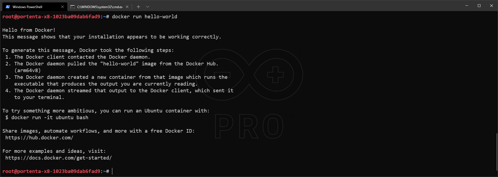
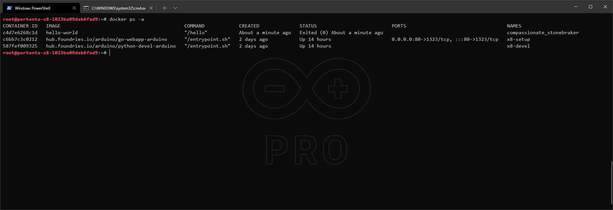
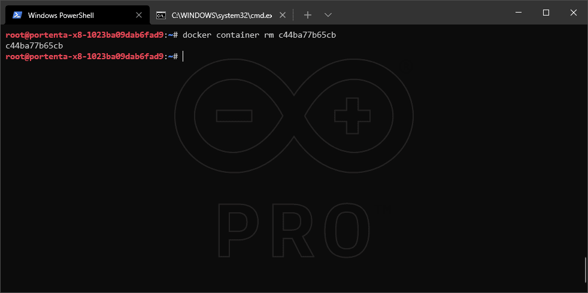

## Overview

[Docker](http://docker.com) is a platform full of applications, called containers. Containers are isolated solutions, thus they don't have to depend on your environment. Making them portable and consistent throughout development, testing, and production.

You can download, install, use, and share applications in the form of containers. You can find all the available container images on the [hub.docker.com](https://hub.docker.com) page.

In this tutorial, we will go through the steps of how to install, run and remove Docker's official [Hello-World image](https://hub.docker.com/_/hello-world)

## Goals

- Learn how to list installed and active containers
- Learn how to install a container
- Learn how to run a container manually
- Learn how to uninstall a container

### Hardware and Software Requirements

- [Arduino® Portenta X8](https://store.arduino.cc/products/portenta-x8)
- USB-C® cable (either USB-C® to USB-A or USB-C® to USB-C®)
- Wi-Fi® Access Point with Internet Access
- ADB: [Check how to connect to your Portenta X8](https://docs.arduino.cc/tutorials/portenta-x8/user-manual#out-of-the-box-experience)
- [Arduino IDE 1.8.10+](https://www.arduino.cc/en/software), [Arduino IDE 2](https://www.arduino.cc/en/software), or [Arduino Web Editor](https://create.arduino.cc/editor)

***Make sure to have the Portenta X8 with the latest image as well as the bootloader. Please check [how to flash your Portenta X8](/tutorials/portenta-x8/image-flashing) to have the latest version.***

## Using Docker

The Portenta X8 provides Docker CLI by default. The following command will help you verify if it is installed correctly:

```
docker -v
```

***To use this tool, you will need to connect to your device first. Check [how to connect using adb/ssh](https://docs.arduino.cc/tutorials/portenta-x8/user-manual#out-of-the-box-experience).***

You can check Docker's reference documentation, which covers all the features of the tool in depth at [docs.docker.com](https://docs.docker.com/).

The following steps will show how to install, run and uninstall the "Hello World" container.

To avoid a lack of permissions while running the Docker's commands, you may need to run the next command to gain admin (root) access: ```sudo su -``` , which default password is ```fio```

The previous command and other important info about Linux on your Portenta are described in the [Portenta X8 User Manual](https://docs.arduino.cc/tutorials/portenta-x8/user-manual#working-with-linux).

### How to Install a Container

First, you will need to search for ["Hello World" container image](https://hub.docker.com/_/hello-world). The container image can be found within the Docker hub, where you will be able to find a variety of readily-available container images. It will be used to verify docker is working as intended with the Portenta X8.

The following command must be used to pull the `hello-world` image. The Docker hub page for images has the instructions to pull the image and deploy the container.

```
docker pull hello-world
```


### Run The Installed Container

This is the command to begin the container instance.

```
docker run hello-world
```



***To be able to see an active container with `docker ps -a`, you will need to run it at least once with `docker run`***

### Listing The Installed Packages

The following command will display the active containers and will show the `hello-world` container if it was able to run successfully. The `STATUS` message will let you know if the container is active or has finished operation depending on its purpose.

``` 
docker ps -a
```



The list of available images, including installed `hello-world` image, can be verified using the following command:

```
docker images
```


### How to Uninstall A Container

You will need to obtain an assigned `CONTAINER ID` to be able to remove a container of your choice. The list of active containers provides this information. The remove (`rm`) command is then used with the desired container identifier to proceed with the removal process.

```
docker container rm <CONTAINER ID>
```

For this example, the command `docker ps -a` will show the `CONTAINER ID` of the `hello-world` container designated as: `c44ba77b65cb`. If you encounter an error stating that the container cannot be removed, it may mean that the container has an actively ongoing operation which can be checked with `STATUS` message.

Granted that this is the case, you will need to stop the container and verify with `STATUS` message that it has exited successfully. To do this, the following command is used:

```
docker stop <CONTAINER ID>
```

***Every time the image is re-installed or re-ran, the `CONTAINER ID` will be different than the previous identifier***



Using the `docker ps -a` after container removal, the `hello-world` container should no longer be present as an active container.

The same goes for the images if you would like to free some space. The removal command will now be as follows using `IMAGE ID` found within the image table:

```
docker rmi <IMAGE ID>
```

If you run `docker images` again, you will see that the `hello-world` image is not showing up anymore.

## Conclusion

In this tutorial, you have learned how to use Docker with Portenta X8. You have learned to download an image, manage, and deploy the container, and ultimately run on Portenta X8. You have also learned to remove the image and the container to control Portenta X8's available resources.

### Next Steps

- Now that you have the base of the workflow to use [Docker](https://docker.com), go to its docs page and make sure you understand all the features.
- Look for a container image from [Docker hub](http://hub.docker.com), install it and make your own application out of it.
- Create a container to run your custom-made application. For this, it may interest you [Deploy a Custom Container with Portenta X8 Manager](https://docs.arduino.cc/tutorials/portenta-x8/custom-container) tutorial.