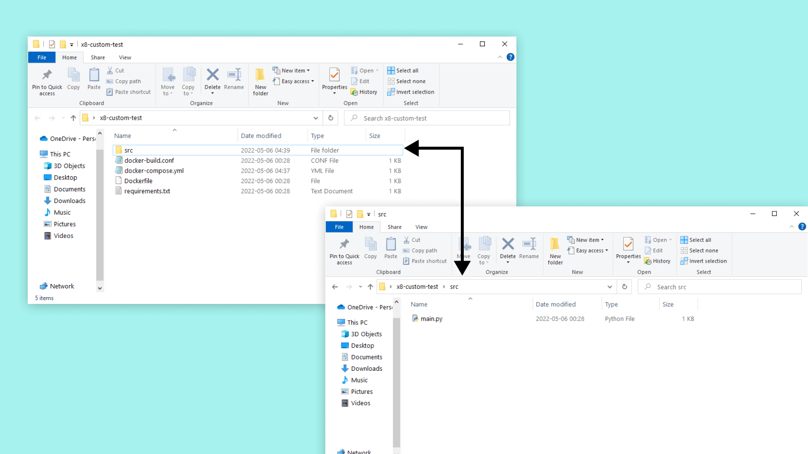
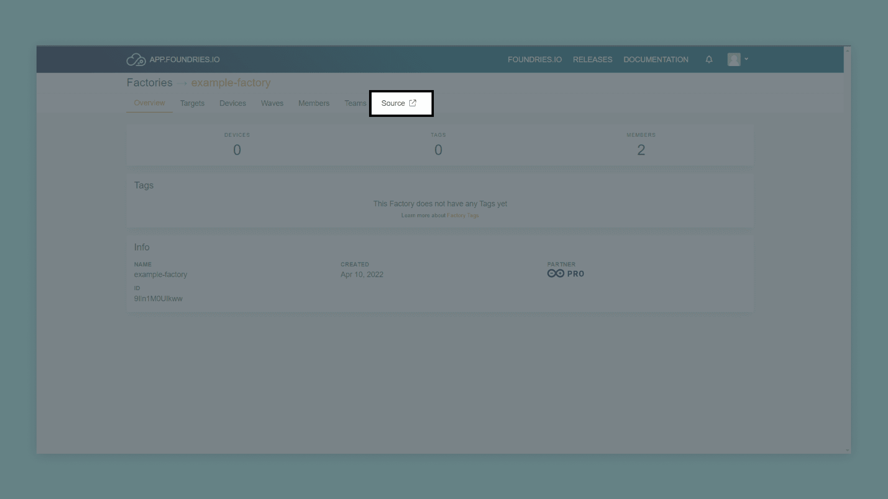
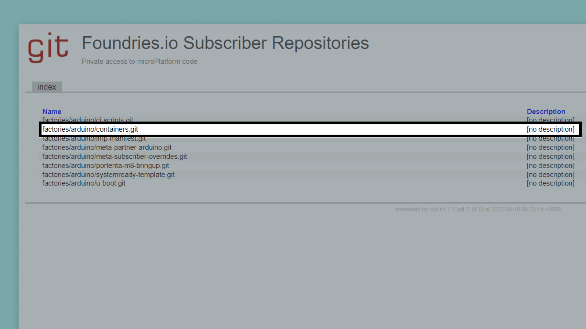
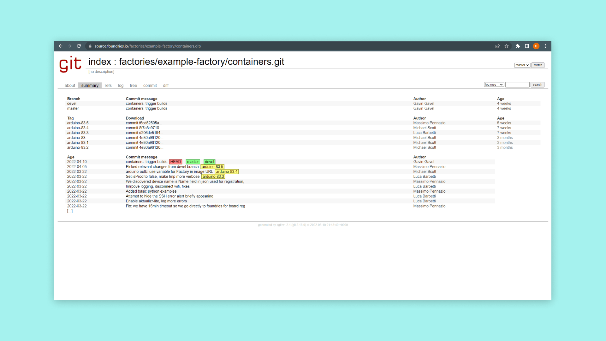
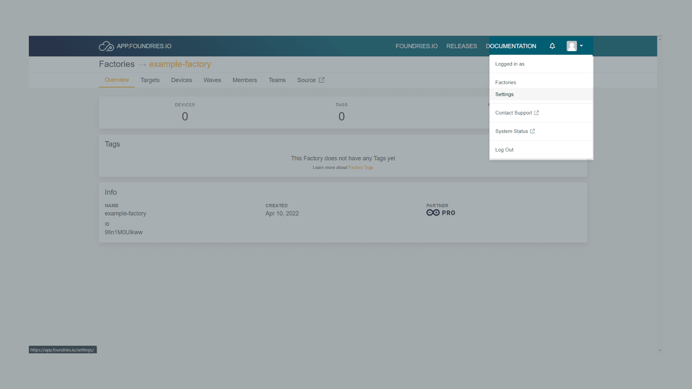
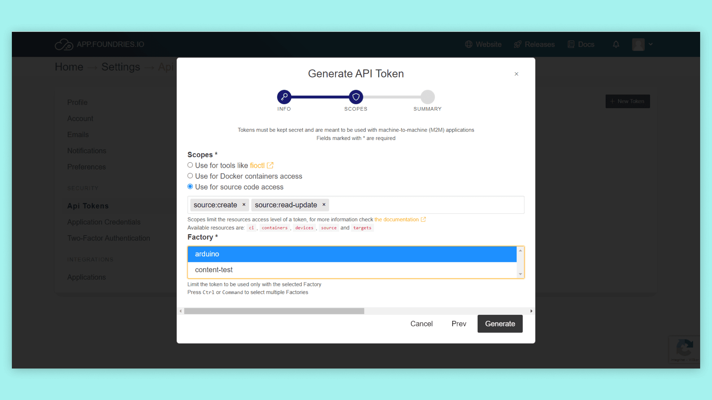

## Overview

In this tutorial, we will create a simple container and upload it to the Arduino Portenta X8 with its manager. A container consists of an image file and all its dependencies if required. This tutorial will go through the needed files to create a container and its functions. Building this container locally and then uploading it to a Portenta X8. Using docker with ADB to build, run and attach our container to the Portenta X8.

## Goals

- Learn how to create a container for use with the Portenta X8
- Learn how to upload a container to the Portenta X8

### Required Hardware and Software

- [Portenta X8](https://store.arduino.cc/portenta-x8)
- ADB: [Check how to connect to your Portenta X8](https://docs.arduino.cc/tutorials/portenta-x8/user-manual#out-of-the-box-experience)
- USB-C® cable (either USB-C® to USB-A or USB-C® to USB-C®)
- Arduino Pro Cloud Subscription [Learn more about the Pro Cloud](https://www.arduino.cc/pro/hardware/product/portenta-x8#pro-cloud)
- [Arduino IDE 1.8.10+](https://www.arduino.cc/en/software), [Arduino IDE 2](https://www.arduino.cc/en/software), or [Arduino Web Editor](https://create.arduino.cc/editor)

## Instructions

An active container uses an isolated filesystem. The container image provides its custom filesystem. Since the image contains the container’s filesystem, it must have everything required to run an application - all dependencies, configuration, scripts, binaries, etc. The image also contains further configurations for the container, such as environment variables, a default command to run, and other metadata.

## Container File Structure

To create the container, we need to collect the necessary files. Creating a folder called **x8-custom-test**, the following files need to be in the folder:

- docker-build.conf
- docker-compose.yml
- Dockerfile
- requirements.txt
- src folder
- main.py (This file should be inside the src folder)

The complete folder will look like this:



Let us go through what these files contain and do.

### Container File: Docker-build.conf

A file containing the minimal "unit test" command is to be executed on the container to prove it's working. Our file will make our containers minimal unit test a test of the Python3 help command.

```python
TEST_CMD="python3 --help"
```

### Container File: Docker-compose.yml

This file defines the app name through the Factory, permissions, and settings for the involved containers. The argument in the image tag will make it, so our image file builds locally.

```python
version: '3.6'

services:
  x8-custom-test:
    image: blob-opera:latest
    restart: always
    tty: true
    read_only: true
    user: "63"
    tmpfs:
    - /run
    - /var/lock
    - /var/log
    - /tmp
```

### Container File: Dockerfile

This is used to build the container. A Dockerfile is a text file that contains all the instructions (FROM, COPY, COMMAND, ENTRYPOINT, etc.) that a user can use from the command line to create different image layers. Although the final image can be created using the docker `build` command, the dockerfile serves just as an image definition.

```python
FROM python:3-alpine3.15

# Set our working directory
WORKDIR /usr/src/app

# Copy requirements.txt first for better cache on later pushes
COPY requirements.txt requirements.txt

# pip install python deps from requirements.txt on the resin.io build server
RUN pip install -r requirements.txt

# This will copy all files in our root to the working  directory in the container
COPY ./src/main.py ./

# Enable udevd so that plugged dynamic hardware devices show up in our container.
ENV UDEV=1

# main.py will run when container starts up on the device
CMD ["python","-u","main.py"]
```

### Container File: Requirements.txt

The requirements text file defines needed dependencies. These dependencies serves as useful tools to build the application of the container.

```python
Flask==0.12.3
```

### Container File: Source

Here we will keep the source code of the app you want to run in the container or a startup script. We will create a **main.py** file in this folder. This script will print "Hello World!" in the CLI window.

```python
from flask import Flask
app = Flask(__name__)

@app.route('/')
def hello_world():
    return 'Hello World!'

if __name__ == '__main__':
    app.run(host='0.0.0.0', port=80)
```

## Uploading the Container Folder

First, you will need to set up your board to a Factory setting, as shown in the Portenta X8 [Out-of-the-box experience from the User Manual](https://docs.arduino.cc/tutorials/portenta-x8/user-manual#out-of-the-box-experience).

Once finished, we will push our folder to a repository within the Factory. Let us place our folder "x8-custom-test" inside the "containers.git" repository. You can find this repository inside your Factory page under "Source". Then, on "container.git", the page URL will be used in the following command.







To pull or push repositories, you have to generate an API key. This is done by going to the user settings on the Factory page. Click on the user drop-down menu, go into the tokens page and follow the steps of creating a new API key. When creating the API key, please make sure to select the "Use for source code access" option and the correct Factory that you want to use the key for. This token will be used as the password for all git operations while the username can be anything, except an empty string.





Use the following command in git on your machine. To get the repository on your machine, replace "YOUR_FACTORY" with the name of your Factory. The "-b" parameter specifies a branch to checkout after cloning the repository. Running this command will get the container repository, where we will put our folder.

```
git clone https://source.foundries.io/factories/YOUR_FACTORY/containers.git -b devel
```

Put the "x8-custom-test" folder in the repository and push it with git. When you have put the folder into the git folder, use `git status` to see the changed files in the folder, it will show the unadded changes in red, then use `git add` to add the changes you want to your git commit. Then use `git commit` and `git push` to finally push the changes to the repo. If you push the commit to "containers.git" a new target will automatically build on your FoundriesFactory, you can inspect it on the "Targets" page.

### Building and Running the Container

After the build finishes, it can take up to 10 minutes for your device to update over-the-air to this new version. You can inspect it via the "Devices" tab of your FoundriesFactory. After your device takes the update, navigate into the "x8-custom-test" folder, which should be located on your board now. This allows us to build our container with a simple command. Using ```docker build``` with a ```--tag``` will let us give the container a tag so we can easily keep track of what version of the build this is.

```python
docker build --tag "x8-custom-test:latest" .
```

Now that it is built, we can run it with ```docker run```, finding it with the tag that we chose to give to the build we want to run. Here we need to enter the user information into the --user tag. This information is found inside the "docker-compose.yml" file.

```python
docker run -it --rm --user "63" x8-custom-test:latest
```

### Using Docker-Compose

An option for testing an app or container is to use "docker-compose". It is helpful when we have a lot of settings in our "docker-compose.yml" file since we don't have to use those settings in the run argument with this method. First, navigate into the container folder.

```python
cd /home/fio/x8-custom-test
```

This docker-compose command will start your application and register it as a systemd service that will persist even when a reboot occurs. So at the next boot, your docker-compose app will run automatically.

```python
docker-compose up --detach
```

To stop the docker-compose app from running, use the following command:

```python
docker-compose stop
```

## Deploying with Docker Hub

An alternative method to deploy the custom container is by using the Docker Hub platform. For this, it needs a [Docker Hub account](https://hub.docker.com/) to have your own repository to have the custom container uploaded. When you have the repository ready, the following command will let you upload the custom container image.

```
docker push HUB_USERNAME/x8-custom-test
```

The custom container image can now be found within `HUB_USERNAME` Docker Hub repository. The image can be accessed whenever any connectivity type grants access to the container image. To pull the image and deploy the container, you will need to connect the Portenta X8 via ADB and use following commands in sequence:

```
adb shell
docker pull x8-custom-test
```

It will pull the container image and deploy the container on your Portenta X8.

***To know more about how to create and manage repositories on Docker Hub to manage your custom containers for Portenta X8, check out [here](https://docs.docker.com/docker-hub/repos/#:~:text=To%20push%20an%20image%20to,docs%2Fbase%3Atesting%20).)***

## Conclusion

This tutorial covered what goes into a container, how the folder should be structured, and what files it should contain. It then explained the purpose of each file and what they should have for this example. Then we went through how this relates to the Factory, and how Foundries.io makes the whole process easier for us. We then showed how to build the container and run it on the Portenta X8. Lastly, we showed a useful testing feature with docker-compose, letting us test our container with a faster process.

### Next Steps

To get a better understanding of how to manage containers with Docker, take a look at our [Managing Containers with Docker on Portenta X8](https://docs.arduino.cc/tutorials/portenta-x8/docker-container). This tutorial will show some useful commands to use with the docker service and ADB or SSH.

## Troubleshooting

Here are some errors that might occur in the process of this tutorial:

- Make sure you have followed our other tutorials that shows how to set up the Portenta X8 with [Out-of-the-box experience from the User Manual](https://docs.arduino.cc/tutorials/portenta-x8/user-manual#out-of-the-box-experience)
- If you are having issues with the adb shell, don't forget to try and use `sudo` and `su`
