## Overview

In this tutorial, you will learn how to build an image for the Portenta X8 with the source code provided at our [GitHub repository for lmp-manifest](https://github.com/arduino/lmp-manifest). Building your image locally can help debug several aspects of the system, such as the bootloader or kernel support.

***Images built locally cannot register with FoundriesFactory and will not be OTA compatible, but this is a good alternative for those who do not have a FoundriesFactory subscription.***

This tutorial targets customers that are not FoundriesFactory subscribers, but still want to extend the functionality of the Arduino pre-built sources by building their images. For FoundriesFactory subscribers, we strongly suggest making use of your Factory's continuous integration system for image creation.

## Goals

- Learn how to build a "builder" Docker image
- Learn how to get the required files
- Learn how to configure the build settings
- Learn how to build the image
- Learn how to save the needed files for flashing

### Required Hardware and Software

- [Arduino Portenta X8](https://store.arduino.cc/products/portenta-x8)
- [Docker Engine](https://docs.docker.com/engine/install/)
- ~60GB available space on your machine's drive

## Instructions

### Docker

#### Build the Docker Image

You will create a Docker image that has the dependencies needed to build your device image. To do so, you will need to clone our [lmp-manifest repository](https://github.com/arduino/lmp-manifest). The following steps will guide you through the process:

First, clone the lmp-manifest repository with the following command:

```
git clone https://github.com/arduino/lmp-manifest.git
```

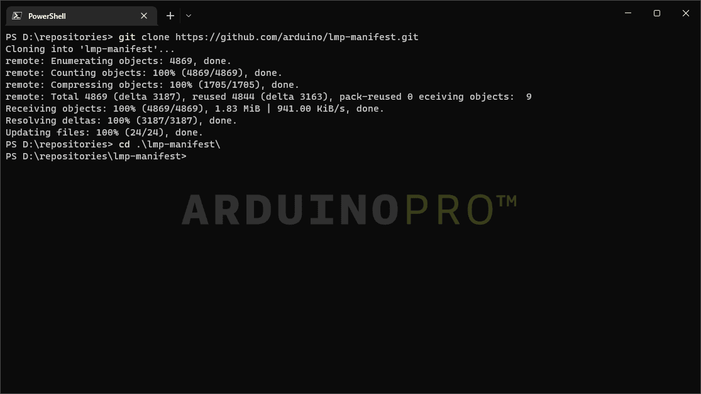

After cloning the lmp-manifest repository successfully, we will proceed to build the Docker Image using following command sequence:

```
cd lmp-manifest
docker build -t yocto-build ./lmp-manifest
```

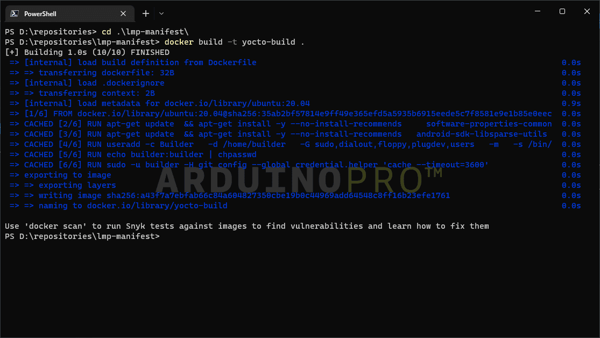

You will be able to see similar result if everything went successfully.

#### Run The Docker Image (Builder)

Once the *Docker Image* is ready, we will run the image with the `-v` argument to mount a volume. This allows you to use a host directory inside the Docker image, so you can store all the data and build artifacts safely.

***If you do not use a volume while running the image, you will lose the data when the image stops***

Run the `yocto-build` builder image with following command:

```
docker run -v <source>:/dockerVolume -it yocto-build bash
```

We need to switch to the `builder` user with the following command after the previous process, and the password is **builder**:

```
su builder
```

### Image Setup and Build

***You can download a [bash script](assets/portenta-x8_build.sh) that wraps all the upcoming steps.***

#### Setup the Environment

Now that you are running inside the Docker Image, you can use tools like **git-repo**, which is already installed.

First, configure git with your credentials. They don't need to be the real ones but are required by `git-repo` to pull. The following commands can be used for this example:

```
git config --global user.email "you@example.com"
git config --global user.name "Your Name"
```

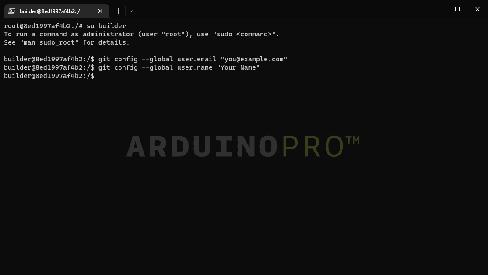

Change to the home directory, and initialize the repository using **repo**:

```
cd /dockerVolume
repo init -u https://github.com/arduino/lmp-manifest.git -m arduino.xml -b release
```

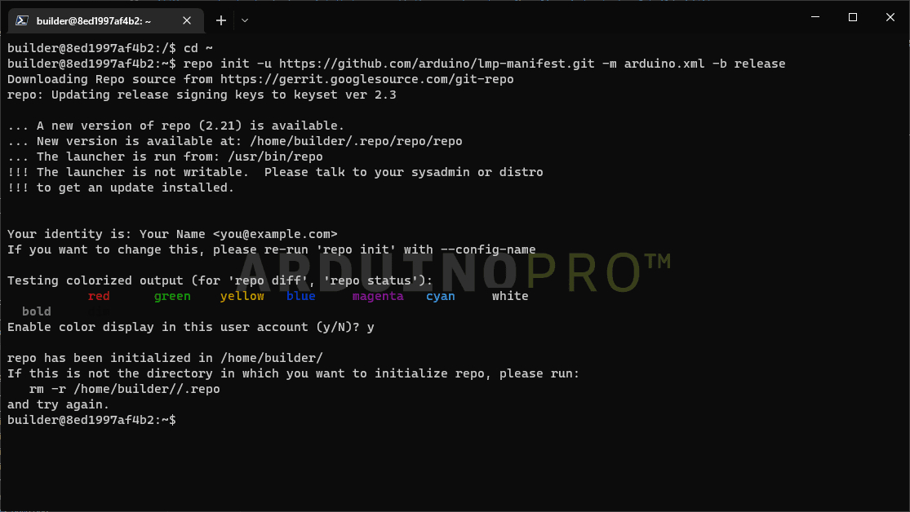

Then pull the needed files with:

```
repo sync
```

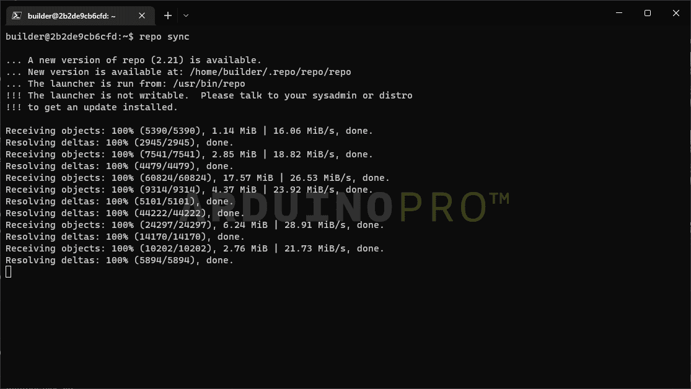

After completion, it should look like the following image:

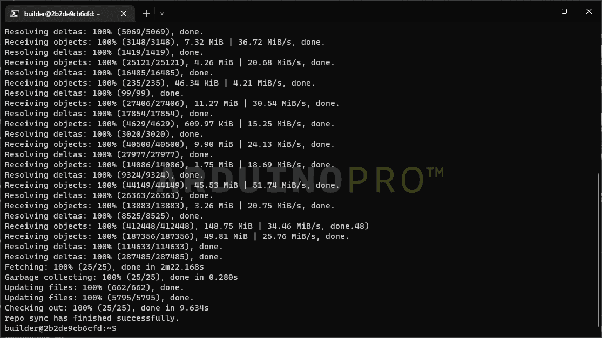

***NOTE: If you are a FoundriesFactory subscriber and want to build your Factory sources locally, please use the manifest link for your Factory as below. This is not recommended as images built locally cannot register to the Factory and receive OTAs.***

#### Set Up the Portenta X8 Distribution

It is recommendable to set `DISTRO` to either:

- `lmp-base`: insecure image without ostree, developer-friendly, not OTA compatible
- `lmp`: secure image without xwayland
- `lmp-xwayland`: secure image with xwayland support

It will help to classify the image if it follows any of the previous characteristics and with the following command:

```bash
DISTRO=lmp-xwayland MACHINE=portenta-x8 . setup-environment
```

***`lmp-partner-arduino-image` will be better supported soon.***

It will then switch automatically to a new folder. Continuing, you can now proceed to accept the EULA using the following command:

```bash
echo "ACCEPT_FSL_EULA = \"1\"" >> conf/local.conf
```

You will be able to see similar output as following after the previous steps:

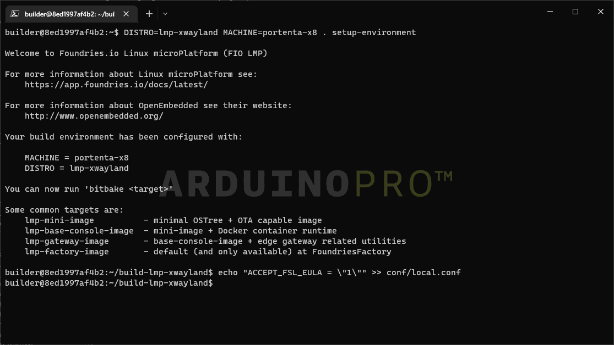

#### Build an Image With Bitbake

To start building the image, following command is used:

```
bitbake lmp-partner-arduino-image
```

***This process may take ~7 hours depending on the build host***

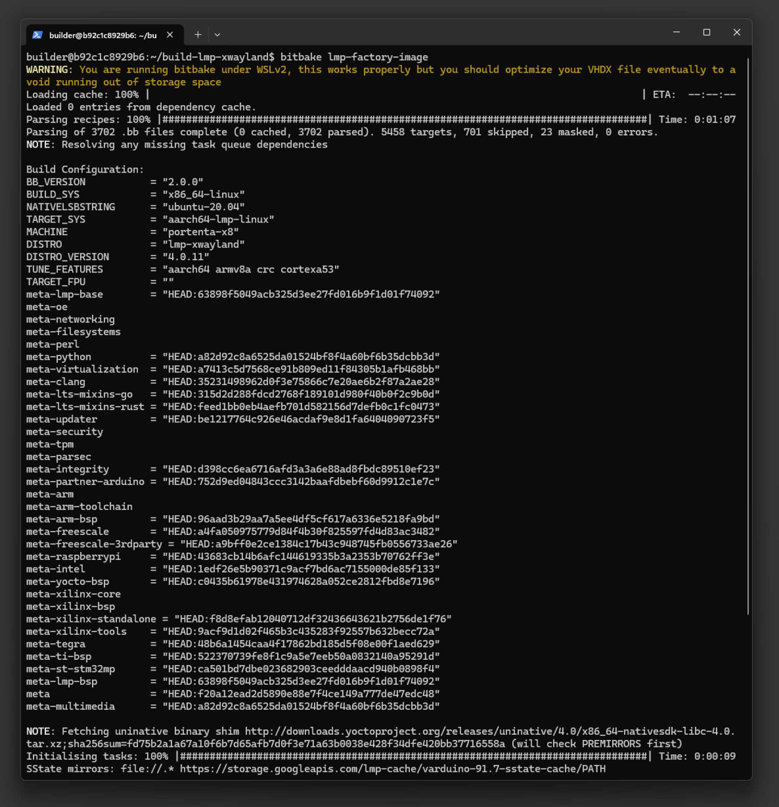

If you want to use your computer while it builds, it is recommendable to lower the threads used since it takes a lot of resources and time. Do so by opening `conf/local.conf` and lowering the values of the following variables:

- `BB_NUMBER_PARSE_THREADS = "4"`
- `BB_NUMBER_THREADS = "4"`

And add:

- `PARALLEL_MAKE = "-j 4"`

If possible, it is a good practice to understand the available threads of your computer used for this process, to optimize the resources accordingly for optimal balance between build performance and side tasks while waiting for the build. Once it finishes you will see something similar to:

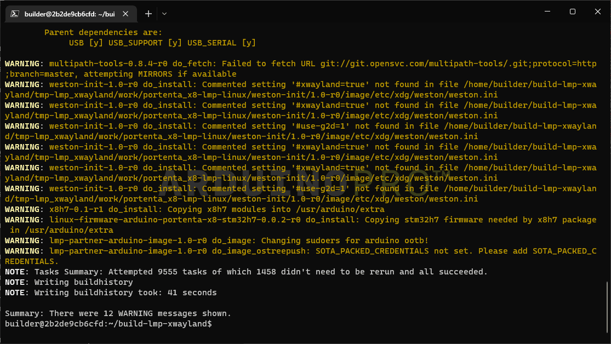

#### Setup Manufacturing Tools

To flash your board, you will need to compile **lmp-mfgtool distro** to get additional tools. First, go into your home folder and change `DISTRO` following the command sequence:

```
cd ..
DISTRO=lmp-mfgtool MACHINE=portenta-x8 . setup-environment
echo "ACCEPT_FSL_EULA = \"1\"" >> conf/local.conf
echo "MFGTOOL_FLASH_IMAGE = \"lmp-partner-arduino-image\"" >> conf/local.conf
```

You should be able to see similar results as following image when successful:

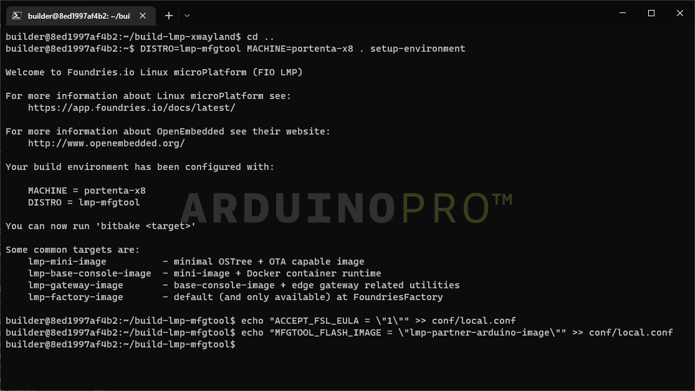

#### Build Manufacturing Tools: Flash The Board

To compile and get the tools required, we will use following command:

```
bitbake mfgtool-files
```

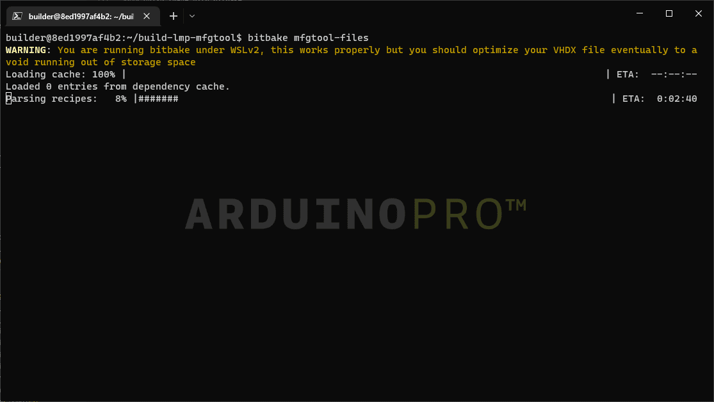

After completion:

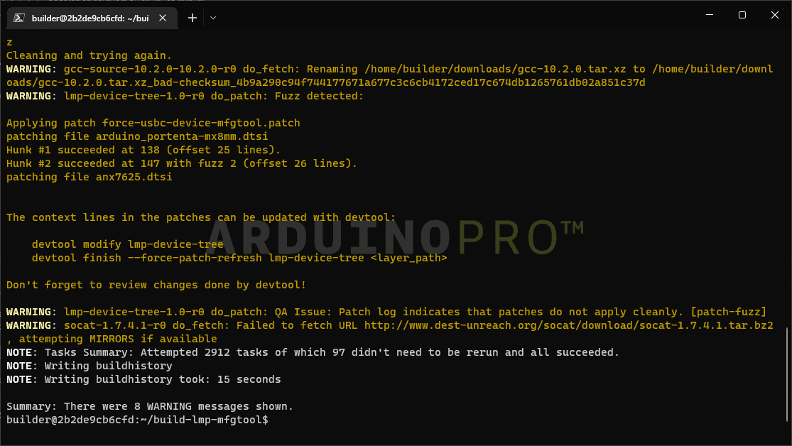

***This process may take ~2 hours depending on your build host***

#### Save Your Image For Flashing

After a successful build, save the needed files to the host volume you mounted with `docker run`. Use the following commands to copy the files to your storage unit:

```
cd ..
mkdir ../../dockerVolume/flashing
DEPLOY_FOLDER=../../dockerVolume/flashing

cp -L build-lmp-mfgtool/deploy/images/portenta-x8/mfgtool-files-portenta-x8.tar.gz $DEPLOY_FOLDER
cp -L build-lmp-xwayland/deploy/images/portenta-x8/imx-boot-portenta-x8 $DEPLOY_FOLDER
cp -L build-lmp-xwayland/deploy/images/portenta-x8/u-boot-portenta-x8.itb $DEPLOY_FOLDER
cp -L build-lmp-xwayland/deploy/images/portenta-x8/sit-portenta-x8.bin $DEPLOY_FOLDER
cp -L build-lmp-xwayland/deploy/images/portenta-x8/lmp-partner-arduino-image-portenta-x8.wic $DEPLOY_FOLDER

cd $DEPLOY_FOLDER
tar xvf mfgtool-files-portenta-x8.tar.gz
```

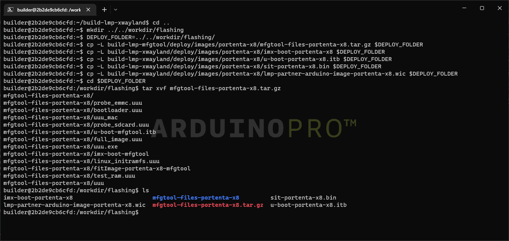

You will be able to see the copied files in your OS file explorer.

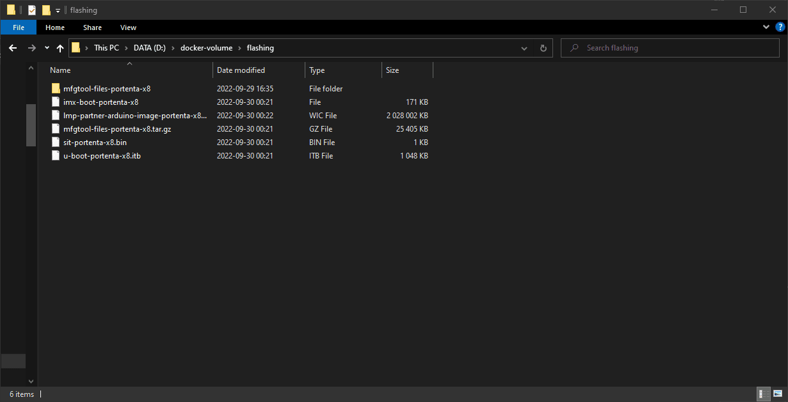

## Conclusion

In this tutorial, you have learned how to build a "builder" Docker image, get its required files, configure the build settings, build the image,a and to save the needed files for flashing. Now you have all the required files to flash the image you built onto the device.

## Next Steps

Please follow the [Flashing tutorial](image-flashing) to flash your device with your custom image. You can use the files provided from this build to flash the Portenta X8 following the tutorial's steps.

## Troubleshooting

- If you are having `do_fetch` issues, try to check your system's and virtual machine's DNS settings.
