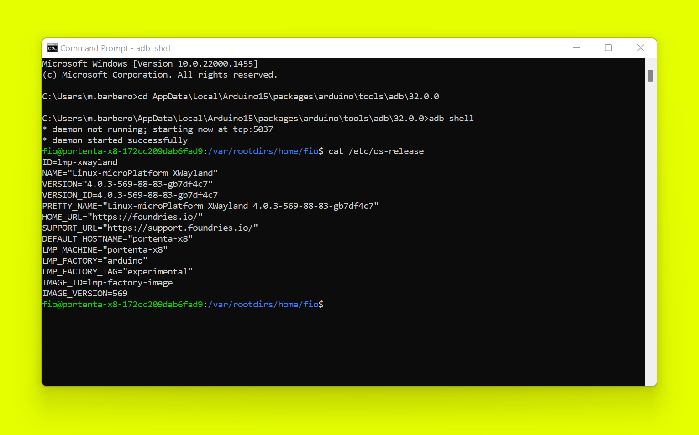
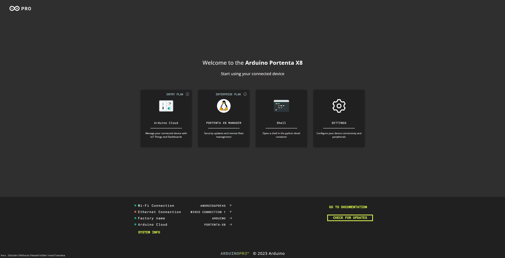
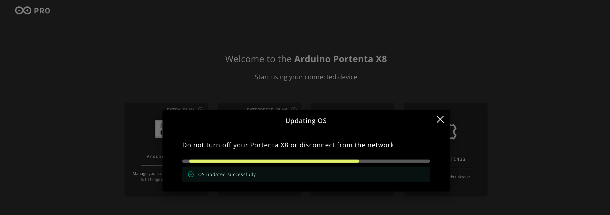
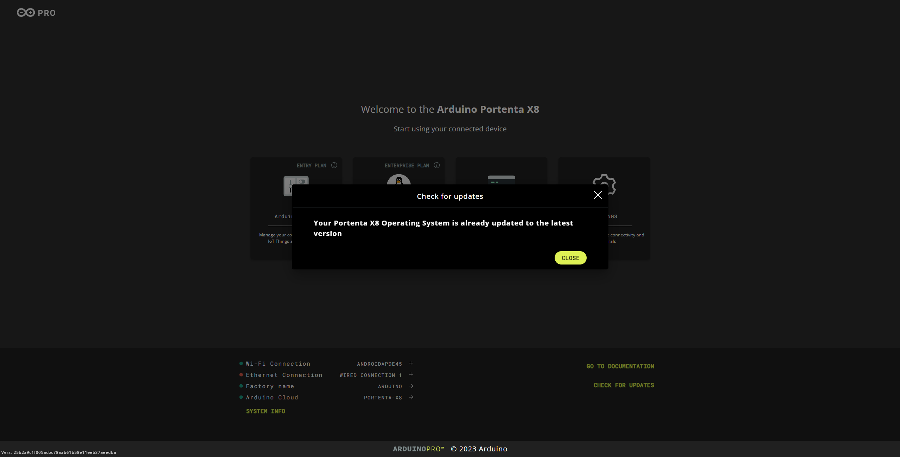
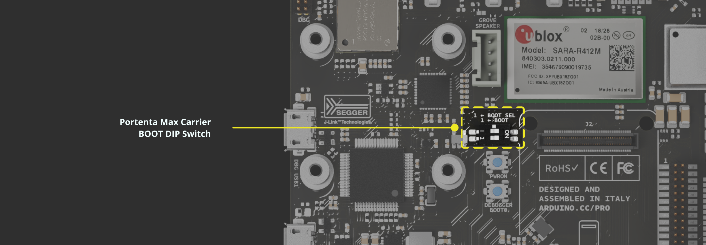
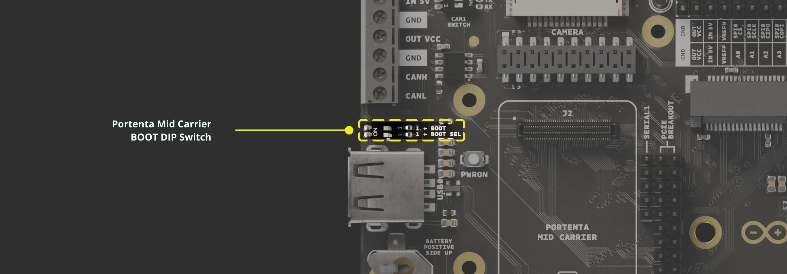

## Overview

In this tutorial, you will learn the different methods to flash your Portenta X8 with the image provided by Arduino. The process involves using the terminal to perform a USB based flashing procedure on a **Windows Operating System**. By the end, you will be able to update your Portenta X8 to the latest version, ensuring optimal performance and security.

## Goals

- Understand how to download and organize the required files for the flashing process
- Learn how to set up the correct structure of the image files
- Learn how to configure the board to enter programming mode
- Learn how to run the flashing process through the terminal and verify a successful update

### Required Hardware and Software

- [Arduino Portenta X8](https://store.arduino.cc/products/portenta-x8)
- [USB-C® cable (USB-C® to USB-A cable)](https://store.arduino.cc/products/usb-cable2in1-type-c)
- Portenta Family Carrier (Optional):
- [Arduino Portenta Breakout Board](https://store.arduino.cc/products/arduino-portenta-breakout)
- [Arduino Portenta Max Carrier](https://store.arduino.cc/products/portenta-max-carrier)
- [Arduino Portenta Hat Carrier](https://store.arduino.cc/products/portenta-hat-carrier)
- [Arduino Portenta Mid Carrier](https://store.arduino.cc/products/portenta-mid-carrier)

***Using a USB-C® to USB-C® cable may cause compatibility issues during the flashing process, so it is recommended to use a [__USB-C® to USB-A cable__](https://store.arduino.cc/products/usb-cable2in1-type-c).***

## Instructions

It is recommended to periodically check if your Portenta X8 image version is up to date to ensure you have the latest security updates. Four methods are available for updating your Portenta X8:

* [Update for OS release V.399](#update-for-os-release-v399)
* [Update through Out-of-the-box experience](#update-through-out-of-the-box-experience)
* [Update through Portenta X8 Manager in your Arduino Cloud for Business account (available for all OS releases)](#update-with-portenta-x8-board-manager)
* [Update using the `uuu` tool (compatible with custom images)](#update-using-uuu-tool)

## Check Portenta X8 OS Release

To verify which OS release is flashed on your Portenta X8, you need to connect to your board through **ADB**.

***If you have not yet read how to work with Linux on the Portenta X8, please check out [this section](https://docs.arduino.cc/tutorials/portenta-x8/user-manual/#working-with-linux) of the Portenta X8 user manual.***

You can type the following command in the command line window to get the OS release currently running on your device.

```bash
cat /etc/os-release
```



As shown in the image above, the OS release of this Portenta X8 corresponds to **`IMAGE_VERSION=569`**.

## Update For OS Release V.399

Open a new Command Line window and connect to your Portenta X8. At this point, verify that your Portenta X8 is connected to a network and use the following commands:

```bash
wget https://downloads.arduino.cc/portentax8image/399-install-update
```

```bash
chmod +x 399-install-update
```

```bash
sudo ./399-install-update
```

Now, you need to reboot the board by pressing its pushbutton for around *10 seconds*. After that, connect again to your Portenta X8 through the Command Line and type the following commands:

```bash
wget https://downloads.arduino.cc/portentax8image/399-finalize-update
```

```bash
chmod +x 399-finalize-update
```

```bash
sudo ./399-finalize-update
```

These commands will make your V.399 Portenta X8 compatible with the [aklite-offline](https://docs.foundries.io/latest/user-guide/offline-update/offline-update.html) tool. It will then allow you to update your Portenta X8 to the latest image version of Arduino released.

Arduino provides this tool for free for any Portenta X8 user to enable offline secure updates to all devices, even if those devices are not connected to any *FoundriesFactory*.

When the update process has finished, your Portenta X8 will start running the latest OS release immediately.

***If your Portenta X8 is running _OS release V.399_ and is connected to a compatible carrier board, like the Portenta Breakout, it is recommended to update it to the latest image release by following the instructions in the [flashing with `uuu tool`](#update-using-uuu-tool) section.***

## Update Through Out-Of-The-Box Experience

Leverage the integrated Out-of-the-box experience to update your Portenta X8 to the latest release.

***Warning: The Out-of-the-box update feature is not a complete Over-The-Air (OTA) update. It only updates the default Portenta X8 image and containers, overwriting any custom container applications. Therefore, it is recommended to back up your containers locally before updating your Portenta X8.***

Open your Out-of-the-box page.

***If you have not yet learned how to use the Out-of-the-box on the Portenta X8, please refer to [this section](https://docs.arduino.cc/tutorials/portenta-x8/user-manual/#first-use-of-your-portenta-x8) of the Portenta X8 user manual.***



Click on **CHECK FOR UPDATES** in the lower right corner.

If an update is available and you wish to proceed, click **UPDATE**.


Do not turn off your Portenta X8 or disconnect it from the network during the update process, which may take a few minutes.



Once the update is complete, your Portenta X8 will automatically restart with the new Linux image.

To continue using the Out-of-the-box feature, open a new command line window and enter:

```bash
adb forward tcp:8080 tcp:80
```

Then, open your browser and access the Out-of-the-box dashboard at [**http://localhost:8080**](http://localhost:8080).

If your Portenta X8 is already running the latest image, you will see the following message:



### Troubleshooting

If something goes wrong during the update, you can manually flash your Portenta X8 with the latest Linux image provided at [this link](https://github.com/arduino/lmp-manifest/releases).

You can follow [this section](#update-using-uuu-tool) to learn to use the `uuu` tool and update your device manually with the latest OS Image version.

## Update With Portenta X8 Board Manager

If you have an **Arduino Cloud for Business** account with the Portenta X8 Manager, check if the target installed on your Portenta X8 is the latest one available in your FoundriesFactory.  


If your device is not up to date, you can update it using the FoundriesFactory **Waves** functionality. For detailed instructions, refer to [this tutorial](https://docs.arduino.cc/tutorials/portenta-x8/waves-fleet-managment).

For more information about **Waves**, you can visit the official *Foundries* documentation at [this link](https://docs.foundries.io/latest/reference-manual/factory/fioctl/fioctl_waves.html?highlight=wave).

## Update Using `uuu` Tool

An alternative method to update the Portenta X8 with the latest OS image is to use the `uuu` tool (or `uuu_mac` for macOS). This approach is particularly useful for users who have built a custom image or prefer a manual update process. The image files can be downloaded from the [Arduino repository](https://downloads.arduino.cc/portentax8image/image-latest.tar.gz) and extracted into a specific directory.

### Arduino's Download Repository

Go to [Arduino Download repository](https://downloads.arduino.cc/portentax8image/image-latest.tar.gz), and a compressed `.tar.gz` with the latest version of all the required OS image files will be there to download.


Please extract the files after you have downloaded the compressed file. The extracted contents have the following structure.

```
Unzipped folder
├── imx-boot-portenta-x8
├── lmp-factory-image-portenta-x8.wic.gz **(Compressed)**
├── mfgtool-files-portenta-x8.tar.gz **(Compressed)**
├── sit-portenta-x8.bin
└── u-boot-portenta-x8.itb
```

After verifying these files are available, you will need to decompress `mfgtool-files-portenta-x8.tar.gz` and `lmp-factory-image-portenta-x8.wic.gz`. Please ensure the `.wic` is in the unzipped folder in the main directory. The folder structure should share a similar following layout.

```
Unzipped folder
├── mfgtool-files-portenta-x8/
├── imx-boot-portenta-x8
├── lmp-factory-image-portenta-x8.wic
├── lmp-factory-image-portenta-x8.wic.gz **(Compressed)**
├── mfgtool-files-portenta-x8.tar.gz **(Compressed)**
├── sit-portenta-x8.bin
└── u-boot-portenta-x8.itb
```

***Starting from image version 888, _`lmp-partner-arduino-image-portenta-x8.wic.gz`_ is now known as __`lmp-factory-image-portenta-x8.wic.gz`__.***

### Setting the Portenta X8 to Flashing Mode

#### Flashing Mode with Carrier

Connect your Portenta X8 to your carrier of choice, either *Portenta Breakout*, *Portenta Max Carrier*, or *Hat Carrier*, via High-Density connectors. After connecting the Portenta X8, you must set the `BOOT` or `BTSEL` DIP switches to the ON position. The `BOOT/BTSEL` switch configuration is crucial as it will put the board into Flashing mode.

For the **Portenta Max Carrier**, set the `BOOT SEL` and `BOOT` DIP switches to the ON position as depicted in the figure:



For the **Portenta Breakout**, the `BT_SEL` and `BOOT` DIP switches should be set to the ON position, as illustrated in the figure:


For the **Portenta Hat Carrier**, power cycle the Portenta X8, press and hold the `BOOT` button within the first 2-3 seconds after powering on, then press the Reset button, and release both buttons to start the flash process. This is the method to use with `uuu` tool explained later.

You can also turn the `BTSEL` DIP switch to the ON position, as depicted in the figure below:


The `ETH CENTER TAP` DIP switch position does not affect the flashing mode state for the Portenta Hat Carrier.

For the **Portenta Mid Carrier**, the `BOOT SEL` DIP switch should be set to the ON position, as shown in the image below:



**You must connect one USB-C® end to the Portenta X8 and the other USB-A to your computer.** Using a USB-C® to USB-C® cable may cause compatibility issues during the process, so it is recommended to use a [USB-C® to USB-A cable](https://store.arduino.cc/products/usb-cable2in1-type-c). With this, the Portenta X8 is ready to begin the flashing process.

#### Flashing Mode without Carrier

***It is recommended to flash the board with the carrier. If it is not possible, we provide an alternative procedure for advanced users only implying the full flash memory erasing. If something goes wrong during the procedure, you might not be able to recover the board. __Proceed with caution__.***

If **compatible Carrier platform** is unavailable, the Portenta X8 can be configured for **programming mode** using a few command lines inside the Portenta X8's terminal via ADB.

**Please use the following commands in exact sequence while in the root environment with root permission.**

```bash
echo 0 > /sys/block/mmcblk2boot0/force_ro
```

```bash
dd if=/dev/zero of=/dev/mmcblk2boot0 bs=1024 count=4096 && sync
```

```bash
echo 0 > /sys/block/mmcblk2boot1/force_ro
```

```bash
dd if=/dev/zero of=/dev/mmcblk2boot1 bs=1024 count=4096 && sync
```

This sequence of commands will allow you to reset Portenta X8's bootloader sector, defaulting the internal bootloader to `uuu` mode.

### Flashing the Portenta X8

To flash the Portenta X8, you need to begin by opening a terminal. Within the terminal, you need to change the directory to where the **`mfgtool-files-portenta-x8`** files are found using the `cd` command.

Once it is inside the directory where the previous file is included, the following command is used:

```bash
uuu full_image.uuu
```

If the command is not recognized, use this command with the additional prefixes:

```bash
.\uuu .\full_image.uuu
```

If you have followed the [**Flashing Mode without Carrier** method](#flashing-mode-without-carrier) to flash a factory or custom image, the `uuu` command should be active and waiting to connect with the board.

While the process is active, please unplug and reconnect the USB cable powering the Portenta X8 to allow entering the programming mode of the boot sequence. It should trigger the standing-by `uuu` task to run the flash process.

When the flashing operation is finished, you should see a similar result as the following figure:


Once you have verified it has successfully flashed the Portenta X8, the `BOOT` DIP switches configured to the ON position now need to be set to the OFF position. Otherwise, you will always have the Portenta X8 attached to a carrier in Flashing mode. Recycle the power for Portenta X8 by reconnecting the board to your computer. The board is now ready for use with the latest updates.

If the Portenta X8 was flashed barebone, you will need to recycle the power and be ready with the latest OS image.

***After booting, you will need to wait 10 seconds until the Portenta X8 starts blinking Blue LED. The Blue LED indicates it was able to boot successfully.***

## Conclusion

In this tutorial, you have learned how to flash the Portenta X8 by getting the latest image, setting up the adequate file structure, configuring the board, and completing the flashing process via USB. By following these steps, you now have the tools to update your device to the latest firmware, ensuring it operates with the latest features and security patches.

## Troubleshooting

- If you get an error while it is flashing, make sure your USB is correctly plugged in. Reconnect your board and try to flash it again. You may need to go through a few trials before successful flashing.
- If you get an error related to permissions, try to launch the `uuu` command as Super User (`sudo`).
