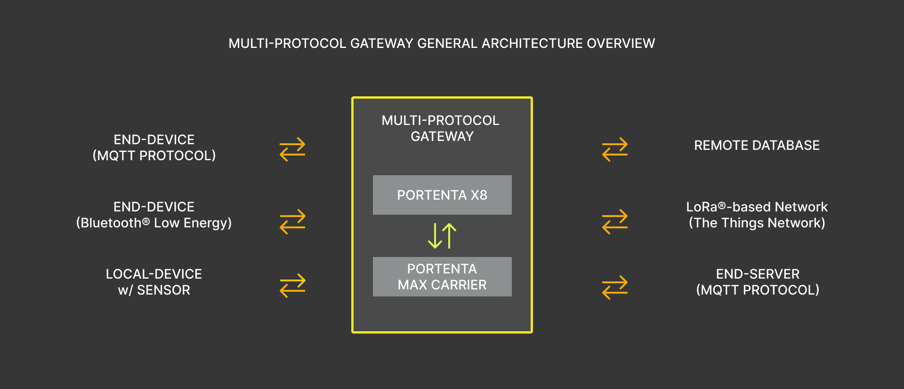
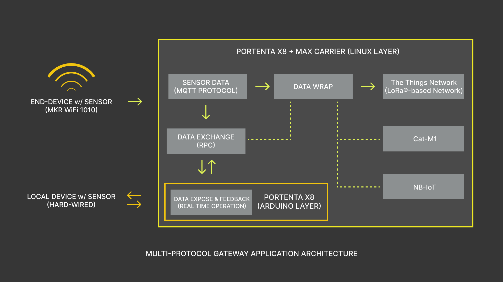
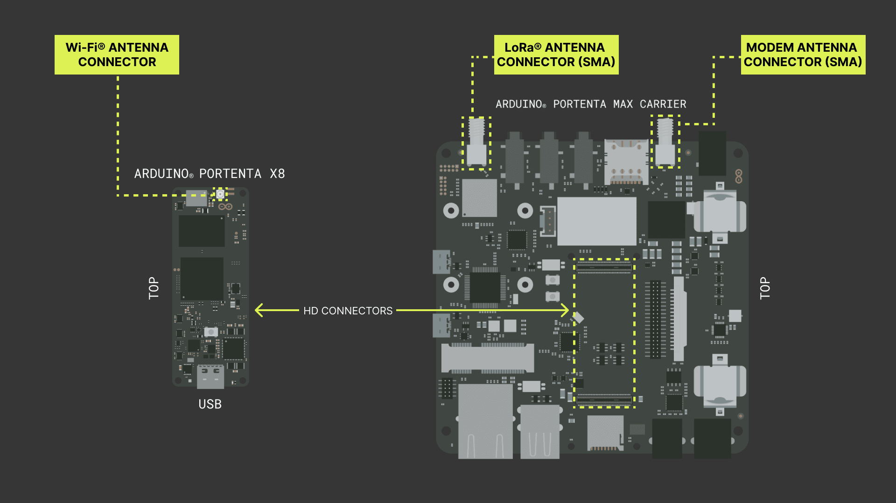
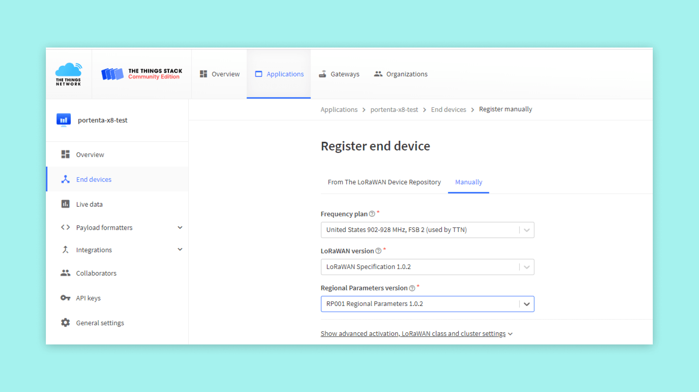
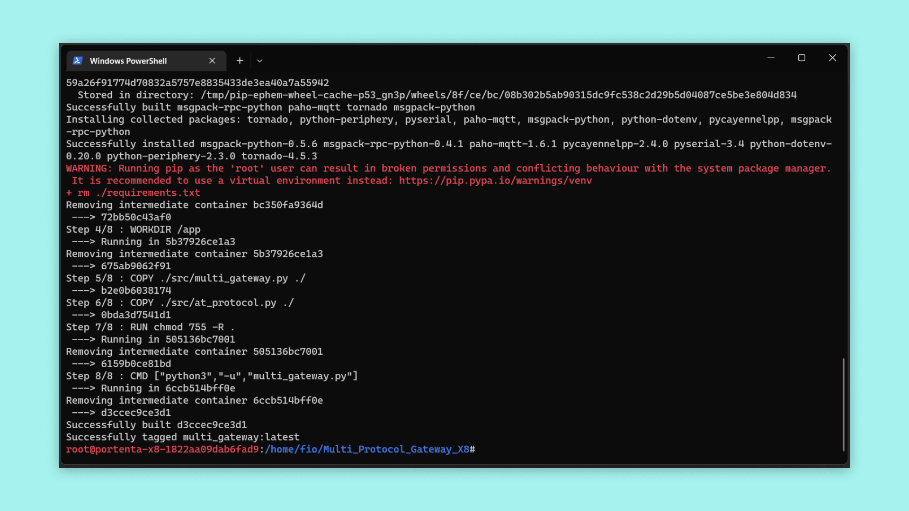
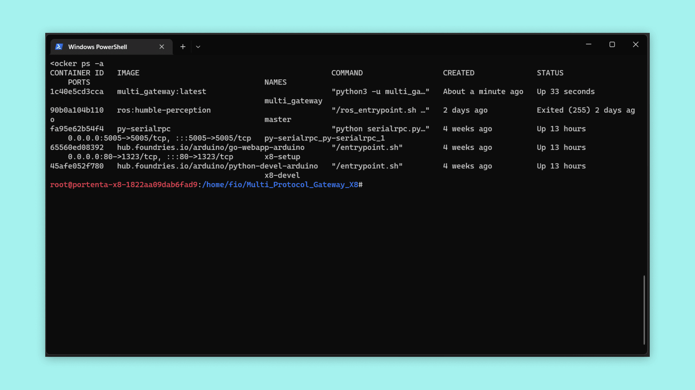
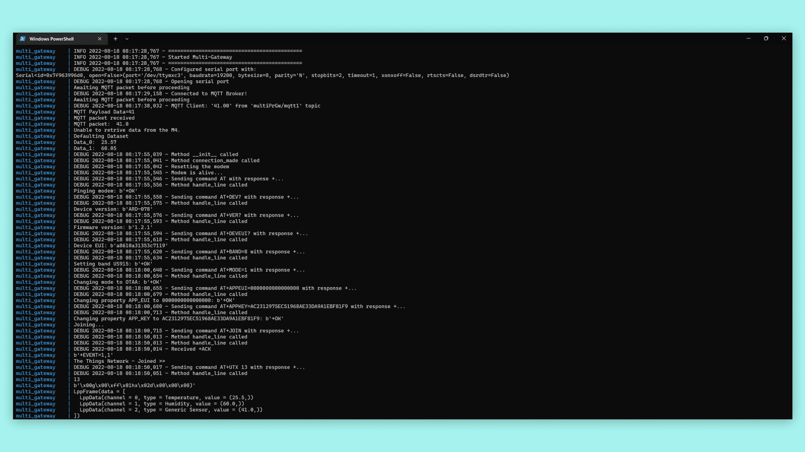

## Overview

Portenta X8 has the NXP® i.MX 8M Mini MPU (Linux) and STM32H747XI dual Cortex®-M7+M4 32bit low power ARM® MCU (Arduino) stacked together and can be used to design different workloads for these two different microprocessors. We will use the Portenta Max Carriers onboard CMWX1ZZABZ-078 LoRaWAN® module from Murata® and the Wi-Fi® connectivity from Portenta X8 to build a Multi-Protocol Gateway.

In this tutorial, we will go through the steps on how to set up both the Linux and Arduino sides. A device collecting sensor data will transfer the data via Wi-Fi®, receive the data, and exchange them between the Arduino and Linux layers, finally using LoRaWAN® to send the information to *The Things Network*. We will also configure and expose a local communication lane to further expand its capability if a local sensor is desired.

## Goals

- Build an Arduino layer script using RPC to handle sensor readings or data traffic on Portenta X8
- Build a multi-protocol script to manage MQTT protocol and LoRa® connectivity to handle data traffic on the Linux layer of Portenta X8
- Assemble both layer scripts to build an operational multi-protocol gateway using Portenta X8 and Max Carrier

### Required Hardware and Software

- [Arduino Portenta X8](https://store.arduino.cc/products/portenta-x8)
- [Arduino Portenta Max Carrier](https://store.arduino.cc/products/portenta-max-carrier)
- USB-C® cable (either USB-C® to USB-A or USB-C® to USB-C®)
- Wi-Fi® Access Point with Internet Access
- 868-915 MHz antenna with SMA connector
- ADB: [Check how to connect to your Portenta X8](https://docs.arduino.cc/tutorials/portenta-x8/user-manual#out-of-the-box-experience)
- [Multi-protocol gateway example code](assets/Multi_Protocol_Gateway_X8.zip)
- [Arduino IDE 1.8.10+](https://www.arduino.cc/en/software), [Arduino IDE 2](https://www.arduino.cc/en/software), or [Arduino Web Editor](https://create.arduino.cc/editor)

## Multi-Protocol Gateway Basics

A gateway is a network node and a key point for data exchange between different networks under certain specifications. It refers to hardware with specific protocol that communicates between two networks. On the other hand, a **multi-protocol gateway** goes one step further by implementing multiple protocols in a single gateway.

The idea of **Multi-Protocol Gateway** is to build a device that will establish an information relay that handles incoming and outgoing data traffic using different connectivity protocols.

This means the gateway can receive the data transmitted in a certain protocol type and relay data in a different protocol for a remote server. Such a feature provides the ability to develop distinctive protocol types and relays the data with less complexity. An example could be an IoT gateway that takes orders from a remote server connected to the internet and transforms those orders into the *Bluetooth® Low Energy* protocol to turn on and off smart light bulbs.

The Portenta X8 paired with the Portenta Max Carrier has the potential to create synergies between different protocols, being the following connectivity tools at your disposal:

- Wi-Fi® (MQTT Protocol, API calls, custom protocols)
- Bluetooth® Low Energy
- LoRaWAN® (*The Things Network*)
- NB-IoT & Cat-M1

The following image illustrates an architecture overview of a multi-protocol gateway composed of Portenta X8 and Max Carrier as the gateway system.



This tutorial focuses on developing a multi-protocol gateway using some connectivity modules. Yet, this Portenta combination still has much to offer. To get the most out of it, we will go step by step through how to establish the multi-protocol gateway and add scalability to expand its capability.

We will go through how to use RPC to expose data received from the Arduino layer to the Linux layer if further development requires you to feed data to devices interfaced to communicate with the M4 core. We will leave the tasks running and open to interface for expanding the capability of the Portenta X8 and Max Carrier. It will let you develop a gateway system where:

1. The Arduino layer will be the terminal to expose the received sensor data to control a local end device.
2. A local end-device transfers data to the Linux layer for further networking operation.

Hence the multi-protocol architecture will process and manage the data traffic with the desired protocol.

Foremost, you will learn how the multi-protocol gateway is implemented with a Portenta X8 paired with a Max Carrier. Some other tutorials will be referenced to guide you through the present tutorial, as it involves mechanisms that are extensive to cover.

## The Arduino Layer

The Arduino layer extends within the M4 Core, which is the layer dedicated to real-time operations development. Thus, you can use the Arduino layer to perform Proportional-Integral-Derivative (PID) tasks and make the RPC calls to exchange data with the Linux layer. An example could be a temperature sensor driven with PID controller, which will use the actual reading as input and compare with the desired temperature target to provide an output for the control element.

***To learn in-depth about how to exchange data using RPC between Arduino and Linux layer, please check out the [User Manual: Communication Between Linux And Arduino](https://docs.arduino.cc/tutorials/portenta-x8/user-manual#communication-between-linux-and-arduino) or [Data Exchange Between Python® on Linux and an Arduino Sketch](https://docs.arduino.cc/tutorials/portenta-x8/python-arduino-data-exchange)***

## The Linux Layer

It is important to understand that **all networking processes are made within the Linux layer**. All network processes are Wi-Fi®, Bluetooth® Low Energy, LoRa®, NB-IoT, and Cat. M1. We will focus on using Wi-Fi® with MQTT protocol and LoRa® connectivities to establish a multiple protocol gateway.

The Portenta X8 provides Wi-Fi® connectivity and the Portenta Max Carrier provides a LoRaWAN® module that can help to communicate with *The Things Network*. We will use the MQTT protocol to receive sensor data transmitted by an end device.

We will use a Python® script to configure and handle the connectivity modules and their sensor data. The RPC calls will expose the received sensor data to the Arduino layer, setting up data exchange configuration to expand the capability of the Portenta X8 and Max Carrier. The process can also be done vice-versa, using the Arduino layer to transmit the data to the Linux layer from the local end device.

Now that we know the roles of Arduino and Linux layer, we will need a clear picture of how the multi-protocol gateway should look. The following diagram illustrates the in-depth multi-protocol gateway architecture, showing how each layer and module will cooperate.



## Instructions

To showcase the ability of the Linux layer and Arduino layer extended by M4 Core, we will build a multi-protocol gateway that will receive MQTT protocol packages using EMQX as the broker, retrieve the data from a local sensor attached to Portenta via RPC mechanism, wrap the data together and send to *The Things Network* using LoRa® connectivity within Cayenne Low Power Payload Encoder.

The Cayenne Low Power Payload Encoder is one of the payload formatters for data exchange between end devices and has compatibility support for Arduino boards. The encoder has the capability to decode CayenneLPP payload formats without additional custom code, and it helps simplify data transmission over LPWAN networks as LoRaWAN®.

***You can find more information regarding Cayenne Low Power Payload Encoder by following [here](https://www.thethingsindustries.com/docs/integrations/payload-formatters/cayenne/)***

With this, following sections will help you get a better understanding of how the Portenta X8 and the Portenta Max Carrier can help you develop a multi-protocol gateway.

### Hardware Setup

Before setting up the software, it is necessary to configure the hardware to be able to develop and work on the Multi-Protocol gateway. Attach the Portenta X8 to the Portenta Max Carrier High-Density Connectors and be sure to attach an antenna for LoRa® connectivity to the Portenta Max Carrier. The Portenta X8 also needs to have the Wi-Fi® antenna attached to it.



***If you have not set up your Portenta X8, please have a look at [User Manual's Out-of-the-box experience](https://docs.arduino.cc/tutorials/portenta-x8/user-manual#out-of-the-box-experience)***

### Setting Up The Portenta X8

Before you begin diving deep into creating a Multi-protocol gateway, and having understood that you will frequently communicate between Arduino and Linux layers, you will have to understand how to debug and observe these 2 layers interact.

The `m4-proxy` is a service that manages data exchange between these layers. You can use the following command in the terminal to observe if the service is running correctly.

```
sudo journalctl -fu m4-proxy
```

Now you will implement RPC (Remote Procedure Call) to establish communication between the Arduino and Linux layers, which is a communication mechanism developed to exchange data between these two layers.

**You will not be able to check messages via `Serial.println()` statements** to check if the Arduino sketch is running in the desired manner. You will have to use instead **`py-serialrpc`**, which is a service that will assist you in listening to those messages, and printing them on a console on the Linux layer. To have the service active, please download [this compressed file](assets/py-serialrpc.zip) to build and run the container on the Linux side of Portenta X8. Please execute the following commands to have the service running.

```
// Copy the decompressed files in ../adb/32.0.0 
adb push py-serialrpc /home/fio
adb shell

sudo su -

// Head to directory and mount the container
cd /home/fio/py-serialrpc
#py-serialrpc sudo docker build . -t py-serialrpc 
#py-serialrpc sudo docker-compose up -d
```

To access the logs of `py-serialrpc` service, while maintaining the same directory, execute the following command.

```
sudo docker-compose logs -f --tail 20
```

***For more details about how data exchange between Arduino and Linux layer works and to understand how to debug, please read [Data Exchange Between Python® on Linux and an Arduino Sketch](https://docs.arduino.cc/tutorials/portenta-x8/python-arduino-data-exchange)***

If you have not configured internal Wi-Fi® connectivity within the system, please use the following command line:

```
nmcli device wifi connect "SSID" password "PASSWORD"
```

### Setting Up The Things Network

You now have the prerequisites for the Portenta X8 ready, but since you are using the LoRa® connectivity, you will need a platform capable of receiving data transmitted from the Portenta X8 and Max Carrier. **The Things Network** will be the platform we will use to communicate using LoRaWAN®. On the platform, you will need to create an application to add the Portenta Max Carrier as an End-Device.

**Manual** option will be used when adding the End-Device. The Portenta Max Carrier will be added under Arduino SA to be included within the LoRaWAN® Device Repository. The LoRaWAN® version and parameters compatible with the Portenta Max Carrier are as follows. The frequency plan will depend on the region in which you are going to install the device.



***To learn more about LoRa® and LoRaWAN®, please have a look at our [Arduino Guide to LoRa® and LoRaWAN®](https://docs.arduino.cc/learn/communication/lorawan-101). Additionally, if you wish to learn how to properly set up the End-Device in The Things Network, please read [this tutorial](https://docs.arduino.cc/tutorials/mkr-wan-1310/the-things-network) reference***

We will now build a multi-protocol gateway using Portenta X8 and Max Carrier.

### Building the Multi-Protocol Gateway

It is important to put all the requirements into a functional task that will orchestrate every protocol to use. You will have to create the following files and the required codes for your multi-protocol gateway.

You will need the Docker files that will configure and let you build a working container.

***If you are unfamiliar with Docker and containers, please read the tutorial on how to [Create and Upload a Custom Container to the Portenta X8](https://docs.arduino.cc/tutorials/portenta-x8/custom-container)***

You can access the files [here](assets/Multi_Protocol_Gateway_X8.zip). Meanwhile, let's go through some of the important details of the included files.

#### Container Build File: Docker Compose

The `docker-compose.yml` file is where you define permissions and settings for the involved container. This helps to define service dependencies and provide an easy configuration. It will allow to deploy and configure for multiple containers within its defined instructions.

```
version: '3.6'

services:
  multi_gateway:
    image: multi_gateway:latest
    container_name: 'multi_gateway'
    ...
    extra_hosts:
      - 'm4-proxy:host-gateway'
    devices:
      - '/dev/ttymxc3'
      - '/dev/gpiochip5'
    tty: true
    user: "0"
```

In this scenario, we are granting the Portenta a major permission if it needs to access certain modules or peripherals. It is required since we are using several radio modules and peripherals that will connect to the sensors. It also tells to build the image file to be built locally.

#### Container Build File: Requirements

Here you will define which additional components are required to run the script built inside the container. If you decide to develop further with a different protocol, you will have to add the package to be able to use them for development.

```
msgpack-rpc-python
pyserial==3.4
python-periphery==2.3.0
python-dotenv
pycayennelpp
paho-mqtt
```

#### Multi-Protocol Python® Application

This is the main Python® script that will handle the overall networking process. We will highlight important lines of the code to help you understand how these code pieces work together to build a gateway based on multiple protocols. For the full Python® script, please refer to the files [here](assets/Multi_Protocol_Gateway_X8.zip).

First up, is the configuration for the M4 Proxy Server, which are the parameters that handle communication with the M4 core that extends the Arduino layer. The `m4_proxy_port` is configured to `5001`, as it is the port used by clients to send the data to the M4.

```python
#M4 Proxy Server Configuration
# Fixed configuration parameters
port = 8884
publish_interval = 5

# The M4 Proxy address needs to be mapped via Docker's extra hosts
m4_proxy_address = 'm4-proxy'
m4_proxy_port = 5001
```

The `get_data_from_m4()` function handles data retrieval from the Arduino layer (M4 Core). It will manage the available information to use with the Python® script. The `RpcAddress()` defines the proxy address and port for M4, which then is used as an argument for `RpcClient()` to pull the sensor data within the M4 core proxy configuration. The data is requested by indicating the name of the data variable with the `rpc_client.call(DATA)` method.

```python
def get_data_from_m4():

    rpc_address = RpcAddress(m4_proxy_address, m4_proxy_port)

    data = ()

    try:
        rpc_client = RpcClient(rpc_address)
        rpc_data0 = rpc_client.call('Data_0')

        rpc_client = RpcClient(rpc_address)
        rpc_data1 = rpc_client.call('Data_1')

        data = rpc_data0, rpc_data1

    except RpcError.TimeoutError:
        print("Unable to retrieve data from the M4.")

    return data
```

For MQTT configuration, you will need to set the desired parameters. Below you can find the parameters we use for MQTT in this tutorial.

```python
mqtt_broker = 'broker.emqx.io'
mqtt_port = 1883
mqtt_topic = "multiPrGw/mqtt1"
# Generate client ID with pub prefix randomly
mqtt_client_id = f'python-mqtt-{random.randint(0, 100)}'
mqtt_username = 'emqx'
mqtt_password = 'public'
```

These 2 parameters are required to establish a connection with *The Things Network*. The `APP_EUI` and `APP_KEY` are required to be configured, as they are provided by *The Things Network* or from the LoRaWAN® platform that you may try to establish the connection. Additionally the `DEV_EUI` will be predefined as the device will request and apply the EUI. However, if it requires different `DEV_EUI`, you can make the change in this section.

```python
# Obtained during the first registration of the device
SECRET_APP_EUI = 'XXXXXXXXXXXXXXXX'
SECRET_APP_KEY = 'XXXXXXXXXXXXXXXXXXXXXXXXXXXXXXXX'
```

With these parameters configured, you have secured the connection between your device and *The Things Network*. *The Things Network* would be your end-point of the data of interest. And to send data, you need to begin by gathering this data, which can be from sensors or modules with status feedback. A sensor can be attached directly communicating via the Arduino layer to receive the data, wrap it and send it to *The Things Network*. Meanwhile, you will also need to have a mechanism that will be able to intercept data sent over Wi-Fi® connectivity using an MQTT protocol.

The following tasks are the main processes that handles the MQTT protocol. It will allow to decode incoming packets from the subscribed device and buffer the data if a timeout has occurred while waiting on the MQTT packet. In this way, you will be able to receive sensor data from any external device. For example, using Arduino MKR WiFi 1010 with a sensor attached over MQTT protocol.

```python
# MQTT protocol handler
...
def connect_mqtt() -> mqtt_client:
    def on_connect(client, userdata, flags, rc):
        if rc == 0:
            logging.debug("Connected to MQTT Broker!")
        else:
            logging.debug("Failed to connect, return code %d\n", rc)

    client = mqtt_client.Client(mqtt_client_id)
    client.username_pw_set(mqtt_username, mqtt_password)
    client.on_connect = on_connect
    client.connect(mqtt_broker, mqtt_port)
    
    # Thread in the background calling loop() in an automatic manner
    client.loop_start()
    return client

def on_message(client, userdata, msg):
    logging.debug(f"MQTT Client: `{msg.payload.decode()}` from `{msg.topic}` topic")

    decoded_mqtt_payload = json.dumps(EncodeFloat(msg.payload.decode("utf-8")))
    print("MQTT Payload Data=%.15g" % (float(decoded_mqtt_payload)))
    
    # `mqtt_data` is the payload decoded within receiving MQTT packet from a remote device
    mqtt_data.append(float(decoded_mqtt_payload))
    client.loop_stop()

    return mqtt_data

def subscribe(client: mqtt_client):
    global mqtt_data
    mqtt_timeout = time.time() + 60

    client.subscribe(mqtt_topic)
    client.on_message = on_message

    while len(mqtt_data) <= 0:
        print(f"Awaiting MQTT packet before proceeding")
        time.sleep(publish_interval)
        if time.time() > mqtt_timeout:
            print(f"No MQTT packet is received - Defaulting Data")
            mqtt_data = [0.0]
            break
    else:
        print(f"MQTT packet received")

    print(f"MQTT packet: ", mqtt_data[0])
...
```

For LoRa® connectivity, to establish communication with *The Things Network*, we will use the Cayenne Low Power Payload Encoder as part of the process in this build.

```python
...
frame = LppFrame()
frame.add_temperature(0, rpc_data[0])
frame.add_humidity(1, rpc_data[1])

# MQTT payload as Generic 4-Byte Unsigned Integer 
frame.add_generic(2, mqtt_data[0])

# Encoding packet for transmission
payload = bytes(frame)
lora_module.sendBytes(payload, len(payload), False)
...
```

#### Multi-Protocol Arduino (M4) Application

For the full Arduino scripts, please refer to the files found inside [this compressed file](assets/Multi_Protocol_Gateway_X8.zip).

The following sketch is for the Arduino layer to retrieve the data between Arduino and Linux layers.

```arduino
/**
  Multi-Protocol Gateway With Portenta X8 & Max Carrier
  Name: m4_to_python
  Purpose: Sketch to transport analog values for testing purposes. Sensor can be attached and
  modified accordingly to transport data to Linux layer. This is to be used as a reference sketch
  and can be adapted to required design specification on communicating M4 to Linux layer on
  Portenta X8.

  @author Arduino
*/
# Arduino side sketch
#include <RPC.h>
#include <SerialRPC.h>

const long interval = 1000;
unsigned long previousMillis = 0;

void setup(){
    pinMode(PA_12, INPUT);
    //RPC.begin();

    Serial.begin(115200);
    while (!Serial) {}

    Serial.println("M4 Layer - Multi Protocol Gateway");
    
    RPC.bind("Data_0", []{ return analogRead(A0); });
    RPC.bind("Data_1", []{ return analogRead(A1); });

    Serial.println("Service Begin");
}

void loop(){
  unsigned long currentMillis = millis();

  if (currentMillis - previousMillis >= interval) {
    previousMillis = currentMillis;

    //record random value from A0 and A1
    Serial.println(analogRead(A0));
    Serial.println(analogRead(A1));

  }
}
```

The sketch above will help expose and transfer the data processed within the Linux side. Transferring data to the Linux side can be seen as a direct communication, as the sensor connected and monitored via the Arduino side will send this data over LoRa® connectivity. For this build, we will use Analog readings to emulate the functionality.

Additionally, by exposing, you will bring forth the data received within the Linux side to the Arduino side to feed the local device as a control input. It can be used to display the data if you wish to for instance. The implementation is possible within this script if you wish to develop further desired multi-protocol gateway architecture.

For MQTT publishing, we have also included a sketch that can be used with Arduino MKR WiFi 1010 to test the gateway build. Of course, the code can be extended and modified according to the requirements of the device that will collect data from a certain sensor to send over the MQTT protocol.

```arduino
/**
  Multi-Protocol Gateway With Portenta X8 & Max Carrier
  Name: mqtt_publisher
  Purpose: Simple MQTT publisher and can be used with Multi-Protocol Gateway process. It uses EMQX broker
  but it can be changes to Mosquitto broker for example if required. 

  @author Arduino
*/

#include <ArduinoMqttClient.h>
#include <WiFiNINA.h>
#include "arduino_secrets.h"

// Please enter your sensitive data in the Secret tab/arduino_secrets.h
char ssid[] = SECRET_SSID;    // Your network SSID (name)
char pass[] = SECRET_PASS;    // Your network password (use for WPA, or use as key for WEP)

WiFiClient wifiClient;
MqttClient mqttClient(wifiClient);

const char broker[] = "broker.emqx.io";
int        port     = 1883;
const char topic[]  = "multiPrGw/mqtt1";

//Set interval for sending messages (milliseconds)
const long interval = 50000;
unsigned long previousMillis = 0;

int count = 0;

void setup() {
  //Initialize serial and wait for port to open:
  Serial.begin(9600);
  while (!Serial) {
    ; // Wait for serial port to connect. Needed for native USB port only
  }

  // Attempt to connect to Wifi network:
  Serial.print("Attempting to connect to WPA SSID: ");
  Serial.println(ssid);
  while (WiFi.begin(ssid, pass) != WL_CONNECTED) {
    // Failed, retry
    Serial.print(".");
    delay(5000);
  }

  Serial.println("You're connected to the network");
  Serial.println();

  Serial.print("Attempting to connect to the MQTT broker: ");
  Serial.println(broker);

  if (!mqttClient.connect(broker, port)) {
    Serial.print("MQTT connection failed! Error code = ");
    Serial.println(mqttClient.connectError());

    while (1);
  }

  Serial.println("You're connected to the MQTT broker!");
  Serial.println();
}

void loop() {
  // Call poll() regularly to allow the library to send MQTT keep alive which
  // avoids being disconnected by the broker
  mqttClient.poll();

  unsigned long currentMillis = millis();

  if (currentMillis - previousMillis >= interval) {
    // Save the last time a message was sent
    previousMillis = currentMillis;

    // Record random value from A0, A1 and A2
    float Rvalue = analogRead(A0);

    Serial.print("Sending message to topic: ");
    Serial.println(topic);
    Serial.println(Rvalue/10);

    // Send message, the Print interface can be used to set the message contents
    mqttClient.beginMessage(topic);
    mqttClient.print(Rvalue/10);
    mqttClient.endMessage();

    Serial.println();
  }
}
```

### Mounting the Multi-Protocol Gateway

It is now time to make the multi-protocol gateway run and for this, you will need to build the Docker container that will help you operate in the background on the Linux layer. Using the terminal, you can use the following commands to get the multi-protocol gateway container up and running.

You will need to have the files ready in a folder inside the `adb` directory within Arduino root.

```
C:\Users\#USERNAME#\AppData\Local\Arduino15\packages\arduino\tools\adb\32.0.0
```

Having the files ready in that directory, you can use the following commands to push the files to the `fio` directory inside the Portenta X8. The second command will let you navigate inside the Portenta X8.

```
adb push multi-protocol-gateway /home/fio
adb shell
```

You will now build the container using the following commands. The following command will tag the container with `Multi_Protocol_Gateway_X8` as its name.

```
cd ../home/fio/Multi_Protocol_Gateway_X8
#Multi_Protocol_Gateway_X8 sudo docker build . -t multi_gateway
```

You will be able to see the following results when the image is built successfully.



***If you have created the Docker container previously and want to re-create it with new changes made outside the shell, please check that the container and its build directory are stopped and removed. It is for the convenience of having a clean working environment***

After a successful container build, you will run the image. To do that, you can use the following command. This command will immediately give an output in your terminal, telling you how the Python® script is running. If you wish to have it running in the background, please add the `-d` flag at the end of the command.

```
#Multi_Protocol_Gateway_X8 sudo docker-compose up
```

Finally, you will have the multi-protocol gateway running, which uses Wi-Fi® and LoRa® connectivity. Also, RPC for exchanging data between its layers. However, there are cases where you would wish to make changes by adding more functionalities, such as including Cat. M1 or NB-IoT to expand its communication spectrum. For this, you will need to stop the image. To stop the image from running, you can use the following command.

```
#Multi_Protocol_Gateway_X8 sudo docker-compose down
```

Getting to know the status of the image is also crucial as it is the indicator of the state of operation. The following command brings up **active** containers and shows the status if the container restarted or stopped due to certain reasons. The second command lists built images and it will show you the components that go with the main image that you're building.

```
docker ps -a
docker images
```



With all this, you have built a running multi-protocol gateway based on Portenta X8 and Max Carrier. You will be able to observe the data sent by the gateway with *The Things Network* platform End-Device section under Applications.

If you are curious about what to expect from the build you have made in this tutorial, the following image shows you the terminal of the running multi-protocol gateway.



## Conclusion

In this tutorial, you have learned how to set up a Multi-Protocol Gateway composed of MQTT protocol, RPC, and LoRaWAN®, by using the Portenta X8 and the Portenta Max Carrier. You have built the gateway that will connect to *The Things Network* to send the desired data. Also, the gateway is capable of exchanging data between Arduino and Linux layers using RPC, in which you have exposed the ports to be able to receive data from the local sensor to be sent directly to *The Things Network*.

### Next Steps

- Now that you have developed a multi-protocol gateway, using Wi-Fi® and LoRaWAN® connectivity, expand the gateway's capability by adding other connectivity types such as Cat. M1 and NB-IoT.
- Expand functionalities for data processing using RPC while using multi-protocol architecture.

## Troubleshooting

You might encounter some errors or misbehaviors while working on the code, preventing you from progressing in the development. You can try the following troubleshooting tips to solve the commonly known issues:

* If the sketch upload process fails, check if your Portenta X8 is in bootloader mode. To put the Portenta X8 into Bootloader mode, double-press its RESET button and verify that the green LED is blinking. After this, you can try re-uploading the sketch for the Arduino layer.
* Check the position of the BOOT DIP switch of the Portenta Max Carrier. If the Portenta X8 gets into bootloader mode immediately after powering on, including when connected via USB-C®, change the position of the BOOT DIP switch to OFF. This case applies to the Arduino layer.
* If you encounter an issue regarding terminal input inconvenience, please enter `export TERM=xterm` as the command in the terminal to get readable inputs.
* In case an internal Wi-Fi® connection cannot be established through the command input due to "unavailable" SSID, although it is in range. Please try using a different SSID if available or a hotspot from a different device to host network connectivity.  
* If you encounter a docker image conflict when running after building, please make sure you have used a name tag that matches the one from the `docker-compose.yml` file.
