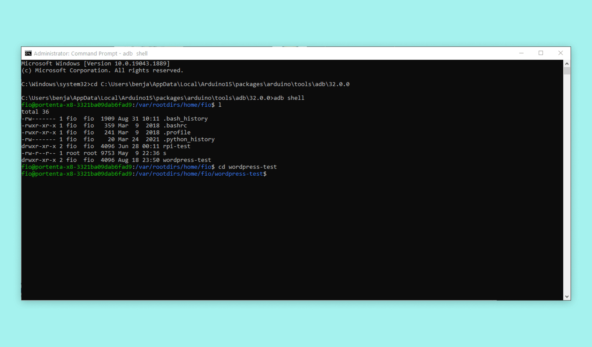
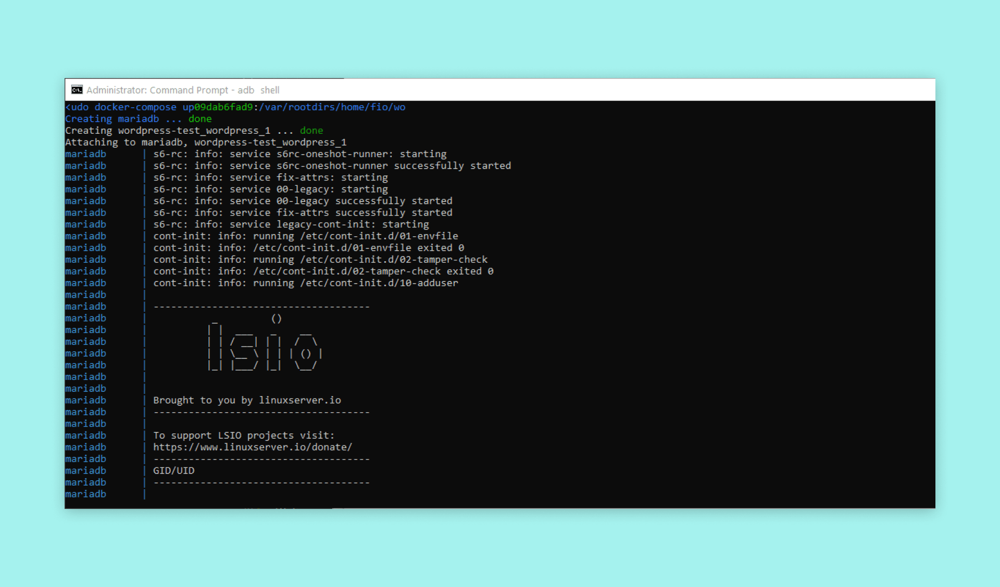
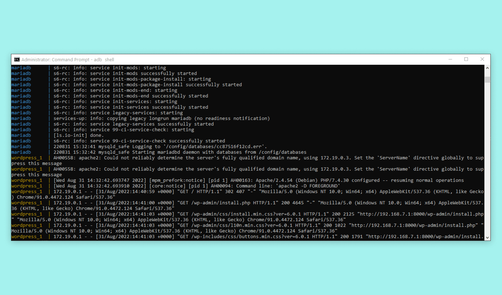
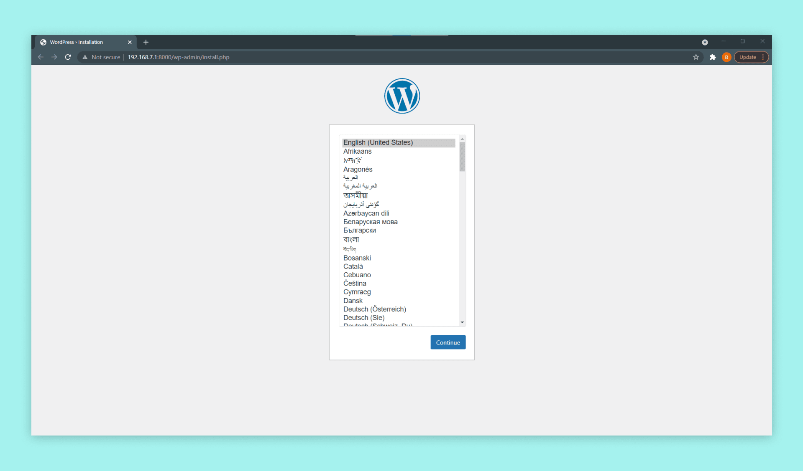

## Overview

The Arduino Portenta X8 is a powerful board that has many features that can be easily utilized with the help of Docker containers. In this tutorial, we will be using the Portenta X8 to host a web server and run WordPress using containers. This is a simple way to configure and run your own database server container and WordPress page. We can then access the WordPress site on the X8 through our web browser and begin setting it up.

## Goals

- Create the file to install docker containers
- Install and run the containers
- Connect to the WordPress container running on the Portenta X8

### Required Hardware and Software

- [Arduino Portenta X8](https://store.arduino.cc/products/portenta-x8)
- USB-C® cable (either USB-C® to USB-A or USB-C® to USB-C®)
- [Docker-compose.yml](assets/docker-compose.rar) file used in this tutorial

## Instructions

First, make sure your Portenta X8 is set up correctly by following the [User Manual's Out-of-the-box experience](https://docs.arduino.cc/tutorials/portenta-x8/user-manual#out-of-the-box-experience).

### Creating the Docker-compose.yml File

The WordPress container we use is a multi-container application, which also requires a database server container. The WordPress multi-container application uses Apache as its web server. This is required to make the service work and it is already included in the container, so it is nothing for us to worry about. We will be using **MariaDB** as our database server container. 

This container can run on the Portenta X8's architecture. All we need to start using these containers is to write a **docker-compose.yml** file. This file will contain information about what image we want to install and some important configuration information, such as the username for the database, password, timezone and database name. The same goes for the WordPress container: it will contain the password and username and we will also enter the database hostname and which container will be used as the database. We recommend that you change the default passwords to more secure ones by replacing the default ones that are stated in the file below.


### The Complete Docker-compose.yml File

In this section, you can find the complete **docker-compose.yml** file that we will be using for this tutorial.

```
version: "3.9"
    
services:
  db:
    image: mariadb:latest
    container_name: mariadb
    environment:
      - PUID=1000
      - PGID=1000
      - MYSQL_ROOT_PASSWORD=Wordpress
      - TZ=Europe/London
      - MYSQL_DATABASE=Wordpress
      - MYSQL_USER=Wordpress
      - MYSQL_PASSWORD=Wordpress
    volumes:
      - db_data:/var/lib/mysql
    restart: unless-stopped
    
  Wordpress:
    depends_on:
      - db
    image: wordpress:latest
    volumes:
      - Wordpress_data:/var/www/html
    ports:
      - "8000:80"
    restart: always
    environment:
      WORDPRESS_DB_HOST: db
      WORDPRESS_DB_USER: Wordpress
      WORDPRESS_DB_PASSWORD: Wordpress
      WORDPRESS_DB_NAME: Wordpress
volumes:
  Wordpress_data: {}
  db_data: {}
```

Now let's create a directory on our X8 and put this **docker-compose.yml** file on our device. You can download the file by clicking [here](assets/docker-compose.rar).

### Installing The Containers

First, we create a directory where we want to add our **docker-compose.yml** file. Using the `mkdir` command we will create a directory named "wordpress-test". Navigate into this directory with a simple `cd` command. Either copy the docker-compose.yml file into this directory or create it directly here. To create the file, we can use `cat > docker-compose.yml`, this will create the file, so you can copy the content of the file from above and paste it. Push enter once to go to a new line and press `ctrl C` to exit the file editor. To copy the file from your computer onto the device use: `adb push <path to docker-compose.yml file> /home/fio/wordpress-test`.



***Remember that you may need to run the next command to gain admin access for running the Docker's commands: ```sudo su -```  which default password is **```fio```** ***

Before installing the containers, make sure that no other container is running on the ports that the WordPress container will use. You can check what containers are running and what port they are using by running the `docker ps -a` command. This will show a list of the currently installed and running containers on the Portenta X8. To remove a container first stop it with `docker stop <container id>`, then you can run `docker rm <container id>` to remove it. If you want more information about handling containers on your Portenta X8, take a look at our [Managing Containers with Docker tutorial](https://docs.arduino.cc/tutorials/portenta-x8/docker-container).

When you are in the correct directory and no other container is running on the ports that WordPress will use, you can now run `docker compose up -d`. Using the `-d` tag in the command will allow running these containers in the background. If you run the command without the `-d` tag, the application will exit when you close the terminal.

When the command is executed it will start installing the **WordPress** and **MariaDB** containers. This can take a while. To get the output from the containers use: `docker-compose logs -f`. Once it is done you can connect to the device and site.



### Connecting to the WordPress Site

To connect to the WordPress setup site, you simply need to access it with your Portenta X8s unique id and port. So for example: `http://portenta-x8-<uuid>.local:<port>`, where you would substitute the `<uuid>` with your Portenta X8's unique id and the port chosen for the WordPress container with `<port>`. The `<uuid>` can be found on the setup page that is shown in the [User Manual's Out-of-the-box experience](https://docs.arduino.cc/tutorials/portenta-x8/user-manual#out-of-the-box-experience), but you can also see it in the terminal when running `adb` or you can go to `http://192.168.7.1:8000` if you use Windows and Linux, on MacOS use `http://192.168.8.1:8000`.

When you connect, you should get some feedback in the terminal. Text will begin printing in the terminal, showing you information about the connection that has just been established as shown in the image below.



Now you should see a webpage, like the following image, in your browser.



You are now free to go through the WordPress setup process and configure it however you like.

### Removing the container ###

If you want to remove the container, you have to go to ```/home/fio/wordpress-test``` directory (where we previously executed the docker-compose command) and execute the following commands according to your needs:

Remove the container but preserves your WordPress database:
```
docker compose down
```

Remove the container and the database:
```
docker compose down --volumes
```

To make sure that it was successful, run ```docker ps -a``` and check that the WordPress and MariaDB containers have disappeared.


## Conclusion

In this tutorial, we went through how to install and run a WordPress and database container on the Portenta X8. We then accessed the WordPress site on our X8 through our web browser. So now you can set up your own WordPress site on your X8 device and access it from another device.


## Troubleshooting

- If the containers are not installing or running correctly, check if there are any other containers currently running on the same ports as the ones used by the WordPress container. You can check this with ``docker ps -a``.
- If there is any issue running docker commands, make sure you are using ``sudo`` before the commands.
- If you cannot connect to the site when everything is running, you can double-check the X8s IP address. Run the command `ip s a` in the **adb shell**. This will display the X8's IP address via USB and WiFi. Try connecting via those IP addresses if all the rest fails.
