## Overview

Flow sensors provide valuable insights for fluid-based industrial systems by monitoring circulation with observable points of interest and detecting anomalies such as leaks, blockages or pressure variations. Traditional methods often rely on threshold-based detection, which may miss subtle deviations indicating potential failures. Integrating machine learning with Edge Impulse enables real-time pattern classification, improving anomaly detection and predictive maintenance processes.

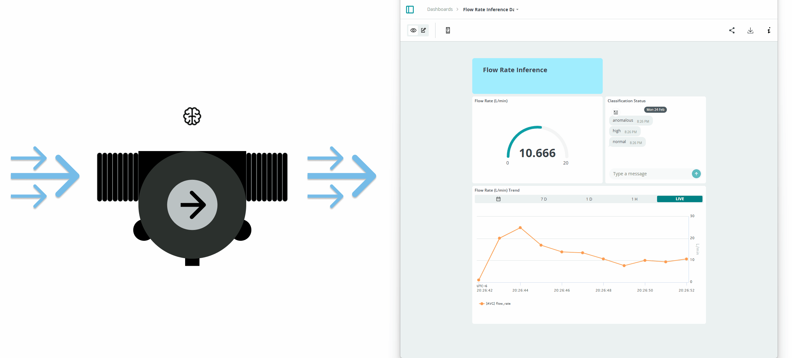

This application note shows how to implement a flow anomaly detection system example using the Portenta X8, a flow sensor and a Docker deployed Edge Impulse model. The Portenta X8 is ideal for this task, offering sensor data acquisition, real-time processing and on-device AI inference in a Linux-based environment using Remote Procedure Call (RPC) for data exchange.

The system captures flow rate data, processes it with a trained model and classifies flow conditions. Results can be used to develop alerts, system responses or cloud updates via Arduino Cloud for remote monitoring and analysis. This approach can help optimize and develop fluid-based industrial systems by combining local AI processing with cloud connectivity and analytics.

## Goals

The application note has the following objectives:

- Monitor fluid movement using a flow sensor.
- Classify flow patterns in real time with a machine learning model trained in Edge Impulse.
- Deploy the trained model inside a Docker container on the Portenta X8.
- Share all collected data and classification results to Arduino Cloud for remote monitoring.

## Hardware and Software Requirements

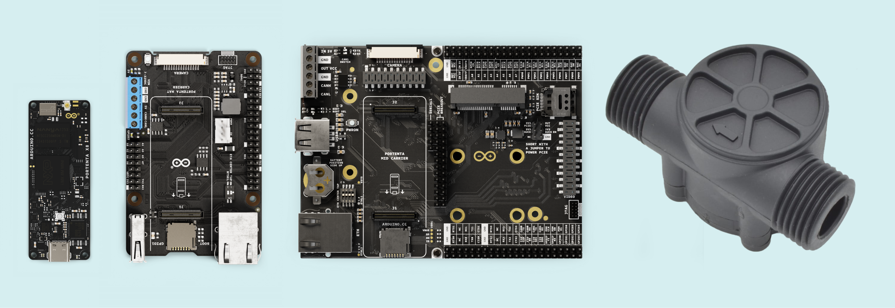

### Hardware Requirements

This application note uses the Portenta X8, integrating a flow sensor for real time fluid monitoring. The required hardware includes:

- [Portenta X8](https://store.arduino.cc/products/portenta-x8) (x1)
- Portenta Carrier Family: [Hat Carrier](https://store.arduino.cc/products/portenta-hat-carrier) / [Mid Carrier](https://store.arduino.cc/products/portenta-mid-carrier) (x1)
- Flow Sensor (e.g. YFS201) (x1)
- [USB-C® cable](https://store.arduino.cc/products/usb-cable2in1-type-c) (x1)
- Wi-Fi® Access Point or Ethernet with Internet access (x1)

### Software Requirements

To start with this application, make sure to have your Portenta X8 running on the latest Linux image.

- Ensure your Portenta X8 has the latest Linux image. Check [this section of Portenta X8's user manual](https://docs.arduino.cc/tutorials/portenta-x8/user-manual/#portenta-x8-os-image-update) to verify that your Portenta X8 is up-to-date.

***For the smooth functioning of the Portenta Hat Carrier with the Portenta X8, it is crucial to have at least Linux __image version > 746__ on the Portenta X8. To update your board to the latest image, use the [Portenta X8's Arduino Wizard Experience](https://docs.arduino.cc/tutorials/portenta-x8/image-flashing/#update-through-arduino-linux-wizard-experience) method or [manually flash it](https://docs.arduino.cc/tutorials/portenta-x8/image-flashing/#update-using-uuu-flashing-tool), downloading the most recent version from this [link](https://downloads.arduino.cc/portentax8image/image-latest.tar.gz).***

To develop and deploy the flow monitoring system, the following software tools and platforms are required:

- Edge Impulse for model training and deployment
- [Edge Impulse® CLI](https://docs.edgeimpulse.com/docs/edge-impulse-cli/cli-overview), to manage Machine Learning models, we can install it following these [instructions](https://docs.edgeimpulse.com/docs/edge-impulse-cli/cli-installation).
- Docker for running inference models on Portenta X8
- [Arduino IDE 2.0+](https://www.arduino.cc/en/software) or [Arduino Web Editor](https://create.arduino.cc/editor)
- The [Arduino Create Agent](https://cloud.arduino.cc/download-agent/)
- The [Arduino Cloud](https://cloud.arduino.cc/). If you do not have an account, you can create one for free inside [cloud.arduino.cc](https://cloud.arduino.cc/home/?get-started=true).

- [Edge Impulse project example](https://studio.edgeimpulse.com/public/208861/live). This is a ready-to-use public Edge Impulse project for this application. You can clone it to explore the dataset, model architecture and training pipeline.

### Download the Project Code

The complete project files can be downloaded here:

- [Portenta X8 onboard inference](assets/python-ei-sensorfusion-rpc-flow.zip)
- [Portenta X8 onboard inference with Arduino Cloud](assets/python-ei-sensorfusion-rpc-flow-cloud.zip)

## Machine Learning Model for Flow Anomaly Detection

Machine learning enables industrial systems to analyze sensor data, recognize patterns and make data-driven decisions. This application implements a machine learning model to classify flow patterns in real-time, detecting anomalies that may indicate leaks, blockages or irregular pressure fluctuations.

By leveraging Edge Impulse, the model is trained to distinguish between normal and abnormal flow conditions based on present sensor data, allowing for predictive maintenance and operational efficiency.

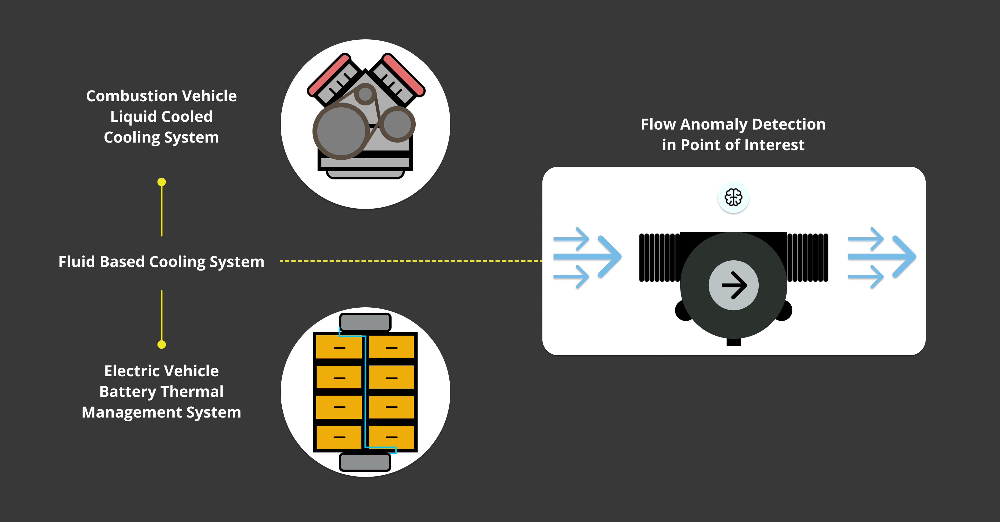

Flow anomaly detection is particularly useful in systems that rely on consistent mass airflow or liquid circulation to maintain optimal performance. For example, most vehicle powerplants require stable coolant delivery to regulate engine temperature.

At the same time, industrial and medical cooling systems must maintain actual flow rates to prevent overheating or component degradation. The system can detect early warning signs of potential failures by classifying flow conditions, allowing proactive intervention.

### Applications of Flow Rate Categorization

This machine learning model can be applied in different industrial and automotive domains where monitoring and controlling fluid flow at different points are important, based on the key application areas where it involves small systems:

| **Application Area**                           | **Examples**                                                                                                                                                                                                                                       |
|------------------------------------------------|----------------------------------------------------------------------------------------------------------------------------------------------------------------------------------------------------------------------------------------------------|
| **Small Automotive Cooling Systems**           | - Engine cooling for motorcycles, ATVs, and small passenger vehicles (<1.5L displacement).<br />- Electric vehicle (EV) battery thermal management to prevent overheating.<br />- Turbo intercooler water circuits for efficient heat dissipation. |
| **Industrial Equipment & Electronics Cooling** | - CNC spindle cooling systems ensuring precision machining.<br />- Laser cooling loops for maintaining stable laser operation.<br />- Small heat exchanger loops used in industrial automation and process control.                                |
| **Medical & Laboratory Cooling**               | - Medical imaging devices (MRI, CT scanners) requiring controlled cooling loops.<br />- Laboratory chillers used in chemical processing and biomedical research.                                                                                   |

### Flow Rate Categorization and Anomaly Detection

The trained model categorizes flow conditions based on real-time measurements from the sensor. The following classification table defines normal and anomalous flow conditions for this application note:

| **Flow Rate (L/min)** | **Category**             | **Potential Issues & Notes**                                                      |
|-----------------------|--------------------------|-----------------------------------------------------------------------------------|
| **<5 L/min**          | **Anomalous (Too Low)**  | Possible blockage, pump failure, cavitation or air pockets in the system.         |
| **5 L/min**           | **Low Flow**             | Typical for idle operation or minimal cooling demand.                             |
| **10 L/min**          | **Normal Flow**          | Steady-state operation under standard cooling requirements.                       |
| **15+ L/min**         | **High Flow**            | Increased demand. This may indicate an oversized pump or excessive cooling.       |
| **>20-30 L/min**      | **Anomalous (Too High)** | Risk of turbulence, leaks, pressure spikes and reduced heat exchanger efficiency. |

By classifying flow rates into these categories, the system can detect abnormal conditions early and take corrective action before performance issues or failures occur.

This approach provides reliable operation in corresponding automotive, industrial and medical cooling applications while reducing maintenance costs and unplanned downtime.

## Anomaly Detection System Setup

This application does not require complex wiring for operation. However, proper hardware setup is required for reliable data acquisition, model inference and cloud integration. The following components are required for system deployment:

- **Portenta X8**: The main processing unit, running Edge Impulse inference inside a Docker container.
- **Portenta Hat/Mid Carrier**: Provides easy access to peripherals and power connections.
- **Flow Sensor (e.g. YFS201)**: Measures real-time flow rate and detects anomalies.
- **USB-C Cable**: Connects the Portenta X8 to a development PC for setup and debugging.
- **Wi-Fi/Ethernet Access**: Enables cloud connectivity for data visualization in Arduino Cloud.

### Hardware Wiring Overview

The system wiring follows a straightforward configuration:


- **Portenta X8**: mounted on the **Portenta Mid/Hat Carrier**, provides access to pinout interfaces and **Wi-Fi** or **Ethernet** connection management for cloud communication.
- **Flow sensor**: connected to the corresponding pins on the **Portenta Mid/Hat Carrier**.
- **USB-C cable**: used for initial setup, debugging and Edge Impulse data collection.

### Powering Options

Both the **Portenta Mid Carrier** and **Portenta Hat Carrier** support multiple power input options, depending on the deployment requirements:

| **Carrier Board**    | **USB-C Power (5V)**                              | **External DC Power** |
|----------------------|---------------------------------------------------|-----------------------|
| Portenta Mid Carrier | For development, debugging and short-term testing | 5 VDC                 |
| Portenta Hat Carrier | For development, debugging and short-term testing | 7 - 32 VDC            |

Setting up the system correctly ensures smooth data collection, machine learning inference, and cloud-based monitoring. With the hardware configured, the next steps focus on data acquisition, model training and deployment.

## Flow Anomaly Detector Model Development

### Model Design

The machine learning model is trained to recognize different flow conditions based on real-time sensor data. A dataset of flow sensor readings is collected at a predefined frequency, capturing variations in fluid movement under different operating conditions.

The raw sensor data is preprocessed using digital signal processing (DSP) techniques to extract relevant features, which are then used to train a model capable of classifying normal and anomalous flow states.

### Data Acquisition

Sensor data needs to be collected across different flow conditions to build a reliable machine learning model. This ensures that the model can accurately distinguish between normal and abnormal flow states based on continuous measurements.

The flow sensor connected to the Portenta X8 captures flow rate readings and sends the data to Edge Impulse using the Edge Impulse Data Forwarder. This process allows active monitoring and labeling of flow patterns under different operating conditions.

To collect training data, the Portenta X8 (or compatible Portenta family) continuously measures the real-time flow rate (L/min) from the sensor. It streams it to Edge Impulse via the Data Forwarder.

The M4 Core captures sensor readings at a 1Hz sampling rate and sends them over serial output. These values are labeled as `Normal`, `Low`, `High` or `Anomalous`, providing a balanced dataset for training and validation.

Once enough labeled data is collected, it is split into training and testing datasets. The model is then trained on different flow conditions while maintaining a separate set for validation.

#### Capturing Flow Sensor Data on the Portenta X8

The Portenta X8’s M4 microcontroller reads flow sensor data and sends it via serial output in CSV format, making it compatible with Edge Impulse for model training.

The following Arduino sketch (`sensor-data-generation.ino`) configures the Portenta X8 to read and send flow rate values at one second intervals.

```arduino
#include <Arduino.h>
#include <FlowSensor.h>

#if defined(ARDUINO_PORTENTA_X8)
#define SerialDebug Serial1  // Use Serial1 for Portenta Carrier family
#else
#define SerialDebug Serial
#endif

// Define Flow Sensor Type (Change if using another model)
#define SENSOR_TYPE YFS201  
#define SENSOR_PIN PC_7                               // Flow sensor signal pin

FlowSensor flowSensor(SENSOR_TYPE, SENSOR_PIN);

// Define 1Hz Sampling Frequency
#define INTERVAL_MS 1000                              // 1 sample per second

static unsigned long last_interval_ms = 0;

// Interrupt function for counting pulses
void count() {
  flowSensor.count();
}

void setup() {
  SerialDebug.begin(115200);
  while (!SerialDebug);

  pinMode(LED_BUILTIN, OUTPUT);
  flowSensor.begin(count);

  SerialDebug.println("Setup complete. Streaming flow rate at 1 Hz");
}

void loop() {
  if (millis() - last_interval_ms >= INTERVAL_MS) { 
    last_interval_ms = millis(); 

    flowSensor.read();
    float flowRate = flowSensor.getFlowRate_m();      // Flow rate in L/min

    // Avoid NaN or Inf issues
    if (isnan(flowRate) || isinf(flowRate)) {
        SerialDebug.println("0.00");                  // Send 0 if no valid reading
    } else {
        SerialDebug.println(flowRate, 2);             // Print flow rate
    }

    // Blink LED to indicate data collection
    digitalWrite(LED_BUILTIN, !digitalRead(LED_BUILTIN));
  }
}
```

#### Streaming Flow Data to Edge Impulse

Once the Portenta X8 is connected via USB and the Arduino sketch is running, Edge Impulse’s Data Forwarder is used to stream flow rate readings into the Edge Impulse platform.

Before running the data forwarder, make sure that Edge Impulse CLI is installed on your system. If not, install it using:

```bash
npm install -g edge-impulse-cli
```

***For detailed Edge Impulse CLI installation instructions, please refer to the [official Edge Impulse documentation](https://docs.edgeimpulse.com/docs/tools/edge-impulse-cli/cli-installation).***

Run the following command to start streaming sensor data from the Portenta X8:

```bash
edge-impulse-data-forwarder --frequency 1
```

***The `--frequency 1` flag sets the data forwarder to send one sample per second, matching the 1Hz sampling rate of the Arduino sketch.***

When prompted, select the Edge Impulse project to which you want to send data.


The data forwarder automatically detects the flow sensor and prompts for naming the data channels.

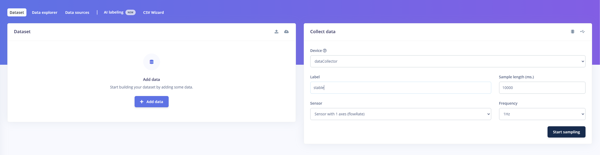

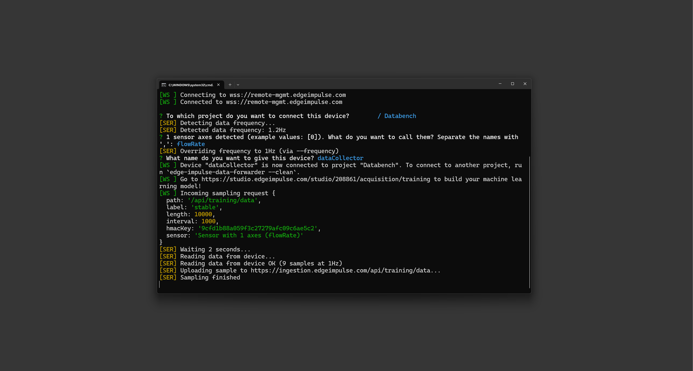

Once configured, Edge Impulse begins receiving real time flow rate data.


The collected flow rate samples are labeled and stored in the Edge Impulse dataset.


***For more detailed information on data forwarding, please refer to [Edge Impulse’s official guide](https://docs.edgeimpulse.com/docs/tools/edge-impulse-cli/cli-data-forwarder).***

After data collection, the labeled dataset is used for feature extraction and model training, so that the system can classify flow anomalies in real-time.

### Feature Extraction

Raw sensor data alone is not sufficient for effective anomaly detection. Digital Signal Processing (DSP) techniques are applied to extract meaningful features from the collected flow data to improve model accuracy. These techniques improve distinguishing between normal and anomalous flow conditions by transforming raw time series data into structured feature sets.

- **Time-Series Analysis:** Captures how the flow rate changes over time, helping identify gradual trends and fluctuations. This is essential for detecting slowly developing anomalies, such as pipe clogging or pump wear.
- **Spectral Analysis:** Converts time-domain signals into the frequency domain, highlighting patterns that may not be evident in the raw data. This helps identify vibrational inconsistencies, leaks or sudden pressure spikes.
- **Statistical Features:** Computes key statistical values to represent the data in Mean, Variance and Standard deviation. Each representation captures the average flow rate, measures the degree of fluctuation and identifies how much the values deviate from the norm, respectively.

These extracted features form the input dataset used to train the machine learning model.

The *Impulse Design* in Edge Impulse structures the feature extraction pipeline, ensuring data is properly preprocessed before being passed to the learning model.

**Time-Series Data Block:**

| **Parameter**       | **Value**                                    |
|---------------------|----------------------------------------------|
| **Window size**     | 10,000 ms (10 seconds)                       |
| **Window increase** | 1,000 ms (1 second)                          |
| **Frequency**       | 1 Hz                                         |
| **Zero-padding**    | Enabled (Ensures consistency in data length) |

This configuration allows flow rate sampling at one second intervals, providing a detailed view of flow dynamics. The following image shows how the flow rate input is structured before processing:

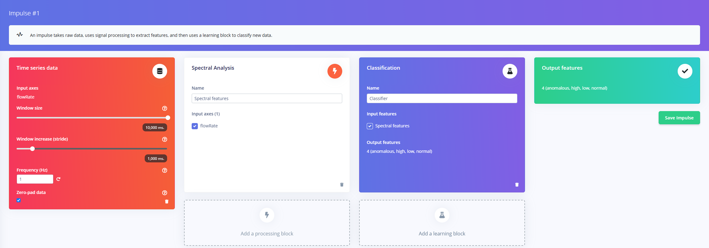

#### Train/Test Split Process

After feature extraction, the dataset needs to be split into *Training* and *Testing* sets to validate the model's performance.

**Train/Test Split Process:** The dataset is automatically divided into:

- Training set (~80%)
- Testing set (~20%)

It makes that the model generalizes well to unseen data and rebalancing is done to maintain category consistency.

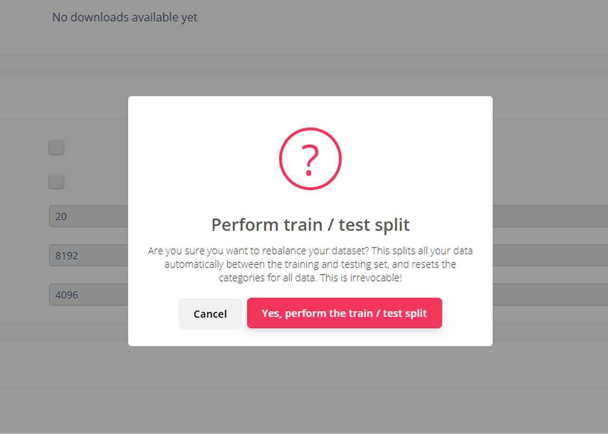


The first image shows the warning before dataset splitting, while the second confirms the successful rebalance of the dataset.

Once split, the dataset contains labeled flow rate data across different operational conditions.

Each data sample is labeled as:

- **Normal:** Flow rate within expected range.
- **Low:** Below normal levels (may indicate blockages or pump inefficiency).
- **High:** Above normal levels, (may indicate pressure spikes or leaks).
- **Anomalous:** Unusual variations that require further investigation.

The following image shows the final dataset distribution with balanced class representation:


#### Spectral Analysis: Frequency Domain Interpretation

Now, the image below shows the DSP feature extraction process, where the raw flow rate data is converted into its spectral representation:

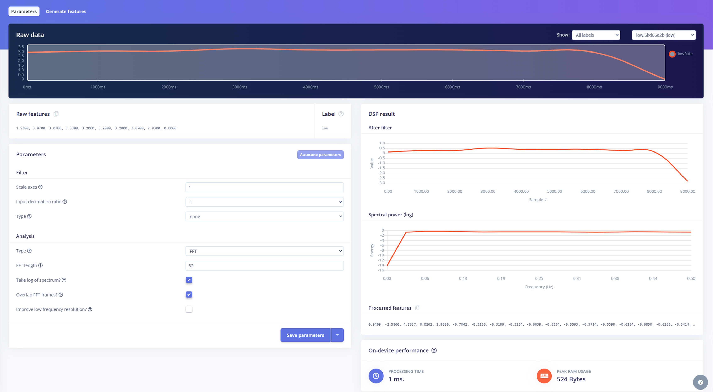

**Raw Data Processing:** The top left section displays the original time series flow rate signal.
**Spectral Power Analysis:** The lower right section shows the frequency-domain representation, highlighting dominant spectral components.
**Feature Extraction Parameters:** The left panel includes key configuration options such as:

* **FFT length:** Determines the frequency resolution of the spectral transformation.
* **Log of spectrum:** Enhances feature scaling by applying logarithmic compression.
* **Overlapping FFT frames:** Reduces information loss between samples.

The generated spectral features are then used to train the machine learning model. The frequency components correlate to physical flow behavior:

- Low-frequency components typically correspond to gradual pressure variations in the system, which may indicate normal operation or slow leaks.
- Mid-frequency components often relate to flow instability, which can signal developing faults such as pipe constrictions.
- High-frequency oscillations may suggest rapid flow disturbances caused by sudden leaks, valve malfunctions or pump cavitation.

By converting raw data into its spectral form, the model can detect subtle fluctuations that may not be obvious in time-series analysis.

#### Feature Importance Analysis and Model Optimization

Once the spectral features are extracted, an analysis is performed to determine which features contribute most to distinguishing between normal and anomalous flow conditions. The following image shows the feature explorer and importance ranking:


- **Feature Explorer:** Displays how extracted spectral features are distributed across different flow states (Normal, Low, High, Anomalous).
- **Feature Importance Ranking:** Lists the most critical spectral features, with `FlowRate RMS` and `FlowRate Spectral Skewness` being the top indicators of anomalies.

The model can classify different flow conditions by analyzing these distributions based on extracted DSP features. The `FlowRate RMS` and `Spectral Skewness` are key indicators of anomalies for following reasons:

- **FlowRate RMS (Root Mean Square):** Represents the overall magnitude of flow fluctuations. A significant increase in RMS values may indicate irregular flow behavior, sudden bursts or system instabilities.
- **FlowRate Spectral Skewness:** Measures the asymmetry of the spectral distribution. A shift in skewness can highlight unexpected fluctuations in flow rate, often correlated with anomalies such as pressure surges, valve defects or sudden leaks.

By prioritizing the most important features, the model can be updated to be more efficient and accurate in detecting deviations, reducing the risk of false positives and ensuring robust real time anomaly classification.

With feature extraction completed, the system is now ready for model training. The extracted features will be used to train a classification model that distinguishes between different flow states.

***Please refer to the [Edge Impulse Sensor Fusion Documentation](https://docs.edgeimpulse.com/docs/tutorials/end-to-end-tutorials/time-series/sensor-fusion) for further insights into DSP based sensor fusion and anomaly detection.***

### Model Training

Using Edge Impulse, the processed data is used to train a machine learning model capable of classifying flow conditions. The objective of the model is to:

- Recognize normal flow patterns based on historical data.
- Detect anomalous flow conditions, such as unexpected fluctuations, obstructions or irregular flow rates.

Different machine learning techniques, such as decision trees, neural networks or anomaly detection models, may be considered to determine the most effective approach. This project uses a neural network classifier to map extracted spectral features to flow states. The following image shows the *Neural Network settings and training process*:


**Neural Network Architecture** is configured with:

- **Input layer:** 21 features extracted from spectral analysis.
- **Hidden layers:** 30 neurons (Dense Layer) / 10 neurons (Dense Layer) / 15 neurons (Dense Layer)
- **Output layer:** 4 classes (Normal, Low, High, Anomalous)

The network uses *ReLU activation functions* in hidden layers and *Softmax activation* in the output layer to predict the most probable class.

The Neural Network Training Configuration is as follows:

| **Parameter**           | **Value**                    |
|-------------------------|------------------------------|
| **Training cycles**     | 150                          |
| **Learning rate**       | 0.0005                       |
| **Processor**           | CPU based training           |
| **Validation set size** | 30% of the dataset           |
| **Batch size**          | 32 (not enabled in this run) |


The model's *quantized (int8) version* is used for deployment to optimize inference speed and reduce memory usage.

#### Performance Metrics

Once training is complete, the model's accuracy is evaluated using a confusion matrix and performance scores. The key results include:

| **Metric**                     | **Value** |
|--------------------------------|-----------|
| **Overall Model Accuracy**     | 73.3%     |
| **Weighted Average Precision** | 0.87      |
| **Weighted Average Recall**    | 0.73      |
| **Weighted Average F1 Score**  | 0.77      |
| **Area Under ROC Curve (AUC)** | 0.86      |

***For a detailed explanation of each metric, please refer to the [evaluation metrics documentation from Edge Impulse](https://docs.edgeimpulse.com/docs/concepts/machine-learning/evaluation-metrics).***

The confusion matrix provides insights into model performance across different categories:

- `Anomalous` flow conditions are 100% correctly classified.
- `High` flow rates are also detected with 100% accuracy.
- `Low` flow rates have 60% accuracy, with some misclassification into the `Normal` category.
- `Normal` flow conditions have 71.4% accuracy, but 28.6% are incorrectly classified as `low` flow.

#### Interpreting Training Results

The trained model is capable of detecting high flow and anomalous conditions, performing accurate recognition in these categories. Additionally, the quantized model keeps a balance between accuracy and computational efficiency, making it appropriate for embedded deployment on the Portenta X8. The model is capable of reducing false positives with a precision score of 0.87, allowing reliable anomaly detection.

However, low flow conditions present the most significant challenge, with the highest misclassification rate. The model occasionally misclassifies low flow as normal, indicating difficulty distinguishing borderline cases. To address this, additional training cycles, adjustments in feature selection and further data augmentation may be required to improve recognition. Integrating feature scaling techniques could also help refine classification accuracy, particularly for subtle variations in flow conditions.

Here, it is possible to look into the following details:

- **Hyperparameter tuning:** Adjust the learning rate and number of neurons to improve classification.
- **Data balancing:** Ensure equal representation of all flow conditions to reduce bias.

Refining the model can improve classification accuracy and improve real-time flow anomaly detection.

### Deployment and Onboard Inference

Once trained, the machine learning model will be used to deploy to the Portenta X8 inside a Docker container, allowing real-time inference directly at the edge. Instead of pulling the container directly, we will use the container image, arguments and ports provided by Edge Impulse to build a custom Docker container for the Portenta X8.

This allows the model to run within our system configuration while keeping compatibility with the hardware and software constraints.

As new sensor data is collected, the model classifies flow conditions, providing feedback to the system. If an anomaly is detected, the system can trigger predefined actions, such as:

- Activating an alarm to alert operators of potential system failures.
- Sending notifications to Arduino Cloud for remote monitoring and logging.
- Adjusting system parameters dynamically to prevent failures or improve efficiency.

By processing data locally on the Portenta X8, this approach reduces dependence on external servers, reducing response time and providing continuous operation in network-limited environments.

#### Preparing the Docker Deployment for Portenta X8

Instead of pulling the container directly, Edge Impulse provides the necessary components to build a custom Docker container for Portenta X8. These include:

- **Container Image URL:** The base inference container.
- **Arguments:** API key for authentication and runtime configuration.
- **Ports to Expose:** Defines how external applications can access the inference server.

This setup allows for custom integration with the Portenta X8’s existing Docker-based environment, providing compatibility with other applications and services running on the device.

#### Selecting Docker Deployment

The deployment process starts by selecting a Docker container as the target environment within Edge Impulse:

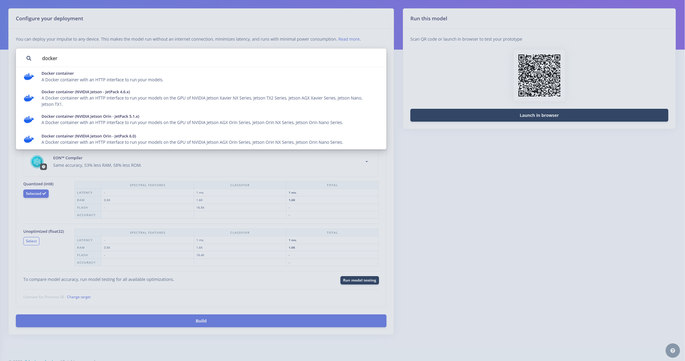

Edge Impulse provides multiple options, including Jetson based deployments and general-purpose Docker containers. **The standard Docker container with an HTTP interface is used for this application.**

#### Building a Custom Docker Container for Portenta X8

For deployment on the Portenta X8, we use the provided container image, arguments and ports to build a custom container that integrates with the system’s existing services.

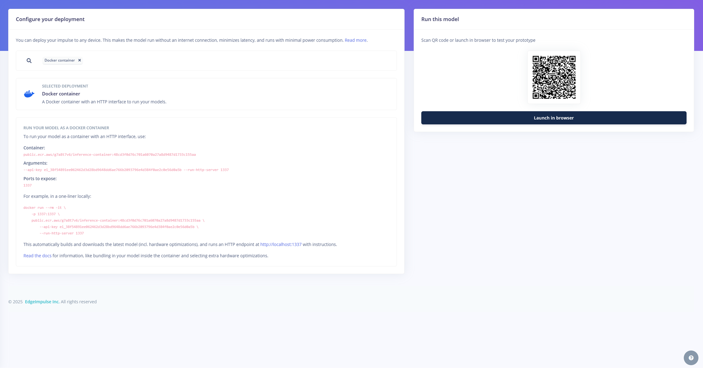

The inference workflow consists of the following steps:

- **Sensor Data Acquisition:** The flow rate sensor measures present values.
- **Feature Extraction:** DSP and spectral analysis are applied to structure data.
- **Model Prediction:** The trained model classifies the current flow condition.
- **Response Actions:** If an anomaly is detected, the system takes corresponding action.

By running inference directly on the Portenta X8, this approach can provide latency reduction and autonomous anomaly detection. With the Docker container ready, the next step is to compose and integrate the necessary components for deployment on the Portenta X8.

***For additional details on Docker based inference, refer to the [official Edge Impulse Docker Deployment documentation](https://docs.edgeimpulse.com/docs/run-inference/docker).***

## System Architecture and Data Flow

The flow anomaly detection system has real-time sensor data acquisition, machine learning inference and cloud-based monitoring. The structure consists of three main layers:

- **Data Collection Layer:** The Portenta X8 reads flow sensor data, capturing variations in fluid movement.
- **Processing & Inference Layer:** The Edge Impulse trained model runs inside a Docker container on the Portenta X8, classifying flow patterns and detecting anomalies.
- **Cloud & Visualization Layer:** The system forwards classification results to Arduino Cloud, allowing remote monitoring with visualized information.

### Data Flow Overview

The flow sensor will measure fluid movement continuously and send data to the Portenta X8’s M4 core. The M4 core processes this data and makes it accessible to the Linux layer using **Remote Procedure Call (RPC)**.

***For more details about Remote Procedure Call (RPC) and its implementation, refer to the [dedicated tutorial](https://docs.arduino.cc/tutorials/portenta-x8/python-arduino-data-exchange/).***

A Python script on the Linux side receives sensor data from the M4 core. It forwards it to the Edge Impulse inference model, which runs inside a Docker container. The model classifies the flow condition as **Normal, Low, High or Anomalous**.

The system logs an alert and records classification results if an anomaly is detected. These results are stored locally for quick decision making and sent to Arduino Cloud for remote monitoring, historical analysis and anomaly tracking.

This integration optimizes performance by balancing edge processing with cloud integration:

- **Onboard Inference:** The Portenta X8 processes sensor data locally, working on low-latency anomaly detection while reducing bandwidth usage.
- **Cloud Based Monitoring:** Arduino Cloud stores classification results, enabling long-term data tracking, predictive maintenance and real-time alerts if configured.

The system performs on demand anomaly detection by combining active edge inference with cloud analytics while providing historical insights for predictive maintenance and system optimization.

## Running Flow Rate Inference with Docker

We need to have the [hardware setup as explained here](#anomaly-detection-system-setup) before proceeding.

The M4 core needs to have the **`rpc-flow-sensor.ino`** uploaded to collect and send sensor data via RPC.

```arduino
#include <Arduino.h>
#include <RPC.h>
#include <SerialRPC.h>
#include <FlowSensor.h>  // Include the FlowSensor library

// Define Serial Debug Output (For Portenta X8 Carrier Usage)
#if defined(ARDUINO_PORTENTA_X8)
#define SerialDebug Serial1  // Use Serial1 for debugging on Portenta X8 Carrier
#else
#define SerialDebug Serial
#endif

// Define Flow Sensor Type and Pin
#define SENSOR_TYPE YFS201  
#define SENSOR_PIN PC_7   // Flow sensor signal pin

// Create Flow Sensor Object
FlowSensor flowSensor(SENSOR_TYPE, SENSOR_PIN);

void count() {
  flowSensor.count();
}

// Function to get Flow Rate (for RPC)
float getFlowRate() {
  flowSensor.read();
  float flowRate = flowSensor.getFlowRate_m();  // Get flow rate in L/min

  if (isnan(flowRate) || isinf(flowRate)) {
    return 0.0;  // Default to 0 if no valid reading
  }
  return flowRate;
}

void setup() {
  SerialDebug.begin(115200);
  //while (!SerialDebug);

  SerialDebug.println("Starting Flow Sensor ");

  flowSensor.begin(count);  // Initialize the Flow Sensor

  // RPC Binding: Function to get flow rate
  RPC.bind("flow_rate", [] {
    return getFlowRate();
  });

  // RPC Binding: Receive classification results
  RPC.bind("classification", [](std::string const& input) {
    SerialDebug.print("Classification Received: ");
    SerialDebug.println(input.c_str());
    return 1;
  });

  SerialDebug.println("Setup complete.");
}

void loop() {
  float flowRate = getFlowRate();
  SerialDebug.print("Flow Rate: ");
  SerialDebug.print(flowRate);
  SerialDebug.println(" L/min");

  delay(1000); 
}
```

The inference engine runs inside a Docker container, providing compatibility with the system.

The *Docker Compose* configuration defines the inference container and sensor data collection service.

```
networks:
  sensorfusion:

services:
  cad:
    image: arduino/python-sf:latest
    build: .
    restart: unless-stopped
    depends_on:
      - inference
    tty: true
    volumes:
      - '/run/arduino_hw_info.env:/run/arduino_hw_info.env:ro'
      - '/sys/devices:/sys/devices'
      - '/sys/class/pwm:/sys/class/pwm'
      - '/sys/bus/iio:/sys/bus/iio'
      - '/var/sota:/var/sota'
    extra_hosts:
    - "m4proxy:host-gateway"
    devices:
      - '/dev/gpiochip0'
      - '/dev/gpiochip1'
      - '/dev/gpiochip2'
      - '/dev/gpiochip3'
      - '/dev/gpiochip4'
      - '/dev/gpiochip5'
    networks:
      sensorfusion:
        aliases:
          - collect-and-dispatch
    command: ["inference", "1337"]

  inference:
    image: public.ecr.aws/g7a8t7v6/inference-container:f5f7fa7b1af67797a08d3c943c51b896b1e58368
    restart: unless-stopped
    ports:
      - 1337:1337
    networks:
      sensorfusion:
        aliases:
          - ei-inference
    environment:
      EI_MODEL_VERSION: ${EI_MODEL_VERSION:-float32}  # Default to float32 if not set
    command: [
      "--api-key", "ei_38f54891ee062462d3d28bd9648dd6ae766b2093796e4d384f0ae2c0e56d0a5b",
      "--run-http-server", "1337",
      "--force-target", "runner-linux-aarch64",
      "--model-variant", "${EI_MODEL_VERSION}"
    ]
```

The compose file will require the **container, arguments and port values** that were generated when deployed the machine learning model as explained [here](#deployment-and-real-time-inference).

The `main.py` script receives flow sensor data from the M4 core and sends it to the inference container.

```python
#!/usr/bin/env python3
import os
import time
import requests # type: ignore
import signal
import sys
import json
import argparse

from msgpackrpc import Address as RpcAddress, Client as RpcClient, error as RpcError # type: ignore

m4_proxy_host = 'm4-proxy'
m4_proxy_port = 5001
m4_proxy_address = RpcAddress(m4_proxy_host, m4_proxy_port)
model_type = os.getenv("EI_MODEL_VERSION", "float32")

def get_sensors_data_from_m4():
  """Get data from the M4 via RPC (MessagePack-RPC)."""
  data = {}
  sensors = ('flow_rate',)  # Fixed tuple declaration

  try:
      client = RpcClient(m4_proxy_address)  # Use a single client instance
      data = {sensor: client.call(sensor) for sensor in sensors}

  except RpcError.TimeoutError:
      print("Unable to retrieve sensors data from the M4: RPC Timeout - A")

  except Exception as e:
      print(f"Unexpected error in get_sensors_data_from_m4(): {e}")

  return data

def get_sensors_and_classify(host, port):
  url = f"http://{host}:{port}/api/features"

  while True:
    print("Collecting 400 features from sensors... ", end="")
    
    data = {"features": []}
    start = time.time()

    for i in range(100):
      sensors = get_sensors_data_from_m4()
      if sensors:
          print("flow: ", sensors.get('flow_rate', 'N/A'))  # Fixed dictionary reference
          data["features"].extend(sensors.values())  # Correctly extract numerical values
      time.sleep(100e-6)        

    stop = time.time()
    print(f"Done in {stop - start:.2f} seconds.")
    
    try:
      response = requests.post(url, json=data)
    except requests.ConnectionError:  # Corrected exception type
      print("Connection Error: retrying later")
      time.sleep(5)
      break

    if response.status_code != 200:
      print(f"Failed to submit the features. Status Code: {response.status_code}")
      break
        
    print("Successfully submitted features. ", end="")

    classification_data = response.json()
    classification = classification_data.get('result', {}).get('classification', {})

    if classification:
      label = max(classification, key=classification.get)
      value = classification[label]

      print(f"{label}: {value}")

      request_data = json.dumps({'label': label, 'value': value})

      res = 0
      try:
          client = RpcClient(m4_proxy_address)
          res = client.call('classification', json.loads(request_data))  # Fixed JSON handling
      except RpcError.TimeoutError:
          print("Unable to retrieve data from the M4: RPC Timeout. - B")
      except Exception as e:
          print(f"Error calling classification RPC: {e}")

      print(f"Sent to {m4_proxy_host} on port {m4_proxy_port}: {request_data}. Result is {res}.")
    else:
      print("No classification found.")

if __name__ == "__main__":
  parser = argparse.ArgumentParser(description="Get 1 second of sensors data and send to inference container for classification")
  parser.add_argument("host", help="The hostname or IP address of the inference server")
  parser.add_argument("port", type=int, help="The port number of the inference server")

  args = parser.parse_args()

  def signal_handler(_sig, _frame):
    print("Exiting...")
    sys.exit(0)

  signal.signal(signal.SIGINT, signal_handler)

  print("Classifying Flow Sensor Data with AI... Press Ctrl+C to stop.")
  print(f"Running model type: {model_type}")
  # Run the capture, upload, and process function
  get_sensors_and_classify(args.host, args.port)
```

The complete project files can be downloaded in [this section](#download-the-project-code).

Once the docker files are ready, please upload the required files using ADB:

```bash
adb push .\python-ei-sensorfusion-rpc-flow\ /home/fio
```

### Running the Inference Model on Docker

With all files in place, navigate to the project directory and build the container:

```bash
docker build -t arduino/python-sf .
```

Start the application:

```bash
docker compose up
```

***You can add `-d` prefix in the end of the command to start the container in the background, allowing you to continue using the terminal without keeping the container logs displayed. If you skip `-d`, the logs from the containers will be shown in the terminal and it will remain attached to the process until you manually stop it.***

When the application starts for the first time, the shell shows similar output as follows:


To verify the inference engine is running, check logs:

```bash
docker compose logs -f -n 10
```

The system will start to collect flow sensor data, process it with the Edge Impulse model inside a Docker container and detect anomalies.

For more controlled execution:

```bash
docker compose up -d
```

```bash
docker exec -it <container-id> sh
```

```bash
python3 -u /app/python/main.py ei-inference 1337
```

### Arduino Cloud Integration

Now that the Portenta X8 is running the Docker container with the trained inference model, the next step is integrating Arduino Cloud for active monitoring and logging of anomaly detection results.

***To register and configure the Portenta X8 with Arduino Cloud, please refer to [this user manual section](https://docs.arduino.cc/tutorials/portenta-x8/user-manual/#portenta-x8-with-arduino-cloud).***

The `main.py` script from [previous section](#running-the-inference-model-on-docker) is updated to forward flow rate classification results to Arduino Cloud. Before proceeding, an Arduino Cloud Thing must be set up with a flow rate variable to obtain the Thing ID and Variable ID.

```python
#!/usr/bin/env python3
import os
import time
import requests
import signal
import sys
import json
import argparse
from msgpackrpc import Address as RpcAddress, Client as RpcClient, error as RpcError

# Environment variables
CLIENT_ID = os.getenv("CLIENT_ID")
CLIENT_SECRET = os.getenv("CLIENT_SECRET")
THING_ID = os.getenv("THING_ID")
CLASSIFICATION_VARIABLE_ID = os.getenv("CLASSIFICATION_VARIABLE_ID")
CONFIDENCE_VARIABLE_ID = os.getenv("CONFIDENCE_VARIABLE_ID")
LOOP_INTERVAL = int(os.getenv("LOOP_INTERVAL", 5))

# Arduino IoT Cloud API URLs
TOKEN_URL = "https://api2.arduino.cc/iot/v1/clients/token"
PROPERTY_UPDATE_URL = "https://api2.arduino.cc/iot/v2/things/{thing_id}/properties/{variable_id}"

# M4 Proxy Configuration
m4_proxy_host = "m4-proxy"
m4_proxy_port = 5001
m4_proxy_address = RpcAddress(m4_proxy_host, m4_proxy_port)

# Inference Server Configuration (via script arguments)
inference_host = None
inference_port = None


def get_access_token():
  """Retrieve OAuth2 token for Arduino Cloud API."""
  try:
    print(f"CLIENT_ID: {CLIENT_ID}")
    print(f"CLIENT_SECRET: {'*' * len(CLIENT_SECRET)} (hidden)")

    response = requests.post(
      TOKEN_URL,
      headers={"Content-Type": "application/x-www-form-urlencoded"},
      data={
        "grant_type": "client_credentials",
        "client_id": CLIENT_ID,
        "client_secret": CLIENT_SECRET,
        "audience": "https://api2.arduino.cc/iot"
      },
    )

    print("Response Status:", response.status_code)
    print("Response Text:", response.text)

    response.raise_for_status()
    return response.json().get("access_token")

  except requests.RequestException as e:
    print(f"Error getting access token: {e}")
    sys.exit(1)


def update_property(token, variable_id, value):
  """Update an Arduino Cloud property using REST API."""
  url = PROPERTY_UPDATE_URL.format(thing_id=THING_ID, variable_id=variable_id)
  headers = {
    "Authorization": f"Bearer {token}",
    "Content-Type": "application/json"
  }
  payload = json.dumps({"value": value})

  try:
    response = requests.put(url, headers=headers, data=payload)
    print(f"Updating {variable_id}: {value} → {url} (PUT)")
    print("Response Status:", response.status_code)
    print("Response Text:", response.text)

    response.raise_for_status()
    print(f"Successfully updated {variable_id}")

  except requests.RequestException as e:
    print(f"Error updating {variable_id}: {e}")


def get_sensors_data_from_m4():
  """Retrieve sensor data from the M4 using RPC (MessagePack-RPC)."""
  data = {}
  sensors = ("flow_rate",)

  try:
    client = RpcClient(m4_proxy_address)
    data = {sensor: client.call(sensor) for sensor in sensors}

  except RpcError.TimeoutError:
    print("RPC Timeout: Unable to retrieve sensors data from M4.")
  except Exception as e:
    print(f"Unexpected error in get_sensors_data_from_m4(): {e}")

  return data


def get_sensors_and_classify():
  """Collect sensor data, send to inference server, and update Arduino Cloud."""
  global inference_host, inference_port

  token = get_access_token()  # Get OAuth2 token once and reuse
  url = f"http://{inference_host}:{inference_port}/api/features"

  while True:
    print("Collecting 400 features from sensors... ", end="")

    data = {"features": []}
    start = time.time()

    for _ in range(100):
      sensors = get_sensors_data_from_m4()
      if sensors:
        print("flow_rate:", sensors.get("flow_rate", "N/A"))
        data["features"].extend(sensors.values())
      time.sleep(100e-6)

    stop = time.time()
    print(f"Done in {stop - start:.2f} seconds.")

    try:
      response = requests.post(url, json=data)
    except requests.ConnectionError:
      print("Connection Error: retrying later")
      time.sleep(5)
      break

    if response.status_code != 200:
      print(f"Failed to submit the features. Status Code: {response.status_code}")
      break

    print("Successfully submitted features. ", end="")

    classification_data = response.json()
    classification = classification_data.get("result", {}).get("classification", {})

    if classification:
      label = max(classification, key=classification.get)
      confidence = classification[label]

      print(f"Classification: {label} ({confidence:.2f})")

      # Update Arduino IoT Cloud with classification results
      update_property(token, CLASSIFICATION_VARIABLE_ID, label)
      update_property(token, CONFIDENCE_VARIABLE_ID, confidence)

    else:
      print("No classification found.")

    time.sleep(LOOP_INTERVAL)


def main():
  """Main function to start classification and cloud updates."""
  global inference_host, inference_port

  parser = argparse.ArgumentParser(description="Get sensor data and classify with AI, updating Arduino Cloud.")
  parser.add_argument("host", help="The hostname or IP address of the inference server")
  parser.add_argument("port", type=int, help="The port number of the inference server")

  args = parser.parse_args()
  inference_host = args.host
  inference_port = args.port

  def signal_handler(_sig, _frame):
    print("Exiting...")
    sys.exit(0)

  signal.signal(signal.SIGINT, signal_handler)

  print("\n============================================")
  print("==   Portenta X8 M4 Sensor Classification to Arduino Cloud ==")
  print("============================================\n")
  print("🔍 Running model type:", os.getenv("EI_MODEL_VERSION", "float32"))

  get_sensors_and_classify()


if __name__ == "__main__":
  main()
```

The script gets API credentials and device identifiers from a `.env` file. Create this file in the project directory with the following content:

```bash
CLIENT_ID=cloud_api_key
CLIENT_SECRET=cloud_api_secret
THING_ID=cloud_thing_id
SPACE_ID=cloud_space_id
FLOWRATE_VARIABLE_ID=cloud_flowrate_key
CLASSIFICATION_VARIABLE_ID=cloud_classification_key
```

The `docker-compose` file is updated to include Arduino Cloud credentials:

```
networks:
  sensorfusion:

services:
  cad:
    image: arduino/python-sf:latest
    build: .
    restart: unless-stopped
    depends_on:
      - inference
    tty: true
      PYTHONUNBUFFERED: 1
      LOOP_INTERVAL: 1
      CLIENT_ID: ${CLIENT_ID}
      CLIENT_SECRET: ${CLIENT_SECRET}
      THING_ID: ${THING_ID}
      FLOWRATE_VARIABLE_ID: ${FLOWRATE_VARIABLE_ID}
      CLASSIFICATION_VARIABLE_ID: ${CLASSIFICATION_VARIABLE_ID}
    volumes:
      - '/run/arduino_hw_info.env:/run/arduino_hw_info.env:ro'
      - '/sys/devices:/sys/devices'
      - '/sys/class/pwm:/sys/class/pwm'
      - '/sys/bus/iio:/sys/bus/iio'
      - '/var/sota:/var/sota'
    extra_hosts:
    - "m4proxy:host-gateway"
    devices:
      - '/dev/gpiochip0'
      - '/dev/gpiochip1'
      - '/dev/gpiochip2'
      - '/dev/gpiochip3'
      - '/dev/gpiochip4'
      - '/dev/gpiochip5'
    networks:
      sensorfusion:
        aliases:
          - collect-and-dispatch
    command: ["inference", "1337"]

  inference:
    image: public.ecr.aws/g7a8t7v6/inference-container:f5f7fa7b1af67797a08d3c943c51b896b1e58368
    restart: unless-stopped
    ports:
      - 1337:1337
    networks:
      sensorfusion:
        aliases:
          - ei-inference
    environment:
      EI_MODEL_VERSION: ${EI_MODEL_VERSION:-float32}  # Default to float32 if not set
    command: [
      "--api-key", "ei_38f54891ee062462d3d28bd9648dd6ae766b2093796e4d384f0ae2c0e56d0a5b",
      "--run-http-server", "1337",
      "--force-target", "runner-linux-aarch64",
      "--model-variant", "${EI_MODEL_VERSION}"
    ]
```

Once the files are updated, it needs to be pushed to the Portenta X8 again, navigate to the project directory and use the following commands:

```bash
docker build -t arduino/python-sf .
```

```bash
docker compose --env-file .env up
```

***You can add `-d` prefix in the end of the command to start the container in the background, allowing you to continue using the terminal without keeping the container logs displayed. If you skip `-d`, the logs from the containers will be shown in the terminal and it will remain attached to the process until you manually stop it.***

The following command can be used to verify the inference engine is running:

```bash
docker compose logs -f -n 10
```

Once deployed, the system will begin to get flow sensor data, classify it using the trained model and send the results to Arduino Cloud for monitoring and anomaly tracking.

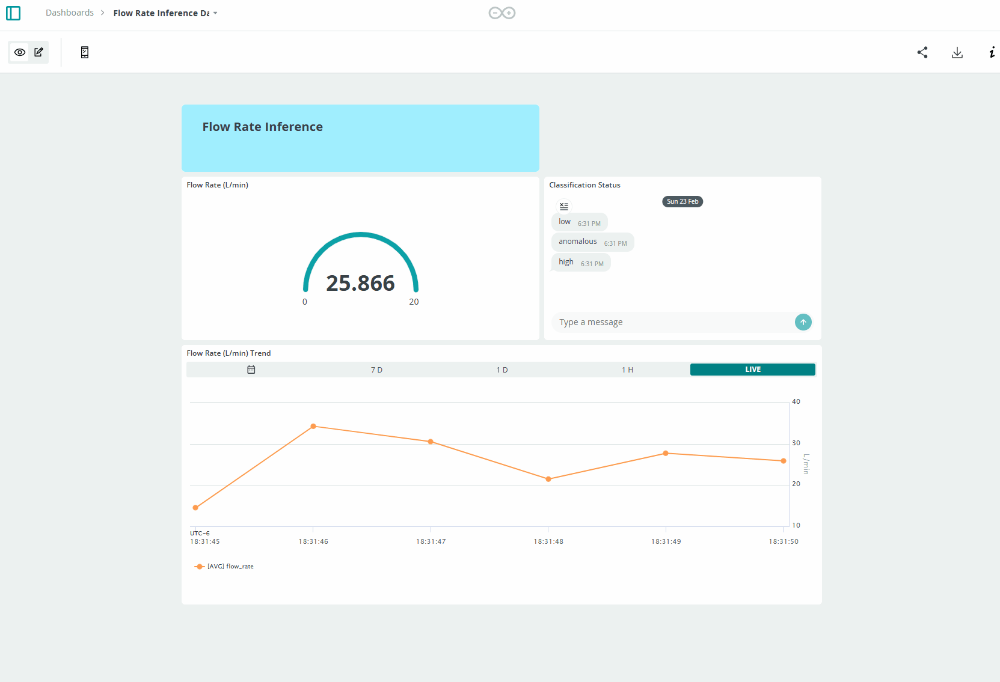

For more controlled execution:

```bash
docker compose --env-file .env up -d
```

```bash
docker exec -it <container-id> sh
```

```bash
python3 -u /app/python/main.py ei-inference 1337
```

This integration allows real-time anomaly detection and cloud-based monitoring, combining edge inference on Portenta X8 with Arduino Cloud analytics. Users can remotely track flow rate anomalies, set up alerts and analyze historical trends to improve predictive maintenance of the system's point of interest.

## Additional Resources

- [Portenta X8 Documentation](https://docs.arduino.cc/hardware/portenta-x8/)
- [Edge Impulse Documentation](https://docs.edgeimpulse.com/)
- GitHub Repository: [portenta-x8/webinars](https://github.com/arduino/fae-artifacts-public/tree/main/portenta-x8/webinars/2025-01-23_eletkor-edge-ai-solutions)

## Support

If you encounter any issues or have questions while working with the Portenta X8, we provide various support resources to help you find answers and solutions.

### Help Center

Explore our [Help Center](https://support.arduino.cc/hc/en-us), which offers a comprehensive collection of articles and guides for the Portenta X8. The Arduino Help Center is designed to provide in-depth technical assistance and help you make the most of your device.

- [Portenta Family help center page](https://support.arduino.cc/hc/en-us/sections/360004767859-Portenta-Family)

### Forum

Join our community forum to connect with other Portenta X8 users, share your experiences, and ask questions. The forum is an excellent place to learn from others, discuss issues, and discover new ideas and projects related to the Portenta X8.

- [Portenta X8 category in the Arduino Forum](https://forum.arduino.cc/c/hardware/portenta/portenta-x8/172)

### Contact Us

Please get in touch with our support team if you need personalized assistance or have questions not covered by the help and support resources described before. We're happy to help you with any issues or inquiries about the Portenta X8.

- [Contact us page](https://www.arduino.cc/en/contact-us/)
