## Overview

Flow sensors play an important role in industrial systems by monitoring fluid movement within pipelines to provide stability and detect anomalies such as leaks, blockages or irregular pressure variations. Traditional flow monitoring methods rely on threshold-based detection, which may fail to capture subtle deviations that indicate potential failures. Real-time pattern classification can improve flow monitoring by integrating machine learning with Edge Impulse, allowing early anomaly detection and predictive maintenance.

IMAGE

This application note shows how to implement a flow anomaly detection system using the **Portenta X8**, a **flow sensor** and an **Edge Impulse-trained machine learning model** deployed within a **Docker container**. The system continuously captures flow rate data, processes it using the trained model and classifies flow conditions in real-time. 

Classification results can be used for immediate decision-making, such as triggering an **alarm**, sending **commands to the M4 microcontroller** for additional processing or forwarding **data to Arduino Cloud** for remote monitoring and visualization. By leveraging Edge AI capabilities, this approach reduces reliance on cloud processing for anomaly detection while maintaining connectivity for advanced analytics and long-term data tracking.

## Goals

The project showcased in this application note has the following objectives:

- Monitor fluid movement using a flow sensor.
- Classify flow patterns in real time with a machine learning model trained in Edge Impulse.
- Deploy the trained model inside a Docker container on the Portenta X8.
- Send classification results to the M4 microcontroller for onboard processing.
- Share all collected data and classification results to Arduino Cloud for remote monitoring.

## Hardware and Software Requirements

### Hardware Requirements

This project uses the Portenta X8, integrating a flow sensor for real time fluid monitoring. The required hardware includes:

- [Portenta X8](https://store.arduino.cc/products/portenta-x8) (x1)
- Portenta Carrier Family: [Hat Carrier](https://store.arduino.cc/products/portenta-hat-carrier) / [Mid Carrier](https://store.arduino.cc/products/portenta-mid-carrier) (x1)
- Flow Sensor (e.g., YFS201) (x1)
- [USB-C® cable](https://store.arduino.cc/products/usb-cable2in1-type-c) (x1)
- Wi-Fi® Access Point or Ethernet with Internet access (x1)

### Software Requirements

To start with this application, ensure your Portenta X8 runs the latest Linux image.

- Ensure your Portenta X8 has the latest Linux image. Check [this section of Portenta X8's user manual](https://docs.arduino.cc/tutorials/portenta-x8/user-manual/#portenta-x8-os-image-update) to verify that your Portenta X8 is up-to-date.

***For the smooth functioning of the Portenta Hat Carrier with the Portenta X8, it is crucial to have at least Linux __image version > 746__ on the Portenta X8. To update your board to the latest image, use the [Portenta X8's Arduino Wizard Experience](https://docs.arduino.cc/tutorials/portenta-x8/image-flashing/#update-through-arduino-linux-wizard-experience) method or [manually flash it](https://docs.arduino.cc/tutorials/portenta-x8/image-flashing/#update-using-uuu-flashing-tool), downloading the most recent version from this [link](https://downloads.arduino.cc/portentax8image/image-latest.tar.gz).***

To develop and deploy the flow monitoring system, the following software tools and platforms are required:

- Edge Impulse for model training and deployment
- [Edge Impulse® CLI](https://docs.edgeimpulse.com/docs/edge-impulse-cli/cli-overview), to manage Machine Learning models, we can install the Edge Impulse® Cli tool following these [instructions](https://docs.edgeimpulse.com/docs/edge-impulse-cli/cli-installation).
- Docker for running inference models on Portenta X8
- [Arduino IDE 2.0+](https://www.arduino.cc/en/software) or [Arduino Web Editor](https://create.arduino.cc/editor)
- The [Arduino Create Agent](https://cloud.arduino.cc/download-agent/)
- The [Arduino Cloud](https://cloud.arduino.cc/). If you do not have an account, you can create one for free inside [cloud.arduino.cc](https://cloud.arduino.cc/home/?get-started=true).

## Machine Learning Model for Flow Anomaly Detection

Machine learning enables industrial systems to analyze sensor data, recognize patterns and make data-driven decisions. This application implements a machine learning model to classify flow patterns in real-time, detecting anomalies that may indicate leaks, blockages or irregular pressure fluctuations.

By leveraging Edge Impulse, the model is trained to distinguish between normal and abnormal flow conditions based on real-time sensor data, allowing for predictive maintenance and operational efficiency.

IMAGE

Flow anomaly detection is particularly useful in systems that rely on consistent mass airflow or liquid circulation to maintain optimal performance. For example, vehicle powerplants require stable coolant delivery to regulate engine temperature.

At the same time, industrial and medical cooling systems must maintain actual flow rates to prevent overheating or component degradation. The system can detect early warning signs of potential failures by classifying flow conditions, allowing proactive intervention.

### Applications of Flow Rate Categorization

This machine learning model can be applied in different industrial and automotive domains where monitoring and controlling fluid flow at different points are important, based on the key application areas where it involves small systems:

### Applications of Flow Rate Categorization

IMAGE

| **Application Area**                           | **Examples**                                                                                                                                                                                                                                   |
|------------------------------------------------|------------------------------------------------------------------------------------------------------------------------------------------------------------------------------------------------------------------------------------------------|
| **Small Automotive Cooling Systems**           | - Engine cooling for motorcycles, ATVs, and small passenger vehicles (<1.5L displacement).<br>- Electric vehicle (EV) battery thermal management to prevent overheating.<br>- Turbo intercooler water circuits for efficient heat dissipation. |
| **Industrial Equipment & Electronics Cooling** | - CNC spindle cooling systems ensuring precision machining.<br>- Laser cooling loops for maintaining stable laser operation.<br>- Small heat exchanger loops used in industrial automation and process control.                                |
| **Medical & Laboratory Cooling**               | - Medical imaging devices (MRI, CT scanners) requiring controlled cooling loops.<br>- Laboratory chillers used in chemical processing and biomedical research.                                                                                 |

### Flow Rate Categorization and Anomaly Detection

The trained model categorizes flow conditions based on real-time measurements from the sensor. The following classification table defines normal and anomalous flow conditions for this application note:

IMAGE

| **Flow Rate (L/min)** | **Category**             | **Potential Issues & Notes**                                                      |
|-----------------------|--------------------------|-----------------------------------------------------------------------------------|
| **<5 L/min**          | **Anomalous (Too Low)**  | Possible blockage, pump failure, cavitation or air pockets in the system.         |
| **5 L/min**           | **Low Flow**             | Typical for idle operation or minimal cooling demand.                             |
| **10 L/min**          | **Normal Flow**          | Steady-state operation under standard cooling requirements.                       |
| **15+ L/min**         | **High Flow**            | Increased demand. This may indicate an oversized pump or excessive cooling.       |
| **>20-30 L/min**      | **Anomalous (Too High)** | Risk of turbulence, leaks, pressure spikes and reduced heat exchanger efficiency. |

By classifying flow rates into these categories, the system can detect abnormal conditions early and take corrective action before performance issues or failures occur.

This approach provides reliable operation in corresponding automotive, industrial and medical cooling applications while reducing maintenance costs and unplanned downtime.

## Anomaly Detection System Setup

This application does not require complex wiring for operation. However, proper hardware setup is required for reliable data acquisition, model inference and cloud integration. The following components are required for system deployment:

- **Portenta X8**: The main processing unit, running Edge Impulse inference inside a Docker container.
- **Portenta Hat/Mid Carrier**: Provides easy access to peripherals and power connections.
- **Flow Sensor (e.g., YFS201)**: Measures real-time flow rate and detects anomalies.
- **USB-C Cable**: Connects the Portenta X8 to a development PC for setup and debugging.
- **Wi-Fi/Ethernet Access**: Enables cloud connectivity for data visualization in Arduino Cloud.

### Hardware Wiring Overview

The system wiring follows a straightforward configuration:


- **Portenta X8**: mounted on the **Portenta Mid/Hat Carrier**, which provides access to pinout interfaces. Any other Portenta family can also be used for this step.
- **flow sensor**: connected to the corresponding pins on the **Portenta Mid/Hat Carrier**.
- **USB-C cable**: used for initial setup, debugging and Edge Impulse data collection.
- **Portenta X8**: connected to **Wi-Fi** or **Ethernet** for cloud communication.

### Powering Options

Both the **Portenta Mid Carrier** and **Portenta Hat Carrier** support multiple power input options, depending on the deployment requirements:

#### Portenta Mid Carrier Power Configuration
- **USB-C Power (5V)**: For development, debugging and short-term testing.
- **External DC Power (7-24V)**: For field deployments requiring stable and continuous operation.

#### Portenta Hat Carrier Power Configuration
- **USB-C Power (5V)**: For development, debugging and short-term testing.
- **External DC Power (5-12V)**: For reliable operation in embedded applications.


Setting up the system correctly ensures smooth data collection, machine learning inference, and cloud-based monitoring. With the hardware configured, the next steps focus on data acquisition, model training and deployment.

## Flow Anomaly Detector Model Development

### Model Design

The machine learning model is trained to recognize different flow conditions based on real-time sensor data. A dataset of flow sensor readings is collected at a predefined frequency, capturing variations in fluid movement under different operating conditions.

The raw sensor data is preprocessed using digital signal processing (DSP) techniques to extract relevant features, which are then used to train a model capable of classifying normal and anomalous flow states.

### Data Acquisition

Sensor data needs to be collected across different flow conditions to build a reliable machine learning model. This ensures that the model can accurately distinguish between normal and abnormal flow states based on real-time measurements.

The flow sensor connected to the Portenta X8 captures flow rate readings and sends the data to Edge Impulse using the Edge Impulse Data Forwarder. This process allows real-time monitoring and labeling of flow patterns under different operating conditions.

The data acquisition process consists of the following steps:

1. Uploading the Arduino sketch on the Portenta X8’s M4 core to capture real-time flow rate readings.
2. Initializing Edge Impulse Data Forwarder on the host system.
3. Connecting the Portenta X8 to Edge Impulse for live data streaming.
4. Setting up data labels corresponding to different flow states (stable, low, high, anomalous).
5. Sampling flow rate data at 1Hz frequency and storing it in Edge Impulse.
6. Organizing and labeling datasets for model training and evaluation.

Once enough labeled data is collected, it is split into training and testing datasets, ensuring that the model is trained on different flow conditions while maintaining a separate set for validation.

#### Capturing Flow Sensor Data on the Portenta X8

The Portenta X8’s M4 microcontroller reads real-time flow sensor data and transmits it via serial output in CSV format, making it compatible with Edge Impulse for model training.

The following Arduino sketch (`sensor-data-generation.ino`) configures the Portenta X8 to read and send flow rate values at one second intervals.

```arduino
#include <Arduino.h>
#include <FlowSensor.h>

#if defined(ARDUINO_PORTENTA_X8)
#define SerialDebug Serial1  // Use Serial1 for Portenta Carrier family
#else
#define SerialDebug Serial
#endif

// Define Flow Sensor Type (Change if using another model)
#define SENSOR_TYPE YFS201  
#define SENSOR_PIN PD_15  // Flow sensor signal pin

FlowSensor flowSensor(SENSOR_TYPE, SENSOR_PIN);

// Define 1Hz Sampling Frequency
#define INTERVAL_MS 1000  // 1 sample per second

static unsigned long last_interval_ms = 0;

// Interrupt function for counting pulses
void count() {
  flowSensor.count();
}

void setup() {
  SerialDebug.begin(115200);
  while (!SerialDebug);

  pinMode(LED_BUILTIN, OUTPUT);
  flowSensor.begin(count);

  SerialDebug.println("Setup complete. Streaming flow rate at 1 Hz");
}

void loop() {
  if (millis() - last_interval_ms >= INTERVAL_MS) { 
    last_interval_ms = millis(); 

    flowSensor.read();
    float flowRate = flowSensor.getFlowRate_m();      // Flow rate in L/min

    // Avoid NaN or Inf issues
    if (isnan(flowRate) || isinf(flowRate)) {
        SerialDebug.println("0.00");                  // Send 0 if no valid reading
    } else {
        SerialDebug.println(flowRate, 2);             // Print flow rate
    }

    // Blink LED to indicate data collection
    digitalWrite(LED_BUILTIN, !digitalRead(LED_BUILTIN));
  }
}
```

#### Streaming Flow Data to Edge Impulse

Once the Portenta X8 is connected via USB and the Arduino sketch is running, Edge Impulse’s Data Forwarder is used to stream flow rate readings into the Edge Impulse platform.

Before running the data forwarder, make sure that Edge Impulse CLI is installed on your system. If not, install it using:

```bash
npm install -g edge-impulse-cli
```

***For detailed Edge Impulse CLI installation instructions, please refer to the [official Edge Impulse documentation](https://docs.edgeimpulse.com/docs/tools/edge-impulse-cli/cli-installation).***

Run the following command to start streaming sensor data from the Portenta X8:

```bash
edge-impulse-data-forwarder --frequency 1
```

***The `--frequency 1` flag sets the data forwarder to send one sample per second, matching the 1Hz sampling rate of the Arduino sketch.***

When prompted, select the Edge Impulse project to which you want to send data.

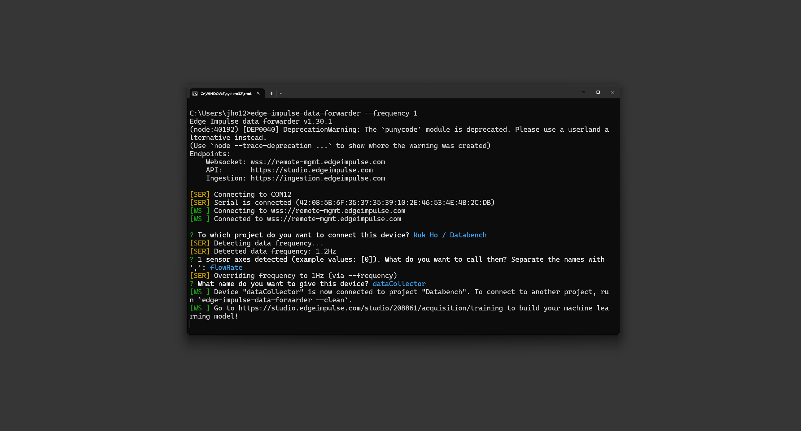

The data forwarder automatically detects the flow sensor and prompts for naming the data channels.

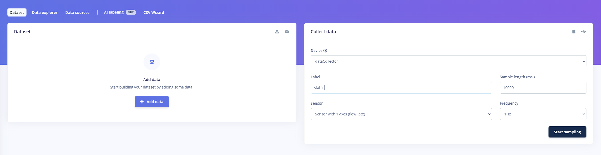

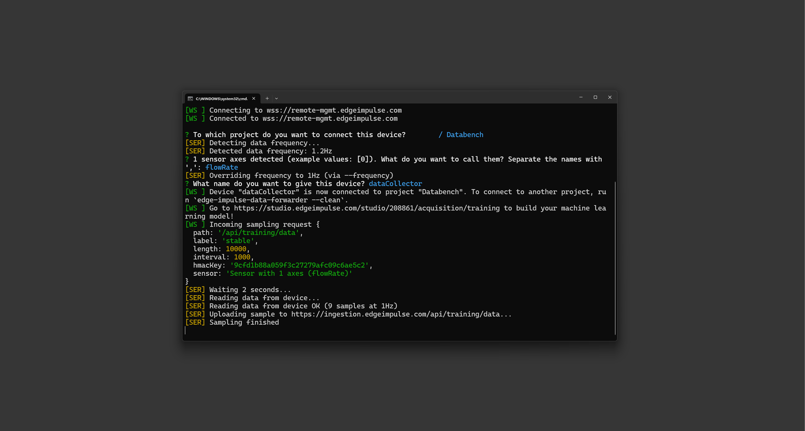

Once configured, Edge Impulse begins receiving real time flow rate data.

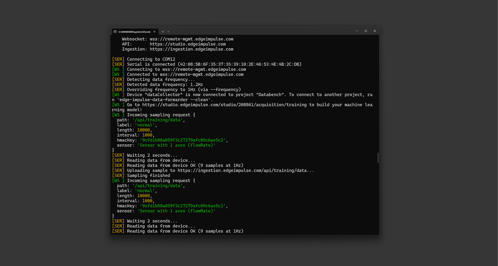

The collected flow rate samples are labeled and stored in the Edge Impulse dataset.

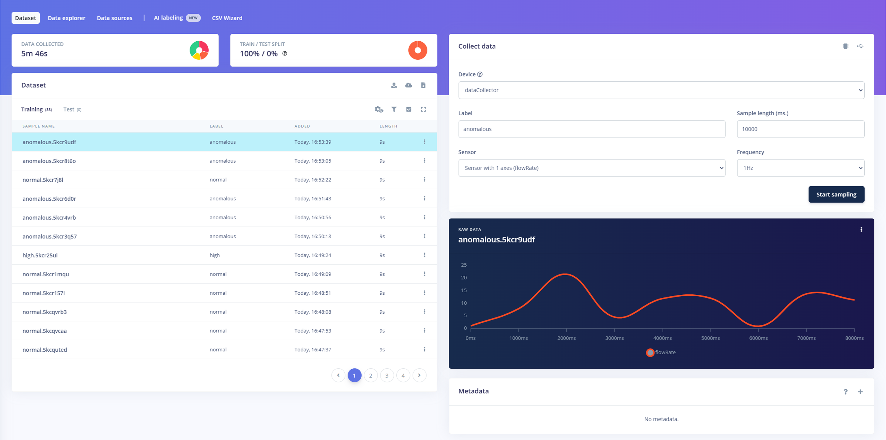

***For more detailed information on data forwarding, please refer to [Edge Impulse’s official guide](https://docs.edgeimpulse.com/docs/tools/edge-impulse-cli/cli-data-forwarder).***

After data collection, the labeled dataset is used for feature extraction and model training, so that the system can classify flow anomalies in real-time.

### Feature Extraction

Raw sensor data alone is not sufficient for effective anomaly detection. Digital Signal Processing (DSP) techniques are applied to extract meaningful features from the collected flow data to improve model accuracy. These techniques improve distinguishing between normal and anomalous flow conditions by transforming raw time series data into structured feature sets.

- **Time-Series Analysis:** Captures how the flow rate changes over time, helping identify gradual trends and fluctuations. This is essential for detecting slowly developing anomalies, such as pipe clogging or pump wear.
- **Spectral Analysis:** Converts time-domain signals into the frequency domain, highlighting patterns that may not be evident in the raw data. This helps identify vibrational inconsistencies, leaks or sudden pressure spikes.
- **Statistical Features:** Computes key statistical values to represent the data in Mean, Variance and Standard deviation. Each representation captures the average flow rate, measures the degree of fluctuation and identifies how much the values deviate from the norm, respectively.

These extracted features form the input dataset used to train the machine learning model.

The *Impulse Design* in Edge Impulse structures the feature extraction pipeline, ensuring data is properly preprocessed before being passed to the learning model.

**Time-Series Data Block:**
- Window size: 10,000 ms (10 seconds)
- Window increase (stride): 1,000 ms (1 second)
- Frequency: 1 Hz
- Zero-padding enabled: Ensures consistency in data length.

This configuration allows real-time flow rate sampling at one second intervals, providing a detailed view of flow dynamics. The following image shows how the flow rate input is structured before processing:

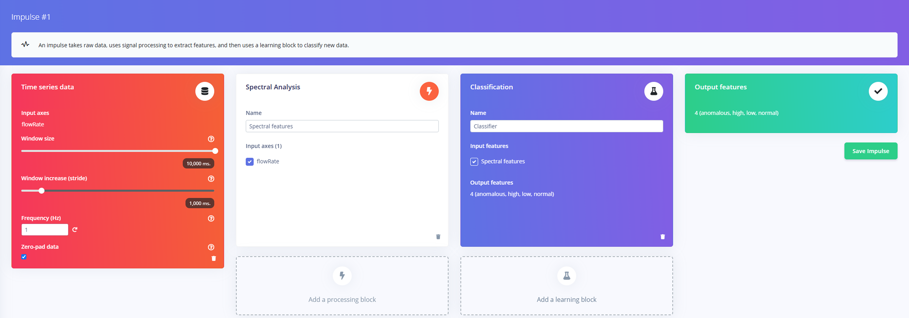

#### Train/Test Split Process

After feature extraction, the dataset needs to be split into *Training* and *Testing* sets to validate the model's performance.

**Train/Test Split Process:** The dataset is automatically divided into:

- Training set (~80%)
- Testing set (~20%)

It makes that the model generalizes well to unseen data and rebalancing is done to maintain category consistency.

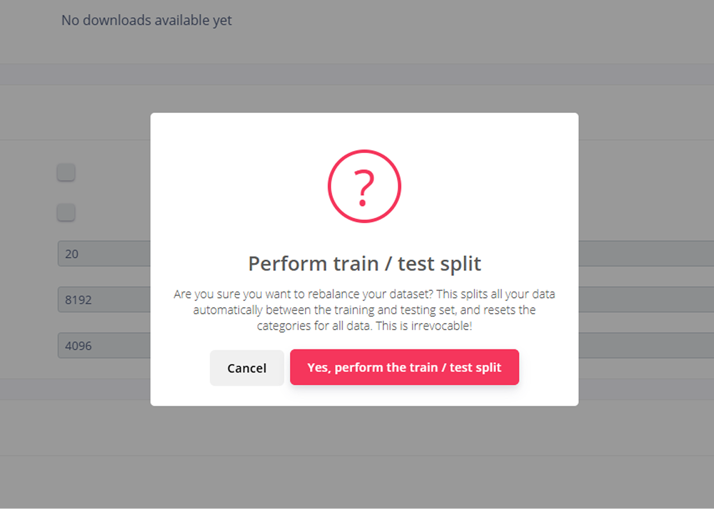

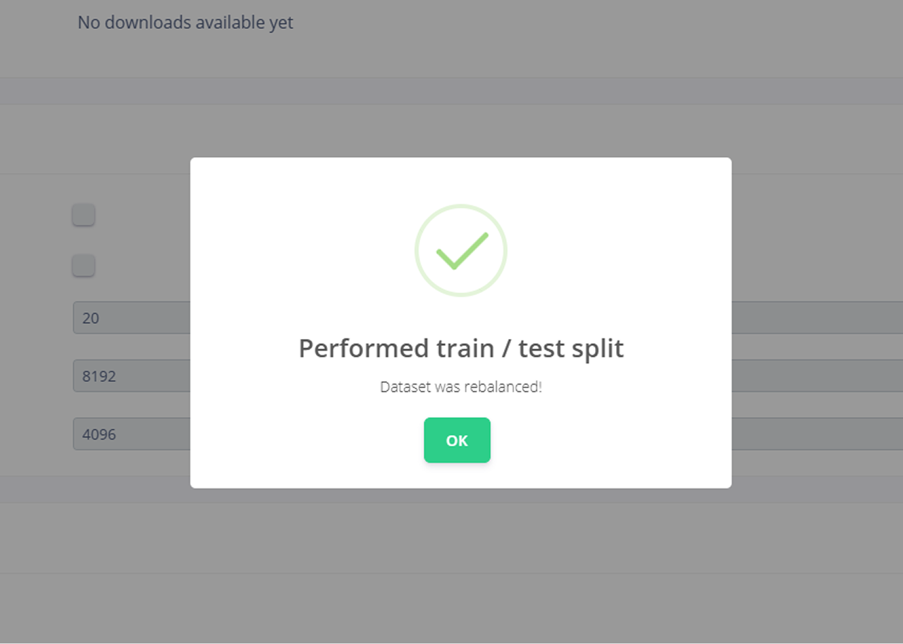

The first image shows the warning before dataset splitting, while the second confirms the successful rebalance of the dataset.

Once split, the dataset contains labeled flow rate data across different operational conditions.

Each data sample is labeled as:

- **Normal:** Flow rate within expected range.
- **Low:** Below normal levels (may indicate blockages or pump inefficiency).
- **High:** Above normal levels, (may indicate pressure spikes or leaks).
- **Anomalous:** Unusual variations that require further investigation.

The following image shows the final dataset distribution with balanced class representation:

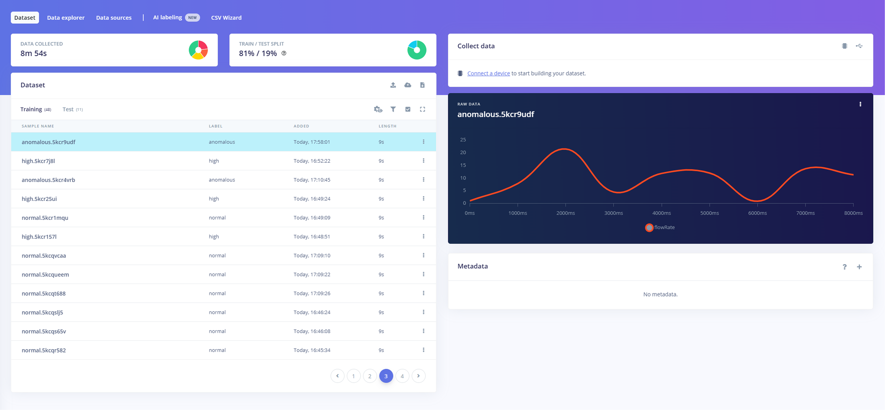

#### Spectral Analysis: Frequency Domain Interpretation

Now, the image below shows the DSP feature extraction process, where the raw flow rate data is converted into its spectral representation:

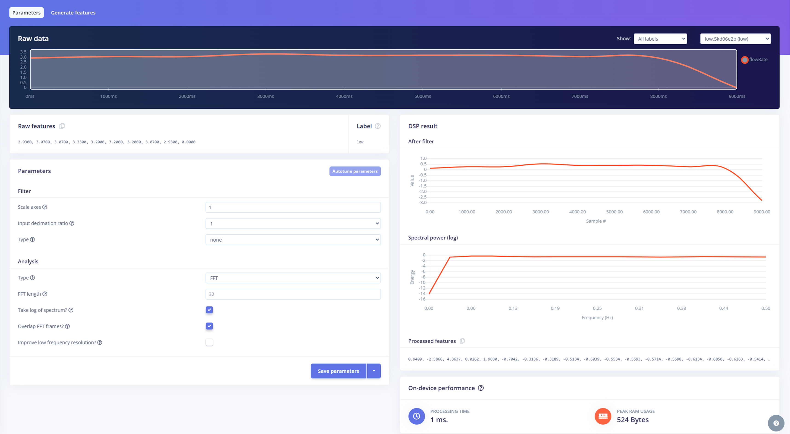

- **Raw Data Processing:** The top left section displays the original time series flow rate signal.
- **Spectral Power Analysis:** The lower right section shows the frequency-domain representation, highlighting dominant spectral components.
- **Feature Extraction Parameters:** The left panel includes key configuration options such as:

* **FFT length:** Determines the frequency resolution of the spectral transformation.
* **Log of spectrum:** Enhances feature scaling by applying logarithmic compression.
* **Overlapping FFT frames:** Reduces information loss between samples.

The generated spectral features are then used to train the machine learning model. The frequency components correlate to physical flow behavior:

- Low-frequency components typically correspond to gradual pressure variations in the system, which may indicate normal operation or slow leaks.
- Mid-frequency components often relate to flow instability, which can signal developing faults such as pipe constrictions.
- High-frequency oscillations may suggest rapid flow disturbances caused by sudden leaks, valve malfunctions or pump cavitation.

By converting raw data into its spectral form, the model can detect subtle fluctuations that may not be obvious in time-series analysis.

#### Feature Importance Analysis and Model Optimization

Once the spectral features are extracted, an analysis is performed to determine which features contribute most to distinguishing between normal and anomalous flow conditions. The following image shows the feature explorer and importance ranking:

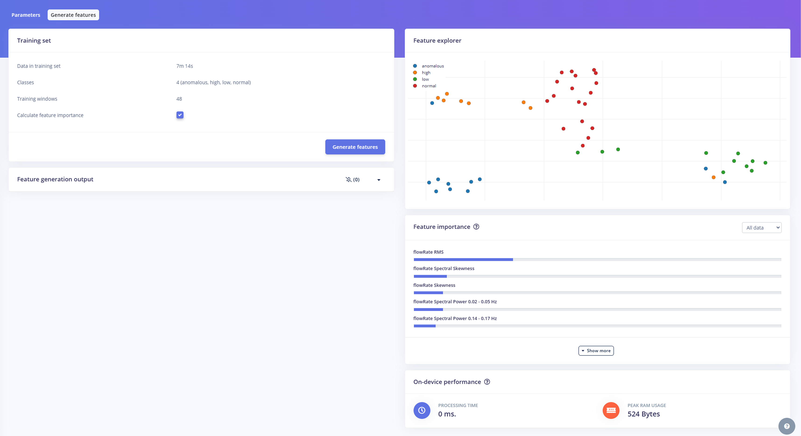

- **Feature Explorer:** Displays how extracted spectral features are distributed across different flow states (Normal, Low, High, Anomalous).
- **Feature Importance Ranking:** Lists the most critical spectral features, with `FlowRate RMS` and `FlowRate Spectral Skewness` being the top indicators of anomalies.

The model can classify different flow conditions by analyzing these distributions based on extracted DSP features. The `FlowRate RMS` and `Spectral Skewness` are key indicators of anomalies for following reasons:

- **FlowRate RMS (Root Mean Square):** Represents the overall magnitude of flow fluctuations. A significant increase in RMS values may indicate irregular flow behavior, sudden bursts or system instabilities.
- **FlowRate Spectral Skewness:** Measures the asymmetry of the spectral distribution. A shift in skewness can highlight unexpected fluctuations in flow rate, often correlated with anomalies such as pressure surges, valve defects or sudden leaks.

By prioritizing the most important features, the model can be updated to be more efficient and accurate in detecting deviations, reducing the risk of false positives and ensuring robust real time anomaly classification.

With feature extraction completed, the system is now ready for model training. The extracted features will be used to train a classification model that distinguishes between different flow states.

***Please refer to the [Edge Impulse Sensor Fusion Documentation](https://docs.edgeimpulse.com/docs/tutorials/end-to-end-tutorials/time-series/sensor-fusion) for further insights into DSP based sensor fusion and anomaly detection.***

### Model Training

Using Edge Impulse, the processed data is used to train a machine learning model capable of classifying flow conditions. The objective of the model is to:

- Recognize normal flow patterns based on historical data.
- Detect anomalous flow conditions, such as unexpected fluctuations, obstructions or irregular flow rates.

Different machine learning techniques, such as decision trees, neural networks or anomaly detection models, may be considered to determine the most effective approach. This project uses a neural network classifier to map extracted spectral features to flow states. The following image shows the *Neural Network settings and training process*:

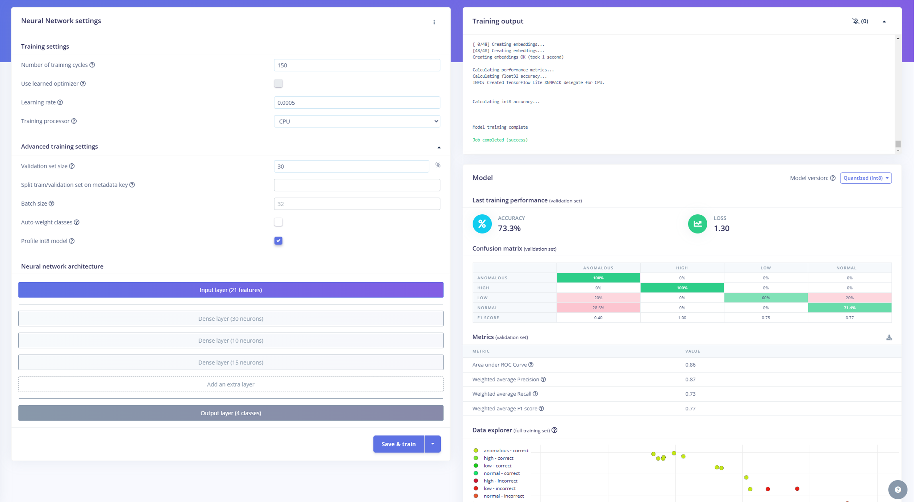

**Neural Network Architecture** is configured with:

- **Input layer:** 21 features extracted from spectral analysis.
- **Hidden layers:** 30 neurons (Dense Layer) / 10 neurons (Dense Layer) / 15 neurons (Dense Layer)
- **Output layer:** 4 classes (Normal, Low, High, Anomalous)

The network uses *ReLU activation functions* in hidden layers and *Softmax activation* in the output layer to predict the most probable class.

The Neural Network Training Configuration is as follows:

- **Training cycles:** 150
- **Learning rate:** 0.0005
- **Processor:** CPU-based training
- **Validation set size:** 30% of the dataset
- **Batch size:** 32 (not enabled in this run)

The model's *quantized (int8) version* is used for deployment to optimize inference speed and reduce memory usage.

#### Performance Metrics

Once training is complete, the model's accuracy is evaluated using a confusion matrix and performance scores. The key results include:

- **Overall Model Accuracy:** 73.3%
- **Weighted Average Precision:** 0.87
- **Weighted Average Recall:** 0.73
- **Weighted Average F1 Score:** 0.77
- **Area Under ROC Curve (AUC):** 0.86

The confusion matrix provides insights into model performance across different categories:

- `Anomalous` flow conditions are 100% correctly classified.
- `High` flow rates are also detected with 100% accuracy.
- `Low` flow rates have 60% accuracy, with some misclassification into the `Normal` category.
- `Normal` flow conditions have 71.4% accuracy, but 28.6% are incorrectly classified as `low` flow.

#### Interpreting Training Results

The trained model successfully detects high flow and anomalous conditions, achieving comforting accuracy in these categories. Additionally, the quantized model maintains a balance between accuracy and computational efficiency, making it appropriate for embedded deployment on the Portenta X8. The model is capable to reduce false positives with a precision score of 0.87, allowing reliable anomaly detection.

However, low flow conditions present the most significant challenge, with the highest misclassification rate. The model occasionally misclassifies low flow as normal, indicating difficulty distinguishing borderline cases. To address this, additional training cycles, adjustments in feature selection and further data augmentation may be required to improve recall. Integrating feature scaling techniques could also help refine classification accuracy, particularly for subtle variations in flow conditions.

Here, it is possible to look into following details:

- **Hyperparameter tuning:** Adjust the learning rate and number of neurons to improve classification.
- **Data balancing:** Ensure equal representation of all flow conditions to reduce bias.
- **Edge deployment:** Convert the trained model for real-time inference on the Portenta X8.

Refining the model can improve classification accuracy and improve real-time flow anomaly detection.

**CONTINUE HERE REFINE**

### Deployment and Real-Time Inference

Once trained, the machine learning model is deployed to the Portenta X8 inside a Docker container. This allows real-time inference directly at the edge.

As new sensor data is collected, the model continuously classifies flow conditions, providing immediate feedback to the system. If an anomaly is detected, the system can trigger predefined actions, such as:

- Activating an alarm to alert operators.
- Sending notifications to Arduino Cloud for remote monitoring.
- Adjusting system parameters to mitigate potential failures.

This edge AI approach improves system reliability by detecting anomalies as they happen, reducing downtime and improving operation consistency.

## System Architecture and Data Flow

The flow anomaly detection system has real-time sensor data acquisition, machine learning inference and cloud-based monitoring. The architecture consists of three main layers:

- Data Collection Layer: The Portenta X8 reads flow sensor data, capturing variations in fluid movement.
- Processing & Inference Layer: The Edge Impulse trained model runs inside a Docker container on the Portenta X8, classifying flow patterns and detecting anomalies.
- Cloud & Visualization Layer: The system forwards classification results to Arduino Cloud, allowing remote monitoring, notifications and real-time dashboards.

### Data Flow Overview

The flow sensor continuously measures fluid movement and sends readings to the Portenta X8.

The Portenta X8 preprocesses the raw data and forwards it to a Docker container running the Edge Impulse inference model.

The model classifies the flow state, determining whether the condition is normal or anomalous.

If an anomaly is detected, the system triggers an alert and sends the data to Arduino Cloud for remote visualization.

Optionally, the Portenta X8’s M4 core can receive classification results for further embedded processing.

### Communication Between Components

- Flow Sensor & Portenta X8: The sensor outputs flow rate data, which the Portenta X8 reads at a fixed sampling interval.
- Portenta X8 & Docker Container (Edge Impulse Model): A Python script collects sensor readings and passes them to the inference engine. The Edge Impulse model classifies the flow state and returns a prediction.
- Portenta X8 & Arduino Cloud: Classification results are sent to the Arduino Cloud. Anomalies trigger cloud-based actions, such as alerts or data logging.

### System Workflow

- Data Acquisition: The Portenta X8 reads real-time flow sensor data. Raw readings are formatted for Edge Impulse inference.
- Edge AI Processing: The inference container analyzes the data. The model classifies the flow condition (e.g., normal, low, high or anomalous). The result is stored locally and optionally sent to the M4 core for additional processing.
- Cloud Integration & Alerts: The system pushes an alert to Arduino Cloud if an anomaly is detected. Cloud dashboards visualize flow trends and anomaly history. Notifications can be triggered for system operators.

### Edge Processing vs. Cloud Processing

The system leverages a hybrid processing approach, combining edge inference on the Portenta X8 with cloud based monitoring and analysis in Arduino Cloud.

#### Edge Processing

The Portenta X8 directly performs real-time inference on the device, running the trained Edge Impulse model inside a Docker container.

By running the machine learning model locally, the system can classify flow conditions and detect anomalies with minimal latency. This immediate response is critical for time-sensitive applications, such as detecting blockages or leaks before they cause operational disturbances.

Additionally, edge processing reduces dependency on continuous cloud connectivity, ensuring the system remains operational even in network restricted environments. This is particularly valuable in industrial settings, where stable internet access may not always be available. The system minimizes bandwidth usage by processing data at the edge, as only essential classification results are sent to the cloud.

#### Cloud Processing

While edge processing allows fast, on-device decision making, Arduino Cloud integration extends the system’s capabilities beyond real time inference. Classification results, including detected anomalies, are logged and stored in the cloud for remote access. This allows users to monitor flow conditions using cloud dashboards and historical trend analysis to gain deeper insights into system performance over time.

Furthermore, cloud connectivity allows alerts and notifications, ensuring that users are informed when anomalies occur. By combining edge inference with cloud based monitoring, the system can identify long-term trends in fluid movement, helping predict potential failures before they escalate.

#### Optimizing Real-Time Response and Data Storage

The system can benefit from its advantages by balancing local processing and cloud analytics. Edge AI ensures low latency and real time responses, while cloud based logging and visualization allow for comprehensive trend analysis.

This approach could be useful in industrial automation, where immediate anomaly detection and historical performance tracking are important for predictive maintenance and system optimization.

## Instructions

This section details the technical steps to implement the setup, including the necessary code and commands.

### Data Acquisition with Flow Sensor

REACCOMODATED

### Sending Data to Edge Impulse for Model Training

REACCOMODATED

Follow the prompts to select the correct serial port and map the flow rate variable to Edge Impulse. Upload the collected data and configure a custom target with Portenta X8 (Linux aarch64). Select Sensor Fusion as the processing block. Train the model using different flow rate conditions as normal, low, high, and anomaly.

After training and validating the model, export it as a Docker container for deployment.

```
networks:
  sensorfusion:

services:
  cad:
    image: arduino/python-sf:latest
    build: .
    restart: unless-stopped
    depends_on:
      - inference
    tty: true
    environment:
      M4_PROXY_HOST: m4proxy
      M4_PROXY_PORT: 5001
    extra_hosts:
      - "m4proxy:host-gateway"
    networks:
      sensorfusion:
        aliases:
          - collect-and-dispatch
    command: ["inference", "1337"]

  inference:
    image: public.ecr.aws/g7a8t7v6/inference-container:xxxxxxxxxxxxxxxxxxxxxxxxxxxxxxxxxxx
    restart: unless-stopped
    ports:
      - 1337:1337
    networks:
      sensorfusion:
        aliases:
          - ei-inference
    command: [
      "--api-key", "ei_xxxxxxxxxxxxxxxxxxxxxxxxxxxxxxxxxxxxxxxxxxxxxxxxxxxxxxxxx",
      "--run-http-server", "1337",
      "--force-target", "runner-linux-aarch64",
      "--model-variant", "int8"
    ]
```

Once connected with the Portenta X8, upload the required files using ADB:

```bash
adb push
```

### Running the Inference Model on Docker

With all files in place, navigate to the project directory and build the container:

```bash
docker build -t arduino/python-sf .
```

Start the application:

```bash
docker-compose up -d
```

To verify the inference engine is running, check logs:

```bash
docker-compose logs -f -n 10
```

### Classifying Flow Rate in Real-Time

```arduino
#include <Arduino.h>
#include <RPC.h>
#include <SerialRPC.h>
#include <FlowSensor.h>

// Define Flow Sensor Type and Pin
#define SENSOR_TYPE YFS201  
#define SENSOR_PIN PD_15  // Flow sensor signal pin

FlowSensor flowSensor(SENSOR_TYPE, SENSOR_PIN);

// Interrupt function for counting pulses
void count() {
    flowSensor.count();
}

// Function to calculate and return flow rate (for RPC)
float getFlowRate() {
    flowSensor.read();
    float flowRate = flowSensor.getFlowRate_m();  // Get flow rate in L/min

    // Avoid NaN or Inf issues
    if (isnan(flowRate) || isinf(flowRate)) {
        return 0.0;  // Default to 0 if no valid reading
    }
    return flowRate;
}

void setup() {
    flowSensor.begin(count);

    // Register the RPC function
    RPC.bind("flow_rate", getFlowRate);
}

void loop() {
    // Nothing needed in loop, RPC handles function calls when requested
}
```

The `main.py` script reads flow sensor data, sends it to Edge Impulse for classification and forwards the results to the M4 microcontroller for further action.

```python
import os
import time
import json
import argparse
from msgpackrpc import Address as RpcAddress, Client as RpcClient, error as RpcError

# Retrieve M4 Proxy settings from environment variables (or use defaults)
m4_proxy_host = os.getenv("M4_PROXY_HOST", "m4proxy")
m4_proxy_port = int(os.getenv("M4_PROXY_PORT", "5001"))
m4_proxy_address = RpcAddress(m4_proxy_host, m4_proxy_port)

# Define the single sensor we are using
sensors = ("flow_rate",)  # Tuple with one element to keep extend() valid

def get_sensors_data_from_m4():
    """
    Get flow sensor data from the M4 via RPC (MessagePack-RPC).
    The Arduino sketch on the M4 must implement the "flow_rate" method.
    """
    try:
        get_value = lambda value: RpcClient(m4_proxy_address).call(value)  # Ensure this returns a value
        data = [get_value(sensor) for sensor in sensors]  # Ensure it's a list
        
        print(f"Sensor Data: {data}")  # Debug output
        return data

    except RpcError.TimeoutError:
        print("Unable to retrieve sensor data from the M4: RPC Timeout")
        return []  # Ensure an empty list is returned instead of `None`

def get_sensors_and_classify(host, port):
    """
    Collect sensor data and send it for classification to Edge Impulse.
    """
    url = f"http://{host}:{port}/api/features"

    while True:
        print("Collecting 400 features from sensors... ", end="")

        data = {
            "features": [],
            "model_type": "int8"  # Force quantized inference mode
        }
        start = time.time()

        for _ in range(100):  # Collect data in chunks
            sensor_values = get_sensors_data_from_m4()

            if not isinstance(sensor_values, list):  # Validate that we get a list
                print(f"Error: Expected list but got {type(sensor_values)} with value {sensor_values}")
                sensor_values = []  # Default to an empty list
            
            data["features"].extend(sensor_values)  # Avoid TypeError

            time.sleep(100e-6)  # Small delay to match sampling rate

        stop = time.time()
        print(f"Done in {stop - start:.2f} seconds.")

        try:
            response = requests.post(url, json=data)
        except ConnectionError:
            print("Connection Error: retrying later")
            time.sleep(5)
            continue

        # Check the response
        if response.status_code != 200:
            print(f"Failed to submit features. Status Code: {response.status_code}")
            continue

        print("Successfully submitted features.")

        # Process the JSON response to extract classification results
        response_data = response.json()
        classification = response_data.get("result", {}).get("classification", {})

        print(f"Classification: {classification}")

        if classification:
            label = max(classification, key=classification.get)
            value = classification[label]

            print(f"{label}: {value}")

            request_data = json.dumps({"label": label, "value": value})

            try:
                client = RpcClient(m4_proxy_address)
                result = client.call("classification", request_data)
                print(f"Sent to {m4_proxy_host}:{m4_proxy_port}: {request_data}. Result: {result}")
            except RpcError.TimeoutError:
                print("Unable to send classification data to M4: RPC Timeout.")
        else:
            print("No classification found.")

if __name__ == "__main__":
    parser = argparse.ArgumentParser(description="Get flow sensor data and send it to inference container for classification")
    parser.add_argument("host", help="The hostname or IP address of the inference server")
    parser.add_argument("port", type=int, help="The port number of the inference server")

    args = parser.parse_args()

    print("Classifying Flow Sensor Data with AI... Press Ctrl+C to stop.")

    try:
        get_sensors_and_classify(args.host, args.port)
    except KeyboardInterrupt:
        print("Exiting gracefully...")
```

### Arduino Cloud

***For registering the Portenta X8 in [Arduino Cloud](https://docs.arduino.cc/tutorials/portenta-x8/user-manual/#portenta-x8-with-arduino-cloud).***

## Additional Resources

- Portenta X8 Documentation: [docs.arduino.cc](https://docs.arduino.cc/hardware/portenta-x8/)
- Edge Impulse Documentation: [docs.edgeimpulse.com](https://docs.edgeimpulse.com/)
- GitHub Repository: [portenta-x8/webinars](https://github.com/arduino/fae-artifacts-public/tree/main/portenta-x8/webinars/2025-01-23_eletkor-edge-ai-solutions)

## Support

If you encounter any issues or have questions while working with the Portenta X8, we provide various support resources to help you find answers and solutions.

### Help Center

Explore our [Help Center](https://support.arduino.cc/hc/en-us), which offers a comprehensive collection of articles and guides for the Portenta X8. The Arduino Help Center is designed to provide in-depth technical assistance and help you make the most of your device.

- [Portenta Family help center page](https://support.arduino.cc/hc/en-us/sections/360004767859-Portenta-Family)

### Forum

Join our community forum to connect with other Portenta X8 users, share your experiences, and ask questions. The forum is an excellent place to learn from others, discuss issues, and discover new ideas and projects related to the Portenta X8.

- [Portenta X8 category in the Arduino Forum](https://forum.arduino.cc/c/hardware/portenta/portenta-x8/172)

### Contact Us

Please get in touch with our support team if you need personalized assistance or have questions not covered by the help and support resources described before. We're happy to help you with any issues or inquiries about the Portenta X8.

- [Contact us page](https://www.arduino.cc/en/contact-us/)
