## Overview

In this tutorial, you will learn to set up and run **ROS 2 (Robot Operating System 2)** with the **`turtlesim`** visualization tool on the Portenta X8. You will learn to display the graphical output on an external monitor connected via a USB-C® dongle with HDMI output.

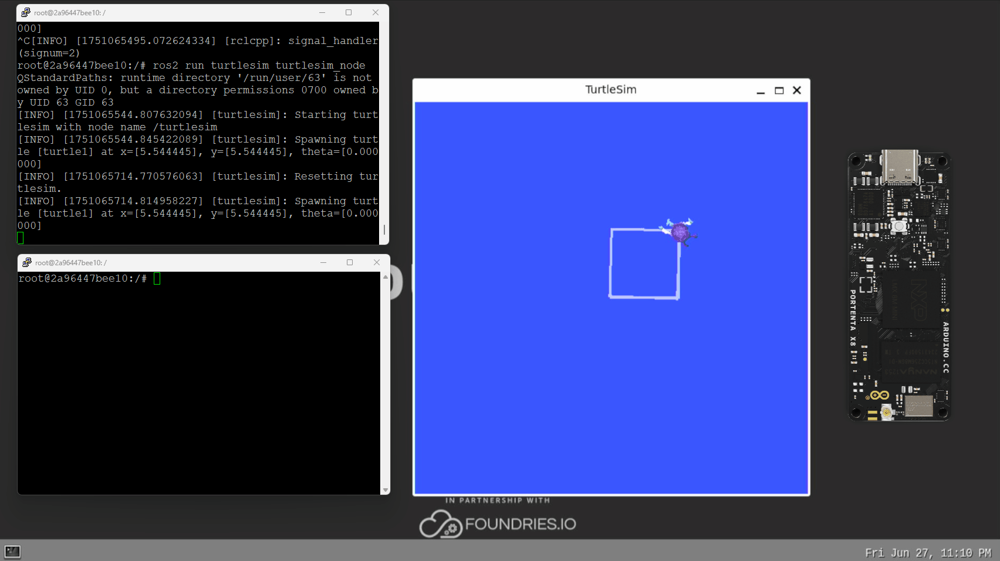

We will explore two approaches: running ROS 2 directly through commands and deploying it in a containerized environment using Docker. The **`turtlesim`** application is an excellent introduction to ROS 2, providing a simple way to understand ROS 2 concepts like nodes, topics and services through an interactive turtle graphics simulation.

## Goals

- Learn how to connect and configure an external display with the Portenta X8
- Understand the Wayland display server configuration on the Portenta X8
- Run ROS 2 and turtlesim using direct commands
- Deploy ROS 2 and turtlesim in a Docker container

## Hardware and Software Requirements

### Hardware Requirements

- [Portenta X8](https://store.arduino.cc/products/portenta-x8) (x1)
- USB-C® to HDMI Hubs (e.g. [TPX00145](https://store.arduino.cc/products/usb-c-to-hdmi-multiport-adapter-with-ethernet-and-usb-hub)/[TPX00146](https://store.arduino.cc/products/usb-c-to-hdmi-multiport-adapter-4k-usb-hub-pd-pass-through)) (x1)
- [USB-C® cable (USB-C® to USB-A cable)](https://store.arduino.cc/products/usb-cable2in1-type-c) (x1)
- Power supply compatible with Portenta X8
- HDMI compatible monitor or display (x1)
- HDMI cable (x1)

### Software Requirements

Before you begin, verify that your Portenta X8 meets the requirements below.

- Ensure your Portenta X8 has the latest Linux image. Check [this section of Portenta X8's user manual](https://docs.arduino.cc/tutorials/portenta-x8/user-manual/#portenta-x8-os-image-update) to verify that your Portenta X8 is up-to-date.

***For the smooth functioning of the Portenta X8, it is important to have Linux __image version > 746__ on the Portenta X8. To update your board to the latest image, use the [Portenta X8's Arduino Wizard Experience](https://docs.arduino.cc/tutorials/portenta-x8/image-flashing/#update-through-arduino-linux-wizard-experience) method or [manually flash it](https://docs.arduino.cc/tutorials/portenta-x8/image-flashing/#update-using-uuu-flashing-tool), downloading the most recent version from this [link](https://downloads.arduino.cc/portentax8image/image-latest.tar.gz).***

We will also need:

- Terminal access to the Portenta X8 (via SSH or serial console). If you are not familiar with this method, please refer to this section of the [Portenta X8 user manual](https://docs.arduino.cc/tutorials/portenta-x8/user-manual/#accessing-over-ssh-session)
- Wi-Fi® Access Point or Ethernet with Internet access (x1)

To check your Portenta X8 Linux version and update if necessary, refer to the [Portenta X8 User Manual](https://docs.arduino.cc/tutorials/portenta-x8/user-manual/#set-flashing-mode-with-carrier).

## Hardware Setup

### Video Output Setup

To display ROS 2 `turtlesim` on an external monitor, you will need a USB-C® hub with video output capabilities. The Portenta X8 serves as the host device, is connected to the hub, and provides the necessary ports for display connectivity and optional peripherals.

Connect the Portenta X8 to the USB-C® hub's host port, then connect your HDMI cable to your external display. The hub's power supply can be connected to your computer or a dedicated power adapter. You can connect a USB mouse and keyboard to the hub's additional ports for interactive system control. This is optional for the `turtlesim` example.

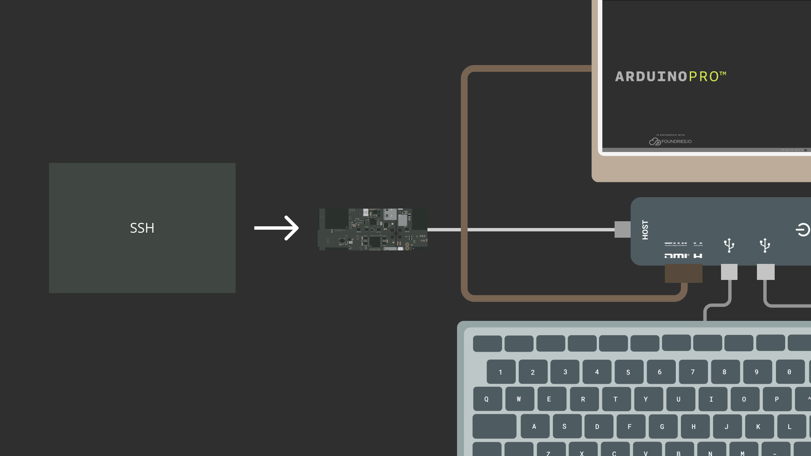

***As a [reference](https://docs.arduino.cc/tutorials/portenta-x8/display-output-webgl/#video-output-setup), a list of validated USB-C® to HDMI hubs that you can use are: [TPX00145](https://store.arduino.cc/products/usb-c-to-hdmi-multiport-adapter-with-ethernet-and-usb-hub) and [TPX00146](https://store.arduino.cc/products/usb-c-to-hdmi-multiport-adapter-4k-usb-hub-pd-pass-through).***

### Initial Display Output

When you first connect the Portenta X8 to your display, you will see the default home screen featuring the *Arduino PRO* background wallpaper and a bottom status bar showing the real-time clock. This shows that your display connection is working correctly.

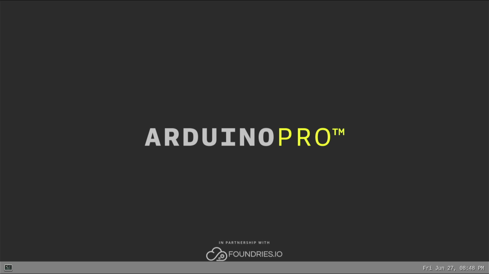

The Portenta X8 uses **Weston** as its **Wayland** compositor, which automatically detects and configures external displays. You can interact with the interface directly if you have connected a mouse or keyboard to your USB hub. However, we will mostly work through terminal commands and use Docker configuration files for the present ROS 2 `turtlesim` tutorial.

### Adjusting Display Resolution (Optional)

If your display does not show the optimal resolution or you need to adjust the video output quality, you can modify the `Weston` configuration to add custom display modes. The Portenta X8's Linux image includes the `cvt` command for generating custom modelines that specify exact display parameters.

For example, to configure a display for `1600 x 758` resolution at `60 Hz`, you would first connect to your Portenta X8 through ADB or SSH to access the terminal. The system's graphical server configuration can then be modified to include your specific display requirements. This helps provide optimal visual quality for applications like turtlesim that benefit from proper display scaling.

***For detailed instructions on connecting to your Portenta X8 via ADB, refer to the [Working with Linux section](https://docs.arduino.cc/tutorials/portenta-x8/user-manual#working-with-linux) of the user manual. Additional information about display configuration and WebGL capabilities can be found in the [Display Output tutorial](https://docs.arduino.cc/tutorials/portenta-x8/display-output-webgl/).***

Once your display is properly connected and configured, you are ready to proceed with running ROS 2 and visualizing the `turtlesim` application on your external monitor.

## What Is ROS

**ROS (Robot Operating System)** is an open-source middleware framework that enables robotic and embedded systems to exchange data through standardized **nodes**, **topics**, **services** and **actions**. ROS is a trademark of Open Source Robotics Foundation. It provides reusable libraries and tools, such as visualization, package management and message passing, so developers can focus on application logic instead of low-level infrastructure.

### What Is ROS 2

**ROS 2** is the modern version of ROS. While the core concepts remain familiar, ROS 2 replaces the original, research-oriented architecture with an industrial-grade foundation built on the **Data Distribution Service (DDS)** standard. Key improvements include:

- **Real-time and deterministic performance** suitable for safety-critical and time-bounded tasks.  
- **Enhanced security** with built-in authentication, encryption, and access control.  
- **Improved cross-platform support** that includes Linux, Windows, macOS and embedded RTOSs.  
- **Multi-robot and distributed-system readiness** for better discovery, namespace isolation and QoS (Quality-of-Service) settings.  
- **Long-term maintenance (LTS) releases** for predictable upgrade paths for production deployments.

Throughout this tutorial, we use [**ROS 2 Jazzy**](https://docs.ros.org/en/jazzy/index.html) on the Portenta X8, allowing you to leverage these newer capabilities while still relying on familiar ROS concepts.

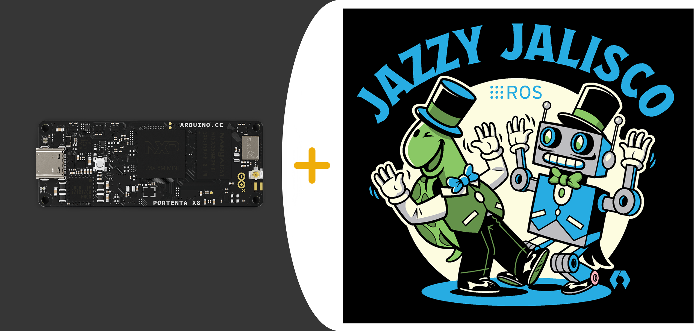

## Wayland Display Configuration

Before running graphical applications, we need to understand how `Wayland` manages displays on the Portenta X8. The system runs a `Weston` compositor that handles the graphical output.

### Checking Wayland Status

First, we need to verify that the `Wayland` compositor is running:

```bash
ps aux | grep -E "(wayland|weston|compositor)"
```

You should see output similar to:

```
weston       650  1.2  1.4 375996 28912 tty7     Ssl+ 05:07   0:32 /usr/bin/weston --modules=systemd-notify.so
weston       710  0.0  1.0  51016 21568 ?        Ss   05:07   0:01 /usr/libexec/weston-desktop-shell
...
```

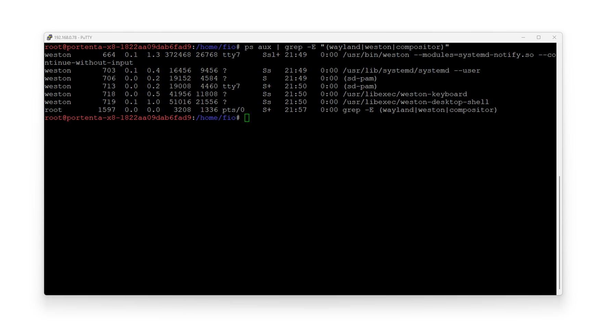

### Finding the Wayland Display Socket

Search for the Wayland display socket:

```bash
find /run/user -name "wayland-*" 2>/dev/null
```

This command would return something as follows:

```
/run/user/63/wayland-1
/run/user/63/wayland-1.lock
```

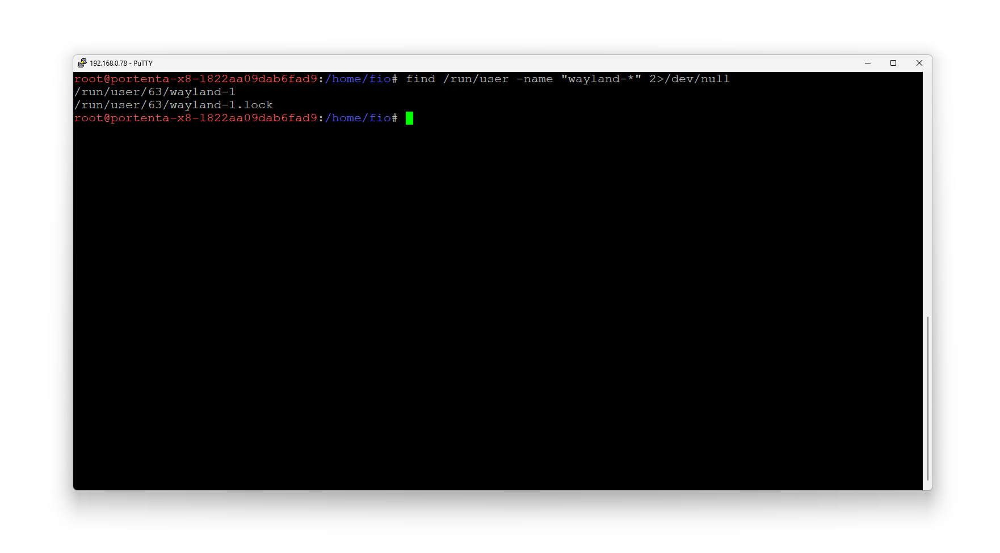

## Running ROS 2 Directly

### Setting Up the Environment

To run ROS 2 and `turtlesim` directly on the Portenta X8, we will use Docker containers to ensure a consistent environment. This approach lets us quickly test ROS 2 functionality without creating a permanent installation.

First, we need to configure the environment variables that will allow our Docker container to communicate with the Wayland display server. The `Wayland` protocol requires specific environment variables to establish the connection between the containerized application and the display server running on the host system:

```bash
export WAYLAND_DISPLAY=wayland-1
```

```bash
export XDG_RUNTIME_DIR=/run/user/63
```

```bash
export QT_QPA_PLATFORM=wayland
```

These variables tell applications where to find the `Wayland` socket (`wayland-1`), specify the runtime directory where `Wayland` stores its communication files (`/run/user/63`) and tell Qt-based applications like `turtlesim` to use `Wayland` as their display platform.

With the environment configured, we can now launch a ROS 2 Docker container. The following command creates an interactive container with all the necessary permissions and volume mounts to access the display:

```bash
docker run -it --rm \
 --privileged \
  -e WAYLAND_DISPLAY=wayland-1 \
 -e XDG_RUNTIME_DIR=/run/user/63 \
  -e QT_QPA_PLATFORM=wayland \
 -v /run/user/63:/run/user/63 \
  -v /tmp/.X11-unix:/tmp/.X11-unix:rw \
 --name ros2_wayland_test \
  arm64v8/ros:jazzy-ros-base \
 bash
```

This command uses flags like `--privileged` that grant the container elevated permissions needed for display access, the `-e` flags pass our environment variables into the container, and the `-v` flags mount the necessary directories for `Wayland` communication. The container is named `ros2_wayland_test` for easy reference in subsequent commands.

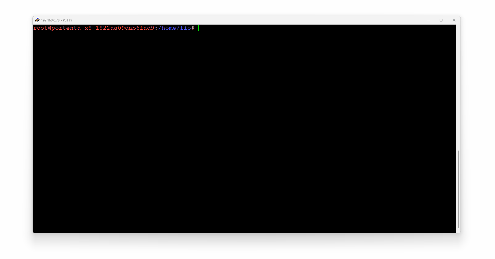

### Installing and Running Turtlesim

You will see a bash prompt once you are inside the Docker container. The container has ROS 2 pre-installed, but we need to set up the ROS 2 environment and install the turtlesim package.

Start by sourcing the ROS 2 setup script, which configures all the necessary ROS 2 environment variables and paths:

```bash
source /opt/ros/jazzy/setup.bash
```

This command initializes the ROS 2 workspace, making all ROS 2 commands and tools available in your current shell session. Without this step, ROS 2 commands won't be recognized.

Next, install the `turtlesim` package, which is not included in the base ROS 2 image. Update the package list and install `turtlesim`:

```bash
apt-get update && apt-get install -y ros-jazzy-turtlesim
```

The installation will download and configure the `turtlesim` package, along with any necessary dependencies. This typically takes one to two minutes, depending on your internet connection.

After installation, we need to ensure the `Wayland` environment variables are properly set within the container. Even though we passed them during container creation, it is good practice to set them again explicitly:

```bash
export QT_QPA_PLATFORM=wayland
```

```bash
export WAYLAND_DISPLAY=wayland-1
```

```bash
export XDG_RUNTIME_DIR=/run/user/63
```

You are now ready to launch `turtlesim`.


Run the following command to start the `turtlesim` node:

```bash
ros2 run turtlesim turtlesim_node
```

The `turtlesim` window should appear on your external display if everything is configured correctly. The terminal will show initialization messages similar to:

```
[INFO] [1747893188.706650173] [turtlesim]: Starting turtlesim with node name /turtlesim
[INFO] [1747893188.759792213] [turtlesim]: Spawning turtle [turtle1] at x=[5.544445], y=[5.544445], theta=[0.000000]
```

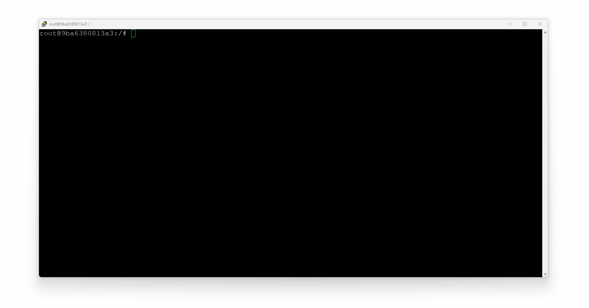

These messages confirm that the `turtlesim` node has started successfully and spawned a turtle at the center of the window. You might also see a warning about the runtime directory ownership, which can be safely ignored as it does not affect functionality.

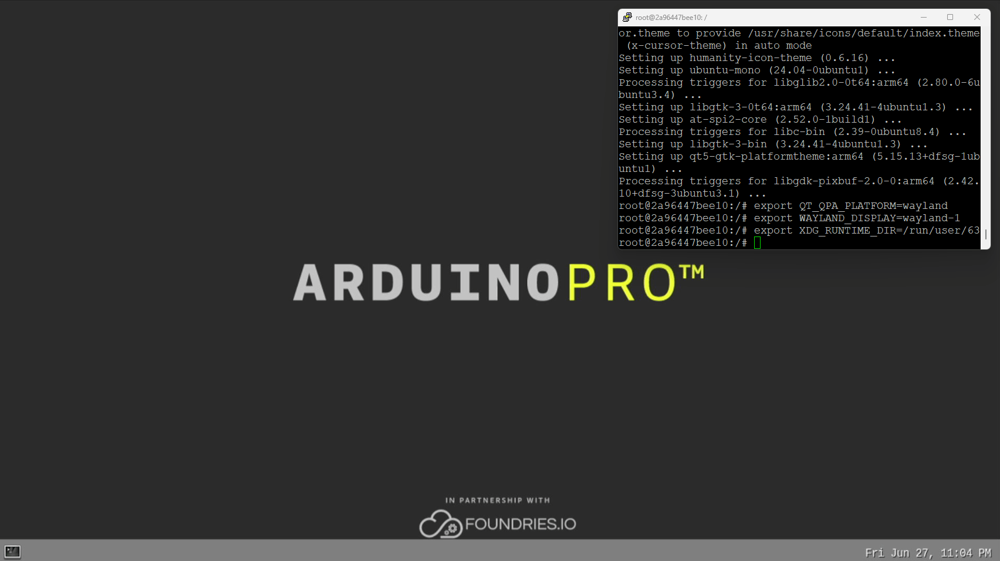

### Controlling the Turtle

With `turtlesim` running, you will want to make the turtle move. Since the `turtlesim` node is occupying your current terminal, you will need to open a new terminal session to send movement commands.

Open a new terminal on your Portenta X8 and access the running Docker container using the exec command:

```bash
docker exec -it ros2_wayland_test bash
```

This command opens a new bash session inside the running container named `ros2_wayland_test`. You will need to source the ROS 2 environment again in this new session:

```bash
source /opt/ros/jazzy/setup.bash
```

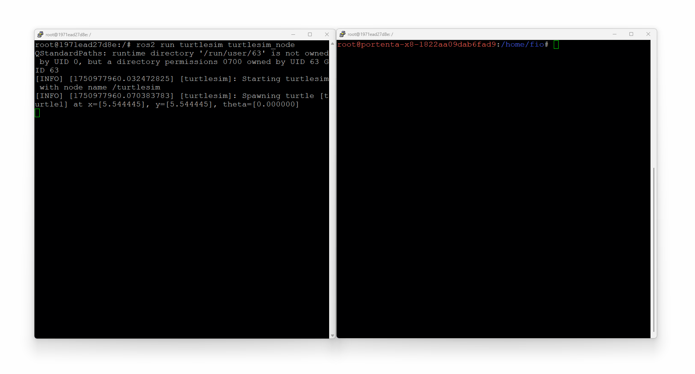

Now, you can control the turtle using ROS 2 topics. The `turtlesim` node subscribes to velocity commands on the `/turtle1/cmd_vel` topic. You have different options for controlling the turtle's movement.

For continuous circular movement, publish velocity commands that combine linear and angular velocities:

```bash
ros2 topic pub --rate 1 /turtle1/cmd_vel geometry_msgs/msg/Twist \
 "{linear: {x: 2.0, y: 0.0, z: 0.0}, angular: {x: 0.0, y: 0.0, z: 1.8}}"
```

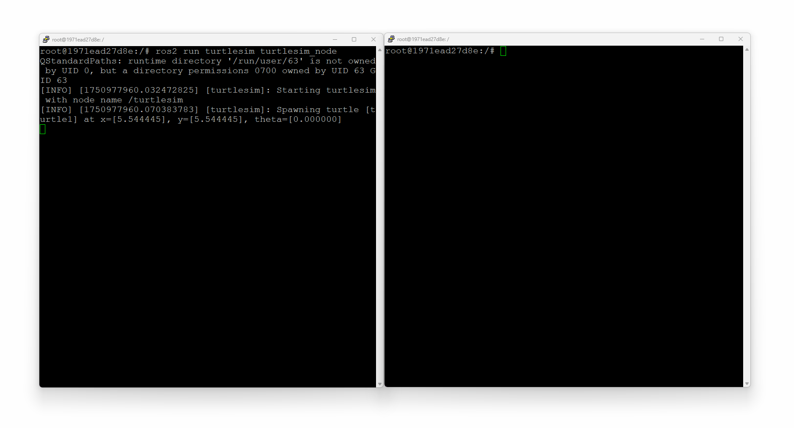

This command publishes a Twist message at `1 Hz`, telling the turtle to move forward at `2.0 units/second` while rotating at `1.8 radians/second`, creating a circular path. The turtle will continue moving in circles until you stop the command with `Ctrl+C`.

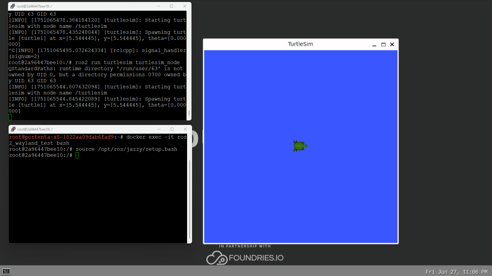

Alternatively, you can run a pre-programmed coordination example that makes the turtle draw a square pattern:

```bash
ros2 run turtlesim draw_square
```


The `draw_square` node will reset the turtle to its starting position and then command it to draw a square by repeatedly moving forward and turning 90 degrees. The terminal will show the turtle's progress as it reaches each square corner, with messages indicating the current goal position and when each goal is reached.

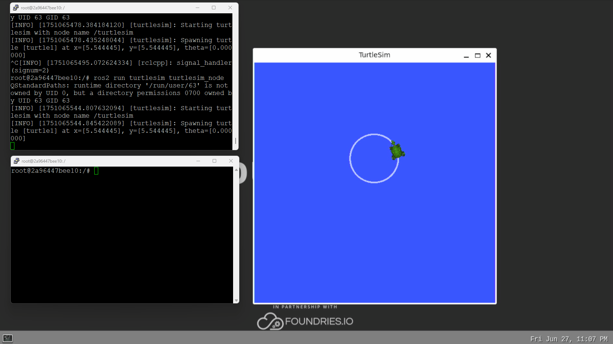

## Dockerized Deployment

### Overview of the Dockerized Approach

While running ROS 2 directly through Docker commands is useful for testing and development, a dockerized deployment using Docker Compose can provide integration for persistent applications. This method automates the entire setup process, ensures consistent behavior across restarts, and makes managing the ROS 2 `turtlesim` application as a service easy.

The dockerized approach includes all dependencies, configurations and startup procedures in a self-contained environment. This is particularly useful when you want the `turtlesim` example to start automatically on boot or recover from unexpected shutdowns.

### Creating the Docker Environment

[Here](assets/ros2_turtleNative.zip), you can download the files for dockerized deployment.

Within this directory, you will have three essential files that define your dockerized ROS 2 application:

- Docker Compose configuration
- Dockerfile
- Startup script

First, the `docker-compose.yml` file, which manages the container deployment and defines how Docker should run your application:

```yaml
version: '3.8'

services:
  turtlesim_auto:
    build:
      context: .
      dockerfile: Dockerfile
    container_name: ros2_turtlesim_auto
    privileged: true
    environment:
      - WAYLAND_DISPLAY=wayland-1
      - XDG_RUNTIME_DIR=/run/user/63
      - QT_QPA_PLATFORM=wayland
    volumes:
      - /run/user/63:/run/user/63
      - /tmp/.X11-unix:/tmp/.X11-unix:rw
      - ./ros2_ws:/ros2_ws
    restart: unless-stopped
    tty: true
    stdin_open: true
```

This configuration tells Docker Compose to build a custom image using the Dockerfile in the current directory. It sets up the same privileged access and environment variables we used in the direct method but adds a restart policy (`unless-stopped`) that ensures the container automatically restarts if the system reboots or if the container exits unexpectedly.

Next, create the `Dockerfile` that defines how to build your custom ROS 2 image with `turtlesim` pre-installed:

```
FROM arm64v8/ros:jazzy-ros-base

# Install turtlesim and other necessary packages
RUN apt-get update && apt-get install -y \
 ros-jazzy-turtlesim \
 ros-jazzy-rclpy \
 python3-pip \
 && rm -rf /var/lib/apt/lists/*

# Set up environment
SHELL ["/bin/bash", "-c"]
RUN echo "source /opt/ros/jazzy/setup.bash" >> ~/.bashrc

# Create workspace directory
WORKDIR /ros2_ws

# Copy startup script
COPY ./start_turtlesim.sh /usr/local/bin/
RUN chmod +x /usr/local/bin/start_turtlesim.sh

# Set environment variables for Wayland
ENV QT_QPA_PLATFORM=wayland
ENV WAYLAND_DISPLAY=wayland-1
ENV XDG_RUNTIME_DIR=/run/user/63

# Entry point
ENTRYPOINT ["/usr/local/bin/start_turtlesim.sh"]
```

This Dockerfile starts from the official ROS 2 Jazzy base image for ARM64 architecture, installs the turtlesim package and Python tools, and configures the environment. The key point here is that it copies and sets up a custom startup script as the container's entry point, which handles all initialization and coordination of multiple ROS 2 processes.

The `start_turtlesim.sh` is the main script. This file handles the startup of `turtlesim` with defined movement patterns:

```bash
#!/bin/bash
set -e

# Source ROS 2 environment
source /opt/ros/jazzy/setup.bash

# Set Wayland environment variables
export QT_QPA_PLATFORM=wayland
export WAYLAND_DISPLAY=wayland-1
export XDG_RUNTIME_DIR=/run/user/63

echo "Starting Turtlesim with automatic movement..."
echo "Wayland Display: $WAYLAND_DISPLAY"
echo "Runtime Dir: $XDG_RUNTIME_DIR"

# Start turtlesim_node in background
echo "Starting turtlesim node..."
ros2 run turtlesim turtlesim_node &
TURTLESIM_PID=$!

# Wait for turtlesim to start up
echo "Waiting for turtlesim to initialize..."
sleep 3

# Check if turtlesim node is running
if ! kill -0 $TURTLESIM_PID 2>/dev/null; then
    echo "ERROR: Turtlesim node failed to start"
    exit 1
fi

echo "Turtlesim started successfully! Starting automatic movement..."

# Start the draw_square demo
echo "Running draw_square demo..."
ros2 run turtlesim draw_square &
DRAW_PID=$!

# Wait a bit then start continuous circular movement
sleep 5
echo "Starting continuous circular movement..."
ros2 topic pub --rate 1 /turtle1/cmd_vel geometry_msgs/msg/Twist \
  "{linear: {x: 1.5, y: 0.0, z: 0.0}, angular: {x: 0.0, y: 0.0, z: 0.8}}" &
MOVE_PID=$!

echo "All processes started:"
echo "  - Turtlesim node (PID: $TURTLESIM_PID)"
echo "  - Draw square (PID: $DRAW_PID)"  
echo "  - Circular movement (PID: $MOVE_PID)"
echo ""
echo "Turtlesim should now be visible on your display with automatic movement!"
echo "Press Ctrl+C to stop all processes..."

# Function to cleanup processes
cleanup() {
    echo "Stopping all processes..."
    kill $TURTLESIM_PID $DRAW_PID $MOVE_PID 2>/dev/null || true
    wait $TURTLESIM_PID $DRAW_PID $MOVE_PID 2>/dev/null || true
    echo "All processes stopped."
    exit 0
}

# Set up signal handling
trap cleanup SIGINT SIGTERM

# Wait for all background processes
wait
```

This script starts the turtlesim node, verifies it is running correctly and then simultaneously launches two different movement patterns. The draw_square example runs alongside continuous circular movement commands, creating the defined movement. The script also implements signal handling to ensure all processes are cleanly terminated when the container stops.

Make the script executable to ensure Docker can run it:

```bash
chmod +x start_turtlesim.sh
```

Here are the Docker configuration and setup files for the turtlesim example, ready to download and use:

[](assets/ros2_turtleNative.zip)

### Running the Dockerized Setup

With all files in place, you are now ready to build and launch your dockerized ROS 2 turtlesim application. The Docker Compose command handles the build and deployment process:

```bash
docker compose up --build
```

This command builds the custom Docker image according to your Dockerfile specifications. Then, it starts the container with all the configurations defined in `docker-compose.yml`. The `--build` flag ensures the image is rebuilt, including any changes you have made to the files.

The following sequence of the commands also works:

```bash
docker build . -t turtlesim_auto
```

```bash
docker run -it --rm \
  --privileged \
  -e WAYLAND_DISPLAY=wayland-1 \
  -e XDG_RUNTIME_DIR=/run/user/63 \
  -e QT_QPA_PLATFORM=wayland \
  -v /run/user/63:/run/user/63 \
  -v /tmp/.X11-unix:/tmp/.X11-unix:rw \
  --name turtlesim_container \
  turtlesim_auto
```

As the container starts, you will see a detailed output showing the initialization process in your terminal. The turtlesim window should appear on your external display within a few seconds, with the turtle already performing pre-defined movements.


The turtle will simultaneously run square-drawing patterns while maintaining a circular trajectory, creating a hybrid spiral-square pattern.

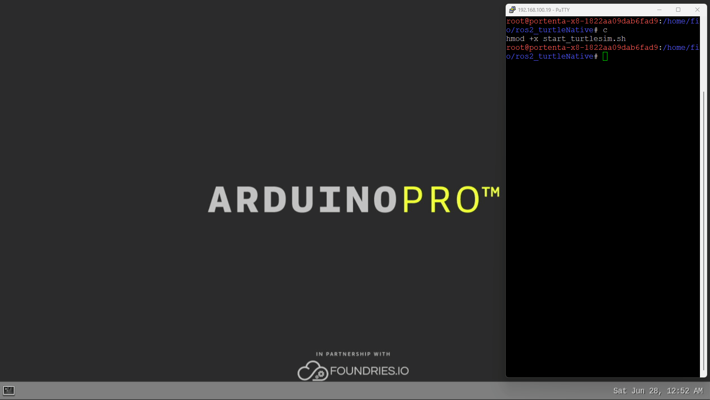

When the turtle _crashes_ into a wall, while the example is running, you will eventually see log lines like:

```bash
[WARN] [turtlesim]: Oh no! I hit the wall!
```

Nothing is wrong, `turtlesim` clamps the pose to keep the turtle inside the blue window and keeps drawing. You can clear or reset the screen at any time:

```bash
# clear the drawing
ros2 service call /clear  std_srvs/srv/Empty {}

# reset turtle position (also clears)
ros2 service call /reset  std_srvs/srv/Empty {}
```

The motion parameters can be adjusted and avoid wall collisions in `start_turtlesim.sh`. Edit that sketch to use smaller values that keep the turtle away from the edges:

```bash
nano start_turtlesim.sh
```

```bash
# Draw-square demo (optional)
ros2 run turtlesim draw_square &

# Continuous circular motion
ros2 topic pub --rate 1 /turtle1/cmd_vel geometry_msgs/msg/Twist \
  "{linear: {x: 2.0, y: 0.0, z: 0.0}, angular: {x: 0.0, y: 0.0, z: 1.8}}" &
```

The starting point can be updated to be:

| **Parameter**                            | **Original Value** | **Suggested Example Value** | **Effect of Change**                                                     |
|------------------------------------------|--------------------|-----------------------------|--------------------------------------------------------------------------|
| `linear.x` (forward)                     | `1.5`              | `0.8 – 1.0`                 | Slower advance → tighter overall pattern                                 |
| `angular.z` (turn rate)                  | `0.8`              | `0.4 – 0.6`                 | Gentler turn → smaller spiral radius                                     |
| `sleep 5` (delay before circular motion) | `5 s`              | `2 – 3 s` (optional)        | Starts circle sooner and reduces distance covered during square routine |

After saving the changes, rebuild and relaunch:

```bash
docker compose up --build
```

The turtle will now trace a tighter spiral–square pattern and stay comfortably inside the boundaries. These warnings are a helpful indicator that the simulation’s collision logic is working and fine tuning the script gives you full control over the turtle’s behavior.

### Managing the Dockerized Application

Docker Compose provides useful commands for managing your deployed application. Understanding these commands helps you maintain and troubleshoot your ROS 2 deployment effectively.

To monitor the application's output in real time, use the logs command with the following flag:

```bash
docker compose logs -f
```

This displays all output from the container and streams new log entries as they occur. This helps debug or monitor the application's behavior.

If you need to restart the application without rebuilding the image, use:

```bash
docker compose restart
```

This quickly stops and restarts the container, which is useful when resetting the turtle's position or recovering from any unexpected states.

For production deployments where you don't need to see the output immediately, run the application in detached mode:

```bash
docker compose up -d
```

This starts the container in the background, allowing you to use your terminal for other tasks while turtlesim continues to run on your display. With the `restart: unless-stopped` policy in the Docker Compose configuration, the application will persist across system reboots.

## Troubleshooting

### Display Not Showing

If the turtlesim window doesn't appear on your external display. You can first try verifying `Wayland` socket permissions:

```bash
ls -la /run/user/63/wayland-1
```

It should show similar to the following:

```
srwxr-xr-x 1 weston weston 0 [date] /run/user/63/wayland-1
```

Check if `Weston` is running:

```bash
systemctl status weston
```

Or restart the display service if needed using the following command:

```bash
sudo systemctl restart weston
```

### Permission Errors

If you encounter an error about runtime directory ownership like:

```
QStandardPaths: runtime directory '/run/user/63' is not owned by UID 0
```

This is a warning that can be safely ignored as it does not affect functionality.

### Container Connection Issues

If the container cannot connect to the Wayland display:

- Ensure the volume mounts are correct in your Docker command or compose file
- Verify that the `--privileged` flag is included
- Check that all environment variables are properly set

## Conclusion

In this tutorial, you have learned how to set up and run ROS 2 with turtlesim visualization on the Portenta X8 using an external display. You have implemented direct command execution and containerized deployment methods, providing flexibility for different use cases.

The direct method offers quick testing and development capabilities, while the Dockerized approach provides an automated method ideal for controlled deployments.

### Next Steps

Now that you have ROS 2 running on your Portenta X8, you can try different ROS 2 packages, create custom nodes, integrate sensor data from the Portenta X8's built-in capabilities with carriers, develop robotics applications using the ROS 2 framework, or create custom Docker images with your ROS 2 applications.

For more information about Portenta X8 capabilities, check out the [Portenta X8 User Manual](https://docs.arduino.cc/tutorials/portenta-x8/user-manual).

## Acknowledgments

ROS is a trademark of Open Source Robotics Foundation. This tutorial is provided for educational purposes to help users learn ROS 2 on Arduino hardware. This content does not imply endorsement, partnership or affiliation between Arduino and Open Source Robotics Foundation.

## Support

If you encounter any issues or have questions while working with the Portenta X8, we provide various support resources to help you find answers and solutions.

### Help Center

Explore our Help Center, which offers a comprehensive collection of articles and guides for the Portenta X8. The Arduino Help Center is designed to provide in-depth technical assistance and help you make the most of your device.

- [Portenta X8 help center page](https://support.arduino.cc/hc)

### Forum

Join our community forum to connect with other Portenta X8 users, share your experiences, and ask questions. The forum is an excellent place to learn from others, discuss different types of implementations, and discover new projects.

- [Portenta X8 category in the Arduino Forum](https://forum.arduino.cc/c/hardware/portenta/portenta-x8/172)

### Contact Us

Please get in touch with our support team if you need personalized assistance or have questions not covered by the help and support resources described before. We're happy to help you with any issues or inquiries about the Portenta X8.

- [Contact us page](https://www.arduino.cc/pro/contact-us)
