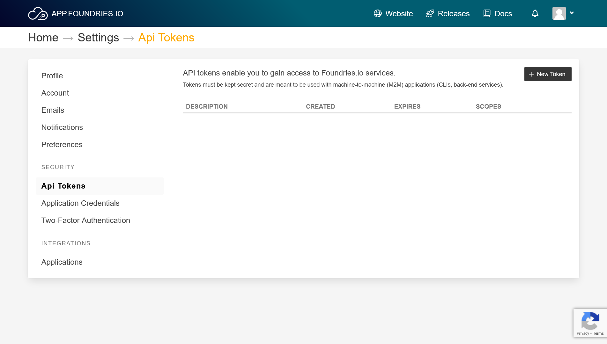
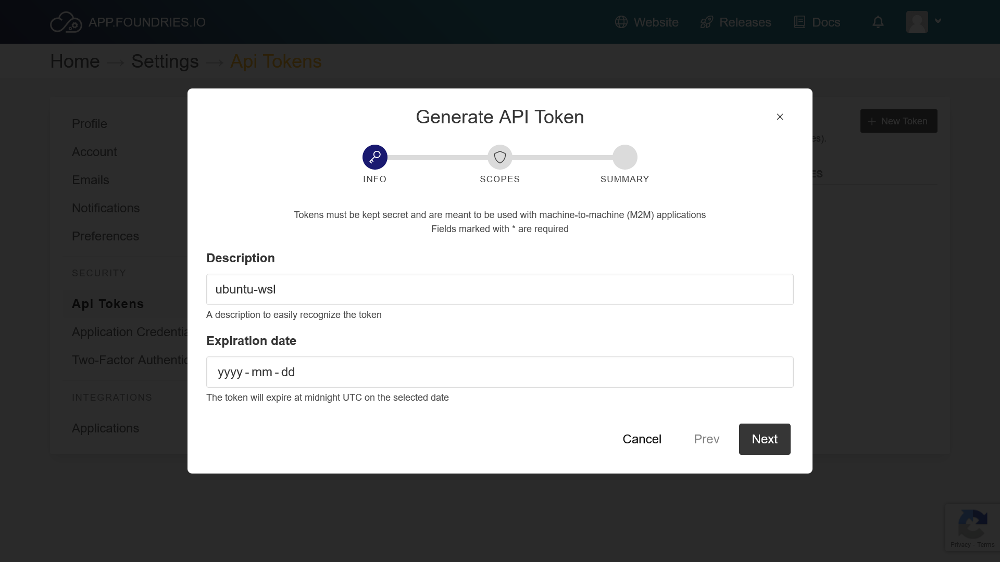
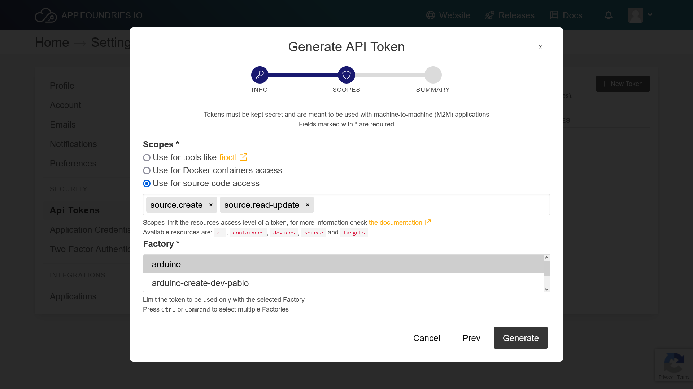
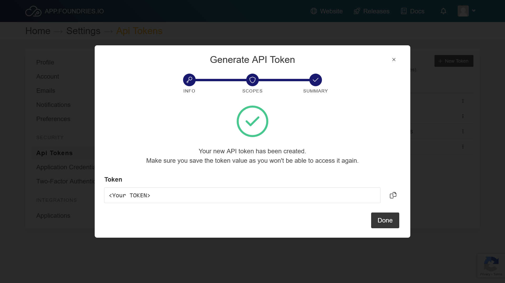
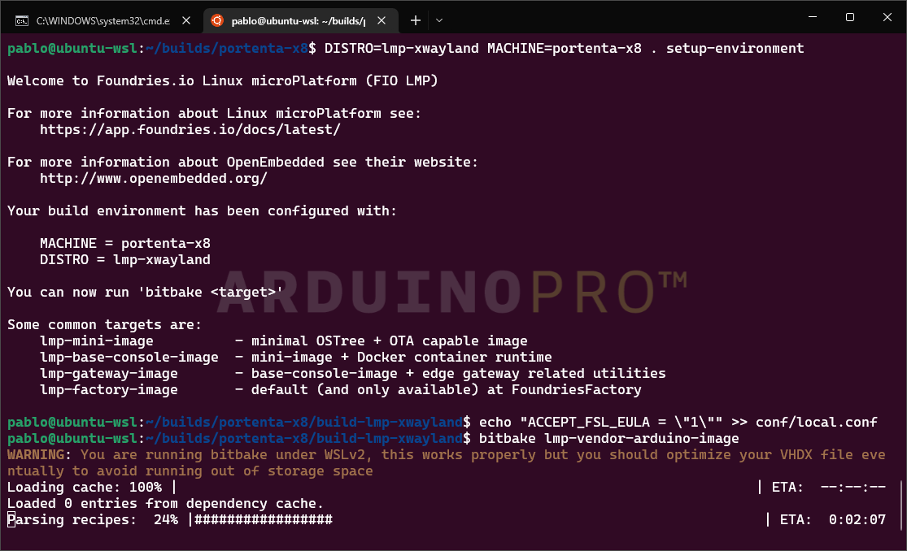

## Overview

In this tutorial you will learn how to build an image for the Portenta X8 with the files provided from Foundries.io.
Building your image locally is helpful to quickly debug certain aspects of the systems, like bootloader or kernel support.
Please keep in mind that images built locally cannot register to a FoundriesFactory and will not be OTA compatible, but this is a good alternative for those who do not have a FoundriesFactory subscription.
For FoundriesFactory subscribers, we strongly suggest to make use of the Factory continuous integration system for creating your images.

***In this tutorial we are using Ubuntu LTS 22.04 inside the Windows Subsystem for Linux (WSL) through the Windows Terminal***

## Goals

- Provide your Linux machine with the needed software
- Set up your computer with the required SSH keys and API Tokens
- Get the required files
- Configure the building settings
- Build the image

### Required Hardware and Software

- [Arduino Portenta X8](https://store.arduino.cc/portenta-x8)
- Linux distribution [compatible with the Yocto Project](https://docs.yoctoproject.org/ref-manual/system-requirements.html#supported-linux-distributions)
- Arduino Create account [Login](https://login.arduino.cc/login)
- Arduino Pro Cloud Subscription. [Learn more about the Pro Cloud](https://www.arduino.cc/pro/hardware/product/portenta-x8#pro-cloud).
- Optional: Foundries.io account (linked with the Pro Cloud subscription) [Login](https://app.foundries.io/login/)
- Optional: FoundriesFactory® ([Check the Getting Started tutorial](https://docs.arduino.cc/tutorials/portenta-x8/out-of-the-box))

## Instructions

### Folder Structure Overview

First we need to structure our directories as following:

```
home
└── builds
  ├── portenta-x8
  └── .bin
    └── repo
```

To start, lets navigate to the home directory on our machine with `cd ~`, and create the build directory with `mkdir builds`.

### Setup SSH Keys and API Token

Next to get the needed image files, we need to setup our SSH Keys and Foundries API token from **FoundriesFactory**.

To setup your SSH Key, go to the `.ssh` directory, `cd ~/.ssh`. Crete a new key with `ssh-keygen -t rsa -b 4096 -C <yourEmail>"`.

Follow the instructions, after which you should have two new files in the directory: `<yourSSHkey> and <yourSSHkey>.pub`

Now initialize the `ssh-agent` with `eval "$(ssh-agent -s)"`. Add your key with `ssh-add ~/.ssh/<yourSSHkey>`.

***Make sure your `ssh-agent` is running, you can check the keys that your agent has with the command `ssh-add -l` if there is no key attached repeat the steps of adding the key and check if it was successfully added***

### Foundries.io API Token

***This step is only mandatory if you want to get the source code from your Factory***

To get the needed files (source code) for compiling the image we need access to our Factory repository.

To make that happen, go to your [Foundries account > Settings > Api Tokens](https://app.foundries.io/settings/tokens/):


Press the "New Token" button and follow the instructions.


Now make sure you select the correct scopes to "Use for source code access" and choose your derived Factory.


Once it has been generated, copy the token shown.


On your machine create a variable to store the token and add it to the global configuration for Git:

```
API_TOKEN="<YourToken>"
git config --global http.https://source.foundries.io.extraheader "Authorization: basic $(echo -n $API_TOKEN | openssl base64)"
```

Check that your token is properly configured by cloning the "containers" repository of your Factory:

```
git clone https://source.foundries.io/factories/<factory>/containers.git
```

Make sure you clone the repository outside our `builds` folder. You can remove it after you finish your check.

You can check your Git configuration with `git config --global -l` you should see:

```
http.https://source.foundries.io.extraheader=Authorization: basic <yourToken on base64>
```

### Google Repo: Fetch Yocto Project Layers

Google's Repo application handles fetching the repositories (Yocto Project layers) that will be used in the build process.

Use these commands to:

1. create a `.bin` folder to install the `repo` application in
2. add it to the system `PATH` so you will be able to use the `repo` command anywhere
3. download repo into `.bin`
4. set permission so that all users and run it.

```
mkdir -p ~/builds/.bin
PATH="${HOME}/builds/.bin:${PATH}"
curl https://storage.googleapis.com/git-repo-downloads/repo > ~/builds/.bin/repo
chmod a+rx ~/builds/.bin/repo
```

Now you should be able to access the command `repo` anywhere.

### Set up Your Repository

Switch to your build directory and create a folder to store the source code:

```
cd ~/builds/
mkdir portenta-x8
cd portenta-x8
```

Get your repository link. If you do not have a FoundriesFactory subscription, use the Public repository link, otherwise you can use your Factory repository link:

- Public repository: [lmp-manifest](https://github.com/arduino/lmp-manifest) -> https://github.com/arduino/lmp-manifest.git
- Your Factory repository: `https://source.foundries.io/factories/<yourFactory>/lmp-manifest` -> `https://source.foundries.io/factories/<yourFactory>/lmp-manifest.git`

Now initialize the repository:

```
repo init -u <repository> -m arduino.xml -b <master/devel>
```

You can now download the files you will need by running `repo sync`.

## Build The Image

### Set Up The Environment

You can set `DISTRO` to:
- `lmp-base`: unsecure image without ostree, developer friendly, not OTA compatible
- `lmp`: secure image without xwayland
- `lmp-xwayland`: secure image with xwayland support

***`lmp-partner-arduino-image` will be better supported in the near future.***

```bash
DISTRO=lmp-xwayland MACHINE=portenta-x8 . setup-environment
```

It will then switch automatically to a new folder.
Now to accept the EULA:

```bash
echo "ACCEPT_FSL_EULA = \"1\"" >> conf/local.conf
```

### Build Image With Bitbake

To start building the image, run:

```
bitbake lmp-partner-arduino-image
```

In case you want to use your computer while it builds, (the build is going to take time and resources) you should lower the used threads.
Do so by opening `conf/local.conf` and lower the values of the following variables:

- `BB_NUMBER_PARSE_THREADS = "4"`
- `BB_NUMBER_THREADS = "4"`  

And add:

- `PARALLEL_MAKE = "-j 4"`



### Build Manufacturing Tools: Flash The Board

To flash your board you will need to compile some tools. Go into the build folder with `cd ~/builds/portenta-x8` and type the following commands:

```
DISTRO=lmp-mfgtool MACHINE=portenta-x8 . setup-environment
echo "ACCEPT_FSL_EULA = \"1\"" >> conf/local.conf
echo "MFGTOOL_FLASH_IMAGE = \"lmp-partner-arduino-image\"" >> conf/local.conf
bitbake mfgtool-files
```

## Conclusion

Now you have all the required files to flash the image you built onto the device.

Please follow the [Flashing tutorial](image-flashing) to flash your device with your custom image.
Keep in mind you will need to use the files provided from this build, not the ones mentioned in the Flashing tutorial.

## Troubleshooting

- If you are having `do_fetch` issues, try to check your system's DNS and change it.
- If you lack build dependencies on your system, checkout the needed dependencies at [Yocto Project build host dependencies](https://docs.yoctoproject.org/ref-manual/system-requirements.html#required-packages-for-the-build-host).
