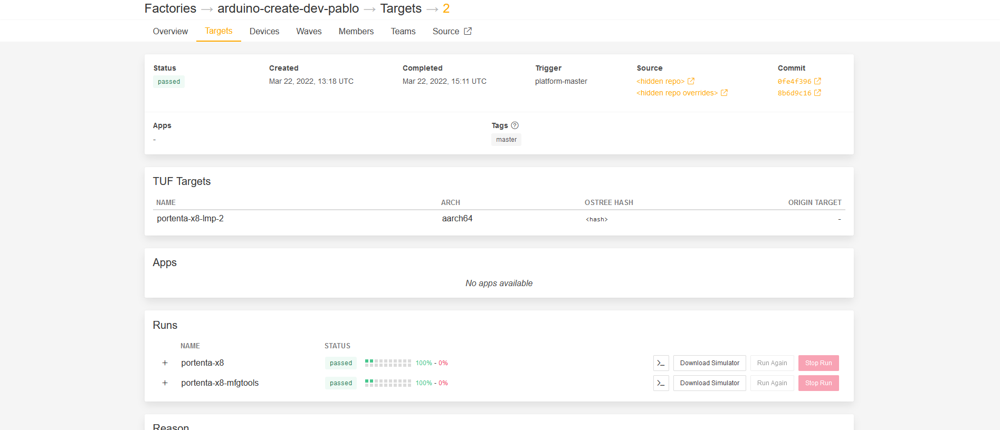
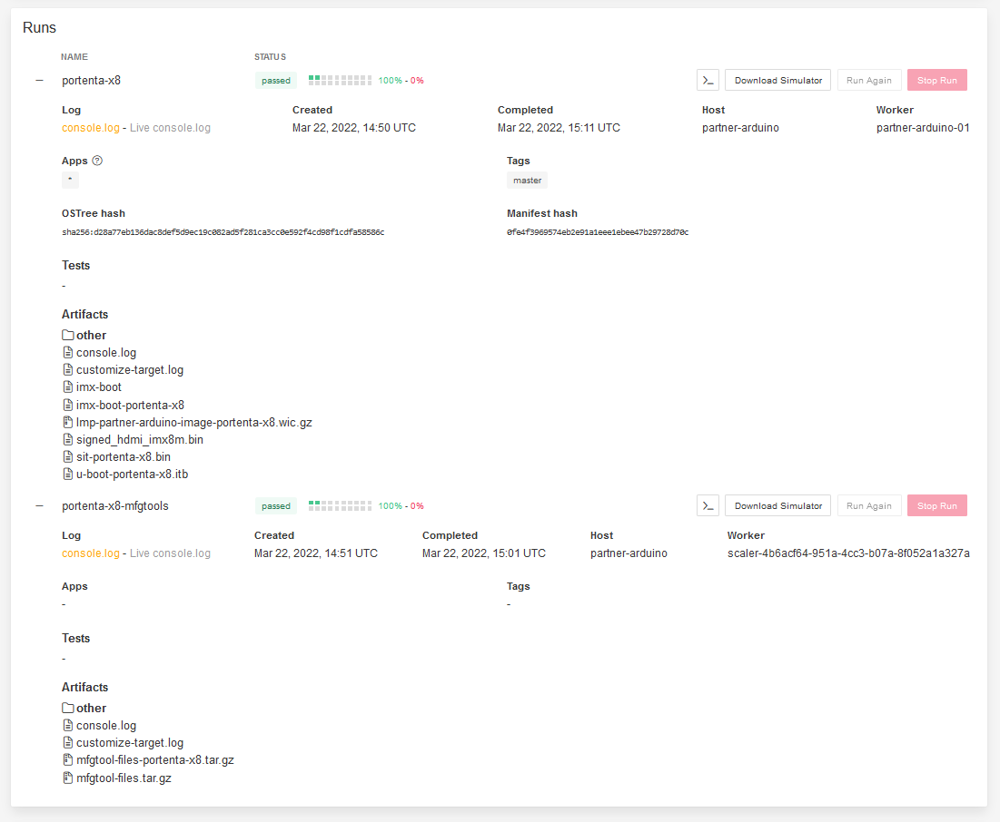

## Overview

In this tutorial you will see how to manually flash your Portenta X8 with the image that is provided by Foundries.io through USB using the Terminal.

***Attention: We encourage you to check every now and then if the device image version is up to date in order to have the latest bootloader, please check the release section of the [lmp-manifest repository](https://github.com/arduino/lmp-manifest/releases) and compare the target version number***

## Goals

- Get the required files
- Set up the correct structure of the files
- Set up the board
- Flash the device

### Required Hardware and Software

- USB-C to USB-A or USB-C to USB-C
- Portenta X8
- Portenta Breakout Board or Portenta Max Carrier
- Arduino Create account
- Arduino Pro Cloud Subscription. [Learn more about the Pro Cloud](https://www.arduino.cc/pro/hardware/product/portenta-x8#pro-cloud).
- Foundries.io account (linked with the Pro Cloud subscription)
- FoundriesFactory® ([Check the Getting Started tutorial](https://docs.arduino.cc/tutorials/portenta-x8/out-of-the-box))
- 1 Device already attached to your factory ([Check the Getting Started tutorial](https://docs.arduino.cc/tutorials/portenta-x8/out-of-the-box))
    
## Instructions

### Get the Required Files

Required files following this structure:

```
Root folder
├── imx-boot-portenta-x8
├── lmp-partner-arduino-image-portenta-x8.wic.gz **(Compressed)**
├── mfgtool-files-portenta-x8.tar.gz **(Compressed)**
├── sit-portenta-x8.bin
└── u-boot-portenta-x8.itb
```

To get those files:

#### Arduino's GitHub Repository

Go to the `lmp-manifest` [GitHub repository](https://github.com/arduino/lmp-manifest) and open the [releases](https://github.com/arduino/lmp-manifest/releases) section, there you will find a compressed `.tar.gz` with all the required files.

#### Through Foundries

Open your FoundriesFactory®.


Switch to the targets tab.


Click on the platform-master version.



On the "Runs" section open those collapsed labels, and download the files listed above by clicking on their text (like a normal link).



After downloading them, make sure you put them in a folder following the structure shown and extract the compressed files.

### Set the Portenta X8 to Flashing Mode

Plug your Porenta X8 into your carrier (Portenta Breakout carrier <!-- or Portenta Max Carrier-->).

Switch both DIP switches to the ON position.

Plug the USB-C end into the Portenta X8 and the other end (USB-C or USB-A) to your computer.

You will see a new device connected called `SE Blank M845S`.

### Flash the Device

Open a terminal and change the directory (`cd`) to your root folder as shown in the beginning.

Use the `uuu full_image.uuu` command.

Wait until it gets flashed.


Switch back the DIP switches to OFF position.

Unplug and then plug in the Portenta X8 to your computer.

***After flashing you will need to wait 10 secs, until the Portenta X8 blue LED starts blinking, this means the boot was successful***

## Troubleshooting

- If you get an error while its flashing, make sure your USB is correctly plugged in. Re-plug your board and try to flash again, you may need few tries before the flashing is successful.
