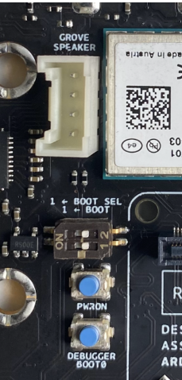
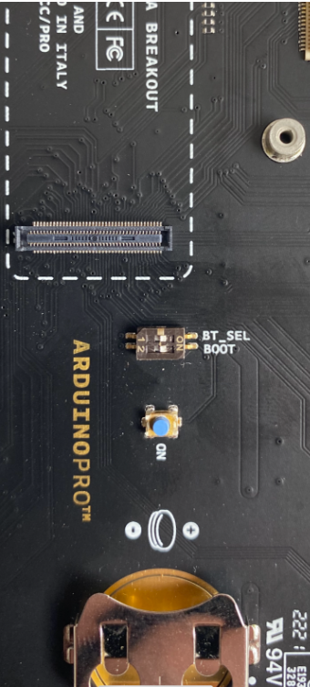

## Overview

In this tutorial you will see how to manually flash your Portenta X8 with the image that is provided by Arduino. You will flash your board through USB using the Terminal.
The instructions below are meant to be used with a Windows Operating System.

## Goals

- Get the required files
- Set up the correct structure of the files
- Set up the board
- Flash the device

### Required Hardware and Software

- USB-A to USB-C® cable
- Portenta X8
- Portenta Breakout Board or Portenta Max Carrier
    
## Instructions

### Get the Required Files

#### Arduino's Download Repository

Go to [Arduino Download repository](https://downloads.arduino.cc/portentax8image/image-latest.tar.gz) and a compressed `.tar.gz` with all the required OS image files will automatically download.

After downloading it, unzip it. You will get a structure like the following:

```
Unzipped folder
├── imx-boot-portenta-x8
├── lmp-partner-arduino-image-portenta-x8.wic.gz **(Compressed)**
├── mfgtool-files-portenta-x8.tar.gz **(Compressed)**
├── sit-portenta-x8.bin
└── u-boot-portenta-x8.itb
```

Then unzip `mfgtool-files-portenta-x8.tar.gz` and `lmp-partner-arduino-image-portenta-x8.wic.gz` make sure the .wic is on the unzipped folder in the main directory.

It needs to be like:
```
Unzipped folder
├── mfgtool-files-portenta-x8/
├── imx-boot-portenta-x8
├── lmp-partner-arduino-image-portenta-x8.wic
├── lmp-partner-arduino-image-portenta-x8.wic.gz **(Compressed)**
├── mfgtool-files-portenta-x8.tar.gz **(Compressed)**
├── sit-portenta-x8.bin
└── u-boot-portenta-x8.itb
```

### Set the Portenta X8 to Flashing Mode

Plug your Portenta X8 into your carrier (e.g. Portenta Breakout carrier or Portenta Max Carrier).

Place both DIP switches to the ON position.

On the Portenta Max Carrier the DIP switches are identified by a label `BOOT SEL` and `BOOT` as shown in figure.



On the Portenta Breakout the DIP switches are identified by a label `BT_SEL` and `BOOT` as shown in figure.



Plug one USB-C® end into the Portenta X8 and the other end (USB-C® or USB-A) to your computer.

You will see a new connected device called `SE Blank M845S`.

### Flash the Device

Open a terminal and change the directory (`cd`) to the folder where `mfgtool-files-portenta-x8` file is located.

Use the `uuu full_image.uuu` command.

Wait until it gets flashed.


At this point, set back the DIP switches to OFF position.

Unplug and then plug-in again the Portenta X8 to your computer.

***After booting you will need to wait 10 secs until the Portenta X8 blue LED starts blinking. This means the boot was successful.***

Now you can start using your Portenta X8 with the latest updates.

## Troubleshooting

- If you get an error while it is flashing, make sure your USB is correctly plugged in. Re-plug your board and try to flash it again. You may need few trials before the flashing is successful.
- If you get an error related to permissions, try to launch the `uuu` command as Super User (`sudo`). 
