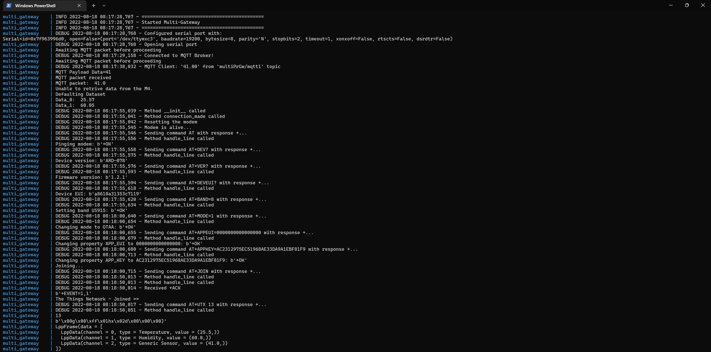

## Overview

Portenta X8 has the NXP® i.MX 8M Mini MPU (Linux) and STM32H747XI dual Cortex®-M7+M4 32bit low power ARM® MCU (Arduino) stacked together and can be used to design different work loads for these two different microprocessors. We will use the Portenta Max Carriers onboard CMWX1ZZABZ-078 LoRaWAN® module from Murata®, and the WiFi connectivity from Portenta X8 to build a Multi-Protocol Gateway.

In this tutorial we will go through the steps on how to setup both the Linux and Arduino side. A device collecting sensor data will transfer the data via WiFi, receive the data and exchange it between the Arduino and Linux layers, to then use LoRaWAN to finally send the information to The Things Network. We will also configure and expose a local communication lane to further expand its capability if a local sensor is desired. 

## Goals

- Build an Arduino layer script using RPC to handle sensor readings or data traffic on Portenta X8.
- Build a multi-protocol script to manage MQTT protocol and LoRa connectivity to handle data traffic on the Linux layer of Portenta X8.
- Assemble both layer scripts to build an operational multi-protocol gateway using Portenta X8 and Max Carrier.

### Required Hardware and Software

- [Arduino Portenta X8](https://store.arduino.cc/products/portenta-x8)
- [Arduino Portenta Max Carrier](https://store.arduino.cc/products/portenta-max-carrier)
- USB-C cable (either USB-C to USB-A or USB-C to USB-C)
- Wi-Fi Access Point with Internet Access
- 868-915 MHz antenna with SMA connector
- ADB or SSH. [Check how to connect to your Portenta X8](docs.arduino.cc/tutorials/portenta-x8/out-of-the-box#controlling-portenta-x8-through-the-terminal)

## Multi-Protocol Gateway 101

A gateway is a network node and a key-point for data exchange between different networks under certain given specifications. Simply referred to as hardware that communicates between two networks. On the other hand, a **multi-protocol gateway** goes one step further by implementing variety of protocols in a single gateway.

The idea of **Multi-Protocol Gateway** is to build a device that will establish a information relay, that handles incoming and outgoing traffic of data using different connectivity protocols.

This means that the gateway can receive the data transmitted in certain protocol type and relay the data in a different protocol for a remote server. Such capability provides the ability to develop on distinctive types of protocols and relay the data with less complexity. 

The Portenta X8 paired with the Portenta Max Carrier has the potential to create synergy, and you will have following connectivity tools at your disposal:

- WiFi (MQTT Protocol)
- Bluetooth Low Energy
- LoRaWAN (The Things Network)
- NB-IoT & Cat-M1

The following image illustrates how a overall multi-protocol gateway works with Portenta X8 and Max Carrier as the gateway system.


Bear in mind, that this tutorial emphasizes making a multi-protocol gateway using some connectivity modules. Yet, this Portenta combination still has much to offer. To get the most out of this Portenta configuration, we will go step by step on how to establishing the multi-protocol gateway and add scalability to expand its capability. 

Foremost, you will get to know how the multi-protocol gateway will be implemented with Portenta X8 paired with Max Carrier. Some other tutorials will be referenced to guide you through the present tutorial, as it involves mechanisms that are extensive to cover in this tutorial.

### Arduino Layer

The Arduino layer is extended within the M4 Core and is the layer to develop on if real time operations needs addressing. Thus, you can use the Arduino Layer to perform PID tasks and make the RPC calls to exchange the data with the Linux layer. 

***To learn about how to exchange data using RPC between Arduino and Linux layer, please read ["Data Exchange Between Python on Linux and an Arduino Sketch"](https://docs.arduino.cc/tutorials/portenta-x8/python-arduino-data-exchange)***

We will go through how to use RPC to expose the data received at the Arduino layer to the Linux layer, if further development requires you to feed the data to devices interfaced communicating with the M4 core. We will leave the tasks running and open to be interfaced with for expanding the capability of the Portenta X8 and Max Carrier. It will let you develop a gateway system where:

1. The Arduino layer will be the terminal to expose the received sensor data to control a local end-device. 
2. A local end-device transfers data to the Linux layer for further networking process.

Hence the multi-protocol architecture will process and manage the data traffic with the desired protocol.  

### Linux Layer

It is important to understand that **all networking processes are made within the Linux layer**. All network processes that are WiFi, Bluetooth low energy, LoRa, NB-IoT, and Cat-M1. We will focus on using WiFi with MQTT protocol, and LoRa connectivities to establish a multiple protocol gateway.

The Portenta X8 provides WiFi connectivity and the Portenta Max Carrier provides a LoRaWAN module that can help us communicate with The Things Network. We will use the MQTT protocol to receive the sensor data transmitted by an end device. 

We will use a python script that will configure and handle the connectivity modules and its sensor data. The RPC calls will be used to expose the received sensor data to the Arduino layer, setting up data exchange configuration to further expand the capability of the Portenta X8 and Max Carrier. The process can also be done vice-versa if the Arduino layer is to transmit the data to the Linux layer from the local end-device. 

Now that we know the roles of Arduino and Linux layer, we will need a clear picture of how the multi-protocol gateway should look. The next diagram illustrates the in-depth multi-protocol gateway architecture, showing how each layer and module will cooperate.


## Instructions

To showcase the ability of the Linux layer and Arduino layer extended by M4 Core, we will build a mult-protocol gateway that will receive MQTT protocol packets using EMQX as the broker, retrieve the data from a local sensor attached to Portenta via RPC mechanism, wrap the data together and send to The Things Netowork using LoRa connectivity within Cayenne Low Power Payload Encoder. 

This will help you get a better understanding of how the Portenta X8 and the Portenta Max Carrier helps you develop a multi-protocol gateway.

### Hardware Setup 

First things first, we will need to configure the hardware to be able to develop and work on the Multi-Protocol gateway. We will attach the Portenta X8 to the Portenta Max Carrier with High-Density Connectors, and we will make sure to attach an antenna for LoRa connectvity. The Portenta X8 also needs to have the WiFi antenna attached to it. 


***If you have not set up your Portenta X8, please have a look at [Portenta X8 Getting Started](https://docs.arduino.cc/tutorials/portenta-x8/out-of-the-box) tutorial.***

### Setting Up The Portenta X8

Before we begin diving deep into creating Multi-protocol gateway, and having understood that we will frequently communicate between Arduino and Linux layers, we will have to understand how to debug and observe the way these 2 layers interact. 

The `m4-proxy` is a service that manages data exchange between these layers. You can use the following command in the terminal to observe if the service is running correctly.

```
sudo journalctl -fu m4-proxy
```

We are going to implement RPC (Remote Procedure Call) to establish communication between the Arduino and Linux layer. This is a communication mechanism implemented to exchange data between these two layers. 

A very important note to take into account: **you will not be able to check messages via `Serial.println()` statements** to check if the Arduino sketch is running in a desired manner. You will have to use **`py-serialrpc`**, which is a service that will assist you in listening to those messages, printing them on a console. To have the service active, please download [this compressed file](assets/py-serialrpc.zip) to build and run the container on the Linux side of Portenta X8. Please execute following commands in order to have the service running.

```
// Copy the decompressed files in ../adb/32.0.0 
adb push py-serialrpc /home/fio
adb shell

sudo su -

// Head to directory and mount the container
cd /home/fio/py-serialrpc
#py-serialrpc sudo docker build. -t py-serialrpc 
#py-serialrpc sudo docker-compose up -d
```

To access the logs of `py-serialrpc` service, while maintaining the same directory, execute the following command.

```
sudo docker-compose logs -f --tail 20
```

***For more detail about how data exchange between Arduino and Linux layer works and to understand how to debug, please read [Data Exchange Between Python on Linux and an Arduino Sketch](https://docs.arduino.cc/tutorials/portenta-x8/python-arduino-data-exchange)***

In case you have not configured internal WiFi connectivity within the system, please use following command line.

```
nmcli device wifi connect "SSID" password "PASSWORD"
```

### Setting Up The Things Network

We now have the pre-requisites for the Portenta X8 ready, but as we are using the LoRa connectivity, we will need a platform that has the capability to receive data transmitted from the Portenta X8 and Max Carrier. **The Things Network** will be the platform we are going to use communicate using LoRaWAN. On the platform, we will need to create an application to add the Portenta Max Carrier as an End-Device. 

When adding the End-Device, at the moment we will have to use the **Manual** option. The Portenta Max Carrier will be added under Arduino SA in the near future to be included in the LoRaWAN Device Repository. The LoRaWAN version and parameters compatible with the Portenta Max Carrier are as follows. The frequency plan will depend on the region in which you are going install the device. 


***To learn more about LoRa and LoRaWAN, please have a look at our [Arduino Guide to LoRa® and LoRaWAN®](https://docs.arduino.cc/learn/communication/lorawan-101). Additionally, if you wish to learn on how to properly setup the End-Device in The Things Network, please read [this tutorial](https://docs.arduino.cc/tutorials/mkr-wan-1310/the-things-network) reference***

Let us now dive into developing a multi-protocol gateway using Portenta X8 and Max Carrier!

### Building the Multi-Protocol Gateway

Now it is important to put all the requirements into an operational task that will orchestrate every protocol we are going to use. We will create the following files and the required codes for our multi-protocol gateway.

We will need the Docker files that will configure and let us build a working container.

***If you are unfamiliar handling with Docker and containers, please read the tutorial on how to [Create and Upload a Custom Container to the Portenta X8](https://docs.arduino.cc/tutorials/portenta-x8/custom-container)***

You can access the files [here](assets/Multi_Protocol_Gateway_X8.zip). Meanwhile, let us take a look at some of the important details of the included files. 

### Docker Compose

Beginning with the `docker-compose.yml` file. Which is where we define permissions and settings for the container involved. 

```
...
extra_hosts:
  - 'm4-proxy:host-gateway'
devices:
  - '/dev/ttymxc3'
  - '/dev/gpiochip5'
tty: true
user: "0"
```

### Requirements

Here we will define which additional components are required to be able to run the script built inside the container. If you decide to further develop with different protocol, you will have to add the package in order to be able to use them for development. 

```
msgpack-rpc-python
pyserial==3.4
python-periphery==2.3.0
python-dotenv
pycayennelpp
paho-mqtt
```

### Multi-Protocol Python Application

This is the main Python script that will handle overall networking process. We will highlight important fragments of the code to help you understand how these codes pieces together to build a gateway based on multiple protocols. For full python script please refer to the files [here](assets/Multi_Protocol_Gateway_X8.zip).

First up, the configuration for the M4 Proxy Server, which are the parameters that handles communication with the M4 core that extends the Arduino layer. The `m4_proxy_port` is configured to `5001`, as it is the port used by clients to send the data to the M4. 

```python
#M4 Proxy Server Configuration
# Fixed configuration parameters
port = 8884
publish_interval = 5

# The M4 Proxy address needs to be mapped via Docker's extra hosts
m4_proxy_address = 'm4-proxy'
m4_proxy_port = 5001
```

The next function is dedicated to retrieve data from the M4 (Arduino layer). It will help you set the variables, such as sensor data, to then be pulled and be exposed to the Linux layer. With this, you will have the information available to be used within the Python script. 

```python
def get_data_from_m4():

    rpc_address = RpcAddress(m4_proxy_address, m4_proxy_port)

    data = ()

    try:
        rpc_client = RpcClient(rpc_address)
        rpc_data0 = rpc_client.call('Data_0')

        rpc_client = RpcClient(rpc_address)
        rpc_data1 = rpc_client.call('Data_1')

        data = rpc_data0, rpc_data1

    except RpcError.TimeoutError:
        print("Unable to retrieve data from the M4.")

    return data
```

For MQTT configuration, you will need to set the desired parameters. Below are the parameters we use for MQTT in this tutorial.

```python
mqtt_broker = 'broker.emqx.io'
mqtt_port = 1883
mqtt_topic = "multiPrGw/mqtt1"
# generate client ID with pub prefix randomly
mqtt_client_id = f'python-mqtt-{random.randint(0, 100)}'
mqtt_username = 'emqx'
mqtt_password = 'public'
```

These 2 parameters are required to establish a connection with The Things Network. The `APP_EUI` and `APP_KEY` are required to be configured, as they are provided from The Things Network for example or from the LoRaWAN platform that you may try extablishing connection to. Additionally, the `DEV_EUI` will be predefined as the device will request and apply the EUI. However, if it requires to use different `DEV_EUI`, you can make the change in this section. 

```python
# Obtained during first registration of the device
SECRET_APP_EUI = 'XXXXXXXXXXXXXXXX'
SECRET_APP_KEY = 'XXXXXXXXXXXXXXXXXXXXXXXXXXXXXXXX'
```

With these parameters configured, we have secured the connection between our device and The Things Network. The Things Network would be our end-point where the sensor data is going to be sent over. And to send data, we need to begin by gathering this data, which can be from sensors or modules with status feedback. A sensor can be attached directly communicating via Arduino layer to receive the data, wrap it, and send it to The Things Network. Meanwhile, we will also need to have a mechanism that will be able to intercept data sent over WiFi connectivity using a MQTT protocol. 

Following tasks are the main processes that will be used to handle MQTT protocol. This will be able to decode incoming packets from the subscribed device and buffer the data if timeout has occurred while waiting on the MQTT packet. This will help to receive sensor data from any external device, for example using Arduino MKR WiFi 1010 with a sensor attached, using MQTT protocol.

```python
# MQTT protocol handler
...
def connect_mqtt() -> mqtt_client:
    def on_connect(client, userdata, flags, rc):
        if rc == 0:
            logging.debug("Connected to MQTT Broker!")
        else:
            logging.debug("Failed to connect, return code %d\n", rc)

    client = mqtt_client.Client(mqtt_client_id)
    client.username_pw_set(mqtt_username, mqtt_password)
    client.on_connect = on_connect
    client.connect(mqtt_broker, mqtt_port)
    
    # Thread in the background calling loop() in an automatic manner
    client.loop_start()
    return client

def on_message(client, userdata, msg):
    logging.debug(f"MQTT Client: `{msg.payload.decode()}` from `{msg.topic}` topic")

    decoded_mqtt_payload = json.dumps(EncodeFloat(msg.payload.decode("utf-8")))
    print("MQTT Payload Data=%.15g" % (float(decoded_mqtt_payload)))
    
    # `mqtt_data` is the payload decoded within receiving MQTT packet from a remote device
    mqtt_data.append(float(decoded_mqtt_payload))
    client.loop_stop()

    return mqtt_data

def subscribe(client: mqtt_client):
    global mqtt_data
    mqtt_timeout = time.time() + 60

    client.subscribe(mqtt_topic)
    client.on_message = on_message

    while len(mqtt_data) <= 0:
        print(f"Awaiting MQTT packet before proceeding")
        time.sleep(publish_interval)
        if time.time() > mqtt_timeout:
            print(f"No MQTT packet is received - Defaulting Data")
            mqtt_data = [0.0]
            break
    else:
        print(f"MQTT packet received")

    print(f"MQTT packet: ", mqtt_data[0])
...
```

For LoRa connectivity to establish communication with The Things Network, we are going to use the Cayenne Low Power Payload Encoder as part of the process in this build. 

```python
...
frame = LppFrame()
frame.add_temperature(0, rpc_data[0])
frame.add_humidity(1, rpc_data[1])

# MQTT payload as Generic 4-Byte Unsigned Integer 
frame.add_generic(2, mqtt_data[0])

# Encoding packet for transmission
payload = bytes(frame)
lora_module.sendBytes(payload, len(payload), False)
...
```

### Multi-Protocol Arduino (M4) Application

For the full Arduino scripts please refer to the files found inside [this compressed file](assets/Multi_Protocol_Gateway_X8.zip).

The following sketch is for the Arduino layer that will help us retrieve the data in between Arduino and Linux layer. 

```arduino
# Arduino side sketch
#include <RPC.h>
#include <SerialRPC.h>

const long interval = 1000;
unsigned long previousMillis = 0;

void setup(){
    pinMode(PA_12, INPUT);
    //RPC.begin();

    Serial.begin(115200);
    while (!Serial) {}

    Serial.println("M4 Layer - Multi Protocol Gateway");
    
    RPC.bind("Data_0", []{ return analogRead(A0); });
    RPC.bind("Data_1", []{ return analogRead(A1); });

    Serial.println("Service Begin");
}

void loop(){
  unsigned long currentMillis = millis();

  if (currentMillis - previousMillis >= interval) {
    previousMillis = currentMillis;

    //record random value from A0 and A1
    Serial.println(analogRead(A0));
    Serial.println(analogRead(A1));

  }
}
```

The sketch above will help to expose and transfer the data that is processed within the Linux side. Transferring data to Linux side can be seen as a direct communication, as the sensor connected and monitored via Arduino side will send this data over LoRa connectivity. For this build, we are going to use Analog readings to emulate the functionality. 

Additionally by exposing, it means you will bring forth the data received within the Linux side to the Arduino side to feed the local-device as a control input. It can be used to display the data if you wish to for instance. This can be implemented in this script if you wish to further develop your desired multi-protocol gateway. 

For MQTT publishing, we have also included a sketch that can be used with Arduino MKR WiFi 1010 to test the gateway build. Of course, the code can be extended and be modified according the requirements of the device that will collect data from a certain sensor to send over MQTT protocol. 

```arduino
#include <ArduinoMqttClient.h>
#include <WiFiNINA.h>
#include "arduino_secrets.h"

///////please enter your sensitive data in the Secret tab/arduino_secrets.h
char ssid[] = SECRET_SSID;        // your network SSID (name)
char pass[] = SECRET_PASS;    // your network password (use for WPA, or use as key for WEP)

WiFiClient wifiClient;
MqttClient mqttClient(wifiClient);

const char broker[] = "broker.emqx.io";
int        port     = 1883;
const char topic[]  = "multiPrGw/mqtt1";

//set interval for sending messages (milliseconds)
const long interval = 50000;
unsigned long previousMillis = 0;

int count = 0;

void setup() {
  //Initialize serial and wait for port to open:
  Serial.begin(9600);
  while (!Serial) {
    ; // wait for serial port to connect. Needed for native USB port only
  }

  // attempt to connect to Wifi network:
  Serial.print("Attempting to connect to WPA SSID: ");
  Serial.println(ssid);
  while (WiFi.begin(ssid, pass) != WL_CONNECTED) {
    // failed, retry
    Serial.print(".");
    delay(5000);
  }

  Serial.println("You're connected to the network");
  Serial.println();

  Serial.print("Attempting to connect to the MQTT broker: ");
  Serial.println(broker);

  if (!mqttClient.connect(broker, port)) {
    Serial.print("MQTT connection failed! Error code = ");
    Serial.println(mqttClient.connectError());

    while (1);
  }

  Serial.println("You're connected to the MQTT broker!");
  Serial.println();
}

void loop() {
  // call poll() regularly to allow the library to send MQTT keep alive which
  // avoids being disconnected by the broker
  mqttClient.poll();

  unsigned long currentMillis = millis();

  if (currentMillis - previousMillis >= interval) {
    // save the last time a message was sent
    previousMillis = currentMillis;

    //record random value from A0, A1 and A2
    float Rvalue = analogRead(A0);

    Serial.print("Sending message to topic: ");
    Serial.println(topic);
    Serial.println(Rvalue/10);

    // send message, the Print interface can be used to set the message contents
    mqttClient.beginMessage(topic);
    mqttClient.print(Rvalue/10);
    mqttClient.endMessage();

    Serial.println();
  }
}
```

## Mounting the Multi-Protocol Gateway

It is now time to make the multi-protocol gateway run, and for this we will need to build the Docker container that will help us operate in the background on the Linux layer. Using the terminal, we will use the following commands to get the multi-protocol gatewya container up and running. 

You will need to have the files ready in a folder inside the `adb` directory within Arduino root.

```
C:\Users\#USERNAME#\AppData\Local\Arduino15\packages\arduino\tools\adb\32.0.0
```

Having the files ready at that directory, we will use the following commands to push the files to the `fio` directory inside the Portenta X8. The second command will let us navigate inside the Portenta X8.

```
adb push multi-protocol-gateway /home/fio
adb shell
```

We will now build the container using the following commands. The following command will tag the container with `Multi_Protocol_Gateway_X8` as its name. 

```
cd ../home/fio/Multi_Protocol_Gateway_X8
#Multi_Protocol_Gateway_X8 sudo docker build . -t multi_gateway
```

You will be able to see following results when the image is built successfully. 


***If you have created the Docker container previously and want to re-create it with new changes made outside the shell, please check that the container and its build directory is stopped and removed. This is for the convenience of having a clean working environment***

After a successful container build, we will have to make the image run. To do that, we will use the following command. This command will immediately give an output in your terminal, telling you how the Python script is running. If you wish to have it run on the background, please add `-d` flag at the end of the command. 

```
#Multi_Protocol_Gateway_X8 sudo docker-compose up
```

Finally, you will have the multi-protocol gateway running, in which it uses WiFi and LoRa connectivity. And also RPC for exchanging data between its layers. However, there are cases where you wish to make changes by adding more functionalities, such as including Cat-M1 or NB-IoT to expand its communication spectrum, for this you will need to stop the image. To stop the image from running, you can use following command.

```
#Multi_Protocol_Gateway_X8 sudo docker-compose down
```

Getting to know status of the image is also crucial as it's the indicator of state of operation. The following command brings up **active** images and shows the status if the image restarted or stopped due to certain reasons. The second command lists built images, and it will show you the components that goes with the main image that you're building. 

```
docker ps -a
docker images
```


With all this, you have built a running multi-protocol gateway based on Portenta X8 and Max Carrier. You will be able to observe the data sent by the gateway with The Things Network platform End-Device section under Applications.

If you are curious about what to expect from the build we have made in this tutorial, the following image shows you the terminal of the running multi-protocol gateway.



## Conclusion

In this tutorial you have learned how to set up a Multi-Protocol Gateway composed of MQTT protocol, RPC, and LoRaWAN, by using the Portenta X8 and the Portenta Max Carrier. You have built the gateway that will connect the The Things Network to send the desired data. Also, the gateway is capable of exchanging data between Arduino and Linux layer using RPC, in which you have exposed the ports to be able to receive data from the local sensor to be sent directly to The Things Network. 

### Next Steps
- Now that you have established a multi-protocol gateway, using WiFi and LoRaWAN connectivity, expand the gateway's capability by adding other connectivity types such as Cat-M1 and NB-IoT
- Expand functionalities for data processing using RPC while using multi-protocol architecture. 

## Troubleshooting

You might encounter some errors or misbehaviors while working on the code, and preventing you from progressing on the development. You can try the following troubleshooting tips to solve the commonly known issues:

* If the sketch upload process fails, check if your Portenta X8 is in bootloader mode. To put the Portenta X8 into Bootloader mode, double-press its RESET button and verify that the green LED is blinking. After this, you can try re-uploading the sketch for the Arduino layer.
* Check the position of the BOOT DIP switch of the Portenta Max Carrier. If the Portenta X8 gets into bootloader mode immediately after powering-on, including when connected via USB-C, change the position of the BOOT DIP switch to OFF. This case applies to the Arduino layer.
* If you encounter an issue regarding terminal input inconvenience, please enter `export TERM=xterm` as the command in the terminal to get readable inputs. 
* In case internal WiFi connection cannot be established through the command input due to "unavailable" SSID, although it is in range. Please try using different SSID if available or hotspot from a different device to host network connectivity.  
* If you encounter docker image conflict when running after building, please make sure you have used name tag that matches the one from the `docker-compose.yml` file. 