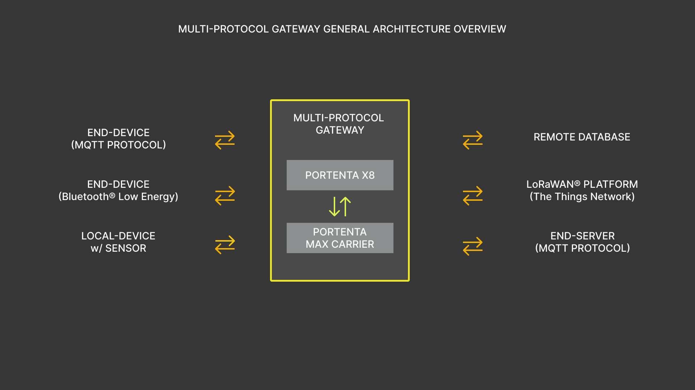
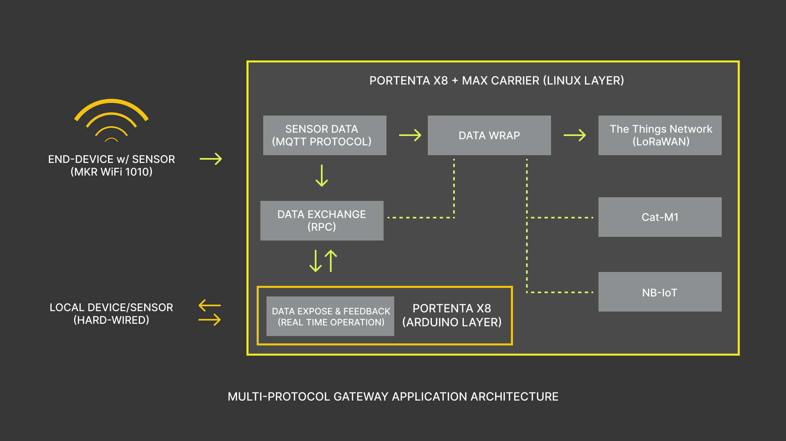
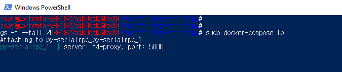
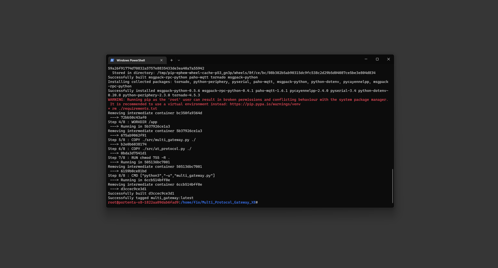
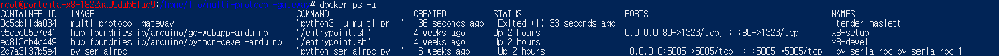

## Overview

Portenta X8 has the NXP® i.MX 8M Mini MPU (Linux) and STM32H747XI dual Cortex®-M7+M4 32bit low power ARM® MCU (Arduino) stacked together and can be used to design different work loads for these two different microprocessors. We will use the Portenta Max Carrier to lend its onboard the CMWX1ZZABZ-078 LoRaWAN® module from Murata®, and WiFi connectivity from Portenta X8 to build a Multi-Protocol Gateway.

In this tutorial we will go through the steps on how to setup both Linux and Arduino side. A device collecting sensor data will transfer the data via WiFi Connectivity, receive the data and exchange between Arduino and Linux layers to use the LoRaWAN to finally send the information to The Things Network. We will also configure and expose local communication lane to further expand its capability if a local sensor is desired. 

## Goals

- Build a Arduino layer script using RPC to handle bi-directional sensor readings or data traffic on Portenta X8.
- Build a multi-protocol script to manage WiFi and LoRa connectivity to handle data traffic on Linux layer of Portenta X8.
- Assemble both layer scripts to build an operational multi-protocol gateway using Portenta X8 and Max Carrier.

### Required Hardware and Software

- [Arduino Portenta X8](https://store.arduino.cc/products/portenta-x8)
- [Arduino Portenta Max Carrier](https://docs.arduino.cc/hardware/portenta-max-carrier)
- USB-C cable (either USB-C to USB-A or USB-C to USB-C)
- Wi-Fi Access Point with Internet Access
- 868-915 MHz antenna with SMA connector
- ADB or SSH. [Check how to connect to your Portenta X8](docs.arduino.cc/tutorials/portenta-x8/out-of-the-box#controlling-portenta-x8-through-the-terminal)

## Multi-Protocol Gateway 101

A gateway is a network node and a key-point for data exchange between different netoworks under certain given specification. Simply referred as a hardware that relies between two networks. On the other hand, a **multi-protocol gateway** goes one step further by implementing variety of protocols in a single gateway. 

The idea of **Multi-Protocol Gateway** is to build a device that will establish a information relay, that handles incoming and outgoing traffic of data using different connectivity protocols.

This means that the gateway can receive the data transmitted in certain protocol type and relay the data in a different protocol for a remote server. Such capability provides the ability to develop on distinctive types of protocols and relay the data with less complexity involving in one's end. 

The Portenta X8 paired to Portenta Max Carrier has the potential to create synergy, and you will have following connectivity tools at disposal:

- WiFi (MQTT Protocol)
- Bluetooth Low Energy
- LoRaWAN (The Things Network)
- NB-IoT & Cat-M1

Following illustrates how a overall multi-protocol gateway works with Portenta X8 and Max Carrier as the gateway system.



Bear in mind, that this present tutorial emphasizes on making a multi-protocol gateway using previous connectivity modules. Yet, this Portenta combination still has much to offer. To get the most out of this Portenta configuration, we will go step by step on establishing the multi-protocol gateway and add scalability to expand its capability. 

Foremost, you will get to know how the multi-protocol gateway will be implemented in Portenta X8 paired with Max Carrier. Few of the tutorials will be referenced to guide you through the present tutorial, as it involves mechanisms that are extensive to cover in this tutorial.

## Arduino Layer

The Arduino layer is extended within the M4 Core and the layer to go on development with if real time operations requires to be addressed. Thus, you can use the Arduino Layer to perform PID tasks and make the RPC calls to exchange the data with the Linux layer. 

***To learn about how to exchange data using RPC between Arduino and Linux layer, please read ["Data Exchange Between Python on Linux and an Arduino Sketch"](https://docs.arduino.cc/tutorials/portenta-x8/python-arduino-data-exchange)***

In this tutorial, you will learn how to use the RPC to expose the data received at the Linux layer on Arduino layer if further development requirement requires to feed the data at devices interfaced communicating with M4 core. We will leave the tasks running and open to be interfaced for expanding the capability of the Portenta X8 and Max Carrier.

To showcase the ability of the Arduino layer extended by M4 Core, we will explore two scenarios as example: 
1. A scenario where the Arduino layer will be the terminal to expose the received sensor data to a local end-device to be controlled. 
2. While other scenario has a local end-device that transfers data to Linux layer for further networking process.

Hence the multi-protocol architecture will process and manage the data traffic in desired protocol with given case.  

## Linux Layer

It is important to understand that **all networking process is made within the Linux layer**. All the network processes that are WiFi, Bluetooth low energy, LoRa, NB-IoT, and Cat-M1. In this tutorial we will focus on using WiFi with MQTT protocol, and LoRa connectivities to establish a multiple protocol gateway.

The Portenta X8 provides WiFi connectivity and the Portenta Max Carrier provides LoRaWAN module that can help us communicate with The Things Network. We will use the MQTT protocol to receive the sensor data transmitted by an end device. 

Thus, we will use a python script that will configure and handle the connectivity modules and its sensor data. The RPC calls will make to expose the received sensor data to Arduino layer to set up data exchange configuration to further expand the capability of the Portenta X8 and Max Carrier. The process can also be done vice-versa if the Arduino layer is to transmit the data to Linux layer fed from the local end-device. 

Now that we know the roles of Arduino and Linux layer, we will need a clear detail of how the multi-protocol gateway should look like in our tutorial. The next diagram illustrates the in-depth multi-protocol gateway architecture, showing how each layer and modules will cooperate.



## Hardware Setup 

First things first, we will need to configure the hardware to be able to develop and work on Multi-Protocol gateway. We will attach the Portenta X8 to Portenta Max Carrier via High-Density Connectors, and we will make sure to attach an antenna for LoRa connectvity. The Portenta X8 should also need to have the WiFi antenna attached to it. 


***If you have not set up the Portenta X8, please have a look at [Portenta X8 Getting Started](https://docs.arduino.cc/tutorials/portenta-x8/out-of-the-box) tutorial.***

## Pre-Requisites

### For Portenta X8

Before we begin diving deep into creating Multi-protocol gateway, and having understood we will frequently communicate between Arduino and Linux layer, we will have to know how to debug and observe the way these 2 layers interact. 

The `m4-proxy` is a service that manages data exchange between these layers. You can use the following command in the terminal to observe if the service is running correctly.

```
sudo journalctl -fu m4-proxy
```
We are going to implement RPC (Remote Procedure Call) to establish communication between Arduino and Linux layer. This is a communication mechanism implemented to exchange data between these two layers. 

A very important note to take it into account: **you will not be able to check messages via `Serial.println()` statements** to check if the Arduino sketch is running in a desired manner. You will have to use **`py-serialrpc`**, which is a service that will assist you in listening to those messages to print them on a console. To have the service active, please download [this compressed file](assets/py-serialrpc.zip) to build and run the container at Linux side of Portenta X8. Please execute following commands in order to have the service running.

```
// Copy the decompressed files in ../adb/32.0.0 
adb push py-serialrpc /home/fio
adb shell

// The password is: fio
sudo su -

// Head to directory and mount the container
cd /home/fio/py-serialrpc
#py-serialrpc sudo docker build. -t py-serialrpc 
#py-serialrpc sudo docker-compose up -d
```

To access the logs of `py-serialrpc` service, while maintaining at same directory, execute the following command.

```
sudo docker-compose logs -f --tail 20
```

You will be able to in the terminal as following image.



***For more detail about how data exchange between Arduino and Linux layer works and to understand how to debug, please read [Data Exchange Between Python on Linux and an Arduino Sketch](https://docs.arduino.cc/tutorials/portenta-x8/python-arduino-data-exchange)***

In case you have not configured internal WiFi connectivity within the system, please use following command line.

```
nmcli device wifi connect "SSID" password "PASSWORD"
```

### For The Things Network

We have the pre-requisites for the Portenta X8 ready, but as we are using the LoRa connectivity, we will need a platform that has the capability to receive data transmitted from the Portenta X8 and Max Carrier. **The Things Network** will be the platform we are going to use communicate using LoRaWAN. In the platform, we will need to create an application to add the Portenta Max Carrier as an End-Device. 

When adding the End-Device, at the moment we will have to use the **Manual** option. The Portenta Max Carrier will be added under Arduino SA in near future update to be included in the LoRaWAN Device Repository. The LoRaWAN version and parameters compatible with the Portenta MAx Carrier are as follows. The frequency plan will depend on the region you are going install the device. 


***To learn more about LoRa and LoRaWAN, please have a look at our [Arduino Guide to LoRa® and LoRaWAN®](https://docs.arduino.cc/learn/communication/lorawan-101). Additionally, if you wish to learn on how to properly setup the End-Device in The Things Network, please read [this tutorial](https://docs.arduino.cc/tutorials/mkr-wan-1310/the-things-network) reference***

Let us now dive into developing a multi-protocol gateway using Portenta X8 and Max Carrier!

## Building Multi-Protocol Gateway

Everything sounds beautiful, but now it is important to land all the requirements into a operational task that will orchestrate every protocols we are going to use. We will create the following files and the required codes for multi-protocol gateway. 

We will need the Docker files that will configure and let us build a working container.

***If you are unfamiliar handling with Docker and containers, please read the tutorial on [Create and Upload a Custom Container to the Portenta X8](https://docs.arduino.cc/tutorials/portenta-x8/custom-container)***

You can access the files [here](assets/multi-protocol-gateway.zip) to have the files ready. Meanwhile, let me help you understand some of the important details of the included files. 

### Docker Compose

Beginning with the `docker-compose.yml` file. Which is where we define permissions and settings for the container involved. 

```
...
extra_hosts:
  - "m4-proxy:host-gateway"
devices:
  - /dev/ttymxc3
tty: true
user: "0"
```

### Requirements

Here we will define which additional components are required to be able to run the script built inside the container. 

```
msgpack-rpc-python
pyserial==3.4
certifi
paho-mqtt
...
```

### Multi-Protocol Script

This is the main Python script that will handle overall networking process. We will highlight important fragments of the code to help you understand how these codes pieces together to build a gateway based on multiple protocol. 

First up, is the configuration for M4 Proxy Server, which is the parameter to handle communication with M4 core that extend the Arduino layer. The `m4_proxy_port` is configured to 5001, as it is the port used by clients to send the data to M4. 

```
#M4 Proxy Server Configuration
# Fixed configuration parameters
port = 8884
publish_interval = 5

# The M4 Proxy address needs to be mapped via Docker's extra hosts
m4_proxy_address = 'm4-proxy'
m4_proxy_port = 5001
```

This function is dedicated to retrieve data from M4 (Arduino layer). It will help you set the variables, such as sensor data, to be pulled and be exposed at Linux layer. With this, you will have the information available to be used within the Python script. 

```
def get_data_from_m4():

    rpc_address = RpcAddress(m4_proxy_address, m4_proxy_port)

    data = ()

    try:
        rpc_client = RpcClient(rpc_address)
        temperature = rpc_client.call('temperature')

        rpc_client = RpcClient(rpc_address)
        humidity = rpc_client.call('humidity')

        data = temperature, humidity

    except RpcError.TimeoutError:
        print("Unable to retrieve data from the M4.")

    return data
```

These 3 parameters are required to establish connection with The Things Network. Given the code provided, the `DEV_EUI` will be predefined as the device will request and apply the EUI. On the other hand, if it requires to use different `DEV_EUI`, you can make the change in this section. `APP_EUI` and `APP_KEY` are required to be configured in this case, as they are provided from The Things Network for example or from the LoRaWAN platform that you may try establishing to. 

```
# Obtained during first registration of the device
SECRET_DEV_EUI = 'XXXXXXXXXXXXXXXX'
SECRET_APP_EUI = 'XXXXXXXXXXXXXXXX'
SECRET_APP_KEY = 'XXXXXXXXXXXXXXXXXXXXXXXXXXXXXXXX'
```

With these parameters configured, we have secured the connection between The Things Network. The Things Network would be our end-point where the sensor data are going to be sent over. And to send data, we need to begin by gathering this data, which can be from sensors or modules with status feedback. A sensor can be attached directly communicating via Arduino layer to receive the data, wrap it, and send it to The Things Network. On the other hand, we will need to have a mechanism that will be able to intercept data sent over WiFi connectivity using MQTT protocol. 

```
# WiFi - MQTT protocol handler
-> WIP
```

This will help to receive sensor data from any external device, for example using Arduino MKR WiFi 1010 with a sensor attached, using MQTT protocol. This capability will help to increase the scalability of the multi-protocol gateway. For this to work, we will also need sketch for Arduino layer that will help us expose and retrieve the data in between Arduino and Linux layer. 

```
# Arduino side sketch
#include <RPC.h>
#include <SerialRPC.h>
-> WIP
```

The sketch above will help to expose and transfer the data that is processed within the Linux side. By exposing, it means you will bring forth the data received within the Linux side to the Arduino side to feed the loca-device as a control input. It can be used to display the data if you wish to for instance. Transferring data to Linux side can be seen as a direct communication, as the sensor connected and monitored via Arduino side will send this data to send over LoRa connectivity. The sketch will have both options open to assist you on further extending the possibilities within. 

## Mounting the Multi-Protocol Gateway

It is now time to make the multi-protocol gateway run, and for this we will need to build the Docker container that will help us operate in the background on the Linux layer. Using the terminal, we will use the following commands to get the multi-protocol gatewya container up and running. 

You will need to have the files ready in a folder inside the `adb` directory within Arduino root.

```
C:\Users\#USERNAME#\AppData\Local\Arduino15\packages\arduino\tools\adb\32.0.0
```

Having the files ready at that directory, we will use the following commands to push the files the `fio` directory inside the Portenta X8. The second command will let us navigate inside Portenta X8.

```
adb push multi-protocol-gateway /home/fio
adb shell
```

We will now build the container using following commands. Following command will tag the container with `multi-protocol-gateway` name. 

```
cd ../home/fio/multi-protocol-gateway
#multi-protocol-gateway sudo docker build . -t multi-protocol-gateway
```

You will be able to see following results when it successfully built the image. 



***If you have created the Docker container previously and want to re-create with new changes made outside the shell, please check that the container and its build directory is stopped and removed. This is for the convenience of having clean working environment***

After a successful container build, we will have make the image run. To do that, we will use the following command. This command will immediately output in your terminal how the Python script is running. If you know or wish to have it run on the background, please add `-d` flag at the end of the command. 

```
#multi-protocol-gateway sudo docker-compose up
```

Finally, you will have the multi-protocol gateway running, in which it uses WiFi and LoRa connectivity, and RPC for exchanging data between its layers. However, there are cases where you wish to make changes by adding more functionalities, such as including Cat-M1 or NB-IoT to expand its communication spectrum, and for this you will need to stop the image. To stop the image from running, you can use following command.

```
#multi-protocol-gateway sudo docker-compose down
```

Getting to know status of the image is also crucial as it's the indicator of state of operation. Following command brings up **active** images and shows the status if the image restarted or stopped due to certain reasons. The second command lists built images, and it will show you the components that goes with main image that you're building. 

```
docker ps -a
docker images
```



With all this, you have built and a running multi-protocol gateway based on Portenta X8 and Max Carrier. You will be able to observer the data sent by the gateway with The Things Network platform at configured End-Device section under Applications.

## Conclusion

In this tutorial you have learned how to set up a Multi-Protocol Gateway composed of WiFi connectivity and LoRaWAN, by using the Portenta X8 and the Portenta Max Carrier. You have built the gateway in which it will connect the The Things Network to send the desired data. Also, the gateway is capable of exchanging data between Arduino and Linux layer using RPC, in which you have exposed the ports to be able to control a locally attached device or receive data from the local sensor to be sent directly to The Things Network. 

### Next Steps
- Now that you have established a multi-protocol gateway, using WiFi and LoRaWAN connectivity, expand the gateway's capability by adding other connectivity types such as Cat-M1 and NB-IoT
- Expand functionalities for data processing using RPC while using multi-protocol architecture. 

## Troubleshooting

You might encounter some errors or misbehaviors while working on the code, and preventing you from progressing on the development. You can try the following troubleshooting tips to solve the commonly known issues:

* If the sketch upload process fails, check if your Portenta X8 is in bootloader mode. To put the Portenta X8 into Bootloader mode, double-press its RESET button and verify that the green LED is waving. After this, you can try re-uploading the sketch for Arduino layer.
* Check the position of the BOOT DIP switch of the Portenta Max Carrier. If the Portenta X8 gets into bootloader mode immediately after power-on, including when connected via USB-C, change the position of the BOOT DIP switch to OFF. This case applies to Arduino layer.
* If you encounter an issue regarding terminal input inconvenience, please enter `export TERM=xterm` as the command in the terminal to get readable inputs. 
* In case internal WiFi connection cannot be established through the command input due "unavailable" SSID, although it is in range. Please try using different SSID if available or hotspot from a different device to host network connectivity.  