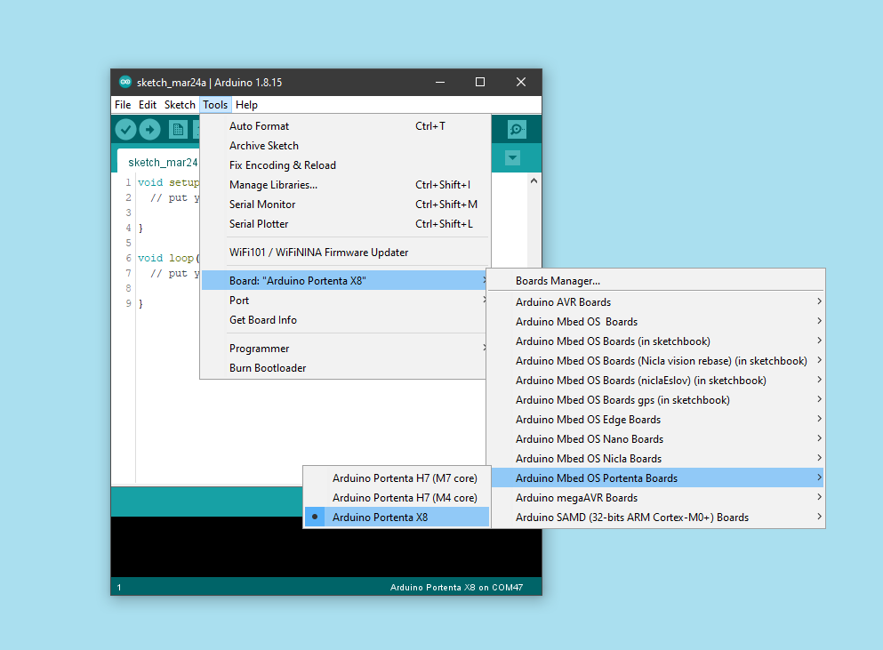

## Connecting to the board

Once the Portenta X8 its plugged via USB, you can open your browser and go to http://192.168.7.1 and see a web which is hosted by the board, from this dashboard you will be able to:

* [Configure Wi-Fi](#connecting-to-your-wi-fi)
* [Register the factory (OTA)](#registering-a-factory)
* Board details
* Shell

## Connecting to your Wi-Fi

Click the Wi-Fi button to start configuring your network connection.

Select your Wi-Fi SSID

Type the password

Once its connected you should see the Wi-Fi status button on green.

***You can change your network by clicking again on the button and repeat the steps***

## Registering a Factory

Click the "Register with Factory" button, and set your new factory name.

Click register, now you will get a code that you need to paste into your factory page by openning [Arduino Create Cloud](https://create.arduino.cc) in your browser and click inside the integrations section "Portenta X8 Board Manager

Once it succeed the factory button will turn to green.

## Controlling Portenta X8 through the terminal

You have plenty of ways to communicate with your board, we are going to show adb and ssh.

### ADB

First of all make sure you have the latest Mbed Portenta Core, which contains the adb program.
You can go to its directory inside the Arduino15/packages/arduino/tools/adb/32.0.0, to check the tool you can type on your terminal `adb` you should get feedback from the tool.

To know the list of devices that can be accessed type `adb devices`.

If you see only one you just can type `adb shell` if it succeed, you are now communicating to your Portenta X8.

### SSH

SSH is commonly used for remote control on a different kind of devices running different set ups through TCP-IP.

To communicate with your board, you will need to know the IP of it, and just type `ssh fio@<IP>`, then the terminal workaround should be the same as ADB.  

The password is `fio`.

As it is a linux device, you can do normal stuff like creating files, changing directory, etc.

To gain admin (root) access, type `sudo su -` and the password is `fio`  after that the terminal prefix should turn red.

### Inspecting real time tasks

Run: `journalctl -f` to see what's going on on the device

## Uploading an Arduino Sketch

Make sure you have the latest mbed Core and as every other board you can select the board inside the `mbed Portenta`.

And click compile and upload.

***Make sure you don't share GPIOs on the linux side and the Arduino sketc, this will avoid possible errors***