## Required Hardware and Software

* [Portenta X8](https://store.arduino.cc/products/portenta-x8) board.
* Wi-Fi AP with Internet access.

***Attention: We encourage you to check every now and then if the device image version is up to date in order to have the latest bootloader, please check the tutorial [How to flash your Portenta X8](https://docs.arduino.cc/tutorials/portenta-x8/image-flashing) for instructions.***

## Connecting to the Board

Once the Portenta X8 is plugged in via USB, you can open your browser and go to http://192.168.7.1 if you use Windows and Linux or http://192.168.8.1 on MacOS. It can take up to 15 seconds for the board to boot up and make the page available. This web page is hosted on the Portenta X8, from this dashboard you will be able to:

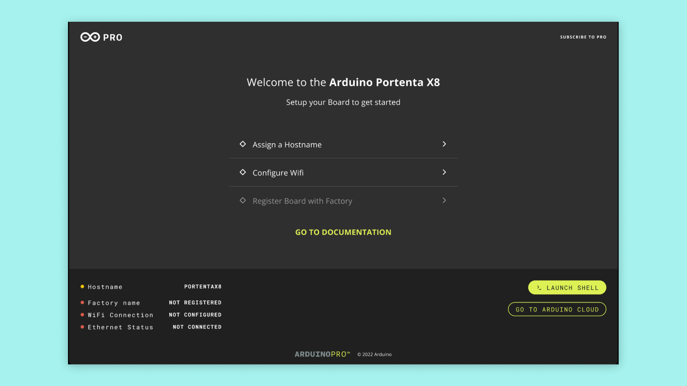

* [Configure Wi-Fi](#connecting-to-your-wi-fi)
* [Add your device to FoundriesFactory (OTA)](#add-a-new-device-to-your-factory)
* Board details
* Shell (alpine python)

## Connecting to Your Wi-Fi

Click the Wi-Fi button to start configuring your network connection.

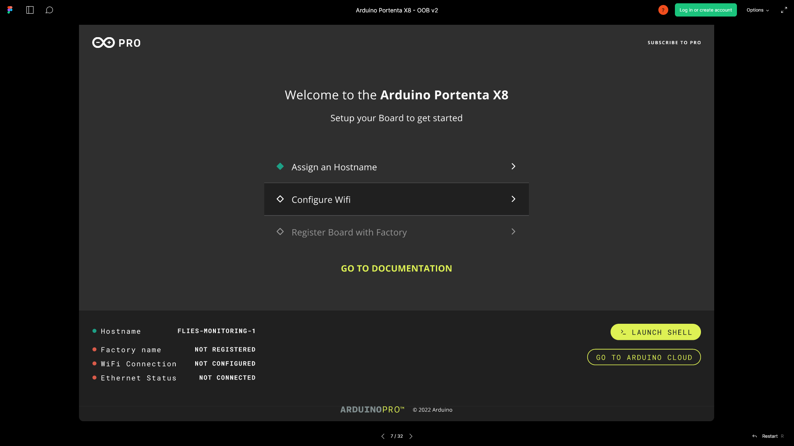

Select your Wi-Fi SSID.

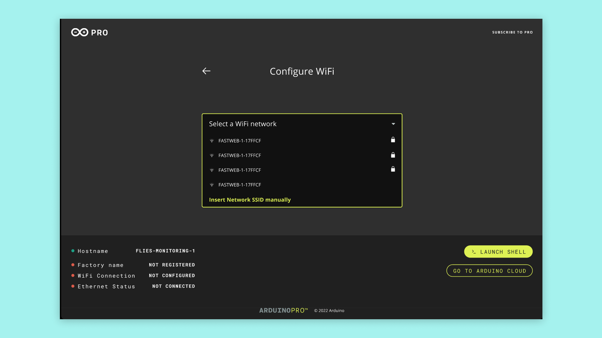

Type the password.

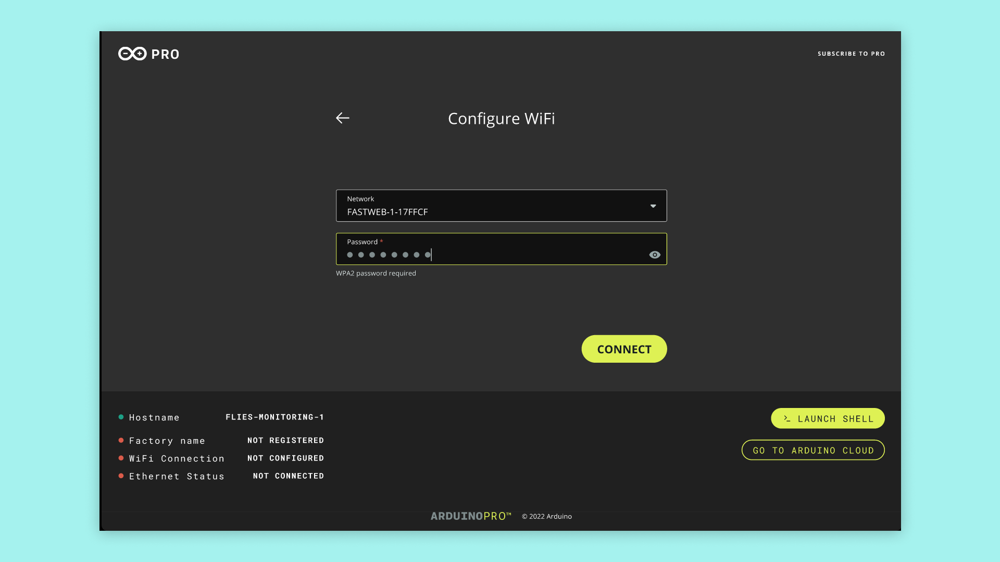

Once it is connected, you should see the Wi-Fi status bullet in the bottom left turning green.

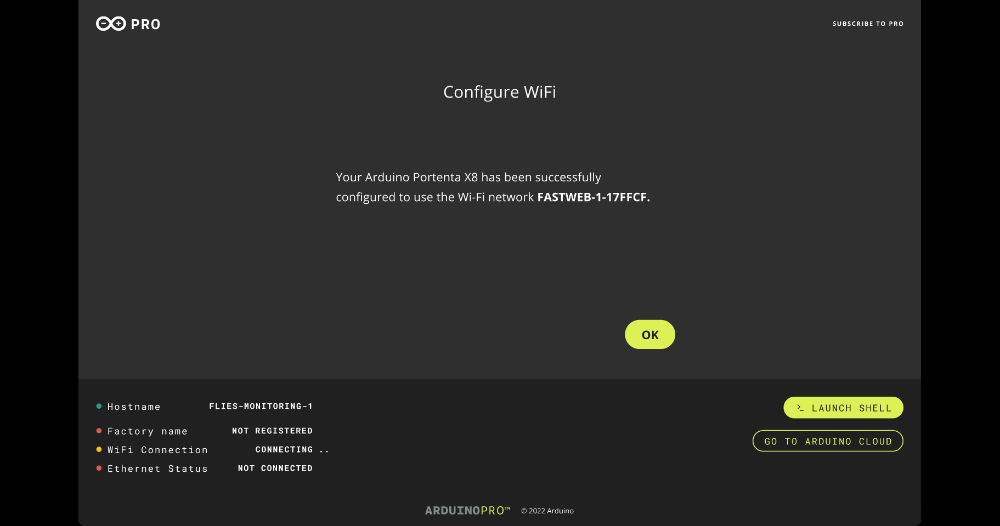

***You can change your network by clicking on the button again and repeat the above steps***

## Connect to FoundriesFactory

### Register a Factory on Foundries.io

***The integration with Foundries.io requires the Arduino Pro Cloud Subscription, subscribe at [Arduino PRO Cloud for Business](https://cloud.arduino.cc/plans), or learn more on the [Arduino Pro Page](https://www.arduino.cc/pro/hardware/product/portenta-x8#pro-cloud)***

Go to [https://create.arduino.cc](https://create.arduino.cc) and click on Portenta X8 Board Manager, you will get prompted to set a new `Factory` name if you did not have one before. You will not be able to be change the name later, so use one that you can remember and write easily.

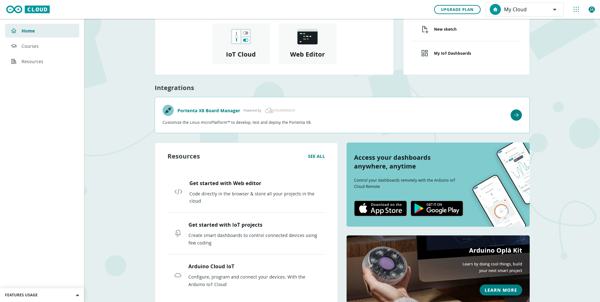

It will redirect you to the Foundries Factory registration page.

Then you can go to [https://app.foundries.io/factories](https://app.foundries.io/factories) and it will show the Factory you just created.

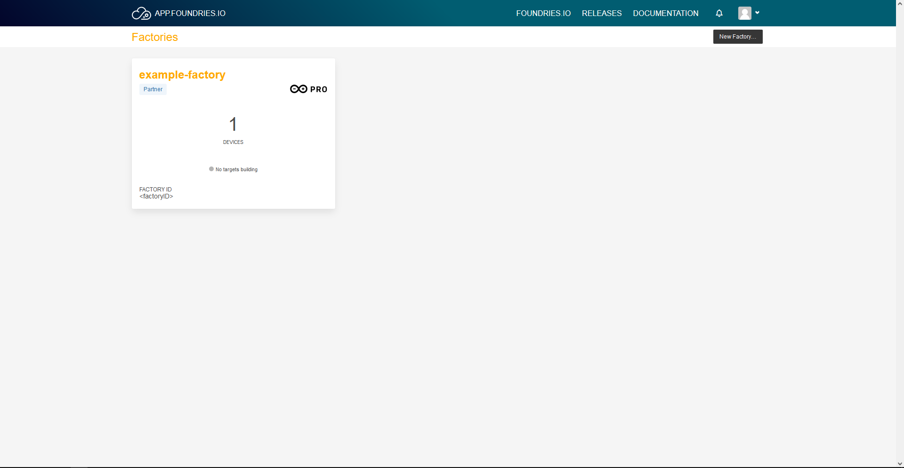

After you have created your FoundriesFactory you need to go back to the Portenta-X8 web dashboard to add a new device into your new Factory.

### Add A New Device To Your Factory

Click the "Register Factory name" button.

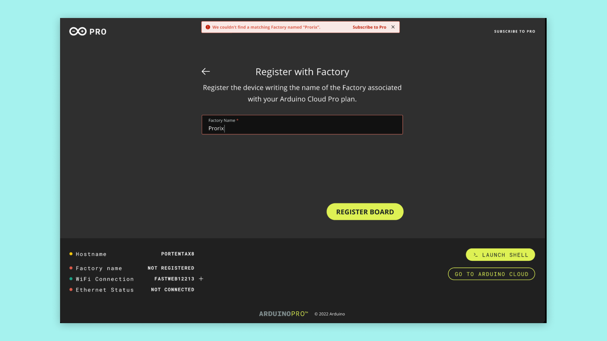

The next panel gives you a code that you need to copy.

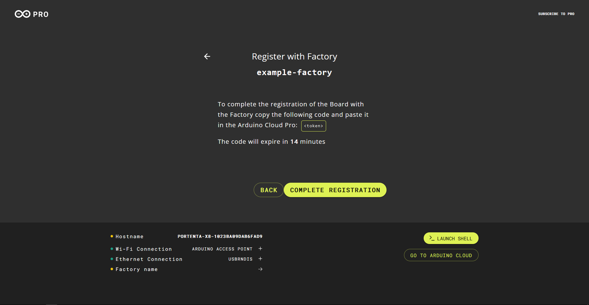

Click on the "Complete registration" button on the Portenta X8 dashboard

The button will open the Foundries.io activation page. Paste your token in the text box and press continue.

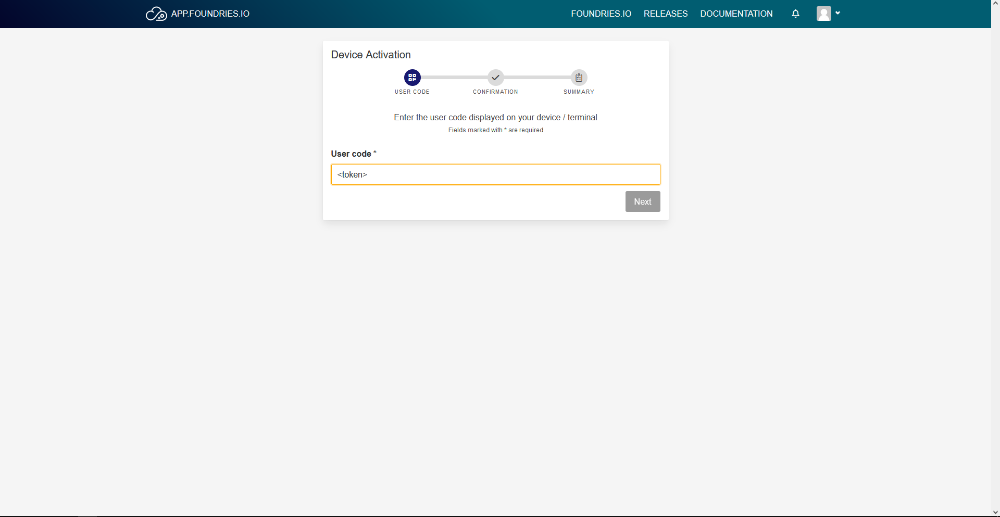

Confirm the addition of the new device by pressing "Connect"

Finally you will see a confirmation which means that your device now is attached to the new Factory.

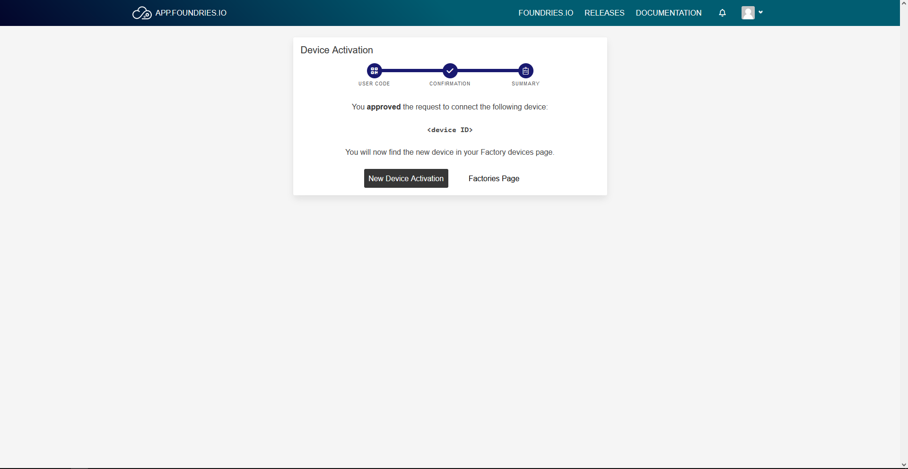

Once it is completed, the Factory button on the Portenta X8 dashboard will turn green.

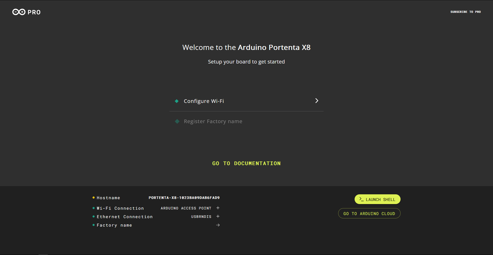

#### Check Your Foundries Factory

Have a look to your factories by going to [Foundries.io factories page](https://app.foundries.io/factories)

Select the Factory that you want to check and it will open its dashboard.

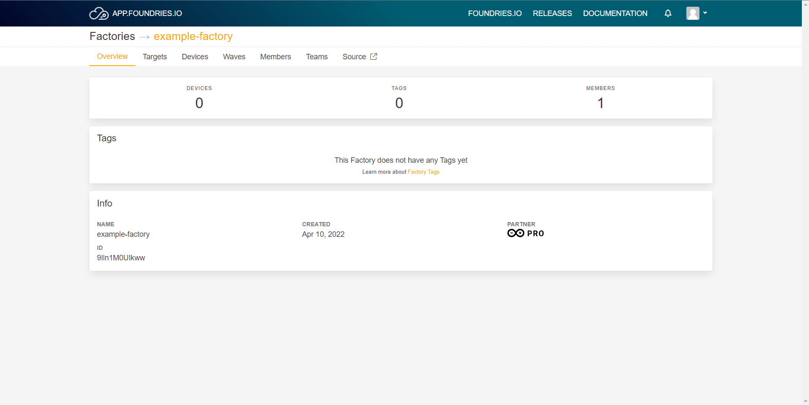

#### Check Your Device

You can check if your device is fully connected to your Factory by going to the "devices" tab.

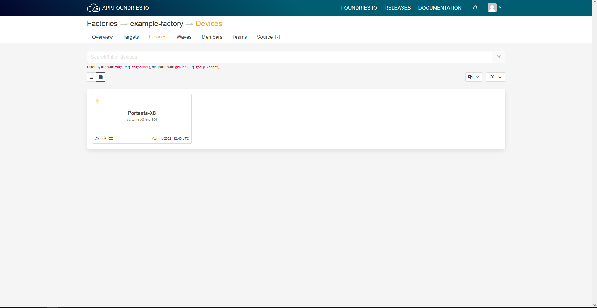

Then choose the device you want to check by clicking on its box and it will open its page.

## Controlling Portenta X8 Through the Terminal

You have plenty of ways to communicate with your board, be it wirelessly or with a cable. Next we are going to show how to use adb and ssh.

### ADB

First of all make sure you have the latest **Mbed OS Portenta Core**, which contains the adb program.

You can go to its directory inside the **Arduino15/packages/arduino/tools/adb/32.0.0**. To check the tool you can use your terminal and type `adb`, you should get feedback from the tool when typing this.

To know the list of devices that can be accessed type `adb devices`.

If you only see one device you can try and type `adb shell`, you are now communicating with your Portenta X8.

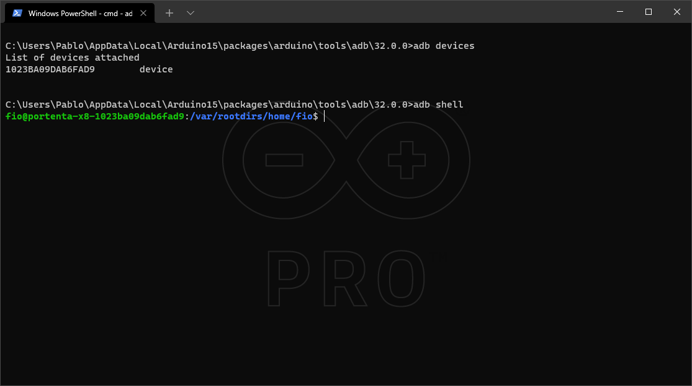

### SSH

SSH is commonly used for remote control on different kinds of devices running different set ups through TCP-IP.

To communicate with your board, you will need to know the IP of it, and just type `ssh fio@<IP>`, then the terminal workaround should be the same as ADB. The password is `fio`.

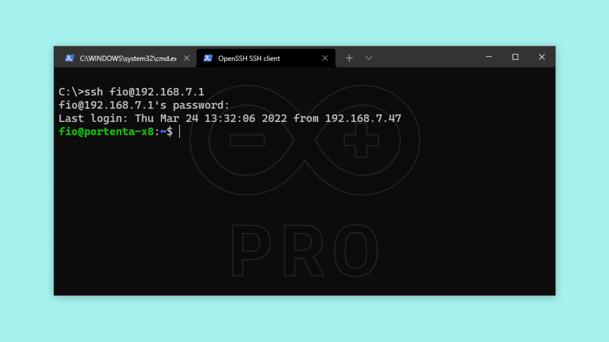

As it is a linux device, you can do normal stuff like creating files, changing directory, etc.

To gain admin (root) access, type `sudo su -` and the password is `fio`  after that the terminal prefix should turn red.

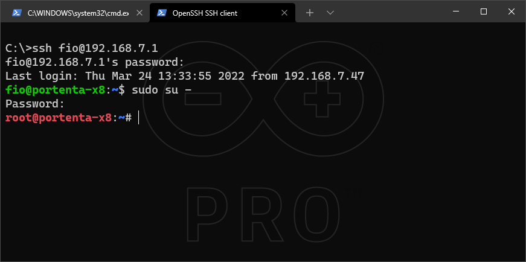

### CLI Commands

### Connect to a Wi-Fi Access Point

Using the network manager tool `nmcli`:

`nmcli device wifi connect <SSID> password <PASSWORD>`

To check your manager connection status, use this command:

`nmcli de`

### Register Device to the Foundries Factory

***The integration with Foundries.io requires the Arduino Pro Cloud Subscription, subscribe at [Arduino PRO Cloud for Business](https://cloud.arduino.cc/plans), or learn more on the [Arduino Pro Page](https://www.arduino.cc/pro/hardware/product/portenta-x8#pro-cloud)***

Make sure the name is not already being used in your Factory.

`lmp-device-register -n <newDeviceName>`

**Not recommended:** In case you cannot register the new device, you can erase the current device info by stopping the OTA services and removing `/var/sota/sql.db`. After these commands, you can register the device again.

`sudo systemctl stop aktualizr-lite`
`sudo systemctl stop fioconfig.path`
`sudo systemctl stop fioconfig.service`
`sudo rm /var/sota/sql.db`

### Inspecting Real Time Tasks

Run: `journalctl -f` to see what's going on on the device

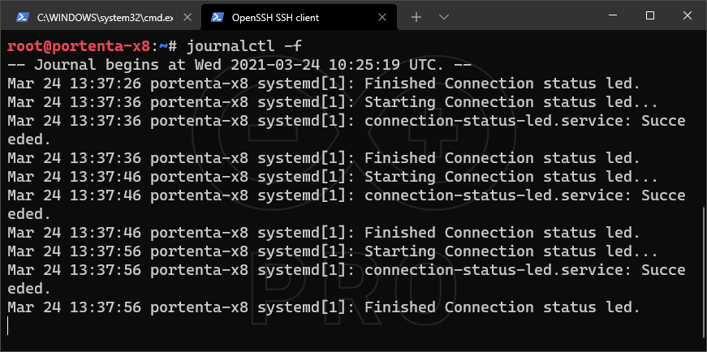
