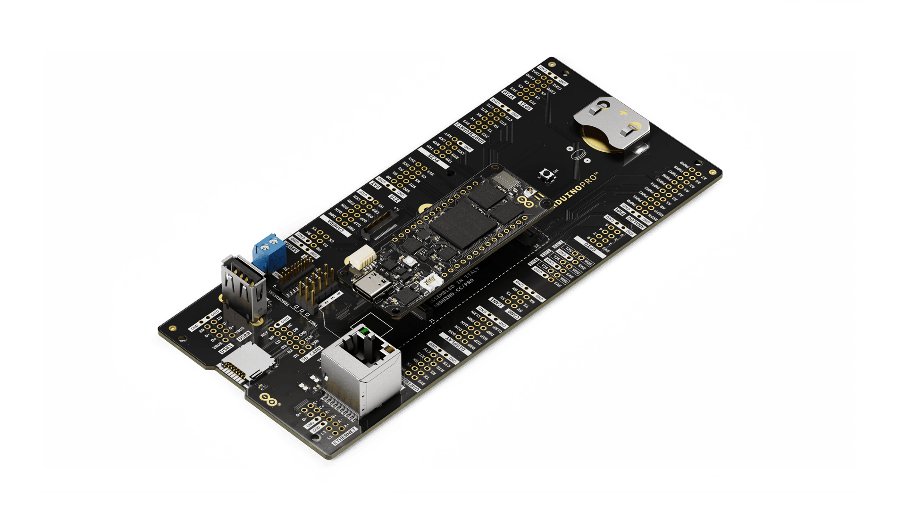

# Description 
The Arduino® Portenta Breakout board is designed to assist developers with their prototypes by exposing the high-density connectors of the Portenta family on both sides of the breakout carrier, providing total flexibility for measuring and controlling signals - developing your own hardware, testing the design and measuring the input and output signals out of the high-density connectors. 

# Target areas:
Prototyping

# Features
* Power ON Button
* Boot mode DIP switch
* Connectors
  *   USBA 
  *   RJ45 Ethernet up to 1Gb/s; speed depending on installed board
  *   Micro SD card
  <!-- *   OpenMV shutter module -->
  *   MIPI 20T JTAG with trace capability
* Power
  *   CR2032 RTC Lithium Battery backup
  *   External power terminal block
* I/O
  *   Break out all Portenta high-density connector signals (see pinout table below)
  *   Male/female HD connectors
  allow interposing breakout between Portenta and shield to debug signals
* Compatibility
  Standard Portenta high-density connector pinout
* Safety information
  Class A

# Contents
## The Board
### Application Examples
This product is designed to work alongside the Portenta family. Please check the Getting Started guide of your Portenta board.

**Product Development:** The Portenta Breakout board reduces development time for industrial-grade solution automation based on the Portenta line.

<!-- **OpenMV:** Connectivity to the OpenMV Global Shutter Camera Module is provided on the Portenta Breakout board allowing for rapid development of machine vision applications alongside the Portenta family. -->

**Technical Education:** The Portenta Breakout board can act as a first point of entry for technician education in industrial-grade control and embedded systems.

### Accessories (Not Included)
*   8-, 10-, 12- and 22-pin headers/connectors with 2.54 mm pitch
*   20 pin JTAG programmer
<!-- *   OpenMV Global Shutter Camera Module -->
<!-- *   M2x3 screws for attaching the OpenMV Global Shutter Camera Module -->

### Related Products
*   Arduino Portenta H7 (SKU: ABX00042)
*   Arduino Portenta H7 Lite (SKU: ABX00045)
*   Arduino Portenta H7 Lite Connected (SKU: ABX00046)
*   Arduino Portenta X8 (SKU: ABX00049)
<!-- *   OpenMV Global Shutter Camera Module -->

### Solution Overview

<!-- [Example of a typical installation for a solution including Portenta H7 and Global Shutter Camera Module. A Portenta board must be connected for operation of the Portenta Breakout Board.](assets/breakoutCarrierAssembly.jpg) -->

Example of a typical installation for a solution including Portenta H7. A Portenta board must be connected for operation of the Portenta Breakout Board.

## Ratings
### Absolute Maximum Ratings
| Symbol |             Description             | Min  | Typ  | Max  | Unit |
| :----: | :---------------------------------: | :--: | :--: | :--: | ---- |
|  TMax  |        Maximum thermal limit        | -40  |  20  |  85  | °C   |
| 5VMax  | Maximum input voltage from 5V input | 4.0  |  5   | 5.5  | V    |
|  PMax  |      Maximum Power Consumption      |  -   |  -   | 5000 | mW   |

### Recommended Operating Conditions
| Symbol |         Description         | Min  | Typ  | Max  | Unit |
| :----: | :-------------------------: | :--: | :--: | :--: | :--: |
|   T    | Conservative thermal limits | -15  |  20  |  60  |  °C  |
|   5V   | Input voltage from 5V input | 4.8  |  5   | 5.2  |  V   |

## Functional Overview
### Board Topology 
Front view

| **Ref.** |                 **Description**                  | **Ref.** |       **Description**       |
| :------: | :----------------------------------------------: | :------: | :-------------------------: |
|    J1    | DF40HC(3.5)-80DS-0.4V(51) High Density connector |    J5    |        Micro SD card        |
|    J2    | DF40HC(3.5)-80DS-0.4V(51) High Density connector |    J6    | 20 mm coin battery retainer |
|    J3    |               USB type A connector               |    J7    |      Ethernet adaptor       |
|    J4    |               <!--OpenMV-->Cam connector               |    J8    |    Power terminal block     |
|   SW1    |               Boot mode selection                |   PB1    |       Power ON button       |
|    U1    |               USBA power switch IC               |          |                             |

Back view

| **Ref.** |              **Description**               | **Ref.** |              **Description**               |
| :------: | :----------------------------------------: | :------: | :----------------------------------------: |
|   J15    | DF40C-80DP-0.4V(51) High Density connector |   J16    | DF40C-80DP-0.4V(51) High Density connector |

<!--
Shared pins table
Some nets/pins are electrically shared in the board and precaution must be taken to avoid conflicts. The full list is presented below.

|  **NET**  | **Description** | **Bus1**  |         **Bus2**          |
| :-------: | :-------------: | :-------: | :-----------------------: |
| I2C2_SCL  |   I2C/OPENMV    | I2C2 SCL  |      OPENMV_CAM_SCL       |
| I2C2_SDA  |   I2C/OPENMV    | I2C2 SDA  |      OPENMV_CAM_SDA       |
|  SPI1_CK  |   I2C/OPENMV    |  SPI1 CK  |      OPENMV_CAM_SCK       |
| SPI1_MISO |   I2C/OPENMV    | SPI1 MISO |      OPENMV_CAM_MISO      |
| SPI1_MOSI |   I2C/OPENMV    | SPI1 MOSI |      OPENMV_CAM_MOSI      |
|  SPI1_CS  |   I2C/OPENMV    |  SPI1 CS  |       OPENMV_CAM_CS       |
|  GPIO_0   |   GPIO/OPENMV    |  GPIO 0   |      OPENMV_CAM_RST       |
|  GPIO_1   |   GPIO/OPENMV    |  GPIO 1   |      OPENMV_CAM_FSIN      | 
|  GPIO_2   |    GPIO/USBA    |  GPIO 2   |  USBA VBUS FLAG (jumper)  |
|  GPIO_3   |   GPIO/OPENMV    |  GPIO 3   |      OPENMV_CAM_PWDN      |
|  GPIO_4   |    GPIO/JTAG    |  GPIO 4   |   TRACEDATA_0 (jumper)    |
|  GPIO_5   |    GPIO/USBA    |  GPIO 5   | USBA VBUS ENABLE (jumper) |
|   PWM0    |   PWM/OPENMV |   PWM 0   |      OPENMV_CAM_CLK       |
|  PDM_CK   |    PDM/JTAG     |  PDM CK   |   TRACEDATACLK (jumper)   |
| UART2_TX  |    UART/JTAG    | UART2 TX  |     TRACEDATA1 (JTAG)     |
-->

### DIP Switch
The DIP switch allows for boot mode configuration:
*   **BOOT SEL**: When set to ON, keeps the Portenta in Boot mode.
*   **BOOT**: When set to ON enables the embedded bootloader. Firmware can be uploaded via the USB port on the breakout board (DFU). USB-A to USB-A  (non-crossover) cable required. The Portenta H7 has to be powered through the USB-C® connector or VIN.

### RJ-45 Connector
The RJ-45 Connector allows to plug in an ethernet cable and connect to your network.

By default it is compatible with the **Arduino Portenta H7** as the jumper pads are joint with copper.

To **allow** compatibility with the **Arduino Portenta X8** it is needed to cut 2 jumper pads, located on top of the the RJ-45 Connector, below the SD holder, on the left side of the Carrier as shown in the following picture.

## Board Operation
**Note:** This board is intended to operate together with Portenta H7 (see section 1.4 Solution Overview).

### Getting Started - IDE
If you want to program your Portenta H7 with the Breakout Board while offline you need to install the Arduino Desktop IDE **[1]**. To connect your Portenta H7 with the Portenta Breakout Board to your computer, you will need a Type-C USB cable. This also provides power to both the Portenta H7 as well as the Portenta Breakout Board. Alternatively, in order to provide power to the USB connectors and the 5V pins, a 5V source must be applied to J8. This will also provide power to the Portenta H7.

### Getting Started - Arduino Web Editor
All Arduino boards, including this one, work out-of-the-box on the Arduino Web Editor **[2]**, by just installing a simple plugin.

The Arduino Web Editor is hosted online, therefore it will always be up-to-date with the latest features and support for all boards. Follow **[3]** to start coding on the browser and upload your sketches onto your board.

### Getting Started - Arduino Cloud
All Arduino IoT-enabled products are supported on Arduino Cloud which allows you to log, graph and analyze sensor data, trigger events, and automate your home or business.

### Sample Sketches
Sample sketches can be found either in the “Examples” menu in the Arduino IDE or in the “Documentation” section of the Arduino Pro website **[4]**

### Online Resources
Now that you have gone through the basics of what you can do with the board you can explore the endless possibilities it provides by checking exciting projects on ProjectHub **[5]**, the Arduino Library Reference **[6]** and the online store **[7]** where you will be able to complement your board with sensors, actuators and more

### Board Recovery
In case a sketch locks up the processor and the board is not reachable anymore via USB it is possible to enter bootloader mode by double-tapping the reset button right after powering it up.

## Connector Pinouts
The Portenta Breakout Board provides easy access to the pins on the high-density connector of the Portenta family. The Portenta Breakout Board is shipped in a headerless configuration to provide flexibility in using 2.54mm compatible connectors to meet their specific application.

In cases where multiple channels are on a single header, the first channel is on the bottom part of the header and the section channel is on the top part of the header. The order of the channel is determined by the silkscreen markings.

### GPIO
| Pin  | **Function** | **Type** | **Description**  |
| :--: | :----------: | :------: | :--------------: |
|  1   |     3V3      |  Power   | +3.3V power rail |
|  2   |    GPIO 0    | Digital  |      GPIO 0      |
|  3   |    GPIO 1    | Digital  |      GPIO 1      |
|  4   |    GPIO 2    | Digital  |      GPIO 2      |
|  5   |    GPIO 3    | Digital  |      GPIO 3      |
|  6   |    GPIO 4    | Digital  |      GPIO 4      |
|  7   |    GPIO 5    | Digital  |      GPIO 5      |
|  8   |    GPIO 6    | Digital  |      GPIO 6      |
|  9   |     GND      |  Power   |      Ground      |
|  10  |     GND      |  Power   |      Ground      |

### I2C
| Pin  | **Function** | **Type** |   **Description**   |
| :--: | :----------: | :------: | :-----------------: |
|  1   |     3V3      |  Power   |  +3.3V power rail   |
|  2   |     GND      |  Power   |       Ground        |
|  3   |     SDA1     | Digital  | Serial Data Line 1  |
|  4   |     SCL1     | Digital  | Serial Clock Line 1 |
|  5   |     3v3      |  Power   |  +3.3V power rail   |
|  6   |     GND      |  Power   |       Ground        |
|  7   |     SDA0     | Digital  | Serial Data Line 0  |
|  8   |     SCL0     | Digital  | Serial Clock Line 0 |
|  9   |     3V3      |  Power   |  +3.3V power rail   |
|  10  |     GND      |  Power   |       Ground        |
|  11  |     SDA2     | Digital  | Serial Data Line 2  |
|  12  |     SCL2     | Digital  | Serial Clock Line 2 |

### CAN0/CAN1
Pins closer to the edge of the board are CAN0. Pins close to the center are CAN1.
**Please Note**
When used with Arduino Portenta H7, only CAN1 is available.

| Pin  | **Function** |   **Type**   |      **Description**      |
| :--: | :----------: | :----------: | :-----------------------: |
|  1   |      5V      |    Power     |     +5.0V power rail      |
|  2   |      TX      | Differential | CAN Bus Transmission Line |
|  3   |      RX      | Differential |   CAN Bus Receive Line    |
|  4   |     GND      |    Power     |          Ground           |

### ANALOG/PWM
| Pin  | **Function** | **Type** |      **Description**      |
| :--: | :----------: | :------: | :-----------------------: |
|  1   |      A0      |  Analog  |      Analog Input 0       |
|  2   |      A1      |  Analog  |      Analog Input 1       |
|  3   |      A2      |  Analog  |      Analog Input 2       |
|  4   |      A3      |  Analog  |      Analog Input 3       |
|  5   |      A4      |  Analog  |      Analog Input 4       |
|  6   |      A5      |  Analog  |      Analog Input 5       |
|  7   |      A6      |  Analog  |      Analog Input 6       |
|  8   |      A7      |  Analog  |      Analog Input 7       |
|  9   |     REFP     |  Analog  | Analog Reference Positive |
|  10  |     REFN     |  Analog  | Analog Reference Negative |
|  11  |     GND      |  Analog  |          Ground           |
|  1   |     PWM0     | Digital  |       PWM output 0        |
|  2   |     PWM1     | Digital  |       PWM output 1        |
|  3   |     PWM2     | Digital  |       PWM output 2        |
|  4   |     PWM3     | Digital  |       PWM output 3        |
|  5   |     PWM4     | Digital  |       PWM output 4        |
|  6   |     PWM5     | Digital  |       PWM output 5        |
|  7   |     PWM6     | Digital  |       PWM output 6        |
|  8   |     PWM7     | Digital  |       PWM output 7        |
|  9   |     PWM8     | Digital  |       PWM output 8        |
|  10  |     PWM9     | Digital  |       PWM output 9        |
|  11  |     GND      | Digital  |          Ground           |

### Display
| Pin  | **Function** |   **Type**   |            **Description**            |
| :--: | :----------: | :----------: | :-----------------------------------: |
|  1   |     D3P      | Differential | Differential DSI Data Line 3 Positive |
|  2   |     D2P      | Differential | Differential DSI Data Line 2 Positive |
|  3   |     D1P      | Differential | Differential DSI Data Line 1 Positive |
|  4   |     D0P      | Differential | Differential DSI Data Line 0 Positive |
|  5   |     CLKP     | Differential |    Differential DSI Clock Positive    |
|  6   |     GND      |    Power     |                Ground                 |
|  7   |     D3N      | Differential | Differential DSI Data Line 3 Negative |
|  8   |     D2N      | Differential | Differential DSI Data Line 2 Negative |
|  9   |     D1N      | Differential | Differential DSI Data Line 1 Negative |
|  10  |     D0N      | Differential | Differential DSI Data Line 0 Negative |
|  11  |     CLKN     | Differential |    Differential DSI Clock Negative    |
|  12  |     GND      |    Power     |                Ground                 |

### UART1/UART0
Pins closer to the edge of the board are UART1. Pins closer to the center are UART0.

| Pin  | **Function** | **Type** |     **Description**      |
| :--: | :----------: | :------: | :----------------------: |
|  1   |     3V3      |  Power   |    +3.3 V power rail     |
|  2   |      TX      | Digital  | UART Transmission Signal |
|  3   |      RX      | Digital  |   UART Receive Signal    |
|  4   |     RTS      | Digital  |     Request to send      |
|  5   |     CTS      | Digital  |      Clear to send       |
|  6   |     GND      |  Power   |          Ground          |

### SPI1/SPI0
Pins closer to the edge of the board are SPI0. Pins closer to the center are SPI1.

| Pin  | **Function** | **Type** |    **Description**    |
| :--: | :----------: | :------: | :-------------------: |
|  1   |     3V3      |  Power   |   +3.3 V power rail   |
|  2   |      CS      | Digital  |      Chip Select      |
|  3   |      CK      | Digital  |     Serial Clock      |
|  4   |     MISO     | Digital  | Main In Secondary Out |
|  5   |     MOSI     | Digital  | Main Out Secondary In |
|  6   |     GND      |  Power   |        Ground         |

### PCIe
| Pin  | **Function** |   **Type**   |               **Description**                |
| :--: | :----------: | :----------: | :------------------------------------------: |
|  1   |     TXN      | Differential | Differential PCIe Transmission Line Negative |
|  2   |     RXN      | Differential |   Differential PCIe Receive Line Negative    |
|  3   |     CKN      | Differential |    Differential PCIe Clock Line Negative     |
|  4   |     GND      |    Power     |                    Ground                    |
|  1   |     TXP      | Differential | Differential PCIe Transmission Line Positive |
|  2   |     RXP      | Differential |   Differential PCIe Receive Line Positive    |
|  3   |     CKP      | Differential |    Differential PCIe Clock Line Positive     |
|  4   |     RST      |   Digital    |                 Reset Signal                 |

### UART3/UART2
Pins closer to the edge of the board are UART2. Pins closer to the center are UART3.

| Pin  | **Function** | **Type** |     **Description**      |
| :--: | :----------: | :------: | :----------------------: |
|  1   |     3V3      |  Power   |    +3.3 V power rail     |
|  2   |      TX      | Digital  | UART Transmission Signal |
|  3   |      RX      | Digital  |   UART Receive Signal    |
|  4   |     RTS      | Digital  |     Request to send      |
|  5   |     CTS      | Digital  |      Clear to send       |
|  6   |     GND      |  Power   |          Ground          |

### I2S/SAI
| Pin  | **Function** | **Type** |      **Description**      |
| :--: | :----------: | :------: | :-----------------------: |
|  1   |     3V3      |  Power   |     +3.3 V power rail     |
|  2   |      CK      | Digital  |         I2S Clock         |
|  3   |      WS      | Digital  |      I2S Word Select      |
|  4   |     SD1      | Digital  |     I2S Right Channel     |
|  5   |     SD0      | Digital  |     I2S Left Channel      |
|  6   |     GND      |  Power   |          Ground           |
|  1   |     3V3      |  Power   |     +3.3 V power rail     |
|  2   |     SCK      | Digital  |         SAI Clock         |
|  3   |      FS      | Digital  | SAI Frame Synchronization |
|  4   |      D0      | Digital  |      SAI Data Line 0      |
|  5   |      D1      | Digital  |      SAI Data Line 1      |
|  6   |     GND      |  Power   |          Ground           |

### CAMERA: DCMI/CSI
| Pin  | **Function** | **Type** |   **Description**    |
| :--: | :----------: | :------: | :------------------: |
|  1   |     GND      |  Power   |        Ground        |
|  2   |      HS      | Digital  |      DCMI HSYNC      |
|  3   |     CKN      |  Digita  |  DCMI_CLK / CSI CKN  |
|  4   |     CKP      | Digital  | DCMI VSYNC / CSI CKP |
|  5   |     D3N      | Digital  |  DCMI D6 / CSI D3P   |
|  6   |     D3P      | Digital  |  DCMI D7 / CSI D3P   |
|  7   |     D2N      | Digital  |  DCMI D4 / CSI D2N   |
|  8   |     D2P      | Digital  |  DCMI D5 / CSI D2P   |
|  9   |     D1N      | Digital  |  DCMI D2 / CSI D1N   |
|  10  |     D1P      | Digital  |  DCMI D3 / CSI D1P   |
|  11  |     D0N      | Digital  |  DCMI D0 / CSI D0N   |
|  12  |     D0P      | Digital  |  DCMI D1 / CSI D0P   |

### PDM/SPDIF
| Pin  | **Function** | **Type** |      **Description**      |
| :--: | :----------: | :------: | :-----------------------: |
|  1   |      CK      | Digital  |         PDM Clock         |
|  2   |      D0      | Digital  |      PDM Data Line 0      |
|  3   |      D1      | Digital  |      PDM Data Line 1      |
|  4   |     GND      |  Power   |          Ground           |
|  1   |      TX      | Digital  | SPDIF Transmission Signal |
|  2   |      RX      | Digital  |   SPDIF Receive Signal    |
|  3   |     GND      |  Power   |          Ground           |
|  4   |     GND      |  Power   |          Ground           |

### J8 Power IN
| Pin | **Function** | **Type** |                                                     **Description**                                                      |
| :-: | :----------: | :------: | :----------------------------------------------------------------------------------------------------------------------: |
|  1  |      5V      |  Power   | Supplies power to the CAN bus directly. VIN for the Portenta board and also provides the VUSB voltage through the NCP383 |
|  2  |     GND      |  Power   |                                                          Ground                                                          |

## Mechanical Information
### Board Outline

## Certifications
### Declaration of Conformity CE DoC (EU)
We declare under our sole responsibility that the products above are in conformity with the essential requirements of the following EU Directives and therefore qualify for free movement within markets comprising the European Union (EU) and European Economic Area (EEA).

### Declaration of Conformity to EU RoHS & REACH 211 01/19/2021
Arduino boards are in compliance with RoHS 2 Directive 2011/65/EU of the European Parliament and RoHS 3 Directive 2015/863/EU of the Council of 4 June 2015 on the restriction of the use of certain hazardous substances in electrical and electronic equipment.

| **Substance**                          | **Maximum Limit (ppm)** |
| -------------------------------------- | ----------------------- |
| Lead (Pb)                              | 1000                    |
| Cadmium (Cd)                           | 100                     |
| Mercury (Hg)                           | 1000                    |
| Hexavalent Chromium (Cr6+)             | 1000                    |
| Poly Brominated Biphenyls (PBB)        | 1000                    |
| Poly Brominated Diphenyl ethers (PBDE) | 1000                    |
| Bis(2-Ethylhexyl} phthalate (DEHP)     | 1000                    |
| Benzyl butyl phthalate (BBP)           | 1000                    |
| Dibutyl phthalate (DBP)                | 1000                    |
| Diisobutyl phthalate (DIBP)            | 1000                    |

Exemptions : No exemptions are claimed.

Arduino Boards are fully compliant with the related requirements of European Union Regulation (EC) 1907 /2006 concerning the Registration, Evaluation, Authorization and Restriction of Chemicals (REACH). We declare none of the SVHCs (https://echa.europa.eu/web/guest/candidate-list-table), the Candidate List of Substances of Very High Concern for authorization currently released by ECHA, is present in all products (and also package) in quantities totaling in a concentration equal or above 0.1%. To the best of our knowledge, we also declare that our products do not contain any of the substances listed on the "Authorization List" (Annex XIV of the REACH regulations) and Substances of Very High Concern (SVHC) in any significant amounts as specified by the Annex XVII of Candidate list published by ECHA (European Chemical Agency) 1907 /2006/EC.

### Conflict Minerals Declaration
As a global supplier of electronic and electrical components, Arduino is aware of our obligations with regards to laws and regulations regarding Conflict Minerals, specifically the Dodd-Frank Wall Street Reform and Consumer Protection Act, Section 1502. Arduino does not directly source or process conflict minerals such as Tin, Tantalum, Tungsten, or Gold. Conflict minerals are contained in our products in the form of solder, or as a component in metal alloys. As part of our reasonable due diligence Arduino has contacted component suppliers within our supply chain to verify their continued compliance with the regulations. Based on the information received thus far we declare that our products contain Conflict Minerals sourced from conflict-free areas.F

## Company Information
| Company name    | Arduino S.r.l.                               |
| --------------- | -------------------------------------------- |
| Company Address | Via Andrea Appiani, 25 - 20900 MONZA (Italy) |

## Reference Documentation
|          **Ref**          | **Link**                                                     |
| :-----------------------: | ------------------------------------------------------------ |
|   Arduino IDE (Desktop)   | https://www.arduino.cc/en/Main/Software                      |
|    Arduino IDE (Cloud)    | https://create.arduino.cc/editor                             |
| Cloud IDE Getting Started | https://create.arduino.cc/projecthub/Arduino_Genuino/getting-started-with-arduino-web-editor-4b3e4a |
|    Arduino Pro Website    | https://www.arduino.cc/pro                                   |
|        Project Hub        | https://create.arduino.cc/projecthub?by=part&part_id=11332&sort=trending |
|     Library Reference     | https://www.arduino.cc/reference/en/                         |
|       Online Store        | https://store.arduino.cc/                                    |

## Change Log
| **Date**   | **Revision** | **Changes**                                 |
| ---------- | ------------ | ------------------------------------------- |
| 05/12/2023 | 4            | Accessories section updated and small fixes |
| 23/08/2022 | 3            | Add RJ-45 jumpers information               |
| 14/12/2021 | 2            | Clarified Camera compatibility              |
| 05/05/2021 | 1            | First Release                               |