## Overview
This tutorial will show you how to debug an Arduino sketch using the Portenta H7, Portenta Breakout board and the Segger J-link device. Using the Arduino IDE we will build a version of the sketch so that it can be used in Segger's Ozone debugger. 

## Goals

- How to debug an Arduino sketch
- How to connect the Portenta breakout to the Segger J-link device
- How to use the Segger J-link and Portenta with the Ozone debugger

### Required Hardware and Software

- [Portenta H7 board](https://store.arduino.cc/portenta-h7)
- [Portenta Breakout board](https://store.arduino.cc/portenta-breakout)
- [USB-C® cable (USB-C® to USB-A cable)](https://store.arduino.cc/products/usb-cable2in1-type-c)
- [Arduino IDE 1.8.10+](https://www.arduino.cc/en/software) or [Arduino IDE 2.0+](https://www.arduino.cc/en/software)
- J-link adapter
- Segger J-link device
- Segger Ozone

## Instructions
### 1. Setting up with the Arduino IDE

First, if you haven't done it yet, install the [Arduino IDE](https://www.arduino.cc/en/software) and connect your Portenta H7. When uploading a sketch to your Arduino board with the Arduino IDE, it will build an .ELF file of the sketch. We will need this file to debug in Ozone in the next steps. To easily find the file path of the .ELF file, we can enable the show verbose output option in the Arduino IDE. To do this, open up the preferences under **File > Preferences** in the Arduino IDE.

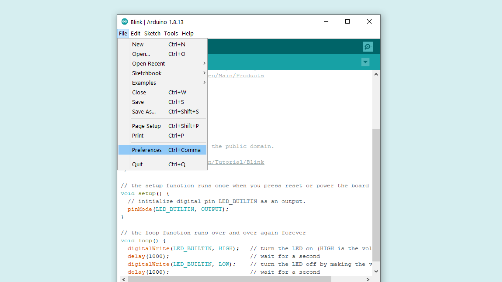

When you have the preferences window open, look for the **Show verbose output during: compilation** option and make sure that the checkbox is ticked.

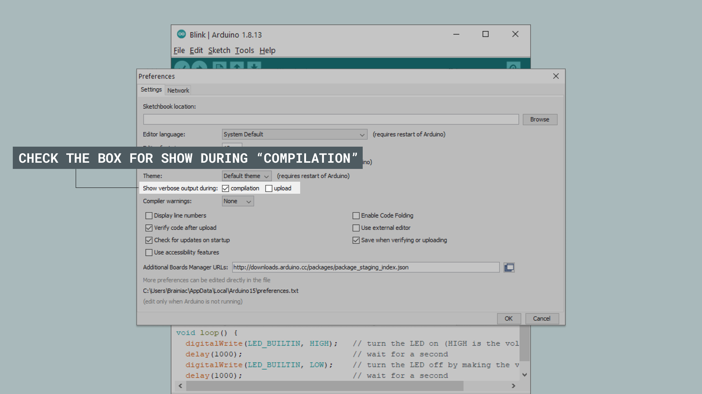

Now we are ready to upload the script that we want to debug. If you don't have a sketch to test, you can use the example sketch found in the **Conclusion** section of this tutorial.

When we upload the sketch with the Arduino IDE, we need to know where the .ELF file will be saved. Build your project in the Arduino IDE and highlight the output directory; it should look for example like `C:\Users\profile\AppData\Local\Temp\arduino_build_815037`. Note down the path for easier access in the next step.

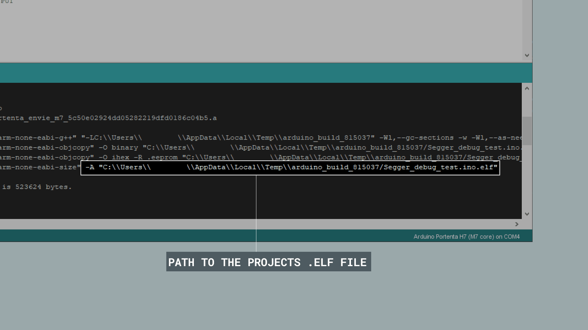

### 2. Connecting the Boards and Device

First, connect the Portenta H7 to the Breakout. To begin using the J-link device with the Portenta H7 and Breakout, you will need a J-link adapter, sold separately. The cable for the adapter needs to be connected as indicated in the illustration below, with the cable going inwards towards the H7 and center of the Breakout. On the J-link side, connect the cable going away form the J-link device on the adapter. Now you just need to connect the USB cable from the J-link to your computer and the USB cable from the Portenta H7 that is on the Breakout to your computer.

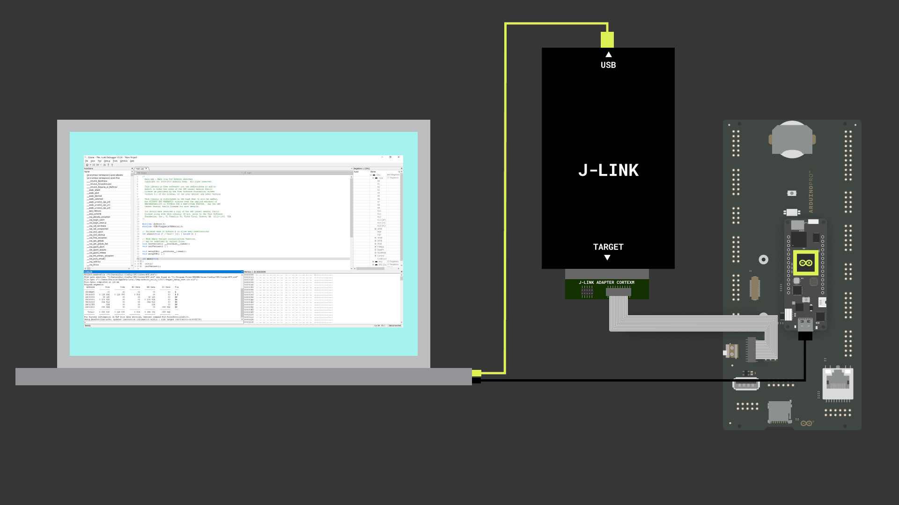

### 3. Using the Setup with Segger Ozone

Download and install [Segger's Ozone debugger](https://www.segger.com/downloads/J-link/#Ozone). If you are on Windows, make sure to also download the [J-Link Software and Documentation Pack for Windows.](https://www.segger.com/products/debug-probes/j-link/tools/j-link-gdb-server/about-j-link-gdb-server/) 

 When starting Ozone, make sure to enter the correct CPU into the settings box. The Portenta H7 uses the **STM32H747XI**; you can then choose between the M4 and M7 core on the Portenta. 

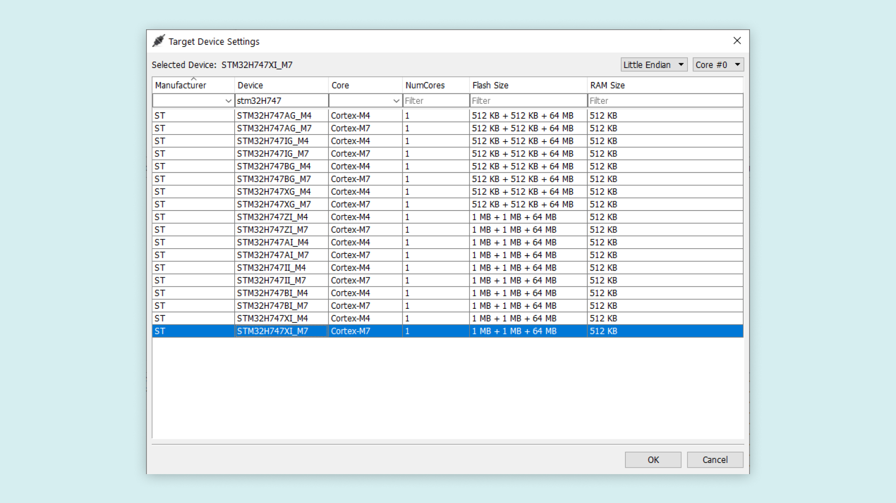

Continue to the next step. Here you need to change the **Target Interface** to **SWD**. The Portenta H7 does not support JTAG. Then select your J-link device in the list of emulators and head to the next page.

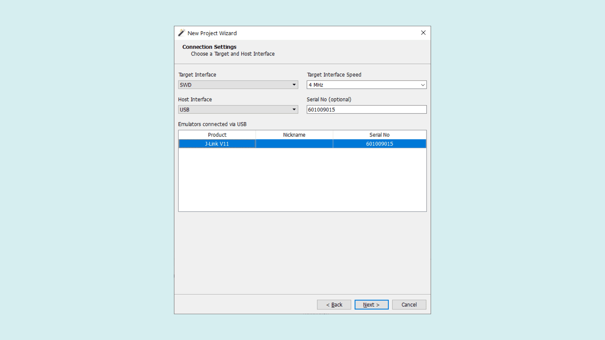

Now you get to the window that asks you to select the program to be debugged, this is where you load the project's .ELF file with the temporary output path that we noted before. Navigate to the correct directory, and select the .ELF file.

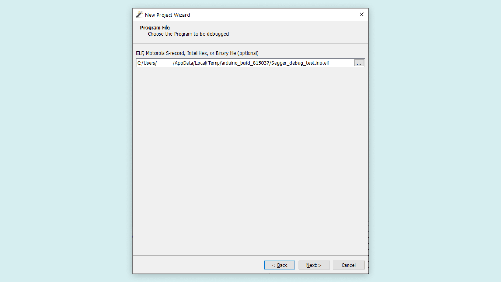

In the 'optional settings' dialog, set both options 'Initial PC' and 'Initial Stack Pointer' to 'Do not set' as it would skip the Arduino bootloader, otherwise this may prevent the sketch from running correctly.

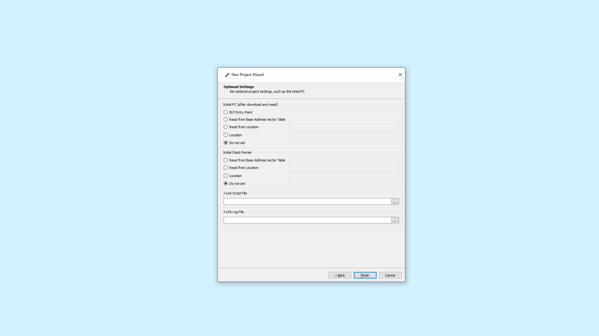

When the setup is finished, Ozone will open the file containing the main function. You will note that this is not the .ino sketch you wrote since this is an abstraction layer generated by the IDE. To open our .ino sketch we need to go to **Find > Find source file** in the top toolbar.

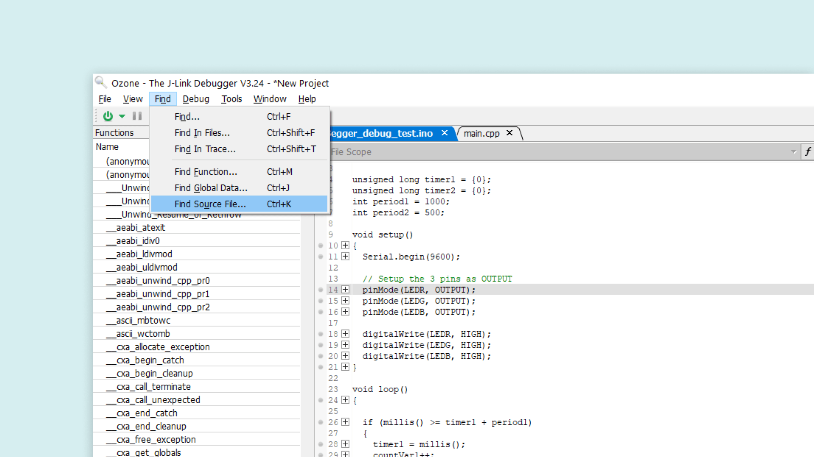

In the little window that appears, type ".ino". You should now be able to see the file, select the file and open it in Ozone.

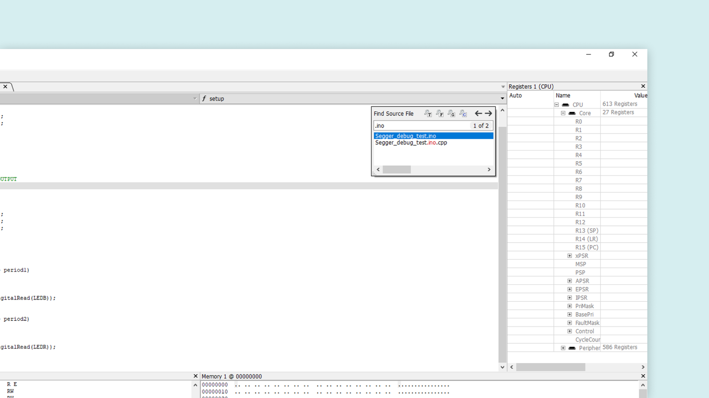

Now you are ready to start debugging. Simply go to **Debug > Download & Reset Program** to start debugging your sketch: you can add breakpoints , inspect variables, halt the execution and more.

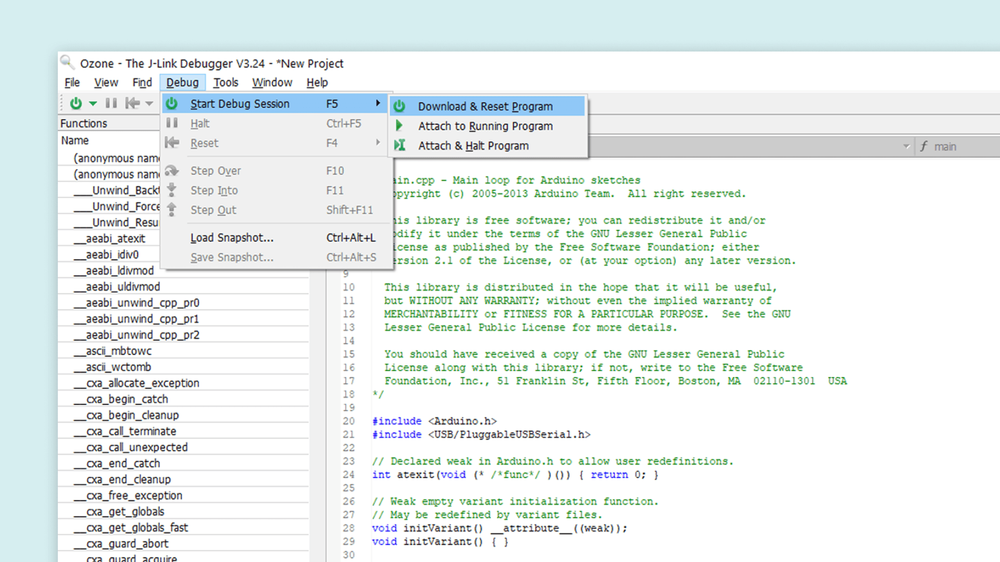

For more information about the features present in the Ozone debugger, please go [here.](https://www.segger.com/products/development-tools/ozone-j-link-debugger/technology/application-debugging/)

## Conclusion

In this tutorial, you learned how to connect your Portenta H7 and Breakout board to a J-link device and use it with the Ozone debugger. We also went through how to create a file with Arduino IDE that can be debugged in Ozone. And eventually how to use the Ozone debugger to debug an Arduino sketch.

### Example Sketch

```cpp
int counter1 = {0};
int counter2 = {0};

unsigned long timer1 = {0};
unsigned long timer2 = {0};
int period1 = 1000;
int period2 = 500;

void setup()
{

  // Set the LED pins up as OUTPUT
  pinMode(LEDR, OUTPUT);
  pinMode(LEDG, OUTPUT);
  pinMode(LEDB, OUTPUT);

  digitalWrite(LEDR, HIGH);
  digitalWrite(LEDG, HIGH);
  digitalWrite(LEDB, HIGH);
}

void loop()
{

  if (millis() >= timer1 + period1)
  {
    timer1 = millis();
    counter1++;
    digitalWrite(LEDB, !digitalRead(LEDB));
  }

  if (millis() >= timer2 + period2)
  {
    timer2 = millis();
    counter2++;
    digitalWrite(LEDR, !digitalRead(LEDR));
  } 
}
```
