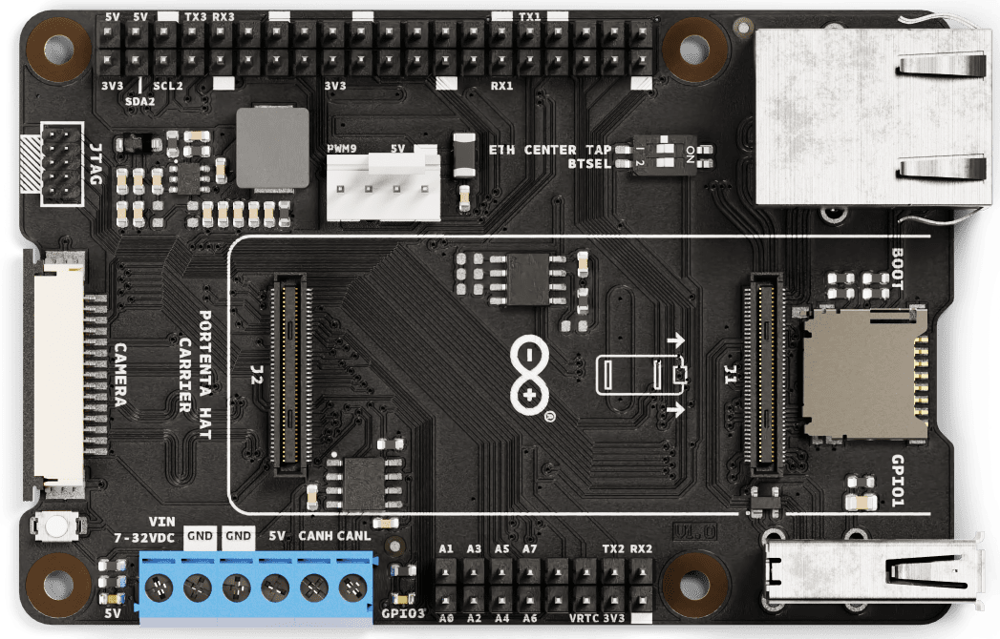
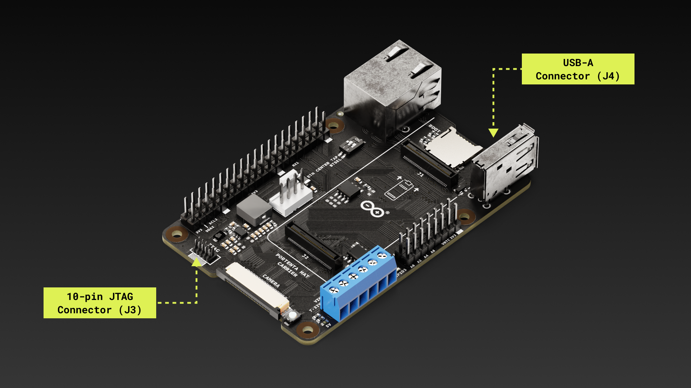
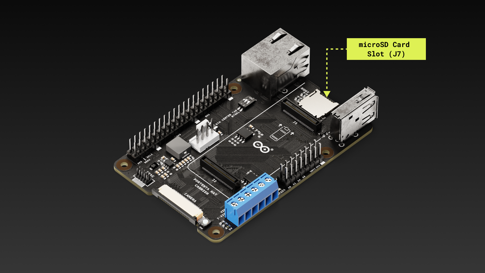
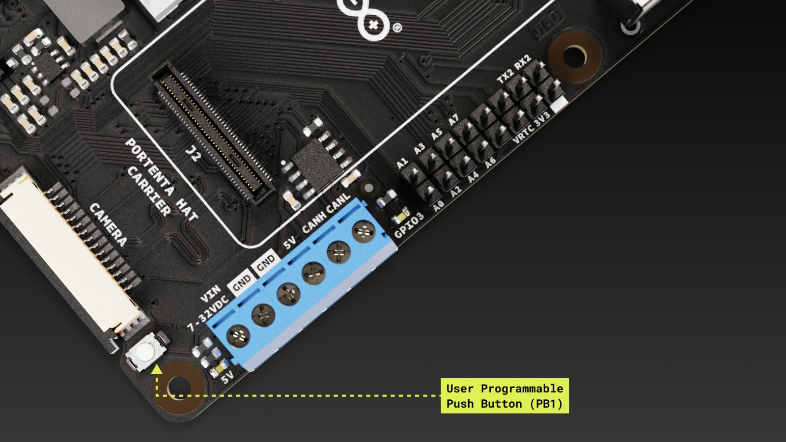

# Description

The Portenta Hat Carrier is an innovative solution enabling multiple robotics, industrial, and building automation projects. Combined with the Portenta X8, H7, or C33 boards, it evolves into a powerful industrial platform, further complemented by its compatibility with Raspberry Pi® Hats. The carrier grants easy access to an array of peripherals, such as CAN, Ethernet, microSD, USB, camera, and analog input and output ports. Its design is further enhanced with dedicated pins for efficient debugging and PWM fan connector.

# Target Areas:

Industrial automation, building automation, robotics, prototyping

***Latest information*:**

The most recent datasheet version of this product is always available at: 

[**https://docs.arduino.cc/resources/datasheets/ASX00049-datasheet.pdf**](https://docs.arduino.cc/resources/datasheets/ASX00049-datasheet.pdf)

# CONTENTS

## Application Examples

The Portenta Hat Carrier is designed to complement the Portenta family. It provides direct access to the Portentas' peripheral interfaces, enabling connections to USB and MIPI cameras. Furthermore, it improves the prototyping potential through straightforward compatibility with a broad spectrum of Raspberry Pi® Hats.

- **Motion Controller**: With the Portenta Hat Carrier, the Portenta X8 becomes an optimal motion controller for advanced industrial machinery, including industrial robots. Its integrated CAN interface (hardware level) and a Robot Operating System (ROS) container (software level) empower the Portenta X8 to manage robotic arm trajectories, while concurrently communicating with all associated electronics, such as motors and sensors.

- **Audio Quality Test Bench**: Use the Portenta Hat Carrier with the appropriate Raspberry Pi® Hat to assess the audio quality of speakers and musical instruments. This duo facilitates ambient sound monitoring across diverse settings, including bustling production facilities or public infrastructure.

- **Smart Building Security**: Enhance your building's security with the combined strength of the Portenta X8 and the Portenta Hat Carrier. Receive real-time notifications in instances of security breaches, establish an intelligent video surveillance system to spot unauthorized activities, or amplify your access control by integrating a high-resolution camera with the Portenta Hat Carrier.

- **Prototyping With Raspberry Pi® Hats**: Expand the capabilities of your Portenta lineup with the Portenta Hat Carrier. Ready for action, it is designed to be paired with an extensive range of Raspberry Pi® Hats, catering to diverse requirements, from embedded sensing to direct actuation.

## Accessories (Not Included)

- MicroSD card (x1)
- MIPI camera (x1)
- Compatible Raspberry Pi® Hats
- PWM fan

***Note: The Portenta Hat Carrier is a carrier that requires a compatible System-On-Module board to operate, e.g. the Portenta X8, Portenta H7 or Portenta C33.***

## Related Products

- Arduino Portenta X8 (SKU: ABX00049)
- Arduino Portenta H7 (SKU: ABX00042)
- Arduino Portenta H7 Lite (SKU: ABX00045)
- Arduino Portenta H7 Lite Connected (SKU: ABX00046)
- Arduino Portenta C33 (SKU: ABX00074)

## Solution Overview

The Portenta Hat Carrier works alongside the Portenta family boards. The connection between the Portenta Hat Carrier and the Portenta family boards is fast and easy thanks to the High-Density connectors (J1 and J2) found in the Portenta Hat Carrier.

## Features

### General Specifications Overview

<table>
<thead>
  <tr>
    <th style="text-align:right;">Characteristics</th>
    <th style="text-align:left;">Details</th>
  </tr>
</thead>
<tbody>
  <tr>
    <td style="text-align:right;">Supply voltage</td>
    <td style="text-align:left;">
      <ul style="margin-top: 0; margin-bottom: 0; padding-left: 20px;">
        <li>From the onboard screw terminal block (J9):
            <ul style="margin-top: 0; margin-bottom: 0; padding-left: 20px;">
                <li>+7-32 VDC to power both the carrier and the connected Portenta family board</li>
                <li>+5 VDC power supply</li>
            </ul>
        </li>
        <li>+5 VDC from the USB-C® connector of the connected Portenta family board</li>
        <li>From the onboard 40-pin header connector (J5):
            <ul style="margin-top: 0; margin-bottom: 0; padding-left: 20px;">
                <li>+5 VDC power supply</li>
            </ul>
        </li>
      </ul>
    </td>
  </tr>
  <tr>
    <td style="text-align:right;">Carrier maximum current</td>
    <td style="text-align:left;">1.5 A</td>
  </tr>
  <tr>
    <td style="text-align:right;">USB connectivity</td>
    <td style="text-align:left;">USB-A for data logging and external peripherals (x1)</td>
  </tr>
  <tr>
    <td style="text-align:right;">Communication interfaces</td>
    <td style="text-align:left;">
      <ul style="margin-top: 0; margin-bottom: 0; padding-left: 20px;">
        <li>Ethernet (x1)</li>
        <li>SPI (x1)</li>
        <li>I2S (x1)</li>
        <li>I2C (x3)</li>
        <li>UART (without flow control) (x3)</li>
      </ul>
    </td>
  </tr>
  <tr>
    <td style="text-align:right;">Certifications</td>
    <td style="text-align:left;">CE/RED, FCC, UKCA, IC, RoHS, REACH and WEEE</td>
  </tr>
</tbody>
</table>

<caption>Table 1: General specification overview of the Portenta Hat Carrier</caption>

### Communication Interfaces

<table>
    <thead>
        <tr>
            <th width="30%" style="text-align: right;">Interfaces</th>
            <th style="text-align: left;">Connector</th>
        </tr>
    </thead>
    <tbody>
        <tr>
            <td style="vertical-align: top; text-align: right;">Ethernet (x1)</td>
            <td style="text-align: left;">RJ45 connector (J8)</td>
        </tr>
        <tr>
            <td style="vertical-align: top; text-align: right;">SPI (x1)</td>
            <td style="text-align: left;">40-pin header connector (J5)</td>
        </tr>
        <tr>
            <td style="vertical-align: top; text-align: right;">I2S (x1)</td>
            <td style="text-align: left;">40-pin header connector (J5)</td>
        </tr>
        <tr>
            <td style="vertical-align: top; text-align: right;">I2C (x3)</td>
            <td style="text-align: left;">
                <ul>
                    <li>I2C0: 40-pin header connector (J5)</li>
                    <li>I2C1: High-Density connector (J1)*</li>
                    <li>I2C2: 40-pin header connector (J5)</li>
                </ul>
            </td>
        </tr>
        <tr>
            <td style="vertical-align: top; text-align: right;">UART (without flow control) (x3)</td>
            <td style="text-align: left;">
                <ul>
                    <li>UART1: 40-pin header connector (J5)</li>
                    <li>UART2: 16-pin header connector (J6)</li>
                    <li>UART3: 40-pin header connector (J5)</li>
                </ul>
            </td>
        </tr>
    </tbody>
</table>

<caption>Table 2: Communication interfaces of the Portenta Hat Carrier</caption>

 ***Note**: I2C1 is shared also with the onboard EEPROM memory and the MIPI connector.

### Other Features

<table>
<thead>
    <tr>
        <th width="30%" style="text-align: right;">Feature</th>
        <th style="text-align: left;">Description</th>
    </tr>
</thead>
<tbody>
    <tr>
        <td style="text-align: right;">Additional onboard storage</td>
        <td style="text-align: left;">MicroSD card slot for data logging and media purposes (J7) (x1)</td>
    </tr>
    <tr>
        <td style="text-align: right;">USB</td>
        <td style="text-align: left;">USB-A 2.0 connector for data logging and external peripherals (J4) (x1)</td>
    </tr>
    <tr>
        <td style="text-align: right;">Video support</td>
        <td style="text-align: left;">Only with the Portenta X8 board through its onboard USB-C®</td>
    </tr>
    <tr>
        <td style="text-align: right;">Camera support</td>
        <td style="text-align: left;">Only with the Portenta X8 board through the onboard MIPI camera connector of the carrier (J10)</td>
    </tr>
    <tr>
        <td style="text-align: right;">CAN bus support</td>
        <td style="text-align: left;">Onboard transceiver (J9) (x1)</td>
    </tr>
    <tr>
        <td style="text-align: right;">Ethernet</td>
        <td style="text-align: left;">RJ45 connector (J8) (x1)</td>
    </tr>
    <tr>
        <td style="text-align: right;">Push button</td>
        <td style="text-align: left;">
            <ul>
                <li>Push button (x1) used to flash the bootloader by making a long press during boot. This button can also be used as a user-programmable button connected to GPIO1</li>
            </ul>
        </td>
    </tr>
    <tr>
        <td style="text-align: right;">LEDs</td>
        <td style="text-align: left;">
            <ul>
                <li>Power LED (x1)</li>
                <li>User-programmable LED (x1) connected to the GPIO3 pin of the onboard High-Density connectors</li>
            </ul>
        </td>
    </tr>
    <tr>
        <td style="text-align: right;">DIP switch (with two sliders)</td>
        <td style="text-align: left;">
            <ul>
                <li>ETH CENTER TAP: Enable/Disable Ethernet (OFF position to enable for Portenta X8, ON position to enable for Portenta H7/C33)</li>
                <li>BTSEL: Reserved for future applications</li>
            </ul>
        </td>
    </tr>
</tbody>
</table>

<caption>Table 3: Other important features of the Portenta Hat Carrier</caption>

## Ratings

### Recommended Operating Conditions

Table 4 provides a comprehensive guideline for the optimal use of the Portenta Hat Carrier, outlining typical operating conditions and design limits.

|                          **Parameter**                          |       **Symbol**       | **Min** | **Typ** | **Max** | **Unit** |
| :-------------------------------------------------------------: | :--------------------: | :-----: | :-----: | :-----: | :------: |
| VIN from onboard screw terminal1 (J9) of the carrier | VINTERMINAL |   7.0   |    -    |  32.0   |    V     |
|     +5 VDC from onboard screw terminal (J9) of the carrier      | V5TERMINAL  |    -    |   5.0   |    -    |    V     |
|         USB-C® from the connected Portenta family board         |   V5USBC    |    -    |   5.0   |    -    |    V     |
|                Current delivered by the carrier                 |  ICARRIER   |    -    |    -    |   1.5   |    A     |
|     +5 VDC from the 40-pin header connector of the carrier      |  V5HEADER   |    -    |   5.0   |    -    |    V     |
|                  Operating ambient temperature                  |     TOP     |   -40   |    -    |   85    |    °C    |

<caption>Table 4: Recommended operating conditions of the Portenta Hat Carrier</caption>

1The power supply connected to the onboard screw terminal block powers the carrier, the connected Portenta family board, and compatible Raspberry Pi® Hats. The onboard screw terminal connector has an integrated reverse polarity protection.

## Functional Overview

### Pinout

The Portent Hat Carrier pinout is shown in Figure 2.

### Full Pinout Table

The full pinout of the Portenta Hat Carrier is available in the following tables sorted by element/connector.

#### Raspberry Pi® 40-Pins Connector (J5)

| Pin number | Silkscreen |   Power Net   | Portenta HD Standard Pin |                           High-Density Pin                           | Interface  |
| :--------: | :--------: | :-----------: | :----------------------: | :------------------------------------------------------------------: | :--------: |
|     1      |    3V3     | +3V3_PORTENTA |           VCC            |                      J2-23, J2-34, J2-43, J2-69                      |            |
|     2      |     5V     |      +5V      |           VIN            |                  J1-21, J1-24, J1-32, J1-41, J1-48                   |            |
|     3      |  I2C2 SDA  |               |                          |                                J2-45                                 | I2C 2 SDA  |
|     4      |     5V     |      +5V      |           VIN            |                  J1-21, J1-24, J1-32, J1-41, J1-48                   |            |
|     5      |  I2C2 SCL  |               |         I2C2_SCL         |                                J2-47                                 | I2C 2 SCL  |
|     6      |    GND     |      GND      |           GND            | J1-22, J1-31, J1-42, J1-47, J1-54, J2-24, J2-33, J2-44, J2-57, J2-70 |            |
|     7      |    PWM0    |               |          PWM_0           |                                J2-59                                 |            |
|     8      |    TX3     |               |        SERIAL3_TX        |                                J2-25                                 | UART 3 TX  |
|     9      |    GND     |      GND      |           GND            | J1-22, J1-31, J1-42, J1-47, J1-54, J2-24, J2-33, J2-44, J2-57, J2-70 |            |
|     10     |    RX3     |               |        SERIAL3_RX        |                                J2-27                                 | UART 3 RX  |
|     11     |   GPIO2    |               |          GPIO2           |                                J2-50                                 |            |
|     12     |   I2S CK   |               |          I2S_CK          |                                J1-56                                 |   I2S CK   |
|     13     |   GPIO6    |               |          GPIO_6          |                                J2-58                                 |            |
|     14     |    GND     |      GND      |           GND            | J1-22, J1-31, J1-42, J1-47, J1-54, J2-24, J2-33, J2-44, J2-57, J2-70 |            |
|     15     |   SAI D0   |               |          SAI_D0          |                                J2-53                                 |   SAI D0   |
|     16     |   SAI CK   |               |          SAI_CK          |                                J2-49                                 |   SAI CK   |
|     17     |    3V3     | +3V3_PORTENTA |           VCC            |                      J2-23, J2-34, J2-43, J2-69                      |            |
|     18     |   SAI FS   |               |          SAI_FS          |                                J2-51                                 |   SAI FS   |
|     19     | SPI1 COPI  |               |        SPI1_MOSI         |                                J2-42                                 | SPI 1 MOSI |
|     20     |    GND     |      GND      |           GND            | J1-22, J1-31, J1-42, J1-47, J1-54, J2-24, J2-33, J2-44, J2-57, J2-70 |            |
|     21     | SPI1 CIPO  |               |        SPI1_MISO         |                                J2-40                                 | SPI 1 MISO |
|     22     |    PWM1    |               |          PWM_1           |                                J2-61                                 |            |
|     23     |  SPI1 SCK  |               |         SPI1_CK          |                                J2-38                                 |  SPI 1 CK  |
|     24     |  SPI1 CE   |               |         SPI1_CS          |                                J2-36                                 |  SPI 1 CS  |
|     25     |    GND     |      GND      |           GND            | J1-22, J1-31, J1-42, J1-47, J1-54, J2-24, J2-33, J2-44, J2-57, J2-70 |            |
|     26     |    PWM2    |               |          PWM_2           |                                J2-63                                 |            |
|     27     |  I2C0 SDA  |               |         I2C0_SDA         |                                J1-44                                 | I2C 0 SDA  |
|     28     |  I2C0 SCL  |               |         I2C0_SCL         |                                J1-46                                 | I2C 0 SCL  |
|     29     |    RX1     |               |        SERIAL1_RX        |                                J1-35                                 | UART 1 RX  |
|     30     |    GND     |      GND      |           GND            | J1-22, J1-31, J1-42, J1-47, J1-54, J2-24, J2-33, J2-44, J2-57, J2-70 |            |
|     31     |    PWM3    |               |          PWM_3           |                                J2-65                                 |            |
|     32     |    TX1     |               |        SERIAL1_TX        |                                J1-33                                 | UART 1 TX  |
|     33     |    PWM4    |               |          PWM_4           |                                J2-67                                 |            |
|     34     |    GND     |      GND      |           GND            | J1-22, J1-31, J1-42, J1-47, J1-54, J2-24, J2-33, J2-44, J2-57, J2-70 |            |
|     35     |   I2S WS   |               |          I2S_WS          |                                J1-58                                 |   I2S WS   |
|     36     |    PWM5    |               |          PWM_5           |                                J2-60                                 |            |
|     37     |    PWM6    |               |          PWM_6           |                                J2-62                                 |            |
|     38     |  I2S SDI   |               |         I2S_SDI          |                                J1-60                                 |  I2S SDI   |
|     39     |    GND     |      GND      |           GND            | J1-22, J1-31, J1-42, J1-47, J1-54, J2-24, J2-33, J2-44, J2-57, J2-70 |            |
|     40     |  I2S SDO   |               |         I2S_SDO          |                                J1-62                                 |  I2S SDO   |

<caption>Table 5: Raspberry Pi® 40-Pins Connector (J5) pinout</caption>

#### 16-Pin Header (J6)

| Pin number | Silkscreen |   Power Net   | Portenta HD Standard Pin |                           High-Density Pin                           |    Interface     |
| :--------: | :--------: | :-----------: | :----------------------: | :------------------------------------------------------------------: | :--------------: |
|     1      |     A0     |               |        ANALOG_A0         |                                J2-73                                 |                  |
|     2      |     A1     |               |        ANALOG_A1         |                                J2-75                                 |                  |
|     3      |     A2     |               |        ANALOG_A2         |                                J2-77                                 |                  |
|     4      |     A3     |               |        ANALOG_A3         |                                J2-79                                 |                  |
|     5      |     A4     |               |        ANALOG_A4         |                                J2-74                                 |                  |
|     6      |     A5     |               |        ANALOG_A5         |                                J2-76                                 |                  |
|     7      |     A6     |               |        ANALOG_A6         |                                J2-78                                 |                  |
|     8      |     A7     |               |        ANALOG_A7         |                                J2-80                                 |                  |
|     9      |    PWM7    |               |          PWM_7           |                                J2-64                                 |                  |
|     10     |    PWM8    |               |          PWM_8           |                                J2-66                                 |                  |
|     11     |   LICELL   |               |          LICELL          |                                 J2-7                                 | RTC Power Source |
|     12     |    PWM4    |               |          GPIO_0          |                                J2-46                                 |                  |
|     13     |    3V3     | +3V3_PORTENTA |           VCC            |                      J2-23, J2-34, J2-43, J2-69                      |                  |
|     14     |    TX2     |               |        SERIAL2_TX        |                                J2-26                                 |    UART 2 TX     |
|     15     |    GND     |      GND      |           GND            | J1-22, J1-31, J1-42, J1-47, J1-54, J2-24, J2-33, J2-44, J2-57, J2-70 |                  |
|     16     |    RX2     |               |        SERIAL2_RX        |                                J2-28                                 |    UART 2 RX     |

<caption>Table 6: 16-Pin Header (J6) pinout</caption>

#### Power Block CAN Bus (J9)

| Pin number | Silkscreen  |  Power Net   | Portenta HD Standard Pin |                           High-Density Pin                           |   Interface    |
| :--------: | :---------: | :----------: | :----------------------: | :------------------------------------------------------------------: | :------------: |
|     1      | VIN 7-32VDC | INPUT_7V-32V |                          |                                                                      |                |
|     2      |     GND     |     GND      |           GND            | J1-22, J1-31, J1-42, J1-47, J1-54, J2-24, J2-33, J2-44, J2-57, J2-70 |                |
|     3      |     GND     |     GND      |           GND            | J1-22, J1-31, J1-42, J1-47, J1-54, J2-24, J2-33, J2-44, J2-57, J2-70 |                |
|     4      |     5V      |     +5V      |           VIN            |                  J1-21, J1-24, J1-32, J1-41, J1-48                   |                |
|     5      |    CANH     |              |                          |                          J1-49 (Through U1)                          | CAN BUS - CANH |
|     6      |    CANL     |              |                          |                          J1-51 (Through U1)                          | CAN BUS - CANL |

<caption>Table 7: Power Block CAN Bus (J9) pinout</caption>

#### FAN PWM Header (J11)

| Pin number | Silkscreen | Power Net | Portenta HD Standard Pin |                           High-Density Pin                           | Interface |
| :--------: | :--------: | :-------: | :----------------------: | :------------------------------------------------------------------: | :-------: |
|     1      |    PWM9    |           |          PWM_9           |                                J2-68                                 |           |
|     2      |    N/A     |           |                          |                                                                      |           |
|     3      |     5V     |    +5V    |           VIN            |                  J1-21, J1-24, J1-32, J1-41, J1-48                   |           |
|     4      |    GND     |    GND    |           GND            | J1-22, J1-31, J1-42, J1-47, J1-54, J2-24, J2-33, J2-44, J2-57, J2-70 |           |

<caption>Table 8: FAN PWM Header (J11) pinout</caption>

#### JTAG Header (J3)

| Pin number | Silkscreen |   Power Net   | Portenta HD Standard Pin |                           High-Density Pin                           | Interface |
| :--------: | :--------: | :-----------: | :----------------------: | :------------------------------------------------------------------: | :-------: |
|     1      |    N/A     | +3V3_PORTENTA |           VCC            |                      J2-23, J2-34, J2-43, J2-69                      |           |
|     2      |    N/A     |               |         JTAG_SWD         |                                J1-75                                 | JTAG SWD  |
|     3      |    N/A     |      GND      |           GND            | J1-22, J1-31, J1-42, J1-47, J1-54, J2-24, J2-33, J2-44, J2-57, J2-70 |           |
|     4      |    N/A     |               |         JTAG_SCK         |                                J1-77                                 | JTAG SCK  |
|     5      |    N/A     |      GND      |           GND            | J1-22, J1-31, J1-42, J1-47, J1-54, J2-24, J2-33, J2-44, J2-57, J2-70 |           |
|     6      |    N/A     |               |         JTAG_SWO         |                                J1-79                                 | JTAG SWO  |
|     7      |    N/A     |               |            NC            |                                  NC                                  |           |
|     8      |    N/A     |               |         JTAG_TDI         |                                J1-78                                 | JTAG TDI  |
|     9      |    N/A     |               |        JTAG_TRST         |                                J1-80                                 | JTAG TRST |
|     10     |    N/A     |               |         JTAG_RST         |                                J1-73                                 | JTAG RST  |

<caption>Table 9: JTAG Header (J3) pinout</caption>

#### MIPI Camera (J10)

| Pin number | Silkscreen |   Power Net   | Portenta HD Standard Pin |                           High-Density Pin                           | Interface |
| :--------: | :--------: | :-----------: | :----------------------: | :------------------------------------------------------------------: | :-------: |
|     1      |    N/A     |      GND      |           GND            |                  J1-22, J1-31, J1-42, J1-47, J1-54                   |           |
|     2      |    N/A     |               |       CAM_D0_D0_N        |               J2-16, J2-24, J2-33, J2-44, J2-57, J2-70               |           |
|     3      |    N/A     |               |       CAM_D1_D0_P        |                                J2-14                                 |           |
|     4      |    N/A     |      GND      |           GND            | J1-22, J1-31, J1-42, J1-47, J1-54, J2-24, J2-33, J2-44, J2-57, J2-70 |           |
|     5      |    N/A     |               |       CAM_D2_D1_N        |                                J2-12                                 |           |
|     6      |    N/A     |               |       CAM_D3_D1_P        |                                J2-10                                 |           |
|     7      |    N/A     |      GND      |           GND            | J1-22, J1-31, J1-42, J1-47, J1-54, J2-24, J2-33, J2-44, J2-57, J2-70 |           |
|     8      |    N/A     |               |       CAM_CK_CK_N        |                                J2-20                                 |           |
|     9      |    N/A     |               |       CAM_VS_CK_P        |                                J2-18                                 |           |
|     10     |    N/A     |      GND      |           GND            | J1-22, J1-31, J1-42, J1-47, J1-54, J2-24, J2-33, J2-44, J2-57, J2-70 |           |
|     11     |    N/A     |               |          GPIO_5          |                                J2-56                                 |           |
|     12     |    N/A     |               |            NC            |                                  NC                                  |           |
|     13     |    N/A     |               |         I2C1_SCL         |                                J1-45                                 | I2C 1 SCL |
|     14     |    N/A     |               |         I2C1_SDA         |                                J1-43                                 | I2C 1 SDA |
|     15     |    N/A     | +3V3_PORTENTA |           VCC            |                      J2-23, J2-34, J2-43, J2-69                      |           |

<caption>Table 10: JTAG Header (J3) pinout</caption>

#### USB-A (J4)

| Pin number | Silkscreen | Power Net | Portenta HD Standard Pin |                           High-Density Pin                           | Interface |
| :--------: | :--------: | :-------: | :----------------------: | :------------------------------------------------------------------: | :-------: |
|     1      |    N/A     |    +5V    |     VIN / USB0_VBUS      |                  J1-21, J1-24, J1-32, J1-41, J1-48                   |           |
|     2      |    N/A     |           |         USB0_D_N         |                                J1-28                                 |  USB D-   |
|     3      |    N/A     |           |         USB0_D_P         |                                J1-26                                 |  USB D+   |
|     4      |    N/A     |    GND    |           GND            | J1-22, J1-31, J1-42, J1-47, J1-54, J2-24, J2-33, J2-44, J2-57, J2-70 |           |

<caption>Table 11: USB-A (J4) pinout</caption>

#### Ethernet (J8)

| Pin number |   Silkscreen   | Power Net | Portenta HD Standard Pin |                           High-Density Pin                           | Interface |
| :--------: | :------------: | :-------: | :----------------------: | :------------------------------------------------------------------: | :-------: |
|     1      |      N/A       |    GND    |           GND            | J1-22, J1-31, J1-42, J1-47, J1-54, J2-24, J2-33, J2-44, J2-57, J2-70 |           |
|     2      | ETH CENTER TAP |           |                          |                                                                      |           |
|     3      |      N/A       |           |         ETH_D_P          |                                J1-13                                 |           |
|     4      |      N/A       |           |         ETH_D_N          |                                J1-15                                 |           |
|     5      |      N/A       |           |         ETH_C_P          |                                 J1-9                                 |           |
|     6      |      N/A       |           |         ETH_C_N          |                                J1-11                                 |           |
|     7      |      N/A       |           |         ETH_B_P          |                                 J1-5                                 |           |
|     8      |      N/A       |           |         ETH_B_N          |                                 J1-7                                 |           |
|     9      |      N/A       |           |         ETH_A_P          |                                 J1-1                                 |           |
|     10     |      N/A       |           |         ETH_A_N          |                                 J1-3                                 |           |
|     11     |      N/A       |           |         ETH_LED2         |                                J1-19                                 |           |
|     12     |      N/A       |    GND    |           GND            | J1-22, J1-31, J1-42, J1-47, J1-54, J2-24, J2-33, J2-44, J2-57, J2-70 |           |
|     13     |      N/A       |           |           N/A            |                                                                      |           |
|     14     |      N/A       |           |         ETH_LED1         |                                J1-17                                 |           |

<caption>Table 12: Ethernet (J8) pinout</caption>

#### MicroSD Card Slot (J7)

| Pin number | Silkscreen | Power Net  | Portenta HD Standard Pin |                           High-Density Pin                           | Interface |
| :--------: | :--------: | :--------: | :----------------------: | :------------------------------------------------------------------: | :-------: |
|     1      |    N/A     |            |          SDC_D2          |                                J1-63                                 |           |
|     2      |    N/A     |            |          SDC_D3          |                                J1-65                                 |           |
|     3      |    N/A     |            |         SDC_CMD          |                                J1-57                                 |           |
|     4      |    N/A     | VDD_SDCARD |           VSD            |                                J1-72                                 |           |
|     5      |    N/A     |            |         SDC_CLK          |                                J1-55                                 |           |
|     6      |    N/A     |    GND     |           GND            | J1-22, J1-31, J1-42, J1-47, J1-54, J2-24, J2-33, J2-44, J2-57, J2-70 |           |
|     7      |    N/A     |            |          SDC_D0          |                                J1-59                                 |           |
|     8      |    N/A     |            |          SDC_D1          |                                J1-61                                 |           |
|    CD1     |    N/A     |            |          SDC_CD          |                                J1-67                                 |           |
|    CD2     |    N/A     |    GND     |           GND            | J1-22, J1-31, J1-42, J1-47, J1-54, J2-24, J2-33, J2-44, J2-57, J2-70 |           |

<caption>Table 13: MicroSD Card Slot (J7) pinout</caption>

### Block Diagram

An overview of the Portenta Hat Carrier high-level architecture is illustrated in Figure 3.

### Power Tree

Figure 4 shows the power options available on the Portenta Hat Carrier and illustrates the main system power architecture.

As shown in Figure 4, the Portenta Hat Carrier can be powered in multiple ways:

- **Through the screw terminal block connector (J9)**: 
Accepting a voltage range between +7 to +32 VDC. An AP63200WU-7 buck converter (U7) then steps down the +7 to +32 VDC VDC input to +5 VDC for the carrier and any connected Portenta family board. It is also possible to power the system with a fixed +5 VDC using the "5V" pin present in this block connector.

- **Via the connected Portenta family board's USB-C® connector**: 
It provides a stable +5 VDC to the carrier and the connected Portenta Family board.

- **From a Raspberry like Hat using the 40-pin header connector**: 
It provides a stable +5 VDC to the carrier and the connected Portenta Family board.

### Product Topology

An overview of the Portenta Hat Carrier topology is illustrated in Figure 5.

<table>
    <thead>
        <tr>
            <th>Item</th>
            <th>Feature</th>
            <th>Item</th>
            <th>Feature</th>
        </tr>
    </thead>
    <tbody>
        <tr>
            <td style="text-align: right;">J1, J2</td>
            <td>High-Density connectors for Portenta boards</td>
            <td style="text-align: right;">J8</td>
            <td>RJ45 connector for Ethernet</td>
        </tr>
        <tr>
            <td style="text-align: right;">J3</td>
            <td>JTAG male connector for debugging</td>
            <td style="text-align: right;">J9</td>
            <td>Screw terminal for power supply and CAN bus</td>
        </tr>
        <tr>
            <td style="text-align: right;">J4</td>
            <td>USB-A female connector for data logging and external devices</td>
            <td style="text-align: right;">J10</td>
            <td>MIPI camera connector (only for Portenta X8 board)</td>
        </tr>
        <tr>
            <td style="text-align: right;">J5</td>
            <td>40-pin male header compatible with Raspberry Pi® Hats</td>
            <td style="text-align: right;">J11</td>
            <td>Male header for external fan</td>
        </tr>
        <tr>
            <td style="text-align: right;">J6</td>
            <td>16-pin male header for analog and digital pins</td>
            <td style="text-align: right;">SW2</td>
            <td>
                DIP switch (2 positions):
                <ul>
                    <li>Ethernet mode</li>
                    <li>Reserved for future applications</li>
                </ul>
            </td>
        </tr>
        <tr>
            <td style="text-align: right;">J7</td>
            <td>MicroSD slot for data logging and media purposes</td>
            <td style="text-align: right;">PB1</td>
            <td>
                <ul>
                    <li>Simple press: Programmable button</li>
                    <li>Long press: Flashing mode</li>
                </ul>
            </td>
        </tr>
    </tbody>
</table>

<caption>Table 14: Product Topology Description</caption>

#### High-Density Connectors (J1-J2)

The High-Density connectors (J1-J2) provide connectivity with the Portenta family boards. For detailed information, refer to the Portenta Hat Carrier pinout and the respective documentation for the Portenta family boards. In Figure 6, the Portenta X8 board High-Density connectors pinout is shown as an example.

#### JTAG Connector (J3)

Debugging capabilities are integrated directly into the Portenta Hat Carrier and are accessible via the 10-pin JTAG connector (J3) shown in Figure 7.

#### USB-A (J4)

The onboard USB-A connector (female), shown in Figure 7, is integrated in the Portenta Hat Carrier for multiple purposes, including:

- Connecting external peripherals such as mouse devices, keyboards, USB cameras, hubs, and hard drives.
- Data logging using a USB memory stick.

#### 40-Pin Header Connector (J5)

The Portenta Hat Carrier features a 40-pin header connector as shown in Figure 8, making it compatible with most of the Raspberry Pi® Hats available on the market.

The main interfaces and general-purpose pins available through this connector include:

- SPI (x1)
- I2S (x1)
- SAI (x1)
- 5 VDC (x2)
- 3.3 VDC (x2)
- I2C (x2)
- UART (without flow control) (x2)
- PWM (x7)
- GND (x8)
- GPIO (x26)

#### 16-Pin Header Connector (J6)

The Portenta Hat Carrier has a 16-pin connector as shown in Figure 9 to access multiple analog, PWM, serial ports, and power-related pins.

The main interfaces and general-purpose pins that can be accessed via this connector are:

- Analog I/O (x8)
- PWM (x2)
- 1x LiCell pin for Portenta's RTC power (x1)
- GPIO (x1)
- 3.3 VDC (x1)
- GND (x1)
- UART (without flow control) (x1)

#### MicroSD Card Slot (J7)

The onboard microSD card slot can be used for:

- Data logging operations
- Media purposes

#### RJ45 Connector For Ethernet (J8)

The RJ45 connector, directly linked to the high-density connector on the Portenta board, facilitates an Ethernet cable connection to your network. It integrates magnetics for electrical isolation, and features LED indications for activity (orange) and speed (green).

Depending of the Portenta family board attached to the Portenta Hat Carrier, the DIP switch (SW2) must be in a specific position to ensure the correct functioning of the ethernet interface:

- For the Portenta X8, be sure that the ETH CENTER TAP on the DIP switch (SW2) is on the default position OFF.
- For the Portenta X7 or Portenta C33, set the ETH CENTER TAP on the DIP switch (SW2) to ON.

#### Screw Terminal Block (J9)

The screw terminal block connector shown in Figure 12 contains the power supply and CAN bus communication pins.

**Power Pins**

The Portenta Hat Carrier and any connected board to it can be powered using the power terminals located on the screw terminal block (J9):

- **VIN 7-32VDC and GND terminals**: 
Supply the board using a voltage range of +7-32 VDC. This method is particularly convenient when powering the board with batteries.

- **5V and GND terminals**: 
Power the board with a fixed voltage of +5 VDC. Additionally, these pins can power external peripherals operating at +5 VDC. An AP63200WU-7 buck converter (U7) steps down the input voltage from +7-32 VDC to the +5 VDC used by the carrier and the connected board to it.

**CAN Bus Pins**

- **CANH and CANL terminals**: 
The Portenta Hat Carrier has a high-speed CAN transceiver based on the TJA1049T/3J IC. These terminals enable reliable CAN bus communication. The 120 ohms termination resistor is not included in the device so make sure to add them in your final deployment to meet the bus requirements and obtain the ideal results.

  
#### Camera Connector (J10)

The Portenta Hat Carrier, when combined with a Portenta X8, supports MIPI cameras. The latter can be plugged into the onboard camera connector shown in Figure 13 via a flexible flat cable.

Some of the potential compatible devices are the following:

- OmniVision® OV5645 sensor, like the one used in the Raspberry Pi® Camera Module 1.
- Sony® IMX219 sensor, like the one used in the Raspberry Pi® Camera Module 2.

#### PWM Header Connector (J11)

The PWM header connector controls an optional fan's speed, perfect for heat dissipation in closed cases and heavy CPU-demanding applications.

#### DIP Switch Positions (SW2)

The Portenta Hat Carrier has a DIP switch with two different functions depending on the Portenta family board connected to it:

**Portenta X8:**

|   **Switch**   | **Position** |           **Meaning**            |
| :------------: | :----------: | :------------------------------: |
| ETH CENTER TAP |      ON      |      Ethernet **disabled**       |
|                |     OFF      |       Ethernet **enabled**       |
|     BTSEL      |      ON      | Reserved for future applications |
|                |     OFF      | Reserved for future applications |

**Portenta H7 and Portenta C33:**

|   **Switch**   | **Position** |      **Meaning**      |
| :------------: | :----------: | :-------------------: |
| ETH CENTER TAP |      ON      | Ethernet **enabled**  |
|                |     OFF      | Ethernet **disabled** |
|     BTSEL      |      ON      |       Not used        |
|                |     OFF      |       Not used        |

#### Flashing Push Button (PB1)

The flashing push button can serve as a general user-programmable button with a single press or can enable the board's flashing mode when pressing it longer.

To perform flashing operations:

1. Do a long press on the PB1 push button and release it.
2. To exit from the flashing mode and restart the system with the changes made, do a single press on the PB1 push button.

## Device Operation

The carrier is designed to function in conjunction with the Portenta family boards (refer to the Solution Overview section for more details). For further information, consult the datasheets for Portenta X8, Portenta H7, or Portenta C33 boards.

### Getting Started - IDE

If you want to program your Portenta Hat Carrier offline, you'll need to install the Arduino Desktop IDE [1]. To connect your Portenta family board with the Portenta Hat Carrier to your computer, a USB-C® cable is required.

### Getting Started - Arduino Web Editor

All Arduino devices work out-of-the-box with the Arduino Web Editor [2] after installing a straightforward plugin.

Being hosted online ensures that the Arduino Web Editor remains up-to-date, boasting the latest features and comprehensive support for all boards and devices. To begin coding in the browser and uploading your sketches to your device, follow the instructions here [3].

### Getting Started - Arduino IoT Cloud

The Arduino IoT Cloud supports all Arduino IoT-enabled products, enabling you to log, visualize, and analyze sensor data, initiate events, and automate either your home or business.

### Getting Started - Portenta Hat Carrier with Portenta X8 - Linux

The Portenta Hat Carrier with a Portenta X8 is a powerful system that runs Linux in its main core and Arduino in its secondary core. In case you want to know more about how to use Linux with your Portenta X8 and your Portenta Hat Carrier, you can check the official documentation for the Portenta Hat Carrier [4] and the Portenta X8 [5].

### Online Resources

Having acquainted yourself with the device's basic functionalities, delve into its limitless potentials. Engage with inspiring projects on Arduino Project Hub [6], explore the Arduino Library Reference [7], and visit the online store [8] to augment your Portenta Hat Carrier with supplemental extensions, sensors, and actuators.

### Board Recovery

- **Portenta C33 or Portenta H7**: 
In case a sketch locks up the processor and the board is not reachable anymore via USB, bootloader mode can be accessed by double-tapping the reset button right after powering up.

- **Portenta X8**: 
If your Linux system become unresponsive, press the reset button to reboot. If the system remains unresponsive post-reboot, re-flashing the board might be necessary. Consult the official Portenta Hat Carrier [4] and the Portenta X8 [5] documentation for further guidance.

## Mechanical Information

### Product Outline

## Certifications

### Certifications Summary

| Certification   | Status |
|-----------------|--------|
| CE/RED (Europe) | Yes    |
| UKCA (UK)       | Yes    |
| FCC (USA)       | Yes    |
| IC (Canada)     | Yes    |
| RoHS            | Yes    |
| REACH           | Yes    |
| WEEE            | Yes    |

### Declaration of Conformity CE DoC (EU)

We declare under our sole responsibility that the products above are in conformity with the essential requirements of the following EU Directives and therefore qualify for free movement within markets comprising the European Union (EU) and European Economic Area (EEA).

### Declaration of Conformity to EU RoHS & REACH 211 01/19/2021

Arduino boards are in compliance with RoHS 2 Directive 2011/65/EU of the European Parliament and RoHS 3 Directive 2015/863/EU of the Council of 4 June 2015 on the restriction of the use of certain hazardous substances in electrical and electronic equipment.

| Substance                              | **Maximum limit (ppm)** |
|----------------------------------------|-------------------------|
| Lead (Pb)                              | 1000                    |
| Cadmium (Cd)                           | 100                     |
| Mercury (Hg)                           | 1000                    |
| Hexavalent Chromium (Cr6+)             | 1000                    |
| Poly Brominated Biphenyls (PBB)        | 1000                    |
| Poly Brominated Diphenyl ethers (PBDE) | 1000                    |
| Bis(2-Ethylhexyl) phthalate (DEHP)     | 1000                    |
| Benzyl butyl phthalate (BBP)           | 1000                    |
| Dibutyl phthalate (DBP)                | 1000                    |
| Diisobutyl phthalate (DIBP)            | 1000                    |

Exemptions: No exemptions are claimed.

Arduino Boards are fully compliant with the related requirements of European Union Regulation (EC) 1907 /2006 concerning the Registration, Evaluation, Authorization and Restriction of Chemicals (REACH). We declare none of the SVHCs (https://echa.europa.eu/web/guest/candidate-list-table), the Candidate List of Substances of Very High Concern for authorization currently released by ECHA, is present in all products (and also package) in quantities totaling in a concentration equal or above 0.1%. To the best of our knowledge, we also declare that our products do not contain any of the substances listed on the "Authorization List" (Annex XIV of the REACH regulations) and Substances of Very High Concern (SVHC) in any significant amounts as specified by the Annex XVII of Candidate list published by ECHA (European Chemical Agency) 1907 /2006/EC.

### Conflict Minerals Declaration

As a global supplier of electronic and electrical components, Arduino is aware of our obligations with regard to laws and regulations regarding Conflict Minerals, specifically the Dodd-Frank Wall Street Reform and Consumer Protection Act, Section 1502. Arduino does not directly source or process conflict minerals such as Tin, Tantalum, Tungsten, or Gold. Conflict minerals are contained in our products in the form of solder or as a component in metal alloys. As part of our reasonable due diligence, Arduino has contacted component suppliers within our supply chain to verify their continued compliance with the regulations. Based on the information received thus far we declare that our products contain Conflict Minerals sourced from conflict-free areas.

## FCC Caution

Any Changes or modifications not expressly approved by the party responsible for compliance could void the user’s authority to operate the equipment.

This device complies with part 15 of the FCC Rules. Operation is subject to the following two conditions:

(1) This device may not cause harmful interference

(2) this device must accept any interference received, including interference that may cause undesired operation.

**FCC RF Radiation Exposure Statement:**

1. This Transmitter must not be co-located or operating in conjunction with any other antenna or transmitter.

2. This equipment complies with RF radiation exposure limits set forth for an uncontrolled environment.

3. This equipment should be installed and operated with a minimum distance of 20 cm between the radiator & your body.

English:
User manuals for license-exempt radio apparatus shall contain the following or equivalent notice in a conspicuous location in the user manual or alternatively on the device or both. This device complies with Industry Canada license-exempt RSS standard(s). Operation is subject to the following two conditions:

(1) this device may not cause interference

(2) this device must accept any interference, including interference that may cause undesired operation of the device.

French:
Le présent appareil est conforme aux CNR d’Industrie Canada applicables aux appareils radio exempts de licence. L’exploitation est autorisée aux deux conditions suivantes:

(1) l’ appareil nedoit pas produire de brouillage

(2) l’utilisateur de l’appareil doit accepter tout brouillage radioélectrique subi, même si le brouillage est susceptible d’en compromettre le fonctionnement.

**IC SAR Warning:**

English:
This equipment should be installed and operated with a minimum distance of 20 cm between the radiator and your body.

French:
Lors de l’ installation et de l’ exploitation de ce dispositif, la distance entre le radiateur et le corps est d ’au moins 20 cm.

**Important:** The operating temperature of the EUT can’t exceed 85℃ and shouldn’t be lower than -40℃.

Hereby, Arduino S.r.l. declares that this product is in compliance with essential requirements and other relevant provisions of Directive 2014/53/EU. This product is allowed to be used in all EU member states.

## Company Information

| Company name    | Arduino SRL                                 |
|-----------------|---------------------------------------------|
| Company Address | Via Andrea Appiani, 25 - 20900 MONZA（Italy) |

## Reference Documentation
| **Ref**                                    | **Link**                                                                        |
|--------------------------------------------|---------------------------------------------------------------------------------|
| Arduino IDE (Desktop)                      | https://www.arduino.cc/en/Main/Software                                         |
| Arduino IDE (Cloud)                        | https://create.arduino.cc/editor                                                |
| Arduino Cloud - Getting started            | https://docs.arduino.cc/arduino-cloud/getting-started/iot-cloud-getting-started |
| Arduino Portenta Hat Carrier Documentation | https://docs.arduino.cc/hardware/portenta-hat-carrier                           |
| Arduino Portenta X8 Documentation          | https://docs.arduino.cc/hardware/portenta-x8                                    |
| Project Hub                                | https://create.arduino.cc/projecthub?by=part&part_id=11332&sort=trending        |
| Library Reference                          | https://www.arduino.cc/reference/en/                                            |
| Online Store                               | https://store.arduino.cc/                                                       |

## Revision History

| Date       | **Revision** | **Changes**   |
| ---------- | ------------ | ------------- |
| 25/10/2023 | 1            | First Release |

